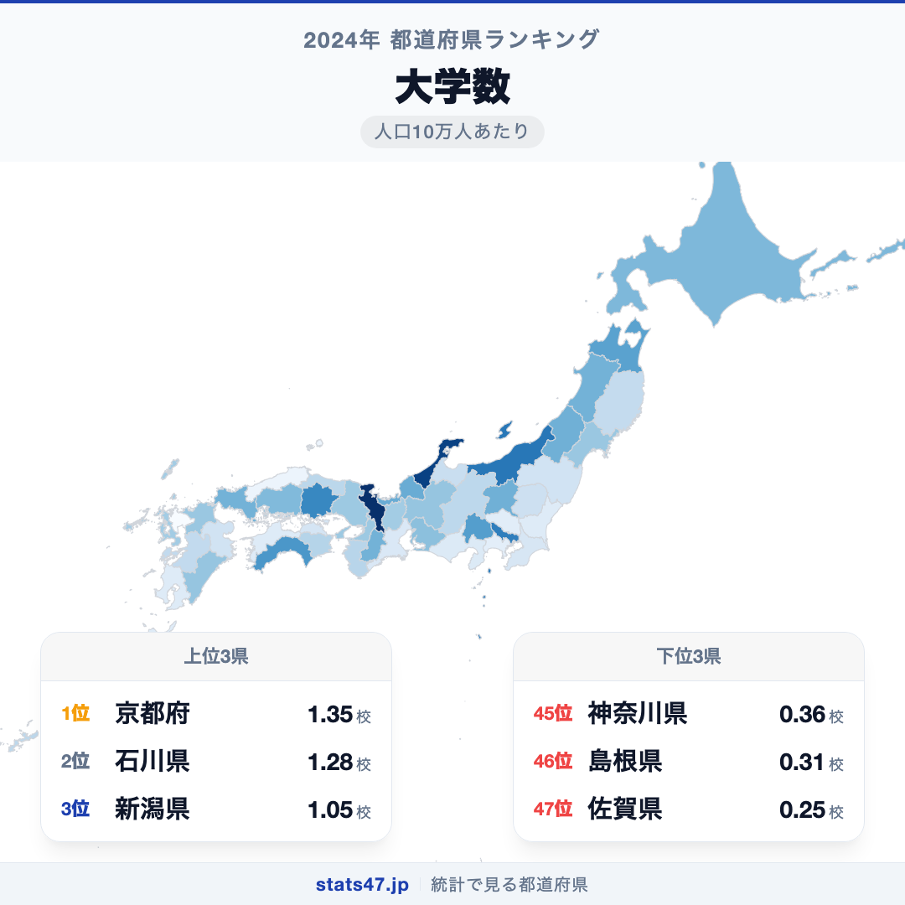
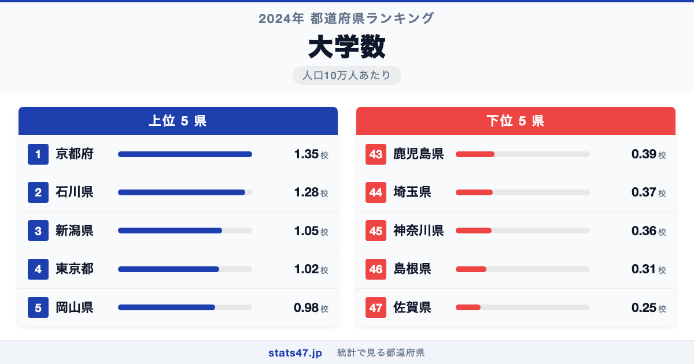
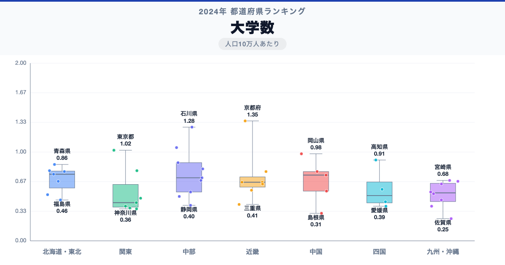

大学が最も多い都道府県はどこか。東京ではありません。人口10万人あたりの大学数で全国1位に立つのは京都府です。1.35校、偏差値79.6。人口約254万人の京都府に、京都大学をはじめ37の大学がひしめいています。

最下位の佐賀県は0.25校で偏差値33.2。京都の約5分の1しかありません。人口規模の小さな県では大学の設置自体が難しく、若者が進学のために県外に流出する構図が浮かび上がります。

「大学数」は、人口10万人あたりの大学の設置数を都道府県別に集計したものです。文部科学省の学校基本調査に基づく2024年度のデータを使用しています。

## データハイライト

全国平均: 0.65校

1位: 京都府（1.35校 / 偏差値 79.6）

47位: 佐賀県（0.25校 / 偏差値 33.2）

全国平均は0.65校で、標準偏差は0.24校。上位と下位の差は5.4倍あり、大学へのアクセスに明確な地域差が存在することを示しています。偏差値60以上の都道府県はわずか5県にとどまり、大学が集中する地域は限られています。

## 【コロプレス地図】日本全国の分布

<!-- note投稿時: この画像行を削除し、images/choropleth-map-1080x1080.png をアップロード -->

地図を見ると、京都府・石川県が濃い色で目を引きます。東京都も上位に入っていますが、人口が多い分、10万人あたりでは京都ほど突出していません。

東北・九州地方は全体的に薄い色が広がっています。特に佐賀県・島根県は極端に薄く、大学の少なさが際立っています。

興味深いのは、人口の多い神奈川県や埼玉県が下位に位置していることです。東京に隣接しているため、都内の大学に通学する学生が多く、県内に大学を設置するインセンティブが弱いという構図があります。

## 上位5：分析

<!-- note投稿時: この画像行を削除し、images/chart-x-1200x630.png をアップロード -->

「学生のまち」として千年の歴史を持つ京都。京都大学・同志社大学・立命館大学をはじめ、小規模な芸術系・仏教系大学まで含めると37校が集積しています。1.35校、偏差値79.6で圧倒的な全国1位です。人口規模に対して大学が極端に多い、日本で最も「大学密度」の高い都市といえます。

石川県は1.28校、偏差値76.6で2位。金沢大学を核に、金沢工業大学・北陸大学など地方としては異例の大学集積を誇ります。加賀藩の学問奨励の伝統が今に受け継がれた結果ともいわれています。

3位の新潟県は1.05校で偏差値66.9。新潟大学を中心に、長岡や上越にも大学が分散して立地しています。面積が広い県だからこそ、地域ごとに高等教育機関を配置してきた経緯があります。

東京都は1.02校、偏差値65.7で4位。大学の絶対数では全国最多ですが、1,400万人の人口で割ると京都には及びません。それでも143校もの大学が集まる世界有数の高等教育都市です。

岡山県が0.98校、偏差値64.0で5位に入っています。岡山大学に加え、岡山理科大学・就実大学など中規模の私立大学が複数あり、中国・四国地方の高等教育のハブとして機能しています。

## 下位5：分析

佐賀県は0.25校で偏差値33.2の全国最下位です。佐賀大学を含めて県内の大学数は限られており、多くの高校生が福岡県をはじめとする県外の大学へ進学しています。隣接する福岡県に大学が集中しているため、佐賀県内に新設する需要が生まれにくい環境です。

46位の島根県は0.31校、偏差値35.7。島根大学と島根県立大学を中心に少数の大学が立地するのみで、人口減少も相まって大学の新設や拡充は難しい状況にあります。

神奈川県が0.36校で偏差値37.9の45位。人口924万人と全国2位の人口を抱えますが、東京都への通学圏であるため、県内の大学数は人口規模に比べて少なくなっています。

44位は埼玉県の0.37校、偏差値38.3。神奈川県と同様に東京のベッドタウンとしての性格が強く、大学進学者の多くが都内へ通学するため、人口あたりの大学数は低い水準です。

鹿児島県は0.39校、偏差値39.1で43位。鹿児島大学を中心とした大学配置ですが、九州南端という地理的条件から大学の集積が進みにくい環境にあります。

## 地域別の傾向

<!-- note投稿時: この画像行を削除し、images/boxplot-1200x630.png をアップロード -->

近畿と北陸が高く、九州と関東の一部が低い傾向です。関東は東京が突出するものの、周辺県が低いため地域平均は中程度に収まっています。全47都道府県の順位は stats47 で確認できます。

## まとめ

大学数の地域差は、高等教育へのアクセス格差を数字で浮き彫りにする指標です。このデータから以下の洞察が得られます。

**京都は「大学密度日本一」の学生都市**

人口254万人に37の大学が集まる京都府は、10万人あたりの大学数で東京都を上回ります。
千年の歴史を持つ学問都市の伝統が、現代の数字にもはっきりと表れています。

**東京近郊の県は「大学不足」に見える**

神奈川県と埼玉県は人口が多いにもかかわらず、大学密度は下位に沈んでいます。
東京の大学に通学できるため県内への大学設置が進まず、結果として人口あたりの数が低くなっています。

**地方の小規模県では大学進学が「県外流出」を意味する**

佐賀県や島根県のように大学が少ない県では、進学がそのまま若者の県外流出につながります。
高等教育のアクセス格差は、将来の人口構成にも影響を及ぼす重要な課題です。

## もっと詳しく知りたい方へ

全47都道府県の順位や、グラフ・地図での可視化は stats47 で見ることができます。

### 大学数ランキング 全都道府県版

https://stats47.jp/ranking/university-count-per-100k

### 大学収容力指数ランキング

https://stats47.jp/ranking/university-capacity-index

### 高等学校卒業者の進学率ランキング

https://stats47.jp/ranking/high-school-advancement-rate

### 最終学歴が大学・大学院卒の割合ランキング

https://stats47.jp/ranking/final-education-university-graduate-school-ratio

### 大学進学と収容力の地域格差（stats47ブログ）

https://stats47.jp/blog/university-advancement-capacity

---

**stats47** は、e-Stat の公的統計データを47都道府県別に可視化するサービスです。
ランキング・散布図・時系列チャートで、地域の違いがひと目でわかります。

https://stats47.jp
