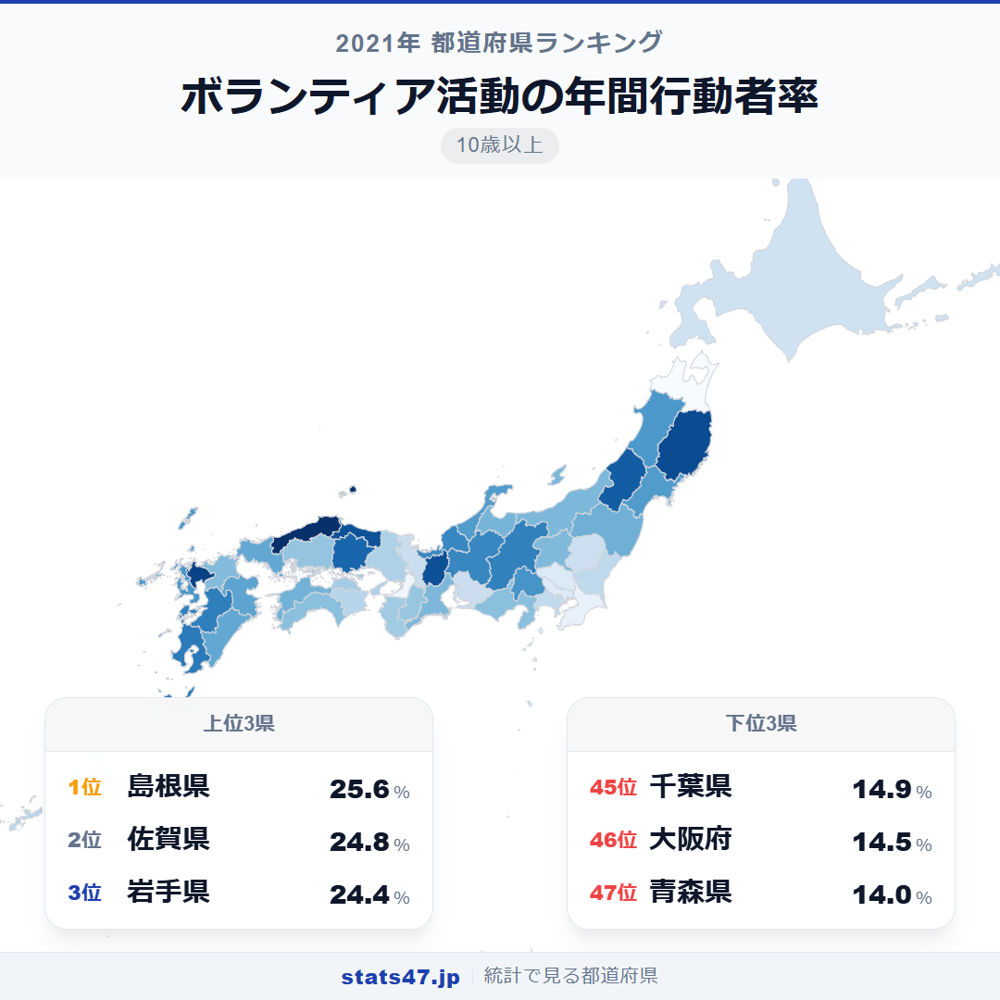
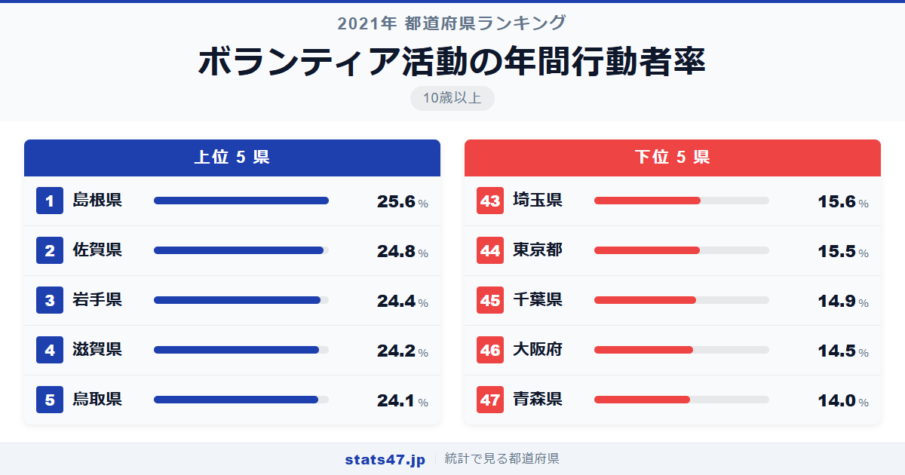
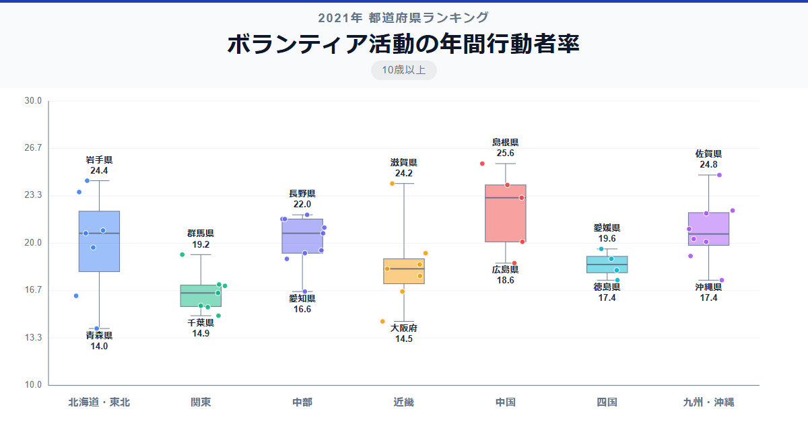

子どもの頃からボランティアに関わる県と、そうでない県。その差はどれくらいあるのでしょうか。10歳以上を対象にしたデータで見ると、全国1位の島根県は偏差値71.3で25.6％。15歳以上のランキングと変わらず島根県がトップを守っています。最下位は青森県で14.0％、その差は1.8倍です。

15歳以上のランキングと比較すると、全体的に数値はやや下がります。10代前半の参加率が大人より低いためですが、順位の大枠はほぼ同じ。子どもを含めても地域差の構造は変わらないことがわかります。

「ボランティア活動の年間行動者率」は、過去1年間にボランティア活動を行った10歳以上の人の割合です。総務省「社会生活基本調査」の2021年データに基づいています。

## データハイライト

全国平均: 19.54％

1位: 島根県（25.6％ / 偏差値 71.3）

47位: 青森県（14.0％ / 偏差値 30.5）

上位5県は島根・佐賀・岩手・滋賀・鳥取で、15歳以上の結果と同じ顔ぶれです。下位も大都市圏と青森県が占め、ボランティア参加の地域差は年齢対象を広げても一貫しています。

## 【コロプレス地図】日本全国の分布

<!-- note投稿時: この画像行を削除し、images/choropleth-map-1080x1080.png をアップロード -->

地図の色分けは15歳以上版とほぼ同じパターンです。山陰地方と九州北部が濃く、首都圏が薄い。この構造は年齢の対象範囲を変えても揺るぎません。

注目すべきは鹿児島県が8位に入っている点。九州の南北で上位に県が分布しており、九州全体でボランティア文化が根付いていることがうかがえます。

中部地方では滋賀県と岐阜県が10位台前半で健闘する一方、愛知県は39位と大きく離れています。同じ中部でも都市化の度合いで参加率に差が出る好例です。

## 上位5：分析

<!-- note投稿時: この画像行を削除し、images/chart-x-1200x630.png をアップロード -->

島根県は偏差値71.3で25.6％。15歳以上の結果から0.5ポイント低下しましたが、依然として2位に0.8ポイント差をつけてトップです。自治会や地域づくり活動が、世代を超えて浸透している証でしょう。

佐賀県が偏差値68.5の24.8％で2位につけました。地域の祭りや清掃活動など、子どもも巻き込んだ地域活動が盛んな県として知られています。

岩手県は3位で偏差値67.1の24.4％。東日本大震災からの復興を経て、幅広い世代が地域支援に関わる文化が定着しました。

滋賀県は偏差値66.4で24.2％、4位に位置しています。琵琶湖の清掃活動には子どもから大人まで参加し、環境教育の一環としてボランティアが浸透している地域です。

5位の鳥取県は偏差値66.0の24.1％。山陰の2県がともにトップ5に入り、人口規模の小さい地域での助け合い文化の強さを示しています。

## 下位5：分析

青森県は偏差値30.5で14.0％と最下位です。冬場の積雪が屋外活動を制約するほか、高齢化の進行で活動の担い手が減少している面も考えられます。

46位の大阪府は偏差値32.2の14.5％。人口は全国3位ですが、都市部では地域のつながりが希薄になりやすく、ボランティア参加の動機づけが弱い傾向があります。

千葉県が45位で偏差値33.6の14.9％。東京通勤圏としての性格が強く、地元コミュニティへの関与が薄くなりがちです。

東京都は44位、偏差値35.8で15.5％。人口最多の都市でありながらこの順位は、「隣に誰が住んでいるか知らない」という都市型生活の裏返しかもしれません。

43位の埼玉県は偏差値36.1で15.6％。千葉県とほぼ同水準で、首都圏のベッドタウンという共通の性格が参加率の低さに表れています。

## 地域別の傾向

<!-- note投稿時: この画像行を削除し、images/boxplot-1200x630.png をアップロード -->

山陰・北陸・九州が高く、関東と近畿の大都市を含む地域が低い傾向です。15歳以上版と地域別の傾向はほぼ変わりません。

## まとめ

ボランティア活動の年間行動者率の地域差は、10歳以上に広げても構造的に変わりません。このデータから以下の洞察が得られます。

**年齢の対象範囲を広げても順位は安定**

15歳以上と10歳以上で上位5県・下位5県の顔ぶれはほぼ同じです。
子どもの参加を含めても、地域差の根本は大人の参加率で決まっていることがわかります。

**人口規模とボランティア参加率は反比例する**

島根県・鳥取県・佐賀県など人口の少ない県が上位を占め、東京都・大阪府が下位に沈む。
コミュニティの規模が小さいほど、一人ひとりの関わりが自然と大きくなります。

**首都圏のベッドタウンは軒並み低い**

埼玉県・千葉県が43位と45位。
通勤先と居住地が離れているため、地元での活動に参加する機会が限られています。

## もっと詳しく知りたい方へ

全47都道府県の順位や、グラフ・地図での可視化は stats47 で見ることができます。

### ボランティア活動の年間行動者率ランキング（10歳以上） 全都道府県版

https://stats47.jp/ranking/volunteer-activity-annual-participation-rate-10plus

### ボランティア活動の年間行動者率ランキング（15歳以上）

https://stats47.jp/ranking/volunteer-activity-annual-participation-rate-15plus

### スポーツの年間行動者率ランキング

https://stats47.jp/ranking/sports-annual-participation-rate-10plus

### 旅行・行楽の年間行動者率ランキング（10歳以上）

https://stats47.jp/ranking/travel-leisure-annual-participation-rate-10plus

### 海外旅行の年間行動者率ランキング（10歳以上）

https://stats47.jp/ranking/overseas-travel-annual-participation-rate-10plus

### サッカーの行動者率ランキング

https://stats47.jp/ranking/sports-participation-rate-soccer

---

**stats47** は、e-Stat の公的統計データを47都道府県別に可視化するサービスです。
ランキング・散布図・時系列チャートで、地域の違いがひと目でわかります。

https://stats47.jp
