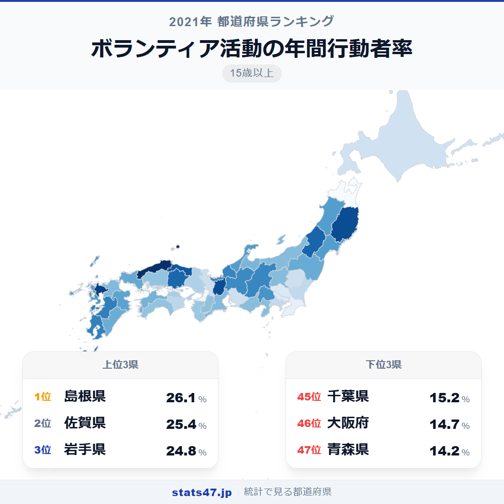
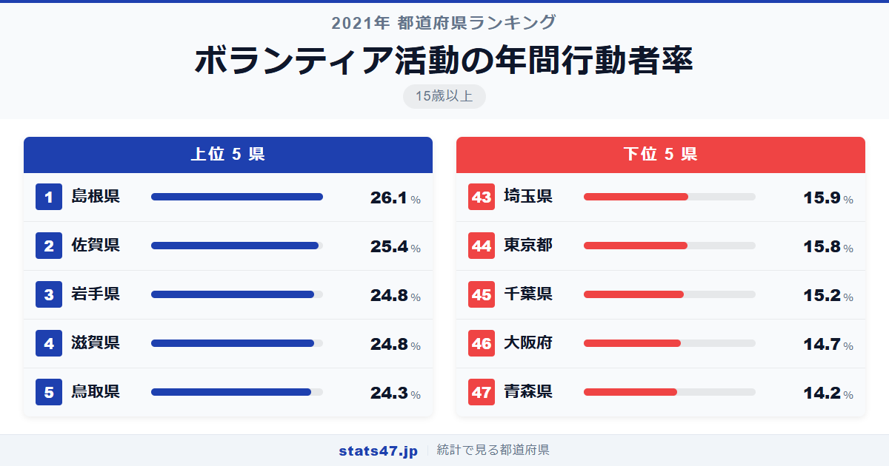
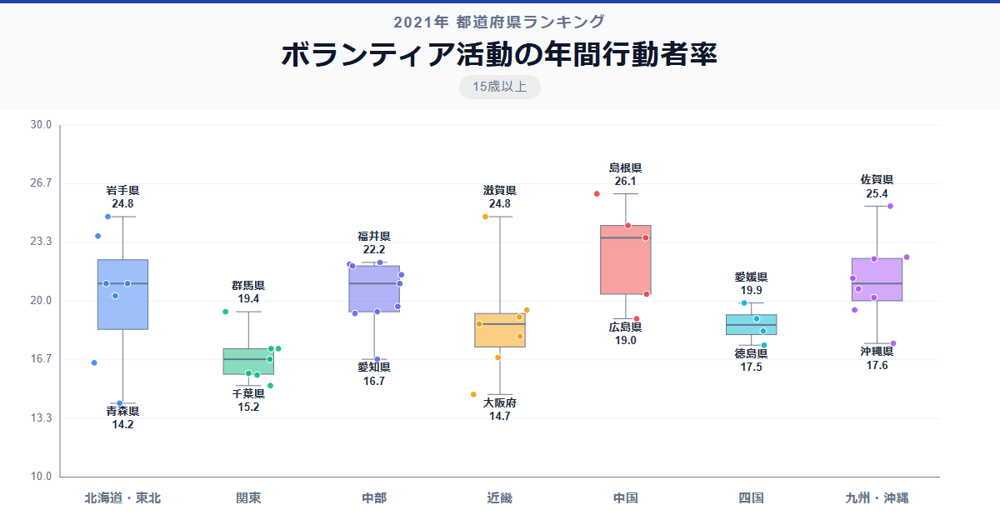

ボランティアが盛んな県といえば、地域の絆が強い地方を思い浮かべるかもしれません。実際に統計データを見ると、全国1位の島根県は偏差値71.7で26.1％。4人に1人以上がボランティア活動に参加しています。一方、最下位の青森県は14.2％にとどまり、その差は1.8倍です。

興味深いのは、東京都や大阪府といった大都市が軒並み低いこと。大都市ほど人が多いのに、ボランティア参加率が低いのはなぜでしょうか。

「ボランティア活動の年間行動者率」は、過去1年間にボランティア活動を行った15歳以上の人の割合を示す指標です。総務省「社会生活基本調査」の2021年データに基づいています。

## データハイライト

全国平均: 19.84％

1位: 島根県（26.1％ / 偏差値 71.7）

47位: 青森県（14.2％ / 偏差値 30.5）

上位には島根県・佐賀県・岩手県など地方圏の県が並び、下位には東京都・大阪府・千葉県など大都市圏が集中しています。地域のつながりが強い土地ほどボランティアが根付いている傾向が読み取れます。

## 【コロプレス地図】日本全国の分布

<!-- note投稿時: この画像行を削除し、images/choropleth-map-1080x1080.png をアップロード -->

地図を見ると、山陰・九州北部・東北の一部が濃い色で目立ちます。島根県・鳥取県が揃って上位に入っているのが特徴的です。

対照的に、首都圏の1都3県はすべて40位台に沈んでいます。関西でも大阪府が46位と低く、都市部の参加率の低さが際立ちます。

中部地方はばらつきが大きく、滋賀県が4位と高い一方で、愛知県は41位。同じ地域でも県ごとの差が大きいのが面白いところです。

## 上位5：分析

<!-- note投稿時: この画像行を削除し、images/chart-x-1200x630.png をアップロード -->

人口約66万人の島根県が、偏差値71.7で26.1％と圧倒的な1位です。過疎化が進む地域だからこそ、住民同士が助け合う文化が日常に溶け込んでいるのでしょう。自治会活動やまちづくりへの参加が活発な土壌があります。

2位の佐賀県は偏差値69.3で25.4％。九州北部は地域の結びつきが強い地域として知られ、佐賀県も町内会や自治会を中心としたボランティア文化が根強く残っています。

3位に岩手県が入りました。偏差値67.2の24.8％で、東日本大震災以降、復興支援を通じた地域活動がさらに活発化した背景がうかがえます。

同率3位の滋賀県も偏差値67.2で24.8％。琵琶湖の環境保全活動をはじめ、自然と共生する地域づくりへの関心の高さが特徴的です。

5位の鳥取県は偏差値65.4の24.3％。島根県のお隣で、山陰地方が揃ってトップ5に入りました。人口の少ない地域ほど一人ひとりの役割が大きく、自然とボランティアへの参加につながっているようです。

## 下位5：分析

最下位の青森県は偏差値30.5で14.2％。全国平均を大きく下回り、冬場の厳しい気候条件が屋外での地域活動を制約している面もありそうです。

46位の大阪府は偏差値32.2の14.7％。都市部特有の匿名性の高さや、地域とのつながりの薄さが参加率の低さにつながっていると考えられます。

千葉県は45位で偏差値34.0の15.2％。東京のベッドタウンとして通勤時間が長く、地元での活動時間が確保しにくい事情がありそうです。

44位の東京都は偏差値36.0で15.8％。人口は最多なのに参加率は低い。単身世帯が多く、地縁的なつながりが薄い大都市ならではの特徴が表れています。

埼玉県は43位で偏差値36.4の15.9％。千葉県と同様に都心への通勤圏であり、居住地での地域活動に時間を割きにくい環境が影響しているのでしょう。

## 地域別の傾向

<!-- note投稿時: この画像行を削除し、images/boxplot-1200x630.png をアップロード -->

山陰・九州北部・東北の一部が高く、関東と近畿の大都市圏が低い傾向です。中部・北陸は全体的に全国平均前後にまとまっています。

## まとめ

ボランティア活動の年間行動者率の地域差は、人口規模や地域コミュニティの強さを映し出しています。このデータから以下の洞察が得られます。

**地方の絆がボランティアを支える**

島根県・鳥取県・佐賀県など人口の少ない県が上位に並びます。
地域のつながりが強い土地では、助け合いが生活の一部として定着しています。

**大都市圏ほどボランティア離れが進む**

東京都・大阪府・千葉県・埼玉県がいずれも40位台。
通勤時間の長さや単身世帯の多さが、地域活動への参加を難しくしています。

**このランキングは15歳以上が対象**

10歳以上を対象にした同様のランキングもあり、子どものボランティア参加を含めた比較ができます。
年齢の対象範囲で順位に変動が出るか、あわせて確認してみてください。

## もっと詳しく知りたい方へ

全47都道府県の順位や、グラフ・地図での可視化は stats47 で見ることができます。

### ボランティア活動の年間行動者率ランキング 全都道府県版

https://stats47.jp/ranking/volunteer-activity-annual-participation-rate-15plus

### ボランティア活動の年間行動者率ランキング（10歳以上）

https://stats47.jp/ranking/volunteer-activity-annual-participation-rate-10plus

### スポーツの年間行動者率ランキング

https://stats47.jp/ranking/sports-annual-participation-rate-10plus

### 旅行・行楽の年間行動者率ランキング（10歳以上）

https://stats47.jp/ranking/travel-leisure-annual-participation-rate-10plus

### 海外旅行の年間行動者率ランキング（10歳以上）

https://stats47.jp/ranking/overseas-travel-annual-participation-rate-10plus

### 野球の行動者率ランキング

https://stats47.jp/ranking/sports-participation-rate-baseball

---

**stats47** は、e-Stat の公的統計データを47都道府県別に可視化するサービスです。
ランキング・散布図・時系列チャートで、地域の違いがひと目でわかります。

https://stats47.jp
