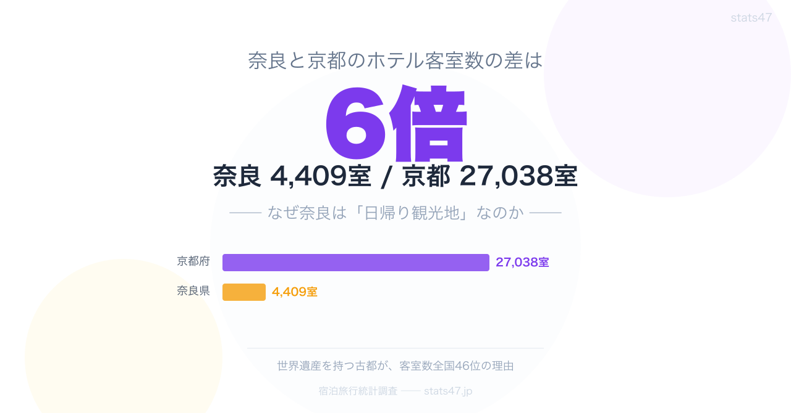

<!-- note投稿時: この画像行を削除し、images/cover-1280x670.png をアップロード -->

奈良県のホテル客室数は全国46位。わずか4,409室です。

隣の京都府は27,038室で全国12位。その差は約6倍。同じ関西の古都でありながら、宿泊インフラの規模はまるで別世界です。

世界遺産を複数抱え、国内外の観光客が押し寄せる奈良が、なぜここまでホテルが少ないのか。

データを並べると、「日帰り観光地」の構造が浮かび上がります。

## 客室数から見る奈良の位置付け

ホテル客室数の上位5県を見てみます。

1位 東京都 110,641室
2位 大阪府 71,193室
3位 北海道 66,817室
4位 福岡県 42,470室
5位 沖縄県 35,823室

上位はビジネス需要の大きい大都市か、長期滞在型のリゾート地です。

一方の奈良県は4,409室で46位。下には徳島県（3,195室）しかいません。ホテル営業施設数も66施設で44位です。

比較対象として京都府を並べると、客室数27,038室（12位）、施設数269（14位）。客室数で約6倍、施設数で約4倍の開きがあります。

## 「大阪から近すぎる」という構造

奈良のホテルが少ない最大の要因は、立地にあります。

大阪の難波から近鉄奈良駅まで約35分。京都駅からも近鉄で約45分。関西の二大都市圏から日帰りで十分に回れる距離です。

観光客にとって「奈良に泊まる理由」が構造的に生まれにくい。大阪や京都に宿泊拠点を置いて、日中だけ奈良を訪れるパターンが定着しています。

延べ宿泊者数を見ると、この構造がはっきりします。

京都府は約2,854万人泊で全国4位。奈良県は約229万人泊で全国43位。同じ古都でも、宿泊者数には12倍以上の差があります。

大阪府は約5,003万人泊で全国2位。奈良を訪れる観光客の多くは、この大阪のホテルに吸収されていると考えられます。

## 元県庁職員の視点から

行政の現場では、奈良の「素通り観光」は長年の課題として認識されています。

奈良公園周辺の主要観光地は、半日あれば一通り回れてしまう。東大寺、春日大社、興福寺、奈良公園と鹿。コンパクトにまとまっている利便性が、逆に「泊まらなくていい」という判断につながっています。

宿泊施設の誘致にも壁があります。世界遺産バッファゾーンや景観条例による建築規制が厳しく、大規模ホテルの新設が難しい。奈良公園周辺は高さ制限の制約が大きく、投資家にとって採算が見込みにくい地域です。

県は吉野や十津川といった南部エリアへの誘客を推進していますが、交通アクセスの課題もあり、劇的な変化には至っていません。

## 稼働率から見える実態

客室数が少ないなら、せめて稼働率は高いのか。データを確認します。

客室稼働率の上位5県はこちらです。

1位 東京都 80.4%
2位 大阪府 77.9%
3位 福岡県 75.0%
4位 神奈川県 72.8%
5位 京都府 72.3%

ビジネス需要と観光需要が重なる大都市圏が上位を占めています。

奈良県は60.3%で40位。客室が少ないうえに、その客室も満室とは言えない状況です。

京都府は72.3%で5位。「客室は多いが常に混雑」という、奈良とは正反対の構造です。

この差はビジネス需要の有無が大きいと考えられます。京都は企業拠点や大学を抱え、平日のビジネス宿泊が底支えしています。奈良は観光特化型のため、平日と休日の波が激しくなります。

## インバウンドの光と影

外国人延べ宿泊者数では、京都府が約1,410万人泊で全国3位。一方の奈良県は約35万人泊で30位です。

「京都や大阪に泊まって奈良に日帰りする」という行動パターンが、インバウンドでも顕著です。

ただし30位という順位は、客室数46位と比べれば健闘しているとも読めます。少ない客室にインバウンド需要が入り込んでいる状態です。

## 3つの発見

データを並べて見えてきたことを整理します。

**1. 奈良の「ホテルが少ない」は、需要不足ではなく構造の問題**
大阪・京都という巨大な宿泊拠点に挟まれた立地が、奈良に泊まる動機を奪っています。

**2. 客室数だけでなく稼働率も低迷**
46位の客室数に対し、稼働率も40位。「少ないが満室」ではなく、「少なくて空いている」のが実態です。

**3. インバウンドは相対的に健闘**
外国人宿泊者数30位は、客室数46位の県としては悪くない数字です。外国人旅行者の「奈良に泊まりたい」ニーズは潜在的に存在しています。

奈良の観光戦略は、「日帰りでも来てもらえる」強みと、「泊まってもらえない」弱みの両面を抱えています。この構造を変えるには、南部エリアの開発やナイトコンテンツの充実など、「夜の奈良」の魅力づくりが鍵になりそうです。

## もっと詳しく

### ホテル客室数ランキング ── 全47都道府県版

https://stats47.jp/ranking/number-of-hotel-rooms

### ホテル営業施設数ランキング

https://stats47.jp/ranking/number-of-hotel-facilities

### 客室稼働率ランキング

https://stats47.jp/ranking/room-utilization-rate

### 延べ宿泊者数ランキング

https://stats47.jp/ranking/total-overnight-guests

### 外国人延べ宿泊者数ランキング

https://stats47.jp/ranking/total-overnight-guests-foreign

### 県内総生産額（宿泊・飲食サービス業）ランキング

https://stats47.jp/ranking/gross-prefectural-product-accommodation-food-h27

---

**stats47** は、e-Stat の公的統計データを47都道府県別に可視化するサービスです。
ランキング・散布図・時系列チャートで、地域の違いがひと目でわかります。

https://stats47.jp
