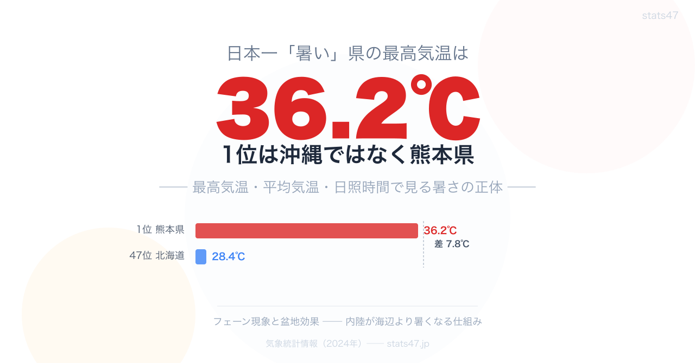

<!-- note投稿時: この画像行を削除し、images/cover-1280x670.png をアップロード -->

「日本一暑い県はどこですか？」

こう聞かれたら、多くの人が「沖縄」と答えるのではないでしょうか。

しかし、データが示す答えは違います。

2024年の最高気温ランキングで1位になったのは熊本県。36.2度です。

沖縄県は33.9度で、なんと26位。47都道府県の中で真ん中より下です。

「一年中暑い県」と「夏にとんでもなく暑くなる県」は、まったく違う存在なのです。

## 最高気温トップ5 ── 沖縄は圏外

2024年の最高気温を都道府県別に見てみます。

1位 熊本県 36.2度
2位 山口県 35.9度
3位 愛知県 35.8度
4位 岐阜県 35.7度
4位 岡山県 35.7度
4位 佐賀県 35.7度

上位を占めるのは九州北部、中部、瀬戸内海沿いの県です。沖縄県は26位で、北海道（47位・**28.4度**）を除くと下から数えたほうが早い位置にいます。

一方、年平均気温のランキングは様相が一変します。

1位 沖縄県 24.4度
2位 鹿児島県 20.4度
3位 宮崎県 19.3度

沖縄県は年平均気温では2位に4度の大差をつけて圧倒的な1位です。

## 「暑さ」にも種類がある

このデータが示しているのは、「暑さ」には少なくとも2つの種類があるということです。

ひとつは **「年間を通じた暖かさ」** 。年平均気温が高い県は、冬も温暖で、一年中過ごしやすい気候です。沖縄県がこの代表です。

もうひとつは **「夏のピークの猛烈さ」** 。最高気温が高い県は、夏場に極端な高温になります。熊本県や岐阜県がこちらに該当します。

最高気温1位の熊本県は、年平均気温では5位（**18.9度**）。最高気温3位の愛知県に至っては、年平均気温では20位（**17.9度**）まで下がります。

つまり、夏の暑さと年間の暖かさはまったく別の指標なのです。

実際、最高気温と年平均気温の相関係数は -0.06。統計的にほぼ無関係です。「夏暑い県は年間通じても暑い」というイメージは、データによって否定されます。

## 日照時間という第三の指標

「暑い」と感じる要因はもうひとつあります。日照時間です。

2024年の年間日照時間ランキングを見てみます。

1位 高知県 2,309時間
2位 群馬県 2,285時間
3位 埼玉県 2,278時間
4位 静岡県 2,246時間
5位 愛知県 2,243時間

最高気温上位の愛知県や埼玉県は日照時間でもトップ5に入っています。一方、最高気温1位の熊本県は日照時間では25位（**2,072時間**）、沖縄県は43位（**1,758時間**）と下位に沈みます。

沖縄県は曇天が多く、直射日光の時間は短い。それでも年平均気温が高いのは、海洋性気候による冬場の底上げ効果が大きいためです。

## なぜ内陸が暑いのか ── フェーン現象と盆地効果

最高気温の上位には、海沿いではなく内陸や盆地の県が目立ちます。岐阜県（**4位**）、京都府（**8位**）、埼玉県（**11位**）、山梨県（**15位**）。

これにはいくつかの気象メカニズムが関係しています。

まず **フェーン現象** です。山を越えた空気が乾燥しながら下降するとき、温度が急上昇します。岐阜県や山口県はこの影響を強く受けます。

次に **盆地効果** です。四方を山に囲まれた盆地では、熱がこもりやすく放射冷却が妨げられます。京都府や山梨県が典型例です。

さらに **都市のヒートアイランド現象** も加わります。アスファルトやコンクリートに覆われた都市部は、周辺より気温が数度高くなります。大阪府（**10位**）、埼玉県（**11位**）はこの影響も受けています。

海に囲まれた沖縄県は海風が常に吹き、極端な高温にはなりにくい。内陸部の県とはまったく異なる暑さの構造を持っているのです。

## 行政が向き合う「暑さ」の違い

暑さの種類が違えば、対策も異なります。

県庁で防災や健康増進の予算に関わった経験からすると、最高気温が高い県では夏のピーク時の熱中症対策が最重要課題になります。公共施設へのクーリングシェルター設置、屋外作業の時間制限、学校行事の時期見直し。短期集中型の対策が求められます。

一方、沖縄県のように年間を通じて気温が高い地域では、建築基準やエネルギー消費の構造自体が異なります。断熱よりも通風、暖房よりも冷房が住宅設計の基本です。

同じ「暑い県」でも、住民が日常的に体感する暑さと、行政が対策すべき暑さは異なるのです。

## まとめ ── 3つの発見

ここまでのデータから、3つのことがわかりました。

ひとつ目は、最高気温1位は沖縄県ではなく熊本県であること。「日本一暑い」の定義次第で答えが変わります。

ふたつ目は、最高気温と年平均気温はほぼ無関係であること。夏の猛暑と年間の暖かさは、別の気象メカニズムで決まります。

みっつ目は、内陸・盆地の県が最高気温上位に集中すること。フェーン現象や盆地効果が、海洋性気候の沖縄以上に極端な暑さを生み出しています。

「日本一暑い県」は、何をもって暑いと定義するかで変わる。その違いを知ることが、気候を理解する第一歩です。

## もっと詳しく

### 最高気温ランキング ── 全47都道府県版

https://stats47.jp/ranking/maximum-temperature

### 年平均気温ランキング

https://stats47.jp/ranking/average-temperature

### 最低気温ランキング

https://stats47.jp/ranking/lowest-temperature

### 年間日照時間ランキング

https://stats47.jp/ranking/annual-sunshine-duration

### エアコンの消費量ランキング

https://stats47.jp/ranking/air-conditioner-consumption-quantity

---

**stats47** は、e-Stat の公的統計データを47都道府県別に可視化するサービスです。
ランキング・散布図・時系列チャートで、地域の違いがひと目でわかります。

https://stats47.jp
