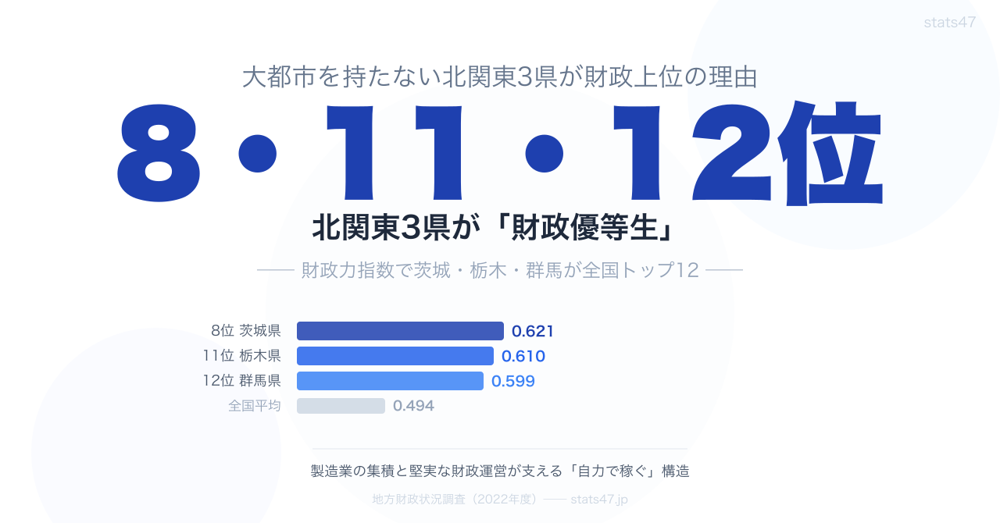

<!-- note投稿時: この画像行を削除し、images/cover-1280x670.png をアップロード -->

財政力指数のランキングを見ると、上位にはおなじみの顔ぶれが並びます。

東京、愛知、神奈川、千葉、大阪。

ここまでは「まあそうだろう」と納得できます。

しかし8位に茨城県、11位に栃木県、12位に群馬県。

北関東3県が揃って全国トップ12に入っているのは、意外に感じる人も多いのではないでしょうか。

人口で見ると茨城県11位、栃木県19位、群馬県18位。

大都市を持たず、全国的な知名度も決して高くない3県が、なぜ財政では「優等生」なのか。

2022年度のデータで見ていきます。

## 3県の財政力を数字で確認

まずは主要指標を並べてみます。

**財政力指数**

- 茨城県 0.621（8位）
- 栃木県 0.610（11位）
- 群馬県 0.599（12位）
- 全国平均 0.494

**地方債現在高比率**

- 茨城県 163.0%（22位）
- 栃木県 117.7%（44位）
- 群馬県 136.4%（37位）
- 全国平均 154.7%

**地方税割合**

- 茨城県 35.4%（8位）
- 栃木県 31.5%（16位）
- 群馬県 31.6%（15位）

**地方交付税割合**

- 茨城県 15.3%（35位）
- 栃木県 14.3%（37位）
- 群馬県 15.2%（36位）

3県とも財政力指数は全国平均0.494を大きく上回り、地方税割合が30%以上、交付税割合が16%以下。

「自力で稼ぐ力がある」構造と言えます。

特筆すべきは栃木県の地方債比率117.7%で全国44位。

財政力が高いだけでなく、借金も全国最低クラスという、バランスの良い財政構造になっています。

## 秘密1: 製造業の集積

北関東3県の財政力の背景にあるのは、製造業の集積です。

**茨城県**

日立市の日立グループ、つくば市の研究開発拠点、鹿島臨海工業地帯の石油化学コンビナート。

日立・鹿島・つくばの3つの産業クラスターが安定した法人税収をもたらしていると考えられます。

**栃木県**

宇都宮市周辺にホンダ、日産、スバルなどの自動車関連工場が集積。

足利市・佐野市には精密機械メーカーも多く、製造品出荷額は全国上位です。

**群馬県**

太田市のスバル本工場を中心に、自動車産業のサプライチェーンが県内に広がっています。

伊勢崎市や前橋市にも食品・化学メーカーの工場が立地しています。

3県に共通するのは、 **「東京から100km圏内」** という立地の良さです。

東京に近すぎず遠すぎない距離が、物流コストを抑えつつ広い工業用地を確保できる条件を満たしています。

## 秘密2: 地方税の安定

3県の地方税割合を見ると、茨城35.4%で全国8位、群馬31.6%で15位、栃木31.5%で16位。

いずれも全国上位です。

地方交付税割合はそれぞれ15.3%、15.2%、14.3%で、いずれも低水準。

地方税が交付税の2倍以上あり、「国に頼らず自力で稼ぐ」構造が確立しています。

これは単に大企業があるからではなく、中小の製造業が裾野広く立地していることが大きい、と見ることができます。

特定企業への依存度が低く、景気変動に対する耐性も高い構造です。

## 秘密3: 借金の少なさ（特に栃木）

栃木県の地方債比率117.7%は全国44位で、47都道府県中でも突出して低い水準です。

群馬県の136.4%も37位で全国平均を大きく下回ります。

茨城県は163.0%で22位と、他の2県と比べると高めです。

これは鹿島臨海工業地帯や圏央道の整備など、大規模インフラ投資の影響と考えられます。

ただし全国平均154.7%と比べると大きな差ではありません。

栃木県が借金を抑えられた背景には、大規模プロジェクトを慎重に選別してきた堅実な行政運営があると言われます。

財政力8位の茨城と11位の栃木で地方債比率が22位と44位に大きく分かれるのは、「稼ぐ力」と「借金の多さ」が必ずしも一致しないことの好例です。

## 歳出構造にも個性がある

3県の歳出構造を比較すると、それぞれ異なる個性が見えてきます。

**教育費割合**

- 茨城県 20.7%（5位）
- 栃木県 19.3%（10位）
- 群馬県 18.2%（17位）

**商工費割合**

- 茨城県 11.8%（28位）
- 栃木県 18.6%（6位）
- 群馬県 18.8%（5位）

**農林水産業費割合**

- 茨城県 3.8%（34位）
- 栃木県 3.8%（33位）
- 群馬県 3.5%（37位）

茨城県は教育費5位と教育重視。

一方、栃木県と群馬県は商工費が全国6位・5位と産業振興に力を入れています。

同じ北関東でも、茨城は「教育投資で人材を育てる」、栃木・群馬は「産業振興で企業を支える」という異なる戦略が読み取れます。

## 北関東 vs 南関東

同じ関東でも、南関東（東京・神奈川・千葉・埼玉）と北関東では財政構造が異なります。

南関東は人口集中と第三次産業が財政力を支えています。

北関東は製造業が財政力の柱です。

地方債比率で見ると、栃木117.7%は神奈川129.5%より低く、群馬136.4%は千葉136.8%とほぼ同水準。

北関東のほうが「堅実」と言えるケースもあります。

埼玉県は財政力6位の0.739と高水準ですが、地方債比率は170.2%で13位。

首都圏の中で最も借金が多く、ベッドタウンとしての都市基盤整備の負担が見えます。

北関東3県のほうが財政バランスは良好です。

## 元県庁職員の目から見た北関東財政

筆者は以前、県庁で統計や財政資料の仕事に関わっていました。

「地方債比率」や「財政力指数」という数字は、現場にいると「県の体力」を測る温度計のように感じられます。

栃木の地方債比率が44位という数字を見ると、財政課が毎年の地方債発行額を抑えるためにどれほど細かく起債計画を詰めているかが想像できます。

「借りられる額だから借りる」のではなく「将来の償還負担まで逆算して絞る」という実務の積み重ねが、こうした全国ランキングに現れます。

派手な成長戦略を打ち出しやすい自治体と、地味でも堅実に運営する自治体。

北関東3県はどちらかと言えば後者の系譜で、数字がそれを静かに裏付けています。

## e-Stat での探し方

地方財政のデータは、政府統計ポータル e-Stat から誰でも無料で確認できます。

1. e-Stat（[https://www.e-stat.go.jp](https://www.e-stat.go.jp)）にアクセス
2. 統計データを探す → 分野「地方財政」を選択
3. 調査名「地方財政状況調査」
4. 「都道府県・指定都市別」「普通会計の状況」などを選択

ただ、地方財政のデータは項目が細かく、財政力指数・経常収支比率・地方債残高など指標も多数。

CSV をダウンロードしても項目名が専門的で、都道府県間の比較や時系列の可視化には別途の整形が必要になります。

「3県を横並びで比較したい」「歳出の内訳を見たい」という用途には、少し手間がかかる構造です。

## stats47 なら整形済み

stats47.jp では、地方財政のデータを47都道府県ランキング・散布図・時系列チャートで整形済みの形で公開しています。

財政力指数、地方債比率、地方税割合、商工費割合、経常収支比率など、この記事で取り上げた指標をそのまま比較できます。

「財政力が高く、借金も少ない県はどこか」「教育費に力を入れている県はどこか」といった問いに、複数指標を重ねて答えられる構成です。

## まとめ

北関東3県が財政上位にある理由は、3つの側面に整理できます。

1. **東京100km圏の製造業集積** ── 広い工業用地と物流の利便性が工場を呼び込み、安定した法人税収を生んでいる
2. **特定企業に依存しない産業構造** ── 中小製造業が裾野広く立地し、景気変動への耐性が高い
3. **堅実な財政運営** ── 特に栃木県は借金を全国最低クラスに抑え、稼いだ分を蓄えに回す構造

大都市を持たなくても、製造業の集積と堅実な運営があれば全国上位の財政力を維持できる。

北関東3県は、その実例として読むことができます。

## もっと詳しく

各指標の全47都道府県ランキングは stats47 で確認できます。

### 財政力指数ランキング

https://stats47.jp/ranking/fiscal-strength-index-prefecture

### 地方債現在高比率ランキング

https://stats47.jp/ranking/local-debt-current-ratio

### 地方税割合ランキング

https://stats47.jp/ranking/local-tax-ratio-pref-finance

### 商工費割合ランキング

https://stats47.jp/ranking/commerce-industry-expenditure-ratio-pref-finance

### 経常収支比率ランキング

https://stats47.jp/ranking/current-balance-ratio

---

**stats47** は、e-Stat の公的統計データを47都道府県別に可視化するサービスです。

ランキング・散布図・時系列チャートで、地域の違いがひと目でわかります。

https://stats47.jp
