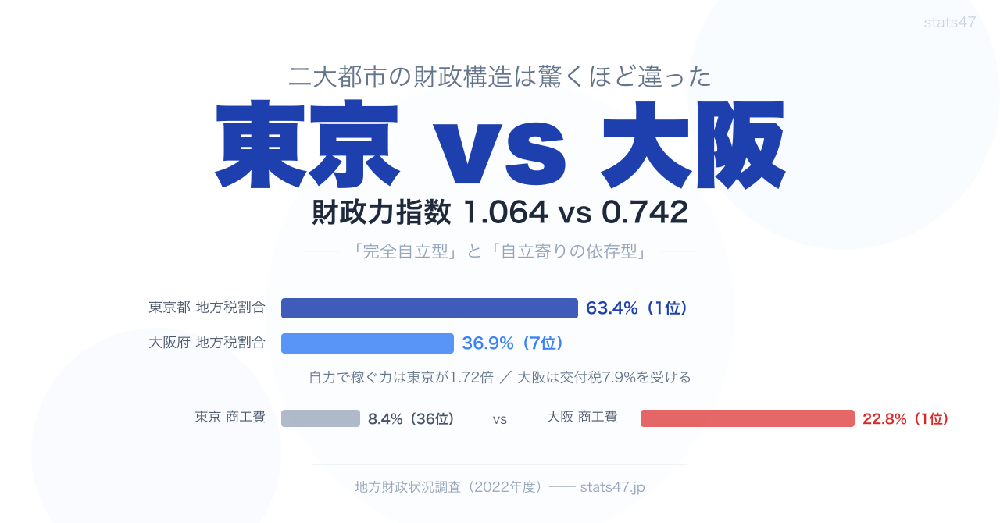

<!-- note投稿時: この画像行を削除し、images/cover-1280x670.png をアップロード -->

日本の二大都市、東京と大阪。

どちらも大都市で経済規模も大きい。

しかし財政構造を数字で比較すると、驚くほどの違いがあります。

ひと言でまとめると、東京都は「完全自立型」、大阪府は「自立寄りの依存型」。

似て非なる二大都市の財政の姿を、2022年度のデータで比較します。

## 基本指標の比較

まずは主要指標を並べてみます。

**財政力指数**

- 東京都 1.064（1位）
- 大阪府 0.742（5位）
- 東京が1.43倍

**地方債現在高比率**

- 東京都 41.6%（47位）
- 大阪府 126.7%（41位）
- 大阪が3.0倍

**地方税割合**

- 東京都 63.4%（1位）
- 大阪府 36.9%（7位）
- 東京が1.72倍

**地方交付税割合**

- 東京都 0%（47位）
- 大阪府 7.9%（44位）
- 東京はゼロ

**一般財源割合**

- 東京都 68.1%（1位）
- 大阪府 49.9%（42位）
- 東京が1.37倍

ほぼすべての指標で東京都が大阪府を上回っています。

特に象徴的なのは「交付税ゼロ」です。

東京都は全国で唯一、国からの地方交付税を受け取っていません。

自前の税収だけで行政運営を賄える唯一の自治体です。

大阪府も全国5位の財政力ですが、交付税を7.9%受け取っています。

「日本第二の都市」でさえ、国の支援なしでは財政が回らない。

これが東京一極集中の財政面での実態です。

## 歳入構造 ──「自力63%」vs「自力37%」

最も差が大きいのが地方税割合です。

東京都は歳入の63.4%が地方税。

法人住民税、個人住民税、固定資産税など、都が自ら集める税金です。

残り36.6%は国庫支出金や都債など。

大阪府は歳入の36.9%が地方税。

東京の約6割の水準です。

不足分は交付税7.9%や国庫支出金、府債で補っています。

なぜこれほど差があるのか。

背景の一つとしてよく指摘されるのが法人住民税です。

上場企業の本社は東京に集中しており、法人関連の税収に大きな差が生まれやすい構造があります。

一般財源の割合でも東京は68.1%で1位、大阪は49.9%で42位。

東京は使い道が自由なお金が7割近いのに対し、大阪は半分以下。

予算の自由度にも大きな差があります。

## 歳出構造 ── 産業投資に表れる個性

歳出の使い方にも両都市の個性が出ています。

**教育費割合**

- 東京都 12.2%（47位）
- 大阪府 14.2%（44位）

**商工費割合**

- 東京都 8.4%（36位）
- 大阪府 22.8%（1位）

**農林水産業費割合**

- 東京都 0.3%（47位）
- 大阪府 0.4%（46位）

最も目を引くのは商工費の差です。

大阪府は22.8%で全国1位、東京都は8.4%で36位。

大阪は歳出の約4分の1を産業振興に投じています。

これは大阪の危機感の表れとも読み取れます。

東京に本社が流出し続ける中、中小企業の支援や産業振興に予算を重点配分して経済基盤を守ろうとしている姿勢が数字に表れています。

東京都は商工費割合が低いですが、歳出総額自体が他県の何倍もあるため、絶対額では大阪を上回ります。

割合が低くても金額は十分、という東京の余裕がここにも見えます。

教育費は両都市とも低い割合ですが、理由が異なると考えられます。

東京は歳出総額が大きいため割合が下がる。

大阪は商工費の割合が高いため、相対的に教育費が圧迫されやすい構造になっています。

## 借金の構造 ──「借りない東京」vs「借りすぎない大阪」

地方債比率は東京都が41.6%で全国最低、大阪府が126.7%で41位。

東京は借金の3倍の規模で自力の税収があるため、そもそも借りる必要が乏しい構造です。

大阪は借金が歳入規模を超えていますが、全国平均154.7%を大きく下回っており、「都市部としては健全」と言える水準です。

興味深いのは、大阪の地方債比率が同規模の他府県より低いことです。

埼玉県170.2%、福岡県172.7%、兵庫県162.5%と比べると、大阪の126.7%は突出して低い。

財政規律の強化が数字に表れています。

## 東京と大阪の「同じところ」

違いばかりではありません。

共通点もあります。

**農林水産業費はどちらもほぼゼロ。**

東京0.3%、大阪0.4%。

大都市として農業への歳出が極めて限られている点は同じです。

**教育費割合はどちらも下位。**

東京47位、大阪44位。

大都市は歳出項目が多岐にわたるため、教育費の割合が相対的に低くなりやすい傾向があります。

## 元県庁職員の目から見た二大都市

筆者は以前、県庁で統計と財政の仕事に関わっていました。

地方自治体の財政担当者の間では「東京都は別格」というのは共通認識です。

交付税を受けない団体（不交付団体）という立場は、他の46都道府県から見ると文字通り異次元で、「交付税に頼らず予算を組める」というだけで、予算編成の自由度がまったく違います。

一方で大阪府の商工費22.8%・全国1位という数字は、現場の危機感の強さを数字が写し出しているように感じます。

本社機能の流出、法人税収の伸び悩み、それでも大都市としてのインフラを維持しなければならない状況。

「東京に追いつく」のではなく「大阪としてどう生き残るか」を問い続けてきた自治体の選択が、この数字の裏にはあるはずです。

## e-Stat での探し方

地方財政のデータは、政府統計ポータル e-Stat から誰でも無料で確認できます。

1. e-Stat（[https://www.e-stat.go.jp](https://www.e-stat.go.jp)）にアクセス
2. 統計データを探す → 分野「地方財政」を選択
3. 調査名「地方財政状況調査」
4. 「都道府県・指定都市別」「普通会計の状況」などを選択

ただ、地方財政のデータは項目が細かく、財政力指数・地方債残高・歳入歳出の内訳など指標も多数に分かれます。

ダウンロードできる CSV は項目名が専門的で、東京と大阪を横並びで比較するには別途の整形が必要になります。

「二大都市を1枚のチャートで比べたい」という用途には、少し手間がかかる構造です。

## stats47 なら整形済み

stats47.jp では、地方財政のデータを47都道府県ランキング・散布図・時系列チャートで整形済みの形で公開しています。

財政力指数、地方税割合、商工費割合、地方債比率、経常収支比率など、この記事で取り上げた指標をそのまま比較できます。

東京と大阪だけでなく、愛知・神奈川・福岡など他の大都市圏と重ねて見ることで、「東京だけが特殊なのか」「大阪は大都市の中でどう位置づけられるのか」を複数の角度から検討できます。

## まとめ

数字で比較すると、東京と大阪は「同じ大都市」ではなく、構造的に異なる自治体です。

東京は圧倒的な税収で自立し、借金も少ない。

大阪は税収では東京に及ばないものの、産業振興に歳出を集中させ、借金も同規模都市と比べて抑制している。

「東京に追いつく」のではなく、「大阪らしい強みを活かす」という戦略が、歳出構造の数字から読み取れます。

## もっと詳しく

各指標の全47都道府県ランキングは stats47 で確認できます。

### 財政力指数ランキング

https://stats47.jp/ranking/fiscal-strength-index-prefecture

### 地方税割合ランキング

https://stats47.jp/ranking/local-tax-ratio-pref-finance

### 商工費割合ランキング

https://stats47.jp/ranking/commerce-industry-expenditure-ratio-pref-finance

### 地方債現在高比率ランキング

https://stats47.jp/ranking/local-debt-current-ratio

### 経常収支比率ランキング

https://stats47.jp/ranking/current-balance-ratio

---

**stats47** は、e-Stat の公的統計データを47都道府県別に可視化するサービスです。

ランキング・散布図・時系列チャートで、地域の違いがひと目でわかります。

https://stats47.jp
