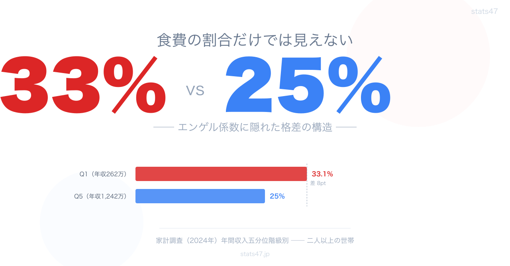
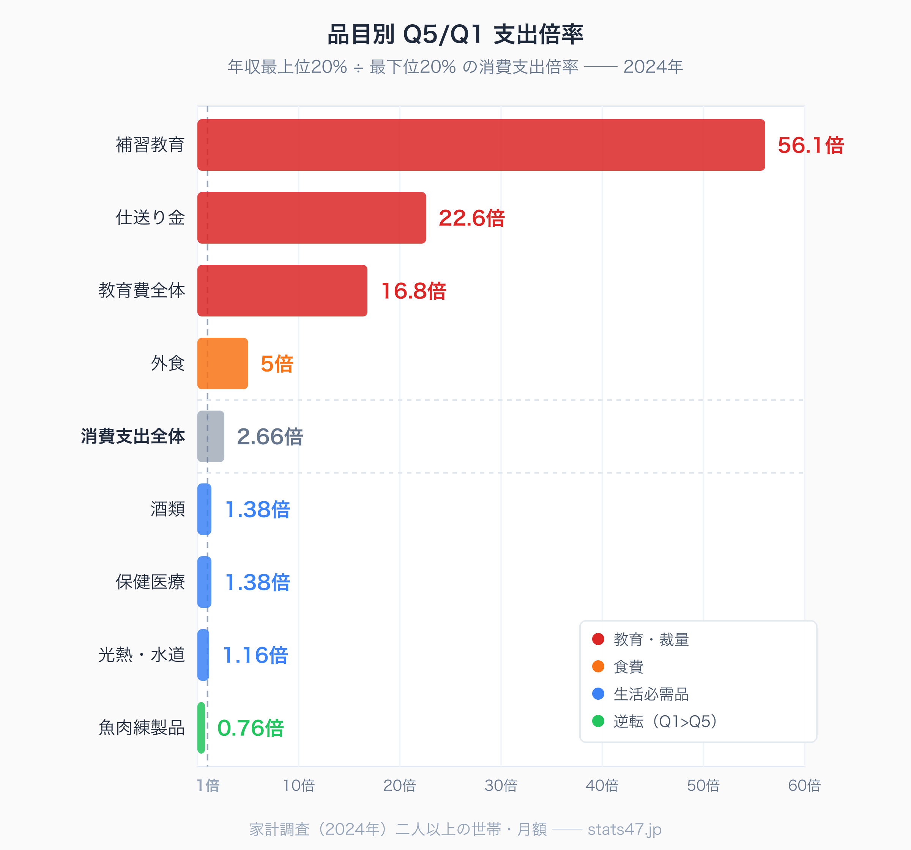

<!-- note投稿時: この画像行を削除し、images/cover-1280x670.png をアップロード -->

エンゲル係数、という言葉を覚えていますか。

社会科の教科書で「豊かになるほど低くなる指標」として習った、あの数字です。食費が家計に占める割合を見れば、その家庭の豊かさがわかる──そんな説明だったはずです。

ところが最新の家計調査を見ると、教科書どおりではない現実が浮かび上がってきます。

2024年の日本で、最も年収の低い層（Q1）のエンゲル係数は**33.1%**。最も年収の高い層（Q5）のエンゲル係数は**25.0%**。その差はわずか**8ポイント**です。

一方で、Q1とQ5の年収差は**4.74倍**。消費支出総額の差は**2.66倍**。

年収は5倍近く違うのに、エンゲル係数の差は8ポイントしかない。

この矛盾の奥に、日本の階層構造を説明する数字が隠れています。補習教育で**56倍**、仕送り金で**22倍**、外食で**5倍**、しかし光熱費では**1.16倍**しか違わない──。支出の品目ごとに、まったく違う「格差の地図」が広がっていたのです。

この記事では、家計調査の五分位階級別データを使って、その地図を一枚ずつめくっていきます。

## 五分位階級という「ものさし」

家計調査では、全国の二人以上世帯を年間収入の順に並べ、5つの層（五分位階級）に分けて集計しています。

2024年の各階層の平均年収は次のとおりです。

- Q1（最低所得層）: **262万円**
- Q2: **404万円**
- Q3: **562万円**
- Q4: **759万円**
- Q5（最高所得層）: **1,242万円**

Q5はQ1の**4.74倍**。日本社会の中で、これだけの年収格差が現実に存在しています。

では、それぞれの階層は1か月にいくら使っているのか。消費支出の総額を見るとこうなります。

- Q1: 月額**18.7万円**
- Q5: 月額**49.7万円**

倍率は**2.66倍**。年収差の4.74倍と比べると、消費の差はやや小さい。高所得層は収入の一部を貯蓄や投資、住宅ローンに回しているため、消費支出だけで見ると差が圧縮されているわけです。

そして、この消費支出のうち食費が占める割合がエンゲル係数です。

## エンゲル係数の「常識」は崩れている

教科書のエンゲル係数は「低いほど豊か」と教わります。

ではデータで確認してみましょう。

- Q1（262万円）: **33.1%**
- Q2（404万円）: **28.0%**
- Q3（562万円）: **26.0%**
- Q4（759万円）: **25.0%**
- Q5（1,242万円）: **25.0%**

たしかに所得が上がるほど係数は下がります。ここまでは教科書どおりです。

ですが、Q3からQ5までの3階層はほぼ横ばい。年収が562万円から1,242万円に倍増しても、エンゲル係数は26%から25%に1ポイント下がるだけです。

もうひとつ注目したいのは、日本全体のエンゲル係数の時系列です。2000年頃、日本のエンゲル係数は**23%前後**でした。それが2024年には、二人以上世帯平均で**29%**まで上昇しています。

これは教科書的な理解と逆の動きです。戦後の日本はエンゲル係数の低下とともに豊かさを獲得してきたはずなのに、ここ20年あまりで逆行している。

原因は複合的です。食料品の物価上昇、所得の伸び悩み、単身世帯の増加、そして高齢化。ひとつの要因では語れませんが、「エンゲル係数が下がり続ける国」ではすでになくなっていることは、データが示しています。

### 食料費割合（エンゲル係数）の都道府県ランキング

https://stats47.jp/ranking/food-expenditure-ratio-multi-person-households

## 「何にお金をかけるか」で階層が分かれる

エンゲル係数の差が8ポイントしかないなら、Q1とQ5の家計の中身はそれほど違わないのでしょうか。

答えはノーです。

食費以外の品目を見ると、8ポイントどころではない格差が次々に現れます。ここから先が、この記事の本題です。

<!-- note投稿時: この画像行を削除し、images/gap-spectrum.png をアップロード -->

### 補習教育 56.1倍 ── 「利用するかしないか」の壁

Q5/Q1倍率が最も大きいのは、**補習教育**（塾・家庭教師等）です。

Q1は月額**138円**。Q5は月額**7,747円**。倍率は**56.1倍**です。

年収差4.74倍の12倍近い格差。この異常値の理由は、Q1側の金額にあります。月138円ということは年間1,660円。塾の月謝1か月分にも満たない金額です。

これは「Q1世帯はほとんど塾を利用していない」という事実を意味します。金額の大小ではなく、**利用の有無**で格差が生まれているのです。

### 仕送り金 22.6倍 ── 遠くの家族を支える余裕

次に大きいのが**仕送り金**で**22.6倍**。

下宿している子どもへの仕送り、離れて暮らす親への援助──こうした「家族への送金」も、所得層によって大きく違います。

高所得層には、遠方の家族を経済的に支える余裕がある。低所得層にはその余裕がない。核家族化が進み、さらに「支え合える家族」と「支え合えない家族」に分かれていく構造が見えます。

### 教育費全体 16.8倍 ── 固定費の壁が増幅する

教育費全体で見ても**16.8倍**。補習教育ほどではないものの、年収差の3.5倍です。

食費、光熱費、住居費、保健医療費。これらの生活必需品を払った後に残る「裁量的に使えるお金」は、年収以上の格差で開きます。Q5はその裁量的な支出の中から教育費を積み増す余裕がある。Q1は固定費を払うだけで家計が圧迫され、教育費は真っ先に削られる。

**年収4.74倍の差が、教育費では16.8倍に増幅される。** これを私は「固定費の壁」と呼んでいます。

### 外食 5倍 ── 食費の中の大きな格差

食費全体のエンゲル係数差は8ポイントでしたが、食費の「中身」を見ると違った景色になります。

外食の倍率は**5倍**。Q1が月5,000円、Q5が月25,000円です。

「食費」という大きなくくりで見ると格差は小さく見えますが、自炊中心の食費と外食費では、消費の意味がまったく違う。Q1の食費は「生きるための食料」、Q5の食費は「楽しむための食事」の比重が高い──と読むことができます。

### 高校卒業者の進学率ランキング

https://stats47.jp/ranking/high-school-advancement-rate

## 「何にお金をかけないか」の驚くべき一致

56倍、22倍、16倍、5倍──ここまで格差の大きい品目を見てきました。

では逆に、Q1とQ5で最も「差がない」品目はなんでしょうか。

### 光熱・水道 1.16倍 ── 生活インフラの公平性

最も格差が小さいのは、**光熱・水道費**の**1.16倍**です。

年収4.74倍の階層間で、光熱費は16%しか違わない。これは驚くべき数字です。

理由は明快です。光熱・水道費は「基本料金」の比重が大きく、使用量に応じた従量料金も、生活に最低限必要な量は所得と関係なく発生するから。高所得層がサウナ付きの豪邸に住んでいても、標準的な住宅に住む限り、光熱費の差は驚くほど小さい。

生活インフラは、所得格差を超えて「公平に」コストがかかります。これはある意味で、日本のインフラの基盤的な性格を象徴する数字です。

### 保健医療 1.38倍 ── 国民皆保険の威力

次に格差が小さいのが**保健医療費**の**1.38倍**です。

これも注目すべき数字です。医療費は国民皆保険制度によって自己負担が原則3割に抑えられ、高額療養費制度でさらに所得に応じた上限が設けられています。

日本の健康に関する支出は、所得によって大きく変わりません。どの階層でも、必要な医療にアクセスできる。格差社会の中で、医療が「最後の公平な領域」として機能していることが、データから読み取れます。

### 酒類 1.38倍 ── 意外にもフラットな嗜好品

嗜好品は所得で大きく差がつくと思いきや、**酒類**の倍率も**1.38倍**です。

高級ワインや日本酒を飲む高所得層と、発泡酒や第三のビールで済ませる低所得層──そんなイメージがあるかもしれません。ですが金額ベースで見ると、格差は意外に小さい。

お酒は所得ではなく、「飲むか飲まないか」の個人差の方が大きいのかもしれません。

## 逆転現象が示す「食の選択」

格差の地図をめくっていくと、**逆転**している品目も見つかります。

### 魚肉練製品 0.76倍 ── 低所得層の方が支出が多い

**魚肉練製品**（かまぼこ、ちくわなど）は、Q1の方がQ5より多く買っています。倍率は**0.76倍**。Q5はQ1の4分の3しか買っていません。

なぜでしょうか。

推測になりますが、魚肉練製品は比較的安価なタンパク源で、昔ながらの食材でもあります。所得が上がると、生の魚や肉、あるいは外食にシフトしていく。結果として、Q5の家計では魚肉練製品の支出が相対的に縮小する。

食費は、所得によって「量」だけでなく「中身」が変わります。エンゲル係数という単一の指標では見えない、食の階層性がここに表れています。

### 食料費の都道府県ランキング

https://stats47.jp/ranking/food-expenditure

## 24年間で起きたこと ── Q1の食費シフト

もうひとつ、時系列で重要な事実があります。

日本全体のエンゲル係数は、2000年頃の**23%**から2024年の**29%**へと上昇しました。二人以上世帯平均で6ポイント上昇。

Q1単独で見ると、2024年の33.1%はさらに高い水準です。Q1のエンゲル係数は、過去20年あまりの間に上昇を続けてきました。

原因として考えられるのは──

食料品の物価上昇。特に2022年以降、輸入食材を中心に値上げが相次ぎました。所得が伸びない中で食費だけが増えれば、エンゲル係数は必然的に上がります。

裁量的支出の削減。旅行、外食、被服費など、生活必需品でない支出から削られ、相対的に食費の比重が高まる。

高齢化の影響。二人以上世帯には高齢夫婦世帯も多く含まれ、彼らは所得が少ないがゆえに食費比率が高くなりがちです。

2000年の「豊かになった日本」のエンゲル係数23%と、2024年の29%。この6ポイントには、20年間の経済・社会の変化が凝縮されています。

## 元行政職員の視点 ── 五分位データの読み方

家計調査の五分位階級別データは強力な分析ツールですが、いくつか注意すべき点があります。

**1つ目は、二人以上世帯限定であること。** 単身世帯は含まれていません。現代日本では単身世帯が増えており、特に若年層の低所得単身者は、このデータから抜け落ちています。若者の貧困は、二人以上世帯のデータだけでは見えにくいのです。

**2つ目は、階層の「入れ替わり」が見えないこと。** 五分位はあくまでその年の断面。同じ世帯が5年後にQ1からQ3に上がった、といった動きは、このデータからは追えません。所得階層の固定性（流動性の低さ）を別の統計で補う必要があります。

**3つ目は、消費の「質」は金額だけでは測れないこと。** 同じ1万円の食費でも、自炊中心か外食中心か、国産か輸入か、オーガニックか大量生産か、中身はまったく違います。金額ベースの比較は入口であって、本当の暮らしの差はその先にある。

これらの注意点を踏まえたうえでなお、五分位階級別データは「日本社会の断層」を可視化する有力な道具です。

## これからの日本のエンゲル係数

最後に、この記事の問いに戻ります。

エンゲル係数はQ1とQ5で8ポイントしか違わないのに、なぜ補習教育は56倍、仕送り金は22倍の差が生まれるのか。

答えは、**格差は「食費」では測れない時代になったから**です。

20世紀のエンゲル係数は、国全体が貧しかった時代に、食費の比率で豊かさを測る便利なものさしでした。ですが食費がある程度満たされた社会では、格差は「食以外の何にお金を回せるか」で生まれる。

教育、医療、余暇、家族のサポート、老後の備え──。これらの裁量的支出にどれだけ回せるかで、階層の差が開いていく。

光熱費や保健医療費のような「生活インフラ」に関連する支出は、日本社会が提供する公平性の下限として機能しています。国民皆保険、電気・水道の基本インフラ、義務教育──これらがあるおかげで、どの階層でも「生きていける」下限は保たれている。

しかし、その下限を超えた先では、56倍、22倍、16倍という格差が広がっている。そして教育費の格差は、次世代の教育機会に影響を与え、階層を固定化していく可能性があります。

エンゲル係数だけを見て「日本は格差が小さい」と判断するのは、現代の家計調査データが示す現実とは違います。

見るべきは食費の割合ではなく、**食費以外にいくら回せるか**。そしてその「裁量的支出」の中身こそ、日本の階層構造を映す鏡なのです。

## もっと詳しく

### 食料費の都道府県ランキング

https://stats47.jp/ranking/food-expenditure

### エンゲル係数の都道府県ランキング

https://stats47.jp/ranking/food-expenditure-ratio-multi-person-households

### 高校卒業者の進学率ランキング

https://stats47.jp/ranking/high-school-advancement-rate

### 消費支出の都道府県ランキング

https://stats47.jp/ranking/consumption-expenditure-multi-person-households-per-month

### 家計・経済の都道府県ランキングカテゴリ

https://stats47.jp/category/economy

---

**stats47** は、e-Stat の公的統計データを47都道府県別に可視化するサービスです。
ランキング・散布図・時系列チャートで、地域の違いがひと目でわかります。

https://stats47.jp
