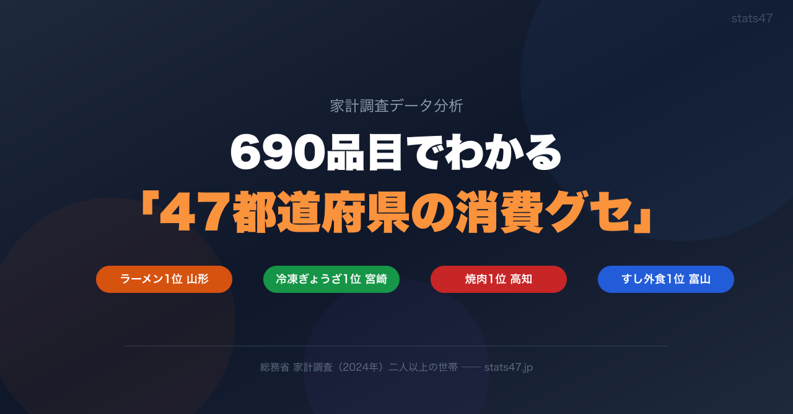
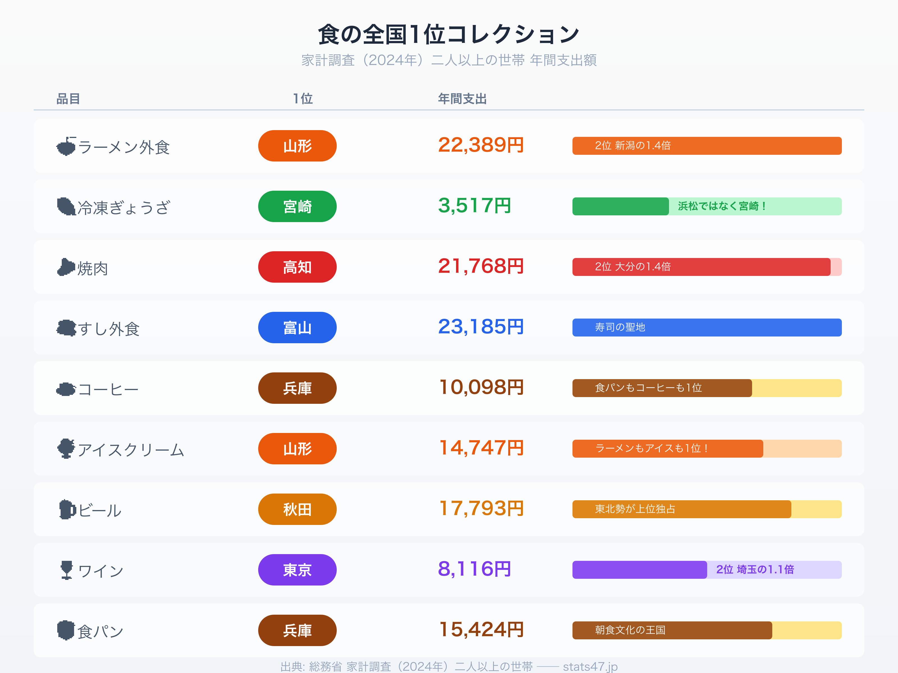
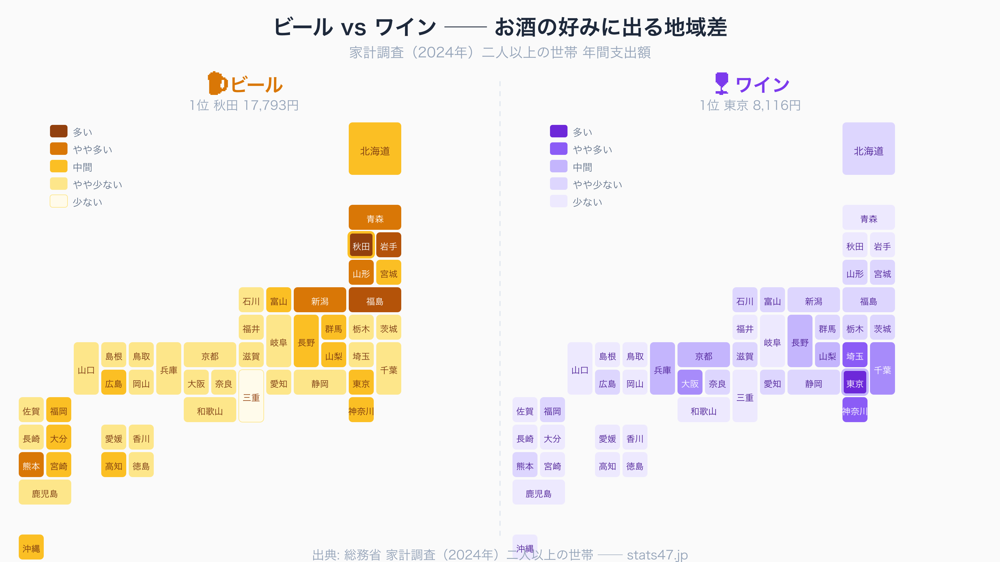

<!-- note投稿時: この画像行を削除し、images/cover.png をアップロード -->

あなたの県の「消費グセ」、知っていますか？

ラーメン外食の1位は山形県。冷凍ぎょうざの1位は、浜松でも宇都宮でもなく宮崎県。焼肉の1位は高知県。

「えっ、そうなの？」と思った方は多いはずです。

総務省の**家計調査**には、食品から教育費、交通費まで**約690品目**の消費支出データが、47都道府県の県庁所在市別に公表されています。このデータをひとつずつ見ていくと、各地域の意外な「消費のクセ」が浮かび上がってきます。

今回は特に「食」にフォーカスして、都道府県別の消費パターンを紹介します。

## 家計調査とは？

家計調査は、総務省が毎月実施している統計調査です。全国約9,000世帯の家計簿を集計し、何にいくら使っているかを品目別に明らかにします。

都道府県庁所在市別の年間集計では、**二人以上の世帯**の1世帯あたりの年間支出額が公表されています。これを使えば、「山形市の世帯は年間でラーメンにいくら使っているか」を47都市で比較できるわけです。

よくニュースで取り上げられる「ぎょうざ消費量日本一」の争いも、この家計調査のデータがもとになっています。ただし実際には、ぎょうざ以外にも690品目ものデータがあり、各品目で「意外な1位」が続出するのです。

## 食の全国1位コレクション

まずは、特に意外性の高い「食の1位」を一覧にしました。

<!-- note投稿時: この画像行を削除し、images/food-champions.png をアップロード -->

ひとつずつ見ていきましょう。

### ラーメン外食1位：山形（22,389円）

ラーメンの街といえば博多や札幌を思い浮かべる人が多いでしょう。しかし、家計調査の「中華そば（外食）」で堂々の1位は**山形**です。

年間22,389円。2位の新潟（約16,000円）を**1.4倍**も引き離すぶっちぎりの1位。

山形には独自の「冷やしラーメン」文化があり、夏も冬もラーメンを食べる習慣が根づいています。外食費ベースで全国平均の**約2.6倍**。「ラーメン県」は山形と断言できるデータです。

https://stats47.jp/ranking/chinese-noodles-eating-out

### 冷凍ぎょうざ1位：宮崎（3,517円）

ぎょうざといえば浜松 vs 宇都宮の「消費量日本一」争いが有名ですが、これは**生ぎょうざ**の話。

**冷凍ぎょうざ**に限ると、1位は**宮崎**です。

宮崎にはぎょうざ専門の冷凍食品メーカーがあり、地元のスーパーには冷凍ぎょうざのコーナーが充実しています。全国的にはあまり知られていませんが、家計調査のデータはしっかりとこの事実を捉えています。

https://stats47.jp/ranking/frozen-gyoza

### 焼肉1位：高知（21,768円）

焼肉の外食支出1位は**高知**。年間21,768円で、2位の大分を**1.4倍**引き離しています。

高知といえばかつおのイメージが強いですが、実は焼肉文化も根強い。高知市内には焼肉店が多く、宴会の定番メニューのひとつでもあります。

「高知＝かつお」だけではない、データが示す意外な食文化です。

https://stats47.jp/ranking/yakiniku-eating-out

### すし外食1位：富山（23,185円）

寿司の消費1位は**富山**。これは納得の方も多いかもしれません。

富山湾の新鮮な魚介を使った回転寿司のレベルが高く、「回転寿司でも別格」と言われる土地柄。年間23,185円と、寿司への支出は全国でも突出しています。

https://stats47.jp/ranking/sushi-eating-out

### アイスクリーム1位：山形（14,747円）

ラーメンに続き、アイスクリームでも**山形**が全国1位。

山形は夏の最高気温が全国トップクラスで、暑い夏にアイスを食べる文化が自然と根づいたと考えられます。「ラーメンもアイスも1位」という二冠は、山形の食文化の奥深さを象徴しています（詳しくは後述）。

https://stats47.jp/ranking/ice-cream-sherbet

### ビール1位：秋田（17,793円）

ビールの支出1位は**秋田**。東北勢が上位を占め、寒い地域ほどビールにお金をかけている傾向が見えます。

「寒いから熱燗では？」と思いがちですが、実は東北の家庭では晩酌でビールを飲む文化が根強いのです。

https://stats47.jp/ranking/beer

### ワイン1位：東京（8,116円）

一方、ワインは**東京**が1位。2位の埼玉（7,143円）の1.1倍で、首都圏が上位を独占しています。

ビールが東北に強く、ワインが首都圏に強い。この対比は、次のタイルマップで一目瞭然です。

https://stats47.jp/ranking/wine

### 食パン＆コーヒー1位：兵庫（15,424円＆10,098円）

食パンとコーヒーの両方で全国1位を獲得しているのが**兵庫**。これも後ほど詳しく解説します。

https://stats47.jp/ranking/bread

## ビール vs ワイン：お酒の好みに地域差

ビールとワインの消費額を47都道府県のタイルマップで並べてみると、地域差が一目でわかります。

<!-- note投稿時: この画像行を削除し、images/beer-wine-map.png をアップロード -->

**ビール**は、秋田を筆頭に東北・北海道・九州で濃い色が目立ちます。寒い地域＋九州の「晩酌文化圏」がビールを支えている構図です。

**ワイン**は、東京・埼玉・千葉・神奈川・大阪・京都・兵庫と、大都市圏にくっきり集中しています。長野や山梨（ワイン産地）もやや濃いのが興味深い。

ビールとワインの地図を並べると、「同じお酒でも、まったく違う地図になる」ことが実感できます。日本酒が東北、焼酎が南九州に偏るのと同様、お酒の好みには明確な地域パターンがあるのです。

## 山形の二冠：ラーメンもアイスも1位のなぜ

食の1位コレクションで特に印象的だったのが、**山形のラーメン×アイスクリーム二冠**です。

ラーメン外食：22,389円（全国1位）
アイスクリーム：14,747円（全国1位）

一見すると脈絡のない2品目ですが、山形の気候を知ると納得がいきます。

山形市は**盆地特有の寒暖差**が大きい都市です。冬は豪雪地帯、夏は40度近くまで気温が上がることもある。2018年にはかつて日本の最高気温記録（40.8度）を保持していた山形市が再び話題になりました。

この「夏の暑さ」がアイスクリーム消費を押し上げ、「冬の寒さ」が温かいラーメンへの需要を生む。さらに山形には「冷やしラーメン」という夏メニューがあるので、夏もラーメン需要が落ちない。

気候が食文化を作り、食文化が消費データに刻まれる。山形の二冠は、家計調査データの面白さを凝縮した事例です。

## 兵庫の「食パン×コーヒー」王国

もうひとつ注目したいのが、**兵庫（神戸）の食パン×コーヒー二冠**です。

食パン：15,424円（全国1位）
コーヒー：10,098円（全国1位）

さらに兵庫のエンゲル係数（消費支出に占める食費の割合）は**31.8%で全国1位**。全国平均の27.8%を大きく上回っています。ちなみに2位は大阪の31.5%、最下位は栃木の25.2%です。

「食パンとコーヒー」の組み合わせが示唆するのは、**神戸の朝食文化**です。

神戸には老舗のパン屋や喫茶店が多く、「モーニング」の文化が根強い。朝は食パンを焼いてコーヒーを淹れる──という習慣が、世代を超えて定着しているのでしょう。

名古屋の喫茶店モーニングも有名ですが、データ上では神戸のほうが食パン・コーヒーともに上回っています。「朝食の街」は、名古屋ではなく神戸かもしれません。

https://stats47.jp/ranking/food-expenditure-ratio-multi-person-households

## 690品目すべてにストーリーがある

家計調査のデータは、ひとつひとつの品目に土地の気候、文化、産業のストーリーが詰まっています。

山形のラーメンとアイスには盆地の気候が。
兵庫の食パンとコーヒーには喫茶店文化が。
宮崎の冷凍ぎょうざには地元メーカーの存在が。
高知の焼肉には意外な宴会文化が。

こうした「消費グセ」は、住んでいる人にとっては当たり前すぎて気づかないもの。だからこそ、データで比較したときに「えっ、うちの県だけ？」という発見が生まれるのです。

今回紹介したのは690品目のほんの一部。あなたの県の「消費グセ」も、きっとデータの中に隠れています。

### 690品目すべてのランキングはこちら

https://stats47.jp/category/food-beverage

### 消費支出の都道府県ランキング

https://stats47.jp/ranking/consumption-expenditure-multi-person-households-per-month

### エンゲル係数の都道府県ランキング

https://stats47.jp/ranking/food-expenditure-ratio-multi-person-households

---

**stats47** は、e-Stat の公的統計データを47都道府県別に可視化するサービスです。
ランキング・散布図・時系列チャートで、地域の違いがひと目でわかります。

https://stats47.jp
