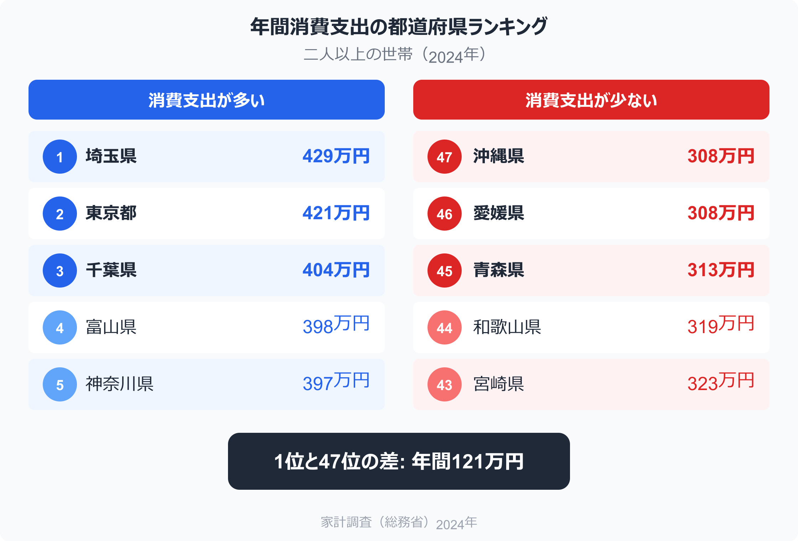
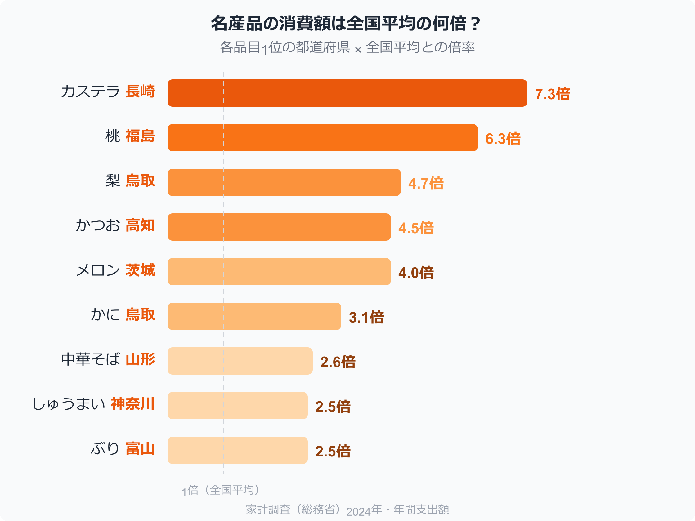
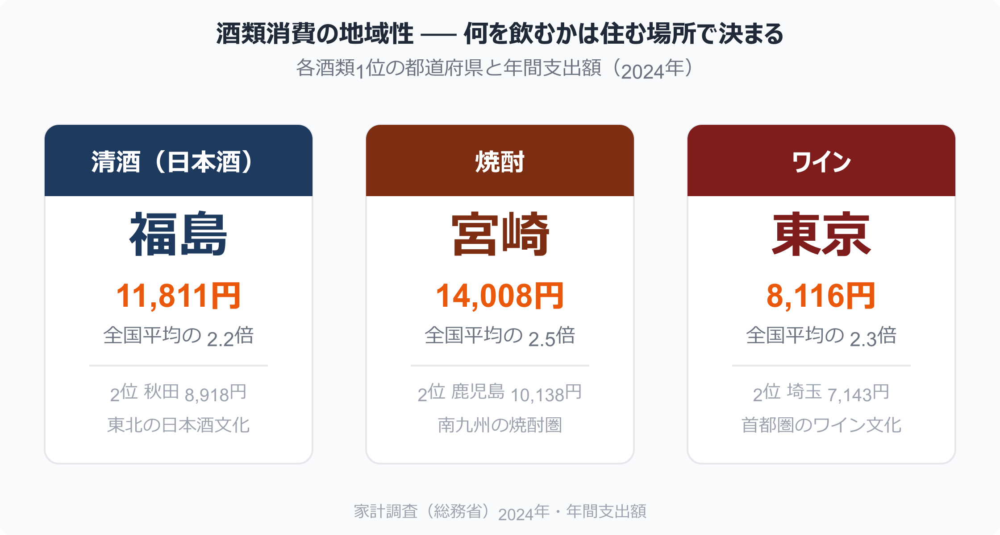
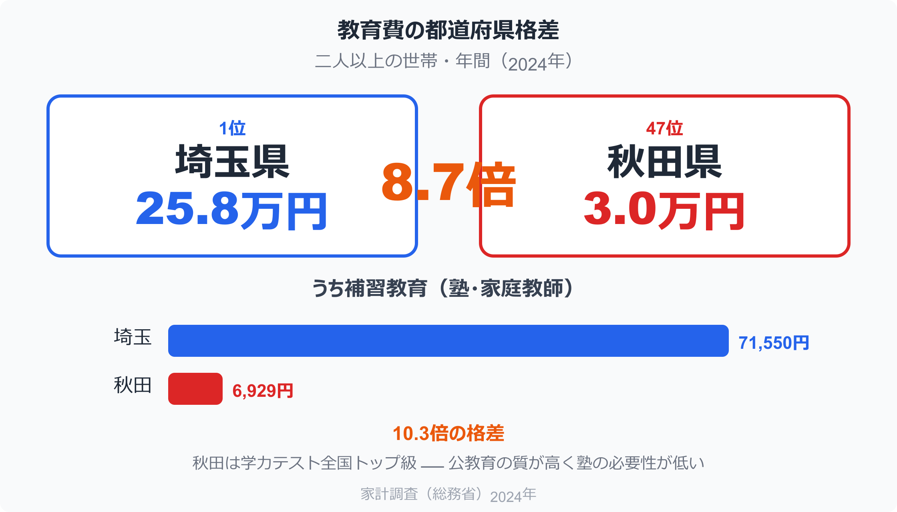
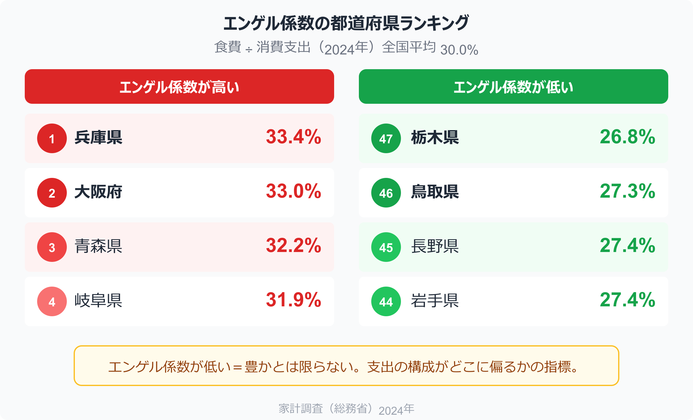

埼玉県は、49品目で全国1位。

沖縄県は、92品目で全国最下位。

この数字だけで、「47都道府県の消費は、まったく違う」ということが伝わるのではないでしょうか。

総務省の家計調査には、**690品目にわたる消費支出データ**が、都道府県庁所在市ごとに公表されています。
食パンからパック旅行まで、灯油から塾代まで。
私たちの「お金の使い方」が、品目レベルで丸裸にされている。

今回、この690品目 × 47都道府県のデータを全件分析しました。

浮かび上がったのは、気候、文化、産業、そして格差。
データが映し出す、47通りの暮らしの姿を紹介します。

## 消費支出の総額から見える景色

<!-- note投稿時: この画像行を削除し、images/consumption-ranking.png をアップロード -->

まず全体像から。

二人以上の世帯の年間消費支出（2024年）、全国平均は**約360万円**です。

最も多いのは**埼玉県（さいたま市）の429万円**。
東京都区部の421万円を上回っています。

最も少ないのは**沖縄県（那覇市）の308万円**。
1位の埼玉と比べると、年間で約121万円の差があります。

「東京が1位じゃないの？」と思った方も多いでしょう。
実はここに面白い構造があります。

東京は「サービス」への支出では圧倒的1位（年間184万円）ですが、「モノ」の購入では9位にとどまります。
一方、埼玉は住宅関連費や教育費が高く、「郊外で子育てしながら東京に通勤する世帯」の家計が色濃く反映されている。

消費の総額だけでは見えないものが、品目別に分けたとたん、鮮明になるのです。

▶ 消費支出の都道府県ランキングを見る（stats47）
https://stats47.jp/ranking/consumption-expenditure-multi-person-households-per-month

## 食卓に映る郷土の個性

<!-- note投稿時: この画像行を削除し、images/food-multiples.png をアップロード -->

家計調査のデータで最も面白いのは、間違いなく「食」です。

690品目のうち約200品目が食料関連。
ここに各県の食文化が、金額という数字で克明に刻まれています。

### 「名産地は、自分でも食べている」法則

分析して最初に気づいたのは、名産地の県は自分たちでもその食材にお金をかけているという事実でした。

**高知のかつお**。
全国平均が年間1,629円のところ、高知は**7,369円**。
全国平均の**4.5倍**です。

**鳥取のかに**。
全国平均1,828円に対し、鳥取は**5,610円**で**3.1倍**。
松葉ガニの地元では、かにが日常の食卓に上がっていることがデータで裏付けられます。

**静岡のまぐろ**。
全国平均5,302円に対し、静岡は**11,635円**で**2.2倍**。
焼津港のお膝元ならではの数字です。

**富山のぶり**。
全国平均3,040円に対し、富山は**7,610円**で**2.5倍**。
冬の寒ぶりが富山の食卓に欠かせないことが、家計簿の数字に表れています。

他にも──

**青森のほたて貝**は全国の3.1倍。
**宮城のかまぼこ**は2.2倍（笹かまぼこの文化）。
**神奈川のしゅうまい**は2.5倍（崎陽軒の存在感）。

地域の名産品は「観光客向け」ではなく、地元の人の日常消費にも深く根づいている。
これが、家計調査のデータが教えてくれる最初の発見です。

### ラーメン県・山形の実力

もうひとつ、外食データから浮かび上がる面白い事実があります。

**中華そば（ラーメン）の年間支出額**。

全国平均は8,663円。
ラーメンの街といえば福岡（博多）を思い浮かべる方も多いでしょう。

しかしデータ上、ラーメンに最もお金を使っているのは**山形**（22,389円）です。
全国平均の**2.6倍**。

2位の新潟（16,292円）を大きく引き離すぶっちぎりの1位。

山形では冷やしラーメンが独自の文化として定着し、夏も冬もラーメンを食べる。
この食文化が、家計の数字に如実に表れています。

ちなみに山形は全体で**34品目で全国1位**。
ラーメンだけでなく、教科書代、さといも、こんにゃく、せんべいなど、食と暮らしの多くの場面で「全国一」を記録しています。

### うどん県とカステラの長崎

定番ネタもデータで確認できます。

**香川のうどん**（日本そば・うどん）は年間16,156円で全国1位。
全国平均7,511円の**2.2倍**。

そして意外に知られていないのが、**長崎のカステラ**。
全国平均は905円ですが、長崎は**6,611円**。
なんと**7.3倍**です。

2位の茨城（1,723円）すら大きく引き離す、圧倒的な消費量。
長崎にとってカステラは「お土産」ではなく「日常の菓子」であることがわかります。

### 果物の産地と消費

**福島の桃**。
全国平均1,089円に対し、福島は**6,817円**で**6.3倍**。
2位の岡山（4,138円）も3.8倍と高いですが、福島の突出ぶりは別格です。

**鳥取の梨**は全国の**4.7倍**。
**茨城のメロン**は**4.0倍**。
**栃木のいちご**は**1.7倍**。

産地の県民は、自分たちの果物を全国平均の何倍も食べている。
当然と言えば当然ですが、その差が数字で見えるのが家計調査の醍醐味です。

▶ 家計・経済の都道府県ランキングを見る（stats47）
https://stats47.jp/category/economy

## お酒の好みに出る県民性

<!-- note投稿時: この画像行を削除し、images/alcohol-comparison.png をアップロード -->

酒類のデータには、地域ごとの「酒文化」がくっきり表れます。

### 清酒、焼酎、ワイン、それぞれの王者

**清酒（日本酒）のトップは福島**。
年間11,811円で全国平均5,389円の**2.2倍**。
秋田（8,918円）が2位で、東北の日本酒文化の強さを裏付けます。

**焼酎のトップは宮崎**。
年間14,008円で全国平均5,612円の**2.5倍**。
2位の鹿児島（10,138円）と合わせ、南九州は焼酎圏であることがデータで明白です。

**ワインのトップは東京**。
年間8,116円で全国平均3,463円の**2.3倍**。
埼玉（7,143円）が2位で、首都圏のワイン消費が突出しています。

面白いのは、これらがきれいに地域で分かれることです。
東北は日本酒、南九州は焼酎、首都圏はワイン。
飲むお酒の種類にも、はっきりとした「地域性」がある。

### 秋田の酒類消費は全国一

個別銘柄ではなく酒類全体を見ると、**秋田が全国1位**（63,918円、全国平均の1.4倍）。
青森（60,399円）、熊本（58,354円）と続きます。

逆に最も少ないのは三重（27,354円）で、全国平均の約6割。
お酒にかけるお金にも、2倍以上の地域差があるのです。

## 気候が決める光熱費

家計調査のデータで、気候の影響が最も顕著に表れるのが光熱費です。

### 灯油代の南北格差

**青森の「他の光熱」（ほぼ灯油）は年間93,837円**。
全国平均15,205円の**6.2倍**です。

秋田（71,102円）、北海道（65,346円）と続き、東北・北海道は灯油への支出が桁違い。

一方、**東京はわずか2,106円**。
全国平均の**0.14倍**、つまり7分の1。

大阪も2,399円で、大都市圏では灯油の出番がほとんどないことがわかります。

この差は実に**45倍**。
家計調査で最も大きな地域格差のひとつです。

▶ 光熱費の都道府県ランキングを見る（stats47）
https://stats47.jp/category/energy

### ガスは「都市ガス vs プロパン」の構造

ガス代の地域差には、インフラの違いが反映されています。

**都市ガス1位は大阪**（75,240円）で全国平均の2.0倍。
大阪ガスの普及率の高さが表れています。

一方、**プロパンガスが最も少ないのは兵庫**（448円）。
都市ガス網が整備された地域ほどプロパンの出番がなくなる。
逆に地方ではプロパンガスの割合が高く、その分ガス代全体が上がる傾向があります。

## 教育費の「8.7倍格差」

<!-- note投稿時: この画像行を削除し、images/education-gap.png をアップロード -->

家計調査で最も衝撃的な地域格差が表れるのが、教育費です。

### 埼玉 vs 秋田、8.7倍の現実

年間の教育費。

**1位: 埼玉 258,001円**（消費支出の6.0%）
**47位: 秋田 29,536円**（消費支出の0.9%）

**8.7倍**の差があります。

2位の東京（254,447円）、3位の千葉（242,751円）と、首都圏が上位を独占。
逆に秋田、青森（42,132円）、島根（58,260円）と、地方が下位に並びます。

### 塾代は10倍超の格差

さらに**補習教育**（塾・家庭教師など）に絞ると、格差はもっと開きます。

**埼玉: 71,550円**
**秋田: 6,929円**

**10.3倍**です。

これは「秋田の家庭が教育に関心がない」という単純な話ではありません。

秋田県は全国学力テストで常にトップクラスの成績を収めています。
公教育の質が高いため、塾に通う必要性が相対的に低い。
一方、首都圏では中学受験文化が根強く、小学校から塾通いが一般的。

**同じ「教育」でも、公教育で完結する地域と、私教育（塾）で補う地域とでは、家計の構造がまるで違うのです。**

▶ 教育の都道府県ランキングを見る（stats47）
https://stats47.jp/category/educationsports

### 奈良の私立小学校、全国の21倍

個別品目で最も驚いたのがこのデータです。

**奈良の「私立小学校」の年間支出: 27,089円**。
全国平均1,277円の**21.2倍**。

奈良には帝塚山小学校や奈良育英小学校など私立小学校があり、教育熱心な家庭が多い土地柄。
加えて、大阪や京都の私立小学校に通うケースも含まれているとみられます。

ひとつの品目で「21倍」という数字が出ること自体が、家計調査データの奥深さを物語っています。

## クルマ社会 vs 鉄道社会

交通費のデータは、その地域の都市構造をそのまま映し出します。

### 自動車関係費

**1位: 栃木 572,360円**（全国平均の1.9倍）
**2位: 群馬 538,771円**（1.8倍）

北関東の「クルマ必須」の生活が、数字に表れています。

一方、**大阪はわずか159,479円**（全国平均の0.54倍）。
鉄道網が充実した大都市圏では、自動車関係費が半分以下になります。

### ガソリン代の東京

**東京のガソリン代は年間21,697円**。
全国平均70,887円の**0.31倍**、つまり3分の1以下。

逆に読むと、地方では年間7万円以上をガソリンに使っている。
「クルマがないと暮らせない」という地方の現実が、家計の数字に直結しています。

▶ 交通・運輸の都道府県ランキングを見る（stats47）
https://stats47.jp/category/tourism

## 沖縄──最も「異質」な消費構造

47都道府県の中で、最も消費構造が全国平均と異なるのが**沖縄**です。

**92品目で全国最下位**。
これはダントツの数字で、2位の和歌山（31品目）の3倍です。

沖縄で全国平均より大幅に多い品目を見ると──

**民営家賃: 全国の3.2倍**。
那覇市は持ち家率が低く、賃貸住まいの世帯が多いことがわかります。

**粉ミルク: 全国の2.9倍**。
沖縄は出生率が全国1位であり、乳児のいる世帯が多い。

**かつお節・削り節: 全国の2.8倍**。
沖縄料理の基本である「かつおだし」の文化が反映されています。

逆に少ないのは──

**かに: 全国の0.10倍**（10分の1）。
**コート（男子用）: 全国の0.08倍**。
**外壁・塀等工事費: 0円**。

温暖な気候、コンクリート造の住宅、本土と異なる食文化。
沖縄の消費データは、ひとつの県が持つ「個性」がどれほど大きいかを雄弁に語ります。

## エンゲル係数の地域差

<!-- note投稿時: この画像行を削除し、images/engel-ranking.png をアップロード -->

消費支出に占める食費の割合、いわゆるエンゲル係数にも地域差があります。

全国平均は**30.0%**。

**最も高いのは兵庫の33.4%**。
食料費そのものは112万円と高いですが、支出全体が336万円と全国平均を下回るため、割合が上がっています。

**最も低いのは栃木の26.8%**。
食料費は106万円とそれほど低くないものの、自動車購入や教育費など食料以外の支出が大きいため、相対的に食費の割合が低くなっています。

エンゲル係数は「低いほど豊か」と言われることがありますが、実際には**支出の構成がどこに偏っているか**を反映しているに過ぎません。
データの読み方には注意が必要です。

## 知られざる「地域1位」たち

最後に、分析の中で見つけた「意外な全国1位」を紹介します。

**京都の腕時計: 全国の12.5倍**。
年間24,538円。これは2024年の突発的な高額購入が含まれている可能性もありますが、それにしても異常値です。

**長崎の婚礼関係費: 全国の16.3倍**。
年間51,946円。長崎は結婚式に盛大にお金をかける文化が根強いとされ、データがそれを裏付けます。

**札幌の敷物: 全国の10.9倍**。
年間18,190円。寒冷地ならではの、暖かいカーペットやラグへの需要でしょう。

**秋田のストーブ・温風ヒーター: 全国の7.4倍**。
寒冷地の暮らしには、暖房器具への投資が欠かせない。

**埼玉の楽器: 全国の8.1倍**。
年間13,161円。これは少し謎ですが、子どもの習い事として楽器購入が盛んなのかもしれません。

こうした「なぜ？」が生まれるのが、品目レベルのデータ分析の面白さです。

▶ 都道府県別のランキングを探す
https://stats47.jp

## データが語る47通りの暮らし

690品目 × 47都道府県の全データを分析してわかったことを整理します。

**食卓には、郷土の産業と文化が映る。**
名産地の県民は、自分たちの名産品を全国の何倍も消費している。
高知のかつお、鳥取のかに、静岡のまぐろ、富山のぶり。

**気候が、家計の構造を変える。**
青森の灯油代は東京の45倍。
沖縄のコート消費はほぼゼロ。

**都市構造が、交通費を左右する。**
栃木の自動車関係費は大阪の3.6倍。
東京のガソリン代は全国平均の3分の1。

**教育費の格差は、8.7倍に達する。**
そしてそれは「教育の質」の格差とは一致しない。

**消費の「個性」は、都道府県ごとにまったく違う。**
埼玉は49品目で全国1位、沖縄は92品目で全国最下位。

家計調査の都道府県データは、ニュースで取り上げられる「餃子消費量ランキング」の何百倍もの情報量を持っています。

690品目すべてに、その土地の気候と文化と暮らしが詰まっている。

自分の住む県の「消費グセ」を知ることは、自分の暮らしを客観的に見つめ直す第一歩になるはずです。

---

この記事で紹介したデータは、すべて stats47.jp で都道府県別にランキング形式で閲覧できます。

気になる品目があれば、あなたの県が全国何位なのか、ぜひ確認してみてください。

stats47 — 統計で見る都道府県
https://stats47.jp
