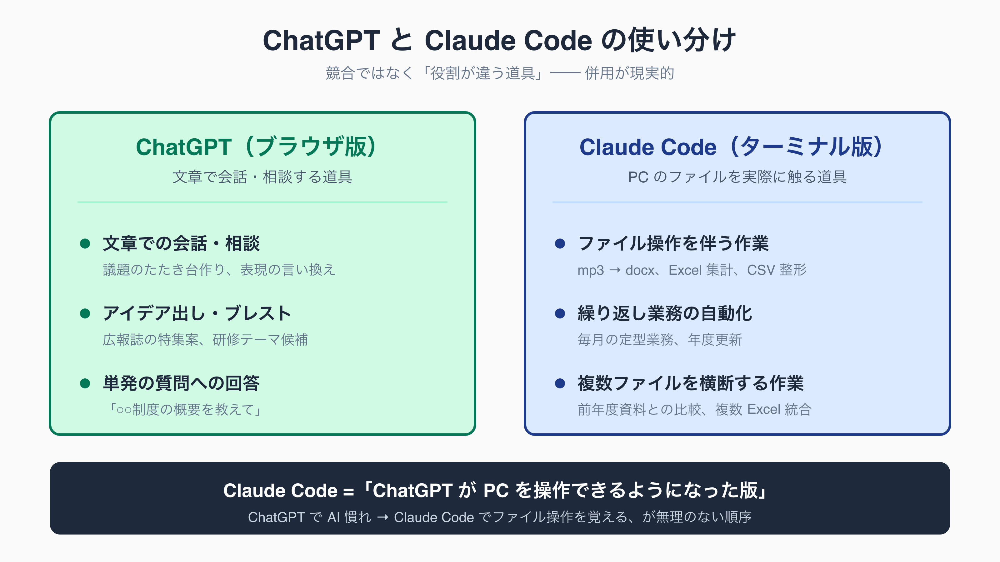
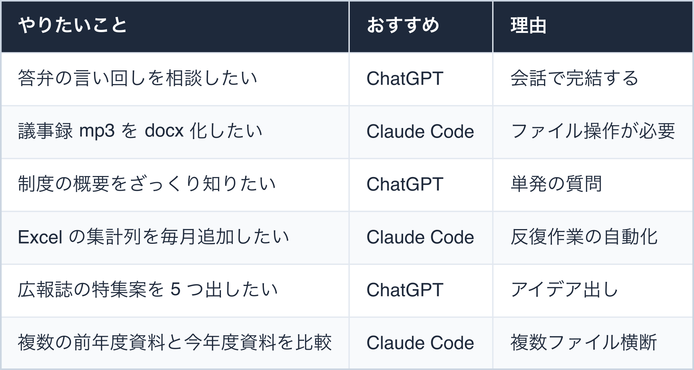
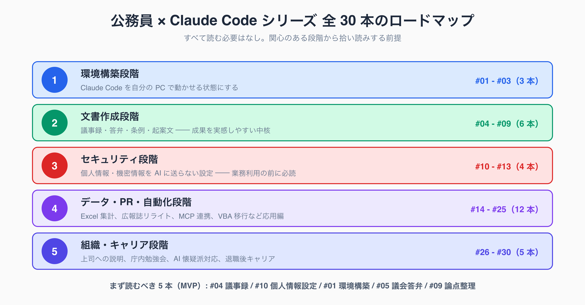

# Claude Code とは何か — ターミナル未経験の公務員のための導入ガイド

## はじめに — 「ターミナル？黒い画面のやつ？」から始めます

「Claude Code が業務改善に効くらしい」と聞いて検索してみたものの、出てくる解説は「ターミナルを開いて npm install」「環境変数を設定」と専門用語ばかり。

Word・Excel・庁内メールしか触ってこなかった公務員にとって、**最初の数行で読むのをやめてしまう**、というのはよくある話です。

本記事の想定読者は、PC は業務で毎日使うが「ターミナルって何？黒い画面のやつ？」というレベルの自治体職員です。コードを書いた経験はなく、関数も VLOOKUP で精一杯。

それでも残業を減らしたい、議事録や答弁書の下書きをもっと楽に作りたい、という現場感を持っている方を想定しています。

この記事を読み終えると、次のことがわかります。

- Claude Code が「具体的に何をしてくれる道具か」(ChatGPT との違いを含む)
- なぜ公務員業務と相性がよいのか
- 個人利用なら追加料金なしで試せること、組織導入の現実的な道筋
- 全 30 本のシリーズ記事をどう読み進めるか、最初の 1 本はどれか

身構える必要はありません。Claude Code は「黒い画面に呪文を打ち込むツール」ではなく、**「日本語で頼むと PC の中で実際に手を動かしてくれる AI」**です。

最初の 1 時間は環境構築に戸惑うかもしれませんが、それを超えると「これは Excel マクロより素直で、しかも応用範囲がはるかに広い」と感じる方が多いようです。

執筆者は元自治体職員。現在は Claude Code を使い、47 都道府県の統計サイト stats47.jp（約 2,000 のランキングを毎日自動更新）を個人で開発・運用しています。

「AI で本当に実務が回るのか」は、動いているものを見てもらうのが早いと考えています。このシリーズの著者は、Claude Code で stats47.jp（https://stats47.jp）という実際に動くサイトを、47 都道府県・約 2,000 のランキング・約 148 万件の統計データを毎日自動更新する形で、1 人で作って運用しています。

## そもそも Claude Code とは何か

ひとことで言うと、Claude Code は **「文章で頼むと、PC の中で実際に作業してくれる AI 道具」** です。

Anthropic 社が提供する Claude という AI を、ブラウザ越しの「会話」ではなく、自分の PC のファイルやコマンドに直接アクセスさせる形で動かせます。

ChatGPT との違いをイメージしやすく整理すると次のようになります。

- **ChatGPT (ブラウザ版)**: こちらが質問を打つと、AI が「文章で答え」を返す。文章はコピーしてこちらが Word に貼り付ける必要がある
- **Claude Code (ターミナル版)**: こちらが「議事録の mp3 を要約して docx で保存して」と頼むと、AI が **mp3 を読み、要約を作り、docx ファイルとしてフォルダに保存するまで** を一気通貫で実行する

つまり ChatGPT が「賢い相談相手」だとすると、Claude Code は「相談に乗ったうえで、実際に PC を操作してファイルまで作ってくれるアシスタント」に近い存在です。

ここで出てくる「ターミナル」「CLI」「コマンド」という言葉を、1 行ずつ簡単に解説します。

- **ターミナル (Terminal)**: PC に文字で命令を出すための画面。Windows なら「コマンドプロンプト」「PowerShell」、Mac なら「ターミナル.app」が標準で入っている
- **CLI (Command Line Interface)**: マウスではなく文字で操作する仕組み全般を指す。ターミナルで使う
- **コマンド**: ターミナルに打ち込む命令の単位。Claude Code の場合、最初に覚えるのは `claude` の 1 つだけで十分

身構えてしまう方も多いのですが、毎日コマンドを 20 個も覚える必要はありません。**実務で頻繁に使うのは 3-5 個程度**で、残りは Claude Code 自身に「こういうことをしたい」と日本語で頼めば代わりにやってくれます。

「コマンドを覚える IT スキル」ではなく**「やりたいことを言語化するスキル」**のほうがずっと重要です。

具体例をひとつ。1 時間の打ち合わせを録音した mp3 がデスクトップにあるとします。

ターミナルで `claude` と打って Claude Code を起動し、「desktop/会議.mp3 を文字起こしして、発言者ごとに整理した議事録を docx で保存して」と日本語で頼むと、Claude Code は文字起こしサービスの呼び出し、要約整形、docx 出力までを順に実行します。**人間が間に入って「次はこれをやって」と指示し続ける必要がありません**。

詳しい手順は [#04 議事録 30 分 → 5 分にした手順](../04-meeting-minutes-30min-to-5min/draft.md) で解説しています。

**「黒い画面（ターミナル）は必須ではない」** という点も、最初に知っておくと安心です。Claude Code はターミナル専用ツールではなく、**VS Code という無料のソフト（コードエディタ）の中で使うこともできます**。

VS Code には画面下部に開く「統合ターミナル」と、左側のファイル一覧表示があり、Claude Code が作ったファイルを Word のような GUI 感覚で目視確認しながら作業できます。単独の真っ黒な画面と向き合う必要はありません。

VS Code は会社 PC でも比較的インストール申請が通りやすいソフトなので、ターミナルへの抵抗が大きい方はまず VS Code を入口にするのがおすすめです。具体的な導入手順は [#01 環境構築 完全版](../01-claude-code-setup-complete/draft.md) で解説します。

## なぜ公務員に向いているのか

Claude Code は IT 企業の開発者向けに作られたツールですが、実は自治体業務との相性が極めて良いことが、現場での試用報告から見えてきています。理由は 4 つあります。

**1. 反復作業の塊である自治体業務を圧縮できる**

議事録、答弁書、起案文、前年度比較、FAQ 作成、広報誌の表現チェック——自治体業務の多くは「フォーマットが決まっていて、毎回少しずつ中身を入れ替える」反復作業です。

Claude Code はテンプレート的な作業を最も得意とするため、**月単位で数十時間の圧縮**が見込めるケースがあります。

**2. 属人化を解消できる**

「あの予算編成は係長級の A さんしかわからない」「議会答弁の書き方は前任の B さんが全部覚えていた」というのが自治体の典型的な悩みです。

Claude Code の「skill」(やり方を覚えさせる仕組み) を使えば、**ベテランの暗黙知をテキスト化して組織で共有**できます。詳細は [#22 月次定型業務をスキル化](../22-monthly-routine-skills/draft.md) を参照してください。

**3. 人手不足対策として現実解になる**

地方公務員は採用難の時代に入っています。人口 5-30 万人規模の市役所では、技術職・専門職を中心に欠員が常態化し、係長級が複数係を兼務するケースも目立ち始めています。

新規採用が難しい以上、**既存職員の生産性を上げるしかない**、という結論にたどり着く管理職が増えており、Claude Code はその現実解の一つになりつつあります。

**4. 自治体の AI 利用環境が整い始めている**

デジタル庁が 2025 年 5 月に公開したテキスト生成 AI 利用ガイドライン (DS-920) をはじめ、各自治体でも独自の利用基準が整備されてきました。「業務に AI を使ってよいか」という根本的な問いに、組織として答えを出せる段階に来ています。

個人情報・機密情報の取り扱いさえ整理すれば、業務での活用が制度的にも後押しされる流れができています。

なお、Claude Code を導入したからといって職員数が減らせるわけではありません。圧縮された時間は、本来やるべき政策立案、住民対応、現場視察に振り向けるための時間として捉えるのが現実的です。

**「AI で楽になる」ではなく「AI で本来業務に時間を戻す」**という説明軸のほうが、上司・議会・住民への説得力が高いという声もあります。

## 「個人でも企業でも無料で使える」これが最大の魅力

Claude Code の最大の魅力は、**まず個人で無料に近いコストで試せて、組織導入もそのまま延長できる** ことです。

AI ツールには「業務で使うには高額な企業契約が必要」というイメージがありますが、Claude Code は段階的に拡張できる料金体系になっています。

**個人利用の場合**

Anthropic 社の Claude Pro プラン (月額) または Claude Max プラン (月額・利用枠拡大) を契約していれば、Claude Code は **追加料金なしで利用できる** 仕組みになっています。

Pro プランはブラウザ版 Claude と共通の契約なので、「すでに Claude を使っている」方ならそのまま Claude Code を起動できます。

「まず無料で雰囲気を知りたい」場合は、Anthropic API の従量課金 (使った分だけ課金) で起動する選択肢もあります。1 か月数百円程度から試せるため、私物 PC で休日に触ってみる、というステップが現実的です。

**企業 (自治体) 利用の場合**

Claude Code は商用利用も明示的に認められています。組織で導入する場合は、Anthropic API の従量課金で組織アカウントを発行するか、Claude Team / Enterprise プランで定額契約する形が一般的です。

利用ログ・アクセス制御・データ保持ポリシーなど、組織が気にする要件も整備されています。

**段階的に試して会社 PC へ展開する現実的なパス**

業務で本格的に使うなら、最終的に Claude Code を動かすのは会社（庁内）PC です。そこへ至るまでは、次のような 4 段階を踏むのが現実的です。

1. **(任意) 私物 PC で雰囲気を掴む** — 個人 Pro プラン or API 従量課金 (月数百円〜数千円)。プロキシ設定が不要なので 30 分ほどで起動でき、小さな実例づくりに向く
2. **会社 PC で使えるようにする** — 会社 PC はプロキシ閉域だが、**プロキシ設定をすれば Claude Code は動く**。情シスにドメイン許可を申請してセットアップする (設定手順は [#01 環境構築 完全版](../01-claude-code-setup-complete/draft.md) の手順 4、ネットワーク交渉の進め方は [#02 庁内ネットワークで動かす方法](../02-internal-network-workarounds/draft.md))
3. **会社 PC で業務に実戦投入** — 個人情報を送らない設定 (後述) をした上で、議事録・FAQ 作成など実務に使う
4. **係・課・組織へ展開** — 改善実績を共有し、組織契約・利用ルールを整備 ([#26 上司への説明資料](../26-boss-approval-deck/draft.md) を参照)

このパスのよいところは、**いきなり完璧な組織導入を目指さなくてよい** ことです。まず私物 PC で小さな実例を作り (段階 1)、その実例を材料に情シス交渉を進めて会社 PC を正規環境にする (段階 2)。

実例なしの提案は「また新しいツールか」で終わりがちですが、「この 3 か月で議事録作成を月 10 時間圧縮しました」と数字で示せれば、議論は前に進みます。

段階 1 は時間が取れなければ省略し、いきなり段階 2 の会社 PC セットアップから入っても構いません。

**注意点**

ただし「個人で試す」段階でも、個人情報や機密情報を AI に送らない設定は別途必要です。Claude Code は標準では入力内容を Anthropic 社のサーバーに送信するため、**住民情報・人事情報・決裁前資料は絶対に流してはいけません**。

この設定方法は [#10 個人情報を送らない設定](../10-ai-without-personal-info/draft.md) [#11 Hooks による自動マスキング](../11-hooks-personal-info-masking/draft.md) [#12 監査に耐える設定](../12-audit-ready-settings/draft.md) で詳しく解説しています。完全にオフラインで動かしたい場合は [#13 Ollama でオフライン LLM](../13-ollama-offline-local-llm/draft.md) も参考になります。

## ChatGPT と Claude Code、結局どう使い分けるのか

「ChatGPT は使ったことがあるけど、Claude Code は何が違うのか」というのが、公務員が最初に感じる疑問です。結論からいうと、両者は競合するというより **役割が違う道具** で、併用するのが現実的です。

**ChatGPT (ブラウザ版) の得意分野**

- 文章での会話・相談 (議題のたたき台作り、表現の言い換え、用語の確認)
- アイデア出し・ブレインストーミング (広報誌の特集案、研修テーマの候補出し)
- 単発の質問への回答 (「○○制度の概要を教えて」)

ブラウザを開いて入力するだけなので導入の敷居が低く、Word に貼り付ける前提の作業ならこれで十分です。

**Claude Code (ターミナル版) の得意分野**

- ファイル操作を伴う作業 (mp3 → docx、Excel 集計、CSV 整形)
- 同じ手順を繰り返す業務の自動化 (毎月の定型業務、年度更新)
- 複数のファイルを横断する作業 (前年度資料との比較、複数 Excel の統合)

「PC の中のファイルを実際に触る」必要がある作業はすべて Claude Code 側に寄ります。

ChatGPT で「Excel の関数を教えて」と聞いて自分で打ち込むより、Claude Code に「この Excel に前年比列を追加して」と頼んだほうが**圧倒的に速い**、という構図です。

多くの公務員にとっては「ChatGPT は使ったことある」状態でしょうから、**Claude Code は「ChatGPT が PC を操作できるようになった版」** と理解すると最も速く腹落ちします。

<!-- SVG: infographic | ChatGPT と Claude Code の使い分け -->

簡単な用途別早見表を示します。

<!-- SVG: table | やりたいこと / おすすめ / 理由 -->

両方契約しても月 5,000-6,000 円程度に収まるため、まずは ChatGPT で AI 慣れ → Claude Code でファイル操作を覚える、という段階で進めるのが無理のない順序です。

**「ターミナルすら不安」という方へ — Claude Desktop という選択肢**

Claude には、ここまで紹介したブラウザ版 (ChatGPT に相当する Claude.ai) と Claude Code のほかに、**Claude Desktop** という GUI のデスクトップアプリもあります。

これは Anthropic 社の AI アプリを PC にインストールして使うもので、見た目はチャットアプリそのもの。ターミナルもコマンドも一切登場しません。

Claude Desktop は「ファイルを自動で整える・繰り返し作業を自動化する」という Claude Code の強みは持ちませんが、**AI とのやり取り自体に体を慣らす**には十分です。段階を整理すると、次の三段ロケットになります。

- ブラウザ版 Claude / ChatGPT で会話に慣れる
- Claude Desktop で「アプリとして AI を持つ」感覚を掴む
- Claude Code でファイル操作・自動化に進む

「いきなりターミナルは怖い」という方は、Claude Desktop を踏み台にすると心理的なハードルが下がります。

なお本シリーズの主役はあくまで Claude Code です — 議事録自動化や Excel 集計といった実務の時短は、ファイルを実際に操作できる Claude Code でこそ実現できるからです。

## このシリーズの読み方 (全 30 本のロードマップ)

本シリーズは公務員 × Claude Code をテーマに全 30 本で構成されています。**すべて読む必要はなく、関心のある章から拾い読みする前提**で書かれています。

全体像を 5 段階に整理すると次のとおりです。

<!-- SVG: infographic | シリーズ全 30 本のロードマップ -->

**段階 1: 環境構築段階 (#01-#03)**

Claude Code を自分の PC で動かせる状態まで持っていく段階。庁内ネットワークの制約や IT 担当への説明資料も含む。

- [#01 環境構築完全版](../01-claude-code-setup-complete/draft.md) (有料)
- [#02 庁内ネットワーク対策](../02-internal-network-workarounds/draft.md) (無料)
- [#03 IT 担当向け説明資料](../03-it-dept-security-doc/draft.md) (有料)

**段階 2: 文書作成段階 (#04-#09)**

議事録・答弁書・条例・起案文など、自治体業務の中核である文書作成を Claude Code で圧縮する段階。読者がもっとも成果を実感しやすい領域。

- [#04 議事録 30 分 → 5 分](../04-meeting-minutes-30min-to-5min/draft.md) (無料)
- [#05 議会答弁 prompt 集](../05-assembly-answer-prompts/draft.md) (有料)
- [#06 条例改正レビュー](../06-ordinance-revision-review/draft.md) (有料)
- [#07 公用文スキル化](../07-official-doc-skills/draft.md) (有料)
- [#08 起案文チェックリスト 20](../08-proposal-doc-checklist-20/draft.md) (有料)
- [#09 一般質問論点整理](../09-assembly-question-points/draft.md) (無料)

**段階 3: セキュリティ段階 (#10-#13)**

個人情報・機密情報を AI に送らないための設定。業務利用に進む前に必読の段階。

- [#10 個人情報を送らない設定](../10-ai-without-personal-info/draft.md) (無料)
- [#11 Hooks による自動マスキング](../11-hooks-personal-info-masking/draft.md) (有料)
- [#12 監査に耐える設定](../12-audit-ready-settings/draft.md) (有料)
- [#13 Ollama でオフライン LLM](../13-ollama-offline-local-llm/draft.md) (有料)

**段階 4: データ・PR・自動化段階 (#14-#25)**

Excel 集計、データ前処理、広報誌リライト、FAQ 生成、MCP 連携、Excel VBA からの移行など、応用編。

- [#14 Excel 予算集計](../14-excel-budget-aggregation/draft.md) (無料) ほか #15-#25

**段階 5: 組織・キャリア段階 (#26-#30)**

上司への説明、庁内勉強会、AI 懐疑派への対応、副業せず評価される働き方、退職後キャリア。

- [#26 上司への説明資料](../26-boss-approval-deck/draft.md) (有料) ほか #27-#30

**まず読むべき 5 本 (MVP)**

すべてを順に読まなくても構いません。次の 5 本がシリーズの軸で、INDEX でも MVP として位置付けられています。

1. [#04 議事録 30 分 → 5 分](../04-meeting-minutes-30min-to-5min/draft.md) (無料) — 効果を実感しやすい入口
2. [#10 個人情報を送らない設定](../10-ai-without-personal-info/draft.md) (無料) — 業務利用の前提
3. [#01 環境構築完全版](../01-claude-code-setup-complete/draft.md) (有料) — 実際に動かしたい人向け
4. [#05 議会答弁 prompt 集](../05-assembly-answer-prompts/draft.md) (有料) — 議会事務局・政策担当向け
5. [#09 一般質問論点整理](../09-assembly-question-points/draft.md) (無料) — 議員担当・議事課向け

「無料記事だけ拾い読みする」のも有効です。無料 7 本だけで全体像はつかめる構成になっています。

## 公務員のための用語ミニ辞典

シリーズを読み進めるうえで頻出する用語を、Word・Excel 経験者にも刺さる比喩で整理します。

- **ターミナル**: PC に文字で命令を出す画面。Word でいう「Backstage ビュー」のように、普段は見えないが裏側で全機能を呼べる場所、というイメージ
- **コマンドプロンプト**: Windows 標準のターミナル。Mac の「ターミナル.app」と同じ役割
- **CLI (Command Line Interface)**: マウスではなく文字で操作する仕組み全般。Excel でいう「マクロ」を文字で書くようなもの
- **プロンプト**: AI への指示文。Excel の関数式に近く、「何を入れると何が返るか」を考えて組み立てる
- **API**: ソフトウェア同士をつなぐ規約。Excel と Word を「データ連携」させる仕組みの本格版、と捉えればよい
- **トークン**: AI が文章を処理するときの単位 (おおよそ日本語 1 文字 = 1 トークン弱)。料金計算の基礎単位で、Excel の「行数」「列数」のような量の指標

これらの用語は、最初に意味だけ把握しておけば十分です。詳しい使い方は各記事で都度解説します。

## 最初の一歩 — 次に読む記事

ここまで読んで「やってみたい」と思った方向けに、次に読むべき記事を 3 パターンで案内します。

**「実際に手を動かしてみたい派」**

→ [#01 環境構築完全版](../01-claude-code-setup-complete/draft.md) (有料)

Mac / Windows それぞれの環境構築手順を網羅。会社 PC で使うためのプロキシ設定 (手順 4) まで含むので、最終的に職場の実務で動かす状態まで持っていけます。まず雰囲気だけ掴みたい場合は、プロキシ設定が不要な私物 PC で 30 分ほどのお試しから始める手順も書いています。

**「まず無料で雰囲気を知りたい派」**

→ [#04 議事録 30 分 → 5 分](../04-meeting-minutes-30min-to-5min/draft.md) (無料) または [#02 庁内ネットワーク対策](../02-internal-network-workarounds/draft.md) (無料)

#04 は「実際に何ができるのか」を最も具体的に示した記事です。読むだけで業務イメージがつかめます。庁内ネットワーク制約が気になる方は #02 から。

**「組織で導入したい派」**

→ [#26 上司への説明資料](../26-boss-approval-deck/draft.md) (有料)

そのまま管理職への説明資料のたたき台として使える内容。AI 懐疑派の反論パターンと回答例も含まれています ([#28 AI 懐疑派への Q&A](../28-ai-skeptic-qa/draft.md) も併読推奨)。

全 30 本の一覧と進捗管理は [シリーズ INDEX](../INDEX.md) からたどれます。

Claude Code は最初の 1 時間が一番ハードですが、そこを越えれば「もう Excel マクロには戻れない」と感じる方が多い道具です。本シリーズが、その最初の 1 時間の伴走になれば幸いです。

<!-- circulation-footer:v2 -->

---

## 「公務員 × Claude Code」シリーズ

本記事は、自治体職員が Claude Code を日々の業務に活かすための全 31 本シリーズの 1 本です。環境構築・議事録・議会答弁・セキュリティ・データ活用・組織導入まで、関心のあるテーマから読み進められます。

シリーズの全記事はマガジンにまとめています。他の記事はこちらからどうぞ。

https://note.com/stats47/m/m512ad7023815

Claude Code に触れるのが初めての方は、まず導入記事「Claude Code とは何か — ターミナル未経験の公務員のための導入ガイド」から読むのがおすすめです。
