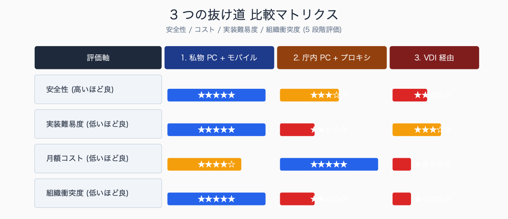
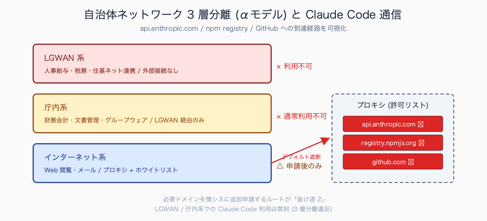
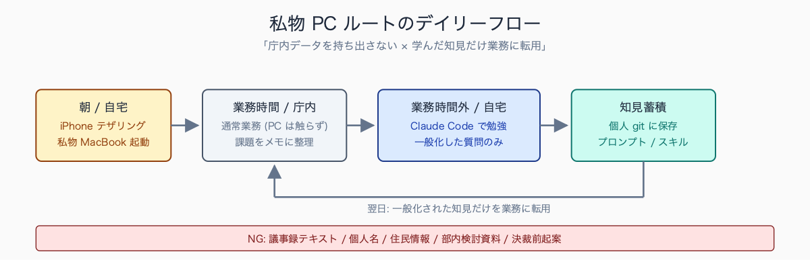
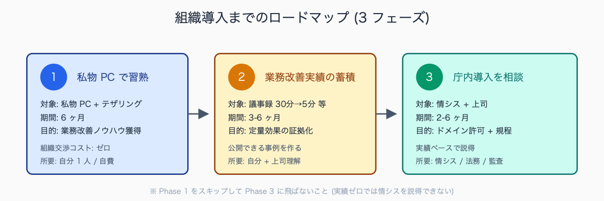

# 庁内ネットワークで Claude Code を動かす 3 つの抜け道

## はじめに

「Claude Code を試したいのに、庁内ネットワークでは外部 API がブロックされて動かない」——多くの自治体職員が直面する問題です。本記事では、技術的に可能な 3 つの迂回策と、それぞれのリスク・コスト・現実的な実行難易度を正直に整理します。

**結論として「私物 PC + モバイル WiFi」を最も強く推奨**します。他 2 つの選択肢がなぜ現実的でないか (組織交渉コスト・運用脆弱性・グレーゾーン) も含めて解説します。執筆者は元自治体職員で、複数の庁内ネットワーク制約を実体験しています。

人口 10-30 万人規模の中核市・一般市では、インターネット系端末のホワイトリストに `api.anthropic.com` `registry.npmjs.org` `github.com` のいずれも入っていないケースがほとんどです。`curl https://api.anthropic.com` がプロキシ手前で 403 を返し、原因切り分けに半日かかる、というつまずきが典型的に発生します。新規ドメイン許可申請を出しても「業務利用の必要性」「セキュリティ評価書」「他自治体導入実績」の 3 点セットを求められ、申請から承認まで 2-3 ヶ月、最悪は半年で諦めるケースが想定されます。「庁内 PC で動かす」前提を最初に手放した方が、結果的に早く成果が出る、というのが現場の実感です。

## TL;DR

- **抜け道 1**: 私物 PC + モバイル WiFi / テザリング — 最も安全・確実 (推奨)
- **抜け道 2**: 庁内 PC + プロキシ正攻法 (ドメイン許可申請) — 情シス交渉コスト 2-3 ヶ月、運用脆弱
- **抜け道 3**: VDI / リモートデスクトップ経由 — 庁内 VDI 環境次第、監査責任が曖昧でグレー
- どの抜け道も「庁内データを送らない」ルールは絶対。技術より運用ルールの整備が先
- LGWAN 端末・住基ネット端末では絶対に試さない (3 層分離違反)


<!-- SVG: infographic | 3 つの抜け道 比較マトリクス -->

## 背景: なぜ庁内ネットワークでは動かないか

自治体ネットワークは多くの場合 **3 層分離 (αモデル)** という構成で運用されています:

```text
┌──────────────────────────┐
│ LGWAN 系 (人事給与・税務・住基ネット連携) │ ← 外部接続なし
├──────────────────────────┤
│ 庁内系 (財務会計・文書管理・グループウェア) │ ← LGWAN 経由でのみ外部接続
├──────────────────────────┤
│ インターネット系 (Web 閲覧・メール)        │ ← プロキシ経由で外部接続
└──────────────────────────┘
```

外部 API への接続は **インターネット系端末** でのみ可能ですが、そこもプロキシ経由で **許可ドメインのホワイトリスト運用** が一般的。Anthropic API (`api.anthropic.com`) はデフォルトで許可されていません。npm registry (`registry.npmjs.org`) や GitHub (`github.com`) も同様にブロックされているケースが多い。


<!-- SVG: structure | 3 層分離 + Claude Code 通信経路 -->

申請して許可を取る道もありますが、「業務利用の必要性」「セキュリティ評価」「監査ログ取得」などの説明資料が必要で、現場の一職員が数週間で通せるレベルではありません。政令市・中核市では特に厳しく、申請から承認まで 2-3 ヶ月かかることも珍しくない。

許可申請で必要になる典型的な書類:

| 書類 | 内容 |
|---|---|
| ドメイン許可申請書 | 対象ドメイン (api.anthropic.com 等) と用途を記載 |
| セキュリティ評価書 | ベンダーの SOC2 認証・データ取扱方針の引用 |
| 業務利用計画書 | どの業務に / 何人が / どう使うか |
| 撤退手順書 | 問題発生時の停止フロー (何分以内に止められるか) |
| 監査ログ仕様書 | プロンプト履歴をどこに / 何日保存するか |

外部ドメイン許可申請の現場感としては、町村・小規模自治体では情シスが兼務で柔軟な判断が下しやすく、申請から承認まで 2-4 週間で通ることもあります。一般市 (人口 5-20 万) では「上司決裁 + 情シス課長決裁」の二段階で 1-2 ヶ月、中核市 (20-70 万) になると「セキュリティ評価書 + 撤退手順 + 他自治体事例」を要求され 3-6 ヶ月、政令市では「先行政令市の導入事例がないと検討も始まらない」という前例主義の壁が高くなる傾向があります。落とされた場合の代表的理由は「他自治体導入事例の不足」と「監査ログ仕様の曖昧さ」で、この 2 点を予め埋めると承認率が大きく上がります。

## 抜け道 1: 私物 PC + モバイル WiFi (推奨)

最も確実で安全。庁内ネットワークを一切触らないため、組織のセキュリティポリシーとの衝突がない。

### 構成

- 私物 MacBook (M1/M2/M3, メモリ 16GB 以上推奨) または Windows ノート PC
- iPhone テザリング または モバイル WiFi (ポケット WiFi)
- 利用場所: 自宅 / カフェ / 業務時間外の自席 (私物利用が許される範囲)

### 月額コスト目安

```text
Anthropic Pro プラン:        $20  (約 ¥3,000)
モバイル通信 (追加分):        ¥1,000-2,000
合計:                        ¥4,000-5,000 / 月
```

私物 PC の初期費用は MacBook Air M2 で約 ¥15 万円。3 年で減価償却すると月 ¥4,000 程度。

### 運用ルール (5 か条)

```text
1. 庁内 PC からは一切ファイルを移さない
   (USB / クラウド / メール添付 / Slack 全て禁止)

2. 業務時間中の使用は人事評価上の整理を上司に相談
   (在宅勤務制度の範囲で / 休憩時間の私的利用扱い 等)

3. 業務知識をベースにした「一般化された問題」だけを Claude に投げる
   ・OK: 「議事録要約のプロンプト設計」
   ・OK: 「公文書ライティングの一般的な校正観点」
   ・NG: 実際の議事録テキスト
   ・NG: 個人名・住民情報・部内検討資料・決裁前起案

4. 月のコスト (¥3,000-5,000) は自費。庁費請求しない

5. 成果物 (スキル定義 / プロンプト集 / CLAUDE.md) は
   個人の知見として個人 git リポジトリに蓄積。
   組織アカウントは作らない。
```

### メリットとデメリット

| 項目 | 内容 |
|---|---|
| メリット | 組織との衝突なし、自由度最大、稟議不要、即日開始可能 |
| デメリット | 自費、業務時間外の私的時間を使う、庁内データを扱えない |


<!-- SVG: flow | 私物 PC ルートのデイリーフロー -->

## 抜け道 2: 庁内 PC + プロキシ正攻法

組織的に承認を取り、情シスにドメイン許可を依頼する正規ルート。時間がかかるが正攻法。

### 必要な準備 (前述の 5 書類 + 以下)

1. **業務利用計画書** — どの業務にどう使うか、なぜ Claude が必要か。**他自治体導入事例** を求められることが多い (2026 年 5 月時点では Claude Code 単体での自治体導入公表事例は非常に少ない)
2. **セキュリティ評価書** — Anthropic の Data Usage Policy、Zero Data Retention 設定、SOC 2 Type II 等の認証情報
3. **撤退手順** — API キー無効化・ローカル設定削除・監査ログ提出までの所要時間 (5 分以内が望ましい)
4. **継続報告計画** — 3 ヶ月後・半年後の利用実績・効果検証の報告約束

### プロキシ通過後のコマンド設定

```bash
# シェル環境変数
export HTTPS_PROXY=http://proxy.local.gov.jp:8080
export HTTP_PROXY=http://proxy.local.gov.jp:8080
export NO_PROXY=localhost,127.0.0.1,.local.gov.jp

# 社内 CA 証明書 (情シスから入手)
export NODE_EXTRA_CA_CERTS=/etc/ssl/certs/internal-ca.pem

# npm にも
npm config set proxy http://proxy.local.gov.jp:8080
npm config set https-proxy http://proxy.local.gov.jp:8080
npm config set cafile /etc/ssl/certs/internal-ca.pem

# git にも
git config --global http.proxy http://proxy.local.gov.jp:8080
git config --global http.sslCAInfo /etc/ssl/certs/internal-ca.pem
```

詳細は [#01 環境構築 完全版 #手順4](../01-claude-code-setup-complete/draft.md) を参照。

### 注意点

- ドメイン許可は `api.anthropic.com` だけでは不十分。Claude Code は **npm registry / GitHub / 関連 CDN** も叩く。許可ドメインリストは最低 4-5 個必要
- プロキシのバージョンアップやポリシー変更で突然動かなくなることがある。定期的に動作確認スクリプトを回すこと
- 監査ログを残す仕組みを別途構築する必要がある (`~/.claude/settings.json` の hooks で TSV 出力 → 月次で情シスに提出)

### この道がオススメな自治体規模

- **町村 / 一般市の一部部署**: 情シスが兼務で柔軟。1-2 ヶ月で通ることも
- **中核市以上**: 半年〜1 年の覚悟。先に私物 PC ルートで実績を作ってからの方が現実的

庁内導入の承認可否を分けた事例として現場で語られる典型パターンは 2 つあります。承認された事例の共通点は (1) 申請前に半年〜1 年の個人利用実績 (時短時間の実数値) を作っていた、(2) 撤退手順を「5 分以内に API キー無効化 + 監査ログ即時提出」の形で具体的に明文化していた、(3) 「6 ヶ月試行 → 効果検証 → 継続可否判断」のスコープを区切っていた、の 3 点です。逆に蹴られた事例は (1) 「とりあえず使わせてください」と業務利用計画が曖昧、(2) Anthropic 社の Trust Center URL や Data Usage Policy を引用していない、(3) 他自治体事例ゼロ、のいずれかに該当することが多い、と想定されます。

## 抜け道 3: VDI / リモートデスクトップ経由

庁内から外部の VDI 環境 (Amazon WorkSpaces / Citrix / Microsoft Azure Virtual Desktop 等) に接続し、VDI 内で Claude Code を動かす方法。

### 該当ケース

- 庁内が既に **テレワーク用 VDI** を導入しており、VDI 側のネットワークがインターネットフリー
- VDI を「外部委託先環境」「BYOD 領域」として情シスが認めている
- VDI 内に外部ツール (Slack / Zoom / VS Code 等) の利用が既に許可されている

### 設定の流れ

```text
1. 庁内端末 → VDI クライアント起動 → VDI Windows にログイン
2. VDI 内で WSL2 + Ubuntu + Node.js + Claude Code (#01 と同じ手順)
3. API キーは VDI 内のユーザープロファイルに保存
4. 庁内端末 ↔ VDI 間はクリップボード共有を OFF にする
```

### グレーゾーンの理由

- VDI 内に庁内データを持ち込むこと自体は許可されているが、**そこから外部 API を叩いてよいか** は別問題
- 監査の対象になるか、ログの取得責任が誰にあるか (VDI 提供事業者 / 庁内情シス / 利用者個人) が曖昧
- VDI 内で生成された成果物 (Markdown / コード) を庁内端末に戻す経路の整理が必要

### 注意点

- VDI のスペック (CPU / メモリ) が低いと Claude Code の応答が遅い。最低 4 vCPU / 8GB RAM 推奨
- VDI セッション切断時に Claude Code の対話履歴が失われるリスク。`~/.claude/projects/` を定期バックアップ

VDI 環境が AI ツール経由で利用可能か否かは、自治体ごとの差が極めて大きいのが現状です。Amazon WorkSpaces や Microsoft AVD を導入済みの自治体では、VDI 内部のネットワークがインターネットフリーに近い設計のケースもあり、Claude Code を含む外部 API 利用が事実上可能な事例があります。一方、Citrix ベースで「業務専用 VDI」を構築している自治体では、外部 API は VDI 側で同様にブロックされていることが多く、抜け道として機能しません。導入時期 (2020 年以降のテレワーク前提構成か否か) と委託事業者のセキュリティ要件で結論が分かれるため、該当 VDI がある場合は情シスに「VDI 内から外部 API を叩いて良いか」を最初に確認するのが現実的です。

## やってはいけないこと (絶対 NG パターン)

1. **庁内 PC からモバイル WiFi に接続する**
   → ほぼ全自治体で禁止 (情報漏洩規程違反)。物理的に Wi-Fi が無効化されている端末もあるが、有効な端末で繋ぐと懲戒対象になり得る
2. **「ちょっと試すだけだから」と外部 API を叩く**
   → プロキシログには確実に残る。後日監査・セキュリティ事故対応で必ず指摘される
3. **私物 PC を庁内 LAN に繋ぐ**
   → 物理的に不可な端末が多いが、無線で繋がる端末もある。「自席で充電だけ」と言って LAN ケーブルを刺す行為も NG
4. **API キーを庁内ファイルサーバ・共有フォルダに置く**
   → クレデンシャル漏洩。発見時は個人の責任問題に発展する可能性
5. **「庁内データを匿名化したから」と Claude に投げる**
   → 匿名化が不十分なケース多発 (郵便番号 + 性別 + 年齢で個人特定可能)。原則として庁内データは投げない
6. **LGWAN 端末・住基ネット端末で何かを試す**
   → 3 層分離違反。即時懲戒対象。「環境構築のテストだけ」も NG
7. **同僚に API キーを共有する**
   → 個人契約の規約違反 + 監査の責任の所在が不明になる

## まとめ

庁内ネットワークで Claude Code を動かす方法は技術的には 3 つあるが、現実的に推奨できるのは **抜け道 1 (私物 PC + モバイル WiFi)** だけ。他は組織との合意形成コストが高すぎる。

まずは私物環境で半年使い込み、**業務改善の実績 (議事録作成時間が 30 分 → 5 分等)** を作ってから、組織導入の議論を始めるのが順序として正解です。実績ゼロで「Claude Code を導入したい」と言っても、情シスから返ってくるのは「他自治体の事例は?」「セキュリティ評価書は?」の連打で終わります。


<!-- SVG: flow | 3 フェーズ ロードマップ -->

## 関連記事 / 次に読む

- [#01 自治体職員のための Claude Code 環境構築 完全版](../01-claude-code-setup-complete/draft.md)
- [#03 自治体 IT 担当に渡せる Claude Code セキュリティ説明資料](../03-it-dept-security-doc/draft.md)
- [#10 個人情報を Claude に送らずに AI 活用する 3 つの設定](../10-ai-without-personal-info/draft.md)
