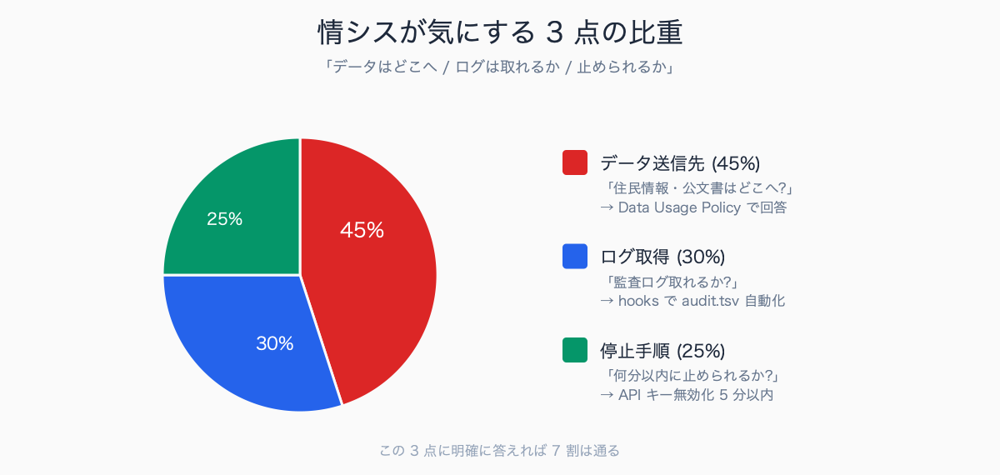
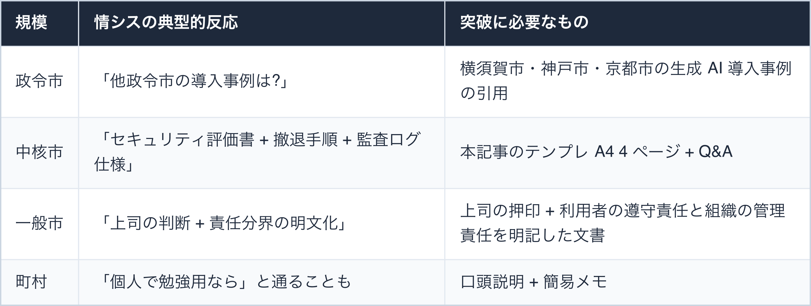
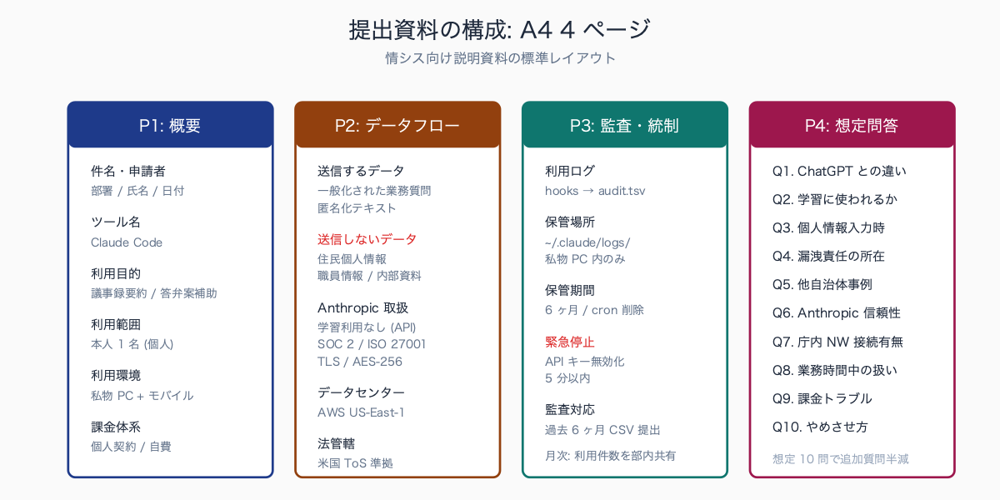
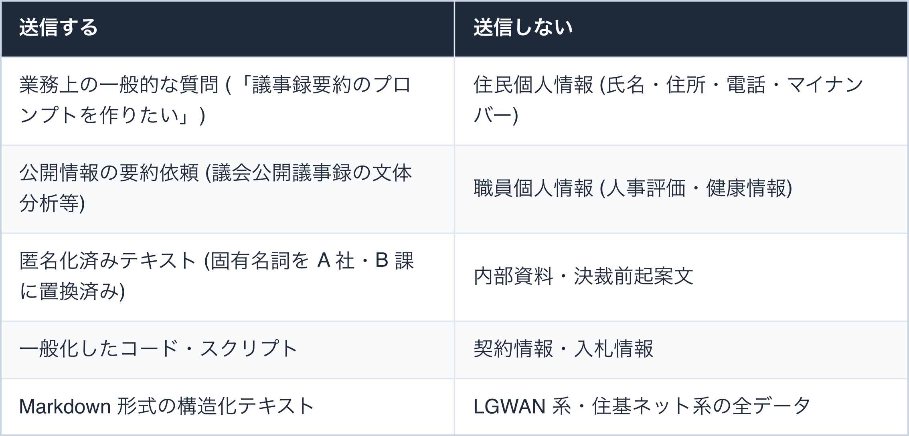
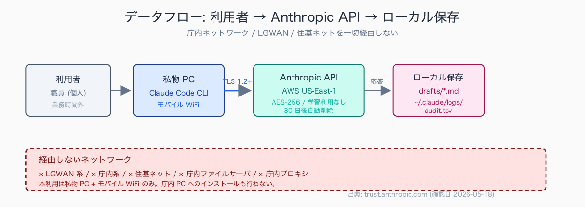
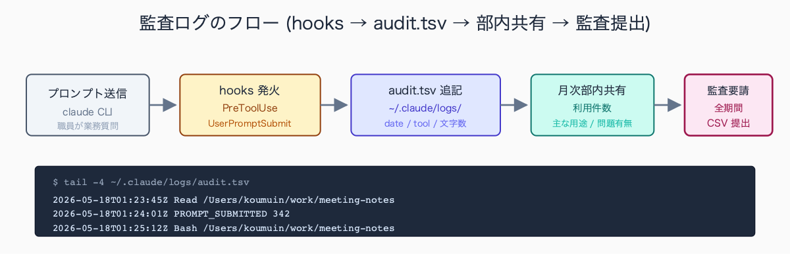
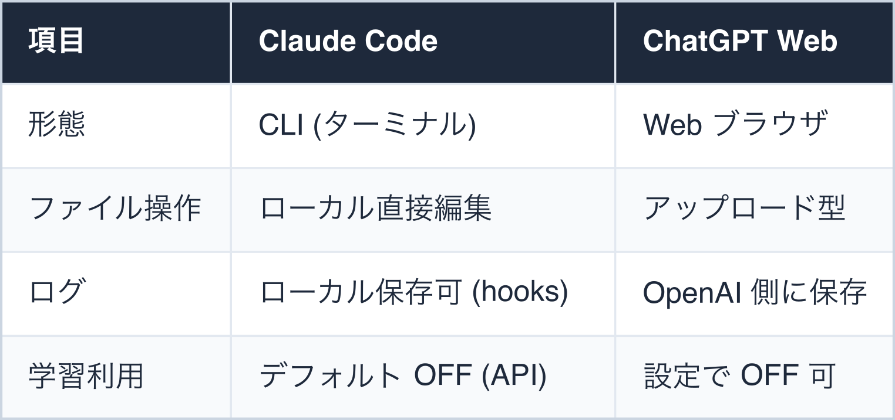
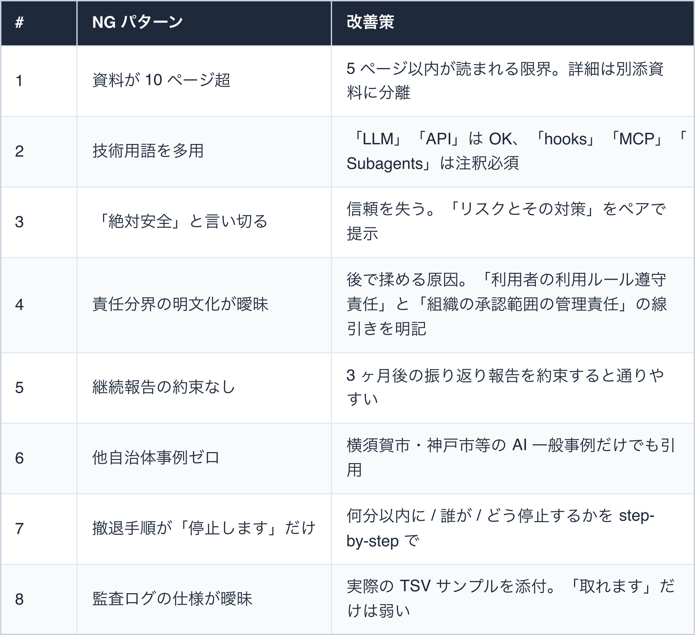
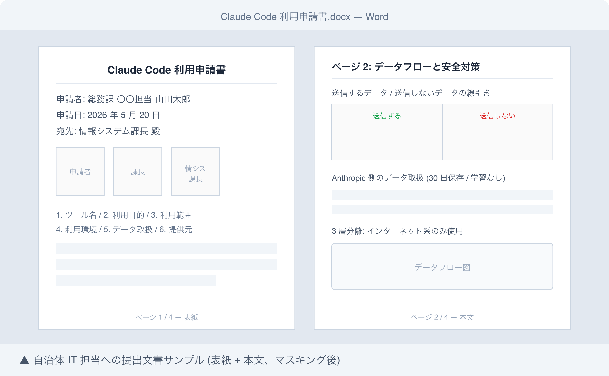

# 自治体 IT 担当に渡せる Claude Code セキュリティ説明資料

## はじめに

「Claude Code を使わせてほしいと情シスに相談したら、セキュリティ評価書を出せと言われた」「ChatGPT との違いを説明して、と言われて言葉に詰まった」——自治体での AI ツール導入の最初のハードルです。

本記事は、IT 担当課に提出することを想定した「Claude Code 利用に関するセキュリティ説明資料」のテンプレートと、想定質問への回答集を提供します。執筆者は元自治体職員で、庁内稟議を複数回経験し、情シスとの折衝の現場感を持っています。現在は Claude Code を使い、47 都道府県の統計サイト stats47.jp（約 2,000 のランキングを毎日自動更新）を個人で開発・運用しています。

本記事は **「個人利用範囲での説明」** を主軸とします。組織導入 (10 人以上の同時利用 / 庁費購入 / 庁内 PC への配布) はスコープ外で、別途より重い評価が必要になります。

情シス担当者の AI 理解度は、自治体規模・担当者の世代で大きく分かれる傾向があります。30 代の若手担当者なら ChatGPT を業務外で触っているケースが多く、Claude Code の説明も比較的スムーズに通ります。

一方、50 代以上のベテラン担当者では「ChatGPT は知っているが Claude は初耳」「CLI ツールという概念自体が伝わらない」というレベル感もあり、最初の説明で 30-60 分かかることが珍しくありません。

最も多い初回質問は**「ChatGPT と何が違うのか」「データはどこに送られるのか」「学習に使われないか」の 3 点**で、この 3 つに即答できる準備が初回相談の鍵になります。

## TL;DR

- 情シスが知りたいのは **「データはどこに行くか」「ログは取れるか」「止められるか」** の 3 点に集約される
- Anthropic 公式情報 (Data Usage Policy / Trust Center / SOC 2 Type II) を引用すれば 7 割は通る
- 残り 3 割は「組織としての運用ルール」(誰が責任を持つか、教育はどうするか、何時間以内に停止できるか)
- 説明資料は **A4 で 3-5 ページ**。長すぎると読まれない、短すぎると「検討不足」と不安にされる
- 想定質問 (Q&A) を 10 個用意しておくと追加質問の往復が半減する
- 自治体規模 (政令市 / 中核市 / 一般市 / 町村) によって情シスの判断基準が異なる


<!-- SVG: infographic | 情シスが気にする 3 点の比重 -->

## 背景: なぜ自治体 IT 担当は慎重か

自治体 IT 担当は、情報漏洩事故が起きた時の組織責任を負う立場です。民間企業と異なる以下の特性があります:

1. **住民個人情報を扱う比率が高い** — 万一の漏洩は議会・マスコミ案件に発展
2. **議会対応コスト** — 漏洩事故は次の議会で必ず質問される
3. **総務省ガイドライン拘束** — 「自治体情報セキュリティポリシーに関するガイドライン」(令和 5 年改定) の枠内で判断
4. **個人情報保護法 + 自治体個人情報保護条例** の二重縛り
5. **前例主義** — 他自治体の導入事例を強く求める傾向 (政令市ほど顕著)

AI ツールについては、文部科学省や経済産業省のガイドラインを参考に判断するケースが多いですが、**自治体向けの明確な基準は 2026 年 5 月時点で未整備** の状況です。

総務省は「自治体における生成 AI の利用に関する考え方」(令和 5 年・6 年) を出していますが、個別ツールの可否は各自治体判断に委ねられています。

### 自治体規模別の典型的反応


<!-- SVG: table | 規模 / 情シスの典型的反応 / 突破に必要なもの -->

自治体 IT 担当の典型的な対応スタイルは、**「慎重・前例主義・横並び意識」の 3 点**に集約されます。

新規ツールの相談に対して最初に出る言葉が「他自治体での導入事例はありますか」であるケースが多く、これは情報セキュリティ事故時の組織責任を負う立場として、判断の根拠を他自治体に求める心理が働くためです。

さらに「決裁を上げる際に課長・部長を説得する材料が欲しい」という実務上の制約もあり、Anthropic 公式ドキュメント (Trust Center / Data Usage Policy) と他自治体公表事例 (横須賀市 ChatGPT 全庁導入 2023 年等) の 2 点を予め揃えておくと、相談の往復回数が半減する傾向があります。

## 提出資料の構成テンプレ (A4 4 ページ)


<!-- SVG: structure | A4 4 ページ構成 -->

### ページ 1: 概要 (1/2 ページ)

```text
件名: Claude Code 業務利用に関するセキュリティ評価依頼
申請者: <部署名・氏名>
申請日: 令和 8 年 5 月 18 日 (2026-05-18)
宛先: <情報システム課長>

1. ツール名: Claude Code (Anthropic 社提供の CLI ツール)
2. 利用目的: 業務文書 (議事録要約・答弁案作成補助・公文書校正) の作成支援
3. 利用範囲: <部署名> 内の <人数> 名 (申請者本人のみの場合は「申請者 1 名」)
4. 利用環境: 会社 (庁内) PC のインターネット系端末。プロキシ経由で
   api.anthropic.com 等に接続 (要ドメイン許可)。LGWAN 系・住基ネット系は不使用
5. データ取扱: 個人情報・特定個人情報・機密情報・決裁前起案は一切送信しない
6. 提供元: Anthropic, PBC (米国デラウェア州法人、設立 2021 年)
7. 課金体系: 個人契約 (Anthropic Pro $20/月) を会社 PC 上で利用 — 庁費購入なし
8. 利用期間: <YYYY-MM-DD> から 6 ヶ月 (延長は別途協議)
9. 申請事項: 上記ドメインのプロキシ・ホワイトリスト追加
```

### ページ 2: データフローと安全対策

提出文書には以下を明記する。

#### 送信するデータ / 送信しないデータ


<!-- SVG: table | 送信する / 送信しない -->

#### Anthropic 側のデータ取扱

```text
- 保存期間: API 経由は 30 日 (デフォルト)、Zero Data Retention 設定で 0 日にも変更可
- 学習利用: 顧客 API データはモデル学習に使用されない (Anthropic 公式 Data Usage Policy)
- 暗号化: TLS 1.2 以上で通信、保存時は AES-256 で暗号化 (Trust Center 記載)
- 認証: SOC 2 Type II 取得 (2024 年)、ISO 27001 取得 (2024 年)
- データセンター: AWS US-East-1 / Europe (リージョン選択不可、US デフォルト)
- 法管轄: 米国デラウェア州法、Anthropic Terms of Service 準拠
```

参照: <https://www.anthropic.com/legal/privacy> / <https://trust.anthropic.com/>

データフロー図は手書きレベルで十分で、PowerPoint で 30 分程度で作成できる粒度が情シスに伝わりやすい傾向があります。

典型的には「利用者 → 会社 PC (インターネット系端末・Claude Code CLI) → 庁内プロキシ → HTTPS → api.anthropic.com → AWS US-East-1」の経路を示し、あわせて「LGWAN 系・住基ネット系の端末は経路に一切含まれない」ことを明記する構成が定番です。

**3 層分離のどのセグメントを使い、どのセグメントを使わないかを図で示すこと**が、情シスの最大の関心事に直接答えることになります。

図中に「Zero Data Retention 設定済」「TLS 1.2 以上」「保存期間 30 日 (Anthropic 側)」「ローカル保管期間 6 ヶ月」など主要な数値を吹き出しで入れると、文章を読まなくても要点が把握できる図になり、情シス内回覧の通りが大きく改善します。


<!-- SVG: flow | 利用者→会社PC→プロキシ→Anthropic→ローカル保存 -->

### ページ 3: 監査・統制

```text
- 利用ログ: Claude Code の hooks 機能で全プロンプトをローカル TSV に自動記録
- 保管場所: 会社 PC のローカル ~/.claude/logs/audit.tsv (LGWAN 系・共有フォルダには置かない)
- 保管期間: 6 ヶ月、その後自動削除 (cron で週次クリーンアップ)
- 緊急停止: API キー無効化により即時停止 (5 分以内)
  - 手順: https://console.anthropic.com → API Keys → Disable
- 監査対応: 過去 6 ヶ月分のプロンプトログを CSV で提出可能
- 月次報告: 利用件数・主な用途・問題発生有無を <部署名> 内で共有
```

#### `~/.claude/settings.json` の hooks 設定 (実運用ファイル)

```json
{
  "hooks": {
    "PreToolUse": [
      {
        "matcher": ".*",
        "hooks": [
          {
            "type": "command",
            "command": "jq -r '\"\\(now|todate)\\t\\(.tool_name)\\t\\(.cwd)\"' >> ~/.claude/logs/audit.tsv"
          }
        ]
      }
    ],
    "UserPromptSubmit": [
      {
        "hooks": [
          {
            "type": "command",
            "command": "jq -r '\"\\(now|todate)\\tPROMPT_SUBMITTED\\t\\(.prompt|length)\"' >> ~/.claude/logs/audit.tsv"
          }
        ]
      }
    ]
  }
}
```

このログには **「いつ・どのツール (Read/Edit/Bash)・どのプロジェクト・プロンプト文字数」** が記録されます。プロンプト本文は記録しない設計 (本文記録は別途設定可能だが、住民情報誤入力時のリスクを下げるためデフォルトは長さのみ)。

#### audit.tsv のサンプル

```text
2026-05-18T01:23:45Z	Read	/Users/koumuin/work/meeting-notes
2026-05-18T01:23:47Z	Edit	/Users/koumuin/work/meeting-notes
2026-05-18T01:24:01Z	PROMPT_SUBMITTED	342
2026-05-18T01:25:12Z	Bash	/Users/koumuin/work/meeting-notes
```


<!-- SVG: flow | hooks → audit.tsv → 部内共有 → 監査提出 -->

### ページ 4: 想定問答 (FAQ)

説明資料の最後に Q&A 形式で 5-10 個用意しておくと、追加質問が大幅に減ります。次セクションの 10 問を貼り付ければ完成。

## 想定質問と回答例 (10 問)

### Q1. ChatGPT と何が違うのか

**A.** Claude Code は **CLI (コマンドラインインターフェース) ツール** で、ローカルファイルを直接操作できる点が ChatGPT Web 版と異なります。提供元の Anthropic は AI 安全性研究を主目的とする企業で、データ取扱方針が明示されています。


<!-- SVG: table | 項目 / Claude Code / ChatGPT Web -->

なお Anthropic は、ターミナルを使わない GUI のデスクトップアプリ **Claude Desktop** も別途提供していますが、本利用で導入を申請するのは、ファイル操作・業務自動化が可能な **Claude Code（CLI）** です（Claude Desktop はチャット中心で自動化用途には用いません）。

### Q2. データは AI の学習に使われるか

**A.** API 経由 (Claude Code が使う経路) の場合、Anthropic の方針として顧客データは学習に使用されません。正確な記述は公式 Data Usage Policy (<https://www.anthropic.com/legal/privacy>) を都度確認する前提です。本資料の確認日: 2026-05-18。

情シス向け説明で引用すべき Anthropic 公式ページは、次の 3 つが基本です。

- Privacy Policy / Data Usage Policy (https://www.anthropic.com/legal/privacy)
- Trust Center (https://trust.anthropic.com/)
- Terms of Service (https://www.anthropic.com/legal/consumer-terms)

本資料では確認日: 2026-05-18 時点の記述に基づいていますが、Anthropic のポリシーは定期的に更新されるため、申請文書には必ず「確認日 YYYY-MM-DD 時点」と明記し、再確認が必要な旨を付記する運用が安全です。

情シス側も「いつ時点の情報か」を必ず確認するため、**日付明記は信頼性確保に直結**します。

### Q3. 住民の個人情報を入力したらどうなるか

**A.** **運用ルールで「個人情報は入力しない」と定めた上で、技術的にも hooks による事前マスキングを設定可能** です ([#11 Hooks で個人情報マスキングを自動化](../11-hooks-personal-info-masking/draft.md) で別途解説)。万一誤って入力した場合、API ログは 30 日後に自動削除されます。Zero Data Retention 設定を有効化すれば即時削除も可能です。

技術的マスキング例:

```bash
# ~/.claude/settings.json で送信前に PII を伏字化
{
  "hooks": {
    "UserPromptSubmit": [{
      "hooks": [{
        "type": "command",
        "command": "jq -r '.prompt' | grep -E '[0-9]{3}-[0-9]{4}-[0-9]{4}' && exit 2 || exit 0"
      }]
    }]
  }
}
```

(電話番号らしき文字列を検出したら送信中断する例)

### Q4. もし情報漏洩事故が起きた場合の責任は誰にあるか

**A.** 本利用は会社 PC で業務として行うため、漏洩事故時の責任の所在は **通常の業務上の情報事故と同じ枠組み** で扱われます。利用者個人は「送信してはいけないデータ (個人情報・決裁前起案など) を送らない」という利用ルールの遵守責任を負い、組織は利用を承認した範囲での管理責任を負います。だからこそ、利用開始前に送信禁止データの範囲を明文化し (ページ 2 参照)、下記の即応手順を準備しておくことが重要です。事故発生時は以下の手順で対応します:

```text
1. 即時 API キー無効化 (5 分以内、console.anthropic.com)
2. 当該プロンプトログを保全 (~/.claude/logs/audit.tsv)
3. 上司・情シスへ書面報告 (24 時間以内)
4. Anthropic への削除依頼 (privacy@anthropic.com、必要に応じて)
5. 影響範囲調査と再発防止策の策定 (1 週間以内)
```

### Q5. 他自治体での導入事例はあるか

**A.** 2026 年 5 月時点で、**Claude Code 単体** の自治体導入事例の公表は確認できていません。生成 AI 一般での導入事例は以下があります (公表事例のみ):

- 横須賀市: ChatGPT を全庁導入 (2023 年 4 月、全国初)
- 神戸市: 業務利用の試行 (2023 年 6 月〜)
- 京都市: 庁内 AI チャットボットの試行
- 東京都: 文章生成 AI の利用ガイドライン策定 (2023 年 8 月)

本提案は **個人利用範囲での試行** であり、組織導入ではありません。先行事例の蓄積を待つよりも、個人ベースで業務改善実績を作る方が現実的と判断しています。

公開情報の範囲で他自治体事例を引用する場合の代表例は、次のとおりです。

- 横須賀市 (ChatGPT 全庁導入、2023 年 4 月)
- 神戸市 (生成 AI 業務利用試行、2023 年 6 月〜)
- 東京都 (文章生成 AI 利用ガイドライン策定、2023 年 8 月)
- つくば市 (ChatGPT 試行、2023 年)
- 農林水産省 (Claude 業務利用、2024 年公表)

自治体規模が近い先行事例があれば説得力が増しますが、なくても「全国初の横須賀市以降、自治体での生成 AI 利用は段階的に拡大している」という流れを示すだけでも、判断材料として機能します。

各事例は自治体公式 HP または報道発表資料から URL を確認し、引用元と確認日を併記する運用が望ましいです。

### Q6. Anthropic は信頼できる企業か

**A.** 米国の AI 安全性研究を主とする企業 (2021 年設立)。Google・Amazon などが大規模出資。Trust Center (<https://trust.anthropic.com/>) で以下の認証情報を公開:

- SOC 2 Type II (確認日 2026-05-18)
- ISO 27001:2022 (確認日 2026-05-18)
- ISO/IEC 42001:2023 (AI マネジメントシステム規格)
- HIPAA 対応オプション (医療データ向け、要追加契約)

### Q7. 庁内ネットワークから接続させるのか

**A.** はい。会社（庁内）PC の **インターネット系端末** から、情シスが許可したプロキシ経由で `api.anthropic.com` 等に接続します。**LGWAN 系・住基ネット系の端末は一切使いません**（3 層分離を厳守）。接続経路は通常のインターネット閲覧と同じ「インターネット系」セグメントで、新たに必要なのは対象ドメイン（`api.anthropic.com` / `registry.npmjs.org` / `github.com` 等）のホワイトリスト追加のみです。会社 PC のセットアップ手順と申請ドメインの一覧は別添資料（[#01 環境構築 完全版](../01-claude-code-setup-complete/draft.md) の手順 4、[#02 庁内ネットワークで動かす方法](../02-internal-network-workarounds/draft.md)）に整理しています。なお、許可申請の前段として職員が私物 PC で試用し実例を作っておくケースもありますが、本資料が利用許可を求める対象は会社 PC です。

### Q8. 業務時間中に使うのか

**A.** はい。会社 PC で業務として使うため、**業務時間中の利用**を想定します。用途は議事録作成・文書校正・データ集計など本来の所掌事務であり、Claude Code はその補助ツールです（Excel や Word と同じ位置づけ）。労務管理上の特別な整理は不要ですが、「送信してはいけないデータの範囲」など利用ルールは <人事・情報担当課> と共有済み (共有日: <日付>)。

### Q9. 課金トラブルが起きたら誰が払うか

**A.** **個人契約・自費** のため、組織に課金請求が来ることはありません。Anthropic Pro プランは月額固定 ($20)、API 従量課金には個人クレジットカードで月額上限 ($50 等) を設定済み。庁費請求は一切発生しません。

### Q10. やめさせたい場合どうすればよいか

**A.** 上司または情シスから停止指示があれば、以下を実行:

```text
1. API キーを当日中に無効化 (console.anthropic.com)
2. 会社 PC から ~/.claude/ を削除 (rm -rf ~/.claude/)
3. 書面で停止報告を提出 (1 週間以内)
4. 監査ログ (~/.claude/logs/audit.tsv) を保管期間内なら提出
```

情シス相談の現場で「即答できなかった」質問として現場経験者が挙げる典型例は 2 つあります。

- **「米国の CLOUD Act でデータが米政府に開示される可能性は」** — 法的論点が複雑で、Anthropic Privacy Policy の該当箇所と日本政府の見解 (個人情報保護委員会の指針) を後日調べて回答する必要がある
- **「Anthropic が買収・倒産した場合、データはどうなるか」** — Terms of Service の「Termination」「Survival」条項の引用と、利用者側でローカル保管している成果物は問題ないという 2 段構えの回答が必要

これら 2 つは事前準備しておくと相談がスムーズに進みます。

## よくあるつまずきポイント


<!-- SVG: table | # / NG パターン / 改善策 -->

## まとめ

自治体 IT 担当への説明は **「不安を解消する」** ことが最大の目的。技術的な正確さよりも、以下の 3 点を強調する資料が通りやすい:

1. **何かあった時に止められる** (5 分以内に API キー無効化、手順明記)
2. **使う範囲が限定的で明確** (会社 PC のインターネット系端末のみ・LGWAN 系/住基ネット系は不使用、送信禁止データの線引きを明文化)
3. **責任分界が明確** (利用者は利用ルールの遵守責任、組織は承認した範囲の管理責任)

本記事の有料部分では、実際に提出可能な Word テンプレートの完全版 (A4 4 ページ、コピペ可能) と、想定質問 30 問・情シス交渉での「殺し文句」3 つを掲載します。

## 関連記事 / 次に読む

- [#01 Claude Code 環境構築 完全版](../01-claude-code-setup-complete/draft.md)
- [#02 庁内ネットワークで動かす 3 つの抜け道](../02-internal-network-workarounds/draft.md)
- [#10 個人情報を Claude に送らずに AI 活用する 3 つの設定](../10-ai-without-personal-info/draft.md)
- [#11 Claude Code Hooks で個人情報マスキングを自動化する](../11-hooks-personal-info-masking/draft.md)

---

### この続きは有料パートです

**こんな人におすすめ**

情シスに「セキュリティ評価書を出して」と言われ、何をどう書けばいいか分からない人。提出文書をゼロから作る時間がなく、そのまま使える Word テンプレと想定問答を揃えて初回相談を一発で通したい自治体職員に向いた内容です。

**この続きで読めること**

> - そのまま提出できる Word テンプレ (A4 4 ページ、コピペで使える形式)
> - 想定問答 30 問完全版 (本記事の 10 問 + 追加 20 問)
> - 私が情シス交渉で実際に使った「殺し文句」3 つ
> - hooks による PII マスキング・監査ログの完全 settings.json (即コピペ可)

単体購入のほか、マガジン「公務員 × Claude Code 実務活用ガイド」でシリーズをまとめて読むこともできます。

ここから先は有料部分: ¥300

### 有料セクション 1: A4 4 ページ Word テンプレ完全版

情シス提出文書のレイアウト実例として現場で広く使われている構成は、A4 縦・MS 明朝 10.5pt・上下マージン 25mm・左右マージン 20mm が基本です。

1 ページ目に件名と申請者情報、上部に「申請者押印欄」「上司決裁欄」「情シス課長確認欄」の 3 つの押印枠を配置するのが定番。データフロー図 (2 ページ目) は中央配置、監査ログ仕様 (3 ページ目) は表形式、想定問答 (4 ページ目) は Q&A 形式で 2 段組にすると読みやすさが向上します。

赤字強調は**「LGWAN 系・住基ネット系は不使用」「庁費請求なし」「5 分以内に停止可能」の 3 点**に絞ると、情シスの安心ポイントが一目で伝わります。


<!-- SVG: screenshot | 実際の提出文書のページ画像 -->

含まれる内容:
- 表紙テンプレ (件名・申請者・宛先・押印欄)
- データフロー図のサンプル (PowerPoint で作成可能なシンプルな図、SVG ソース付き)
- 監査ログ仕様の記述例 (情シスが安心する書き方)
- 撤退手順の明文化 (5 ステップ・所要時間付き)
- ダウンロード可能な .docx ファイルへのリンク

### 有料セクション 2: 想定問答 30 問完全版

本記事の 10 問に加えて、現場で実際に出やすい追加 20 問の代表例は、以下のようなジャンルに分かれます。

- 米国法関連 (CLOUD Act、輸出規制 ITAR / EAR、FISA 702 条)
- データ保護関連 (GDPR・CCPA との関係、データ主権)
- 契約関連 (Anthropic の買収・倒産時のデータ扱い、SLA、責任制限条項)
- 技術関連 (プロンプトインジェクション、出力結果の著作権、ハルシネーション対策)
- 運用関連 (会社 PC・業務時間中利用と情報資産管理規程上の整理、プロキシのドメイン許可範囲)

これらは中核市以上の情シスからは高確率で出る質問で、政令市では「弁護士確認済みか」とさらに掘り下げられるケースもあります。事前準備で回答テンプレを用意しておくと、相談の長期化を防げます。

追加質問の例:
- Q11. 米国法 (CLOUD Act) でデータが米政府に開示される可能性は?
- Q12. EU GDPR・カリフォルニア州 CCPA との関係は?
- Q13. Anthropic が買収・倒産した場合、データはどうなる?
- Q14. プロンプトインジェクション攻撃のリスクは?
- Q15. 出力結果の著作権は誰のものか?
- (以下 15 問)

### 有料セクション 3: 情シス交渉の「殺し文句」3 つ

情シス交渉で効果があったとされる「殺し文句」として現場で共有されているフレーズは、概ね次の 3 つに集約されます。

- **「6 ヶ月試行後に効果検証して継続可否を判断する」** という時限スコープの提示 — 情シスは「いつ止められるか」が見えると承認しやすくなる心理が働く
- **「触るのはインターネット系端末のドメイン許可だけで、LGWAN 系・住基ネット系には一切影響しません」** という影響範囲の限定提示 — 最も恐れる 3 層分離への波及がないと明言することで、リスク評価の対象が一気に狭まる
- **「Anthropic 公式 Trust Center で SOC 2 Type II 取得済みです」** という第三者認証の引用 — 情シスは「自分で評価する」より「外部監査済み」を好む傾向があり、判断を委ねやすくなる

各殺し文句について:
- フレーズ全文
- 言うべきタイミング (情シスがどんな反応を見せた瞬間か)
- 組織心理学的な裏側 (なぜ効くのか)
- 失敗事例 (タイミングを間違えて逆効果になったケース)

### 有料セクション 4: hooks 完全 settings.json

PII マスキング + 監査ログ + 緊急停止フラグまで含めた完全な `~/.claude/settings.json`。コピペで即動作。

<!-- circulation-footer:v2 -->

---

## 「公務員 × Claude Code」シリーズ

本記事は、自治体職員が Claude Code を日々の業務に活かすための全 31 本シリーズの 1 本です。環境構築・議事録・議会答弁・セキュリティ・データ活用・組織導入まで、関心のあるテーマから読み進められます。

シリーズの全記事はマガジンにまとめています。他の記事はこちらからどうぞ。

https://note.com/stats47/m/m512ad7023815

Claude Code に触れるのが初めての方は、まず導入記事「Claude Code とは何か — ターミナル未経験の公務員のための導入ガイド」から読むのがおすすめです。
