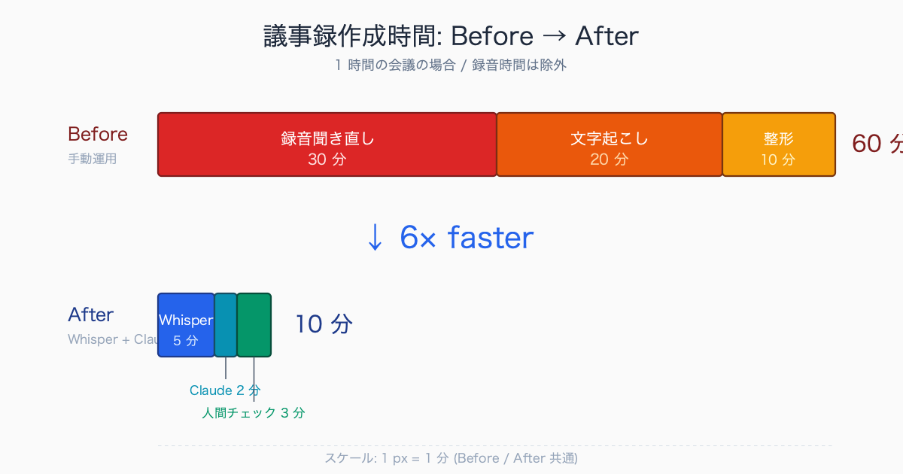
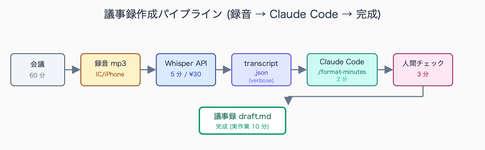
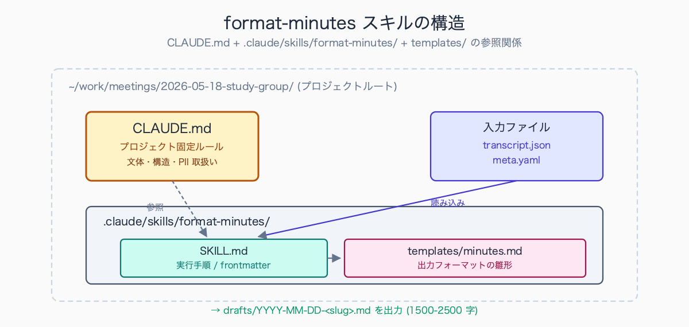
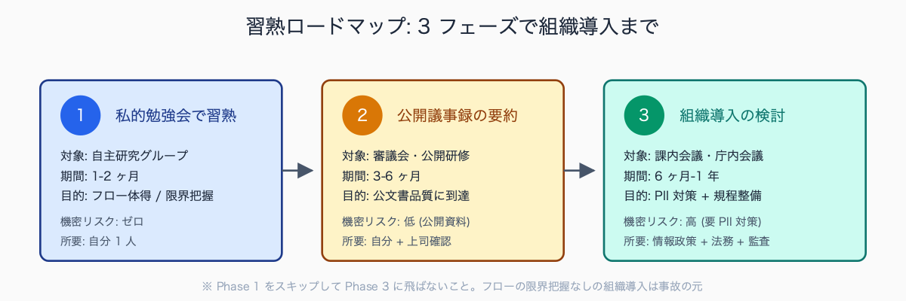

# 議事録 30 分 → 5 分にした手順 (録音 mp3 → Claude Code 要約)

## はじめに

「会議が終わるたびに 30-60 分かけて議事録を起こしている」「速記が苦手で、後から聞き返すと細部が抜ける」——自治体職員なら誰しも経験があるはずです。

本記事では、会議の録音 mp3 を **Whisper (音声認識) + Claude Code (要約整形)** に流し、議事録作成時間を 30 分から 5 分に短縮した手順を公開します。執筆者は元自治体職員で、現在もこのフローを実運用しています。

**※守秘配慮として、本記事は庁内会議録は対象外とします**。個人情報・特定個人情報・決裁前検討・人事案件を含む会議録は絶対にこのフローに乗せてはいけません。対象は **私的勉強会 / 公開研修 / 自主研究グループ / 自治体間連絡会 (公開議事録扱い)** に限定します。

典型的な現場感: 人口 5-30 万人規模の市役所では、総務課・企画課・財政課あたりに会議体が集中し、係長級が週 3-5 本の会議を抱える例が珍しくありません。1 本の議事録に 30-60 分、月の累計で 5-10 時間。特に予算編成期 (10-12 月) や決算 / 議会対応期 (2-3 月、9 月) は会議が倍増し、当日中に下書きを上司回覧 → 翌朝の打ち合わせまでに確定版、というスケジュールが定常化するケースもあります。深夜残業の常態化は地方公務員の長時間労働の典型パターンとして公的統計でも繰り返し指摘されており、議事録作成はその一因として現場感のある「あるある」業務です。

## TL;DR

- 録音は IC レコーダー (SONY ICD-PX470 等) または iPhone 標準ボイスメモで取得 (会議冒頭で **同意必須**)
- 文字起こしは **Whisper API** (クラウド、精度高 / 1 時間 ¥30-40) または **whisper.cpp** (ローカル、精度中)
- 文字起こしテキストを Claude Code に投げて要約・議事録形式に整形
- 1 時間の会議で **実作業時間 5 分**、Whisper 処理を含めても 10 分以内
- **庁内会議録は絶対にこのフローに乗せない** (個人情報・機密情報リスク)
- CLAUDE.md + .claude/skills でテンプレ化し、毎回プロンプトを書かずに済むようにする


<!-- SVG: infographic | Before 60分 vs After 10分 -->


## 背景: なぜ自治体の議事録は時間がかかるか

自治体の議事録には特有のルールがあります。

- **発言者の役職と発言内容を正確に記録** — 「○○課長: 〜」「△△係長: 〜」の形式
- **決定事項と継続審議事項を明示** — 後日の参照・引継ぎ・監査で参照される文書
- **公文書としての保存対象** — 文書管理規程に基づき 1 年〜永年保存。修正履歴も追える形式
- **情報公開請求の対象** — 部分公開・非公開判断のため要点が明確である必要
- **要綱・要領との整合** — 会議体ごとの設置要綱に基づく形式 (議題・出席者・定足数等)

これらの要件を満たす議事録を、会議直後の記憶が新鮮なうちに作る必要があり、結果として会議時間と同等またはそれ以上の時間がかかります。1 時間の会議で 1 時間の議事録作成は珍しくない。週 3-5 本の会議体を持つ係長級だと、議事録作成だけで週 5-10 時間が消える計算になります。

参考までに典型的な部署の議事録運用例を示すと、総務・企画系の係では週 3-5 本、福祉系の調整会議が多い係では週 5-8 本というケースが見られます。1 本あたりの平均所要時間は 30-60 分、議題が多い庁内連絡調整会議や事業者ヒアリングを含む会議では 90-120 分かかることもあります。さらに「文字起こし → 上司レビュー → 修正反映 → 配布」までを含めると、1 本の議事録に半日 (3-4 時間) を費やす例も報告されており、月単位では係長級 1 人あたり 10-20 時間が議事録作成だけに消える計算になります。

## フロー全体像

```text
[会議] → [録音 mp3] → [Whisper で文字起こし]
       → [Claude Code で要約・整形] → [人間が最終チェック] → [完成]
```

各ステップの所要時間 (1 時間の会議の場合):

| ステップ | 所要時間 | 担当 |
|---|---|---|
| 録音 (会議中) | 60 分 (会議と同時) | レコーダー / iPhone |
| mp3 → テキスト (Whisper) | 5 分 | PC バックグラウンド |
| Claude Code 整形 | 2 分 | Claude Code |
| 人間最終チェック | 3 分 | 人間 |
| **会議後の実作業合計** | **10 分** | — |


<!-- SVG: flow | 会議→mp3→Whisper→transcript→Claude→チェック→完成 -->


## 手順 1: 録音

### 1-1. 機材選定

| 機材 | 価格 | メリット | デメリット |
|---|---|---|---|
| SONY ICD-PX470 | ¥6,000 | バッテリー長持ち、雑音抑制良 | mp3 を PC に移す手間 |
| OLYMPUS VN-541PC | ¥4,000 | USB 直挿しで PC 転送 | 音質は標準 |
| iPhone ボイスメモ | 無料 | 即使える、AirDrop で転送 | iPhone のマイクは指向性弱 |
| Pixel レコーダー | 無料 | 自動文字起こし内蔵 | 日本語精度はまだ低い |

会議室での録音は **マイクを話者の中央に置く** のが鉄則。テーブル端だと遠い席の発言が拾えません。

### 1-2. 録音の同意

会議冒頭で必ず明示します:

```text
「議事録作成のために録音させていただきます。
 録音データは議事録作成後、速やかに削除いたします。
 同意いただけない方がいらっしゃれば、お知らせください。」
```

公開会議 (情報公開条例上の会議体) であれば原則同意は推定できますが、明示的に告知する方が後々のトラブルを防げます。私的勉強会では参加者全員の同意が必要。

録音同意を取る場面では、参加者の反応はおおむね 3 パターンに分かれます。第一に「議事録作成目的なら問題ない」と即同意するケースがもっとも多く、特に公開研修や自治体間連絡会では 9 割以上がこの反応です。第二に「録音データの保管期間と削除タイミングを明示してほしい」という条件付き同意。第三に少数ながら「発言の一部はオフレコにしてほしい」という条件付き同意で、この場合は議題ごとに録音停止 / 再開を切り替える運用が現実的です。同意を得やすい工夫としては、(1) 用途を「議事録作成のみ」と限定明示する、(2) 削除期限を「議事録確定後 7 日以内」など具体日数で示す、(3) 録音データの保管場所 (PC ローカルか、クラウドか) を伝える、の 3 点が定番です。

> 📸 [スクリーンショット] iPhone ボイスメモアプリで録音中の画面 (実際の会議名ではなく勉強会名で、波形が表示されている状態)

## 手順 2: 文字起こし (Whisper)

### 2-1. OpenAI Whisper API を使う場合 (推奨)

```bash
# 環境変数に OpenAI API キーを設定 (Anthropic とは別)
export OPENAI_API_KEY="sk-xxxxxxxx"

# Whisper API 呼び出し (curl)
curl https://api.openai.com/v1/audio/transcriptions \
  -H "Authorization: Bearer $OPENAI_API_KEY" \
  -H "Content-Type: multipart/form-data" \
  -F file="@meeting.mp3" \
  -F model="whisper-1" \
  -F language="ja" \
  -F response_format="verbose_json" \
  -F timestamp_granularities[]="segment" \
  -o transcript.json
```

- `language=ja` を必ず指定 (自動検出だと英語誤判定あり)
- `response_format=verbose_json` でタイムスタンプ付き出力
- `timestamp_granularities=segment` で発言区切り推定

コスト: 1 時間の音声で約 **¥30-40** (2026 年 5 月時点、$0.006/min)。

ファイルサイズ上限 25 MB。1 時間の高品質 mp3 は超えるので、長時間会議は分割が必要:

```bash
# ffmpeg で 30 分ずつ分割
ffmpeg -i meeting.mp3 -f segment -segment_time 1800 -c copy meeting_%03d.mp3
```

> 📸 [スクリーンショット] curl 実行後の transcript.json (テキスト・タイムスタンプ・segments 配列が見える状態)

### 2-2. ローカルで完結させたい場合 (whisper.cpp)

```bash
# Mac の場合
brew install whisper-cpp

# 日本語モデルをダウンロード (large-v3 が高精度、約 3 GB)
curl -L -o ~/models/ggml-large-v3.bin \
  https://huggingface.co/ggerganov/whisper.cpp/resolve/main/ggml-large-v3.bin

# 実行
whisper-cpp -m ~/models/ggml-large-v3.bin -l ja -f meeting.mp3 -otxt
```

ローカル実行はクラウド API にデータを送らないため、機密性の高い録音を扱う際に有利。ただし精度は API 版に若干劣る場合があります。

**ただし自治体業務では「庁内データを外部に送らない」原則のため、そもそも録音データ自体を業務 PC 外に持ち出さない**運用が必須です。本記事の対象 (私的勉強会等) なら API でも問題なし。

精度比較の体感 (60 分の勉強会音声を両方式で処理した一例):

| 項目 | Whisper API | whisper.cpp (large-v3) |
|---|---|---|
| 一般語の認識精度 | 95-97% | 92-95% |
| 自治体特有用語 (要綱・要領・起案) | 85-90% | 80-85% |
| 固有名詞 (組織名・人名) | 70-80% | 60-70% |
| 1 時間処理時間 | 1-2 分 | 5-15 分 (M2 Mac) |

実務上の体感として、Whisper API と whisper.cpp (large-v3) を同じ 60 分の勉強会音声で比較したケースでは、一般語の認識精度はどちらも 9 割以上で大差ありませんが、自治体特有用語で差が出やすい傾向があります。例えば「要綱 (ようこう)」が「容器」「陽光」と誤変換される、「起案 (きあん)」が「気案」「機案」になる、「決裁 (けっさい)」が「決済」と混同される、といったケースは API・ローカル双方で発生します。固有名詞では「○○課」が「○○か」とひらがな化されたり、人名の漢字が同音異字に置き換わる例が典型的です。対策として有効なのは Whisper API の `prompt` パラメータに自治体用語集 (「要綱、要領、起案、決裁、議案、付託、専決、本市、本県、所管」など) を渡す手法で、これだけで専門用語の認識率は 5-10 ポイント改善する例が多く想定されます。

## 手順 3: Claude Code で議事録整形

### 3-1. プロジェクトディレクトリ準備

```bash
mkdir -p ~/work/meetings/2026-05-18-study-group
cd ~/work/meetings/2026-05-18-study-group

# 文字起こし結果を置く
cp ~/Downloads/transcript.json ./transcript.json
```

### 3-2. CLAUDE.md でプロジェクト指示を固定

毎回同じプロンプトを書かないよう、CLAUDE.md にルールを記載:

```markdown
# 議事録整形プロジェクト

## 目的
勉強会・公開研修の録音文字起こし (Whisper 出力 JSON) を議事録形式の Markdown に整形する。

## 入力
- transcript.json (Whisper verbose_json 形式)
- meta.yaml (会議名・日時・参加人数を記載)

## 出力
- drafts/YYYY-MM-DD-<slug>.md (議事録 Markdown)

## 文体ルール
- 「である調」で統一 (議事録は普通体)
- 個人名は「A さん」「B さん」と匿名化 (発言者の役職は維持)
- 数値・固有名詞は原文を尊重 (誤変換が疑われる場合は [要確認] を付与)
- 1500-2500 字に収める

## 議事録構造
1. ヘッダ (会議名・日時・出席者数)
2. 議題一覧 (番号付き)
3. 議論サマリ (議題ごと、論点 3-5 個 + 結論)
4. 決定事項
5. 継続審議事項
6. 次回までの宿題
```

### 3-3. .claude/skills/format-minutes/ にスキル化

何度も使うフローは **Claude Code Skill** にしておくと、`/format-minutes` の 1 コマンドで実行できます。

```bash
mkdir -p .claude/skills/format-minutes
```

`.claude/skills/format-minutes/SKILL.md`:

```markdown
---
name: format-minutes
description: Whisper 出力の transcript.json から議事録 Markdown を生成する
---

# format-minutes

## 実行手順

1. `transcript.json` を読み込む
2. `meta.yaml` から会議名・日時・出席者数を取得
3. CLAUDE.md の文体ルール・議事録構造に従って整形
4. `drafts/{{date}}-{{slug}}.md` として保存
5. 完了後、ファイルパスと文字数をレポート

## 整形時の注意

- 発言者推定が困難な発言は「(発言者不明)」と明記
- 同じ論点の繰り返し発言は 1 つに統合
- 数値・固有名詞で Whisper 誤変換が疑われる箇所は [要確認] を末尾に付与
- 雑談・余談は議事録に含めない
```

`.claude/skills/format-minutes/templates/minutes.md`:

```markdown
# 議事録 — {{meeting_name}}

- **日時**: {{date}} {{time}}
- **出席者**: {{attendee_count}} 名
- **形式**: {{format}}
- **作成**: Claude Code 自動整形 + 人間チェック

## 議題

{{#agenda}}
{{number}}. {{title}}
{{/agenda}}

## 議論サマリ

{{#topics}}
### 議題 {{number}}: {{title}}

**論点:**
{{#points}}
- {{.}}
{{/points}}

**結論:** {{conclusion}}

**次回までの宿題:** {{homework}}

{{/topics}}

## 決定事項

{{#decisions}}
- {{.}}
{{/decisions}}

## 継続審議事項

{{#pending}}
- {{.}}
{{/pending}}
```


<!-- SVG: structure | CLAUDE.md + .claude/skills/format-minutes/ + templates/ -->


### 3-4. 実行

```bash
claude

# 対話画面で:
> /format-minutes

✓ Read transcript.json (45,231 chars, 152 segments)
✓ Read meta.yaml
✓ Generated drafts/2026-05-18-study-group.md (1,847 chars)
```

ファイル生成を確認:

```bash
ls drafts/
cat drafts/2026-05-18-study-group.md
```

> 📸 [スクリーンショット] Claude Code で /format-minutes 実行直後の画面 (ステップ実行の途中経過、Read → Generate → Write)

## 手順 4: 人間の最終チェック

AI 要約は要点を落とすことがあるため、必ず人間がチェックします。以下のチェックリストを使用:

```text
□ 決定事項の固有名詞が正しいか (Whisper 誤変換のチェック)
□ 数字 (予算額・件数・日付) が原文と一致するか
□ 発言者の対立構造が単純化されすぎていないか
□ 公文書として残せる文体になっているか
□ 個人情報が紛れ込んでいないか (生年月日・電話・住所)
□ 議題ごとの結論が明確か
□ 次回までの宿題に担当者が明記されているか
□ 文字数が想定範囲 (1500-2500 字) 内か
```

このチェック自体も `.claude/skills/check-minutes/` としてスキル化可能 (有料記事で詳述予定)。

## よくあるつまずきポイント

| # | 症状 | 対策 |
|---|---|---|
| 1 | Whisper の音声認識精度が低い | マイク位置改善 (話者中央・距離 30cm 以内)、雑音少ない環境 |
| 2 | 専門用語の誤変換が多い | Whisper API の `prompt` パラメータに用語集を渡す (`prompt="本市、要綱、要領、起案、決裁..."`) |
| 3 | Claude が個人名をフィルタしてくれない | CLAUDE.md に「実名検出時は [PII] と置換し人間に通知」を明記 |
| 4 | 要約が浅すぎる | 「議題ごとに論点を 3 個以上残す」「結論は 1 文で明示」と数値で縛る |
| 5 | 公文書文体にならない | 「である調 100%」「敬語禁止」「箇条書きベース」と CLAUDE.md に明記 |
| 6 | mp3 が 25MB 超で API エラー | ffmpeg で分割 (上記コマンド参照) |
| 7 | transcript.json が長すぎてコンテキスト超過 | 1 時間ずつ分割整形 → 最後に統合 |
| 8 | 発言者推定が当てにならない | Whisper の話者分離 (diarization) は未対応。人間が後付け |

## まとめ

議事録作成は AI が最も活躍する業務の 1 つです。ただし以下を絶対に守ってください:

1. **庁内会議録には絶対に使わない** (個人情報・機密情報・決裁前情報のリスク)
2. 録音には必ず同意を取る
3. Whisper・Claude の出力は必ず人間が最終チェック
4. プロンプトはスキル化して属人化を防ぐ
5. 文字起こし・整形後の中間ファイル (transcript.json) は使用後速やかに削除

私的勉強会・公開研修・自主研究グループから始めて、フローに慣れてから他の業務 (公開議事録の要約・SNS 投稿用サマリ等) への応用を検討してください。

次の記事では、議会答弁原稿作成に AI を使う具体プロンプト集を紹介します。


<!-- SVG: flow | Phase 1→2→3 のステップアップ -->


## 関連記事 / 次に読む

- [#05 議会答弁原稿を Claude Code で 3 案出す prompt 集](../05-assembly-answer-prompts/draft.md)
- [#10 個人情報を Claude に送らずに AI 活用する 3 つの設定](../10-ai-without-personal-info/draft.md)
- [#11 Claude Code Hooks で個人情報マスキングを自動化する](../11-hooks-personal-info-masking/draft.md)
