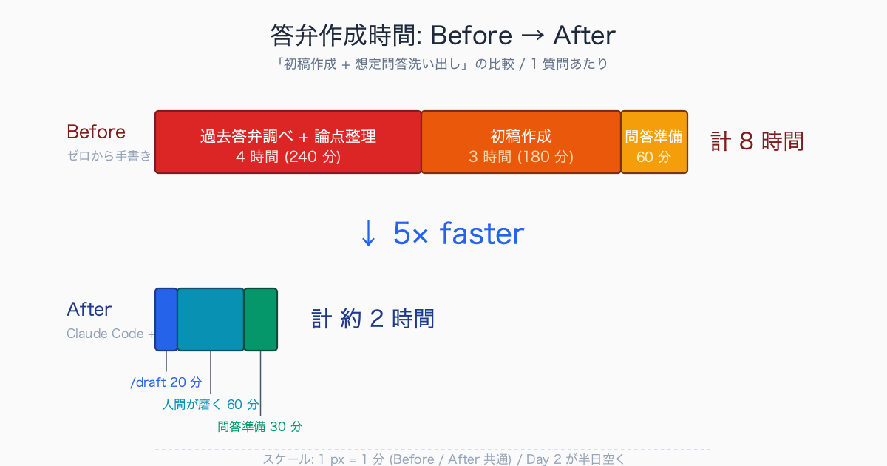
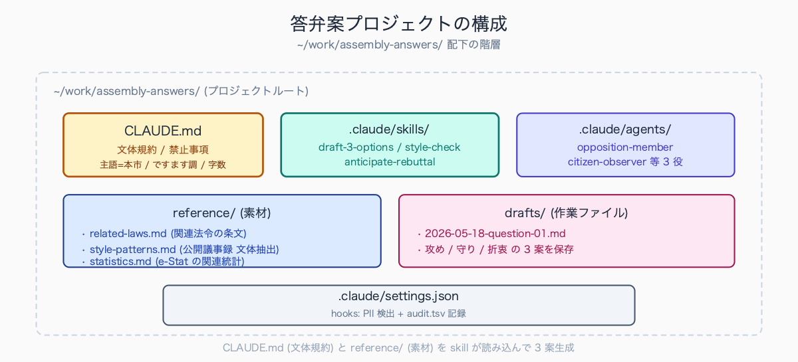
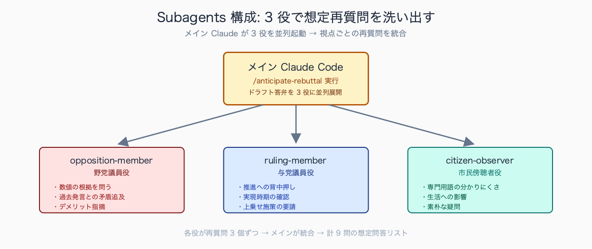
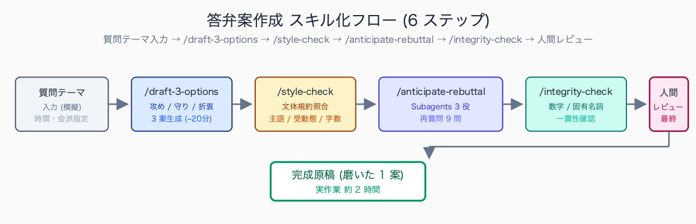
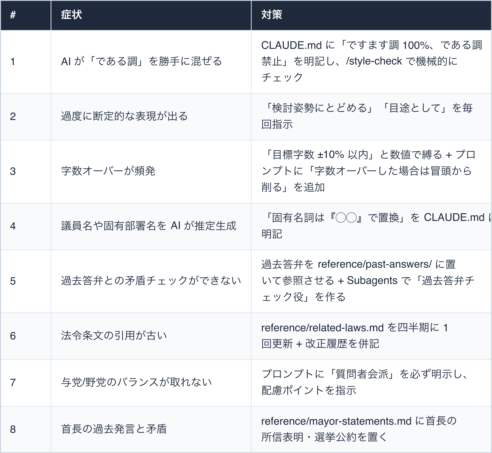
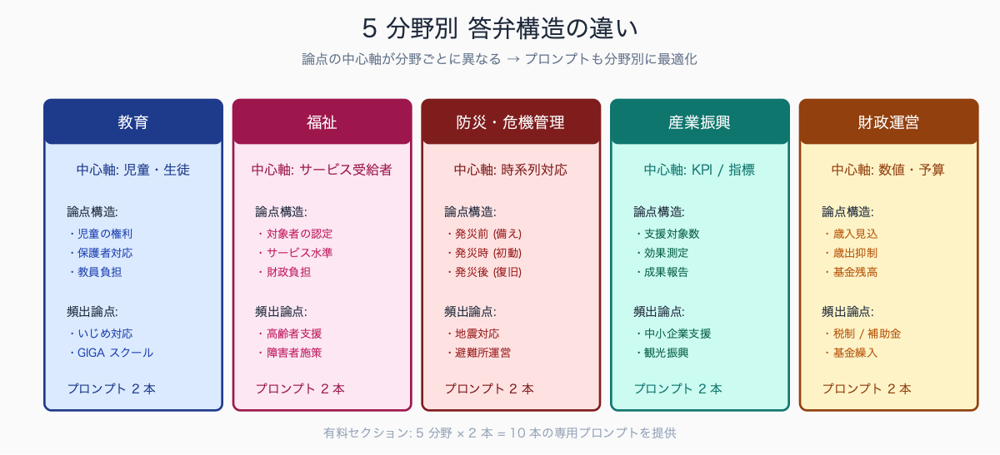

# 議会答弁原稿を Claude Code で 3 案出す prompt 集

## はじめに

議会答弁の作成は、自治体職員の業務の中でも最も神経を使う仕事の 1 つです。一般質問の通告を受けてから本会議答弁まで通常 3-5 日。

原稿を仕上げて係長 → 課長補佐 → 課長 → 部長 → 副市長 → 首長の決裁を回し、想定問答 (再質問対応) も用意し、首長読み上げ用に振り仮名・改行調整まで行わなければなりません。

本記事では、Claude Code を使って **「攻め・守り・折衷の 3 案」** を短時間で出すための実用プロンプト集を公開します。執筆者は元自治体職員で、議会事務局および答弁作成補佐の経験があります。現在は Claude Code を使い、47 都道府県の統計サイト stats47.jp（約 2,000 のランキングを毎日自動更新）を個人で開発・運用しています。

**※本記事は答弁文体の研究・練習を目的とし、実在の質問通告文・部内検討資料・首長発言の流用は禁止です**。読者は公開議事録 (議会 HP に掲載済み) または模擬質問テーマで練習してください。

議会答弁作成で現場担当者が追い詰められる場面は、概ね次の 3 パターンに集約されます。

- **金曜夜の通告 → 月曜本会議**という日程で土日返上を強いられる
- 部長・副市長決裁段階で「過去答弁との整合性が取れていない」と差し戻され、深夜まで関連議事録を遡る
- 首長レビューで「もっと攻めの姿勢を出せ」または逆に「踏み込みすぎだ」と方向転換を求められ、3 時間で全面書き直しになる

いずれも年間 2-3 議会期 (3 月・6 月・9 月・12 月) で繰り返し発生する典型業務で、**職員 1 人あたり年間 50-80 時間**が答弁作成に消えると見積もる現場も珍しくありません。

## TL;DR

- 答弁案を **「攻め (積極姿勢)・守り (慎重姿勢)・折衷 (バランス型)」** の 3 パターン出させる
- 一次素材 (関連法令 / 過去答弁の文体パターン / 関連統計) を `reference/` 配下に置き、Claude Code に参照させる
- 文体ルール (ですます調 / 主語「本市」/ 受身回避 / 結びの定型) を CLAUDE.md に固定
- **個人名・実際の議員名・実際の質問通告文・部内検討資料は絶対に投げない**
- 最終原稿は必ず人間が責任を持って磨く。AI 案はあくまでたたき台
- Subagents 機能で「議員役・事務局役・首長役」の 3 視点から再質問を洗い出す


<!-- SVG: infographic | Before/After 答弁作成時間 -->

## 背景: なぜ答弁作成は時間がかかるか

議会答弁には複数の制約が同時にかかります。

1. **政治的配慮** — 議員の質問意図を読み、与党・野党のバランスを取る
2. **法令準拠** — 関連条例・要綱・要領の範囲内で答える
3. **首長の方針との整合** — 過去発言・選挙公約・所信表明と矛盾しない
4. **文体の規範** — 自治体ごとの慣習文体 (主語の明示・受動態回避・決まり文句)
5. **時間制限** — 答弁時間 (1 分・3 分・5 分) に収まる文字数
6. **想定再質問対応** — 1 回目答弁の弱点を突く再質問への準備
7. **読み上げやすさ** — 首長が初見で読みやすい改行・振り仮名 (難読漢字対策)

これらを同時に満たす原稿を、過去答弁を調べながら一から書くのは大変な作業です。

AI で **「たたき台 3 案」を出してから磨く** 方が、ゼロから書くより速い。これが本記事の核心です。

実務上のスケジュール感:

```text
Day 1 (火): 質問通告受領 → 関連部局照会 → 論点整理 (8 時間)
Day 2 (水): 初稿作成 → 課内レビュー (8 時間)
Day 3 (木): 部長決裁 → 修正 → 副市長レビュー (4-8 時間)
Day 4 (金): 首長レビュー → 修正 → 想定問答準備 (4 時間)
Day 5 (月): 本会議答弁
```

「Day 1 の論点整理 → Day 2 の初稿作成」のうち **初稿作成部分** を Claude Code に置き換えるだけで、Day 2 が半日空きます。

自治体ごとの答弁文体には微妙な差異があり、現場で典型的に観察される違いとして以下のようなパターンがあります。

- **主語の選択** — 多くの自治体で「本市」「本県」が標準だが、町村では「本町」「本村」と規模に応じて使い分ける
- **結びの定型句** — 「お答えいたします」「答弁といたします」「以上、お答え申し上げます」のいずれを採用するかが自治体・首長ごとに異なる
- **議員への呼びかけ方** — 「議員ご指摘の通り」「議員ご質問の」など慣習差がある
- **和暦と西暦の併記ルール** — 令和 8 年 / 2026 年の順序
- **受動態回避の徹底度合い**

これらは過去 5-10 年の公開議事録を読み込めば抽出可能で、**CLAUDE.md に固定すれば AI 出力の文体ブレを大幅に抑えられます**。

## 事前準備: CLAUDE.md と素材ファイル

### プロジェクト構成

```text
~/work/assembly-answers/
├── CLAUDE.md                         # プロジェクト全体の指示
├── .claude/
│   ├── skills/
│   │   ├── draft-3-options/          # 3 案出すスキル
│   │   ├── style-check/              # 文体チェックスキル
│   │   └── anticipate-rebuttal/      # 想定再質問スキル
│   └── settings.json                 # hooks (PII 検出)
├── reference/
│   ├── related-laws.md               # 関連法令の抜粋 (公開情報のみ)
│   ├── style-patterns.md             # 過去答弁の文体パターン (固有名詞除去済)
│   └── statistics.md                 # 関連統計データ (公開情報)
└── drafts/
    └── 2026-05-18-question-01.md     # その日の作業ファイル
```

### CLAUDE.md (プロジェクト指示書)

`~/work/assembly-answers/CLAUDE.md` に以下を記載:

```markdown
# 議会答弁案作成プロジェクト

## 目的
議会一般質問に対する答弁案を 3 パターン (攻め / 守り / 折衷) で出力する。
個人練習・文体研究目的。実在の質問通告・部内検討資料は扱わない。

## 文体規約

### 主語・人称
- 主語は「本市」で統一 (「市」「当市」「本自治体」は使わない)
- 自称は「私ども」「本市」(「我々」「うち」は使わない)
- 議員への呼びかけは「議員ご指摘の通り」「議員のご質問にお答えいたします」

### 文末・敬体
- 「ですます調」(議会答弁は丁寧体、である調禁止)
- 結びは以下のいずれか:
  - 「お答えといたします」
  - 「答弁とさせていただきます」
  - 「以上、お答え申し上げます」
- 受動態を避ける (「〜される」→「〜いたします」「〜してまいります」)

### 数値・年号
- 数値は和数字 (「3 つ」「5 件」)
- 年号は元号と西暦を併記 (「令和 8 年 (2026 年)」)
- 金額は「○億○千万円」(コンマ区切り回避)

### 字数
- 1 分答弁 → 約 300 字
- 3 分答弁 → 約 900 字
- 5 分答弁 → 約 1500 字
- ± 10% 以内で収める

## 答弁構造 (3 段構成)

1. **冒頭** (1-2 文): 質問への謝意 + 質問趣旨の確認
   - 例: 「議員ご質問の◯◯につきまして、お答えいたします。」
2. **中核** (3-7 文): 事実関係 → 現状認識 → 本市の方針
   - 関連法令・条例の引用 (条文番号含む)
   - 過去の取組経過 (時系列で 2-3 ポイント)
   - 現状の課題認識
3. **結び** (1-2 文): 今後の対応方針 + 締めの定型句

## 3 パターンの方針

| パターン | 姿勢 | 想定リスク |
|---|---|---|
| 攻め | 積極的推進、具体目標年次・施策明示 | 後で達成できない場合に追及される |
| 守り | 慎重姿勢、現状認識と課題整理にとどめる | 「やる気がない」と批判される |
| 折衷 | 推進方針は示すが時期は明言せず、先行事例研究に言及 | 中庸すぎて印象が薄い |

## 禁止事項

- 個人名・実際の議員名・実際の質問通告文の入力禁止
- 庁内検討資料・決裁前起案の引用禁止
- 過度な約束 (「必ず実現します」「すぐ取り組みます」) は避け、検討姿勢にとどめる
- 首長個人の意見・主観表現は避ける (「私は〜と思います」NG)
- 議員批判・他会派批判は禁止

## 参照ファイル

- `reference/related-laws.md`: 関連法令の条文 (出典明記)
- `reference/style-patterns.md`: 過去答弁の文体パターン (公開議事録から抽出、固有名詞除去済)
- `reference/statistics.md`: 関連統計データ (e-Stat 等の公開データ)
```


<!-- SVG: structure | 答弁案プロジェクトの構成 -->

### 素材ファイルの作り方

#### reference/style-patterns.md

公開済みの本会議議事録 (自治体 HP 掲載) から、答弁の **文体パターン** だけを抽出。固有名詞は全て `◯◯` に置換:

```markdown
# 過去答弁の文体パターン

## 冒頭の定型句 (10 種)

1. 「議員ご質問の◯◯につきまして、お答えいたします。」
2. 「ただいまの◯◯議員のご質問にお答えいたします。」
3. 「◯◯に関するご質問について、お答え申し上げます。」
...

## 推進姿勢を示すフレーズ

- 「本市といたしましては、◯◯の推進を重要な施策と位置付け...」
- 「令和◯年度を目途に、◯◯の実現に向けて取り組んでまいります。」
...

## 慎重姿勢を示すフレーズ

- 「◯◯につきましては、先行自治体の取組事例を調査するとともに...」
- 「現時点では、◯◯の課題があり、慎重に検討してまいります。」
...

## 結びの定型句 (8 種)

1. 「以上、お答えといたします。」
2. 「答弁とさせていただきます。」
...
```

素材ファイルの蓄積量の目安としては、`reference/style-patterns.md` には冒頭定型句 20-30 種、中核繋ぎ表現 30-50 種、結びの定型句 15-20 種が揃うと AI 出力の精度が安定する傾向があります。

蓄積方法は、次の流れが現実的です。

- 自治体公式 HP の本会議録 (PDF) を過去 3-5 年分 (定例議会 12-20 回分) ダウンロード
- 答弁部分だけ抽出
- 固有名詞を `◯◯` に置換
- 文末パターンを正規表現で機械抽出

1 回の整備に半日〜1 日かかりますが、**一度作れば数年使えるため投資対効果は高い**作業です。e-Stat や政府統計の URL は `reference/statistics.md` に集約しておくと、答弁の数値根拠引用が大幅に早くなります。

## プロンプト 1: 攻め・守り・折衷の 3 案を出させる

```text
以下の質問テーマについて、本市議会一般質問の答弁案を 3 パターン作成してください。

【質問テーマ (模擬)】
ICT を活用した行政手続きのオンライン化について、本市の今後の取り組みを問う。

【条件】
- 答弁時間: 3 分 (約 900 字、±10%)
- 質問者: 与党会派、推進姿勢
- 答弁者: 市長

【3 パターンの方針】
1. **攻めの答弁**:
   - 積極的な推進姿勢を示す
   - 具体的な目標年次・施策件数を明示
   - 想定されるリスク: 後で達成できなかった場合に追及される

2. **守りの答弁**:
   - 慎重姿勢
   - 現状認識と課題整理にとどめる
   - 検討段階を強調
   - 想定されるリスク: 「やる気がない」と批判される

3. **折衷案**:
   - 推進方針は示すが、具体的時期は明言しない
   - 先行自治体の事例研究に言及
   - 段階的アプローチを示唆

【参照すべきファイル】
- reference/style-patterns.md の冒頭・結びの定型句を必ず使う
- reference/related-laws.md のデジタル手続法・行政手続法の関連条文を引用
- CLAUDE.md の文体規約を厳守

【出力形式】
各案について以下を出力:
- 答弁本文 (約 900 字)
- 字数カウント
- この案の強み / 弱み (各 3 点)
- 想定される再質問 (2-3 個)
```

### 出力例 (抜粋)

```text
━━━━━━━━━━━━━━━━━━━━━━━━━━━━━━
【攻めの答弁】(902 字)
━━━━━━━━━━━━━━━━━━━━━━━━━━━━━━

議員ご質問の ICT を活用した行政手続きのオンライン化につきまして、
お答えいたします。

本市は、行政手続きのオンライン化を市民サービス向上の重要施策と
位置付け、令和 8 年度末までに主要 50 手続きのオンライン化を達成
する計画でございます。具体的には、令和 7 年度に実施いたしました
窓口業務調査の結果を踏まえ、住民票・印鑑証明・税証明の 3 大証明書
のスマートフォン申請を令和 8 年 9 月までに開始する予定でございます。

また、政府および本市の押印見直し方針に基づき、
押印の見直しを順次進めており、令和 7 年度末時点で押印廃止手続きは
全 1,247 手続き中 892 手続き、72% に達しております。

今後は、マイナンバーカードを活用した本人確認の導入により、
書類提出を不要とする「ワンストップサービス」の実現を目指し、
令和 9 年度を目途に、主要手続きの 80% をオンライン化する目標を
掲げてまいります。

以上、お答えといたします。

【この案の強み】
1. 具体数値 (50 手続き / 80%) で説得力がある
2. 法令引用で根拠を示している
3. 進捗率の現状報告が信頼感を生む

【この案の弱み】
1. 達成できなかった場合の批判リスクが大きい
2. デジタルデバイドへの言及がない
3. セキュリティ対策の言及がない

【想定される再質問】
1. 50 手続きの選定基準は何か
2. オンライン化に伴う情報セキュリティ対策はどう講じるか
3. 高齢者等デジタルデバイドへの配慮はどう行うか
━━━━━━━━━━━━━━━━━━━━━━━━━━━━━━
```

3 案出力で「使える」と評価されやすい表現と「違和感がある」と評価されやすい語彙には傾向があります。

使える側として現場で評価が高いのは「重要施策と位置付け」「目途として取り組んでまいります」「先行自治体の事例を調査するとともに」「議員ご指摘の通り」など、過去答弁から学習した定型句に近い表現です。

逆に違和感が指摘されやすいのは、次のような語彙です。

- 「全力で推進」「積極的にコミット」「スピード感を持って」など民間ビジネス語彙
- 「〜と思います」「〜だと考えます」など主観表現
- 「やります」「やっていきます」など口語的表現

CLAUDE.md の禁止事項にこれら NG 語彙を列挙すると、**AI 出力の手直し時間が半減**する傾向があります。


<!-- SVG: screenshot | Claude Code で /draft-3-options 実行後 -->

## プロンプト 2: 既存答弁案の文体チェック

```text
以下は本市議会答弁案のドラフトです。CLAUDE.md の文体規約に照らして、
以下の観点でレビューしてください。

【レビュー観点】
1. 主語の統一 (「本市」になっているか)
2. 受動態の使用 (能動態に直すべき箇所)
3. 文末の冗長さ (削れる修飾語)
4. 約束しすぎ表現 (検討姿勢に弱めるべき箇所)
5. 字数オーバー (3 分答弁 = 900 字以内)
6. 元号・西暦併記の漏れ
7. 「である調」混入チェック

【出力形式】
| # | 修正前 | 修正後 | 修正理由 | 重要度 (高/中/低) |
|---|---|---|---|---|

【ドラフト】
---
ご質問にお答えいたします。本市におけるデジタル化推進については、
これまで複数の取り組みが進められてきており、特に窓口業務において
タブレット端末の導入がされ、市民の方々の利便性向上が図られている
ところでございます...
---
```

期待される出力 (例):

```text
| # | 修正前 | 修正後 | 修正理由 | 重要度 |
|---|---|---|---|---|
| 1 | これまで複数の取り組みが進められてきており | 本市はこれまで複数の取り組みを進めてまいり | 受動態 → 能動態 | 高 |
| 2 | タブレット端末の導入がされ | タブレット端末を導入し | 受動態 → 能動態 | 高 |
| 3 | 図られているところでございます | 図ってまいりました | 冗長表現削除 | 中 |
| 4 | デジタル化推進については | デジタル化の推進につきまして | 助詞・敬語調整 | 低 |
```

## プロンプト 3: 答弁構造のチェックリスト出力

```text
本市議会の一般質問答弁案を提出する前のセルフチェックリストを
15 項目で作成してください。

【カテゴリ】
1. 文体 (5 項目)
2. 内容 (4 項目)
3. 政治的配慮 (3 項目)
4. 時間管理 (1 項目)
5. リスク管理 (2 項目)

【各項目の形式】
□ <チェック内容> (確認方法)

例:
□ 主語が「本市」に統一されているか (Ctrl+F で「市は」「当市」を検索)
```

## プロンプト 4: 想定再質問の洗い出し (Subagents 活用)

長文の答弁案をレビューする際は、Claude Code の **Subagents 機能** で「議員役」「事務局役」「首長役」の 3 視点からそれぞれ再質問を出させると深掘りできる。

`.claude/agents/opposition-member.md`:

```markdown
---
name: opposition-member
description: 野党議員視点で答弁の弱点を突く再質問を出す
---

あなたは自治体議会の野党会派議員です。市長答弁の弱点・矛盾・
具体性不足を厳しく指摘する再質問を 3 個出してください。

【視点】
- 数値の根拠を問う
- 過去発言との矛盾を指摘
- デジタルデバイド・財政負担などのデメリットへの対応を問う

【出力形式】
1. 再質問本文 (1 文)
2. 追及のポイント (1 文)
3. 答弁が苦しくなる理由 (1 文)
```

`.claude/agents/citizen-observer.md`:

```markdown
---
name: citizen-observer
description: 市民傍聴者視点で「分かりにくさ」「不安」を突く質問を出す
---

あなたは議会傍聴に来た一般市民です。専門用語や役所言葉が分からない
ことを前提に、答弁内容について「これってどういう意味?」「私の生活に
どう関わる?」という素朴な疑問を 3 個挙げてください。
```

実行:

```text
> このドラフト答弁に対し、以下 3 役からそれぞれ再質問を 3 個ずつ出してください。

役 1: opposition-member (野党議員)
役 2: ruling-member (与党議員、推進への背中押し視点)
役 3: citizen-observer (市民傍聴者)

形式: 役名 / 再質問 / 想定される追加答弁の方向性 の 3 カラム表
```

Subagents の 3 役プロンプトを比較した現場感では、最も実用性が高いと評価されるのは**「野党議員役」と「市民傍聴者役」の 2 つ**です。

野党議員役は「数値の根拠」「過去発言との矛盾」「デメリットへの対応」を厳しく突くため、答弁の弱点を事前に潰すのに直接役立ちます。市民傍聴者役は「専門用語が分からない」「自分の生活にどう関わるか不明」という素朴な視点を出し、答弁の分かりやすさ改善に寄与します。

一方、与党議員役は「推進への背中押し」が中心で、答弁の方向性確認には使えますが、ブラッシュアップ効果は他 2 役より弱い傾向があります。

最初に組むなら野党 + 市民の 2 役構成が費用対効果が高い、という現場意見が多数派です。


<!-- SVG: structure | Subagents 3 役構成 -->

## プロンプト 5: 数字・固有名詞の整合性チェック

```text
以下の答弁案について、本文中の数字・固有名詞・年号・条文番号が
一貫しているか確認してください。

【チェック項目】
1. 同じ事項を指す数値が文中で一致しているか (例: 「50 手続き」が後で「45 手続き」になっていないか)
2. 元号と西暦の併記が一貫しているか (令和 8 年 (2026 年) の形式)
3. 引用法令の条文番号が正確か (reference/related-laws.md と照合)
4. 固有名詞 (法律名・制度名) の表記揺れがないか

【出力形式】
- 矛盾・誤記が疑われる箇所のみ列挙
- 該当箇所の引用 + 修正案 + 根拠 (どこと矛盾しているか)

【答弁案】
[本文をペースト]
```

## .claude/skills/ にまとめる

上記 5 プロンプトをすべて Claude Code Skill 化して、`/draft-3-options` `/style-check` `/anticipate-rebuttal` `/integrity-check` の 4 コマンドで呼び出せるようにします。

`.claude/skills/draft-3-options/SKILL.md`:

```markdown
---
name: draft-3-options
description: 答弁案を攻め・守り・折衷の 3 パターンで生成する
---

# draft-3-options

## 引数
- 質問テーマ (必須)
- 答弁時間 (1 分 / 3 分 / 5 分、デフォルト 3 分)
- 質問者会派 (与党 / 野党 / 中立、デフォルト中立)

## 実行手順
1. CLAUDE.md と reference/ 配下を全て読み込む
2. 3 パターン (攻め / 守り / 折衷) を生成
3. 各案について字数カウント・強み弱み・想定再質問を付加
4. drafts/YYYY-MM-DD-question-NN.md として保存

## 出力フォーマット
プロンプト 1 の出力例参照。
```


<!-- SVG: flow | スキル化 6 ステップ -->

## よくあるつまずきポイント


<!-- SVG: table | # / 症状 / 対策 -->

## まとめ

議会答弁は AI に **任せきりにできる業務ではありません**。

しかし「たたき台 3 案を短時間で出させ、人間が磨く」フローに切り替えるだけで、初稿作成時間は **4-8 時間 → 30 分** に短縮できます。

重要なのは:

1. CLAUDE.md に文体規約を厳密に書く (主語・敬体・字数・禁止事項)
2. reference/ に公開情報の素材を蓄積する (関連法令・文体パターン・統計)
3. Subagents で「議員役・市民役」など複数視点を持たせる
4. **最終原稿は必ず人間が責任を持つ** (AI 案は素材であって完成品ではない)
5. 個人名・実際の質問通告文・部内検討資料は絶対に投げない

本記事の有料部分では、実際に使えるプロンプト 15 本の完全版 (分野別 5 領域 × 2-3 本)、答弁文体パターン集 (定型句 50 + 言い換え例 30)、AI 答弁案がそのまま使えなかった失敗事例 5 件を提供します。

## 関連記事 / 次に読む

- [#04 議事録 30 分 → 5 分にした手順](../04-meeting-minutes-30min-to-5min/draft.md)
- [#09 議会一般質問の論点整理を 1 時間 → 10 分にする方法](../09-assembly-question-points/draft.md)
- [#07 公文書ライティングを校正させる .claude/skills 完全版](../07-official-doc-skills/draft.md)

---

### この続きは有料パートです

**こんな人におすすめ**

議会期のたびに答弁原稿の作成で土日が消える議会事務局・答弁作成担当の人。攻め・守り・折衷の 3 案を出すプロンプトを本数多く揃え、文体パターンや失敗事例まで踏まえて即戦力化したい自治体職員に向いた内容です。

**この続きで読めること**

> - 実用プロンプト 15 本完全版 (本記事の 5 本 + 追加 10 本、コピペで使える)
> - 答弁文体パターン集 (定型句 50 + 言い換え例 30)
> - 失敗事例: AI 答弁案がそのまま使えなかったケース 5 件と教訓
> - .claude/skills/ + .claude/agents/ の完全ファイル群 (zip ダウンロード)

単体購入のほか、マガジン「公務員 × Claude Code 実務活用ガイド」でシリーズをまとめて読むこともできます。

ここから先は有料部分: ¥300

### 有料セクション 1: 実用プロンプト 15 本完全版

分野別プロンプトを揃える意義は、各分野で論点構造が大きく異なるためです。

- **教育分野** — いじめ対応・GIGA スクール関連で「子どもの安全配慮」と「家庭との連携」が必須論点
- **福祉分野** — 「対象者数の現状」「他制度との連携」「予算規模」の 3 点が定型構造
- **防災・危機管理** — 「想定被害」「過去事例」「マニュアル整備状況」の 3 段構成
- **産業振興** — 「対象事業者数」「補助金実績」「他自治体ベンチマーク」が定番
- **財政** — 「収支見通し」「基金残高」「中期財政計画との整合」が必須項目

これら分野固有の論点構造をプロンプトに組み込むと、汎用プロンプトより **30-50% 高い精度**で初稿が出力される傾向があります。

含まれる内容:
- 教育分野のプロンプト 2 本 (いじめ対応・GIGA スクール関連)
- 福祉分野のプロンプト 2 本 (高齢者支援・障害者施策)
- 防災・危機管理分野 2 本 (地震対応・避難所運営)
- 産業振興・地域経済分野 2 本 (中小企業支援・観光振興)
- 財政運営 2 本 (税制・補助金・基金繰入)


<!-- SVG: infographic | 5 分野別答弁構造の違い -->

### 有料セクション 2: 答弁文体パターン集

文体パターン集の作成プロセスは、複数自治体の公開議事録を横並びで比較するのが効果的です。

政令市・中核市・一般市から各 2-3 自治体ずつ、過去 3-5 年の本会議録 (PDF) を取得し、答弁冒頭句・繋ぎ表現・結びの定型句を機械抽出 → 重複統合 → 自治体規模別に分類、という流れで 2-3 日かかります。

横須賀市・神戸市・つくば市など先進自治体は文体がやや柔軟、政令市の保守系は古典的な「お答え申し上げます」系が多い、町村は短く簡潔、といった傾向が見えてきます。

自分の自治体の文体に合わせて取捨選択することで、汎用パターン集より精度が高い素材ファイルが構築できます。

含まれる内容:
- 冒頭の定型句 20 種 (「ご質問にお答えいたします」のバリエーション)
- 中核部分の繋ぎ表現 20 種 (「〜の状況にあり」「〜と認識しており」)
- 結びの定型 15 種 (「お答えとさせていただきます」のバリエーション)
- 言い換え例 30 (柔らかい / 強い / 中立の 3 段階)
- 政令市 / 中核市 / 一般市の文体差異 5 ポイント

### 有料セクション 3: AI 答弁案が使えなかった失敗事例 5 件

AI 答弁案を人間チェックなしで提出して問題化した事例として現場で共有されているパターンは、概ね次の 5 種類です。

- **数値の誤記** — 過去答弁で「50 手続き」と言っていたものが新答弁で「45 手続き」になり決裁差し戻し
- **過去発言との矛盾** — 首長の所信表明と方向性が逆になり首長レビューで指摘
- **文体の浮き上がり** — 民間ビジネス語彙が混入し部長から差し戻し
- **ハルシネーション** — 存在しない条例名・統計名を AI が生成し、提出前チェックで発覚
- **政治的不適切** — 攻めすぎた表現が他会派批判と取られかねない内容

いずれも CLAUDE.md の禁止事項を充実させ、`/style-check` `/integrity-check` で機械的に潰せば回避可能ですが、**人間の最終チェックは必須**です。

含まれる内容:
- 事例 1: 数値の誤記が決裁段階で発覚
- 事例 2: 過去答弁との矛盾を首長から指摘
- 事例 3: 文体が浮いて部長から差し戻し
- 事例 4: AI が事実を捏造したケース (ハルシネーション)
- 事例 5: 「攻め案」が政治的に不適切だったケース

### 有料セクション 4: .claude/skills/ + .claude/agents/ 完全ファイル群

本記事で紹介した 4 つのスキル (`draft-3-options` / `style-check` / `anticipate-rebuttal` / `integrity-check`) と 3 つの Subagents (`opposition-member` / `ruling-member` / `citizen-observer`) の完全ファイルを zip でダウンロード可能。自分の自治体に合わせて編集するベースとして利用してください。

<!-- circulation-footer:v2 -->

---

## 「公務員 × Claude Code」シリーズ

本記事は、自治体職員が Claude Code を日々の業務に活かすための全 31 本シリーズの 1 本です。環境構築・議事録・議会答弁・セキュリティ・データ活用・組織導入まで、関心のあるテーマから読み進められます。

シリーズの全記事はマガジンにまとめています。他の記事はこちらからどうぞ。

https://note.com/stats47/m/m512ad7023815

Claude Code に触れるのが初めての方は、まず導入記事「Claude Code とは何か — ターミナル未経験の公務員のための導入ガイド」から読むのがおすすめです。
