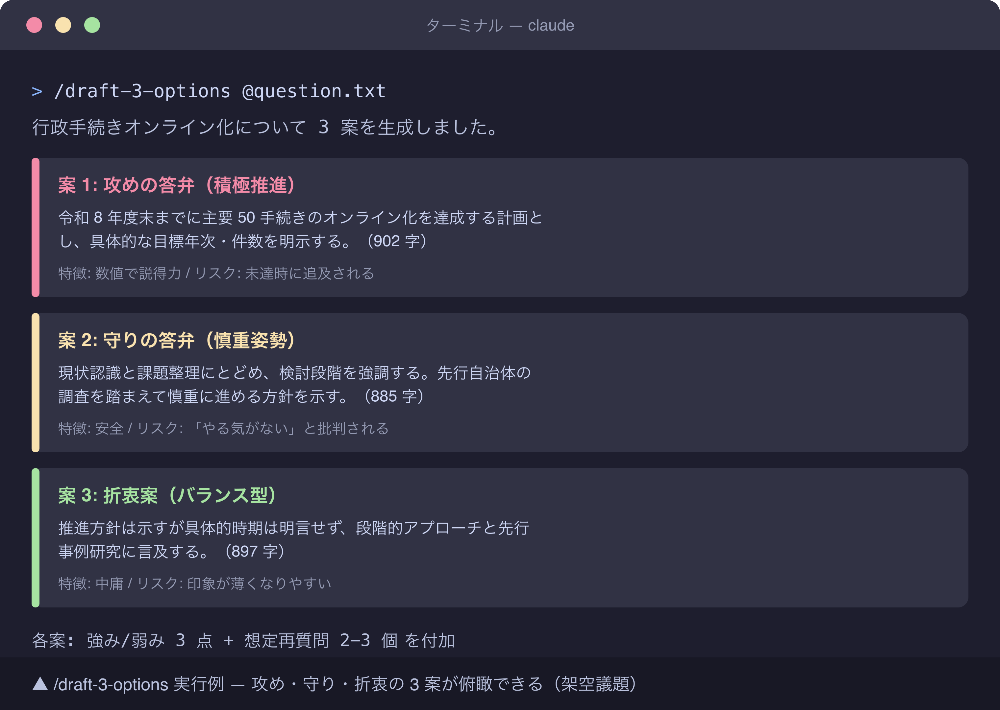

# 議会答弁原稿を Claude Code で 3 案出す prompt 集 — スクリーンショット撮影ガイド

## 撮影前準備

### macOS 撮影コマンド
- 全画面: `Cmd + Shift + 3`
- 範囲指定: `Cmd + Shift + 4`
- ウィンドウ単位: `Cmd + Shift + 4` → Space キー → ウィンドウクリック

### ターミナル設定 (推奨)
- フォントサイズ: 14pt
- 背景: #1E1E1E
- ウィンドウサイズ: 1400 × 900 px (3 案を 1 画面に並べるため少し広め)

### マスキング原則 (本記事は最重要)
- **議会答弁の題材選定が事故源**。実際の議会で扱った議題・地名・議員名は **絶対に使わない**
- 撮影用には完全に架空の汎用議題を用いる (例: 「行政手続きオンライン化の進捗」「ふるさと納税返礼品の方針」)
- 自治体名: 「本市」「〇〇市」などの汎用表現に統一
- 答弁内の数値 (予算額・件数) は架空数字 (キリの良い丸めた数値) を使う
- Claude Code の対話履歴に過去の業務 prompt が見えないよう、撮影前に新規セッション起動

### 架空議題サンプル (撮影用)

```text
【質問者】 〇〇 △△ 議員 (架空)
【質問内容】
本市の行政手続きオンライン化について、現在の進捗状況と
今後 3 年間の目標を伺いたい。特に高齢者対応について方針を示されたい。

【質問のトーン】 中立的、状況確認型
【想定答弁時間】 3 分 (900 字以内)
```

### 保存先
- `docs/31_note記事原稿/koumuin-claude-code/05-assembly-answer-prompts/images/` 配下
- ファイル名: `screenshot-N-<short-desc>.png`

## 撮影リスト

### Shot 1: Claude Code で `/draft-3-options` 実行後、3 案コンパクト表示

- **本文位置**: 291 行目 (プロンプト 1 のサンプル直後)
- **撮影対象**: Claude Code 対話画面で `/draft-3-options` 実行後、**3 案 (謙抑型・標準型・前向き型 等)** が見出し付きでコンパクトに並んで表示され、ユーザーが俯瞰できる状態
- **準備するもの**:
  - `.claude/skills/draft-3-options/` 配置済みのデモプロジェクト
  - 架空議題プロンプトファイル (上記サンプル使用)
  - `.claude/skills/draft-3-options/SKILL.md` で出力テンプレを 3 案並列フォーマットに固定
- **マスキング項目**:
  - 議題本文・議員名: 上記架空サンプルを使えば自動的にマスキング済み
  - 出力中の数値 (予算 ○ 億円・件数 ○ 件): 架空数字 (10 億円・500 件等)
  - 出力中の制度名 (マイナンバー・税申告など実在制度) は使って OK だが、自治体固有の事業名は避ける
  - ターミナルプロンプトのパス・ホスト名は短縮
- **推奨ファイル名**: `screenshot-1-draft-3-options.png`
- **撮影手順**:
  1. デモプロジェクト `~/work/assembly-demo/` に架空議題を `question.txt` として保存
  2. ターミナルでプロンプトを短縮 (`PS1='> '`)、`clear` で画面クリア
  3. `claude` 起動
  4. `> /draft-3-options @question.txt` を入力 (議題ファイルを参照させる)
  5. 3 案がすべて出力され、見出し (案 1 / 案 2 / 案 3) が画面に並んだところで一時停止
  6. ターミナルウィンドウを `Cmd + Shift + 4 → Space` で撮影
  7. 出力末尾が切れている場合は、ターミナルウィンドウ高さを広げて再撮影

### 出力レイアウトのヒント

Shot 1 を「コンパクトに 3 案並ぶ」状態にするには、SKILL.md 側で以下のフォーマットを強制すると見やすい:

```markdown
## 案 1: 謙抑型 (検討段階)
[150 字以内の本文サマリ]
特徴: 約束しすぎず、検討姿勢を強調

## 案 2: 標準型 (実行段階)
[150 字以内の本文サマリ]
特徴: 既存事業の継続性を示す

## 案 3: 前向き型 (推進段階)
[150 字以内の本文サマリ]
特徴: 新規施策の意欲を示す
```

各案を 150 字程度に圧縮することで、1 画面に 3 案が収まり、note 上で視認しやすいキャプチャになります。

## 撮影後の手順

1. PNG を `05-assembly-answer-prompts/images/` に保存
2. ファイルサイズが 500KB 超なら `pngquant --quality=80-90 images/*.png --ext .png --force` で圧縮
3. draft.md 内の `> 📸 [スクリーンショット] ...` マーカーを以下に置換:
   ```markdown
   
   ```
4. note 投稿前に最終確認:
   - 実議題・実議員名・実自治体固有事業名が画面内に残っていないか拡大目視
   - 答弁原稿は議会公開情報と紐づけられないか家族 / 同僚にレビュー依頼
