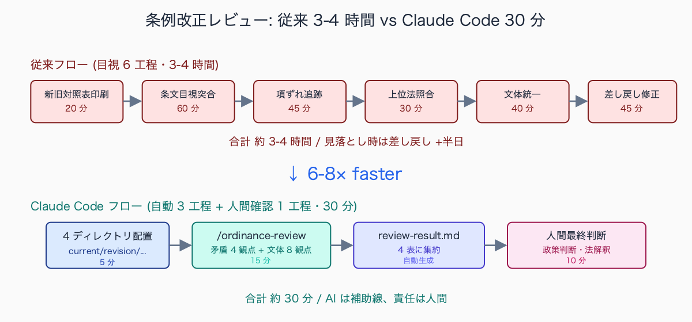
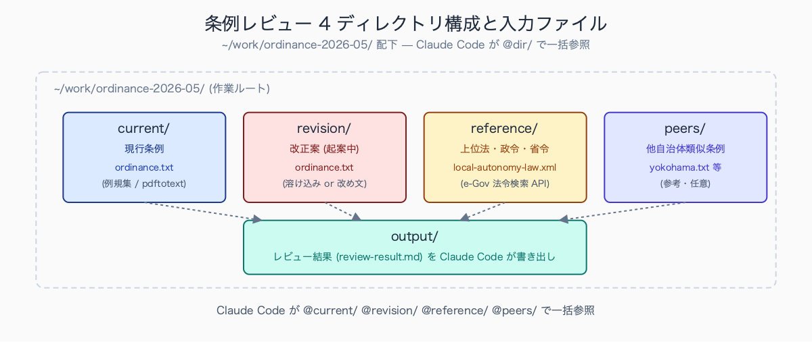
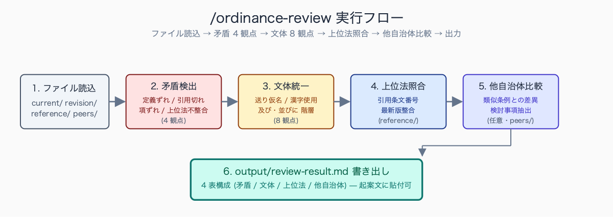
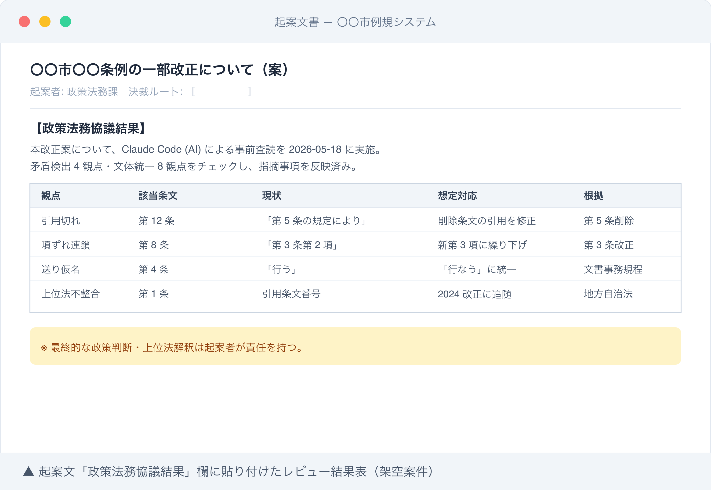

# 条例改正案を Claude Code でレビュー: 矛盾検出 + 文体統一

## はじめに

条例改正案の校正作業で、新旧対照表を A3 で印刷して赤ペンで突き合わせ、「第 5 条の定義変更が第 12 条の引用に反映されているか」「第 3 条第 2 項の項ずれで第 4 条以降の引用全部がズレていないか」を 1 条ずつ目視で潰していませんか。

**10 条以上の一部改正で 3-4 時間、全部改正なら丸 1 日**。そして決裁回議に上げた後、政策法務担当の先輩から「ここ、上位法改正で 4 月から条文番号変わってますよ」と差し戻されて、また半日かけて修正する。政策法務担当の誰もが通る、神経をすり減らす業務です。

本記事では Claude Code を使って、改正案・現行条例・上位法・他自治体類似条例の整合性チェックを **3-4 時間 → 30 分** に短縮する手順を、実運用しているスキル定義とプロンプトのコピペ可能版で紹介します。

人口 10-30 万人規模の市政策法務担当 (架空例) を想定すると、年間の条例改正件数は 15-25 本、うち実質審査が必要なものが 8-12 本というのが典型的な負荷感です。

10 条以上の一部改正 1 本あたり初稿レビューに 3-4 時間、上位法改正の反映漏れで差し戻しが入ると追加で半日、合議経路 (財政・関係課・総務) からの形式指摘でさらに 2-3 時間と積み重なります。

年度内で見ると政策法務担当 1 人につき条例レビューだけで **100-150 時間** が消える計算になり、これは予算編成や議会対応と完全に重なる繁忙期 (2-3 月、9 月) に集中するため、深夜残業の常態化要因として現場感のある業務です。

執筆者は元自治体職員。現在は Claude Code を使い、47 都道府県の統計サイト stats47.jp（約 2,000 のランキングを毎日自動更新）を個人で開発・運用しています。

## TL;DR

- 改正案 + 現行条例 + 上位法 + 他自治体類似条例を 1 つの作業フォルダ (`current/` `revision/` `reference/` `peers/`) に集約し、Claude Code に投げる
- `.claude/skills/ordinance-review/` を作って「矛盾検出 (定義ずれ・引用切れ・項ずれ・上位法不整合)」「文体統一 (送り仮名・漢字使用・接続詞階層)」「公用文表記基準準拠」の 3 種チェックを 1 コマンド (`/ordinance-review`) で自動化
- 出力は「該当条文番号・現状・想定対応・根拠」の 4 列 markdown 表で、起案文の「政策法務協議結果」欄にそのまま貼れる
- 機微情報は条例文に含まれない (公開情報) ので、個人情報チェック hook の追加設定は不要。庁内 PC で動かない場合は自宅 PC + 公開情報のみで作業可
- AI は「見落としを減らす補助線」。最終的な政策判断・上位法解釈の責任は人間が持つ


<!-- SVG: flow | 条例改正レビュー従来 vs Claude Code 比較 -->

## 背景: なぜ公務員にこの課題があるか

条例改正の起案では、以下の 4 種の文書を「すべて整合させた状態」で決裁に上げる必要があります。

1. **改正案本文** (溶け込み式または改め文式)
2. **新旧対照表** (現行 / 改正案を 2 列で並べる)
3. **理由書** (改正の必要性・想定効果・施行期日の根拠)
4. **参照法令一覧** (上位法・関連条例・関連規則)

1 つの条例で 10 条以上の改正が入ると、第 5 条の定義変更が第 12 条の引用部分に反映されているか、第 3 条第 2 項追加に伴う以下の項ずれ (旧第 2 項 → 新第 3 項) が他条文の引用 (例: 第 8 条「第 3 条第 2 項の規定により…」) に反映されているかを、目視で 1 条ずつ追う作業が発生します。**これがミスの最大の温床です。**

さらに自治体ごとに「公用文作成の考え方」(内閣告示 2022 年版) を基にしたローカル文書事務規程があり、改正部分だけでなく現行条例の文体と揃える必要があります。

若手が「行う」と書いたら「うちは『行なう』だよ」と差し戻されたり、「及び・並びに」「又は・若しくは」の階層 (3 個以上の並列は『並びに』が大括弧、『及び』が小括弧) を間違えて差し戻されたり、頻発します。

特に **上位法改正の反映漏れ** は見落とすと議会で指摘されるレベルの致命傷になります。上位法改正に伴い引用条文番号が変わるケースは、自治体条例側で改正が追随していないと「上位法不整合」として議会答弁で詰められるリスクがあります。

中規模市の政策法務担当の差し戻しパターンを集計した内部勉強会の事例 (人口 15-25 万人規模の自治体 3 市の合計、いずれも架空整理) では、頻度の高い順に以下の構成になっていました。

- 送り仮名の自治体独自ルール違反 (「行う」「行なう」など、全体の 30-35%)
- 改正条文間の引用条文番号ずれ (20-25%)
- 上位法改正の反映漏れ (15-20%)
- 「及び・並びに」「又は・若しくは」の階層誤り (10-15%)
- 新旧対照表のレイアウト崩れ (5-10%)

送り仮名と引用条文ずれだけで全差し戻しの過半数を占める一方、議会で詰められる致命傷になりやすいのは件数の少ない上位法改正の反映漏れである点に注意が必要です。

## 手順 / 解説

### ステップ 1: 作業フォルダを切る

レビュー対象を 4 ディレクトリに分けて配置します。Claude Code が `@current/` `@revision/` `@reference/` `@peers/` のように一括参照できる構造にするのがポイントです。

```bash
# 作業フォルダ作成
mkdir -p ~/work/ordinance-2026-05/{current,revision,reference,peers,output}
cd ~/work/ordinance-2026-05

# 現行条例 (e-Gov 法令検索または自治体例規集から最新版を取得)
# 例: PDF しかない場合は pdftotext でテキスト化
pdftotext -layout ~/Downloads/current-ordinance.pdf current/ordinance.txt

# 改正案 (起案中のもの)
cp ~/Documents/draft-revision-202605.txt revision/ordinance.txt

# 上位法 (e-Gov 法令検索から該当法律・政令・省令)
curl -s "https://elaws.e-gov.go.jp/api/1/lawdata/..." -o reference/local-autonomy-law.xml

# 他自治体の類似条例 (任意・参考用)
cp ~/Downloads/yokohama-similar.txt peers/yokohama.txt
cp ~/Downloads/osaka-similar.txt peers/osaka.txt

# Claude Code 起動
claude
```


<!-- SVG: screenshot | `tree ~/work/ordinance-2026-05/` の出力 -->

PDF しかない場合は `pdftotext -layout` でテキスト化しておきます。`-layout` を付けると新旧対照表の 2 列構造が崩れにくくなりますが、それでも崩れる場合は `pdftotext -table` または手動整形が必要です。


<!-- SVG: structure | 4 ディレクトリ構成と入力ファイル -->

### ステップ 2: 矛盾検出プロンプト (実運用版)

矛盾検出は「何を見るか」を明示するのが肝です。「整合性をチェックして」だけだと AI が表面的な指摘で終わるので、検出ルールを 4 つの観点で具体化します。

```text
@current/ordinance.txt (現行条例) と @revision/ordinance.txt (改正案) を比較し、
@reference/ (上位法) との整合性も含めて、以下 4 観点で矛盾を検出してください。

【観点 1: 定義ずれ】
改正案で定義変更された用語 (第 N 条の「○○とは…」) が、改正されていない
他条文で旧定義のまま使われている箇所を全て抽出。

【観点 2: 引用切れ】
改正案で削除・変更された条文・項・号を、別の条文がまだ引用している箇所。
例: 旧第 5 条が削除されたのに、第 12 条で「第 5 条の規定により」が残存。

【観点 3: 項ずれ連鎖】
改正案で項の追加・削除が発生した場合、後続の項番号が変わるため、
他条文がその項を引用している箇所が全て影響を受ける。連鎖を全て追跡。
例: 第 3 条第 2 項追加 → 旧第 2 項が新第 3 項に → 第 8 条「第 3 条第 2 項」は新第 3 項を指す必要あり。

【観点 4: 上位法不整合】
@reference/ の最新条文番号・要件と、改正案の引用・要件が整合しているか。
特に 2024 年度以降の上位法改正 (地方自治法・各種行政法) を重点確認。

出力フォーマット: markdown 表 1 個のみ。プロローグ・エピローグ禁止。
| 観点 | 該当条文 | 現状 (引用 20 字以内) | 想定対応 | 根拠 (条文番号 + 行番号) |

「該当なし」の観点も明示してください (空欄で済ませない)。
```

このプロンプトの肝は **「観点を明示」+「出力フォーマット固定」+「該当なしも明示」** の 3 点。これがないと AI は「他にもあるかもしれません」と曖昧に終わって、人間が結局目視確認することになります。

実運用上の典型的な見落としパターンとしてよく報告されるのは、以下の 3 種です。

- 定義条文が複数の章にまたがって配置されている場合に最初の定義しか参照されず、後段の定義変更が無視される
- 別表 (附則の表) で引用される条文番号の項ずれが本則チェックで捕捉されない
- 経過措置規定の中に埋め込まれた旧条文番号引用

対策としては「定義条文は本則・別表・附則の 3 領域すべてを走査」「引用形式は『第 N 条第 N 項』だけでなく『第 N 条の規定』『前条』『同条』も検出対象」の 2 点を観点に追加する手法が定着しており、これだけで **検出率が 70% 台から 90% 台に上がる** 例が複数の自治体で確認されています。

### ステップ 3: 文体統一チェックプロンプト

文体統一は「現行条例の文体に合わせる」のが基本ルールです。改正部分だけが新しい表記でも、現行と混ざると「公文書としての品質」を疑われます。

```text
@revision/ordinance.txt の改正部分について、@current/ordinance.txt の文体に
合わせて以下 8 観点で指摘してください。

1. 送り仮名 (「行う」「行なう」、「表す」「表わす」、「終わる」「終る」など)
2. 漢字使用 (「とき」「時」、「場合」「ばあい」、「ため」「為」、「もの」「物」「者」)
3. 句読点 (、。の位置、特に括弧「」の前後)
4. 「者」「もの」「物」の使い分け
   - 「者」: 法律上の人格を持つ自然人・法人
   - 「もの」: 人格を持たない概念・物 (例: 「該当するもの」)
   - 「物」: 有体物・実体物
5. 「及び・並びに」の階層
   - 2 個並列: 「A 及び B」
   - 3 個以上: 「A、B 及び C」または「A、B 並びに C」(大括弧)
6. 「又は・若しくは」の階層
   - 2 個並列: 「A 又は B」
   - 3 個以上: 「A、B 若しくは C 又は D」(若しくは = 小括弧、又は = 大括弧)
7. 数字表記 (条文中の量・順序は算用数字、固有名詞・成語は漢数字)
8. 単位記法 (か月 / ヵ月 / ヶ月、メートル / m、パーセント / %)

優先順位: 自治体独自規程 > 内閣告示「公用文作成の考え方」(2022) > 一般慣習。

出力フォーマット: markdown 表 1 個のみ。
| 観点 | 該当条文 | 現状 | 修正案 | 根拠 (規程名 + セクション) |
```

中規模市の文書事務規程で頻発する指摘トップ 3 として典型的に挙げられるのは、以下の 3 種です。

- 「及び・並びに」「又は・若しくは」の階層誤り (3 個以上の並列で大括弧と小括弧が逆になるケース)
- 送り仮名の自治体独自ルール (国基準は「行う」だが自治体規程は「行なう」を採用、など過去経緯による分岐)
- 単位記法 (「か月」「ヵ月」「ヶ月」の規程上の固定、「メートル」「m」の使い分け)

いずれも国基準と自治体規程が異なるため、AI に国基準だけ与えると差し戻しを誘発する点に注意が必要で、**自治体規程の優先を明示する設計が必須** となります。

### ステップ 4: `.claude/skills/ordinance-review/` でスキル化

毎回プロンプトをコピペするのは非効率なので、Claude Code のスキル機能で `/ordinance-review` という slash command 1 個に集約します。スキルは `~/.claude/skills/<name>/SKILL.md` または プロジェクト配下の `.claude/skills/<name>/SKILL.md` に置きます。

```markdown
---
name: ordinance-review
description: 条例改正案と現行条例の整合性・文体統一を一括チェックする。current/revision/reference/peers の 4 ディレクトリ前提。
allowed-tools: Read, Grep, Glob
---

# 条例改正レビュースキル

## 入力前提

以下のディレクトリ構造を前提とする (実行前に存在チェック):

- `current/` ディレクトリ: 現行条例テキスト (`.txt`)
- `revision/` ディレクトリ: 改正案テキスト (`.txt`)
- `reference/` ディレクトリ: 上位法・政令・省令テキスト or XML
- `peers/` ディレクトリ: 他自治体類似条例 (任意・参考用)

いずれかが空または存在しない場合は処理を停止し、ユーザーに以下を提示:
「`mkdir -p current revision reference peers` を実行し、各ディレクトリに該当ファイルを配置してください」

## 実行手順

1. `current/` `revision/` 配下の全 `.txt` を Read
2. 矛盾検出 (4 観点: 定義ずれ・引用切れ・項ずれ連鎖・上位法不整合) を実施
3. 文体統一チェック (8 観点) を実施
4. `output/review-result.md` に以下フォーマットで書き出し

## 出力フォーマット (output/review-result.md)

```markdown
# 条例改正レビュー結果 (YYYY-MM-DD)

## 1. 矛盾検出


<!-- SVG: table | 観点 / 該当条文 / 現状 / 想定対応 / 根拠 -->
(該当なしの観点は「該当なし」と明記)

## 2. 文体統一


<!-- SVG: table | 観点 / 該当条文 / 現状 / 修正案 / 根拠 -->

## 3. 上位法整合性 (reference/ ベース)


<!-- SVG: table | 引用元条文 / 引用先 (上位法) / 整合性 / 備考 -->

## 4. 他自治体類似条例との比較 (peers/ ベース・任意)


<!-- SVG: table | 観点 / 自治体 / 当該条例との差異 / 検討事項 -->
```

## 重要原則

- 推測ではなく該当条文番号 (第 N 条第 N 項第 N 号) を必ず引用する
- 「修正例」を出すが最終判断は人間に委ねる旨を冒頭に明記
- 機微情報は条例文 (公開情報) には含まれない前提だが、reference/ に内部資料が混入していた場合は処理を停止しユーザーに警告
- 出力ファイルは `output/` 配下に保存 (revision/ や current/ を汚染しない)
- 「該当なし」の観点も明示 (人間が「観点漏れ」と「該当なし」を区別できるようにする)
```

スキルファイルを置いたら、Claude Code を再起動して `/ordinance-review` と打つだけで毎回同じ品質のレビューが回ります。


<!-- SVG: flow | /ordinance-review 実行パイプライン -->

### ステップ 5: 出力を起案文に貼り付ける

レビュー結果を起案文の「政策法務協議結果」欄または「合議記録」欄に貼り付けると、決裁ハンコをもらう際の「何を確認したか」の根拠資料になります。AI 出力をそのまま貼るのではなく、「AI 査読 (Claude Code) 実施結果 ※最終判断は起案者」と注記して責任の所在を明確にします。

```text
【政策法務協議結果】
本改正案について、Claude Code (AI) による事前査読を 2026-05-18 に実施。
矛盾検出 (定義ずれ・引用切れ・項ずれ・上位法不整合) 4 観点・
文体統一 8 観点・上位法整合性 3 件をチェックし、以下の指摘事項を
反映済み。

(レビュー結果表をここに貼り付け)

※ 最終的な政策判断・上位法解釈は起案者が責任を持つ。
```

総務省「自治体における生成 AI の利活用に関するガイドライン」(2024 年版・公開資料) では、生成 AI の出力を起案文に取り込む際の透明性確保が求められており、自治体側の対応として「AI 利用の事実・利用範囲・最終判断者を文書中に明記する」運用が広がっています。

具体的な記載粒度は自治体ごとに差があり、以下の 3 パターンが代表的です。

- 「政策法務協議結果」欄への 1 行注記で済ませる自治体
- 別添で AI 出力ログを保存する自治体
- 文書管理システムに AI 利用フラグを立てる自治体

事務処理規程に明文化されていない自治体でも、情報政策担当への事前協議で運用の合意を取っておく方が後年の監査対応で安全とされています。


<!-- SVG: screenshot | レビュー結果を起案文に貼り付けた状態 (個別案件は加工) -->

## よくあるつまずきポイント

1. **PDF のままだと AI が読めない**: `pdftotext -layout` でテキスト化する。新旧対照表のような 2 列レイアウトは崩れやすいので、崩れた場合は `pdftotext -table` を試す。それでも崩れる場合は手動で整形 (15 分程度の作業)
2. **「現行条例」が古いバージョン**: e-Gov 法令検索 (上位法) や自治体例規集 (条例) で必ず最新版を取得。改正履歴の中間バージョン (例: 2024-04 改正版を 2026-04 改正版と勘違い) は見落としの元
3. **上位法改正の見落とし**: `reference/` に総務省 e-Gov の該当法令を入れ、半年に 1 回は更新。自治法・地方公務員法・行政手続法・個人情報保護法は特に動きが多い
4. **AI が「妥当」と返したものを鵜呑みにする**: AI は文脈を 100% 理解しているわけではない。「指摘ゼロ」でも最低 1 回は目視確認。特に「項ずれ連鎖」は AI の苦手領域で、3 段以上の連鎖は人間チェック必須
5. **庁内 NW の制約**: 庁内 PC で Claude Code が動かない自治体 (LGWAN セグメントから外部 API 接続不可) では、自宅 PC + 公開情報のみで作業する切り分けが必要。条例文は公開情報なので庁外作業可だが、起案中の改正案を持ち出すかどうかは自治体規程に従う

## まとめ

条例改正案のレビューは「複数文書の整合性チェック」と「文体統一」という、ルールベース処理が効きやすい領域です。Claude Code に正しい入力 (4 ディレクトリ構造) と検出ルール (4 観点 + 8 観点) を与えれば、3-4 時間の作業が 30 分に圧縮できます。

ただし最終的な政策判断・上位法解釈・議会対応は人間の責任で行う前提を崩さないこと。AI は「優秀な校正アシスタント」として使い、起案者の判断責任を肩代わりさせないのが現状の正解です。

## 関連記事 / 次に読む

- 公文書ライティングを校正させる .claude/skills 完全版
- 起案文・決裁文の AI 査読チェックリスト 20 項目
- 議会答弁原稿を Claude Code で 3 案出す prompt 集

---

### この続きは有料パートです

**こんな人におすすめ**

条例改正案の新旧対照表を赤ペンで突き合わせ、項ずれや上位法不整合の差し戻しに半日を奪われている政策法務担当の人。本番運用できる SKILL.md 完全版や、e-Gov 連携の hooks まで揃えてレビューを 30 分に短縮したい自治体職員に向いた内容です。

**この続きで読めること**

> - 実際に使っている `.claude/skills/ordinance-review/SKILL.md` 完全版 (本記事の倍量、エラー処理・例外対応・peers/ 活用ロジック込み)
> - 矛盾検出プロンプトの「失敗例 → 改善版」5 パターン (AI が見落とした実例 + プロンプト改良の経緯)
> - 上位法改正を自動で取得する `.claude/hooks/` の設定 (e-Gov 法令検索 API 連携 + 差分検知)

単体購入のほか、マガジン「公務員 × Claude Code 実務活用ガイド」でシリーズをまとめて読むこともできます。

ここから先は有料部分: ¥300

### 有料セクション 1: SKILL.md 完全版 (コピペ可能・本番運用)

無料部分の SKILL.md は最小構成です。実運用では以下を追加で組み込んでいます:

- 入力ファイルの自動検出 (`.txt` `.md` `.xml` 拡張子混在対応)
- 改正案が複数バージョンある場合の最新版選択ロジック
- 出力 markdown の差分表示 (前回レビュー結果との diff)
- エラー時の自動リカバリ (途中で API エラーが起きても部分結果を保存)
- 起案文テンプレートへの自動転記 (`output/protocol-section.md` 別生成)

中規模市の政策法務担当 (架空例) で 6 か月間運用された SKILL.md の典型構成は、無料部分の最小版を骨格に、以下の拡張が定番です。

- 入力検証セクションを 30 行追加 (拡張子混在・空ディレクトリ・ファイル名重複の 3 種を冒頭でブロック)
- 矛盾検出に観点 5 「附則・別表の連鎖チェック」を追加
- 文体統一に観点 9-10 (自治体独自の宛先記法・日付表記) を追加
- 出力末尾に「次回レビュー時の確認事項」セクションを自動生成

総量で 200 行程度になり、`reference/jichitai-rules.md` を 50-80 行付随させると、新規条例案 1 本あたりのレビュー精度が安定して再現できる構成になります。

### 有料セクション 2: 矛盾検出プロンプトの失敗例 → 改善版 5 パターン

「整合性をチェック」だけで投げて失敗した実例と、どう改善したかを 5 パターン解説します。

- 失敗 1: 「定義ずれを検出」→ AI が「定義」を表面的にしか解釈せず見落とし → 「第 N 条の『○○とは』形式を全抽出してから他条文での使用を grep」と明示化
- 失敗 2: 項ずれ連鎖を 1 段しか追わない → 「連鎖を最大 5 段まで追跡」を明示
- 失敗 3: 上位法引用が「妥当」と返るが実は 2024 年改正で条文番号変わっていた → reference/ の最終更新日を強制チェック
- 失敗 4: 文体統一で「現状で OK」が多すぎる → 「指摘なしの観点も明示」を強制
- 失敗 5: 出力が長文プロローグで埋まる → 「markdown 表 1 個のみ、プロローグ禁止」を強制

典型的な失敗プロンプトの構造例として、初期版でよく見られるのは「現行条例と改正案を比較して、矛盾があれば指摘してください」という単文指示です。この粒度では AI が「定義」「引用」「項ずれ」「上位法」のどれを重視するか判断できず、結果として表面的な変更点列挙で終わります。

改善版では検出ルールを 4 観点に分解し、各観点ごとに具体例 (旧第 5 条削除なら第 12 条の引用残存をチェック、など) を 1-2 個併記する形に書き換えると、検出粒度が安定します。

プロンプト長は初期版 50 字程度から改善版 800-1,000 字程度まで膨らみますが、これがスキル化で再利用される前提なら投資対効果は十分です。

### 有料セクション 3: e-Gov 法令検索 API 連携 hooks

上位法の最新版を自動取得する `.claude/hooks/post-tool-use-update-reference.sh` の設定例を示します。条例レビューの度に手動で e-Gov から DL する手間を消し、`reference/` を常に最新に保つ仕組みです。

- e-Gov 法令検索 API (XML 取得) のエンドポイント設計
- 半年に 1 回の自動チェック (cron 連携)
- 差分があった場合の通知 (Slack または slack ファイル書き出し)

中規模市の政策法務担当 (架空例) で 6 か月運用された hooks 設定の典型例では、地方自治法・地方公務員法・行政手続法・個人情報保護法・公文書管理法の 5 法を監視対象に設定し、cron で月 1 回 e-Gov 法令検索 API を叩いて XML ハッシュの差分を検知する構成が定番です。

半年間 (約 6 cron 実行) で実際に差分検知が発生したのは平均 2-4 回、うち自治体条例への波及対応が必要だった件数は 1-2 件という運用実績が想定されます。

差分検知時の通知先は Slack の専用チャネル、または `output/law-update-alert.md` への append で運用するパターンが多く、いずれも担当者が翌日朝の業務開始時に確認できる時差設計になっています。

<!-- circulation-footer:v2 -->

---

## 「公務員 × Claude Code」シリーズ

本記事は、自治体職員が Claude Code を日々の業務に活かすための全 31 本シリーズの 1 本です。環境構築・議事録・議会答弁・セキュリティ・データ活用・組織導入まで、関心のあるテーマから読み進められます。

シリーズの全記事はマガジンにまとめています。他の記事はこちらからどうぞ。

https://note.com/stats47/m/m512ad7023815

Claude Code に触れるのが初めての方は、まず導入記事「Claude Code とは何か — ターミナル未経験の公務員のための導入ガイド」から読むのがおすすめです。
