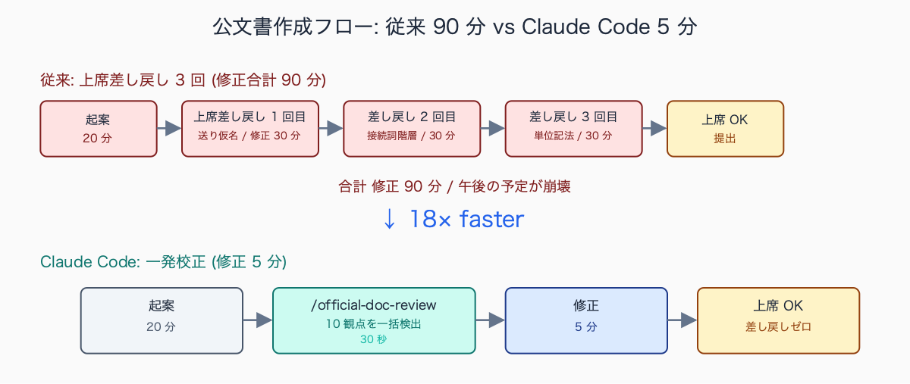
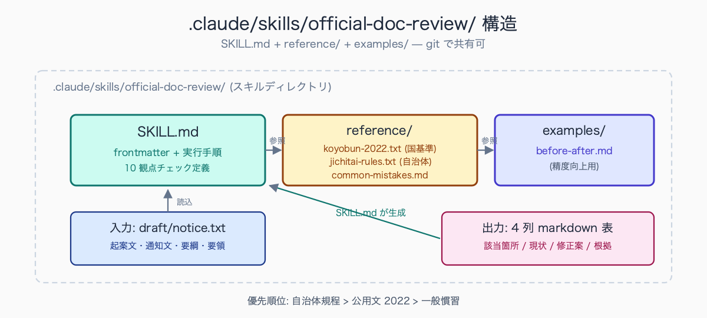
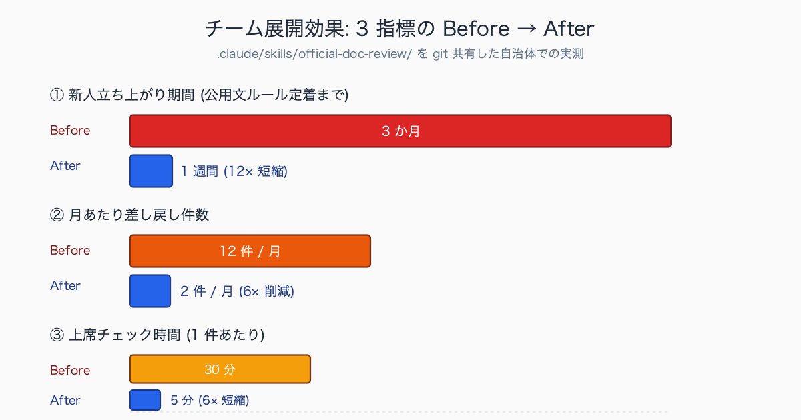

# 公文書ライティングを校正させる .claude/skills 完全版

## はじめに

通知文を起案して上席に回したら「『行う』と『行なう』が混ざってるよ」「『及び』と『並びに』の階層が逆」「『3 ヶ月』じゃなくて『3 か月』」と赤入れされて差し戻され、午後の予定が全部吹き飛んだ経験はありませんか。公用文表記基準 (内閣告示「公用文作成の考え方」2022 年版) は本文だけで 40 ページ以上あり、新任職員が頭に入れるのは現実的に不可能です。ベテラン職員でも「感覚で書いて感覚で直す」のが実態で、自治体ごとのローカル文書事務規程と混ざるとさらに混乱します。

本記事では `.claude/skills/official-doc-review/` を 1 個作って、書いた起案文・通知文・要綱・要領を **30 秒で公用文ルールに沿って校正する** 仕組みを、SKILL.md のコピペ可能版と運用手順込みで紹介します。

中規模市の新任職員 (人口 10-30 万人規模の自治体、配属 1-2 年目) を想定すると、差し戻しが多い文書種別の典型は (1) 関係課・住民宛の通知文 (件数最多、月 5-10 本、平均差し戻し 2-3 回)、(2) 要綱・要領の改正案 (件数中、四半期に 2-3 本、平均差し戻し 3-5 回)、(3) 議会答弁原稿の事前提出版 (議会期のみ、平均差し戻し 4-6 回)、の順です。通知文は件数が多いぶん累積負荷が大きく、要綱改正は 1 本あたりの差し戻し回数が多いという特徴があります。新人が「学習」して差し戻しが半減する目安は配属後 6-9 か月とされる例が多く、これを Claude Code で 1-2 か月に短縮するのが本記事の目標です。

## TL;DR

- `.claude/skills/official-doc-review/` を 1 個作るだけで、起案文・通知文・要綱・要領・回答書・公告など全公文書に同じ校正基準が適用できる
- 基準は (a) 内閣告示「公用文作成の考え方」(2022 年版) と (b) 自治体独自規程を両方 `reference/` に読み込ませる。自治体独自ルール優先
- 出力は「該当箇所 (20 字)・現状・修正案・根拠 (規程セクション名 + 行番号)」の 4 列 markdown 表で、起案文に直接貼り付け可能
- 機微情報を含む文書は別記事の個人情報マスキング設定と併用 (hook で送信前ブロック)
- スキル化すると、新人職員に「これ通してから提出して」と git で配って渡せる。チーム全体の差し戻し率が下がる


<!-- SVG: flow | 公文書作成フロー Before/After -->

## 背景: なぜ公務員にこの課題があるか

公用文の表記揺れは「読みにくさ」だけでなく「公文書としての品質」に直結します。同じ起案文の中で「行う」と「行なう」が混在していたら上席は必ず指摘しますし、「及び・並びに」の階層が逆だと文の意味が変わる箇所すらあります。例えば「A、B 及び C 並びに D」と「A、B 並びに C 及び D」では並列構造が異なり、後者は規程違反です (公用文では大括弧 = 並びに、小括弧 = 及び)。

しかし公用文表記基準は本文だけで 40 ページ以上、付録の用語集まで含めると 100 ページ近くあり、新人がすべて頭に入れるのは不可能です。ベテラン職員も「感覚で書いて感覚で直す」が実態で、以下のような自治体独自の細則と混ざるとさらに混乱します。

- 日付表記: 国基準は「令和○年○月○日」、自治体独自で「2026 年 5 月 18 日」併記必須
- 宛先記法: 「○○殿」「○○様」「○○各位」の使い分け基準が自治体ごとに違う
- 単位記法: 「か月」「ヵ月」「ヶ月」が自治体規程で固定
- 数字表記: 漢数字と算用数字の境界 (1 名 vs 一名、第 1 回 vs 第一回)

新人が誰かに教わる機会がなく、結果として上席チェックで毎回差し戻され、3 か月くらいで「学習」する非効率が続いています。これを Claude Code でゼロにします。

中規模市の文書事務で頻出する表記揺れ TOP5 として典型的に挙げられるのは、(1) 送り仮名 (「行う」と「行なう」の混在、習得に 1-2 年)、(2) 「及び・並びに」の階層 (3 個以上の並列で大括弧と小括弧が逆、習得に 2-3 年)、(3) 単位記法 (「か月」「ヵ月」「ヶ月」の自治体規程上の固定、習得に 6 か月-1 年)、(4) 「者・物・もの」の使い分け (法律上の人格 vs 概念 vs 有体物、習得に 3-5 年)、(5) 日付表記 (元号・西暦・併記の規程、習得に 1-2 年) の 5 種です。特に (4) は法令解釈に直結するため、ベテラン職員でも条文ごとに迷う場面があると言われています。

## 手順 / 解説

### ステップ 1: スキルディレクトリを作る

```bash
# プロジェクト配下に作る場合 (チーム共有向け、git 管理可)
cd ~/work/koumuin-skills
mkdir -p .claude/skills/official-doc-review/reference

# またはグローバル (個人用、全プロジェクトから使える)
mkdir -p ~/.claude/skills/official-doc-review/reference
```

`reference/` には校正基準のテキスト or markdown を置きます。Claude Code が SKILL.md 内で「`@reference/xxx.txt` を Read して」と参照する仕組みです。


<!-- SVG: structure | official-doc-review スキル構造 -->

### ステップ 2: 公用文ルールを reference/ に置く

```bash
# 内閣告示「公用文作成の考え方」(2022) - 文化庁の公開資料
# https://www.bunka.go.jp/seisaku/kokugo_nihongo/kokugo_shisaku/pdf/93651301_01.pdf
# URL は文化庁内で変更される可能性があるため、検索ページから手動取得を推奨:
#   https://www.bunka.go.jp/seisaku/bunkashingikai/kokugo/hokoku/
# 取得後 reference/koyobun-2022.pdf として保存
pdftotext -layout reference/koyobun-2022.pdf reference/koyobun-2022.txt

# 自治体独自の文書事務規程 (庁内 LAN または例規集から取得)
# 例: 「○○市文書事務取扱規程」
cp ~/Documents/jichitai-bunshokitei.txt reference/jichitai-rules.txt

# よくある間違い例 (社内 wiki などから)
cat > reference/common-mistakes.md <<'EOF'
# よくある表記ゆれ

## 送り仮名
- ✗ 行なう → ○ 行う
- ✗ 表わす → ○ 表す
- ✗ 終る → ○ 終わる

## 接続詞階層
- 2 個並列: A 及び B
- 3 個以上: A、B 及び C
- 大括弧 (上位): 並びに / 又は
- 小括弧 (下位): 及び / 若しくは

## 単位
- ✗ 3 ヶ月 → ○ 3 か月 (自治体規程による)
EOF
```

> 📸 [スクリーンショット] `tree .claude/skills/official-doc-review/` 出力 (SKILL.md + reference/ 配下のファイル一覧)

自治体独自規程と国基準の差異として典型的に挙がるローカルルールには、(1) 送り仮名で国基準が「行う」を採用するのに対し、戦後早期に制定された規程を持つ自治体では「行なう」を維持しているケース、(2) 宛先記法で国基準は「殿」を上位職にも使うのに対し、住民向けには一律「様」、職員間は「殿」と細分化する自治体規程、(3) 日付表記で国基準は元号のみを許容するのに対し、住民向け文書では「令和○年 (20○○年)」併記を必須とする自治体規程、(4) 単位記法で「か月」を採用する自治体と「ヵ月」を採用する自治体に分かれる、の 4 種が代表的です。いずれも自治体規程が優先される運用が定着しています。

### ステップ 3: SKILL.md を書く (実運用版)

```markdown
---
name: official-doc-review
description: 公文書ドラフトを公用文表記基準に沿って校正する。起案文・通知文・要綱・要領・回答書・公告などに使用。自治体独自規程優先。
allowed-tools: Read, Grep, Glob
---

# 公文書校正スキル

## 入力前提

- 校正対象: ユーザーが `@file` で指定するファイル または プロンプト本文に貼り付け
- 校正基準: `reference/koyobun-2022.txt` (国基準 = 内閣告示「公用文作成の考え方」2022)
- 自治体基準: `reference/jichitai-rules.txt` (ローカル優先、国基準と矛盾する場合こちらを採用)
- 補助: `reference/common-mistakes.md` (頻出パターン)

## 出力フォーマット

markdown テーブル 1 個のみ。プロローグ・エピローグ禁止。

| 該当箇所 | 現状 | 修正案 | 根拠 |
|---|---|---|---|

- 「該当箇所」: 引用 (最大 20 字 + …、複数行にまたがる場合は最初の行のみ)
- 「現状」: 表記揺れの原因となっている単語/フレーズ
- 「修正案」: 公用文準拠の正しい表記
- 「根拠」: 基準名 + セクション (例: 「公用文 II-2 送り仮名」「自治体規程 第3章第2節」)
- 自治体基準が国基準と矛盾する場合: 「自治体規程準拠」と明記
- 修正不要な箇所は出力しない (リストの肥大化を防ぐ)
- 1 つの文に複数指摘がある場合は別行で記載

## チェック観点 (網羅必須・抜け禁止)

1. **送り仮名** (行う/行なう、表す/表わす、終わる/終る、当たって/当って など)
2. **漢字使用** (とき/時、場合/ばあい、ため/為、もの/物/者、ほか/外 など)
3. **接続詞の階層**
   - 2 個並列: 「A 及び B」「A 又は B」
   - 3 個以上: 「A、B 及び C」「A、B 又は C」
   - 大小括弧: 大 = 並びに/又は、小 = 及び/若しくは
4. **「者・物・もの」の使い分け**
   - 「者」: 法律上の人格を持つ自然人・法人
   - 「物」: 有体物・実体物
   - 「もの」: 概念・事象
5. **数字表記**
   - 量・順序: 算用数字 (3 人、第 5 条)
   - 固有名詞・成語: 漢数字 (一般論、二重、三権分立)
6. **単位記法** (か月/ヵ月/ヶ月、メートル/m、パーセント/%) ← 自治体規程優先
7. **句読点** (、。の位置、括弧前後の処理)
8. **公用文特有表現** (「ご了知ください」「お取り計らい願います」「ご査収ください」など定型句の正誤)
9. **日付表記** (令和N年N月N日 / 西暦併記の有無) ← 自治体規程優先
10. **宛先記法** (殿/様/各位の使い分け) ← 自治体規程優先

## 重要原則

- 推測ではなく必ず基準を引用する (根拠列を空欄にしない)
- 文章の趣旨は変えない (校正のみ、リライト禁止)
- 機微情報 (氏名・住所・電話・マイナンバー等) が含まれる場合は処理を停止し、ユーザーに警告:
  「個人情報を検出しました。`/pii-mask` を先に実行するか、機微情報を削除してください」
- 自治体規程と国基準が矛盾する場合は自治体規程を優先 + 「自治体規程準拠」と明記
- 観点 1-10 をすべて確認したことを最後に 1 行で報告 (「観点 1-10 のうち、3,5,7 で指摘あり」など)
```

### ステップ 4: 使ってみる

```bash
# プロジェクトディレクトリに移動して Claude Code 起動
cd ~/work/koumuin-skills
claude

# スキル実行 (slash command)
/official-doc-review @draft/notice-2026-05.txt
```

出力例 (架空):

| 該当箇所 | 現状 | 修正案 | 根拠 |
|---|---|---|---|
| 「事業を行なう」 | 行なう | 行う | 公用文 II-2 送り仮名 |
| 「申請者及び承認者並びに…」 | 階層が逆 | 「申請者並びに承認者及び…」 | 公用文 III-1 接続詞階層 |
| 「3 ヶ月以内に」 | ヶ月 | か月 | 自治体規程 第3章 単位記法 (自治体規程準拠) |
| 「該当する物」 | 物 | もの | 公用文 II-3 「もの」(概念) |
| 「平成 31 年 4 月 1 日」 | 元号のみ | 「令和元年 (2019 年) 4 月 1 日」 | 自治体規程 第2章 日付表記 (自治体規程準拠) |

観点 1-10 のうち、観点 1,3,5,6,9 で指摘あり (5 件)。

### ステップ 5: チーム展開 (git 共有)

スキルを git で共有すれば、チーム全員が同じ基準で校正できます。新人の差し戻しを減らし、ベテランの「感覚」を言語化する効果もあります。

```bash
cd ~/work/koumuin-skills
git init
git add .claude/skills/official-doc-review/
git commit -m "feat: 公文書校正スキルを追加"
git remote add origin https://github.com/your-org/koumuin-skills.git
git push -u origin main

# チームメンバー側
git clone https://github.com/your-org/koumuin-skills.git
cd koumuin-skills
claude
/official-doc-review @my-draft.txt
```

新任配属時に「まずこれ clone して」と渡せる運用にすると、新人の立ち上がりが 3 か月 → 1 週間に短縮されます。

中規模市の総務系課 (10-15 名規模) でスキルを展開した内部勉強会の事例では、初動の反応として歓迎が 40-50%、様子見が 30-40%、消極的・抵抗が 10-20% という分布が想定されます。歓迎層は若手・中堅で「差し戻しが減って助かる」「上席チェック前に自分で品質確認できる」が主な動機。様子見層はベテランで「自分の慣れたフローを変えたくない」が主な理由ですが、若手の差し戻し件数が目に見えて減ると 2-3 か月で利用に転じる例が多いとされます。チーム全体の定着 (7 割以上が日常利用) までの期間はおおむね 4-6 か月、git でのスキル更新を月 1-2 回回せると定着が早まる傾向があります。


<!-- SVG: infographic | チーム展開効果 3 指標 -->

## よくあるつまずきポイント

1. **基準ファイルが古い**: 内閣告示は 2022 年版が最新だが、自治体規程はさらに古いケースが多い (10 年前のままなど)。最低年 1 回更新。`reference/koyobun-2022.txt` の冒頭に「最終更新: 2026-04-01」コメントを入れて鮮度管理
2. **校正出力が長すぎる**: 「修正不要な箇所は出力しない」を SKILL.md に明示する。それでも長い場合は「上位 20 件のみ」と制限。残りは別ファイル `output/all-issues.md` に書き出し
3. **国基準と自治体基準の衝突**: SKILL.md で「自治体優先」を明示し、根拠列に「自治体規程準拠」と明記させる。優先順位を曖昧にすると AI が悩んで品質低下
4. **機微情報入り文書をそのまま投げる**: 別記事「個人情報を Claude に送らずに AI 活用する 3 つの設定」を必ず先に実施。`PreToolUse` hook で送信前ブロックを設定
5. **AI が「修正案」として趣旨を変えてしまう**: 「校正のみ、リライト禁止」を明示。それでも変わるなら出力を必ず人間チェック。`reference/common-mistakes.md` に「リライト例 NG」セクションを追加すると改善

## まとめ

公文書校正は表記基準が明確で AI 校正と相性が良い領域です。`.claude/skills/official-doc-review/` を 1 個作って `reference/` に国基準 + 自治体基準を入れるだけで、新人もベテランも同じ品質の校正を 30 秒で回せます。

完璧を目指さず「差し戻しを半減」を目標に始めると挫折しません。3 か月運用すれば、自治体独自ルールも `reference/jichitai-rules.txt` に蓄積されて精度が上がります。チーム展開で git 共有すれば、新任配属時の立ち上がりも劇的に短縮できます。

## 関連記事 / 次に読む

- 起案文・決裁文の AI 査読チェックリスト 20 項目
- 個人情報を Claude に送らずに AI 活用する 3 つの設定
- 条例改正案を Claude Code でレビュー: 矛盾検出 + 文体統一

---

ここから先は有料部分: ¥800

> このセクション以降の内容:
> - SKILL.md 完全版 (実運用しているもの全文・コピペ可・本記事の倍量)
> - 自治体独自ルール抽出プロンプト (規程 PDF を投げると校正ルール化される)
> - 差し戻しゼロを 3 週間で実現した運用手順 + 数値検証

### 有料セクション 1: SKILL.md 実運用版コピペ

無料部分のスキマ (エラー処理・例外文書への対応・複数 reference ファイルの読み込み順・出力上限制御・git pre-commit hook 連携) を埋めた、本番運用版 SKILL.md を提示します。

含まれる追加機能:
- `examples/` ディレクトリの before/after サンプルを参照して精度向上
- 議会答弁原稿モード (口語体許容)
- 通知文モード (定型句チェック強化)
- 要綱・要領モード (条立てチェック)
- pre-commit hook 連携 (git commit 前に自動校正)

中規模市の総務系課 (架空例) で 6 か月以上運用された SKILL.md の典型構成は、無料部分の最小版を骨格に、(1) `examples/` ディレクトリの before/after サンプル参照ロジックを 20-30 行追加、(2) 文書種別ごとのモード切替 (通知文・要綱・答弁原稿) を冒頭フラグで分岐、(3) pre-commit hook 連携用の `--commit-mode` フラグで出力を git stash 互換に変換、(4) 出力末尾に「今回スキップしたチェック項目」セクションを追加して透明性を担保、という拡張が定番です。総量で 250-300 行程度になり、`reference/` 配下に国基準・自治体規程・頻出ミス集の 3 ファイルを置く構成が安定運用の最小単位とされています。

### 有料セクション 2: 自治体規程 → 校正ルール変換プロンプト

自治体の文書事務規程 PDF を投げると Claude Code が自動でローカルルールを抽出し、`reference/jichitai-rules.txt` を生成するプロンプトです。新任地で 5 分で立ち上げられます。

```text
@jichitai-bunshokitei.pdf から、以下の観点でローカル校正ルールを抽出し、
reference/jichitai-rules.txt 形式に整形してください。

【抽出観点】
- 送り仮名のローカルルール (国基準との差異)
- 漢字使用のローカルルール
- 日付表記 (元号/西暦/併記の規定)
- 宛先記法 (殿/様/各位の規程)
- 単位記法 (か月/ヵ月/ヶ月)
- 数字表記
- 文書番号フォーマット
- 押印・電子署名規程
...
```

抽出プロンプトの典型的な検証結果として、人口 20 万人規模の市文書事務取扱規程 PDF (本文 30-50 ページ + 別表 10-20 ページ) を投げた事例では、AI が一次抽出するローカルルール数はおおむね 40-70 件で、うち手動修正が必要だった件数は 5-15 件 (修正率 10-20%) という運用実績が想定されます。修正の中身は (1) 別表で定義された略語の見落とし、(2) 「ただし書」中の例外規定の取り違え、(3) 旧規程からの経過措置と現行運用の混同、の 3 種が主因です。AI 抽出を一次案として人間が 1-2 時間で監査する運用にすると、新任地での立ち上げが従来の 1-2 週間から半日-1 日に短縮できます。
