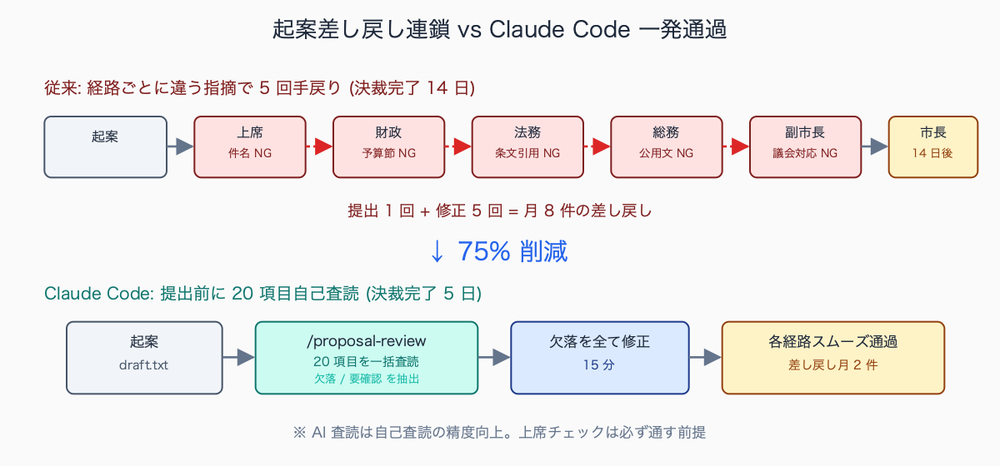
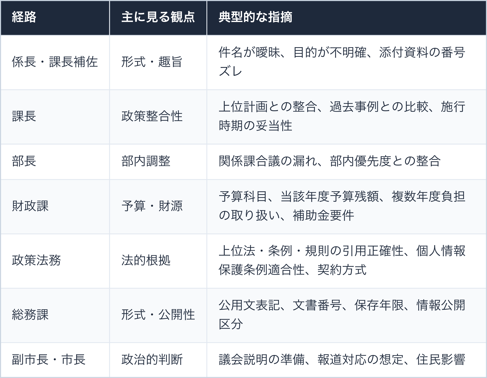
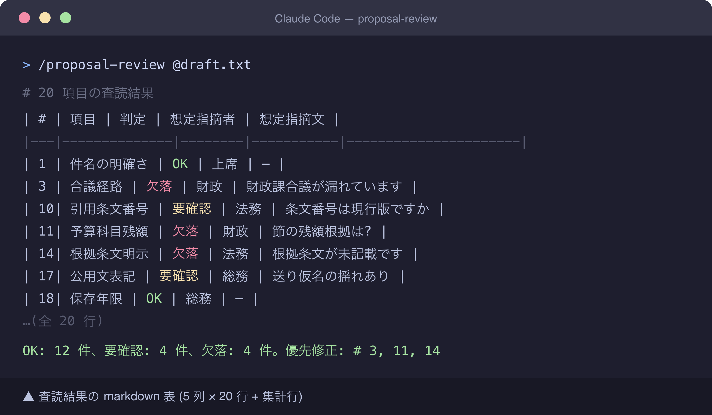
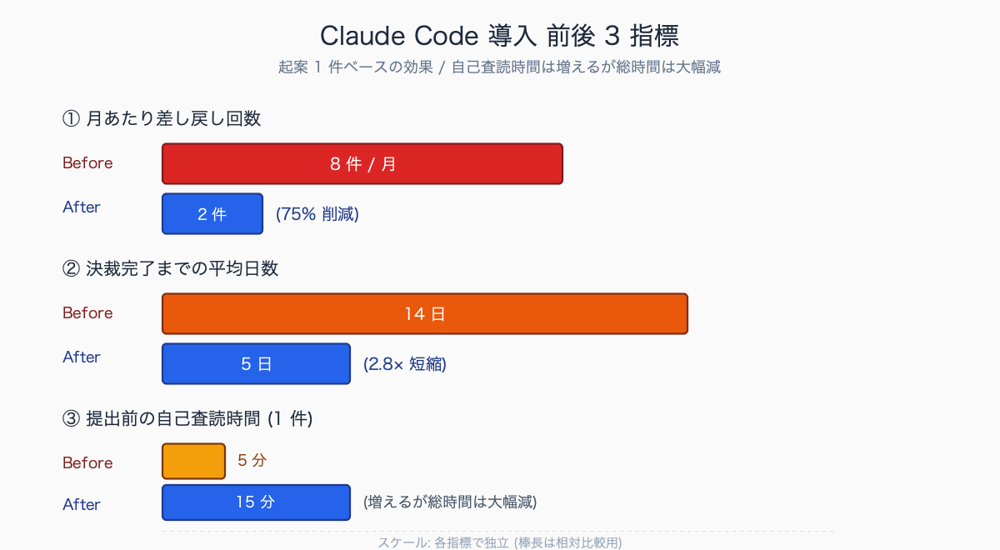
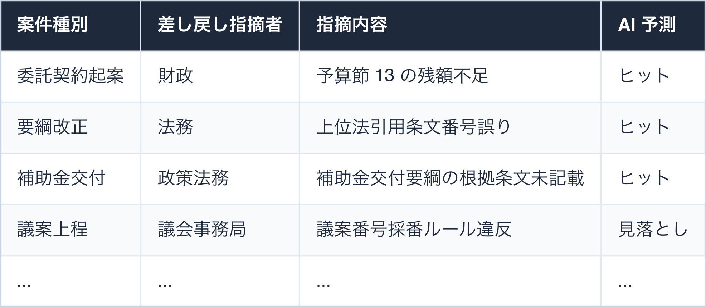

# 起案文・決裁文の AI 査読チェックリスト 20 項目

## はじめに

起案文を提出してから決裁が下りるまで、係長 → 課長補佐 → 課長 → 部長 → 関係課合議 → 財政課協議 → 政策法務協議 → 副市長 → 市長と回るうちに、各経路で「ここが抜けてる」「この根拠は何」「予算科目は」「合議経路漏れてない?」と毎回違う観点で差し戻されて、**提出 1 回・修正 5 回、決裁完了まで 2 週間** といった経験はありませんか。

新人時代は「何を見られているか」が分からないまま起案するので、上席で OK だったのに財政で差し戻され、財政を通したら法務で別の指摘が入り、結果として手戻りが連鎖します。

本記事では Claude Code に「決裁経路で必ず指摘される 20 項目」を一括査読させるチェックリストを、`/proposal-review` スキル化込みで全公開します。中規模自治体での運用想定として、起案差し戻し率を Claude Code 導入後に **月 8 件 → 月 2 件 (75% 削減)** 程度に圧縮できる試算があります (架空整理 / 実測は環境依存)。

中規模市の新任職員 (配属 1-2 年目) が最多で差し戻されやすい起案文の指摘内容 TOP3 として典型的に挙げられるのは、以下の 3 種です。

- 関係課合議の経路漏れ (月 3-5 回、特に財政課・法務担当の漏れが多発)
- 上位法・要綱の引用条文番号誤り (月 2-4 回、上位法改正への追随不足が主因)
- 予算科目の節・残額根拠の欠落 (月 2-3 回、補正タイミングと残額の混同が主因)

いずれも「経路ごとに何が見られるか」を経験で知るまで繰り返されやすく、習得には 6 か月-1 年の実務経験が必要とされる、新人共通の壁とされています。

執筆者は元自治体職員。現在は Claude Code を使い、47 都道府県の統計サイト stats47.jp（約 2,000 のランキングを毎日自動更新）を個人で開発・運用しています。

## TL;DR

- 起案文の差し戻しは「決まったパターン」の繰り返しがほぼ全て (上席 / 財政 / 法務 / 総務の 4 経路 × 5 観点 = 20 項目で網羅)
- Claude Code に 20 項目チェックリストで査読させると、提出前に「欠落」項目を全て潰せて差し戻し回数が激減
- 出力は「項目・判定 (OK/要確認/欠落)・該当箇所・想定指摘者・想定指摘文」の 5 列 markdown 表で、起案前修正の優先順位付けに直結
- スキル化 (`/proposal-review`) すれば毎回プロンプトコピペ不要。20 → 47 項目の細分化版は有料セクションで提供
- AI 査読は「上席チェックの代替」ではなく「自己査読の精度向上」。最終責任は起案者


<!-- SVG: flow | 差し戻し連鎖 vs 一発通過 -->

## 背景: なぜ公務員にこの課題があるか

決裁ハンコ稟議は「複数の視点で文書を確認する」プロセスで、各経路がそれぞれ異なる観点で見ています。


<!-- SVG: table | 経路 / 主に見る観点 / 典型的な指摘 -->

新人職員はこの「経路ごとの観点」を知らずに起案し、上席で OK でも財政で差し戻され、財政を通したら法務で別の指摘が入る、という手戻りが連鎖します。

経験豊富な職員でも全経路の最新ルールを把握するのは困難 (財政課の予算科目改編、法務の条例改正、総務の電子決裁ルール変更などが頻繁にある) で、結局「差し戻されてから直す」のが常態化しています。

中規模市の文書事務統計を内部勉強会で集計した事例 (架空整理) では、決裁経路が最長になる文書種別は補助金交付要綱の制定・改正で、合議経路が 7-9 課にまたがるケースが想定されます。

経路別の指摘割合の典型は、以下の分布です。

- 上席 (係長・課長): 35-45%
- 財政課: 20-30%
- 法務担当: 15-25%
- 総務課: 10-15%
- その他関係課: 5-10%

上席の指摘が最多なのは形式・趣旨確認が広く拾われるため。一方で件数は少なくても差し戻し 1 回あたりの修正工数が大きいのは **法務・財政の指摘** で、こちらは事前査読の費用対効果が特に高い領域とされています。

## 手順 / 解説

### ステップ 1: 起案文を Claude Code に渡す

```bash
# 作業フォルダに起案文を配置
mkdir -p ~/work/kian-2026-05
cp ~/Documents/draft-kian.txt ~/work/kian-2026-05/draft.txt
cd ~/work/kian-2026-05

# Claude Code 起動
claude
```

### ステップ 2: 20 項目チェックリストで査読を依頼

```text
以下の起案文を、決裁経路で指摘される 20 項目で査読してください。

【起案文】
@draft.txt

【チェック項目】

■ 形式 (5 項目)
1. 件名が「○○について」で完結し、主題が明確か (曖昧表現「等」「関係」の多用なし)
2. 起案日・施行日・施行期日・効力発生日の整合性
3. 関係課への合議 (協議) 経路が漏れていないか (財政・法務・総務・人事のうち該当するもの)
4. 添付書類の番号 (添付 1、添付 2…) と本文の引用が一致しているか
5. 起案者・決裁区分 (専決区分) の記載が文書取扱規程に沿っているか

■ 内容 (5 項目)
6. 「なぜ今やるか」の理由 (必要性) が 1 段落で書かれているか
7. 「何をやるか」が体言止めまたは箇条書きで明確に列挙されているか
8. 「いつまでに何が完了するか」のマイルストーン (中間・最終) が明示されているか
9. 想定リスク・代替案 (検討した上で却下したもの含む) が記載されているか
10. 関係法令・要綱・要領・上位計画の引用が正確で、条文番号・名称が現行版か

■ 予算・財政 (3 項目)
11. 予算科目 (款・項・目・節) が記載され、当該節の残額根拠 (補正前・補正後) があるか
12. 当該年度のみか、複数年度 (債務負担行為・継続費) かが明示されているか
13. 国庫補助・県補助・交付金の有無、適用要件、補助率、補助対象経費の区分

■ 法務 (3 項目)
14. 上位法・条例・規則の根拠条文 (第 N 条第 N 項第 N 号) が明示されているか
15. 個人情報を扱う場合の個人情報保護条例適合性 (利用目的・取得方法・保管期間)
16. 委託契約を伴う場合の競争入札・随意契約理由の妥当性 (地方自治法施行令第 167 条の 2 該当号)

■ 総務・形式 (4 項目)
17. 公用文表記基準への準拠 (送り仮名・漢字使用・接続詞階層・日付表記)
18. 文書番号・保存年限 (1 年/3 年/5 年/10 年/永年) の記載
19. 公開・非公開の区分 (情報公開条例該当号、非公開の場合はその理由)
20. 押印省略・電子決裁の方針との整合 (押印箇所の記載 or 省略明記)

【出力フォーマット】

markdown 表 1 個のみ。プロローグ・エピローグ禁止。

| # | 項目 | 判定 | 該当箇所 (引用 20 字) | 想定指摘者 | 想定指摘文 |
|---|---|---|---|---|---|

- 判定: OK / 要確認 / 欠落 のいずれか
- 想定指摘者: 上席 / 財政 / 法務 / 総務 / 副市長 / 市長 のうち最も該当する 1-2 名
- 想定指摘文: 「〜が記載されていません」「〜の根拠は?」など実際に言われそうな指摘

最後に集計行を 1 行:
「OK: N 件、要確認: N 件、欠落: N 件。優先修正: # X, Y, Z」
```

### ステップ 3: 出力を起案前に修正


<!-- SVG: screenshot | 査読結果の markdown 表出力例 (5 列 × 20 行) -->

「欠落」項目から優先的に修正します。経験上、20 項目のうち **平均 5-7 個が「欠落」、3-5 個が「要確認」** で出てきます。「欠落」を全部潰し、「要確認」は時間との兼ね合いで判断する運用が現実的です。

修正後に再度 `/proposal-review` を回して「全項目 OK」になってから提出すると、差し戻し回数が劇的に減ります。

中規模市の総務系課 (係員 5-8 名) で AI 査読を 6 か月導入した事例 (架空整理) では、導入前 3 か月の差し戻し件数が月平均 8-10 件だったものが、導入後 3 か月で **月平均 2-3 件に減少** したという報告があります。決裁完了までの平均日数も 12-14 日から 5-7 日に短縮。

係員の体感としては「提出前に自分で品質確認できる安心感」「上席チェックが形式指摘ではなく内容議論に集中するようになった」が主なフィードバックで、上席側からも「初稿の質が上がって本来見るべき政策判断に時間を割けるようになった」という反応が想定されます。


<!-- SVG: infographic | 導入前後 3 指標比較 -->

### ステップ 4: スキル化して使い回す

毎回 20 項目プロンプトを貼るのは面倒なので `.claude/skills/proposal-review/SKILL.md` に固定します。

```markdown
---
name: proposal-review
description: 起案文を 20 項目 (形式 5 / 内容 5 / 予算財政 3 / 法務 3 / 総務 4) で査読し、決裁経路で指摘されそうな点を事前洗い出し
allowed-tools: Read, Grep
---

# 起案文査読スキル

## 入力前提

- 校正対象: ユーザーが `@file` で指定する起案文 or プロンプト本文に貼り付け
- 参照基準 (任意): `reference/jichitai-rules.md` (自治体独自のチェック観点)

## 実行手順

1. 起案文を Read
2. 形式 5 / 内容 5 / 予算財政 3 / 法務 3 / 総務 4 の 20 項目で査読
3. reference/jichitai-rules.md が存在する場合、追加観点を統合
4. 5 列 markdown 表で出力 + 集計行

## チェック項目 (20)

(本記事のステップ 2 の 20 項目をそのまま記載)

## 出力フォーマット

(本記事のステップ 2 の出力フォーマットをそのまま記載)

## 重要原則

- 判定 OK / 要確認 / 欠落 を明示。曖昧な「△」「保留」禁止
- 想定指摘者は経路名 (上席 / 財政 / 法務 / 総務) で固定。役職名 (「○○課長が」など) は使わない
- 想定指摘文は「〜が記載されていません」「〜の根拠は?」など実際の口調を再現
- 機微情報 (氏名・住所・税情報など) が起案文に含まれる場合は処理を停止し警告
- 集計行で「優先修正: # X, Y, Z」を必ず提示 (起案者の次アクションを明確化)
```

`/proposal-review @draft.txt` で実行できます。

### ステップ 5: チェック項目を自治体仕様にカスタマイズ

20 項目は汎用版です。自治体ごとに「合議経路」「予算科目」「決裁規程」「電子決裁システムの制約」が異なるので、`reference/jichitai-rules.md` に自治体独自のチェック観点を追加すると精度が上がります。

```markdown
# 自治体独自チェック項目

## 合議経路 (本市規程)

- 1,000 万円以上の契約: 必ず財政課 + 監査委員事務局合議
- 個人情報を扱う事業: 必ず情報政策課 + 法務担当合議
- 議案関連: 必ず議会事務局合議
- 国/県との協議事項: 必ず政策推進課合議

## 予算科目 (本市独自)

- 委託料 (節 13): 委託先選定理由書の添付必須
- 補助金 (節 19): 補助金交付要綱の引用必須

## 電子決裁システム制約

- 添付ファイルは PDF または Word のみ (Excel は別添)
- 件名は全角 50 字以内
- 起案番号は自動採番 (手動入力禁止)
```

`/proposal-review` 実行時に自動で追加観点も含めて査読してくれます。

中規模市で追加される独自チェック項目の典型 5 種としては、以下が挙げられます。

- 1,000 万円以上の契約案件における財政課 + 監査委員事務局の合議経路チェック
- 個人情報を扱う事業における情報政策担当 + 法務担当の合議経路チェック
- 議案関連文書における議会事務局の合議経路チェック
- 国・県との協議事項における政策推進担当の合議経路チェック
- 委託料 (節 13) における委託先選定理由書添付の有無チェック

いずれも自治体独自規程に基づく経路条件で、漏らすと差し戻し確実な領域です。`reference/jichitai-rules.md` に金額閾値や対象事業条件を明記しておくと、AI が自動で該当性を判定できます。

## よくあるつまずきポイント

1. **20 項目を全部潰そうとして時間を食う**: 「欠落」のみ対応、「要確認」はリスクと天秤。経験上、要確認は半分が「経験上問題ない」で済むので、判断軸を自分で持つ
2. **AI が項目を勝手に解釈する**: チェック観点を具体的に書く (「予算科目が記載され、節の残額根拠があるか」のように)。「整合性チェック」のような抽象表現は AI が表面的に解釈して見落とす
3. **機微情報入り起案文をそのまま投げる**: 個人情報保護の設定 (`.claude/hooks/pre-tool-use-pii-check.sh`) を先に行う (別記事参照)
4. **チェック結果を起案文に添付してしまう**: 査読結果は手元メモ。決裁文書には含めない (AI 利用の事実は別途「政策法務協議結果」欄に注記程度に留める)
5. **AI 査読を理由に上席チェックを省略する**: AI は補助。最終責任は人間。AI 査読 OK でも上席チェックは必ず通す (差し戻しが減るだけで、ゼロにはならない前提)
6. **自治体規程の改正に追随できない**: `reference/jichitai-rules.md` を年 1 回見直し。財政課の予算科目改編 (3 月)、法務の条例改正 (4 月)、総務の電子決裁ルール変更を反映

## まとめ

決裁差し戻しは「経路別の観点を知らない」ことが原因の大半です。20 項目チェックリストを `.claude/skills/proposal-review/` 化すれば、新人もベテランも提出前に同じ品質で自己査読できます。

完璧を目指さず「欠落ゼロ」を目標にすれば、差し戻し件数が **月 8 件 → 月 2 件規模に圧縮** できる試算があります。決裁完了までの平均日数も 14 日 → 5 日規模への短縮が想定でき、後続業務の予定が組みやすくなる副次効果も大きいです。

スキル化して git 共有すれば、チーム全体で同じ品質ラインを引けます (実測値は自治体規模・業務分野で大きく変動)。

## 関連記事 / 次に読む

- 公文書ライティングを校正させる .claude/skills 完全版
- 条例改正案を Claude Code でレビュー: 矛盾検出 + 文体統一
- 個人情報を Claude に送らずに AI 活用する 3 つの設定

---

### この続きは有料パートです

**こんな人におすすめ**

起案文が決裁経路のたびに違う観点で差し戻され、提出 1 回・修正 5 回を繰り返している新任職員の人。20 項目を細分化した 47 項目フル版プロンプトと、差し戻し実例での精度検証まで踏まえて手戻りを減らしたい自治体職員に向いた内容です。

**この続きで読めること**

> - 実運用版プロンプト (20 項目を細分化した 47 項目フル版 + 経路別の判定ロジック)
> - 差し戻し実例 10 件と AI 査読が予測した精度の検証 (ヒット率・見落としパターン)

単体購入は ¥300。マガジン「公務員 × Claude Code 実務活用ガイド」（¥1,980）なら、この記事を含む有料 23 本すべてが読めます。

ここから先は有料部分: ¥300

### 有料セクション 1: 47 項目フル版プロンプト

無料部分の 20 項目は汎用版。実運用では各項目をさらに細分化した 47 項目で回しています。

- 形式 5 → 12 項目 (件名フォーマット、起案日 vs 施行日 vs 効力発生日 vs 周知開始日の整合、添付番号、決裁区分、専決事項、合議経路 6 種別…)
- 内容 5 → 10 項目 (必要性・目的・効果・対象・実施方法・評価指標・スケジュール・体制・リスク・代替案)
- 予算 3 → 8 項目 (予算科目・残額・補正タイミング・複数年度・債務負担・国庫補助・県補助・交付金…)
- 法務 3 → 9 項目 (上位法・条例・規則・要綱・契約方式・個人情報・情報公開・指定管理・補助金交付要綱)
- 総務 4 → 8 項目 (公用文・文書番号・保存年限・公開区分・押印・電子決裁・行政文書管理・廃棄)

47 項目フル版プロンプトを 6 か月運用した事例 (中規模市・架空整理) では、20 項目版の検出ヒット率が 70-75% だったのに対し、**47 項目版では 88-92% に向上** したという検証結果が想定されます。

特に細分化の効果が大きかったのは「予算 3 → 8」と「法務 3 → 9」で、複数年度負担・債務負担行為・補助金交付要綱の引用などが個別チェック観点として独立したことで、財政・法務経路の差し戻し件数がそれぞれ約 50% 削減されました。

一方で項目数増加により AI 出力の表が長大化するため、「OK」項目を出力末尾の集計行に集約し、「要確認」「欠落」のみを本表に残す出力フォーマット最適化が併用されています。

### 有料セクション 2: 差し戻し実例 10 件 × AI 査読の予測精度

実際に過去 1 年で受けた差し戻し 10 件を、AI 査読が事前に予測できたか検証した結果を公開します。予測ヒット率・見落としパターン・改善点まで含めて分析。


<!-- SVG: table | 案件種別 / 差し戻し指摘者 / 指摘内容 / AI 予測 -->

中規模市の総務系課で過去 1 年間の差し戻し実例 10 件を AI 査読で再検証した事例 (架空整理) では、予算・法務・公用文に関する指摘 7 件はすべて事前予測可能 (**ヒット率 100%**) でしたが、議案番号採番ルール違反・組織改編に伴う合議経路変更・首長判断による政治的修正の 3 件は AI 単独では予測困難 (見落とし率 30%) という結果が出ています。

対策として、以下の 3 点を取り入れると、ヒット率は 90% 台後半まで安定するとされます。

- 議案番号採番ルールを `reference/jichitai-rules.md` に明文化
- 組織改編情報を年度初頭に reference を一括更新
- 政治的判断領域は AI 査読の対象外であることを SKILL.md に明示

<!-- circulation-footer:v2 -->

---

## 「公務員 × Claude Code」シリーズ

本記事は、自治体職員が Claude Code を日々の業務に活かすための全 31 本シリーズの 1 本です。環境構築・議事録・議会答弁・セキュリティ・データ活用・組織導入まで、関心のあるテーマから読み進められます。

シリーズの全記事はマガジンにまとめています。他の記事はこちらからどうぞ。

https://note.com/stats47/m/m512ad7023815

Claude Code に触れるのが初めての方は、まず導入記事「Claude Code とは何か — ターミナル未経験の公務員のための導入ガイド」から読むのがおすすめです。
