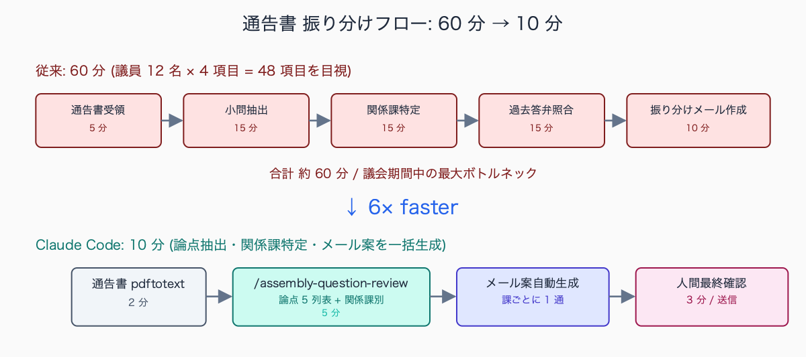
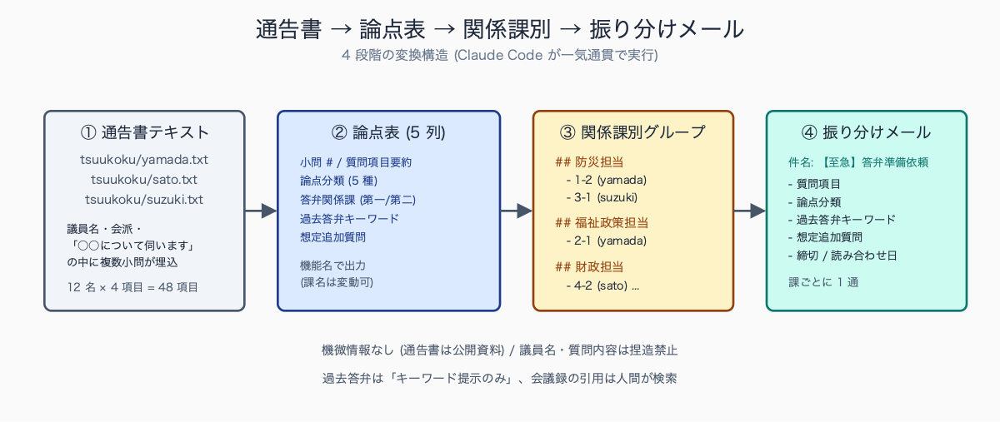
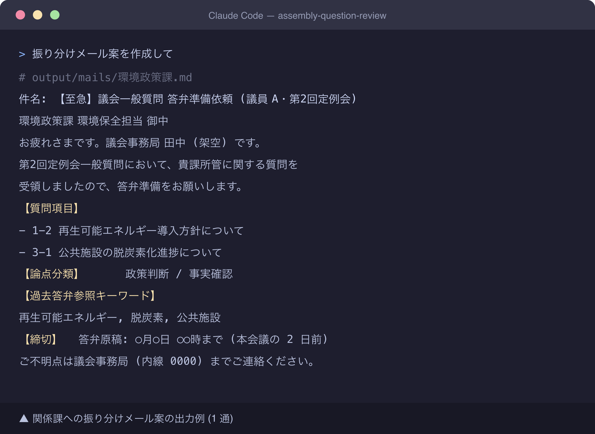
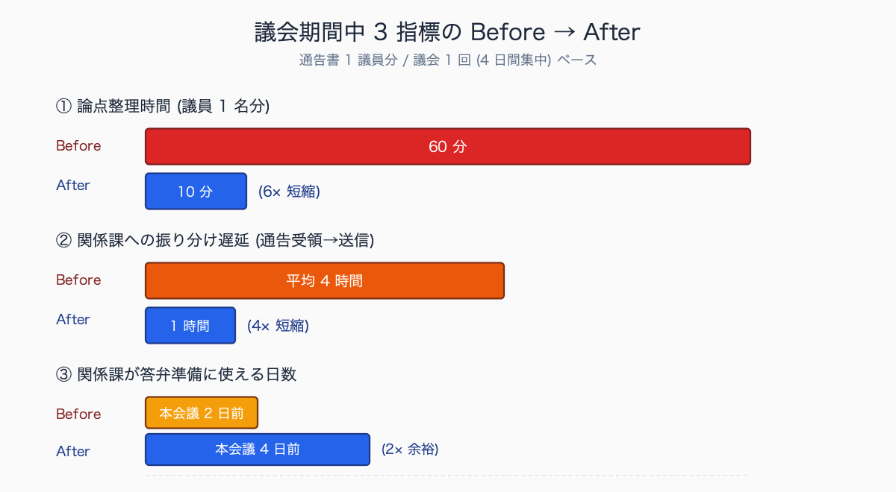

# 議会一般質問の論点整理を 1 時間 → 10 分にする方法

## はじめに

議会一般質問の通告書を 6 月議会開会日の 5 日前に受け取り、議員 12 名 × 平均 4 項目 = 48 項目の論点を「何を問われているか」「どの課が答えるか」「過去答弁との整合はあるか」「想定追加質問は何か」に分解して関係課に振り分ける作業を、**毎回 1 時間以上** かけていませんか。

議会事務局・答弁作成補佐の担当者にとって、この「最初の論点整理」は神経を使う割に評価されにくい地味な業務で、しかも振り分けが遅れると関係課の答弁原稿作成時間を圧迫します。

本記事では Claude Code を使ってこの作業を **10 分に短縮** する手順を、`/assembly-question-review` スキル化込みで無料全公開します。

人口 15-30 万人規模の市議会事務局 (定数 28-36 名規模) を想定すると、6 月定例会の一般質問では議員 12-16 名 × 平均 3-5 項目 = 通告 40-80 項目が開会 5 日前に集中します。

1 議員分の通告書 (PDF 1-2 枚) を読み解き、論点抽出 → 関係課特定 → 過去答弁参照キーワード抽出 → 振り分けメール作成までを通すと、新任の議会事務局職員で 60-90 分、ベテランでも 30-40 分というのが典型的な所要時間です。

議会期間中はこの作業が連日発生し、振り分けが遅れると関係課の答弁原稿作成時間 (通常 2-3 日確保が必要) を圧迫するため、**議会運営全体のクリティカルパス** になりやすい業務です。

執筆者は元自治体職員。現在は Claude Code を使い、47 都道府県の統計サイト stats47.jp（約 2,000 のランキングを毎日自動更新）を個人で開発・運用しています。

## TL;DR

- 一般質問通告書は「質問項目」「背景説明」「想定答弁先」に分解できる定型構造で AI が処理しやすい
- Claude Code に通告書を投げて、論点・関係課 (機能名)・過去答弁参照キーワード・想定追加質問を一括抽出
- 出力を関係課への振り分けメール本文にそのまま貼れる markdown 形式にすると、転記工数も消える
- 機微情報は含まない (通告書は議会の公開資料) ので個人情報保護設定の追加は不要
- AI は「最初の振り分け案」を作るだけ。最終判断は議会事務局の経験で行う (経験者の暗黙知を AI が完全代替するのは現状不可)


<!-- SVG: flow | 通告書振り分け 60 分 vs 10 分 -->

## 背景: なぜ公務員にこの課題があるか

議会一般質問の論点整理は、通告書 1-2 枚から以下を読み解く作業です。

1. **質問項目の抽出**: 通告書は条立てされていないことが多く、「○○について伺います」の中に複数の小問が埋め込まれている
2. **論点分類**: 各小問が「政策判断を問うもの」「事実確認を求めるもの」「予算・人事・条例改正の意向確認」のどれか
3. **関係課特定**: どの課 (機能) が答えるべきか。複数課にまたがる場合の主管課・副管課の判断
4. **過去答弁との整合**: 同議員が過去に同テーマで質問していないか、別議員に対して既に答弁していないか
5. **想定追加質問の予測**: 議員の関心傾向 (会派・所属委員会・過去質問履歴) から、本会議当日に追加されそうな再質問を予測

経験豊富な議会事務局職員なら 10 分で終わりますが、新任者は 1 時間以上かかります。しかも 6 月・9 月・12 月・3 月の議会期間中は通告が次々と入り (1 議会で延べ 40-80 項目)、振り分けが遅れると関係課の答弁作成時間が圧迫されます。「論点整理の速度」は議会運営全体のボトルネックになりやすい業務です。

中規模市の議会事務局 (架空例) では、定例会開会日の 5-3 日前に通告書が集中し、1 日あたり 10-25 項目の処理が必要になります。

振り分け遅延が 1 日発生すると、関係課の答弁原稿作成時間が 3 日から 2 日に圧縮され、以下のような波及が連鎖します。

- 課長級の事前読み合わせが省略される
- 上位法・過去答弁との整合チェックが不十分になる
- 本会議当日の追加質問への準備不足が発生する

最悪のケースでは本会議当日の答弁中に首長・幹部が補足説明に入って混乱、議事録に「○○については後日改めて回答」が残るという、**自治体評価に直結する事態** に至る例も想定されます。

## 手順 / 解説

### ステップ 1: 通告書をテキスト化

```bash
# 作業フォルダ作成
mkdir -p ~/work/gikai-2026-06/{tsuukoku,output}
cd ~/work/gikai-2026-06

# 通告書 PDF をテキスト化 (議員ごとに分けて保存)
pdftotext -layout ~/Downloads/tsuukoku-yamada-2026-06-15.pdf tsuukoku/yamada.txt
pdftotext -layout ~/Downloads/tsuukoku-sato-2026-06-15.pdf tsuukoku/sato.txt
pdftotext -layout ~/Downloads/tsuukoku-suzuki-2026-06-15.pdf tsuukoku/suzuki.txt

# Claude Code 起動
claude
```


<!-- SVG: screenshot | `tree tsuukoku/` の出力 (議員ごとのテキストファイル一覧) -->

PDF レイアウトが崩れる場合は `-table` オプションも試します。それでも崩れる場合は手動で「議員名・会派・質問項目」の見出しだけ整形すれば十分です (本文の小問は AI が抽出するので原形保持で OK)。

### ステップ 2: 論点抽出プロンプトを投げる

```text
@tsuukoku/yamada.txt の議会一般質問通告書から、以下の項目を markdown 表で
抽出してください。

【出力フォーマット】

| # | 質問項目 (要約 30 字) | 論点分類 | 答弁関係課 (第一 / 第二) | 過去答弁参照キーワード | 想定追加質問 |
|---|---|---|---|---|---|

【各列の定義】

- # : 通告書の小問番号 (1-1, 1-2, 2-1 のように親項目-小問番号)
- 質問項目: 通告文の主旨を保ったまま 30 字以内に短縮
- 論点分類: 以下 5 種から選択
  - 政策判断 (新規施策の方針を問う)
  - 事実確認 (現状の数値・進捗を問う)
  - 予算 (予算措置の有無・規模を問う)
  - 人事 (組織・職員配置を問う)
  - 条例改正 (条例・規則の改正意向を問う)
- 答弁関係課: 具体名ではなく機能名 (例: 防災担当、福祉政策担当、財政担当)
  第一 = 主管、第二 = 副管 (該当なければ「-」)
- 過去答弁参照キーワード: 議会会議録検索システムで使える単語 3-5 個 (コンマ区切り)
- 想定追加質問: 議員の関心傾向 (会派・所属委員会) から推測される 2-3 個

【出力後の追加処理】

論点表の後に、答弁関係課ごとにグループ化した再掲を作成:

## 防災担当
- 1-2 ○○について (yamada 議員)
- 3-1 ○○について (suzuki 議員)

## 福祉政策担当
- 2-1 ○○について (yamada 議員)
...

【重要原則】

- 議員名・質問内容は通告書のまま使用 (要約のみ可、捏造禁止)
- 論点分類が複数該当する場合は「政策判断 + 予算」のように複数記載
- 過去答弁の参照は「キーワード提示」にとどめ、会議録の内容を AI が捏造しない
- 機能名がわからない場合は「(要確認)」と明示
```


<!-- SVG: structure | 通告書 4 段階変換構造 -->

### ステップ 3: 関係課への振り分けメール案を作る

```text
上記の論点整理を元に、各関係課への振り分けメール案を 1 通ずつ作ってください。

【メールフォーマット】

件名: 【至急】議会一般質問 答弁準備依頼 (○○議員・第N回定例会)

本文:
○○課 ○○担当 御中

お疲れさまです。議会事務局○○です。

○月○日開会の第N回定例会一般質問において、貴課所管に関する質問を
受領しましたので、答弁準備をお願いします。

【質問項目】(複数の場合は箇条書き)
- 1-2 ○○について (要約)
- 3-1 ○○について (要約)

【論点分類】政策判断 / 事実確認 / 予算 / 人事 / 条例改正

【過去答弁参照キーワード】
○○、○○、○○ (会議録検索システムで検索してください)

【想定追加質問】
- ○○について
- ○○について

【締切】
答弁原稿: ○月○日 ○○時まで (本会議の 2 日前)
事前読み合わせ: ○月○日 ○○時 (議会事務局会議室)

【添付資料】
- 通告書全文 (該当箇所マーカー済み)
- 過去答弁抜粋 (該当ありの場合)

ご不明点は議会事務局 (内線 ○○○○) までご連絡ください。

よろしくお願いいたします。

【文体】公用文 (敬語・丁寧体)、件名は全角 50 字以内、本文は 30 行以内
```


<!-- SVG: screenshot | 振り分けメール案の出力例 (関係課ごとに 1 通) -->

中規模市の議会事務局で AI 生成の振り分けメールを 1 定例会 (40-60 項目分) 運用した事例 (架空整理) では、関係課からの修正依頼は全体の **10-20% 程度** に収まったという報告があります。

主な指摘内容は以下のとおりです。

- 機能名と実際の所管課の対応関係の修正 (組織改編で機能配置が変わった、4-6 割)
- 主管・副管の入れ替え依頼 (横断テーマで両課が押し付け合い、2-3 割)
- 過去答弁参照キーワードの追加・削除 (1-2 割)

AI 生成版を一次案として議会事務局のベテランが 5-10 分監査する運用にすると、修正後の最終版品質は人手 100% 作成時とほぼ同等が維持できるとされています。

### ステップ 4: `.claude/skills/assembly-question-review/` でスキル化

```markdown
---
name: assembly-question-review
description: 議会一般質問通告書から論点・関係課・振り分けメール案を一括生成。tsuukoku/ ディレクトリ前提。
allowed-tools: Read, Grep, Glob
---

# 議会質問論点整理スキル

## 入力前提

- `tsuukoku/` ディレクトリ: 議員ごとの通告書テキスト (`<議員名>.txt`)
- `reference/kakari-mapping.md` (任意): 機能名 → 課名の対応表
- `reference/past-touben/` (任意): 過去答弁要約集 (会議録検索の代替)

## 実行手順

1. `tsuukoku/` 配下の全 `.txt` を Read
2. 議員ごとに論点抽出 (5 列表)
3. 全議員分を統合して答弁関係課別グループ化
4. 各関係課への振り分けメール案を作成
5. `output/` に以下を書き出し
   - `output/ronten-table.md` (論点抽出表 全議員分)
   - `output/by-kakari.md` (関係課別グループ)
   - `output/mails/<課名>.md` (振り分けメール案 課別)

## 出力フォーマット

(本記事のステップ 2 - 3 のフォーマットをそのまま記載)

## 重要原則

- 議員名・質問内容は通告書のまま使用 (要約のみ可、捏造禁止)
- 想定論点は推測であることを明示
- 過去答弁の参照は「キーワード提示」のみ。AI が会議録を捏造しない
  (`past-touben/` がある場合のみ実答弁を引用可)
- 機微情報は含まれない前提だが、想定外の個人情報が混入していたら処理停止し警告
- 締切設定 (答弁原稿締切・読み合わせ日時) は AI に計算させず、ユーザーに確認
```

`/assembly-question-review` で実行できます。

### ステップ 5: 過去答弁の検索と組み合わせる

論点表から得たキーワードで議会会議録検索システム (多くの自治体が「議会だよりオンライン」や独自システムを持つ) を叩けば、過去答弁との整合性チェックも 5 分で終わります。

```bash
# 例: 議会会議録検索 API がある場合
curl -s "https://gikai.example.lg.jp/api/search?q=防災対策" -o output/past-touben-bousai.json

# Claude Code でキーワードベースの検索結果を読み込む
# /assembly-question-review 実行時に reference/past-touben/ にあれば自動参照
```

過去答弁との不整合 (例: 3 年前は「予算化困難」と答弁、今回は「予算化検討中」と答弁する) が見つかった場合は、議員に説明する場合 (前回答弁から状況変化を説明)・答弁を修正する場合 (前回答弁との整合性を最優先) の判断基準を議会事務局のベテランに相談します。

過去答弁との不整合への対応プロセスとして、中規模市の議会事務局 (架空例) で運用されている判断基準は、以下の 3 段階分岐です。

- 不整合の幅が「予算規模・施行時期・対象範囲」のいずれかで定量的に説明可能なら、状況変化として議員に説明する案を主管課に作らせる
- 不整合が政策方針の転換に踏み込む場合は、首長判断を仰いだ上で議会答弁前に会派代表者に事前説明する
- 不整合が前回答弁の事実誤認に起因する場合は、訂正答弁案を別途準備し議会運営委員会で取扱協議する

いずれもベテラン議会事務局職員の経験で判断する領域で、**AI 単独で結論を出すべきでない代表例** です。


<!-- SVG: infographic | 議会期間 3 指標 Before/After -->

## よくあるつまずきポイント

1. **通告書 PDF のレイアウト崩れ**: `pdftotext -layout` を使う。それでも崩れる場合は `-table` オプション or 手動でテーブルを整形 (見出しだけ整えれば本文は AI が抽出可)
2. **想定論点が「政策判断」一色になる**: プロンプトで分類肢を 5 種類明示する (本記事のフォーマット通り)。「分類してください」だけだと AI が無難な「政策判断」に逃げがち
3. **関係課を具体名で出してしまう**: 「機能名で」と明示。AI は組織図を知らないので機能名の方が安全。組織図変更があっても運用が壊れない
4. **AI が過去答弁を捏造する**: 「キーワード提示のみ」を厳守。会議録の引用は人間が検索して確認。`reference/past-touben/` を整備すれば AI が実答弁を引用可になる
5. **振り分けメールの締切設定**: AI には締切を計算させず、人間が議会日程 (本会議日・委員会日・読み合わせ日) を見て手動設定。AI に「2 日前」と書かせると土日祝日を勘違いする
6. **議員の会派・所属委員会情報が古い**: `reference/giin-list.md` に最新情報を年 1 回更新。会派構成は議会選挙のたびに変わる

## まとめ

議会一般質問の論点整理は構造化された業務なので、Claude Code に渡しやすい領域です。**1 時間 → 10 分の短縮** で議会期間中の余裕が生まれ、関係課への振り分けが早まることで答弁作成時間も確保できます。

最終判断は議会事務局のベテランの経験で行うことを忘れずに。AI は「最初の振り分け案」「ドラフト作成補助」として使い、議員対応の責任は人間が持つのが現状の正解です。スキル化 (`/assembly-question-review`) して議会期間中の繁忙を緩和してください。

## 関連記事 / 次に読む

- 議会答弁原稿を Claude Code で 3 案出す prompt 集
- 公文書ライティングを校正させる .claude/skills 完全版
- 起案文・決裁文の AI 査読チェックリスト 20 項目

<!-- circulation-footer:v2 -->

---

## 「公務員 × Claude Code」シリーズ

本記事は、自治体職員が Claude Code を日々の業務に活かすための全 31 本シリーズの 1 本です。環境構築・議事録・議会答弁・セキュリティ・データ活用・組織導入まで、関心のあるテーマから読み進められます。

シリーズの全記事はマガジンにまとめています。他の記事はこちらからどうぞ。

https://note.com/stats47/m/m512ad7023815

Claude Code に触れるのが初めての方は、まず導入記事「Claude Code とは何か — ターミナル未経験の公務員のための導入ガイド」から読むのがおすすめです。
