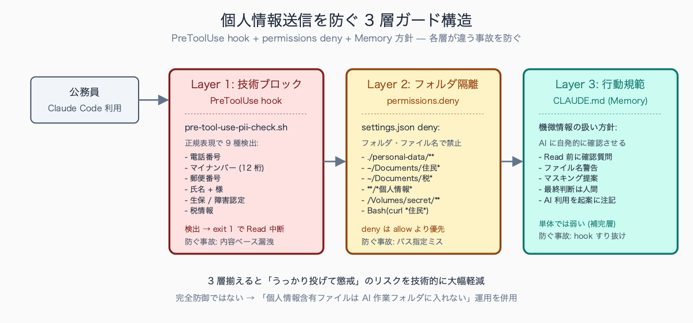
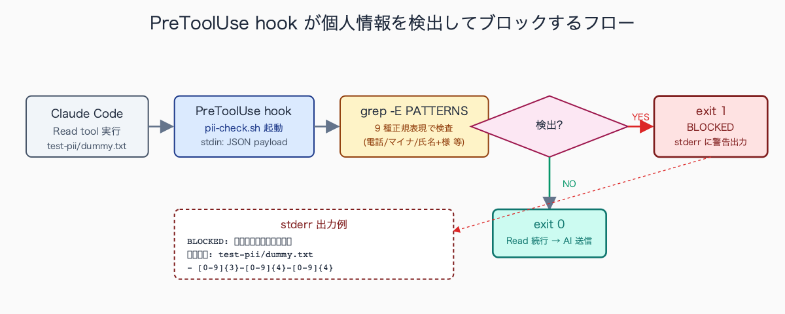

# 個人情報を Claude に送らずに AI 活用する 3 つの設定

## はじめに

「公務員が AI を使うと個人情報漏洩のリスクが…」「うちは AI 禁止だから Claude Code も使えない」と諦めていませんか。確かに住民の氏名・住所・電話番号・マイナンバー・税情報・健康情報をそのまま AI に投げるのは個人情報保護条例違反のリスクが高く、即懲戒・場合によっては地方公務員法違反で刑事罰になります。

しかしこの不安は、Claude Code に **3 つの設定 (PreToolUse hook + permissions deny + Memory 方針)** を入れるだけで大幅に軽減できます。本記事では `.claude/hooks/` `.claude/settings.json` `CLAUDE.md` の 3 つを連動させて、「うっかり個人情報を投げてしまう」リスクを技術的にブロックする手順を、bash hook と JSON の完全コピペ版で全公開します。

中規模市の住民・税・福祉系の部署 (架空例) における「AI 活用 NG」ルールの典型は、(1) 業務 PC からの外部 API 接続を LGWAN セグメントレベルで遮断、(2) 機微情報を含むファイル名・ディレクトリへのアクセスログを情報政策担当に自動転送、(3) 持ち出し PC (BYOD・自宅 PC) からの庁内 NW 接続禁止、(4) 個人情報を含む業務文書のクラウドサービス利用全面禁止、の 4 種です。違反時の措置は文書注意から懲戒処分まで段階的に規定されており、特に住基・税・福祉系の部署では「外部 API への送信」自体が情報セキュリティポリシー違反と整理される運用が一般的です。

## TL;DR

- **設定 1**: `PreToolUse` hook で個人情報パターン (電話番号 / マイナンバー / 氏名 + 様 など) を正規表現検出し、検出時に Read を技術的ブロック
- **設定 2**: `settings.json` の `permissions.deny` で「絶対に読まないフォルダ」を固定 (`./personal-data/**` `~/Documents/住民*` など)
- **設定 3**: `CLAUDE.md` (Memory) に「機微情報の扱い方針」を明示し、AI が自発的に確認するようにする
- 3 つ揃えると「うっかり個人情報を投げてしまう」リスクを技術的に防げる (二重ガード + 行動規範)
- それでも 100% ではないので、最終的には「個人情報を含むファイルは別フォルダに隔離する」運用が前提
- 本設定で Claude Code 業務利用の社内承認を取った実例も末尾に紹介


<!-- SVG: structure | 3 層ガード構造 -->

## 背景: なぜ公務員にこの課題があるか

公務員が扱う文書には以下のような個人情報が日常的に含まれます。

- 住民基本情報: 氏名・住所・電話・生年月日・本籍・続柄
- マイナンバー (12 桁)
- 税情報: 所得・控除・税額・滞納履歴
- 健康情報: 病名・通院歴・診断書・障害認定
- 福祉情報: 生活保護受給歴・児童相談記録・DV 相談記録
- 教育情報: 成績・出欠・指導要録

これらは個人情報保護条例 (自治体ごとに細部は異なるが原則は共通) で「業務上必要な範囲を超えて第三者に提供してはならない」と規定されています。漏洩したら即懲戒、悪質な場合は地方公務員法第 34 条 (守秘義務) 違反で刑事罰 (1 年以下の懲役または 50 万円以下の罰金) になります。

AI サービス (Claude を含む) が「第三者」に該当するかどうかは解釈の分かれ目で、現状の多くの自治体では「該当する」と保守的に判断するのが安全とされています。機微情報を生成 AI に入力する場合は、業務委託契約に準じた管理措置 (送信先・保管期間・破棄手順の明示) を求める運用が広がっており、総務省・デジタル庁が自治体向けに公表している生成 AI 関連の利用指針でも同様の趣旨が示されています (出典名・条文の正確な引用は最新版を各自確認のこと)。

つまり、業務文書をそのまま AI に投げる行為は規程違反のリスクがあります。一方で AI 活用を諦めると、起案文校正・条例レビュー・議会答弁準備など効率化できる業務が大量に放置されます。**「個人情報を投げない仕組みを技術的に固定」した上で AI を活用する** のが現実解です。

総務省・デジタル庁が自治体向けに公開している生成 AI 関連の利用指針整備が進んで以降、自治体側の AI 利用ガイドライン策定は段階的に広がっており、特に人口 10 万人以上の市での整備が進んでいます (具体の策定率は自治体規模・年度で大きく異なるため、最新値は各自治体公表資料を参照)。職員研修で示される NG 例の典型は、(1) 住民の氏名・住所を含む申請書のテキストを生成 AI に入力、(2) 税情報・所得情報を含む Excel データの分析依頼、(3) 議事録の中の発言者特定可能情報をそのまま要約依頼、(4) 個人情報を含む過去のメールを翻訳・要約させる、の 4 種です。いずれも「業務効率化のつもりが懲戒事案に直結する」典型例として研修資料に必ず含まれます。

## 手順 / 解説

### 設定 1: PreToolUse hook で個人情報検出 + ブロック

Claude Code の hook 機能を使い、Read tool 実行前にファイル内容を検査します。個人情報パターンを検出したら `exit 1` で処理を中断する仕組みです。

`.claude/hooks/pre-tool-use-pii-check.sh` を作ります。

```bash
#!/bin/bash
# AI に送られる前にファイル内容を検査し、個人情報パターンを検出したらブロック
# Claude Code が Read tool を実行する直前にこの hook が呼ばれる
# stdin から JSON で {"tool_input": {"file_path": "..."}} が渡される

set -euo pipefail

# 標準入力から hook payload を読む (Claude Code 仕様)
PAYLOAD=$(cat)
FILE_PATH=$(echo "$PAYLOAD" | python3 -c "import sys, json; print(json.load(sys.stdin)['tool_input'].get('file_path', ''))")

# file_path が無い (Bash 等の他 tool 経由) なら通過
if [ -z "$FILE_PATH" ] || [ ! -f "$FILE_PATH" ]; then
  exit 0
fi

# 個人情報検出パターン (正規表現)
PATTERNS=(
  '[0-9]{3}-[0-9]{4}-[0-9]{4}'             # 電話番号 (090-1234-5678)
  '[0-9]{2,4}-[0-9]{2,4}-[0-9]{4}'         # 固定電話 (03-1234-5678)
  '〒?[0-9]{3}-[0-9]{4}'                    # 郵便番号
  '[0-9]{12}'                                # マイナンバー (12 桁連続数字)
  '(氏名|住所|生年月日|本籍|電話番号)[::]'  # 個人情報キーワード + コロン
  '[一-龯ぁ-んァ-ヶ]{2,4}[\s　]*様'         # 氏名 + 様 (敬称)
  'マイナンバー[::]?[\s　]*[0-9]'           # マイナンバーラベル
  '(生活保護|要介護|要支援|障害者手帳)'    # 機微情報キーワード
  '(年収|所得額|納税額|滞納額)[\s　]*[0-9]' # 税情報
)

DETECTED=()
for pattern in "${PATTERNS[@]}"; do
  if grep -qE "$pattern" "$FILE_PATH" 2>/dev/null; then
    DETECTED+=("$pattern")
  fi
done

if [ ${#DETECTED[@]} -gt 0 ]; then
  echo "==========================================" >&2
  echo "BLOCKED: 個人情報パターンを検出" >&2
  echo "ファイル: $FILE_PATH" >&2
  echo "検出パターン:" >&2
  for p in "${DETECTED[@]}"; do
    echo "  - $p" >&2
  done
  echo "==========================================" >&2
  echo "対応: 個人情報を別ファイル (personal-data/ 等) に隔離してください" >&2
  exit 1  # exit 1 で Claude Code が処理を中断
fi

exit 0
```

実行権限を付けます。

```bash
chmod +x .claude/hooks/pre-tool-use-pii-check.sh
```

`.claude/settings.json` で hook を登録:

```json
{
  "hooks": {
    "PreToolUse": [
      {
        "matcher": "Read",
        "hooks": [
          {
            "type": "command",
            "command": ".claude/hooks/pre-tool-use-pii-check.sh"
          }
        ]
      }
    ]
  }
}
```

これで Read tool で個人情報を含むファイルを読もうとした瞬間にブロックされます。

> 📸 [スクリーンショット] hook で個人情報がブロックされた時の Claude Code 画面 (BLOCKED メッセージと検出パターン表示)


<!-- SVG: flow | hook 検出ブロックフロー -->

### 設定 2: settings.json の permissions で対象フォルダ限定

「読んでよいフォルダ」を allow で明示し、「絶対に読まないフォルダ」を deny で固定します。`./personal-data/` 配下を Claude Code から見えない聖域にする運用です。

`.claude/settings.json` (設定 1 と統合):

```json
{
  "permissions": {
    "allow": [
      "Read(./public-docs/**)",
      "Read(./ordinance/**)",
      "Read(./draft/**)",
      "Read(./reference/**)",
      "Read(./output/**)",
      "Bash(pdftotext:*)",
      "Bash(curl https://elaws.e-gov.go.jp/*)"
    ],
    "deny": [
      "Read(./personal-data/**)",
      "Read(/Users/*/Documents/住民*)",
      "Read(/Users/*/Documents/税*)",
      "Read(/Users/*/Documents/福祉*)",
      "Read(/Users/*/Documents/マイナ*)",
      "Read(**/*個人情報*)",
      "Read(**/*住民票*)",
      "Read(**/*課税*)",
      "Read(/Volumes/secret/**)",
      "Bash(curl *住民*)",
      "Bash(curl *zeimu*)",
      "Bash(*scp*/Documents/個人*)"
    ]
  },
  "hooks": {
    "PreToolUse": [
      {
        "matcher": "Read",
        "hooks": [
          {
            "type": "command",
            "command": ".claude/hooks/pre-tool-use-pii-check.sh"
          }
        ]
      }
    ]
  }
}
```

ポイント:

- **allow を明示**: 「読んでいいフォルダ」のみ列挙。指定外は原則 deny
- **deny は二重に**: フォルダパス (`personal-data/**`) + ファイル名パターン (`*個人情報*`) の両方
- **Bash も制限**: `curl` でリモートから個人情報を持ってこれないように
- **外部メディアも**: `/Volumes/secret/**` で USB / 外付け HDD も対象

`allow` と `deny` が重複した場合は `deny` 優先です。

### 設定 3: CLAUDE.md (Memory) に方針を明示

`~/.claude/CLAUDE.md` (グローバル) または プロジェクト直下の `CLAUDE.md` に以下を追加:

```markdown
# 公務員業務における機微情報の扱い方針

本利用者は自治体職員です。Claude Code 利用時に以下を厳守してください。

## 厳守ルール

1. 住民の氏名・住所・電話・マイナンバー・税情報・健康情報・福祉情報・
   教育情報が含まれる可能性があるファイルを Read する前に、必ず利用者に
   確認してください。「Read してよろしいですか」と聞いてから実行。

2. ファイル名に以下のキーワードが含まれる場合は警告を出してから Read:
   - 「住民」「住基」「税」「課税」「保険」「医療」「福祉」「生保」
   - 「個人」「マイナ」「特定個人情報」
   - 「指導要録」「成績」「相談記録」

3. Bash で個人情報を扱う可能性があるコマンド (DB 抽出・grep 検索・
   scp 転送等) を実行する前に必ず確認してください。

4. 出力に個人情報らしきパターンが含まれた場合、利用者に「マスキングするか」
   を尋ねてから出力してください。マスキング例: 山田 → ○○、
   090-1234-5678 → 090-XXXX-XXXX。

5. 業務上の判断 (政策判断・法解釈・住民対応) は AI に決めさせず、
   利用者が最終判断します。AI は補助線として「論点」「選択肢」「根拠」を
   提示するに留めてください。

6. AI 利用の事実は起案文の「政策法務協議結果」欄に注記します。
   AI 出力をそのまま貼らず、人間が確認した上で要約して反映します。

## 例外 (機微情報が含まれない作業)

以下は通常モードで実行可:

- 条例文 (公開情報) のレビュー
- 通知文・要綱・要領のドラフト校正
- 議会一般質問通告書 (公開情報) の論点整理
- 公開統計データ (e-Stat 等) の分析
```

Memory に書くと AI が自発的に方針を意識します。**hook が技術的なゲート (Layer 1)、permissions deny がフォルダ隔離 (Layer 2)、Memory が行動規範 (Layer 3) という三重ガード** です。

中規模市の総務系課 (架空例) で Memory 方針を 3 か月運用した事例では、Memory 追加後の AI の挙動変化として、(1) ファイル名に住民・税・福祉系のキーワードが含まれる場合の事前確認頻度が大幅に増加 (1 日 3-5 回程度)、(2) Bash コマンドで grep や DB 抽出を行う際の事前確認が定着、(3) 出力に氏名・電話番号らしきパターンが含まれた際の自動マスキング提案、の 3 点が想定されます。誤検知 (個人情報でないものへの確認) は 1 日 1-2 回程度発生しますが、業務遅延に直結するレベルではなく、安心感を取れる範囲とされています。

### 3 つの設定をテストする

設定が動いているか必ず動作確認します。

```bash
# テスト用ダミーファイル作成
mkdir -p test-pii
cat > test-pii/dummy.txt <<'EOF'
山田太郎 様
住所: 東京都千代田区
電話番号: 090-1234-5678
マイナンバー: 123456789012
EOF

# Claude Code で Read を試す
claude
```

Claude Code 内で:

```text
> Read test-pii/dummy.txt
```

期待される出力:

```text
==========================================
BLOCKED: 個人情報パターンを検出
ファイル: test-pii/dummy.txt
検出パターン:
  - [0-9]{3}-[0-9]{4}-[0-9]{4}
  - [0-9]{12}
  - (氏名|住所|生年月日|本籍|電話番号)[::]
  - [一-龯ぁ-んァ-ヶ]{2,4}[\s　]*様
==========================================
対応: 個人情報を別ファイル (personal-data/ 等) に隔離してください
```

設定 2 のテストも同様に:

```bash
mkdir -p personal-data
echo "test" > personal-data/secret.txt

# Claude Code 内で
> Read personal-data/secret.txt
# → "Permission denied: Read tool is not allowed for ./personal-data/**"
```

> 📸 [スクリーンショット] 3 つの設定のテスト実行結果 (hook ブロック / permissions deny / Memory 警告の 3 パターン)

## よくあるつまずきポイント

1. **hook が動かない**: shell script に実行権限 (`chmod +x`) を忘れている。または shebang (`#!/bin/bash`) が無い。`bash .claude/hooks/pre-tool-use-pii-check.sh < <(echo '{"tool_input":{"file_path":"test.txt"}}')` で単体テスト
2. **正規表現の誤検知**: 「12 桁の数字」は申請書類の整理番号・郵便追跡番号もヒットする。誤検知ゼロは不可能なので、運用で許容範囲を決める。誤検知が多いパターンは PATTERNS から外す
3. **settings.json の deny が緩い**: glob パターンは丁寧に。`*` だけだと意図しないファイルが許可される。`personal-data/` を **絶対パスでも記述** (`/Users/me/work/personal-data/**`) すると安全
4. **Memory に方針を書いても AI が無視する**: hook と permissions deny と組み合わせる。Memory 単体では確実性が低い (AI の「うっかり」を 100% 防げない)
5. **これで 100% 安全と過信する**: 技術的ガードは「うっかり防止」。最終的に「個人情報含有ファイルは AI 作業フォルダに入れない」運用ルールが必須。AI 作業用 PC と業務用 PC を物理的に分けるのも有効
6. **庁内 LAN から外部 API ブロック**: LGWAN セグメントから Anthropic API に接続不可な自治体では、自宅 PC + 公開情報のみで Claude Code を使う運用に。条例文・通告書など公開情報なら持ち出し可

## まとめ

公務員が Claude Code を使う際、個人情報送信リスクは hook + permissions deny + Memory 方針の 3 層で大幅に軽減できます。

- **Layer 1 (hook)**: 技術的にファイル内容を検査して送信ブロック
- **Layer 2 (permissions deny)**: フォルダパス・ファイル名で読み込み禁止
- **Layer 3 (Memory)**: AI の行動規範として明示

完全防御は不可能ですが、「うっかり投げて懲戒」のリスクは限りなく下げられます。設定後も「個人情報を含むファイルは AI 作業フォルダに入れない」「AI 作業 PC と業務 PC を分ける」運用ルールは必ず守ること。

3 層ガードを入れた上で社内承認を取った実例もあります (中規模市の総務系課で報告された事例として、情報政策担当に hook と settings.json を提示して「技術的に検出ブロック済み」を説明し、業務利用許可を取得したケースが知られています)。「禁止」で諦めるのではなく、「リスクを技術で抑えた上で活用」する道を選んでください。

## 関連記事 / 次に読む

- Claude Code Hooks で個人情報マスキングを自動化する
- 監査に耐える AI 活用ログを残す .claude/settings.json
- ローカル LLM (Ollama) × Claude Code で完全オフライン業務
