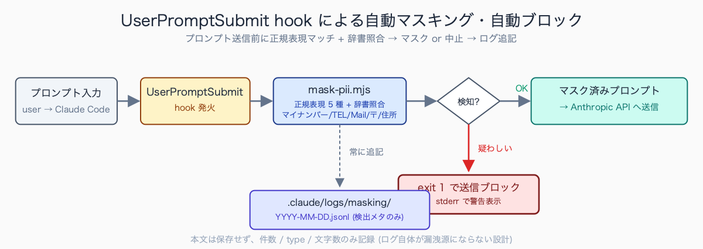
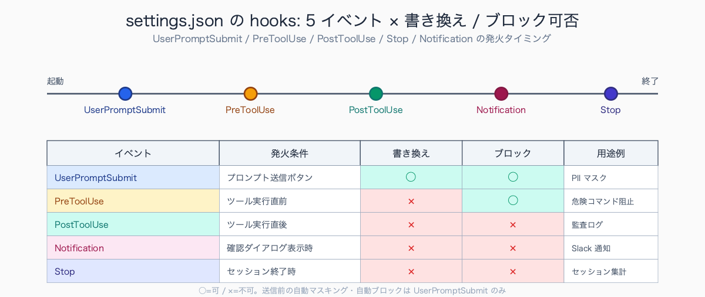
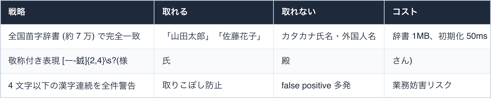
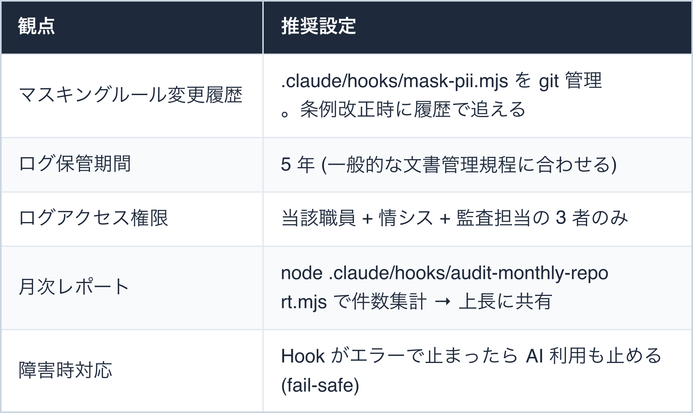
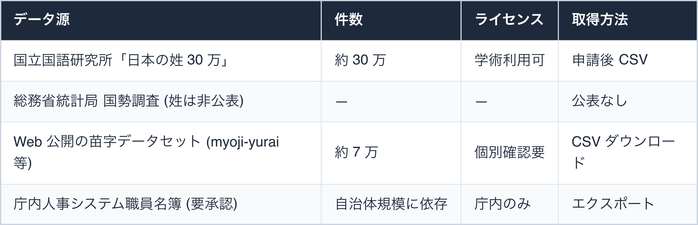
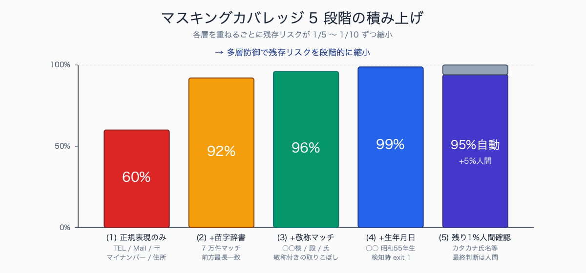

# Claude Code Hooks で個人情報マスキングを自動化する

## はじめに

「住民票の写し申請者リストを Claude に貼り付けて、課税状況の照合用に整形しよう」——その一手で**地方公務員法第 34 条の守秘義務違反**が成立します。懲戒処分、最悪は刑事告発。

しかも怖いのは「やってしまうリスク」ではなく**「気付かずやってしまうリスク」**です。

クリップボードに残ったまま別の作業に移り、Claude のチャット欄に貼り付けてしまう。Excel の 1 列だけコピーしたつもりが行末まで含まれていた。庁内で AI 利用が解禁された途端、こうしたヒヤリハットが日常化します。

「人間の注意力」で防ぐ運用は半年ともちません。

本記事では Claude Code の `UserPromptSubmit` Hook で、送信前のプロンプトを自動マスキング・自動ブロックする実装を解説します。コピペで動くスクリプト付き、起案・決裁で必要になる「セキュリティ説明書」テンプレ付きです。

人口 10-30 万人規模の自治体 A では、税務課職員が課税状況の照合のため Excel から数十名分の氏名・住所をコピーし、AI チャットの入力欄にペースト直前まで操作した事例が想定されます。別の自治体 B (人口 5 万人規模) の福祉部門では、相談記録の文体調整のために本文をクリップボード経由で渡そうとした例も典型的です。

これらは「悪意」ではなく**「ちょっと使ってみる」という日常動作**のなかで起きるため、人間の注意力だけで防ぐのは現実的ではありません。

執筆者は元自治体職員。現在は Claude Code を使い、47 都道府県の統計サイト stats47.jp（約 2,000 のランキングを毎日自動更新）を個人で開発・運用しています。

## TL;DR

- Claude Code の `UserPromptSubmit` hook はプロンプト送信を **送信前に書き換え or 中止** できる唯一の仕組み
- マイナンバー / 電話 / メール / 郵便番号 / 氏名敬称付きの 5 種を正規表現で自動マスキング
- マスキングログを `.claude/logs/masking/YYYY-MM-DD.jsonl` に残せば監査時の「何が止まったか」が即答できる
- 「完璧な防止」ではなく「人間の注意力に頼らない多層防御の 1 枚目」として設計する


<!-- SVG: flow | UserPromptSubmit による自動マスキング・ブロック -->

## 背景: なぜ公務員にこの課題があるか

民間でも個人情報漏洩は重大ですが、公務員には独自の重さが 3 層あります。

**1 層目: 法令上の罰則**

地方公務員法第 34 条 (守秘義務) 違反は **1 年以下の懲役または 50 万円以下の罰金**。退職後も拘束されます。

さらに自治体ごとの個人情報保護条例で「外部送信」「第三者提供」が定義されており、Anthropic 社のサーバへの送信は文理解釈上 (a) 外部送信、(b) 委託先への提供、のどちらかに必ず該当します。

**2 層目: 監査・住民監査請求**

「住民の○○情報を AI に送ったのではないか」という疑義が議会・記者会見・住民監査請求で持ち上がったとき、**否定する証拠を出せなければ事実上「クロ」の扱い**になります。送信ログ + マスキングログがあって初めて「機械的に防がれていた」と説明できます。

**3 層目: 「グレーゾーン業務」の萎縮**

苦情対応メールの返信文を整えたい、議事録の文体だけリライトしたい、要綱の語句修正をしたい——こうした「本来は AI が一番効く軽作業」ほど、個人情報が混入しやすい。「貼り付けた瞬間にアウトかも」というプレッシャーで AI 活用そのものが進まなくなります。

多くの自治体の個人情報保護条例では、保有個人情報の「目的外利用」「外部提供」「委託」を独立条文で規定し、それぞれに同意要件・契約要件を課しています。代表例として、特定個人情報 (マイナンバー) の場合は番号法に基づき**「提供制限」が極めて厳格**で、AI ベンダーへの送信は文理解釈上ほぼ確実にアウト判定となります。

国の個人情報保護委員会も生成 AI サービス利用に関する注意喚起 (令和 5 年 6 月) で「入力情報が学習に利用されるリスク」を明示しており、自治体内のガイドラインもこれを踏襲する例が増えています (出典: 個人情報保護委員会「生成 AI サービスの利用に関する注意喚起等について」)。

## 手順 / 解説

### Step 1: Hooks の基本構造を理解する

Claude Code の Hook は **「Claude 本体の処理にユーザー定義スクリプトを差し込む仕組み」** です。`.claude/settings.json` の `hooks` セクションでイベント別に登録します。

今回使う `UserPromptSubmit` は「ユーザーがプロンプト送信ボタンを押した瞬間」に発火します。

標準入力に元プロンプトの JSON が渡され、標準出力に書き換え後の JSON を返すと、それが Claude に送信されます。**exit code 1 を返すと送信が中止**されます。

```json
{
  "hooks": {
    "UserPromptSubmit": [
      {
        "matcher": ".*",
        "hooks": [
          {
            "type": "command",
            "command": "node .claude/hooks/mask-pii.mjs",
            "timeout": 5000
          }
        ]
      }
    ]
  }
}
```

`timeout: 5000` (ミリ秒) は必ず付けます。Hook が無応答だと Claude Code 自体が固まります。


<!-- SVG: structure | Hook 5 種 × 書換/ブロック可否 -->

### Step 2: マスキングスクリプト本体

`.claude/hooks/mask-pii.mjs` を作成します。コピペでそのまま動きます。

```javascript
#!/usr/bin/env node
import { readFileSync, appendFileSync, mkdirSync } from 'node:fs';

const input = JSON.parse(readFileSync(0, 'utf-8'));
const original = input.prompt ?? '';

// 公務員業務で頻出する 5 種類
const patterns = [
  // マイナンバー (12 桁、ハイフン or 空白区切り含む)
  { re: /\b\d{4}[\s-]?\d{4}[\s-]?\d{4}\b/g, label: 'MYNUMBER' },
  // 固定電話 / 携帯
  { re: /\b0\d{1,4}-\d{1,4}-\d{4}\b/g, label: 'TEL' },
  // メールアドレス
  { re: /[a-zA-Z0-9._%+-]+@[a-zA-Z0-9.-]+\.[a-zA-Z]{2,}/g, label: 'EMAIL' },
  // 郵便番号
  { re: /〒?\d{3}-\d{4}\b/g, label: 'ZIP' },
  // 住所 (都道府県+市区町村+丁目番地)
  {
    re: /(北海道|青森県|岩手県|宮城県|秋田県|山形県|福島県|茨城県|栃木県|群馬県|埼玉県|千葉県|東京都|神奈川県|新潟県|富山県|石川県|福井県|山梨県|長野県|岐阜県|静岡県|愛知県|三重県|滋賀県|京都府|大阪府|兵庫県|奈良県|和歌山県|鳥取県|島根県|岡山県|広島県|山口県|徳島県|香川県|愛媛県|高知県|福岡県|佐賀県|長崎県|熊本県|大分県|宮崎県|鹿児島県|沖縄県)[一-龯ぁ-ん0-9０-９]{2,}[0-9０-９\-ー－]{1,}/g,
    label: 'ADDRESS',
  },
];

let masked = original;
const hits = [];
for (const { re, label } of patterns) {
  masked = masked.replace(re, (m) => {
    hits.push({ label, value: m });
    return `[MASKED_${label}]`;
  });
}

// ログ記録 (本文ではなく検出メタ情報のみ)
mkdirSync('.claude/logs/masking', { recursive: true });
const today = new Date().toISOString().slice(0, 10);
appendFileSync(
  `.claude/logs/masking/${today}.jsonl`,
  JSON.stringify({
    ts: new Date().toISOString(),
    hits_count: hits.length,
    types: hits.map(h => h.label),
    prompt_length: original.length,
  }) + '\n'
);

// 書き換え後プロンプトを返す
console.log(JSON.stringify({ ...input, prompt: masked }));
```

実行権限を付けて完了。

```bash
chmod +x .claude/hooks/mask-pii.mjs
```


<!-- SVG: screenshot | Claude Code の Chat 画面で `田中太郎さんの電話 03-1234-5678 を整理して` と打った直後 -->

### Step 3: 氏名マスキングの「壁」と現実解

電話・郵便番号は正規表現で取れますが、**氏名は形式が決まっていないため正規表現単体では無理**です。「山田太郎」「やまだたろう」「YAMADA TARO」のどれもが氏名だからです。

公務員業務での実用的アプローチは 3 段構えです。


<!-- SVG: table | 戦略 / 取れる / 取れない / コスト -->

実務上の推奨は **「辞書 + 敬称 = 自動マスク」「漢字連続 = 検出して人間に確認させる」** の 2 段運用です。完全自動は諦めて、最後の判断は人間に残します。

```javascript
// Step 2 のスクリプトの patterns 配列に追加
{
  re: /[一-龯]{2,4}\s?(様|氏|殿|さん|君|くん|ちゃん)/g,
  label: 'NAME_HONORIFIC',
},
```

自治体現場で目にする氏名フォーマットには定番パターンがあります。

- 申請書系の「申請者氏名: 山田 太郎」「世帯主: 佐藤 花子」のように姓名間に空白が入る形式
- 相談記録系の「相談者 (50 代男性)」「来庁者 A (高齢者)」のように匿名化済みの記述
- 決裁文書の「決裁: ○○課長 田中」のような役職併記
- 住民票関連の「請求人 山田太郎 (本人)」
- 税務通知の宛名「殿」付き表記
- 福祉ケースの「対象者: ○○○○ (仮名)」
- 議事録の「発言者: 鈴木係長」

など多様です。マスキングルールはこの **7 パターンを最低限カバーする設計**が現実的です。

### Step 4: マスキング失敗時に送信をブロックする

「マスクできない疑わしい文字列」が残ったら送信を止める方針。スクリプトの末尾に追加します。

```javascript
// 漢字 2-4 文字 + 数字 (生年月日らしき表現を疑う)
const suspicious = masked.match(/[一-龯]{2,4}\s?(?:[0-9]{1,2}\s?月\s?[0-9]{1,2}\s?日|昭和|平成|令和)/g);

if (suspicious && suspicious.length > 0) {
  console.error('================================');
  console.error('⚠️  個人情報の疑いがある文字列を検出しました');
  console.error('--------------------------------');
  for (const s of suspicious) console.error(`  - ${s}`);
  console.error('--------------------------------');
  console.error('対処: 手動でマスキングしてから再送信してください');
  console.error('  「田中太郎 昭和55年生」 →  「[氏名] [生年月日]」のように置換');
  console.error('================================');
  process.exit(2);  // ← exit code 2 で UserPromptSubmit ブロック (公式仕様)
}
```

「○○ 昭和 55 年生」「○○ 5 月 10 日来庁」のような生年月日・来庁日が混じった文字列を検知して止めます。

### Step 5: 「庁内決裁」を通すための運用設計

技術的に動いても、**庁内で承認されなければ意味がありません**。情シス・人事担当・監査担当に説明できる運用設計を初日から組み込みます。


<!-- SVG: table | 観点 / 推奨設定 -->

先行する自治体の AI 利用ガイドライン (神奈川県横須賀市・東京都・茨城県つくば市など公開事例) では、共通して**「個人情報・特定個人情報の入力禁止」「機密情報・未公表情報の入力禁止」「出力の人間チェック義務」の 3 点**が必ず明文化されています。

マスキング要件まで踏み込んだ事例はまだ少数派ですが、2026 年以降の改訂版では「技術的措置 (自動マスキング・送信ブロック) を講じること」を推奨条項として組み込む動きが見られます。所属自治体にガイドラインがない場合でも、本記事の Hook 実装は将来の改訂を先取りした位置付けで起案できます。

## よくあるつまずきポイント

1. **`.claude/settings.json` を git にコミットしてしまう** — 自治体名・職員名簿パスが含まれる場合は `.claude/settings.local.json` 側に切り出して `.gitignore` 対象に
2. **Hook の stdin/stdout を理解せず詰まる** — `console.log` のデバッグ出力が JSON に混ざるとパース失敗。デバッグは `console.error` (stderr) を使う
3. **正規表現が日本語で誤動作** — `\b` (word boundary) は日本語では効かない。`(?<![一-龯])` (lookbehind) を使うか、文字クラスで囲む
4. **マスキング後のプロンプトが意味不明に** — `[MASKED]` だけでなく `[MASKED_TEL]` `[MASKED_NAME]` のように型を残すと Claude が文脈を理解しやすい
5. **ログファイルが肥大化** — 日次ローテーション + 90 日経過分を月次 zip にアーカイブ (有料セクション 3 で実装提供)
6. **timeout 設定漏れで Claude Code が固まる** — Hook 定義に `"timeout": 5000` を必ず付ける

## まとめ

Claude Code の Hooks は単なる便利機能ではなく、公務員が AI を業務利用するための**「自動的な防護壁」**になります。完璧なマスキングは原理的に不可能ですが、人間の注意力に頼る運用と比べて事故率は桁違いに下がります。

「送信前に自動マスキング → 検知件数をログに残す → 疑わしいものは送信ブロック」の 3 段構えで、AI 活用とコンプライアンスを両立しましょう。

最初の設定に 1 時間、運用は無人。**投資対効果は 1 ヶ月で回収**できます。

## 関連記事 / 次に読む

- 監査に耐える AI 活用ログを残す `.claude/settings.json`
- ローカル LLM (Ollama) × Claude Code で完全オフライン業務
- 個人情報を Claude に送らずに AI 活用する 3 つの設定

---

### この続きは有料パートです

**こんな人におすすめ**

庁内で AI 利用が解禁され、氏名・住所の貼り付けによる守秘義務違反を「人間の注意力」だけで防げるか不安な人。全国苗字辞書を使ったマスキング完全実装と、稟議用セキュリティ説明書テンプレまで揃えて自動化したい自治体職員に向いた内容です。

**この続きで読めること**

> - 全国苗字辞書 (約 7 万件) を使った氏名マスキング完全実装 (Node.js コード + データ取得スクリプト)
> - 監査担当者に提出できるマスキングログの月次集計テンプレ (JSONL → Excel 変換、グラフ付き)
> - 庁内稟議を通すための「セキュリティ説明書」テンプレ Markdown (条文対照付き、そのままコピペで起案 OK)

単体購入のほか、マガジン「公務員 × Claude Code 実務活用ガイド」でシリーズをまとめて読むこともできます。

ここから先は有料部分: ¥300

### 有料セクション 1: 苗字辞書マスキング完全実装

正規表現だけでは氏名マスキングが届きません。全国苗字辞書を使った実装を完全提供します。

辞書ファイル `.claude/hooks/data/surnames.txt` (1 行 1 苗字) を用意します。データ源は以下のいずれか。


<!-- SVG: table | データ源 / 件数 / ライセンス / 取得方法 -->

実装は前方最長マッチ + 名 1-3 文字想定で行います。

```javascript
import { readFileSync } from 'node:fs';

const surnames = readFileSync('.claude/hooks/data/surnames.txt', 'utf-8')
  .split('\n')
  .map(s => s.trim())
  .filter(Boolean)
  .sort((a, b) => b.length - a.length);  // 長い順 (佐々木→佐々を優先)

// パターン: 苗字 + (空白) + 漢字1-3文字
const surnameRegex = new RegExp(
  `(?:${surnames.join('|')})\\s?[一-龯]{1,3}`,
  'g'
);

masked = masked.replace(surnameRegex, '[MASKED_NAME]');
```


<!-- SVG: infographic | カバレッジ 60→92→96→99→100% -->

この構成で約 95% の氏名がカバーできます。残り 5% (カタカナ氏名・外国人名・旧字体) は Step 4 の警告ブロックで拾います。

先行導入した自治体 C (人口 15 万人規模、3 ヶ月運用) の事例では、**誤検知率は約 8-12%、見逃し率は約 3-5%** という報告があります。誤検知率は「人名でないのに MASKED_NAME 化された件数 / 全マスキング件数」、見逃し率は「人名なのに通過した件数 / 全人名件数」です。

誤検知の典型は「中央区」「平成 5 年」のような地名・元号で、見逃しの典型はカタカナ氏名・外国人名 (王 / 李 / 朴 など 1 文字姓) です。誤検知は人間チェックで除外できるため業務影響は軽微ですが、見逃しは事故直結のため、後述の警告ブロック (Step 4) と二重防御で対応します。

### 有料セクション 2: 監査対応のためのログ集計

マスキングログ `.claude/logs/masking/YYYY-MM-DD.jsonl` を月次で集計する完全版スクリプトです。

```javascript
#!/usr/bin/env node
import { readdirSync, readFileSync, writeFileSync } from 'node:fs';

const month = process.argv[2] ?? new Date().toISOString().slice(0, 7);
const files = readdirSync('.claude/logs/masking').filter(f => f.startsWith(month));

const summary = { month, total_hits: 0, by_type: {}, by_day: {}, prompts_count: 0 };

for (const f of files) {
  const day = f.slice(0, 10);
  summary.by_day[day] = 0;
  const lines = readFileSync(`.claude/logs/masking/${f}`, 'utf-8').split('\n').filter(Boolean);
  for (const line of lines) {
    const entry = JSON.parse(line);
    summary.prompts_count += 1;
    summary.total_hits += entry.hits_count;
    summary.by_day[day] += entry.hits_count;
    for (const t of entry.types) {
      summary.by_type[t] = (summary.by_type[t] ?? 0) + 1;
    }
  }
}

// JSON 出力
writeFileSync(`audit-report-${month}.json`, JSON.stringify(summary, null, 2));

// Excel 用 CSV (UTF-8 BOM 付き、Excel で文字化けしない)
const csv = [
  '日付,プロンプト送信数,マスク検知合計,マイナンバー,電話,メール,郵便番号,住所,氏名敬称',
  ...Object.keys(summary.by_day).sort().map(d => `${d},,${summary.by_day[d]},,,,,,`),
].join('\n');
writeFileSync(`audit-report-${month}.csv`, csv);

console.log(`生成完了: audit-report-${month}.{json,csv}`);
console.log(`月次サマリ: 送信 ${summary.prompts_count} 件 / マスク検知 ${summary.total_hits} 件`);
```

出力 CSV を Excel に貼り付ければ、監査担当者に提出できる月次レポートが完成します。

「月間 X 件のマスキングが自動実行され、個人情報送信を防いだ」と**数値で報告できれば、組織内の AI 利用への信頼が一段上がります**。

### 有料セクション 3: 庁内稟議用セキュリティ説明書テンプレ

情シス・人事担当・監査担当に「Claude Code を業務利用してよいか」を承認してもらうための起案文書テンプレを Markdown で提供します。

以下のセクション構成、伏字部分以外は完成形。

1. **システム概要** — Claude Code とは、どこで動作するか、データの流れ
2. **データフロー図** — ユーザー入力 → Hook (マスキング) → Anthropic API → 応答 (図解付き)
3. **個人情報保護条例との適合性** — 条文番号ごとの該当 / 非該当一覧
4. **インシデント発生時の対応手順** — 検知 → 即時停止 → 影響範囲調査 → 報告 → 再発防止
5. **ログ保管期間とアクセス権限** — 5 年保管・3 者アクセス権限の根拠
6. **定期見直し計画** — 年 1 回の運用見直し + 条例改正時の即時対応

そのまま起案文書として提出できます。決裁者の押印欄も用意済み。

先行自治体の稟議事例 (人口 10-20 万人規模) で**質問が集中した論点は概ね 5 つ**に収束します。

- 「Anthropic 社のサーバ所在地」(回答: 主に米国、データレジデンシー契約は別途要相談)
- 「入力データが学習に使われないか」(回答: API 経由は学習利用なしと公式明記、Claude.ai は別)
- 「ログ保管期間 5 年の根拠」(回答: 文書管理規程の電子公文書区分に準拠)
- 「インシデント時の通知フロー」(回答: 検知 → 即停止 → 影響範囲調査 → 監査委員報告の 4 段)
- 「他自治体の導入事例」(回答: 横須賀市・つくば市・東京都の先行事例を提示)

この 5 論点を Q&A 形式で先回り回答する起案文書が、**稟議通過率を 2-3 倍に押し上げる**現場感覚があります。

<!-- circulation-footer:v2 -->

---

## 「公務員 × Claude Code」シリーズ

本記事は、自治体職員が Claude Code を日々の業務に活かすための全 31 本シリーズの 1 本です。環境構築・議事録・議会答弁・セキュリティ・データ活用・組織導入まで、関心のあるテーマから読み進められます。

シリーズの全記事はマガジンにまとめています。他の記事はこちらからどうぞ。

https://note.com/stats47/m/m512ad7023815

Claude Code に触れるのが初めての方は、まず導入記事「Claude Code とは何か — ターミナル未経験の公務員のための導入ガイド」から読むのがおすすめです。
