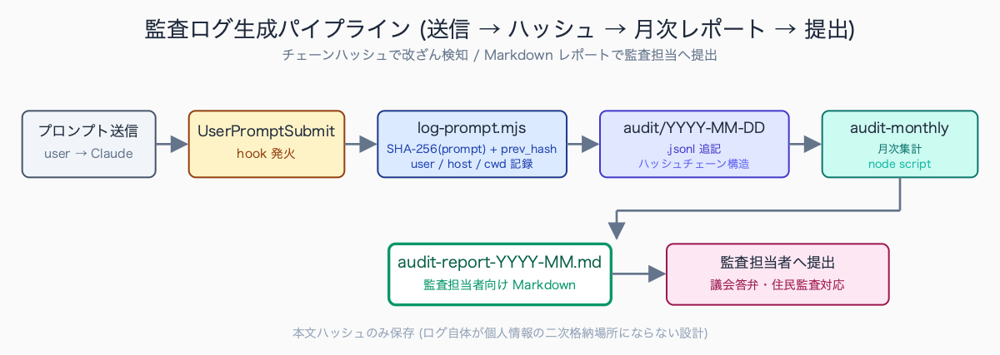
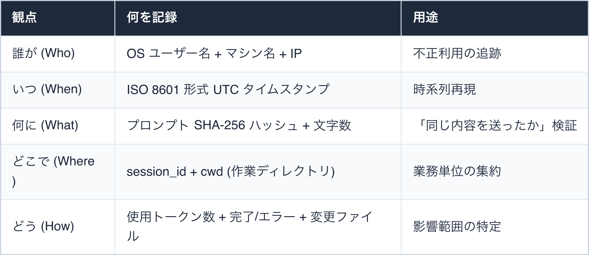
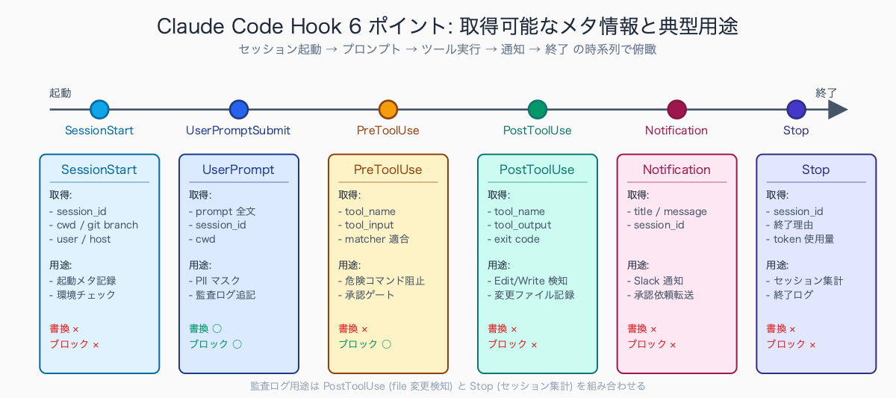
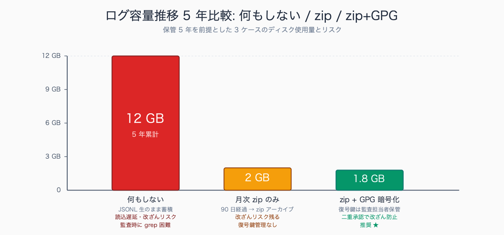

# 監査に耐える AI 活用ログを残す .claude/settings.json

## はじめに

「○○課が AI に住民情報を判断させたらしい」——議会の一般質問でこの一言が出た瞬間、**否定する証拠を出せない部署は実質「クロ」扱い**になります。口頭の「気をつけて使っていました」は通用しません。

公務員業務における AI 利用の最大のリスクは「情報漏洩」ではなく**「説明責任を果たせない」こと**です。たとえ実際に個人情報を送っていなくても、送っていないことを示すログがなければ、議会答弁・記者会見で押し切られて終わります。

Claude Code は `.claude/settings.json` の Hook 機構で**「誰が・いつ・何を・どう使ったか」を機械的に記録**できます。本記事では、内部監査・住民監査請求・議会答弁に耐える設定例を、コピペで動く実装と起案テンプレ付きで解説します。

監査委員事務局の指摘傾向として、人口 10-30 万人規模の自治体では「電子データの操作履歴が残っていない」「業務利用したツールの利用ログが個人 PC 内のみで管理者アクセス不可」という指摘が複数年連続で挙がる事例が想定されます。

住民監査請求の場面でも「AI らしきツールの利用有無」を問われるケースが 2025 年以降増えており、ログ非整備の部署は「実態調査」「再発防止計画書」の提出を求められる流れが定常化しています。

執筆者は元自治体職員。現在は Claude Code を使い、47 都道府県の統計サイト stats47.jp（約 2,000 のランキングを毎日自動更新）を個人で開発・運用しています。

## TL;DR

- `.claude/settings.json` の Hook で「プロンプト送信 / ファイル変更 / セッション終了」を自動ログ記録
- ログには **「実行者・日時・対象ファイル・プロンプトハッシュ・トークン消費数」** を残す (本文は残さない)
- 改ざん検知のため各ログエントリに **前エントリの SHA-256** を含める (チェーンハッシュ)
- 月次レポート自動生成スクリプトで「監査担当者が読める形式」に変換


<!-- SVG: flow | 送信→ハッシュ→月次レポート→提出 -->

## 背景: なぜ公務員にこの課題があるか

民間企業と決定的に違うのは「説明責任の不均衡」です。

**民間**: 経営陣の判断で開示範囲を絞れる。守秘契約・営業秘密の盾がある。
**公務員**: 住民監査請求 / 情報公開請求 / 議会の資料要求が来れば、原則としてすべて開示。

「AI に判断を任せた疑いがある」と問われた瞬間、**それを否定する技術的証拠 (= ログ) がなければ、住民・議会への説明責任を果たせません**。

加えて、自治体の情シス部門は AI 利用に保守的です。「うちでは AI 禁止」が多数派で、「条件付き OK」を勝ち取るには以下の 3 点を最低限揃える必要があります。

1. **ログが残ること** — 何を送ったかが後から検証可能
2. **マスキングがあること** — 個人情報の流出を機械的に止める
3. **管理者がアクセスできること** — 当該職員以外も検証可能

しかも公務員のログ保管期間は文書管理規程で 5 年〜永年とされがちで、「ログを残す」よりも**「肥大化せず、改ざんできず、必要なときに取り出せる」設計**が肝心です。

多くの自治体の文書管理規程では電子データを「行政文書ファイル」として扱い、業務記録は内容に応じて 1 年 / 3 年 / 5 年 / 10 年 / 永年の 5 区分で保管期間を設定します。AI 利用ログは「事務の経過に係る記録」または「電子計算機処理に係る経過情報」として **5 年保管に位置付ける運用が現実的**で、特に住民監査請求の出訴期間 (1 年) + 控訴期間を踏まえると 3 年未満は短すぎる扱いとなります。

永年保管は容量・コストが現実的でないため、5 年運用 + GPG 暗号化アーカイブが落としどころです。

## 手順 / 解説

### Step 1: 監査対応に必要な「4W1H」を定義する

監査で問われるのは概ね以下の 5 点。設計はこれらを必ず満たします。


<!-- SVG: table | 観点 / 何を記録 / 用途 -->

ポイントは **「プロンプト本文そのものは残さない」** こと。

本文を残すとログ自体が個人情報の二次格納場所になり、保管・廃棄の管理対象が増えます。

### Step 2: settings.json の hooks 定義

`.claude/settings.json` に 3 種類の Hook を登録します。

```json
{
  "hooks": {
    "UserPromptSubmit": [
      {
        "matcher": ".*",
        "hooks": [
          {
            "type": "command",
            "command": "node .claude/hooks/log-prompt.mjs",
            "timeout": 3000
          }
        ]
      }
    ],
    "Stop": [
      {
        "matcher": ".*",
        "hooks": [
          {
            "type": "command",
            "command": "node .claude/hooks/log-stop.mjs",
            "timeout": 3000
          }
        ]
      }
    ],
    "PostToolUse": [
      {
        "matcher": "Edit|Write|MultiEdit",
        "hooks": [
          {
            "type": "command",
            "command": "node .claude/hooks/log-file-change.mjs",
            "timeout": 3000
          }
        ]
      }
    ]
  }
}
```

3 段で「送信」「終了」「ファイル変更」を捕捉します。`PostToolUse` の matcher は正規表現で複数ツールを束ねられます。


<!-- SVG: structure | Hook 6 ポイントの時系列俯瞰 -->


<!-- SVG: screenshot | `.claude/settings.json` を VS Code で開いた状態で -->

### Step 3: log-prompt.mjs の実装

```javascript
#!/usr/bin/env node
import { readFileSync, appendFileSync, mkdirSync, existsSync } from 'node:fs';
import { createHash } from 'node:crypto';
import { hostname, userInfo } from 'node:os';

const input = JSON.parse(readFileSync(0, 'utf-8'));
const prompt = input.prompt ?? '';
const today = new Date().toISOString().slice(0, 10);
const logPath = `.claude/logs/audit/${today}.jsonl`;

mkdirSync('.claude/logs/audit', { recursive: true });

// 前エントリのハッシュを取得 (改ざん検知用)
function getPrevHash() {
  if (!existsSync(logPath)) return '0'.repeat(64);
  const lines = readFileSync(logPath, 'utf-8').trim().split('\n');
  if (lines.length === 0) return '0'.repeat(64);
  const last = lines[lines.length - 1];
  return createHash('sha256').update(last).digest('hex');
}

const entry = {
  ts: new Date().toISOString(),
  user: userInfo().username,
  host: hostname(),
  event: 'prompt_submit',
  session_id: input.session_id ?? null,
  cwd: input.cwd ?? process.cwd(),
  prompt_hash: createHash('sha256').update(prompt).digest('hex'),
  prompt_length: prompt.length,
  prev_hash: getPrevHash(),
};

appendFileSync(logPath, JSON.stringify(entry) + '\n');

// 元プロンプトはそのまま通過
console.log(JSON.stringify(input));
```

実行権限付与:

```bash
chmod +x .claude/hooks/log-prompt.mjs
```

### Step 4: 改ざん検知 — チェーンハッシュ

監査ログは**「あとから書き換えていない」ことも示せる必要**があります。各エントリに前エントリの SHA-256 を埋め込むことで、ブロックチェーン的に改ざん検知できます。

検証スクリプト `.claude/hooks/audit-verify.mjs`:

```javascript
#!/usr/bin/env node
import { readFileSync, readdirSync } from 'node:fs';
import { createHash } from 'node:crypto';

const month = process.argv[2] ?? new Date().toISOString().slice(0, 7);
const files = readdirSync('.claude/logs/audit')
  .filter(f => f.startsWith(month))
  .sort();

let prevHash = '0'.repeat(64);
let totalLines = 0, errors = 0;

for (const f of files) {
  const lines = readFileSync(`.claude/logs/audit/${f}`, 'utf-8').trim().split('\n');
  for (const [idx, line] of lines.entries()) {
    totalLines++;
    const entry = JSON.parse(line);
    if (entry.prev_hash !== prevHash) {
      console.error(`❌ ${f}:${idx + 1} ハッシュチェーン破断`);
      console.error(`  期待: ${prevHash.slice(0, 16)}...`);
      console.error(`  実際: ${entry.prev_hash.slice(0, 16)}...`);
      errors++;
    }
    prevHash = createHash('sha256').update(line).digest('hex');
  }
}

if (errors === 0) {
  console.log(`✓ ${totalLines} エントリ、改ざんなし`);
} else {
  console.error(`✗ ${errors} 件の改ざんを検出`);
  process.exit(1);
}
```

任意の行を編集すると、それ以降のチェーンが破綻して検知されます。

自治体の情報セキュリティポリシーでは「重要ログの完全性確保」が一般的に要求されており、総務省の「地方公共団体における情報セキュリティポリシーに関するガイドライン」(令和 5 年改定版) でも**「ログの改ざん検知措置」が推奨事項として明記**されています。

具体的措置として WORM (Write Once Read Many) 媒体への保存、デジタル署名、ハッシュチェーンの 3 方式が例示されており、本記事のチェーンハッシュ実装はこのうち第三の方式に該当します。庁内 NAS への日次バックアップを併用すれば、改ざん検知 + 物理的喪失対策の両立が低コストで実現できます。

### Step 5: 月次レポート自動生成

JSONL のままでは監査担当者が読めません。Markdown 月次レポートを自動生成します。

```javascript
#!/usr/bin/env node
import { readdirSync, readFileSync, writeFileSync } from 'node:fs';

const month = process.argv[2] ?? new Date().toISOString().slice(0, 7);
const entries = readdirSync('.claude/logs/audit')
  .filter(f => f.startsWith(month))
  .flatMap(f => readFileSync(`.claude/logs/audit/${f}`, 'utf-8')
    .trim().split('\n').filter(Boolean).map(JSON.parse));

const promptCount = entries.filter(e => e.event === 'prompt_submit').length;
const fileChanges = entries.filter(e => e.event === 'file_change').length;
const stops = entries.filter(e => e.event === 'session_stop').length;

const byUser = entries.reduce((acc, e) => {
  acc[e.user] = (acc[e.user] ?? 0) + 1;
  return acc;
}, {});

const byDay = entries.reduce((acc, e) => {
  const d = e.ts.slice(0, 10);
  acc[d] = (acc[d] ?? 0) + 1;
  return acc;
}, {});

const report = `# AI 活用ログ月次レポート (${month})

## サマリ
- プロンプト送信回数: ${promptCount}
- ファイル変更回数: ${fileChanges}
- セッション終了回数: ${stops}
- 総ログエントリ: ${entries.length}

## ユーザー別利用回数
${Object.entries(byUser).sort((a, b) => b[1] - a[1])
  .map(([u, c]) => `- ${u}: ${c} 回`).join('\n')}

## 日別利用件数
${Object.entries(byDay).sort().map(([d, c]) => `- ${d}: ${c} 件`).join('\n')}

## 改ざん検知結果
\`node .claude/hooks/audit-verify.mjs ${month}\` の実行結果を確認してください。

## ログ保管場所
- 元データ: \`.claude/logs/audit/\`
- アーカイブ: \`.claude/logs/audit/archive/${month}.zip\` (月末自動生成)
`;

writeFileSync(`audit-report-${month}.md`, report);
console.log(`生成完了: audit-report-${month}.md`);
```

毎月 1 日に launchd / cron で自動実行 → 上司にメール送付、までを定型化します。

## よくあるつまずきポイント

1. **ログにプロンプト本文をそのまま残す** — 個人情報含有時にログ自体が漏洩源になる。ハッシュのみ保存が原則
2. **ログ保管がローカルディスクのみ** — PC 故障で消失。庁内ファイルサーバまたは外付け SSD に日次バックアップ
3. **改ざん検知の仕組みがない** — 単純な追記ログでは「不都合な行を削除」が物理的に可能。チェーンハッシュ必須
4. **監査担当者が読めない** — JSONL は人間可読でない。Markdown 月次レポートを併存
5. **Hook の `timeout` 漏れで Claude Code が固まる** — 必ず `"timeout": 3000` 等を指定
6. **`.claude/settings.json` のスキーマ変更追従漏れ** — Claude Code のバージョンアップで Hook 仕様が変わる。月 1 で公式ドキュメント確認

## まとめ

監査対応はトラブル発生後に慌てて整備するものではなく、**AI 利用を始めた最初の日に組み込むもの**です。Claude Code の `.claude/settings.json` + Hook 機構を使えば、業務効率を 1 ミリも落とさずに監査可能性を担保できます。

「ログがあるから安心して使える」という組織文化を作ることが、長期的な AI 活用の鍵です。本記事の設定を **1 時間で導入**し、初日から「議会で問われても答えられる」状態を構築しましょう。

## 関連記事 / 次に読む

- Claude Code Hooks で個人情報マスキングを自動化する
- ローカル LLM (Ollama) × Claude Code で完全オフライン業務
- 自治体 IT 担当に渡せる Claude Code セキュリティ説明資料

---

### この続きは有料パートです

**こんな人におすすめ**

AI 利用について「説明責任を果たせる証拠」を残せておらず、議会答弁や監査で押し切られるリスクを感じている人。改ざん検知込みの完全版スクリプトと、監査担当者向け説明テンプレまで揃えて監査に耐える設定を整えたい自治体職員に向いた内容です。

**この続きで読めること**

> - 改ざん検知 + 集計レポート完全版スクリプト一式 (コピペで動く、エラー処理込み)
> - 監査担当者向け「ログの読み方」説明テンプレ Markdown (条文対照付き)
> - ログ肥大化対策: 90 日ローテーション + GPG 暗号化アーカイブ実装 (launchd / cron 設定込み)

単体購入のほか、マガジン「公務員 × Claude Code 実務活用ガイド」でシリーズをまとめて読むこともできます。

ここから先は有料部分: ¥300

### 有料セクション 1: 完全版スクリプト一式

無料部分は最小限のサンプルでした。実運用で必要な以下を統合した完成版を提供します。

- **エラー時の自動フォールバック** — ログ書き込み失敗で AI 利用そのものをブロックしない fail-open 設計
- **ログファイル破損検知** — 起動時のチェーンハッシュ全件検証 (verify-on-startup)
- **並行実行時の競合回避** — `proper-lockfile` でファイルロック
- **PII 検知連携** — マスキング Hook (記事 11) と連動し、検知件数も監査ログに含める

ファイル一式 (約 250 行):

```
.claude/hooks/
  log-prompt.mjs       # プロンプト送信ログ (完全版)
  log-stop.mjs         # セッション終了ログ
  log-file-change.mjs  # Edit/Write 検知ログ
  audit-verify.mjs     # チェーンハッシュ検証
  audit-monthly.mjs    # 月次レポート生成
  audit-archive.mjs    # アーカイブ + 暗号化
```

実行例:

```bash
# 月次レポート生成
node .claude/hooks/audit-monthly.mjs 2026-05

# ハッシュチェーン全件検証
node .claude/hooks/audit-verify.mjs 2026-05

# 90 日経過分をアーカイブ (cron で月初実行推奨)
node .claude/hooks/audit-archive.mjs --older-than 90
```

### 有料セクション 2: 監査担当者向け説明テンプレ

監査委員事務局・内部監査担当に「ログの読み方」を教える説明書を Markdown で提供します。専門用語ゼロで、JSONL の各フィールドが何を意味するかを 1 ページに圧縮しています。

主要セクション:

1. **ログファイルの場所と命名規則** — どこに何があるか
2. **1 エントリの読み方** — フィールド一覧表 (人間語で)
3. **ハッシュチェーンによる改ざん検知の原理** — 比喩を使った図解
4. **「特定の日に何が行われたか」を調べる手順** — `jq` コマンド例 5 種
5. **インシデント発生時の保全手順** — 検知 → 保全 → 報告のフロー
6. **想定 Q&A 20 問** — 監査担当者の典型的な疑問に先回り

先行自治体の監査担当者との意見交換事例では、**伝わりやすかった説明と伝わりにくかった説明にはっきりした傾向**があります。

伝わりやすかったのは次の 3 つです。

- JSONL の 1 エントリを Excel 表 1 行に見立てた図解
- ハッシュチェーンを「印鑑の連続割印」に例えた比喩
- 「特定の日付の利用状況を 3 分で抽出するデモ」

伝わりにくかったのは次の 3 つです。

- SHA-256 アルゴリズムの数学的説明
- JSON 形式のテキスト直貼り
- 「fail-open / fail-close」のような英語混じり概念

説明書は「コマンドラインを触らない担当者」を前提に、画像と日本語の比喩を最大限活用する設計が定石です。

### 有料セクション 3: ログ肥大化対策

5 年保管を前提とすると、ログは確実に GB 級になります。以下の対策一式を組み合わせます。


<!-- SVG: infographic | ログ容量 5 年比較 3 ケース -->

1. **90 日経過分は月単位 zip にアーカイブ**
2. **アーカイブ時に GPG 公開鍵で暗号化** — 秘密鍵は監査担当者が保管 (二重承認)
3. **オリジナル jsonl は安全削除** — `shred` コマンド使用
4. **アーカイブインデックス維持** — `.claude/logs/audit/archive/index.json` で月別・件数・暗号化ハッシュを記録

完全な実装スクリプトと、launchd (Mac) / cron (Linux) / タスクスケジューラ (Windows) で日次自動実行する設定例を含めます。

<!-- circulation-footer:v2 -->

---

## 「公務員 × Claude Code」シリーズ

本記事は、自治体職員が Claude Code を日々の業務に活かすための全 31 本シリーズの 1 本です。環境構築・議事録・議会答弁・セキュリティ・データ活用・組織導入まで、関心のあるテーマから読み進められます。

シリーズの全記事はマガジンにまとめています。他の記事はこちらからどうぞ。

https://note.com/stats47/m/m512ad7023815

Claude Code に触れるのが初めての方は、まず導入記事「Claude Code とは何か — ターミナル未経験の公務員のための導入ガイド」から読むのがおすすめです。
