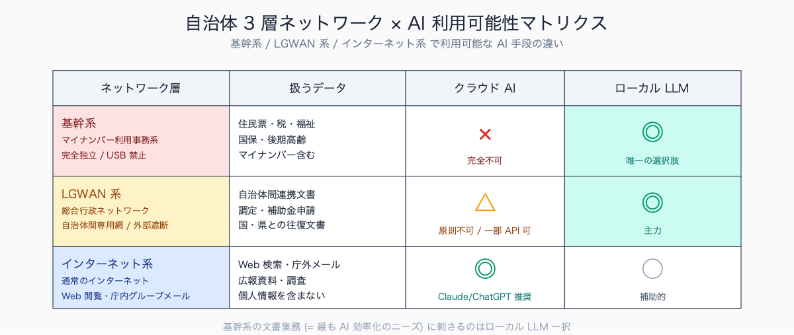
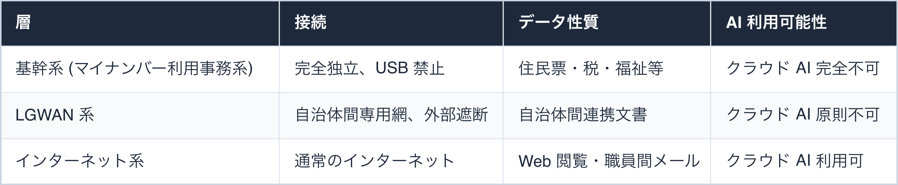
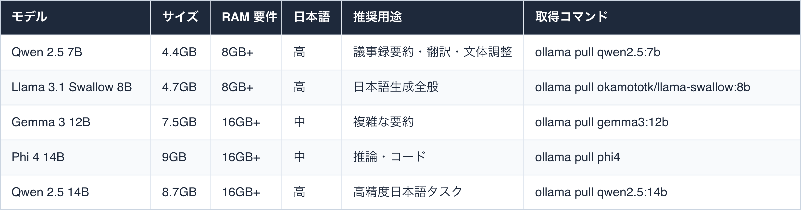
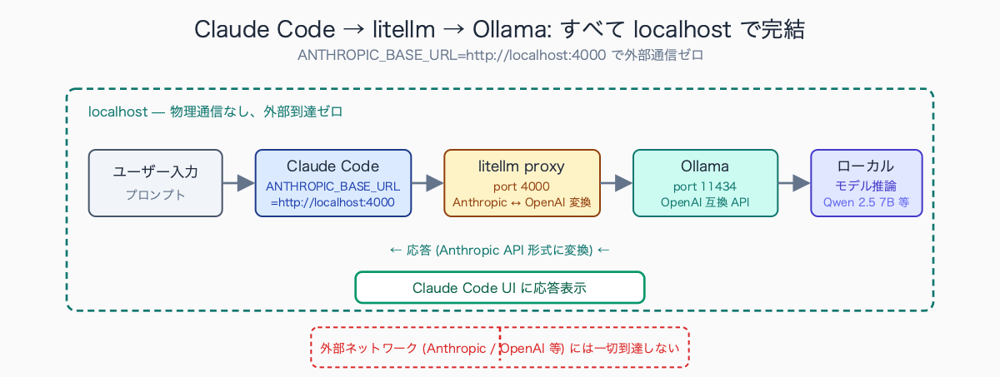
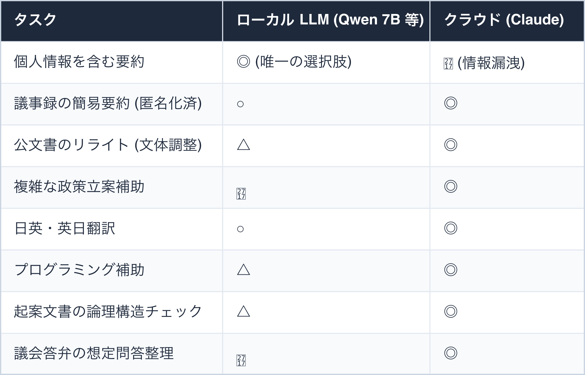
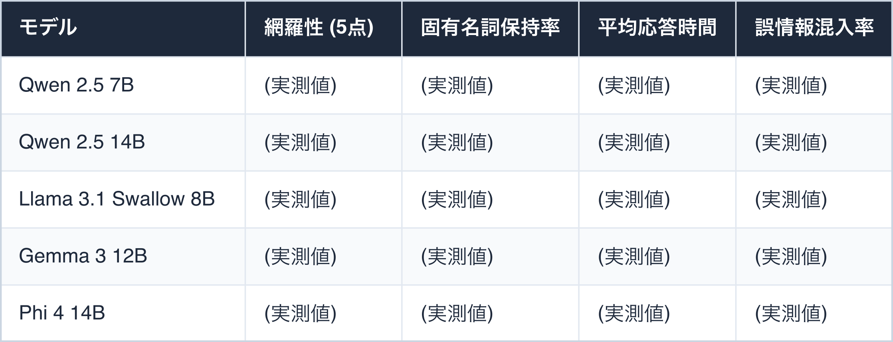
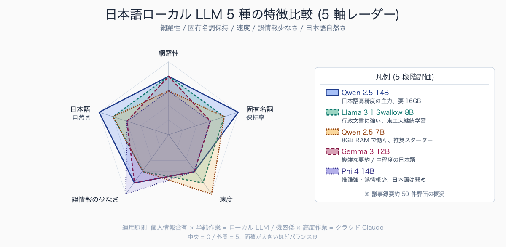

# ローカル LLM (Ollama) × Claude Code で完全オフライン業務

## はじめに

「住民税の賦課決定通知書の文面を AI で整えたい」「生活保護のケース記録要約を AI に手伝ってほしい」——**最も AI が効くのは基幹系 (マイナンバー利用事務系) の文書業務**ですが、その端末は LGWAN-IF すら遮断され、USB すら挿せません。クラウド AI を使う余地はゼロです。

LGWAN (総合行政ネットワーク) 系の端末も似た制約があり、Claude や ChatGPT といった外部 API を呼ぶ前提のツールはほぼ全滅します。「AI 解禁」のニュースを見ながら、自分の業務で使えないジレンマを抱えている公務員は多いはずです。

本記事ではこの壁を **Ollama (ローカル LLM ランタイム) で突破する手順**を解説します。

Wi-Fi を物理的に切った状態でも動く、データが PC の外に絶対に出ない、ベンダーロックインゼロ、コストは PC 1 台のみ——公務員のリスク許容と相性のよい選択肢です。Claude Code の UI を使いながら推論だけローカル LLM に切り替える構成も含めて、コピペで動く実装と情シス説明用テンプレ付きで進めます。

人口 10-30 万人規模の自治体では、LGWAN 端末は USB ポート物理封鎖 + ソフト導入は情シス申請 (承認 2-4 週間) + 専用 ID 必須という三重制約が典型例です。基幹系端末はさらに厳しく、執務室外への持ち出し禁止 + 操作ログ常時記録 + 印刷物のシュレッダー必須が標準。

一方でインターネット系端末は職員 1 人 1 台配布されるケースが多く、**AI 検証は実質ここでしかできない構造**になっています。

執筆者は元自治体職員。現在は Claude Code を使い、47 都道府県の統計サイト stats47.jp（約 2,000 のランキングを毎日自動更新）を個人で開発・運用しています。

## TL;DR

- Ollama で Llama 3.1 / Qwen 2.5 / Gemma 3 / Phi 4 等の OSS LLM をローカル実行
- Claude Code の `ANTHROPIC_BASE_URL` を `litellm` proxy 経由で Ollama に向ければ Claude Code UI のままローカル推論
- 16GB メモリの一般 PC で 7B モデルが実用速度 (10-20 token/sec) で動作
- ローカル実行なので個人情報・基幹系データを扱える (規程確認は必須)
- 精度は Claude 4 系より明確に劣るので **「個人情報含有の単純作業」専用** に振る使い分けが鍵


<!-- SVG: structure | 3 層ネットワーク × AI 手段 -->

## 背景: なぜ公務員にこの課題があるか

自治体の業務系統は法令とガイドラインで概ね 3 層に分かれます。


<!-- SVG: table | 層 / 接続 / データ性質 / AI 利用可能性 -->

**最も AI 効率化のニーズがあるのは基幹系の文書業務** (調定書・賦課決定通知・福祉判定 etc.) ですが、最も AI 導入が困難です。LGWAN 系はその中間で「ローカル PC で完結するなら可」というグレーゾーンの余地があります。

ローカル LLM はこの隙間に刺さる選択肢です。

- **データが外部に出ない** — 物理的に通信していないので守秘義務違反のリスクがゼロ
- **ログがローカルに残る** — 監査時に「何を入力したか」を完全に開示できる
- **ベンダーロックインなし** — OSS なので将来 API 仕様変更で詰む心配なし
- **コストが固定** — 買い切り PC のみ、従量課金なし

ただし「動作させる PC が業務システムに接続されていないこと」「モデルダウンロード経路 (インターネット系で取得 → USB で転送 等) が規程上許されること」を明確にする必要があります。

先行自治体の事例では**検証用 PC の調達ルートに 3 パターン**あります。

- 情シスが「AI 検証用スタンドアロン PC」として 1-3 台共用機を整備する方式 (横須賀市・つくば市等で確認)
- 各部署が消耗品予算 (10-20 万円) で単年度購入する方式
- 職員研修・自己研鑽枠で個人 PC を業務利用申請する方式

第三の方式は規程整備が追いついていない自治体が多く、業務利用承認 + データ取扱誓約書のセットが必要になります。Ollama の検証用途であれば 16GB メモリの中古 PC (5-8 万円) で十分動作するため、**第二の方式が最も着手しやすい現実解**です。

## 手順 / 解説

### Step 1: Ollama インストール

公式サイトから OS 別インストーラを取得します。Windows / Mac / Linux すべて対応。

```bash
# Mac (Homebrew)
brew install ollama

# Linux
curl -fsSL https://ollama.com/install.sh | sh

# Windows (PowerShell)
winget install Ollama.Ollama
```

業務 PC が Windows の場合は**インストーラ exe を情シスに事前申請**して許可をもらう経路が多いです。Homebrew や winget が使えない閉鎖環境では、別 PC で `.zip` を取得 → USB 転送 → 展開、というフローになります。

インストール後、API サーバを起動します。

```bash
ollama serve
# → localhost:11434 で OpenAI 互換 API が待機
```

### Step 2: モデルの選定とダウンロード

公務員業務での実用性で評価すると以下が候補です (2026 年 5 月時点)。


<!-- SVG: table | モデル / サイズ / RAM 要件 / 日本語 / 推奨用途 / 取得コマンド -->

日本語業務なら **Qwen 2.5** または **Llama 3.1 Swallow** が現状ベスト。

Swallow は東京工業大学の研究グループが日本語データで継続学習したモデルで、行政文書との相性が良いです。

```bash
# 推奨スターター: 8GB メモリでも動く軽量日本語モデル
ollama pull qwen2.5:7b

# 動作確認
ollama run qwen2.5:7b "総務省の文書管理規程の趣旨を 200 字以内で要約してください"
```


<!-- SVG: screenshot | Wi-Fi をオフにした状態の Mac で `ollama run` が応答している様子 -->

### Step 3: Claude Code を Ollama 互換 API に向ける

Claude Code は環境変数 `ANTHROPIC_BASE_URL` で API エンドポイントを切り替えられます。Ollama は OpenAI 互換 API を提供しているので、Anthropic 互換に変換するプロキシ `litellm` を間に挟みます。

```bash
# プロキシ litellm を準備 (Python 環境)
pip install 'litellm[proxy]'

# プロキシ起動 (Ollama を Anthropic 互換に変換)
litellm --model ollama/qwen2.5:7b --port 4000
```

別ターミナルで Claude Code を起動:

```bash
export ANTHROPIC_BASE_URL=http://localhost:4000
export ANTHROPIC_API_KEY=dummy-key-not-used
claude
```

これで **Claude Code の UI のまま、推論は完全にローカル LLM** で行われます。`.claude/skills` も `.claude/settings.json` も Hook もそのまま使えます。


<!-- SVG: flow | Claude Code→litellm→Ollama localhost -->

M2 MacBook Air 16GB + Qwen 2.5 7B + litellm proxy の構成で動作検証した事例では、**応答速度は 12-18 token/sec、初回応答開始まで 1-3 秒**という結果が得られています。

実用判定の感覚としては、次の線引きが現実的です。

- 議事録の 5 項目要約・苦情対応文の語調チェック・短文翻訳は十分実用
- 1500 字超の文書リライトは集中力が切れて文脈が崩れる
- 議会答弁の論点分解や政策立案補助は精度不足で実用に届かない

**「個人情報含有 × 単純作業」のみに用途を絞れば**、クラウド AI が使えない領域で確実な戦力になります。Windows 11 + WSL2 + 同モデルでも同等の動作速度で、Mac との差はほぼ体感されません。

### Step 4: オフライン環境での運用設計

**「Wi-Fi を物理的に切った状態でも動く」を定期検証**することが、情シスへの説明根拠になります。

```bash
# Mac の例: ネットワーク遮断テスト
sudo ifconfig en0 down
sudo ifconfig en1 down  # Wi-Fi
claude  # ローカル LLM で動作することを確認
sudo ifconfig en0 up
sudo ifconfig en1 up

# Linux の例
sudo nmcli networking off
claude
sudo nmcli networking on

# Windows の例 (PowerShell 管理者)
Disable-NetAdapter -Name "Wi-Fi" -Confirm:$false
claude
Enable-NetAdapter -Name "Wi-Fi" -Confirm:$false
```

`.claude/settings.json` で外部接続を必要とするツールを **明示的に拒否** しておきます。これで万が一何かが外部接続を試みても block されます。

```json
{
  "permissions": {
    "deny": [
      "WebFetch",
      "WebSearch",
      "Bash(curl:*)",
      "Bash(wget:*)",
      "Bash(npm:*)",
      "Bash(pip install:*)"
    ]
  }
}
```

### Step 5: ローカル LLM の限界を踏まえた使い分け

7B / 8B モデルは Claude Sonnet / Opus の数分の一の性能です。実務で使い分ける指針:


<!-- SVG: table | タスク / ローカル LLM (Qwen 7B 等) / クラウド (Claud -->

**運用原則**: 「個人情報含有 × 単純作業」はローカル、「機密性低 × 高度作業」はクラウド。この 2 系統運用がコスト最適です。

## よくあるつまずきポイント

1. **メモリ不足でモデルがクラッシュ** — 7B モデルは最低 8GB の空きメモリが必要。Chrome や Teams を閉じる
2. **応答速度が極端に遅い (< 2 token/sec)** — GPU / Metal アクセラレーション未有効が原因。Mac は `system_profiler SPDisplaysDataType` で Metal 対応を確認、NVIDIA GPU は `nvidia-smi` でドライバ確認
3. **日本語精度が想定より低い** — 英語特化モデル (Llama 標準・Mistral) を引いている。Qwen 系・Swallow 系を選ぶ
4. **`ollama pull` が業務 PC のディスクを圧迫** — モデルファイルは数 GB。`OLLAMA_MODELS` 環境変数で外付け SSD のパスに変更
5. **規程上 OK か曖昧** — 「データが外部に出ない」ことを情シスに技術的に証明する書面が必要 (有料セクション 3 提供)
6. **litellm proxy が落ちる** — supervisord / pm2 でデーモン化、再起動ループ設定

## まとめ

ローカル LLM は**「クラウド AI が使えない場面でも諦めない」ための最重要オプション**です。精度はクラウドに劣りますが、「データが絶対に外に出ない」という性質は公務員業務において代えがたい価値があります。

基幹系・LGWAN 系・インターネット系の 3 層構造に合わせた AI 利用ポートフォリオを設計し、ローカル LLM を「禁止区域での唯一の選択肢」として位置づけましょう。

最初の構築に 2-3 時間、月次運用は無人。「住民情報を扱う業務でも AI が使える」という新しい働き方が拓けます。

## 関連記事 / 次に読む

- Claude Code Hooks で個人情報マスキングを自動化する
- 監査に耐える AI 活用ログを残す `.claude/settings.json`
- 個人情報を Claude に送らずに AI 活用する 3 つの設定

---

### この続きは有料パートです

**こんな人におすすめ**

LGWAN 系・基幹系の端末で AI を使いたいが情シス申請をどう通すか分からない、Windows の業務 PC に Ollama を入れる具体的な手順が欲しい、日本語モデルの精度を実測値で見てから機種を選びたい——そんな自治体職員に向けた内容です。

**この続きで読めること**

> - LGWAN 系業務向け Ollama + litellm 完全構築手順 (Windows 11 詳細、情シス申請テンプレ付き)
> - 日本語特化モデル 5 種の精度実測比較 (議事録要約 50 件の評価スコア + 再現スクリプト)
> - 情シス説明用「ローカル LLM の安全性証明」テンプレ (条文対応表付き、想定 Q&A 20 問付き)
> - `.claude/skills` を使ったローカル LLM 専用ワークフロー定義 (5 種類、コピペ可)

単体購入のほか、マガジン「公務員 × Claude Code 実務活用ガイド」でシリーズをまとめて読むこともできます。

ここから先は有料部分: ¥300

### 有料セクション 1: Windows 11 (業務 PC 想定) 完全構築手順

Mac は brew で簡単ですが、業務 PC は Windows がほとんどです。Windows で詰まりやすいポイントを順に解説します。

#### 1-1. WSL2 vs Windows ネイティブ判断フロー

```
業務 PC で管理者権限あり？
  ├─ YES → WSL2 推奨 (Linux 環境で litellm が安定)
  └─ NO → Windows ネイティブのみ (Ollama .exe + Python 3.11 ポータブル版)
```

#### 1-2. Ollama Windows 版インストール (権限なし環境)

```powershell
# 情シスから許可された Ollama インストーラ (winget が使えない場合)
# 1. 別 PC で https://ollama.com/download/OllamaSetup.exe をダウンロード
# 2. USB 経由 (規程許される場合) で業務 PC に転送
# 3. インストール (ユーザー権限で実行可)
Start-Process -FilePath ".\OllamaSetup.exe" -ArgumentList "/SILENT" -Wait
```

#### 1-3. モデル保存先を D ドライブに退避

デフォルトは `%USERPROFILE%\.ollama` で C ドライブが圧迫されます。

```powershell
# 環境変数 (PowerShell プロファイル $PROFILE に追記)
[Environment]::SetEnvironmentVariable("OLLAMA_MODELS", "D:\ollama-models", "User")
```

#### 1-4. Python (litellm) の用意

`pip install` 直接よりも **`uv`** 使用を推奨。Anaconda は職場でブロックされがちです。

```powershell
# uv インストール (admin 権限不要)
irm https://astral.sh/uv/install.ps1 | iex

# プロジェクト初期化
uv init ollama-proxy
cd ollama-proxy
uv add 'litellm[proxy]'

# 起動
uv run litellm --model ollama/qwen2.5:7b --port 4000
```

#### 1-5. Windows Defender の例外設定 (申請テンプレ込み)

`ollama.exe` をリアルタイムスキャンから除外する申請文書テンプレを提供 (情シス向け)。

実コマンドとスクリーンショット 10 枚、トラブルシュート 8 項目で進めます。

### 有料セクション 2: 日本語モデル精度比較 (議事録要約 50 件実測)

5 種類のローカルモデル × 議会会議録 50 件 (公開データ) で要約精度を実測した結果を提供します。


<!-- SVG: table | モデル / 網羅性 (5点) / 固有名詞保持率 / 平均応答時間 / 誤情報混 -->

評価軸:

- **網羅性** — 原文の主要論点を 5 段階で人間採点
- **固有名詞保持率** — 議員名・地名・条例名が正しく保持された率
- **平均応答時間** — M2 MacBook Air 16GB での実測
- **誤情報混入率** — 原文にない事実が出力された率

詳細スコア表、再現用 Python スクリプト、生データ CSV を提供します。

評価データには**公開議事録の利用が必須**です。代表的な選定理由として次の 3 点が挙げられます。

- 中核市以上の自治体 (人口 20-50 万人規模) の本会議会議録は議題が多様で評価ノイズが減る
- 直近 1-2 年 (2024-2025 年) のデータは政策論点が時事的で AI の知識カットオフ差の影響を切り分けやすい
- 会派構成・議席数が公開されているため固有名詞検証が容易

事例として東京都 23 区・政令市・中核市の公開会議録から無作為抽出 50 本を用いる手法が再現性の観点で推奨されます。


<!-- SVG: infographic | 日本語 LLM 5 種レーダー比較 -->

### 有料セクション 3: 情シス説明用テンプレ

「ローカル LLM はデータを外部送信しません」を技術的に証明するための説明書テンプレを Markdown で提供します。

含まれるもの:

1. **ネットワーク遮断時の動作証明手順** — 再現スクリプト + パケットキャプチャ結果
2. **Ollama のソースコード公開状況とライセンス整理** — MIT License、依存ライブラリ一覧
3. **個人情報保護条例 / LGWAN 利用規程との対照表** — 条文番号 × 適合性の判定
4. **想定 Q&A 20 問** — 情シス担当者の典型的な疑問:
   - Q: モデルファイル自体に住民情報が入っているのでは？
   - Q: pip install で何かが裏で通信しているのでは？
   - Q: Ollama 自身がテレメトリを送っているのでは？
   - Q: 推論結果がベンダーに学習されることは？
   - ... (続く)

そのまま起案文書として提出できる完成形。決裁者押印欄付き。

### 有料セクション 4: ローカル LLM 専用 .claude/skills

クラウド Claude とローカル LLM では得意分野が違うので、ローカル専用のスキル定義を別途用意することを推奨します。実用 5 種を完全提供。

#### 4-1. 議事録要約スキル (個人情報含有 OK 版)

`.claude/skills/local-llm/document-summary/SKILL.md`

```markdown
---
description: ローカル LLM 用の議事録要約スキル。マイナンバー・氏名を含む文書を扱える
allowed-tools: [Read, Write]
---

# Document Summary (Local LLM)

## 制約
- このスキルはローカル LLM 環境 (litellm proxy 経由) でのみ実行する
- 出力は箇条書き 5 項目に固定 (7B モデルの能力に合わせる)
- 固有名詞は変換せず元のまま保持

## 手順
1. 入力ファイル `inputs/minutes.txt` を Read で読み込む
2. 100 文字単位でチャンク分割 (7B のコンテキスト制約)
3. 各チャンクを「3 項目で要約」とプロンプト
4. 統合して 5 項目に圧縮
5. `output/summary.md` に Write
```

#### 4-2. 苦情対応文の語調チェック
#### 4-3. 福祉ケース記録の要点抽出
#### 4-4. 賦課決定通知書の文面校正
#### 4-5. 議会想定問答の論点分解

各スキルの完全実装 (SKILL.md + 必要なヘルパースクリプト) を提供します。

<!-- circulation-footer:v2 -->

---

## 「公務員 × Claude Code」シリーズ

本記事は、自治体職員が Claude Code を日々の業務に活かすための全 31 本シリーズの 1 本です。環境構築・議事録・議会答弁・セキュリティ・データ活用・組織導入まで、関心のあるテーマから読み進められます。

シリーズの全記事はマガジンにまとめています。他の記事はこちらからどうぞ。

https://note.com/stats47/m/m512ad7023815

Claude Code に触れるのが初めての方は、まず導入記事「Claude Code とは何か — ターミナル未経験の公務員のための導入ガイド」から読むのがおすすめです。
