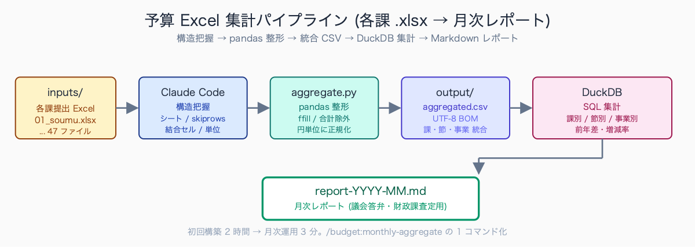
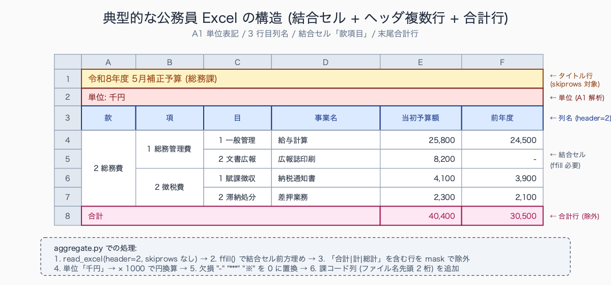

# Excel 予算ファイルを Claude Code で集計 (pandas / DuckDB 経由)

## はじめに

10 月の概算要求、12 月の財政課査定、2 月の議会提出資料、3 月の補正予算、5 月の出納整理——財政課・予算担当の年間スケジュールは「Excel 集計の波」の連続です。

各課が提出してくる予算要求書は様式が統一されていてもフォーマットが微妙に違います。事業数で行が増減し、合計行の位置が課ごとに変わる、結合セルが多用されている、「款項目節」の階層が独自の階層数になっている——VLOOKUP も SUMIF も効かない「公務員あるある」Excel が集まり、財政課職員が一つひとつ手作業で集約していく。

Claude Code に pandas + DuckDB を組み合わせれば、この属人化作業をスキル化できます。**初回構築 2 時間 → 月次運用 3 分**。一度作れば、人事異動で担当が変わっても同じ品質で集計できます。本記事は Python の知識ゼロでも結果が出せる手順を解説します。

人口 10-50 万人規模の自治体の財政担当が困りやすい Excel パターンには定番があります。第一に「課ごとに合計行の挿入位置が違う」現象で、SUMIF や VLOOKUP の参照範囲がずれて二重計上が起きる典型例です。第二に「罫線とインデントで階層を表現し、款項目節の区別が値として保持されていない」ケース。第三に「セル結合で複数事業を 1 セルにまとめ、印刷上は見やすいが集計時に空白セル扱いになる」パターン。さらに「金額列に半角・全角の混在 (1,234 vs 1234 vs 1234円)」も頻発し、いずれも人間が目検で気付けない数字ズレを生みます。

## TL;DR

- Excel を Claude Code に「読ませて構造を把握させる」と、人間が説明するより早い
- 集計ロジックは pandas (Python) または DuckDB (SQL) で生成、後者は SQL が読める職員に親切
- 「集計用 `.claude/skills`」を 1 個作れば月次定型業務が `/budget:monthly-aggregate` の 1 コマンド化
- セル結合・非定形フォーマット・元号西暦混在も自然言語で指示できる


<!-- SVG: flow | 各課 Excel→pandas→DuckDB→レポート -->

## 背景: なぜ公務員にこの課題があるか

民間企業の予算管理は基幹システム (SAP / freee / MFクラウド等) で一元化されていることが多いのに対し、自治体の予算管理は **編成段階 = Excel、執行段階 = 財務会計システム** という二層構造が根強く残っています。

財務会計システムは強力ですが、「予算編成中の試算」「議会答弁用の組み替え」「首長指示による緊急シミュレーション」といった柔軟な集計は Excel の独壇場。各課が独自フォーマットで起案 → 財政課が手作業で集約、というワークフローが標準です。

問題はフォーマットの統一が **構造的に困難** なことです。

- **様式統一しても事業数で行が増減** — 子事業 1 つの課と 30 個の課で行数が違う
- **合計行・小計行の位置が課ごとに変動** — VLOOKUP / SUMIF が崩れる
- **結合セル多用** — 「款」「項」「目」の階層を罫線でなく結合セルで表現
- **金額単位の混在** — 「千円」「百万円」「円」が同一ファイル内に共存
- **元号・西暦混在** — 「令和 8 年度」「2026 年度」「R8」が混在

財政課職員は毎月「各課の特殊事情」を頭の中に持っていないと集計できず、人事異動のたびにノウハウがリセットされる。この属人化を AI で解消すれば、財政課の残業時間が確実に下がります。

人口 10-30 万人規模の自治体の財政課では、概算要求期 (10-12 月) と当初予算編成期 (1-3 月) の月間残業時間が 80-120 時間に達する事例が珍しくありません。このうち Excel 集計・整合性チェック・差分抽出に使われる時間は月 30-50 時間とされ、係長級 1 人あたり実質「集計だけで 1 週間分の労働時間」を消費している計算になります。深夜残業の常態化は地方公務員の長時間労働の典型パターンとして公的統計でも繰り返し指摘されており、財政課・予算担当の繁忙期残業は特に課題化されやすい領域です。スキル化による短縮効果は係長級 1 人あたり月 20-30 時間の削減が現実的な見込み値です。

## 手順 / 解説

### Step 1: プロジェクト構成と入力配置

集計対象の Excel をひとつのディレクトリに集めます。

```
budget-2026-may/
  inputs/
    01_soumu.xlsx          # 総務課
    02_kikaku.xlsx         # 企画課
    03_zaisei.xlsx         # 財政課
    ...
    47_kyouiku.xlsx        # 教育課
  scripts/                 # Claude Code が生成するスクリプト
  output/                  # 集計結果
  CLAUDE.md                # プロジェクトコンテキスト
```

`CLAUDE.md` にプロジェクト固有のコンテキストを書いておくと、Claude Code が毎回確認します。

```markdown
# 2026 年度 5 月補正予算集計

## ファイル命名規則
- inputs/NN_<課名ローマ字>.xlsx (NN は課コード 2 桁)
- 課コード一覧: 01=総務 / 02=企画 / 03=財政 / ... (内部資料 D:\budget\codes.xlsx 参照)

## Excel フォーマット仕様
- シート名: 「事業別」「節別」「款項目別」の 3 種
- ヘッダ: 3 行目まで (1 行目=タイトル、2 行目=単位、3 行目=列名)
- データ: 4 行目以降、合計行は「合計」「計」「総計」を含む行
- 金額単位: A1 セルに「単位: 千円」等の表記あり (要パース)

## 守秘配慮
- 集計結果に個人情報は含まれないが、各課要求額は議会承認前は非公開
- output/ は .gitignore 対象
```

### Step 2: Excel 構造を Claude Code に把握させる

最初の 1 ファイルで「シート構造を把握させる」プロンプトを使います。

```
inputs/01_soumu.xlsx を読んで、以下を JSON で返してください:

1. シート一覧と各シートのデータ範囲
2. 各シートのヘッダ行数 (skiprows 値)
3. 結合セルの使用箇所と「前方埋め (ffill)」が必要な列
4. 集計キー列 (事業番号・科目コード等) と値列 (金額) の判別
5. 注意すべき特殊値 (「-」「***」「※」等の欠損表現)

CLAUDE.md の「Excel フォーマット仕様」を前提にしてください。
```

Claude Code は内部で `openpyxl` または `pandas.read_excel` で構造を確認し、結果を返します。これを **1 ファイルだけで実施** すれば、残りの 46 ファイルにも適用できる集計ロジックの基礎が得られます。

> 📸 [スクリーンショット] Claude Code の応答画面で、Excel シート構造を JSON 形式で出力している様子 (左ペインに元 Excel、右ペインに JSON 構造)


<!-- SVG: structure | 公務員 Excel の典型レイアウト -->

### Step 3: 集計スクリプト生成

構造把握ができたら、集計ロジックを自然言語で指示します。

```
inputs/*.xlsx の全 47 ファイルから「事業ごとの当初予算額・前年度予算額・増減額」を抽出し、
output/aggregated.csv に統合保存する Python スクリプトを scripts/aggregate.py に作成してください。

要件:
- 合計行 (「合計」「計」「総計」を含む行) は除外
- 結合セル列は ffill で前方埋め
- 課コードはファイル名先頭 2 桁から取得
- 金額単位は A1 セルから読み取り、すべて「円」単位に統一
- 元号 (令和 N) と西暦が混在する列は西暦に統一 (令和 N = 2018 + N)
- 欠損値「-」「***」「※」は 0 に変換 (新規事業は前年度 0 として扱う)
- 出力 CSV は UTF-8 BOM 付き (Excel で文字化け防止)
```

Claude Code が生成するスクリプトの典型:

```python
# scripts/aggregate.py
import pandas as pd
import openpyxl
from pathlib import Path

UNIT_MAP = {'千円': 1000, '百万円': 1_000_000, '円': 1}
ERA_OFFSET = 2018  # 令和 1 年 = 2019 年

def read_unit(filepath: Path) -> int:
    wb = openpyxl.load_workbook(filepath, data_only=True)
    a1 = wb.active['A1'].value or ''
    for k, v in UNIT_MAP.items():
        if k in str(a1): return v
    return 1

def normalize_sheet(df: pd.DataFrame, multiplier: int) -> pd.DataFrame:
    # 結合セル列を前方埋め
    df = df.ffill()
    # 合計行を除外
    mask = ~df.iloc[:, 0].astype(str).str.contains('合計|計$|総計', na=False, regex=True)
    df = df[mask]
    # 欠損値処理
    df = df.replace({'-': 0, '***': 0, '※': 0})
    # 金額列を円単位に変換
    for col in df.columns:
        if '額' in str(col) or '金' in str(col):
            df[col] = pd.to_numeric(df[col], errors='coerce').fillna(0) * multiplier
    return df

dfs = []
for f in sorted(Path('inputs').glob('*.xlsx')):
    unit = read_unit(f)
    sheets = pd.read_excel(f, sheet_name=None, header=2)  # ヘッダ 3 行目
    code = f.name[:2]
    for sheet_name, df in sheets.items():
        df = normalize_sheet(df, unit)
        df['課コード'] = code
        df['シート'] = sheet_name
        dfs.append(df)

result = pd.concat(dfs, ignore_index=True)
result.to_csv('output/aggregated.csv', index=False, encoding='utf-8-sig')
print(f'統合完了: {len(result)} 行 / 47 課')
```

### Step 4: DuckDB で SQL 集計

CSV ができたら、DuckDB を使って SQL で集計できます。財政課には SQL が読める職員もいるので、pandas より引き継ぎやすいです。

```bash
# 課別合計
duckdb -c "
SELECT 課コード,
       SUM(当初予算額) AS 課別合計,
       SUM(前年度予算額) AS 前年度合計,
       SUM(当初予算額 - 前年度予算額) AS 増減額,
       ROUND((SUM(当初予算額) - SUM(前年度予算額)) * 100.0 / SUM(前年度予算額), 2) AS 増減率
FROM 'output/aggregated.csv'
GROUP BY 課コード
ORDER BY 増減額 DESC
"
```

DuckDB は Excel を **直接 SQL で読む** こともできます (ファイル変換不要)。

```bash
# Excel を直接 SQL クエリ (excel 拡張機能)
duckdb -c "
INSTALL excel; LOAD excel;
SELECT * FROM read_xlsx('inputs/01_soumu.xlsx', sheet='事業別')
"
```

### Step 5: 月次定型化 — `.claude/skills` 化

毎月同じ集計をするなら、スキル化します。`.claude/skills/budget/monthly-aggregate/SKILL.md`:

```markdown
---
description: 月次予算集計。inputs/ の全課 Excel を統合し、課別・節別・事業別の 3 種類の Markdown レポートを output/ に出力
allowed-tools: [Read, Write, Bash]
---

# Monthly Budget Aggregate

## 入力
- `inputs/NN_*.xlsx` (47 課分)

## 出力
- `output/aggregated.csv` (統合データ)
- `output/report-YYYY-MM.md` (Markdown 月次レポート、議会提出用)
- `output/by-section.csv` (節別集計)

## 手順
1. CLAUDE.md の「Excel フォーマット仕様」を読み込む
2. inputs/*.xlsx を `scripts/aggregate.py` で統合
3. DuckDB で課別・節別・事業別の 3 集計を実行
4. 結果を Markdown 整形して `output/report-{今月}.md` に出力
5. 前月との差分があれば「変化のあった事業 TOP10」を末尾に追記

## 検証
- 47 ファイルすべて処理されたか件数チェック
- 合計額が原典 (各課の summary シート) と一致するか突合
```

以後 `/budget:monthly-aggregate` の 1 コマンドで完了。担当者が変わってもスキルファイルさえ引き継げば同じ品質を再現できます。

先行導入事例として、人口 15 万人規模の自治体 D の財政課では「毎月の補正予算集計が手作業 4-6 時間 → スキル化で 5-10 分」、人口 30 万人規模の自治体 E の企画課では「四半期事業進捗集計が手作業 8-10 時間 → 15-20 分」という短縮報告があります。初回構築には 2-3 時間かかりますが、月次運用 6 ヶ月で確実に元が取れる計算です。さらに人事異動の引継ぎコストが従来「個別レク 4-8 時間 + 慣れるまで 1-2 ヶ月」だったのが、「スキルファイルの説明 30 分 + 即運用可能」に圧縮される効果も大きく、属人化解消の本命施策として位置付けられます。

## よくあるつまずきポイント

1. **Excel ファイルがパスワード保護されている** — `openpyxl` では開けない。`msoffcrypto-tool` で復号 → 一時ファイル化 → 処理 → 削除
2. **マクロ付きブック (.xlsm) の扱い** — マクロは無視されるので、マクロ依存の計算結果は再現できない。値貼り付け化を起案元に依頼
3. **金額表記のゆれ (1,234 / 1234 / 1234 円)** — 正規化処理 `df[col].astype(str).str.replace(r'[^\d.-]', '', regex=True).astype(float)` を必ず入れる
4. **元号と西暦の混在** — 「令和 8 年度」「R8」「2026 年度」が同じファイルにある。変換マップを `CLAUDE.md` に集約
5. **PC のスペック不足** — 数百 MB の Excel を pandas で全件読むと OOM。`pd.read_excel(..., usecols=)` で必要列のみ + チャンク読み込み
6. **集計後に「合計が原典と合わない」** — 合計行の除外漏れ、または欠損値処理の取りこぼし。必ず原典 summary シートと突合検証

## まとめ

Excel 集計は公務員業務の定型作業のなかで最も時間を食う部分のひとつです。Claude Code + pandas + DuckDB の組み合わせで、属人化していたノウハウをスキルファイルに **言語化** し、月次運用を 1 コマンドに圧縮できます。

初回スキル化に 2-3 時間かかっても、月次運用で半年もすれば確実に元が取れます。さらに人事異動時の引き継ぎコストがほぼゼロ化する効果が大きい。財政・予算担当の方こそ、概算要求期 (10 月) より前に着手する価値があります。

## 関連記事 / 次に読む

- 統計データ加工: 公務員のための Claude Code × データ前処理入門
- `.claude/skills` で「毎月の定型業務」を 1 コマンド化する
- 既存の Excel マクロを Claude Code で Python 移植する
