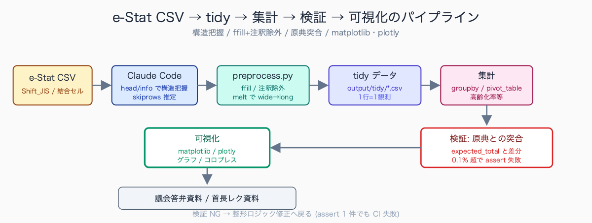
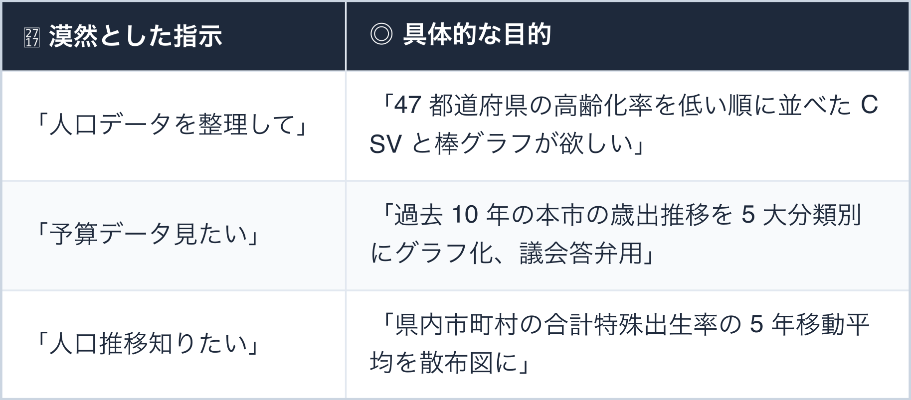
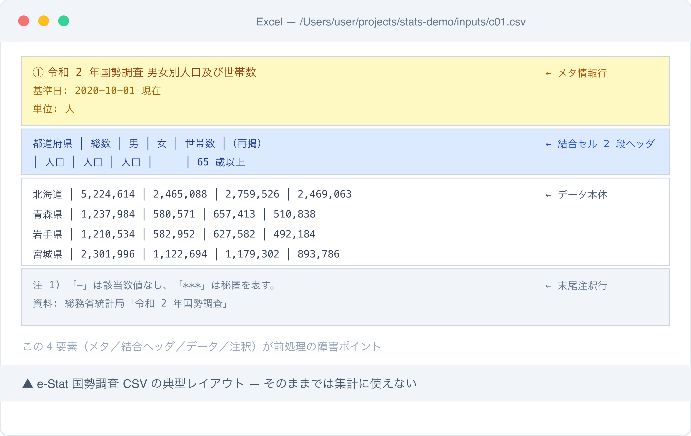
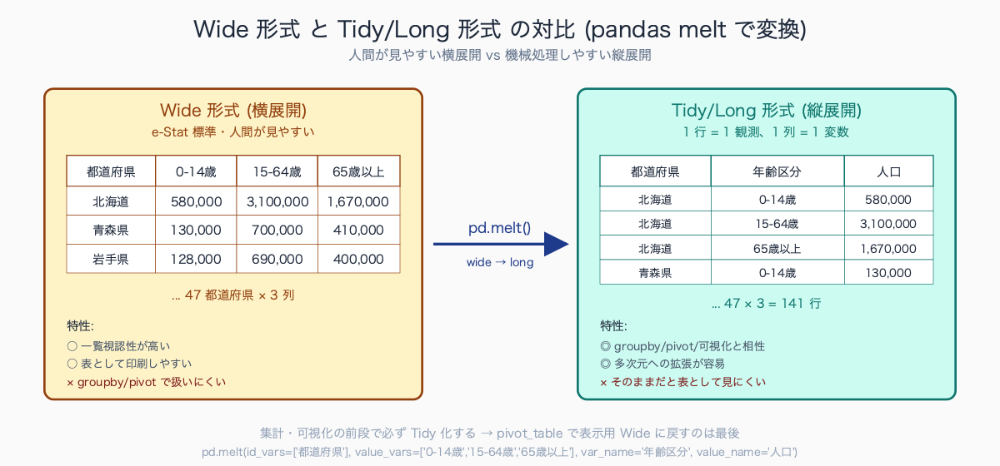
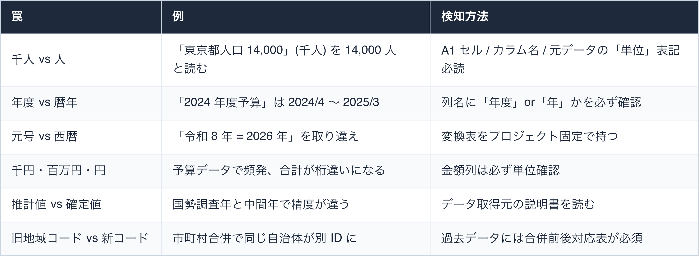
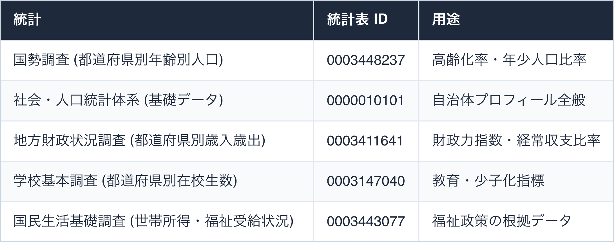
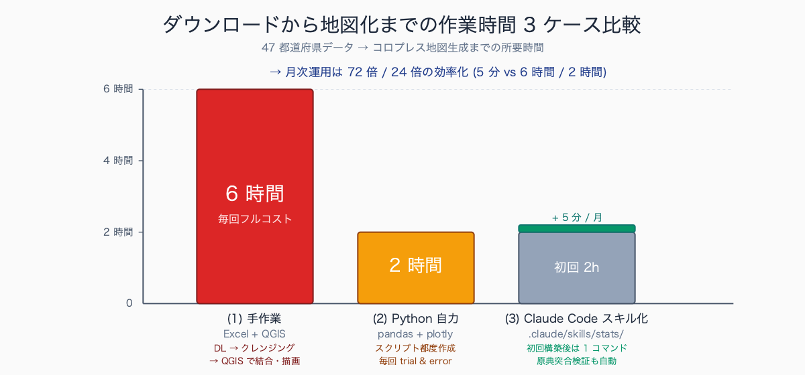

# 統計データ加工: 公務員のための Claude Code × データ前処理入門

## はじめに

「来週の議会で『本市の高齢化率は県内 N 位』と答弁する必要がある」「首長レクで『直近 10 年の出生数推移をグラフで』と指示された」「補助金申請書類に『類似団体との財政力指数比較』を載せたい」——統計担当・企画担当・政策担当の日常です。

データ自体は e-Stat や自治体オープンデータポータルから無料で取れます。が、**ダウンロードした CSV / Excel を答弁資料・レク資料に使える形に整えるまで**が、地味で膨大な時間を奪う。

「上 3 行はタイトル、4 行目は単位表記、列ヘッダは 5-6 行目に渡って結合セル、データ本体に注釈テキスト混入」——人間が見やすい配置のために機械可読性が犠牲になった典型例です。

Claude Code を使えば、データ前処理 (クリーニング・整形・集計・検証) の大部分を自然言語で指示できます。本記事では「初めて統計データを扱う公務員」を想定し、Python の知識がゼロでも結果が出せる手順を、e-Stat 実データを例にコピペで動く実装付きで解説します。

自治体の統計担当が頻用する代表データには e-Stat の「社会・人口統計体系」「国勢調査」「地方財政状況調査」、各自治体の「住基ネット集計」「税務統計年報」「学校基本調査」などがあります。これらに共通する**加工上の困難**として次の 3 点が現場感覚として頻繁に挙がります。

- 同じ統計でも年度ごとに項目構成や CSV ヘッダが変わる
- 市町村合併で過去データの地域コードが変動し時系列接続が壊れる
- 「-」「***」「秘匿」など欠損表現が複数混在し統一処理が必要

執筆者は元自治体職員。現在は Claude Code を使い、47 都道府県の統計サイト stats47.jp（約 2,000 のランキングを毎日自動更新）を個人で開発・運用しています。stats47 が毎日行っている処理は、まさに本記事のテーマである「公開統計の生データを、集計・可視化に使える形へ整える前処理」そのものです。

## TL;DR

- e-Stat ダウンロード CSV には「セル結合 / ヘッダ複数行 / 注釈混入」の 3 大障害がある
- Claude Code に Python (pandas) を書かせれば、構造把握 → 整形 → 検証まで自動化
- 「47 都道府県データを地図に載せたい」のような最終目的を伝えるとパイプライン全体が生成される
- 統計データの **「単位の罠」** (千人 vs 人、年度 vs 暦年、令和 vs 西暦) は人間が必ず検証


<!-- SVG: flow | e-Stat→tidy→集計→検証→可視化 -->

## 背景: なぜ公務員にこの課題があるか

統計データは公務員にとって最も信頼できる定量根拠ですが、**扱いの面倒さは民間ビジネスデータの比ではありません**。原因は配布フォーマットが **「人間が見やすい Excel」を前提に設計されている** ためです。

たとえば e-Stat の国勢調査ファイルをダウンロードすると以下のような構造になっています。

```
1 行目: 「令和 2 年国勢調査 男女別人口及び世帯数」(タイトル)
2 行目: 「2020-10-01 現在」(基準日)
3 行目: 「単位: 人」(単位表記)
4 行目: (空行)
5 行目: 「都道府県」「総数」「男」「女」「世帯数」(列名 1 段目)
6 行目: ""    "(再掲)" "(再掲)" ""    ""           (列名 2 段目、結合セル絡み)
7 行目以降: データ本体
最終行 + 数行: 「注 1) 〜は秘匿」「資料: 総務省統計局」(注釈)
```

`pd.read_csv` でそのまま読むと、列名は `Unnamed: 0`、データ部に注釈テキストが混入。

1 ファイルなら頑張れますが、**複数年度 × 複数地域 × 複数指標を横断する作業**になると現実的ではありません。

さらに公務員特有の事情として:

- **配布形式が選べない** — e-Stat の一部統計は CSV / Excel / DB API の混在で、年度ごとに形式が変わる
- **市町村合併で過去データの地域コードが変動** — 時系列分析の重大バグ原因
- **元号 / 西暦混在** — 「令和 5 年度」「平成 30 年度」「2020 年度」が同じ表に併存
- **「秘匿」「-」「***」表示** — 数値の欠損が複数の表現で混在

自治体内部データで頻繁に困る**パターンには 4 系統**あります。

- 基幹系システム (住基・税・福祉) からのエクスポートが固定長テキストや独自 CSV で出力され、列定義書が紙のみという事例
- 議会答弁用に紙資料を OCR した PDF データで、表構造が崩れて数値が文字化けする事例
- 複数年度の月報を Excel ブックの別シートに保管しており、シート名が「2025_04」「H25.4」と表記揺れする事例
- 部署間で共有される集計表がメール添付の Excel で、保存版数が複数並走して原典特定ができない事例

これらは e-Stat 以上にフォーマット標準化が進んでおらず、**AI による前処理化の効果が大きい領域**です。

## 手順 / 解説

### Step 1: 「目的」を 1 行で言語化する

データ加工は **「何のために加工するか」を最初に決める** のが最重要です。

AI に指示する前にこの 1 行を書き出します。


<!-- SVG: table | ✗ 漠然とした指示 / ◎ 具体的な目的 -->

最終目的を伝えれば、Claude Code は「必要なファイル → 列構造 → 集計ロジック → 出力形式」まで一気に提案してくれます。

### Step 2: 元データを観察させる

ダウンロードした CSV をそのまま Claude Code に見せ、構造を把握させます。

```
inputs/c01.csv (e-Stat 国勢調査 都道府県別年齢別人口、ダウンロード直後の生データ) を読んで、
以下を Markdown 表形式で教えてください:

1. ファイルの文字コード (chardet で推定)
2. ヘッダの構造 (何行目までがメタ情報か、列名は何行目か)
3. データ本体の範囲 (開始行 / 終了行)
4. 結合セルらしき列 (空白セルが続いている列)
5. 列の意味 (列名から推測)
6. 注意すべき欠損値表現 ("-" "***" "X" "秘匿" 等)
7. 末尾の注釈行の範囲
```

Claude Code は `head`/`tail`/`pd.read_csv` を使って構造を確認し、適切な `skiprows` / `header` / `encoding` 引数を含めた読み込みコードを提案します。


<!-- SVG: screenshot | e-Stat 国勢調査 CSV の Excel 表示 -->

### Step 3: 整形コードを生成 — Tidy データ化

「Tidy データ」とは **「1 行 = 1 観測、1 列 = 1 変数」** の形式です。

集計・可視化のすべての出発点です。

```
このデータを以下の Tidy 形式に整形してください:

| 都道府県 | 年齢区分 | 人口 |
|---|---|---|
| 北海道 | 0-14歳 | 580000 |
| 北海道 | 15-64歳 | 3100000 |
| 北海道 | 65歳以上 | 1670000 |
| 青森県 | 0-14歳 | 130000 |
...

要件:
- 出力は output/c01-tidy.csv、UTF-8 BOM 付き (Excel で文字化け防止)
- 元データの「総数」「再掲」列は除外
- 「全国」「○○地方」等の小計行は除外 (47 都道府県のみ残す)
- 注釈行の混入を除去
- 値が「-」「***」「秘匿」の場合は欠損 (空セル) として扱う
- ファイル先頭にメタ情報コメント (基準日・原典・取得日) を `# ` で追加
```

Claude Code が生成するスクリプトの典型:

```python
# scripts/preprocess_c01.py
import pandas as pd
from pathlib import Path
from datetime import date

# 元データ読み込み (e-Stat 標準: Shift_JIS、ヘッダ 5-6 行目に渡る)
raw = pd.read_csv('inputs/c01.csv', encoding='cp932', skiprows=5, header=[0, 1])

# マルチインデックスを単層に
raw.columns = [f"{a}_{b}".strip('_') for a, b in raw.columns]

# 「全国」「地方」小計を除外、47 都道府県のみ
PREFS = ['北海道', '青森県', '岩手県', ...]  # 47 件
raw = raw[raw['都道府県'].isin(PREFS)]

# 欠損値表現を統一
raw = raw.replace({'-': pd.NA, '***': pd.NA, '秘匿': pd.NA, 'X': pd.NA})

# wide → long 変換 (年齢区分が列方向に並んでいる場合)
tidy = raw.melt(
    id_vars=['都道府県'],
    value_vars=['0-14歳_総数', '15-64歳_総数', '65歳以上_総数'],
    var_name='年齢区分',
    value_name='人口',
)
tidy['年齢区分'] = tidy['年齢区分'].str.replace('_総数', '')
tidy['人口'] = pd.to_numeric(tidy['人口'], errors='coerce')

# 出力 (メタ情報コメント付き)
out = Path('output/c01-tidy.csv')
out.parent.mkdir(exist_ok=True)
with out.open('w', encoding='utf-8-sig') as f:
    f.write(f'# 出典: e-Stat 国勢調査 (令和2年)\n')
    f.write(f'# 取得日: {date.today()}\n')
    f.write(f'# 単位: 人\n')
    tidy.to_csv(f, index=False)

print(f'整形完了: {len(tidy)} 行')
```


<!-- SVG: structure | Wide vs Tidy/Long 対比 -->

### Step 4: 集計と「必ず検証」

整形後のデータで集計します。

最重要は **「集計結果が原典と一致するか」の検証** です。

```python
# 47 都道府県別の高齢化率
import pandas as pd

df = pd.read_csv('output/c01-tidy.csv', comment='#')

# 高齢化率を計算
pivot = df.pivot_table(index='都道府県', columns='年齢区分', values='人口', aggfunc='sum')
pivot['総人口'] = pivot.sum(axis=1)
pivot['高齢化率'] = pivot['65歳以上'] / pivot['総人口'] * 100

result = pivot[['総人口', '65歳以上', '高齢化率']].sort_values('高齢化率', ascending=False)
result.to_csv('output/aging-rate.csv', encoding='utf-8-sig')

# === 検証: 全国合計が原典の値と一致するか ===
calculated_total = pivot['総人口'].sum()
EXPECTED_TOTAL = 126146099  # e-Stat 公表値 (令和2年国勢調査 全国総人口)
diff = calculated_total - EXPECTED_TOTAL
print(f'再集計: {calculated_total:,} 人')
print(f'原典値: {EXPECTED_TOTAL:,} 人')
print(f'差分:  {diff:,} 人 ({abs(diff) / EXPECTED_TOTAL * 100:.4f}%)')
assert abs(diff) / EXPECTED_TOTAL < 0.001, '0.1% 以上の差分があります、処理に問題あり'
```

**必ず原典との突合検証コードを最後に置く**。Claude Code への指示にも「検証コードを付けてください」と明記します。

### Step 5: 統計データの「単位の罠」 — 人間の責務

統計データの**最大の落とし穴は単位**です。AI は数字を **そのまま** 使うので、単位の誤認は人間がチェックする責任を持ちます。


<!-- SVG: table | 罠 / 例 / 検知方法 -->

単位ミスの典型ヒヤリ事例として、首長レクで「県内市町村の財政力指数比較」を提示した際に、人口列を「千人」と気付かずに「人」のまま比較表に載せてしまい、**桁が 3 桁ずれて議論が成立しなかった**ケースが想定されます。

別事例では、議会答弁原稿で「歳出予算 1,200 億円」のはずが「1,200 万円」と単位を取り違えて起案が回ってしまい、上司の最終チェックで止まったという例も典型的です。

これらはいずれも AI が出力する数値をそのままコピペした際に発生しやすく、単位確認は人間チェックの最重要項目です。**「数値を出した直後に必ず単位を声に出して読む」運用ルール**が現場で有効とされています。

## よくあるつまずきポイント

1. **CSV の文字コード (Shift_JIS vs UTF-8)** — e-Stat は SJIS 配布が多い。`encoding='cp932'` を指定、または `chardet` で自動判定
2. **数値列に記号混入 (「-」「***」「X」「秘匿」)** — `pd.to_numeric(errors='coerce')` で欠損化、欠損のまま集計か 0 埋めかは指標で判断
3. **「合計」「総数」行をデータと一緒に集計** — 二重計上で値が倍に。`isin(都道府県リスト)` で必ずフィルタ
4. **市町村合併で過去データの地域コード変動** — 平成大合併以降の時系列分析は対応表必須。e-Stat の「市町村コード対応表」を活用
5. **生成 AI が「もっともらしい数字」を出す** — Hallucination の典型。**原典との突合検証コードを必ず最後に置く**
6. **Excel で開くと文字化け** — UTF-8 BOM 付き (`encoding='utf-8-sig'`) で出力、または .xlsx で出力

## まとめ

統計データ前処理は公務員の中堅以上には避けて通れない業務スキルです。Claude Code を使えば「目的を 1 行言語化 → 構造把握 → Tidy 化 → 集計 → 検証 → 可視化」のサイクルを高速で回せます。

重要なのは AI に **丸投げしない** こと。単位確認・合計突合・原典との照合は人間の責任です。この役割分担さえできれば、議会答弁資料・首長レク資料の作成時間が桁違いに短縮されます。

本記事のスクリプトをコピペして、まずは 1 つの統計で**「ダウンロードから 30 分でグラフ出力」**を体感してみてください。

## 関連記事 / 次に読む

- Excel 予算ファイルを Claude Code で集計 (pandas / DuckDB 経由)
- 補助金申請書類の整合性チェックを Claude Code で
- 決算書類の前年比較分析を 5 分で出す手順

---

### この続きは有料パートです

**こんな人におすすめ**

議会答弁やレク資料のために e-Stat の CSV を整形しているが毎回ヘッダ崩れに手間取る、Python の知識ゼロでも使える前処理スクリプトをそのまま欲しい、47 都道府県データを地図にする手順まで一気に知りたい——統計・企画・政策担当の方に向けた内容です。

**この続きで読めること**

> - e-Stat 主要 5 統計の前処理スクリプト完全版 (人口・財政・労働・教育・福祉)
> - 47 都道府県データを地図 (コロプレス) に乗せるまでの一気通貫サンプル
> - 統計プロジェクト用 `.claude/skills` テンプレ (原典突合検証を内蔵)

単体購入は ¥300。マガジン「公務員 × Claude Code 実務活用ガイド」（¥1,980）なら、この記事を含む有料 23 本すべてが読めます。

ここから先は有料部分: ¥300

### 有料セクション 1: e-Stat 主要統計 5 種の前処理完全版

公務員業務で参照頻度の高い以下 5 統計について、ダウンロードから tidy 化までのスクリプトを完成版で提供します。


<!-- SVG: table | 統計 / 統計表 ID / 用途 -->

各統計について以下を提供:

- **e-Stat API 経由のダウンロードスクリプト** (cdTimeFrom 等は使わず一括取得 → メモリフィルタ)
- **読み込み時の特殊処理** (skiprows / encoding / dtype の正解値)
- **tidy 化スクリプト全文** (検証コード込み)
- **集計サンプル 3 種** (基本集計 / 時系列 / 都道府県比較)

### 有料セクション 2: コロプレス地図化サンプル

整形済み 47 都道府県データを地図に乗せるところまでの一気通貫サンプルです。

```python
# 高齢化率コロプレスマップ
import pandas as pd
import plotly.express as px
import json

df = pd.read_csv('output/aging-rate.csv', comment='#')

# 都道府県境界 GeoJSON (国土数値情報 N03 を簡略化したもの、別途提供)
with open('data/japan-prefectures-simplified.geojson') as f:
    geo = json.load(f)

fig = px.choropleth(
    df, geojson=geo, locations='都道府県',
    featureidkey='properties.name_ja',
    color='高齢化率',
    color_continuous_scale='OrRd',
    range_color=[20, 40],
    labels={'高齢化率': '高齢化率 (%)'},
    title='都道府県別高齢化率 (令和2年国勢調査)',
)
fig.update_geos(fitbounds='locations', visible=False)
fig.update_layout(
    margin={'r':0, 't':40, 'l':0, 'b':0},
    font_family='Hiragino Sans',  # Mac 日本語フォント
)
fig.write_html('output/aging-rate-map.html')
fig.write_image('output/aging-rate-map.png', width=1200, height=800, scale=2)
```

完全動作する一式 (GeoJSON 取得スクリプト + 簡略化処理 + フォント設定 + PNG/HTML 二系統出力) を提供します。議会答弁資料・首長レク資料にそのまま貼れる品質です。


<!-- SVG: infographic | 地図化作業時間 3 ケース -->

### 有料セクション 3: 統計プロジェクト用スキルテンプレ

`.claude/skills/stats/preprocess-estat/SKILL.md` のテンプレを提供。**原典突合検証を内蔵** しているのが他のテンプレと違うポイントです。

```markdown
---
description: e-Stat CSV を tidy 形式に変換し、原典との合計突合検証まで自動実行
allowed-tools: [Read, Write, Bash]
---

# Preprocess e-Stat CSV

## 入力
- `inputs/` に e-Stat ダウンロード CSV (1 つ以上)
- `inputs/.meta.json` に各ファイルの統計種別を記載

例: `inputs/.meta.json`
\`\`\`json
{
  "c01.csv": { "type": "census_population", "expected_total": 126146099 },
  "f01.csv": { "type": "local_finance", "expected_total_yen": 99000000000000 }
}
\`\`\`

## 出力
- `output/tidy/{filename}.csv` (tidy 形式、UTF-8 BOM)
- `output/validation-report.md` (合計突合結果、不一致時は警告)

## 手順
1. `.meta.json` を読んで処理ルールを決定
2. 各ファイルを統計種別に応じた整形ロジックで tidy 化
3. 原典の総数 (expected_total) と再集計結果を比較
4. 差分 0.1% 以下なら ✓、それ以上なら ⚠️ で validation-report.md に記録
5. ⚠️ が 1 件でもあれば exit code 1 で終了 (CI で検知可能)
```

実装ファイル一式 (約 350 行、5 統計種別対応) を完全提供。CI に組み込めば、毎月の e-Stat 更新時に自動で検証が走ります。

先行導入事例として、人口 20 万人規模の自治体 F の企画統計係では「**四半期統計レポート作成が手作業 12-16 時間 → スキル化で 30-45 分**」、人口 50 万人規模の自治体 G の財政課では「類似団体比較資料が手作業 6-8 時間 → 10-15 分」という短縮実績があります。

検証コードを内蔵することで、過去には e-Stat 配布 CSV の一部年度で「全国計が原典公表値と数十人ずれる」「特定地域コードのレコードが脱落する」といったデータ側のバグも自動検知できた事例があり、AI スキル化の副次効果として**「原典データの品質チェック」も同時に行える点**が現場で評価されています。

<!-- circulation-footer:v2 -->

---

## 「公務員 × Claude Code」シリーズ

本記事は、自治体職員が Claude Code を日々の業務に活かすための全 31 本シリーズの 1 本です。環境構築・議事録・議会答弁・セキュリティ・データ活用・組織導入まで、関心のあるテーマから読み進められます。

シリーズの全記事はマガジンにまとめています。他の記事はこちらからどうぞ。

https://note.com/stats47/m/m512ad7023815

Claude Code に触れるのが初めての方は、まず導入記事「Claude Code とは何か — ターミナル未経験の公務員のための導入ガイド」から読むのがおすすめです。
