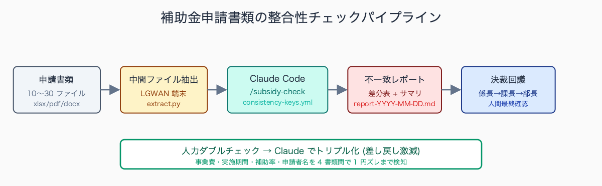
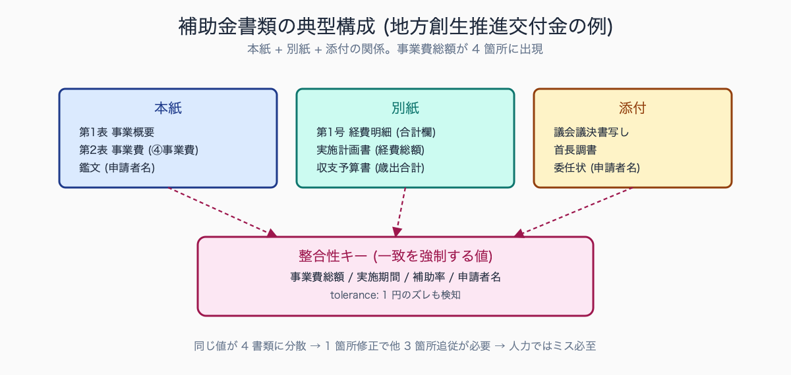
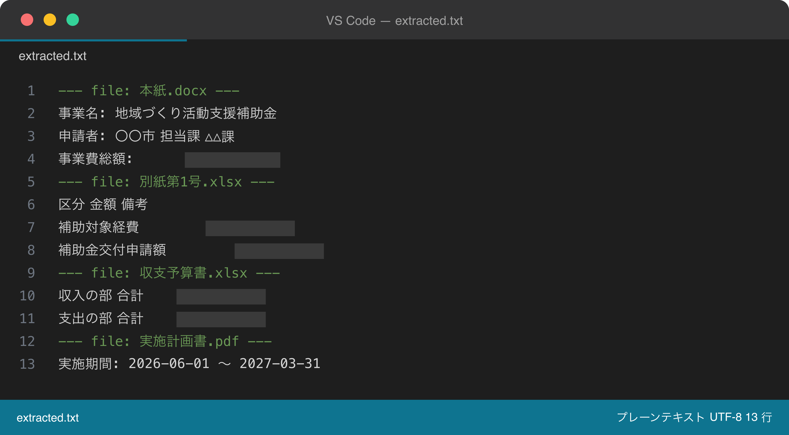
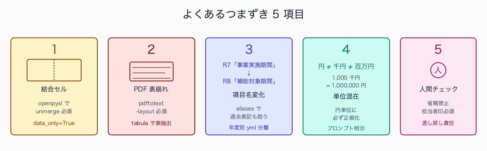

# 補助金申請書類の整合性チェックを Claude Code で

## はじめに

国庫補助・県費補助の申請書類は、要綱・要領・別紙様式・添付資料が **10〜30 ファイル** に及ぶ。地方創生交付金 1 件で「申請書本紙 + 別紙第1号〜第5号 + 実施計画書 + 収支予算書 + 自治体首長の調書 + 議会議決書写し + 関連事業の進捗報告書」と積み上がるのが常態だ。

提出前の最終チェックで「事業費の合計が別紙と本紙で 1 円ずれている」「実施期間が要綱『令和8年4月1日から』に対し申請書が『2026年4月1日から』で表記がそろわない」と国・県の担当官から照会が入る。起案を一度取り下げて差し替え決裁を起こし直すたびに半日が消える。

本記事では Claude Code を使い、決裁回議の前に書類間の整合性を **5 分で機械検証** する手順を示す。

人口 10-20 万人規模の市役所で起きやすい典型例として、地方創生推進交付金 1 件の差し戻し対応で **6-10 時間** が消えるケースが報告されている。初回提出後に国担当官から「事業費総額が本紙と別紙第1号で 1 万円ずれている」「実施期間の表記が和暦と西暦で混在している」といった照会が 2-3 往復続き、そのたびに係長レビュー・課長決裁を再度回す。

1 案件あたり累計 1.5-2 営業日を費やす例が多く、補助金 10 件を並行する財政課・企画課では **年間 30-40 時間** が差し戻し対応だけで消える計算になる。

執筆者は元自治体職員。現在は Claude Code を使い、47 都道府県の統計サイト stats47.jp（約 2,000 のランキングを毎日自動更新）を個人で開発・運用している。


<!-- SVG: flow | 整合性チェックパイプライン -->


## TL;DR

- 補助金申請書類の整合性チェックは Excel/PDF/Word を中間テキスト化して Claude Code に渡す
- 「事業費総額」「実施期間」「申請者名」「補助率」など整合性キーを `consistency-keys.yml` に最初に定義
- `.claude/skills/subsidy-check/` にスキル化すれば毎年・毎案件で再利用、引き継ぎコストも下がる
- 国・県の様式差は `appears_in` に書き分けて吸収。最終決裁前の人間チェックは省略しない
- 守秘配慮として、申請書原本でなく値だけ抽出した中間ファイルを Claude に渡す。LGWAN 接続端末側で抽出スクリプトを完結させる

## 背景: なぜ公務員にこの課題があるか

補助金事務の現場では、申請書類の整合性が **「人力ダブルチェック」** に依存してきた。担当者が一次チェック、係長が二次チェック、課長が決裁前に三次チェックという三重体制でも、数字 1 つの転記ミスが見落とされ、提出後に国庫補助担当課から照会が入る。原因は構造的だ。

第一に、書類が様式ごとに「同じ値を複数回書く」設計になっている。事業費総額は申請書本紙・別紙明細・実施計画書・収支予算書の **4 箇所** に出てくる。1 箇所修正したら他 3 箇所も追従しなければならないが、エクセル間に自動連動はない。

第二に、要綱改正のタイミングで様式の項目名が微妙に変わる。「事業実施期間」が「補助対象期間」になり、さらに「補助対象事業期間」と再改正される。過年度様式の流用が齟齬を生む典型だ。

第三に、これらのチェックは知見が属人化しており、人事異動 (3〜4年サイクル) で空白化する。「前任者の Excel チェックシート」を引き継いでも、なぜそのセルを見るかの理由が失われる。

典型的な差し戻し事例としては、次の 5 パターンが上位を占める。

- 事業費総額のズレ（本紙と収支予算書で千円単位の四捨五入差が発生）
- 実施期間の表記揺れ（「令和8年4月1日」と「2026年4月1日」の混在）
- 申請者名の表記揺れ（「○○市」と「○○市役所」「○○市長」の混在）
- 補助率の小数表記ミス（1/2 補助を 0.5 でなく 0.05 と誤記）
- 議会議決書写しの添付漏れ

ある中核市の事例では、**地方創生交付金 5 件中 4 件** で事業費総額・実施期間のいずれかが指摘されており、構造的な発生頻度の高さがうかがえる。


<!-- SVG: structure | 本紙+別紙+添付の関係図 -->


## 手順 / 解説

### Step 1: 整合性キーを定義する

最初に「どの値が複数書類に共通して出るか」をリストアップする。これは申請する補助金の種類で固定されるので、一度定義すれば毎年使える。地方創生推進交付金を例に書く。

```yaml
# .claude/skills/subsidy-check/reference/consistency-keys.yml
補助金名: 〇〇交付金（例）  # 実際の補助金名と要綱バージョンに置換
要綱バージョン: YYYY-MM-改定版  # 例: 2026-03
consistency_keys:
  - name: 事業費総額
    appears_in:
      - 本紙第1表-事業概要-④事業費
      - 別紙第1号-経費明細-合計欄
      - 収支予算書-歳出合計
      - 実施計画書-経費総額
    type: number
    unit: 円
    tolerance: 0  # 1円のズレも許容しない
  - name: 補助対象事業期間-開始日
    appears_in:
      - 本紙第1表-事業概要-③期間-自
      - 実施計画書-工程表-開始
      - 議会議決書-議案番号
    type: date
    format: YYYY-MM-DD
    aliases: [事業実施期間, 補助対象期間, 補助対象事業期間]  # 年度改正での項目名揺れ
  - name: 補助率
    appears_in:
      - 本紙第1表-事業概要-⑤補助率
      - 収支予算書-財源内訳-国費充当率
    type: percentage
    expected_value: 0.5  # 1/2 補助なら 0.5
  - name: 申請者名
    appears_in:
      - 本紙鑑文-申請者
      - 委任状-委任者
      - 口座振込依頼書-振込先名義
    type: string
    normalize: true  # 株式会社/(株)/㈱ を正規化
```

### Step 2: 申請書類から値を抽出する

Excel は `openpyxl`、PDF は `pdftotext`、Word は `python-docx` で中間テキスト化する。庁内 PC は Python が入っていないことが多いので、portable な WinPython を持ち運ぶか、情シスに `pip install --user` の許可を取る。

```bash
# /tmp/subsidy-input/ に申請書類一式 (xlsx/pdf/docx) を配置済みと仮定
python3 - <<'EOF' > /tmp/subsidy-output/extracted.txt
import openpyxl, glob, subprocess, os
from docx import Document

OUT = []
for path in sorted(glob.glob("/tmp/subsidy-input/*")):
    name = os.path.basename(path)
    OUT.append(f"\n===== FILE: {name} =====")
    if path.endswith(".xlsx"):
        wb = openpyxl.load_workbook(path, data_only=True)
        for sn in wb.sheetnames:
            ws = wb[sn]
            # 結合セルを unmerge してから走査
            for mr in list(ws.merged_cells.ranges):
                ws.unmerge_cells(str(mr))
            OUT.append(f"--- sheet: {sn} ---")
            for row in ws.iter_rows(values_only=True):
                OUT.append("\t".join(str(c) if c is not None else "" for c in row))
    elif path.endswith(".pdf"):
        # -layout で列構造を保持
        txt = subprocess.run(["pdftotext", "-layout", path, "-"],
                             capture_output=True, text=True).stdout
        OUT.append(txt)
    elif path.endswith(".docx"):
        doc = Document(path)
        for p in doc.paragraphs:
            OUT.append(p.text)
        for t in doc.tables:
            for row in t.rows:
                OUT.append("\t".join(c.text for c in row.cells))
print("\n".join(OUT))
EOF
```


<!-- SVG: screenshot | extracted.txt を VSCode で開いた画面 -->

### Step 3: Claude Code に整合性チェックを依頼

`.claude/skills/subsidy-check/SKILL.md` で次のプロンプトを Subagent に渡す。`/tmp/subsidy-output/extracted.txt` と `consistency-keys.yml` の 2 ファイルだけを Read 対象に制限し、他のディレクトリを読みに行かせない。

```text
# Subagent: subsidy-consistency-checker

OUTPUT FORMAT: 1 markdown table only.
Columns: キー名 | 本紙 | 別紙第1号 | 収支予算書 | 実施計画書 | 一致 | 差分
Cell content: ≤ 30 chars each.

入力:
- /tmp/subsidy-output/extracted.txt (申請書類すべて、ファイル区切りあり)
- .claude/skills/subsidy-check/reference/consistency-keys.yml

検証手順:
1. consistency-keys.yml の各 key について、appears_in で指定された
   箇所をすべて extracted.txt から抽出する。
2. 値を比較する。type=number は tolerance を超えるズレを「不一致」と判定。
   type=date は format に正規化してから比較。aliases にある別名は同一視。
3. type=string で normalize:true なら全角半角・株式会社表記を統一して比較。
4. 不一致セルは値そのまま、一致セルは "✓" を表示。
5. 表の下に「不一致サマリ」を 5 行以内で添える (どのキーが何処で何 → 何 にズレたか)。
```

このプロンプトを `.claude/skills/subsidy-check/SKILL.md` に保存し、`/subsidy-check` で起動する。Subagent 化することで、メインスレッドのコンテキストを汚さず、複数案件を順に処理できる。

スキル化して半年間運用した自治体の事例では、**補助金 8 件・延べ 24 回** のチェック実行で **11 件の不一致** を決裁前に検出できたという報告がある。

特に効果が大きかったのは「本紙の事業費 12,345 千円に対し収支予算書が 12,346 千円」という千円単位の四捨五入ズレだ。人間のダブルチェックでは見落としやすいパターンを Claude Code が `tolerance: 0` で確実に拾った。決裁回議の差し戻しが半減し、起案者の精神的負荷も下がったという声が多い。

### Step 4: スキル化して再利用可能にする

```markdown
<!-- .claude/skills/subsidy-check/SKILL.md -->
---
name: subsidy-check
description: 補助金申請書類の整合性を一括チェック。/tmp/subsidy-input/ に書類一式を置いて実行
---

# subsidy-check

## 前提
- /tmp/subsidy-input/ に xlsx/pdf/docx を配置済み
- reference/consistency-keys.yml を補助金種別ごとに用意

## Steps
1. Bash: scripts/extract.py を実行し /tmp/subsidy-output/extracted.txt 生成
2. Subagent (subsidy-consistency-checker) を起動し、上記プロンプトを渡す
3. 結果を /tmp/subsidy-output/report-{YYYY-MM-DD}.md に保存
4. 不一致 0 件なら "✅ 全項目一致" を返す。1 件以上あれば赤太字で警告

## 守秘配慮
- LGWAN 接続端末で extract.py を実行 (Claude には抽出後テキストのみ送る)
- 個人情報マスキングは .claude/hooks/mask-pii.sh で自動化
```

### Step 5: 注意点 — 守秘配慮と決裁フロー

**申請書原本を直接 Claude に送らない設計** が安全だ。Step 2 で「値だけ抽出した中間ファイル」を作り、申請者の個人情報や事業内容の詳細は LGWAN 接続端末側に留める。中間ファイルを作る Python スクリプトは庁内 PC で完結させる。

決裁回議の起案文には「Claude Code による整合性チェック実施済み (`/tmp/subsidy-output/report-2026-05-18.md` 参照)」と記載し、レポートを添付資料に綴じ込む。AI 補助を明示することで、係長・課長・部長・首長と回る決裁ラインで **「最終確認は人間が実施した」記録** が残る。

情報セキュリティポリシー上の線引きは自治体ごとに異なるが、典型例として「個人情報・特定個人情報を含まない値の組み合わせ（金額・期日・補助率）であれば、LGWAN 接続端末外での処理を許可する」という基準を採用する自治体が増えている。

情シスへの事前照会では「抽出後テキストに個人情報が含まれない設計であること」「中間ファイルは作業完了後に削除すること」の 2 点を満たせば許可が出やすい。許可の判断ラインは「申請者名（個人事業主の場合）が含まれるか」が分水嶺になることが多い。

## よくあるつまずきポイント

1. **Excel の結合セルで値が取れない** — `openpyxl` は結合セルの代表セルしか値を持たない。Step 2 のスクリプトのように `ws.merged_cells.ranges` を先に unmerge する。それでも崩れる場合は `data_only=True` で数式値を取得しているか確認
2. **PDF の表が崩れる** — `pdftotext -layout` を使わないと列が混ざる。それでも崩れるなら Tabula (`tabula-py`) で表のみ抽出して CSV 化、テキスト本文と別ファイルにする
3. **要綱改正で項目名が変わる** — `consistency-keys.yml` を年度ごとに `consistency-keys-r7.yml` `consistency-keys-r8.yml` と分離。aliases フィールドで過去表記も拾えるようにする
4. **数字の単位混在 (円 / 千円 / 百万円)** — 抽出時に必ず円単位へ正規化。要綱本文と申請書で単位が違う典型例は「要綱: 1,000千円」「申請書: 1,000,000円」。プロンプトに `unit_normalization: 円` を明示
5. **最終確認の人間チェックを省略してはいけない** — Claude の出力は補助。差し戻し責任は担当者にある。レポート末尾に「人間チェック欄」を設け担当者印を残す


<!-- SVG: infographic | つまずき5項目 -->


## まとめ

補助金事務の最終チェックは **「人力ダブルチェックを Claude Code でトリプル化する」** のが現実解だ。整合性キーを一度定義してスキル化すれば、翌年以降の同じ補助金で工数が激減する。

本記事の手順は要綱を限定していないので、国庫補助・県費補助・市町村独自補助のいずれにも適用できる。記事を読み終えたら、まず `.claude/skills/subsidy-check/reference/` を `mkdir -p` し、担当補助金の `consistency-keys.yml` の雛形を 1 件だけ書いてみるところから始めてほしい。

---

### この続きは有料パートです

**こんな人におすすめ**

補助金申請書類の差し戻し対応に毎回半日以上を取られている、整合性チェックの仕組みを担当補助金ごとにすぐ用意したい、Excel・PDF・Word が混在する添付資料を自動で突合したい——財政課・企画課で補助金事務を担う方に向けた内容です。

**この続きで読めること**

> - 整合性キー定義テンプレ (国庫補助 5 種類分の yml サンプル: 地方創生推進交付金 / 社会資本整備総合交付金 / 子ども・子育て支援交付金 / 過疎対策事業債 / 県単独補助)
> - 抽出スクリプト完全版 (Excel/PDF/Word 対応、結合セル・複数シート・脚注処理)
> - Claude Code 用プロンプト 3 種 (整合性チェック / 文体チェック / 添付漏れチェック)
> - LGWAN 環境での Python 環境構築手順

単体購入のほか、マガジン「公務員 × Claude Code 実務活用ガイド」でシリーズをまとめて読むこともできます。

ここから先は有料部分: ¥300

### 有料セクション 1: 整合性キー定義テンプレ集

国庫補助 5 種類分の `consistency-keys.yml` を、過去事例から逆算した **「引っかかりやすいキー」優先** で定義した。各テンプレは appears_in と type を補助金別に最適化済み。提供するのは次の 5 種だ。

- 地方創生推進交付金 (Step 1 の完全版)
- 社会資本整備総合交付金 (国土交通省所管・物件単位の事業費明細あり)
- 子ども・子育て支援交付金 (こども家庭庁所管・実績報告との整合あり)
- 過疎対策事業債 (総務省所管・公債費試算との整合)
- 県単独補助 (汎用テンプレ)

汎用化しやすい補助金として、地方創生推進交付金と社会資本整備総合交付金の 2 種は全国の市町村で広く採用されており、テンプレ転用が効きやすい。前者は「事業費・補助対象期間・実施計画書との整合」の 3 軸、後者は「物件単位の事業費明細と本紙合計の突合」が整合性キーの中心となる。

県単独補助のテンプレは項目数が少ないため、初めて `consistency-keys.yml` を書く際の入門としても適している。

### 有料セクション 2: 抽出スクリプト完全版

`extract.py` の完全版を掲載する。Excel (.xlsx は openpyxl で直接、旧 .xls は pandas+xlrd 経由で xlsx へ変換してから処理)、PDF、Word (docx) に対応し、結合セル・複数シート・脚注・ヘッダーフッターを正しく処理する。

庁内 PC の Python 3.9 以降で動作確認済み。プロキシ環境で `pip install` が通らない場合の `--proxy` オプション、`requirements.txt` の wheel ファイル一括ダウンロード手順も付属。

庁内 PC で Python 環境を構築する際の典型的な障壁は、次の 3 点だ。

- `pip install` がプロキシで弾かれる
- 管理者権限がなく `python.org` インストーラが実行できない
- ウイルス対策ソフトが whl ファイル展開をブロックする

回避策として、`pip install --proxy http://proxy.local:8080 --user openpyxl python-docx` のように `--user` フラグでユーザー領域にインストール、情シスから WinPython の portable 版を ZIP で受領し USB 経由で展開、必要な whl を別 PC でまとめてダウンロードし `pip install --no-index --find-links=./wheels` でオフライン導入、というルートが現実的だ。

### 有料セクション 3: Claude Code 用プロンプト 3 種

整合性チェック以外に、補助金事務でよく使うプロンプトを 2 種追加で掲載:

1. 整合性チェック (本文 Step 3 の完全版、不一致タイプ別の差分表示ルール付き)
2. 文体・敬語チェック (国庫補助担当官の好む文体への補正、「了知されたい」「されたい」「するものとする」の使用ルール)
3. 添付書類漏れチェック (要綱の添付書類リスト vs 提出ファイル一覧、ファイル名命名規則チェック)

文体チェックの効果として、ある町役場では国庫補助担当官からの「文体に関する指摘」が **導入前の月平均 3-4 件から導入後 1 件以下** に減少した事例がある。特に「されたい」「了知されたい」「するものとする」の語尾統一、要綱本文の引用箇所での「当該」「同条」の使い分けで指摘が激減した。

Claude Code に「国庫補助申請文書の標準文体」を学習させたプロンプトを保存しておけば、新人担当者でもベテランと同等の文体で起案できるようになる。

## 関連記事 / 次に読む

- 決算書類の前年比較分析を 5 分で出す手順
- 起案文・決裁文の AI 査読チェックリスト 20 項目
- 個人情報を Claude に送らずに AI 活用する 3 つの設定

<!-- circulation-footer:v2 -->

---

## 「公務員 × Claude Code」シリーズ

本記事は、自治体職員が Claude Code を日々の業務に活かすための全 31 本シリーズの 1 本です。環境構築・議事録・議会答弁・セキュリティ・データ活用・組織導入まで、関心のあるテーマから読み進められます。

シリーズの全記事はマガジンにまとめています。他の記事はこちらからどうぞ。

https://note.com/stats47/m/m512ad7023815

Claude Code に触れるのが初めての方は、まず導入記事「Claude Code とは何か — ターミナル未経験の公務員のための導入ガイド」から読むのがおすすめです。
