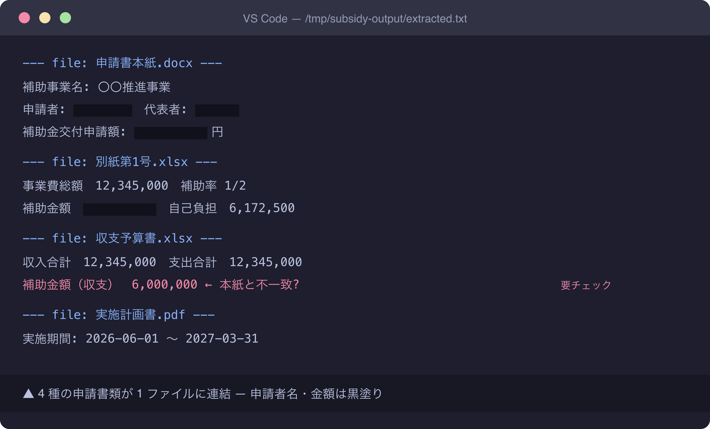

# 撮影ガイド: 補助金申請書類の整合性チェックを Claude Code で

## 撮影前準備

### macOS スクリーンショットコマンド

```bash
# 範囲選択 (推奨): Shift + Command + 4
# ウィンドウ単一: Shift + Command + 4 → Space → クリック
# 全画面: Shift + Command + 3
# クリップボード保存: 上記コマンドに Control を追加
```

### ターミナル / エディタ推奨設定

- ターミナル: iTerm2 または macOS Terminal、フォント `JetBrains Mono 14pt`、配色 `Solarized Dark`
- VSCode: テーマ `Default Dark+`、フォントサイズ 14、`Cmd + B` でサイドバー非表示
- ウィンドウ幅は 1280 × 720 程度に整える (Rectangle.app 等で固定可)
- macOS メニューバーの個人名 / 時刻は撮影後に黒塗り、もしくは事前にダミーユーザーで撮影

### マスキング原則

- 自治体名・部署名・職員名 → `〇〇市` / `△△課` / `担当者A` 等の架空名へ
- 申請者名・法人名 → `申請者X` / `法人Y`
- 申請金額・口座番号 → `12,345,000` 等のキリの良いダミーへ
- ファイルパスの `/Users/<実名>/` → `/Users/user/` に置換
- メール・電話・住所は完全マスキング (黒塗り or ダミー差し替え)

### 保存先

```bash
mkdir -p /Users/minamidaisuke/stats47/docs/31_note記事原稿/koumuin-claude-code/16-subsidy-doc-consistency/images/screenshots
```

ファイルは PNG で保存後、後段で `pngquant` 圧縮する。

---

## 撮影リスト

### Shot 1: extracted.txt を VSCode で開いた画面

- **本文位置**: Step 2 直後 (draft.md 134 行目)
- **撮影対象**: `/tmp/subsidy-output/extracted.txt` を VSCode で開き、複数の補助金申請書類が `--- file: ... ---` 区切りで連結された状態が見える画面
- **準備するもの**:
  - 架空の補助金申請書類セット (本紙 .docx / 別紙第1号 .xlsx / 収支予算書 .xlsx / 実施計画書 .pdf)
  - 上記を draft.md の Python ワンライナーで `extracted.txt` に変換
  - VSCode を開き、左サイドバーは非表示、右下のファイル文字数表示は残してよい
- **マスキング項目**:
  - 申請者名 → `申請者: 〇〇市` などの架空名
  - 事業費・補助金額 → `12,000,000円` 等のダミー値
  - 自治体首長名・担当課名 → 黒塗り or `△△課`
  - VSCode タイトルバー左端の絶対パス内の `/Users/<実名>/` → 黒塗り
- **推奨ファイル名**: `shot-01-extracted-txt-vscode.png`
- **撮影手順**:
  1. 架空書類をテンプレから 4 種作成 (申請書本紙 / 別紙第1号 / 収支予算書 / 実施計画書)
  2. draft.md Step 2 の Python ワンライナーを実行し `/tmp/subsidy-output/extracted.txt` を生成
  3. `code /tmp/subsidy-output/extracted.txt` で VSCode 起動
  4. エディタを最大化 → サイドバー非表示 (`Cmd + B`)
  5. `--- file: ` 区切りが 2-3 種類見える位置までスクロール
  6. `Shift + Command + 4` で本文エリアを矩形選択して撮影
  7. プレビュー.app で申請者名・金額・パスをマーキー選択し黒塗り (注釈ツール → 図形 → 矩形・黒塗りつぶし)

---

## 撮影後手順

1. **PNG 保存先**: `images/screenshots/shot-01-extracted-txt-vscode.png` に統一
2. **pngquant 圧縮** (品質を保ちつつファイルサイズ削減):
   ```bash
   pngquant --quality=70-90 --ext=.png --force \
     images/screenshots/shot-01-extracted-txt-vscode.png
   ```
3. **draft.md マーカー置換**:
   - 該当行 (134 行目) の `> 📸 [スクリーンショット] ...` を以下に差し替え:
     ```markdown
     
     ```
4. **個人情報チェック** (公開前必須):
   - macOS メニューバー左端のユーザー名表示が写っていないか
   - VSCode タイトルバーの `/Users/<実名>/` パスが残っていないか
   - Dock アイコンや他アプリの通知バナーに個人特定要素が残っていないか
   - 申請者名・金額・課名がすべて架空またはマスキング済みか
