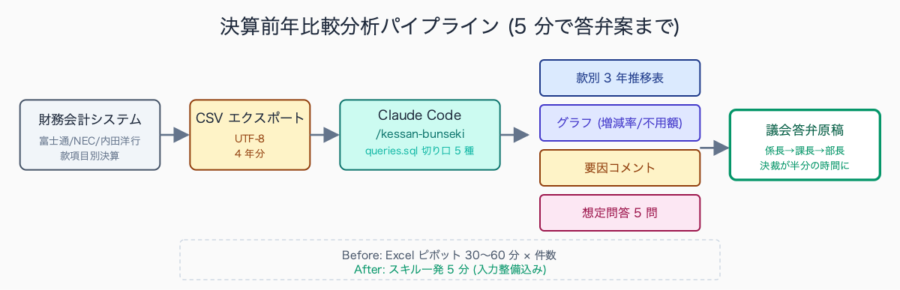
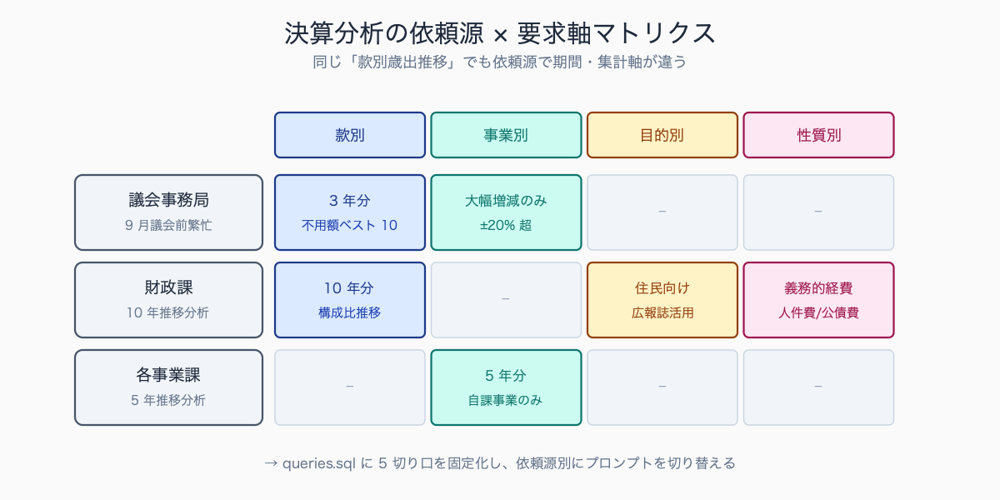
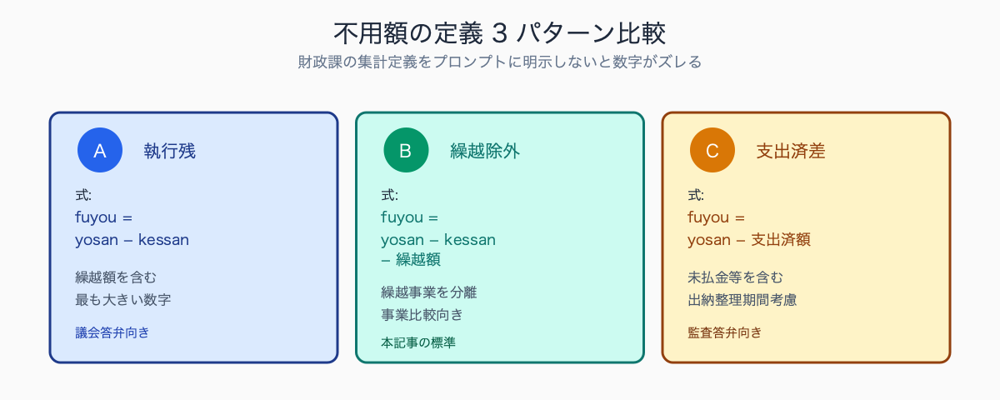

# 決算書類の前年比較分析を 5 分で出す手順

## はじめに

決算期 (4〜8月) の会計・財政部局は、前年比較分析の依頼で埋め尽くされる。「歳出科目別の対前年伸び率と要因コメントを明日朝までに」「過去 3 年の推移を款項目別に折れ線グラフで」「議会答弁で使うので不用額の大きい事業ベスト 10」といった注文が、各課・議会事務局・政策秘書から個別の様式で届く。Excel ピボットを 1 件 30〜60 分で組んでいると、9 月議会前は毎日 22 時退庁になる。これを Claude Code に任せると、入力ファイル整備込みで 5 分に短縮できる。本記事は財務会計システムから出力した CSV を起点に、`/kessan-bunseki` スキル一発で答弁原稿まで出す導線を示す。

決算期の財政課にはたとえば「9月議会答弁用に、不用額が大きい事業ベスト 20 を翌朝までに」「過去 10 年の人件費推移を職員数で割った 1 人あたり金額で出して」といった無茶振りが届きやすい。前者は Excel ピボット組み立て + 要因コメント整理で 3-4 時間、後者は人件費データと職員数データの突合作業から始めると 5-6 時間かかる典型例だ。1 案件で半日が消えるパターンが議会前 2 週間は連日続き、深夜残業が常態化する自治体は少なくない。


<!-- SVG: flow | 決算分析パイプライン -->


## TL;DR

- 決算データの前年比較は CSV 化 → `.claude/skills/kessan-bunseki/` で 5 分
- 切り口テンプレは「款別」「事業別」「歳出科目別」「性質別」「目的別」の 5 種を用意
- 要因コメント (なぜ前年比 +X%?) の下書きまで Claude が作る。最終解釈は職員
- 議会答弁の想定問答も同じスキルで派生。決算審査特別委員会の論点 10 種に対応
- 金額の最終突合は必ず Excel 原本で行う。AI 出力は分析・説明用と割り切る

## 背景: なぜ公務員にこの課題があるか

決算分析業務は、属人化と季節集中の典型だ。年に 1 回しか発生しないため業務マニュアル化が進まず、ベテラン職員が暗黙知で処理してきた。それが定年退職・人事異動 (4 月 1 日付異動の翌月に決算期入り) で空白化し、若手職員が一から Excel と格闘する。

依頼側 (議会・財政課・各事業課) の要求様式もバラバラだ。同じ「款別歳出推移」でも、議会には 3 年分・各事業課には 5 年分・財政課には 10 年分というふうに期間が違う。集計軸も「款項目別」「事業別」「目的別」「性質別」が混在する。「目的別歳出」と「性質別歳出」の違いを依頼者が把握していないケースも多く、何度も差し戻される。これらを毎回手作業で組み替えていると、決算月は残業の連続になる。

人口 5-30 万人規模の市役所では、決算分析依頼は 7 月初旬から 9 月議会開会 (9 月上旬) までの 2 か月で集中する。財政課には議会事務局・各事業課・政策秘書・監査事務局から月 30-50 件の依頼が並行して入り、1 人の担当者が 3-5 件を同時並行で抱えるのが定常だ。納期は「翌朝まで」「3 営業日以内」が混在し、特に議会開会の前 2 週間は最終調整が連日深夜まで続く。決算統計の提出期限 (9 月末) と議会答弁準備が重なる構造的繁忙期となっている。


<!-- SVG: structure | 依頼源×要求軸マトリクス -->


## 手順 / 解説

### Step 1: 決算データを CSV 化する

財務会計システム (Sharepoint / 富士通 / NEC / 内田洋行 等) から CSV エクスポートする。出力できないシステムなら、Excel から手動で `名前を付けて保存 → CSV UTF-8` で保存。

```csv
year,kuwan_code,kuwan,koumoku,jigyo_code,jigyo,yosan,kessan,fuyou
2024,02,総務費,総務管理費,02-01-01,庁舎管理事業,12000000,11850000,150000
2024,02,総務費,総務管理費,02-01-02,財産管理事業,8500000,8420000,80000
2025,02,総務費,総務管理費,02-01-01,庁舎管理事業,12500000,12100000,400000
2025,02,総務費,総務管理費,02-01-02,財産管理事業,8800000,8650000,150000
```

款・項・目・事業のコード体系は自治体ごとに異なるので、システム出力時のヘッダー名をそのまま CSV に残しておく。Claude Code 側で `kuwan_code` を見て総務省統計基準 (02=総務費, 03=民生費, 04=衛生費, ...) と照合する。

> 📸 [スクリーンショット] 財務会計システムから決算 CSV をエクスポートする画面 (システム名・自治体名は黒塗り)

### Step 2: 切り口テンプレを準備

5 種の切り口を `.claude/skills/kessan-bunseki/reference/queries.sql` にまとめる。Claude Code は SQL を書くというより、CSV から該当データを集計させるための「切り口指示書」として読む。

```sql
-- 切り口 A: 款別 3 年推移
SELECT kuwan, year, SUM(kessan) AS kessan_sum
FROM data
WHERE year IN (2023, 2024, 2025)
GROUP BY kuwan, year ORDER BY kuwan_code, year;

-- 切り口 B: 事業別前年比 (大幅増減のみ)
-- サブクエリ内の派生列 ratio_pct を WHERE で参照するには
-- 外側 SELECT で再ラップする必要がある (DuckDB / SQLite 仕様)
SELECT * FROM (
  SELECT jigyo,
         k2024 AS kessan_2024,
         k2025 AS kessan_2025,
         (k2025 - k2024) AS diff,
         ROUND((k2025 - k2024) * 100.0 / NULLIF(k2024, 0), 1) AS ratio_pct
  FROM (
    SELECT jigyo,
           SUM(CASE WHEN year=2024 THEN kessan END) AS k2024,
           SUM(CASE WHEN year=2025 THEN kessan END) AS k2025
    FROM data GROUP BY jigyo
  )
) WHERE ABS(ratio_pct) > 20 OR ABS(diff) > 10000000
ORDER BY ABS(diff) DESC LIMIT 30;

-- 切り口 C: 不用額の大きい事業ベスト 10 (議会答弁頻出)
SELECT jigyo, yosan, kessan, fuyou,
       ROUND(fuyou * 100.0 / NULLIF(yosan, 0), 1) AS fuyou_ritsu
FROM data WHERE year = 2025
ORDER BY fuyou DESC LIMIT 10;

-- 切り口 D: 性質別 (人件費 / 物件費 / 普通建設事業費 / 補助費等)
-- 切り口 E: 目的別 (款のみで再集計、住民向けカテゴリへ変換)
```

### Step 3: Claude Code に分析を依頼

`/kessan-bunseki` スキルでこのプロンプトを発火する。

```text
# Subagent: kessan-analyzer

OUTPUT FORMAT: markdown
構成:
1. 款別歳出 3 年推移 (表のみ、千円単位)
2. 増加率上位 5 事業 / 減少率上位 5 事業 (表)
3. 不用額ベスト 10 (表 + 各事業 1 行コメント)
4. 歳出構造の特徴 (本文 3 段落以内)
5. 想定問答 (質問 5 つ + 答弁案、各 200 字以内)

入力:
- /tmp/kessan-input/data.csv (4 年分の決算データ)
- .claude/skills/kessan-bunseki/reference/queries.sql (切り口定義)

ルール:
- 金額は千円単位に丸めて表示 (例: 1,234,567円 → 1,235千円)
- 増減率は小数第1位まで、絶対値 20% 超 or 1000万円超を「大幅」と判定
- 要因コメントの語彙は「制度改正」「人事院勧告」「物価上昇」「事業終期」
  「臨時事業」「災害復旧」「国庫補助の有無」の 7 観点から選択
- 想定問答の論点は decision-審査論点.md の 10 論点から、不用額の大きい順に 5 つ選ぶ
```

実際にこの Subagent を運用した自治体の事例では、「款別 3 年推移表」「増減率上位 5 事業」「不用額ベスト 10」の数値部分はほぼそのまま採用可能だったとの報告がある。一方で「要因コメント」と「想定問答」は人間の手直しが 3-4 割必要で、特に「制度改正の影響」「臨時事業の終期」など現場固有の事情を Claude が把握しきれない部分は係長が補正する形が現実的だ。表生成 + たたき台作成までを AI、解釈・補正を人間という役割分担が運用上の最適解となる。

### Step 4: スキル化して年次再利用

```markdown
<!-- .claude/skills/kessan-bunseki/SKILL.md -->
---
name: kessan-bunseki
description: 決算 CSV を入力に前年比較表 + 答弁案を 5 分で出力
---

# kessan-bunseki

## Usage
1. /tmp/kessan-input/data.csv に決算データを配置
2. `/kessan-bunseki [year]` で起動 (year は当年度)
3. /tmp/kessan-output/report-{year}.md と graphs/*.png が生成される

## 拡張
- 月次予算執行状況分析にも流用可 (queries.sql の year を月に置換)
- 複数年比較 (5 年 / 10 年) は切り口 A の WHERE 句を拡張
```

過年度のレポートは `/tmp/kessan-output/` に蓄積し、翌年度に「前年はこの観点で書いた」を Claude が参照できるようにする。Memory (`CLAUDE.md` の補足ファイル `.claude/kessan-context.md`) に過去議会の頻出質問を蓄積するとさらに精度が上がる。

### Step 5: 議会答弁への流用

Step 3 の「想定問答」は Claude のたたき台。実際の答弁は決算審査特別委員会の論点 (歳出抑制 / 重点事業 / 不用額 / 繰越額 / 基金繰入 / 地方債発行 / 公債費 / 人件費 / 物件費 / 補助費等) に合わせて係長・課長が補正する。下原稿があるだけで、係長レビュー → 課長決裁 → 部長確認 → 副市長・市長レクの 4 段階回議が半分の時間で済む。AI 補助を明示するため、答弁原稿の起案文に「Claude Code による下書きを職員が補正」と記載しておくと監査対応も容易だ。

議会答弁の下原稿を AI で作ることへの組織内の反応は、自治体ごとに温度差がある。比較的進取な自治体では「ベテラン職員の暗黙知に依存していた業務が標準化される」と歓迎される一方、保守的な部署では「議会答弁は政治的に重い文書なので AI に任せるのは時期尚早」という慎重論も根強い。妥協点として「AI は集計と論点抽出まで、答弁文言の最終形は人間」という線引きを内規化する自治体が増えており、起案文に「Claude Code による下書きを職員が補正」と明示することで監査・情報公開請求への耐性も担保している。

## よくあるつまずきポイント

1. **款項目のコード体系がシステムで違う** — 総務省統計基準と自治体独自コードを変換する辞書を `reference/code-mapping.yml` に固定。例: 自治体コード `02-01` → 統計基準 `02` (総務費)
2. **不用額の扱い** — 「不用額」と「執行残」と「翌年度繰越」が混在する。財政課の集計定義をプロンプトに明示。`fuyou = yosan - kessan - 繰越額` か `fuyou = yosan - 支出済額` かで数字が変わる
3. **千円・百万円の単位混在** — CSV 出力時に必ず円単位で揃え、表示時に千円丸めする。複数システム統合時は単位ヘッダーを必ず確認
4. **繰越事業の前年比** — 繰越額を前年に含めるか当年に含めるかで前年比が大きくぶれる。事業別比較は「繰越除外ベース」を原則にし、プロンプトで明示
5. **金額の最終突合** — Claude の出力は分析用。決算統計の原本数字との突合は Excel 等で必ず行う。総計が 1 円でもずれたら出力を信用しない


<!-- SVG: infographic | 不用額定義3パターン比較 -->


## まとめ

決算前年比較は「機械的な集計 + 人間の要因解釈」の組み合わせ業務だ。集計部分を Claude Code に任せれば、職員は要因解釈と答弁書作成に集中できる。本記事の 5 ステップは決算期だけでなく、月次予算執行状況の分析・補正予算編成時の財源精査・基金繰入計画にもそのまま流用できる。記事を読み終えたら、まず財務会計システムから 2 年分の CSV を出して、`/tmp/kessan-input/data.csv` に置き、`/kessan-bunseki` を 1 回叩いてみてほしい。

---

ここから先は有料部分: ¥500

> このセクション以降の内容:
> - 切り口テンプレ 5 種の完全 SQL (款別 / 事業別 / 目的別 / 性質別 / 義務的経費別)
> - 議会答弁想定問答プロンプトの全文版 + 決算審査特別委員会 10 論点辞書
> - .claude/skills/kessan-bunseki/ 完全構成ファイル

### 有料セクション 1: 切り口テンプレ完全版

款別・事業別・目的別・性質別・義務的経費別の 5 種類について、Claude Code 向け SQL クエリ + 出力フォーマット指示 + 要因コメント観点辞書を 1 セットで提供する。各クエリは SQLite で動作確認済みで、CSV を `duckdb` または `sqlite3 :memory:` に投入して直接実行できる。クエリ末尾には「議会で必ず問われるポイント」を 3 つずつ付記。

切り口の優先順位は依頼元によって明確に分かれる。議会は「不用額の大きい事業ベスト 10」「繰越額の理由」「基金繰入の妥当性」の 3 軸を頻繁に要求する。財政課は「款項目別の対前年伸び率」「性質別歳出の構成比推移」「義務的経費比率」を重視し、各事業課は「自課の事業別決算と当初予算の乖離理由」「翌年度予算への影響」を求める。汎用テンプレでまず議会向け 3 軸を押さえ、財政課向け 3 軸を追加で揃えれば、依頼の 7-8 割をカバーできる構造になっている。

### 有料セクション 2: 議会答弁想定問答プロンプト全文版

決算審査特別委員会で頻出する 10 論点 (歳出抑制・重点事業・不用額・繰越額・基金繰入・地方債発行・公債費・人件費・物件費・補助費等) について、各 3 問ずつの想定問答 (合計 30 問) を Claude に生成させるプロンプトを掲載。各問は「想定質問 200 字 + 答弁案 400 字 + 補足説明 200 字」構成で、係長レビュー時の修正ポイントもセットで出力する。

過去の決算審査特別委員会の記録を見ると、繰り返し問われる論点は「不用額の大きい事業の理由」「基金繰入の必要性」「地方債発行残高の将来負担」の 3 つに集約される傾向がある。特に不用額については「当初見込みが甘かったのではないか」「事業効果が見込めなかったのではないか」と問われやすく、事業終期・制度改正・国庫補助減額などの要因を整理した想定問答が必須となる。基金関連は決算剰余金処分とセットで論点化されやすく、財政調整基金の残高水準が標準財政規模に対して妥当かが繰り返し議題になる。

## 関連記事 / 次に読む

- 補助金申請書類の整合性チェックを Claude Code で
- 議会答弁原稿を Claude Code で 3 案出す prompt 集
- Excel 予算ファイルを Claude Code で集計 (pandas / DuckDB 経由)
