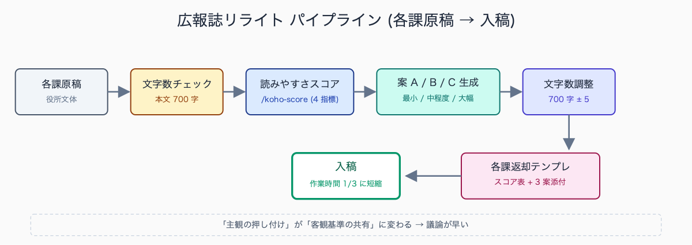
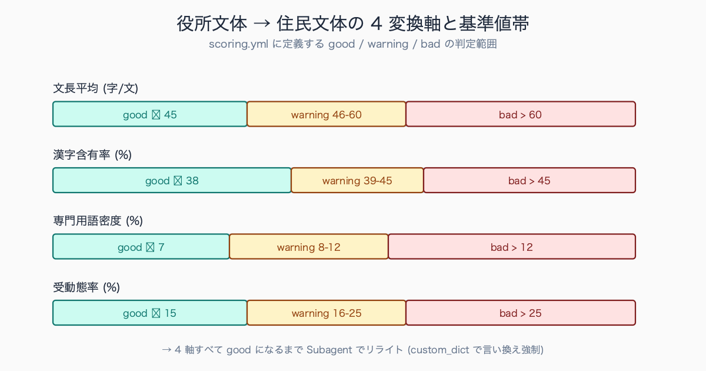
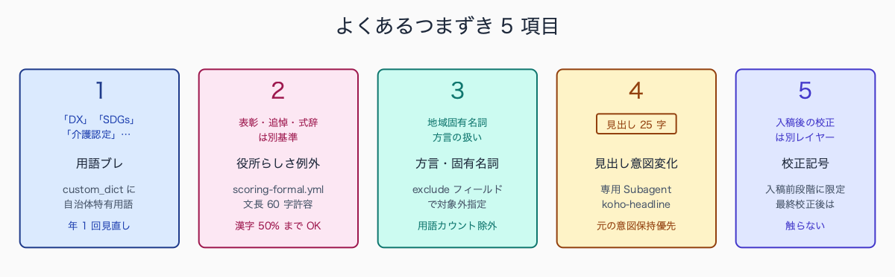

# 広報誌の原稿を Claude Code でリライト: 読みやすさスコア化

## はじめに

毎月発行される自治体広報誌は、各課から上がってくる原稿をデザイン入稿前に広報担当が整える。誌面の文字数は厳密に決まっている (A4 1/2 ページなら本文 700 字、見出し 25 字、リード文 80 字)。さらに「住民が読んで分かるか」という曖昧な基準で文面を直さねばならず、各課への返却 → 修正依頼 → 戻し → 再修正のループで入稿締切前夜が徹夜になる。本記事では Claude Code に「読みやすさスコア」を出させて、原稿リライトを定量化する手順を示す。`.claude/skills/koho-rewrite/` をスキル化することで、毎月の作業時間を体感で 3 分の 1 に短縮した実装パターンを共有する。

各課から上がる広報誌原稿の典型例として、福祉部門からは「介護認定の申請を行おうとする者にあっては、事前に地域包括支援センターへの相談を行うものとする」、税務部門からは「本市の市民税は前年中の所得に基づき算定されるものであり、当該課税年度において別途定める税率を乗じて得た額となる」といった起案文体そのままの原稿が届くケースが多い。これらは住民向けには「介護認定の申請前に、地域包括支援センターにご相談ください」「市民税は前年の所得をもとに計算します」と書き換える必要があるが、書き換え工数の見積もりが各課と合わないまま差し戻しが繰り返される構造的問題となっている。


<!-- SVG: flow | 広報誌リライトパイプライン -->


## TL;DR

- 広報誌原稿のリライトを「読みやすさスコア」で定量化し、各課との合意形成を加速
- スコア指標は文長平均・漢字含有率・専門用語密度・受動態率の 4 軸 (`scoring.yml` に定義)
- Claude Code でスコア算出 → リライト案 3 種生成 → 文字数自動調整まで一気通貫
- `.claude/skills/koho-rewrite/` にスキル化、毎月の発行サイクルに組み込む
- 各課への返却時にスコア表を添付 → 「主観の押し付け」が「客観基準の共有」に変わり議論が早い

## 背景: なぜ公務員にこの課題があるか

広報誌の原稿問題は二層構造になっている。第一層は「文字数調整」で機械的に対応できる。第二層は「役所文体から住民文体への書き換え」で、ここに時間がかかる。

各課から上がる原稿は、起案文・要綱・通知文の文体に引きずられている。「〜することができることとする」「〜の手続きを了知されたい」「〜について別途定めるものとする」といった表現が、住民向け広報誌にもそのまま流れてくる。広報担当はこれを 1 文 1 文書き換えるが、各課へ戻して「文体を直してください」と依頼すると「もう直しました」と差し戻され、平行線になる。背景には「何が読みにくいか」の客観基準が共有されていないことがある。

スコア化はこの構造問題を解決する。「あなたの原稿は文長平均 65 字 / 漢字含有率 48% / 専門用語密度 12% です。広報誌基準は 40 字 / 35% / 5% 以下です」と数字で示せば合意が取りやすい。返却メールに「スコアが基準値超過のため再検討をお願いします」と添えるだけで、各課担当の納得度が上がる。

広報担当が経験する典型的な揉め事として、「原稿を返却したら『各課で十分検討した結果なので変更不可』と差し戻された」「文体修正を依頼したら『広報課の主観で勝手に直されては困る』と苦情が来た」という事例が報告されている。スコア化導入前は返却理由が「読みにくい」「硬い」といった主観表現にとどまり、合意形成に 2-3 往復を要していたが、導入後は「文長平均 65 字（基準 40 字）」と数字で示すことで初回返却での合意率が大幅に向上した自治体の事例もある。客観基準の共有が組織間調整のコストを大きく下げる典型例だ。


<!-- SVG: structure | 4変換軸と基準値帯 -->


## 手順 / 解説

### Step 1: 読みやすさスコアの 4 指標を定義

```yaml
# .claude/skills/koho-rewrite/reference/scoring.yml
publication: 〇〇市広報誌（A4・横書き・本文 12pt）
metrics:
  - name: 文長平均
    target: 40
    threshold:
      good: <= 45
      warning: 46-60
      bad: > 60
    description: 1 文あたり文字数。長すぎると読み手が迷子になる
    measurement: 全角文字数。句点（。）で文分割
  - name: 漢字含有率
    target: 35
    threshold:
      good: <= 38
      warning: 39-45
      bad: > 45
    description: 全文字に占める漢字の割合。高いと硬い印象
    measurement: 漢字数 / (漢字+ひらがな+カタカナ+全角英数)
  - name: 専門用語密度
    target: 5
    threshold:
      good: <= 7
      warning: 8-12
      bad: > 12
    description: 行政用語・法令用語の出現率。住民に伝わらない
    measurement: 専門用語辞書ヒット数 / 形態素数 × 100
  - name: 受動態率
    target: 10
    threshold:
      good: <= 15
      warning: 16-25
      bad: > 25
    description: 「〜される」「〜となる」の割合。主語が曖昧化する
    measurement: 受動態文 / 全文 × 100
custom_dict:  # 自治体固有の専門用語（広報誌では言い換える）
  - term: SDGs
    replace: 持続可能な開発目標（SDGs）
  - term: DX
    replace: デジタル化
  - term: 介護認定
    replace: 介護が必要な度合いの判定（介護認定）
```

### Step 2: 原稿を Claude Code に渡してスコア算出

`/koho-score` スキルで Subagent を起動する。形態素解析は Claude 内部の自然言語理解に任せるか、`mecab` や `sudachi` を事前実行して結果を渡す (精度が必要な場合)。

```text
# Subagent: koho-scorer

OUTPUT FORMAT: 1 markdown table + 1 summary paragraph.
Columns: 指標 | 計測値 | 判定 | 該当箇所（上位3つ・各≤20字）
Summary: 「総合判定: good/warning/bad」「最優先改善指標: <name>」を 2 行で。

入力:
- /tmp/koho-input/genkou-{id}.txt （原稿本文）
- .claude/skills/koho-rewrite/reference/scoring.yml

計測ルール:
- 専門用語判定は scoring.yml の custom_dict + 以下の汎用カテゴリ:
  * 法令用語: 〜法、〜条例、要綱、要領、施行、附則、当該、別段の定め
  * 行政手続用語: 申請、届出、承認、認可、了知、付託、上申、稟議
  * 庁内用語: 起案、決裁、回議、合議、副申、副本、付議
  * 略語: SDGs/DX/ICT/EBPM/PFI/PPP（フルスペル併記なしの場合のみカウント）
- 受動態は「〜される」「〜となる」「〜られる」「〜にあたる」を機械判定
- 文長は句点（。）で分割、全角文字数で計測
```

> 📸 [スクリーンショット] /koho-score 実行後の出力（原稿は架空のもの、各課名は黒塗り）

### Step 3: リライト案 3 種を生成

```text
# Subagent: koho-rewriter

OUTPUT FORMAT: 3 sections (A/B/C), each with rewritten text + score comparison.

Step 2 のスコアをふまえ、以下の原稿を 3 段階でリライトしてください。

案 A: 最小限の修正（元の意図を崩さず指標を warning 以下に）
  - 制約: 元の構成・段落数・キーワードを保持
  - 想定読者: 各課担当（自分の原稿の名残を残したい）

案 B: 中程度の修正（能動態化 + 専門用語の言い換え）
  - 制約: 段落数は同じ、文の順序は変えても可
  - 想定読者: 広報担当（標準的なリライト案として採用）

案 C: 大幅書き直し（住民視点で再構成、文字数は元の ±10% 以内）
  - 制約: 見出し・リード文も含めて再構成
  - 想定読者: 校了直前の最終調整に使う「攻めた案」

各案の末尾に scoring.yml に基づくスコア再計算 (文長/漢字/専門用語/受動態) を表で添付。
custom_dict にある語は必ず replace 後の表現を使うこと。
```

### Step 4: 文字数制約への自動調整

広報誌は誌面レイアウトの都合で「本文 ちょうど 700 字」「見出し 1 行 (25 字)」のような厳密制約がある。

```text
# Subagent: koho-fit-length

OUTPUT FORMAT: 調整後本文 + diff summary

案 B の文章を、以下の制約に合わせて調整してください:
- 本文: 700 字 ± 5 字（全角文字数、句読点・空白含む）
- 見出し: 25 字以内
- リード文: 80 字 ± 3 字
- 改行は段落間のみ（段落内改行不可）
- ルビは本文字数に含めない

調整結果に加え、以下のサマリも併記:
- 削った要素（具体的に何文を削除したか）
- 追加した要素（補足したか、ない場合は「なし」）
- 削除によって失われた情報の重要度（low/mid/high）
```

### Step 5: 各課担当への返却テンプレ

```text
〇〇課 △△様

お疲れさまです。広報担当の□□です。
ご提出いただいた「[原稿タイトル]」について、広報誌スコアを算出しました。

【現状スコア】
| 指標         | 計測値 | 基準値 | 判定    |
|--------------|--------|--------|---------|
| 文長平均     | 65 字  | 40 字  | bad     |
| 漢字含有率   | 48 %   | 35 %   | warning |
| 専門用語密度 | 12 %   | 5 %    | warning |
| 受動態率     | 28 %   | 10 %   | bad     |

【リライト案】3 案を別紙にて提示します。
- 案 A: 最小限修正（元原稿を尊重、指標を warning 以下へ）
- 案 B: 中程度修正（推奨。能動態化 + 専門用語言い換え）
- 案 C: 大幅書き直し（住民視点で再構成）

案 B をベースに最終確認をお願いいたします。
ご質問・修正ご希望は □□（内線 XXXX）まで。

※本スコアは Claude Code による自動算出です。最終的な文責は広報担当・各課にあります。
```

スコア提示型の返却を導入した自治体の事例では、各課担当者の反応は概ね 3 パターンに分かれる。最も多いのは「数値基準が明示されていれば修正範囲が分かりやすい」と前向きに受け止めるケースで、特に若手職員からの受容度が高い。次に「数字は分かったが、3 案あると逆に迷う」という反応で、この場合は推奨案 (案 B) を明示することで判断負荷が下がる。少数だが「機械判定では文章のニュアンスが捉えられない」という反発もあり、表彰・式辞など別ルール (`scoring-formal.yml`) の併用で柔軟性を確保する運用が必要となる。

## よくあるつまずきポイント

1. **専門用語の判定がブレる** — `scoring.yml.custom_dict` に自治体特有の用語リスト (条例名・事業名・地域固有名詞) を追加して固定。年に 1 回辞書を見直す運用にする
2. **「役所らしさ」を残したい原稿課がある** — 表彰・追悼・市長式辞は別の `scoring.yml` (`scoring-formal.yml`) を用意し、文長 60 字・漢字 50% を許容
3. **方言・地域固有名詞の扱い** — `custom_dict` に `exclude:` フィールドを追加し、専門用語カウントから除外
4. **見出しのリライトで意図が変わる** — 見出しは Step 3 とは別 Subagent (`koho-headline-rewriter`) を起動し「元の意図保持」を最優先制約に
5. **校正記号との整合** — 印刷会社入稿時の校正記号は別レイヤー。Claude のリライトは入稿前段階に限定。デザイナーとの最終校正後は触らない


<!-- SVG: infographic | つまずき5項目 -->


## まとめ

広報誌リライトは「主観的な文体批評」を「客観的なスコア改善」に変換できる業務だ。Claude Code のスコア算出は完璧ではないが、各課担当との合意形成のための共通言語として機能する。スキル化すれば毎月のルーティンが半分以下になる。記事を読み終えたら、まず手元の最新号 1 記事を `/tmp/koho-input/` に置いて `/koho-score` を 1 回叩き、現状のスコアを把握するところから始めてほしい。

---

ここから先は有料部分: ¥980

> このセクション以降の内容:
> - scoring.yml 完全版 + 自治体共通の専門用語辞書 200 語（住民向け言い換え候補付き）
> - リライトプロンプト 5 種 (案 A/B/C + 見出し専用 + リード文専用)
> - 各課返却テンプレ 3 種 (穏当版・標準版・厳格版)
> - スキル化テンプレ (.claude/skills/koho-rewrite/ 完全版)

### 有料セクション 1: scoring.yml + 専門用語辞書

scoring.yml の完全版に加え、自治体広報誌で頻出する専門用語 200 語を行政手続・法令・庁内用語の 3 分類で整理した辞書を提供する。各語に「住民向け言い換え候補」を併記。例: 「了知されたい」→「ご承知おきください」/「上申」→「上に報告」/「付託」→「審議の依頼」など。custom_dict に直接コピーして使える yml 形式。

広報担当者が言い換えに苦労する典型用語として、「了知されたい」「上申」「付託」「専決」「合議」の 5 つが特に頻出する。「了知されたい」は住民向け文書ではほぼ使い道がなく「ご承知おきください」「お知らせします」が定番の置換となる。「上申」「付託」「専決」は組織内手続きの専門用語で、住民向けには「上に報告」「審議の依頼」「市長判断で決定」と概念を噛み砕く必要がある。「合議」は「関係課で協議」と言い換えるのが一般的だ。これらは custom_dict にまとめておけば毎月の作業で自動置換できる。

### 有料セクション 2: リライトプロンプト 5 種

本文・見出し・リード文は文字数制約と狙いが異なるため、それぞれ専用プロンプトが必要。本セクションでは 5 種のプロンプトを完全版で提供 (本文用 案A/案B/案C + 見出し専用 + リード文専用)。各プロンプトは「制約・想定読者・出力形式・スコア再計算ルール」が固定されており、Subagent としてそのまま登録できる。

### 有料セクション 3: 各課返却テンプレ 3 種

返却時の角の立て方は組織文化で異なる。穏当版 (新規参入課向け、推測語多め)・標準版 (定常運用、本文 Step 5 の完全版)・厳格版 (締切後追加修正対応、修正期限と再提出フォーマットを明示) の 3 種を提供。各テンプレに「メール件名サンプル」「件名内 emoji の有無」「件名末尾の依頼文」も付属。

返却テンプレの文体を使い分ける判断基準として、「相手部署との取引頻度」「過去の差し戻しトラブルの有無」「相手担当者の経験年数」の 3 軸が現実的だ。新規参入課や経験 3 年未満の担当者には穏当版（推測語を多めに、断定を避ける）、定常的にやり取りのある部署には標準版、過去に締切超過や品質低下のトラブルがあった部署には厳格版（修正期限と再提出フォーマットを明示）が向く。組織文化に応じて 3 種を使い分けることで、関係性を損なわず締切も守れる運用が可能になる。

### 有料セクション 4: スキル化テンプレ

`.claude/skills/koho-rewrite/` の完全版を提供。SKILL.md / scoring.yml / scoring-formal.yml / prompt-templates/(koho-scorer.md, koho-rewriter.md, koho-headline-rewriter.md, koho-fit-length.md) / examples/(before-after.md) の構成。配布ファイルを `cp -r` でコピーすればすぐ運用可能。`.claude/settings.json` の `permissions.allow` 設定例も付属。

## 関連記事 / 次に読む

- 住民問い合わせ FAQ を Claude Code で自動生成
- 公文書ライティングを校正させる .claude/skills 完全版
- 苦情メール返信案を 5 パターン出す prompt
