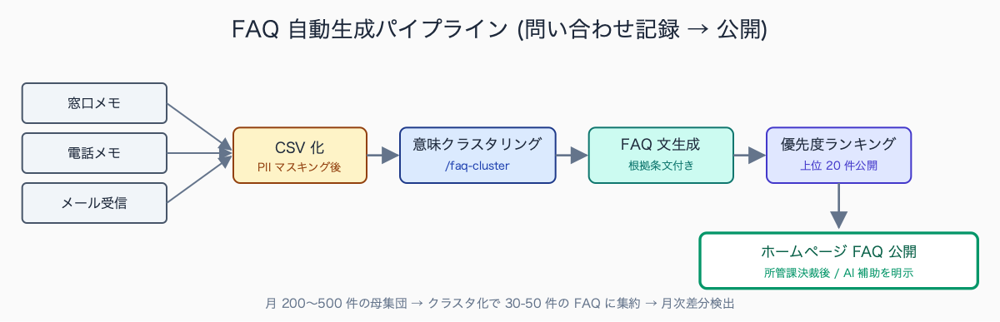
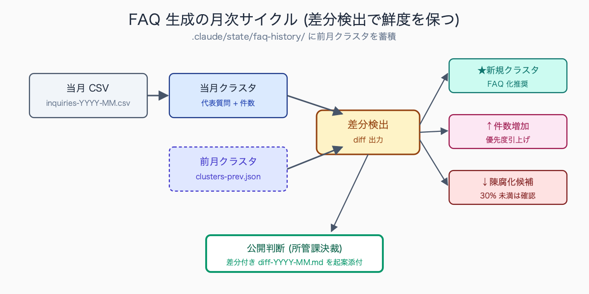

# 住民問い合わせ FAQ を Claude Code で自動生成

## はじめに

窓口業務をしていると、同じ質問が繰り返し来ることに気づく。「税の納付書を紛失したらどうすればよいか」「住民票の取得に何が必要か」「保育園の入所申込はいつから」など、内容は同じでも質問の言い回しが少しずつ違う。これらを FAQ ページに整理したいと思いながら、工数が確保できず後回しになっている自治体は多い。本記事では、過去の問い合わせ記録を Claude Code に読ませて FAQ を自動生成する手順を、無料で全公開する。スキル化までを 30 分で実装できる導線を示すので、読み終えたあとに `.claude/skills/faq-generator/` を `mkdir -p` するところから始めてほしい。

市民課・税務課・福祉部門の窓口で繰り返し届く典型的な質問として、「住民票はコンビニで取得できるか（マイナンバーカードの利用方法）」「税の納付書を紛失したが再発行できるか」「引っ越し手続きで必要な書類は何か（転入・転出・転居の違い）」「介護認定の申請から認定までどれくらいかかるか」「保育園の入所申込はいつから受け付けるか」の 5 パターンが上位を占める。これらは制度説明としては定型回答可能だが、住民の言い回しが「失くした」「無くなった」「再発行したい」「もう一度ほしい」と多様なため、一覧化が後回しになっている自治体が多い。


<!-- SVG: flow | FAQ自動生成パイプライン -->


## TL;DR

- 過去の問い合わせメール・電話メモを Claude Code に読ませて FAQ を自動生成
- 質問を「意味クラスタリング → FAQ 文生成 → 優先度付け」の 3 段階で処理
- 回答案は要綱・例規集から引用させて根拠を明示。所管課決裁前のたたき台に使う
- 月 1 回スキル実行で FAQ の鮮度を保つ。Memory に過去クラスタを蓄積して差分検出
- 公開前は必ず所管課の確認。AI 補助を明示する自治体が増えている

## 背景: なぜ公務員にこの課題があるか

住民問い合わせは、(1) 件数が膨大、(2) 質問の言い回しが多様、(3) 回答に複数課が関わる、(4) 制度改正で内容が陳腐化する、という 4 重の難しさがある。一つひとつを人力で FAQ 化するには時間が足りない。

一方で、問い合わせ記録自体は窓口メモ・コールセンター記録・電子メール受信箱に蓄積されている。データはあるのに整理されない、というのが現状の構造的課題だ。LGWAN 系メールサーバから前月分の問い合わせメールを CSV エクスポートし、窓口受付簿の Excel を統合すれば、月 200〜500 件の母集団が手元に揃う。

人口 5-20 万人規模の市役所では、年間の住民問い合わせ件数は窓口・電話・メール合計で 5 万-15 万件程度になる例が多い。市民課・税務課・国保年金課・福祉部門・子育て支援課の 5 部門で全体の 7 割を占めるのが典型的な分布で、特に税務課と市民課の 2 部門で 4 割超を占める自治体も珍しくない。コールセンターを設置している中核市では集約が進む一方、それ以外の自治体では各課窓口に分散し、データ統合の前段階で詰まるケースが多い。月次で 1 部門あたり 1,000-3,000 件規模となる計算だ。

## 手順 / 解説

### Step 1: 問い合わせ記録を整形

問い合わせメモを以下の CSV にまとめる。個人情報 (氏名・住所・電話番号) は LGWAN 端末側のスクリプトで除去してから Claude に渡す。

```csv
date,channel,category,question_raw,answered_by,answer_minutes
2026-04-01,窓口,税務,納付書を失くした,税務課,5
2026-04-02,電話,税務,口座振替の申込方法,税務課,3
2026-04-03,メール,住民,住民票がコンビニで取れるか,市民課,7
2026-04-03,窓口,税務,引っ越したけど前の納付書がない,税務課,8
2026-04-04,電話,福祉,介護認定の更新時期は,介護保険課,12
```

マスキング自動化のため `.claude/hooks/mask-pii.sh` を用意し、`PreToolUse` Hook で Read 対象 CSV を自動マスキングする。`.claude/settings.json` に以下を追加:

```json
{
  "hooks": {
    "PreToolUse": [{
      "matcher": "Read",
      "hooks": [{ "type": "command", "command": "bash .claude/hooks/mask-pii.sh" }]
    }]
  }
}
```

### Step 2: Claude Code に意味クラスタリングを依頼

```text
# Subagent: faq-clusterer

OUTPUT FORMAT: 1 markdown table only.
Columns: クラスタID | 代表質問 | 件数 | サンプル質問（3件・各≤20字） | 主管課 | 共通根拠条文

入力: /tmp/faq-input/inquiries-{YYYY-MM}.csv

クラスタリング基準:
- 同じ手続き・同じ制度を問う質問は同一クラスタ
- 言い回しが違っても意味が同じなら統合
  例: 「納付書紛失」「納付書失くした」「再発行してほしい」→ クラスタ「納付書再発行」
- 件数 3 件未満のクラスタは末尾に「その他」として集約
- 複数課にまたがる質問は主管課を「/」区切りで列挙

末尾に「クラスタ総数」「FAQ化推奨件数（5件以上のクラスタ数）」を 2 行で。
```

> 📸 [スクリーンショット] /faq-cluster 実行後のクラスタ表（質問内容は架空、課名は黒塗り）

### Step 3: クラスタごとに FAQ 文を生成

```text
# Subagent: faq-writer

OUTPUT FORMAT: 1 FAQ block per cluster.

各クラスタについて、住民向け FAQ を作成してください。

入力例:
クラスタ ID: 002
代表質問: 納付書再発行
件数: 27 件
サンプル質問:
- 納付書を失くした
- 引っ越しで前の納付書がない
- 督促状が来たけど元の納付書が見当たらない
参照根拠:
- /tmp/faq-input/reference/〇〇市市税条例.txt 第XX条
- /tmp/faq-input/reference/納税案内パンフレット-2026.pdf p.5

出力フォーマット（このまま CMS に貼り付け可能な markdown）:
### Q. [住民の言葉での質問・30字以内]
**A.** [回答 3-5 文・読みやすさスコア good を目指す]

- **根拠**: [条例・要綱の該当箇所]
- **関連手続き**: [次に必要な行動を箇条書き 2-3 個]
- **問合先**: 〇〇課 (内線 XXXX / 受付時間 8:30-17:15)
- **最終更新**: 2026-05-18 / AI下書き → △△担当確認済み
```

### Step 4: FAQ の優先公開順を決める

```text
# Subagent: faq-prioritizer

OUTPUT FORMAT: 1 markdown table only.
Columns: 順位 | クラスタID | 代表質問 | スコア | 公開推奨期

スコア計算式:
score = log10(件数) × 2 + 主管課数 × 1 + 回答難易度（1-5）× 0.5

「回答難易度」は以下で判定:
- 1: 単発回答（コンビニで取れますか等）
- 3: 制度説明が必要（介護認定の流れ等）
- 5: 個別判断が必要（特例措置の適用可否等）

上位 20 件を「初回公開候補」として赤字、21-40 件を「次回公開候補」として通常字で出力。
```

### Step 5: 月次更新のスキル化

```markdown
<!-- .claude/skills/faq-generator/SKILL.md -->
---
name: faq-generator
description: 月次の問い合わせ CSV から FAQ を自動生成・更新差分を検出
---

# faq-generator

## Usage
1. /tmp/faq-input/inquiries-{YYYY-MM}.csv に月次データを配置
2. /tmp/faq-input/reference/ に要綱・例規集 txt/pdf を配置
3. `/faq-generator [YYYY-MM]` で起動
4. /tmp/faq-output/faq-{YYYY-MM}.md と diff-{YYYY-MM}.md が生成

## 差分検出（既存 FAQ との比較）
- .claude/state/faq-history/clusters-{prev-month}.json と当月クラスタを diff
- 新規クラスタは「★新規」、件数増加クラスタは「↑増加」フラグ
- 件数が前月の 30% 未満になったクラスタは「↓陳腐化候補」として確認推奨
```

`.claude/state/faq-history/` にクラスタ履歴を蓄積することで、FAQ の鮮度問題 (制度改正で問い合わせ傾向が変わるが、ホームページの FAQ は古いまま) を解消できる。

既存 FAQ ページを持つ自治体の更新頻度の実態として、年 1 回以下の更新にとどまる例が大半を占める。サイト全体改修のタイミング (3-5 年に 1 回) でしか更新されないケースもあり、制度改正後も古い回答が掲載されたままになる陳腐化が深刻な問題となっている。月次の差分検出スキルを組み込めば「件数が前月の 30% 未満」「新規クラスタ出現」というフラグで陳腐化候補と新規ニーズを自動抽出でき、所管課への確認依頼を機械的に発動できる。これだけで FAQ の鮮度を年単位から月単位に引き上げられる。


<!-- SVG: structure | 月次サイクルと差分フラグ -->


## よくあるつまずきポイント

1. **個人情報の混入** — Step 1 の CSV 化時点で住所・氏名・電話番号は必ず除去。Hooks の `PreToolUse` で `mask-pii.sh` を強制実行する設定が安全
2. **複数課にまたがる質問** — クラスタリング時に複数の主管課を許容するフィールド設計に。「保育園入所 + 児童手当」のようにライフイベント横断の質問が頻発
3. **回答の根拠が古い** — 要綱・例規集も同時に最新版を Claude に渡す。`/tmp/faq-input/reference/` を毎月更新し、Step 3 のプロンプトで「最終改正日」を必ず引用させる
4. **AI 生成と明示すべきか** — 住民向け公開時は「AI が下書き、職員が確認」と明示する自治体が増えている。Step 3 の出力末尾に「AI下書き → 担当者確認済み」を入れて運用
5. **公開前確認は省略不可** — 法令解釈を含む FAQ は所管課の決裁 (係長 → 課長) を経る。Subagent 出力をそのままアップロードしない

## まとめ

FAQ 自動生成は「データはあるのに整理工数がない」という公務員のあるあるを解消する典型ユースケースだ。Claude Code でクラスタリング → 文章化 → 優先度付けまで一気通貫にできる。月次スキルとして組み込めば、FAQ の鮮度問題も解決する。本記事の手順をそのまま流用して、自治体ホームページの FAQ ページを今月中に立ち上げてほしい。`.claude/skills/faq-generator/` を作って前月分の問い合わせ CSV を投入する、ここまでが「読了後 30 分」のゴールだ。

## 関連記事 / 次に読む

- 苦情メール返信案を 5 パターン出す prompt
- 広報誌の原稿を Claude Code でリライト
- 個人情報を Claude に送らずに AI 活用する 3 つの設定
