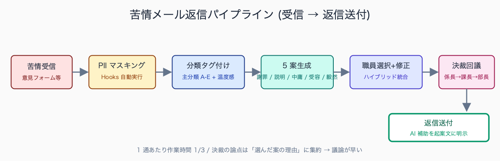
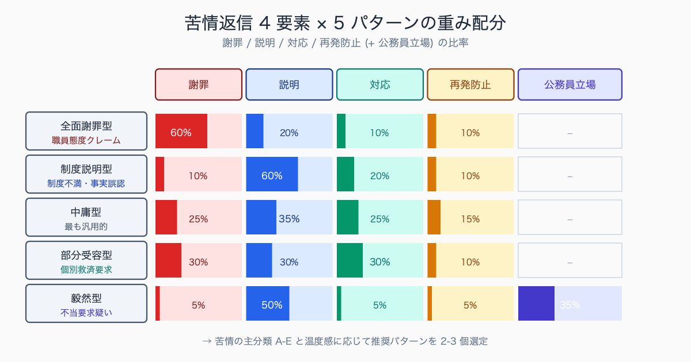
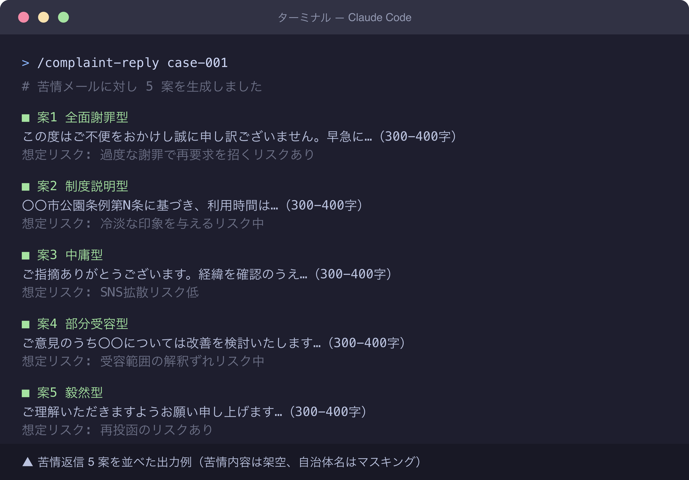
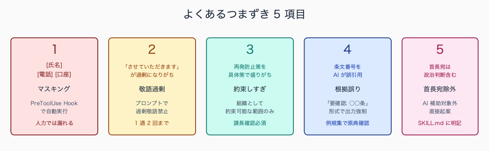

# 苦情メール返信案を 5 パターン出す prompt

## はじめに

住民対応窓口や首長への意見メールフォームには、毎日のように苦情・要望が届く。返信文の作成は経験のある職員にとっても消耗の大きい業務だ。

「相手の感情に配慮しつつ、できないことはできないと伝える」「謝罪と説明の比率を間違えない」「再発防止策を約束するかどうか組織判断を仰ぐ」といった意思決定を、1 通ごとに繰り返す。係長が修正、課長で再修正、部長決裁で更に手直し、首長レクで「もう少し強めに」と差し戻され、**1 通の返信に半日** かかることも珍しくない。

本記事では Claude Code に苦情返信案を **5 パターン** 出させて、職員が最適案を選ぶ運用を示す。`.claude/skills/complaint-reply/` をスキル化することで、決裁ラインでの議論の質を上げる導線を共有する。

住民対応の前線にいる職員からは、苦情返信 1 通あたり起案から決裁完了まで **3-5 時間** を要するという声が多い。内訳は次のとおりだ。

- 苦情本文の読解と分類に 20-30 分
- 返信案ドラフト作成に 60-90 分
- 係長レビューと修正対応に 30-60 分
- 課長決裁と再修正に 30-60 分
- 部長以上の確認が必要な案件はさらに 60-120 分

週に 3-5 件の苦情対応を抱える係長級では、これだけで **週 15-25 時間** が消費される計算となり、本来業務を圧迫する典型的な負荷源となっている。

執筆者は元自治体職員。現在は Claude Code を使い、47 都道府県の統計サイト stats47.jp（約 2,000 のランキングを毎日自動更新）を個人で開発・運用している。


<!-- SVG: flow | 苦情メール返信パイプライン -->


## TL;DR

- 苦情メール返信は「謝罪」「説明」「対応」「再発防止」の 4 要素の組み合わせ
- Claude Code に 5 パターン (重み配分違い) を生成させて職員が選ぶ
- パターン分類: 全面謝罪型 / 制度説明型 / 中庸型 / 部分受容型 / 毅然型
- 守秘のため苦情本文の固有名詞は Hooks で事前マスキング (氏名・住所・電話・口座番号)
- 上司決裁前のたたき台として運用、最終文責は職員。AI 補助を起案文に明示

## 背景: なぜ公務員にこの課題があるか

苦情返信のしんどさは **「文章作成」より「意思決定」** にある。何をどこまで認めるか、再発防止策をどこまで約束するか、これを 1 通ごとに判断する精神的負荷が高い。

さらに係長・課長の決裁を経る間に「もう少し丁寧に」「ここは強めに」「謝罪はもう少し抑え気味に」と修正指示が入り、書き直しが繰り返される。

複数案を最初から並べると、決裁のラインで選択肢を提示できる。「A 案は全面謝罪寄り、C 案は中庸、E 案は毅然」と幅を示せば、組織としての姿勢決定がスムーズになる。係長は「中庸型 (C 案) ベースに、結びだけ全面謝罪型 (A 案) から借用」と決裁文書に書ける。Claude Code はこの「複数案生成」を得意とする。

決裁ラインで揉める典型例として、係長は「中庸型でよい」と判断したものの課長が「もう少し謝罪を強めるべき」と差し戻し、修正後に部長が「ここまで謝罪すると先例化するので抑えよ」と再度差し戻す、という上下方向のブレが報告されている。

複数案提示型を導入した自治体では、初回起案時に 5 案を並べて「係長案：中庸型、課長判断要：全面謝罪型または毅然型」と判断ポイントを明示することで、**決裁回議の往復が平均 3 回から 1.5 回** に減ったという事例がある。意思決定の構造を可視化することで、組織的な合意形成が加速する。


<!-- SVG: structure | 4要素×5パターン重み配分 -->


## 手順 / 解説

### Step 1: 苦情本文を分類タグ付け

返信パターンを選ぶ前に、苦情の性質を分類する。`.claude/skills/complaint-reply/reference/categories.yml` に定義しておく。

```yaml
# .claude/skills/complaint-reply/reference/categories.yml
categories:
  - id: A
    name: 制度・サービスの不満
    example: 「窓口の対応時間が短い」「制度が分かりにくい」
    recommended_patterns: [制度説明型, 中庸型]
  - id: B
    name: 職員の態度・対応
    example: 「窓口で冷たくされた」「電話対応が悪かった」
    recommended_patterns: [全面謝罪型, 中庸型]
  - id: C
    name: 制度自体の存廃要求
    example: 「〇〇制度を廃止せよ」「税金を返せ」
    recommended_patterns: [制度説明型, 毅然型]
  - id: D
    name: 個別救済の要求
    example: 「私だけ例外的に〇〇してほしい」
    recommended_patterns: [制度説明型, 部分受容型, 毅然型]
  - id: E
    name: 事実誤認による批判
    example: 事実と異なる前提での非難
    recommended_patterns: [制度説明型, 毅然型]
```

### Step 2: 苦情本文を Claude Code に渡す (マスキング後)

固有名詞 (住民氏名・職員氏名・係名) は `.claude/hooks/mask-pii.sh` で事前マスキング。`.claude/settings.json` の Hook 設定:

```json
{
  "hooks": {
    "PreToolUse": [{
      "matcher": "Read",
      "hooks": [{
        "type": "command",
        "command": "bash .claude/hooks/mask-pii.sh"
      }]
    }]
  }
}
```

`mask-pii.sh` の中身 (簡易版、stdin から hook payload JSON を受け取る公式仕様準拠):

```bash
#!/bin/bash
# Claude Code Hooks は stdin から JSON payload を渡す
# {"tool_input":{"file_path":"..."}} 形式
TARGET=$(jq -r '.tool_input.file_path // empty')
[ -z "$TARGET" ] && exit 0
[[ "$TARGET" != *"/complaint-input/"* ]] && exit 0
# 氏名（姓スペース名）→ [氏名]
sed -i.bak -E 's/[一-龥]{1,3}[ 　][一-龥]{1,3}/[氏名]/g' "$TARGET"
# 電話番号 → [電話]
sed -i -E 's/0[0-9]{1,4}-[0-9]{1,4}-[0-9]{4}/[電話]/g' "$TARGET"
# 7桁口座番号 → [口座]
sed -i -E 's/[0-9]{7}/[口座]/g' "$TARGET"
rm -f "${TARGET}.bak"
```

その上で Subagent を起動。

```text
# Subagent: complaint-classifier

OUTPUT FORMAT: 1 markdown table only.
Columns: 主分類 | 副分類 | 温度感 | 求めているもの | 推奨パターン

入力: /tmp/complaint-input/{ticket-id}.txt（マスキング済み）

判定基準:
- 主分類: categories.yml の A-E から最も近いもの 1 つ
- 副分類: 該当があれば（複数）
- 温度感: 冷静 / やや感情的 / 激しい
- 求めているもの: 謝罪 / 説明 / 対応 / 制度変更 / 単に話を聞いてほしい
- 推奨パターン: 主分類の recommended_patterns から、温度感に応じて 2-3 個選ぶ
```

### Step 3: 5 パターンの返信案を生成

```text
# Subagent: complaint-reply-writer

OUTPUT FORMAT: 5 sections (パターン1〜5), each with 300-400字 reply text.

Step 2 の分類結果をふまえ、以下の 5 パターンで返信案を作成してください。

パターン 1: 全面謝罪型
- 重み: 謝罪60% / 説明20% / 対応10% / 再発防止10%
- 文体: 丁寧、寄り添い。「ご不快な思いをおかけし誠に申し訳ございません」基調
- 禁止語彙: 「しかし」「ただし」「制度上」「規則により」（防衛的に聞こえる）

パターン 2: 制度説明型
- 重み: 謝罪10% / 説明60% / 対応20% / 再発防止10%
- 文体: 客観的、根拠明示。「〇〇条例第XX条に基づき」「総務省通知に従い」
- 必須要素: 法令・要綱の根拠を 1 つ以上明示

パターン 3: 中庸型
- 重み: 謝罪25% / 説明35% / 対応25% / 再発防止15%
- 文体: バランス重視。最も汎用的な定型
- 構成: 謝罪 1 段落 → 説明 1 段落 → 対応 1 段落 → 結び

パターン 4: 部分受容型
- 重み: 謝罪30% / 説明30% / 対応30%（一部受容） / 再発防止10%
- 文体: 共感しつつ範囲を区切る。「ご指摘の〇〇については承知しました。一方△△は…」
- 必須: 「受容する部分」と「受容しない部分」を明確に分離

パターン 5: 毅然型
- 重み: 謝罪5% / 説明50% / 対応5% / 再発防止5% / 公務員としての立場35%
- 文体: 礼儀正しく、しかし譲らない。「ご理解いただきますようお願い申し上げます」
- 用途: 事実誤認による批判、個別救済要求、不当要求が疑われる場合

各案は 300-400 字、本文のみ（「拝啓」等の前文不要）。
末尾に「想定リスク」を 1 行（例: 「再投函のリスクあり」「SNS拡散リスク低」）。
```


<!-- SVG: screenshot | 苦情返信 5 案を並べた出力例 -->

### Step 4: 職員が選ぶ + 微修正

5 案を見比べ、最も適切な案を選ぶ。実際の運用ではハイブリッドになる。

- ベース: 中庸型 (パターン 3)
- 結び: 全面謝罪型 (パターン 1) の最終段落を借用
- 根拠条文: 制度説明型 (パターン 2) から引用

職員はこの「組み合わせ判断」に集中できる。1 通あたりの作業時間は、ゼロから書く場合の 1/3 程度になる。

### Step 5: 決裁ラインへの提示

係長・課長への決裁時、次のように意思決定経路を示す。

```text
【件名】〇〇に関する苦情への返信案（決裁伺）

【経過】2026-05-18 着、対応期限 2026-05-25
【分類】主分類 B（職員態度）、温度感: やや感情的
【作成】Claude Code で 5 案生成、職員（□□）が「中庸型ベース + 全面謝罪型結び」で統合
【添付】5案全文、統合案、想定リスク評価
【判断依頼】統合案の文面・送付可否、再発防止策の組織約束範囲
```

この起案文があれば、係長・課長は「Claude が出した 5 案のうちなぜ中庸型を選んだか」「結びをなぜ全面謝罪型から借りたか」を職員に問う形で議論できる。決裁が早い。

上司の最終判断の傾向として、課長級では「中庸型 8 割・全面謝罪型 1.5 割・毅然型 0.5 割」が選ばれやすく、部長以上の決裁になると「中庸型 6 割・全面謝罪型 2 割・毅然型 1 割・部分受容型 1 割」と幅が広がる傾向がある。

特に部長以上は **「組織として何を約束するか」** の視点が強くなり、再発防止策の具体性に踏み込んだ修正指示が増える。首長レク段階では政治判断要素が加わるため、毅然型の採用率が上がる一方、全面謝罪型は議会答弁との整合性から慎重に扱われる傾向が見られる。

## よくあるつまずきポイント

1. **マスキング漏れ** — 苦情本文の固有名詞除去は人力では漏れる。Step 2 の Hooks で `mask-pii.sh` を自動実行。庁内の情シスに「苦情ファイル限定で正規表現置換する」と説明すれば許可が降りやすい
2. **AI 文体の不自然さ** — 「〜させていただきます」が過剰になりがち。プロンプトで「過剰敬語禁止」「『させていただく』は 1 通あたり 2 回まで」と明示
3. **再発防止策の安易な約束** — Claude は具体策を盛り込みがち。「再発防止」セクションは Step 3 で「組織として約束可能な範囲のみ」と制約し、Step 5 で課長確認を必須にする
4. **誤情報の混入** — 制度説明型で AI が誤った根拠を挙げることがある。条文番号は必ず人間が `〇〇市例規集` で原典確認。Subagent には「条文番号は『要確認: 〇〇条』形式で出力し、人間検証を強制」させる
5. **首長宛メールは別運用** — 政治判断を含むものは AI 補助ではなく直接起案を原則に。`.claude/skills/complaint-reply/SKILL.md` 冒頭に「首長宛は対象外」と明記


<!-- SVG: infographic | つまずき5項目 -->


## まとめ

苦情返信の本質は **「組織として何を約束し、何を約束しないか」の意思決定** だ。Claude Code は意思決定そのものを代替できないが、選択肢を 5 つ並べることで意思決定を加速できる。

本記事のプロンプトをそのまま `.claude/skills/complaint-reply/` に保存すれば、明日の苦情対応から運用可能だ。`mask-pii.sh` を `.claude/hooks/` に置き、`settings.json` で `PreToolUse` フックを有効化する。ここまでが **「読了後 30 分」のゴール** だ。

---

### この続きは有料パートです

**こんな人におすすめ**

苦情・要望メールの返信文作成に 1 通半日かかっている、5 パターンの返信案を出す生成プロンプトをそのまま使いたい、苦情本文の個人情報を Hooks で自動マスキングしたい——住民対応窓口や広聴担当の方に向けた内容です。

**この続きで読めること**

> - categories.yml 完全版 (10 分類、経路情報含む)
> - 5 パターン生成プロンプトの完全版 (語彙制限リスト、温度感別調整、役職別補正)
> - マスキング Hooks 設定例 (.claude/hooks/mask-pii.sh + settings.json)

単体購入は ¥300。マガジン「公務員 × Claude Code 実務活用ガイド」（¥1,980）なら、この記事を含む有料 23 本すべてが読めます。

ここから先は有料部分: ¥300

### 有料セクション 1: categories.yml 完全版

苦情を **10 分類** に拡張した完全版を提供する。本文の 5 分類に加え、「議員紹介経由」「マスコミ問合せ経由」「SNS 拡散リスクあり」「複数自治体への同文送付」「過去の継続クレーマー」など、文章だけでなく経路情報も含めた分類だ。

各分類に「想定対応時間」「決裁ライン推奨」「広報課への共有要否」を併記し、Subagent が経路判定までするプロンプト例も付属。

経路別の対応難易度には明確な差がある。議員紹介経由は「議員への報告」が決裁ラインに追加されるため通常案件の 1.5-2 倍の工数となり、答弁内容と返信内容の整合性も求められる。

マスコミ問合せ経由はさらに難易度が高く、24-48 時間以内の回答期限と広報課との同時並行調整が必要で、回答文の一字一句が報道される前提で精度が要求される。SNS 拡散リスクのある案件は広報課・情報政策課と連携した「炎上対応プロトコル」が起動し、通常の苦情対応とは別フローで処理される自治体が増えている。

### 有料セクション 2: 5 パターン生成プロンプト完全版

本文の Step 3 のプロンプトに、以下を追加した完全版:

- パターン別の語彙制限リスト (全面謝罪型では使わない言葉 50 語、毅然型では避ける言葉 30 語、各パターンの推奨フレーズ 20 個)
- 苦情の温度感別の出力文字数調整 (冷静: 250 字 / やや感情的: 350 字 / 激しい: 400 字)
- 役職別の最終決裁者を想定した文体補正 (係長止まり / 課長決裁 / 部長決裁 / 副市長決裁 で語彙が変わる)
- 過去クレーマー (継続案件) の場合の「前回返信参照」プロンプト追加

### 有料セクション 3: マスキング Hooks 設定例

`.claude/hooks/mask-pii.sh` の完全版。本文の簡易版に対し、以下を追加:

- 住所パターン（〇〇市〇〇町X-X-X 形式の正規表現 5 種）
- 金融機関口座（銀行コード + 支店コード + 7-8桁口座）
- マイナンバー (12 桁) の検出と完全削除
- ログ機能（マスキング履歴を `.claude/state/mask-log/` に記録、監査対応用）

`.claude/settings.json` での Hook 登録方法、`PreToolUse` `PostToolUse` の使い分け、`Write` ツールでの誤送信防止 (`mask-pii.sh --check` で送信前検証) も併記。

情報セキュリティポリシー上、外部 LLM への送信が許容されるかの線引きは自治体ごとに異なるが、典型例として「個人を特定可能な情報（氏名・住所・電話・口座・マイナンバー）を完全除去した上で、かつ送信ログが監査可能な形で保存されること」を最低条件とする自治体が増えている。

さらに「LGWAN 接続端末ではなくインターネット系端末から送信」「業務 PC 上のスクリプトでマスキング処理を完結」「送信内容の事前承認フローを整備」の **3 点** を満たせば許容範囲とする内規が広がりつつある。情シスへの事前照会時はこの 3 点セットを提示することで承認が得られやすい。

## 関連記事 / 次に読む

- 住民問い合わせ FAQ を Claude Code で自動生成
- 個人情報を Claude に送らずに AI 活用する 3 つの設定
- Claude Code Hooks で個人情報マスキングを自動化する

<!-- circulation-footer:v2 -->

---

## 「公務員 × Claude Code」シリーズ

本記事は、自治体職員が Claude Code を日々の業務に活かすための全 31 本シリーズの 1 本です。環境構築・議事録・議会答弁・セキュリティ・データ活用・組織導入まで、関心のあるテーマから読み進められます。

シリーズの全記事はマガジンにまとめています。他の記事はこちらからどうぞ。

https://note.com/stats47/m/m512ad7023815

Claude Code に触れるのが初めての方は、まず導入記事「Claude Code とは何か — ターミナル未経験の公務員のための導入ガイド」から読むのがおすすめです。
