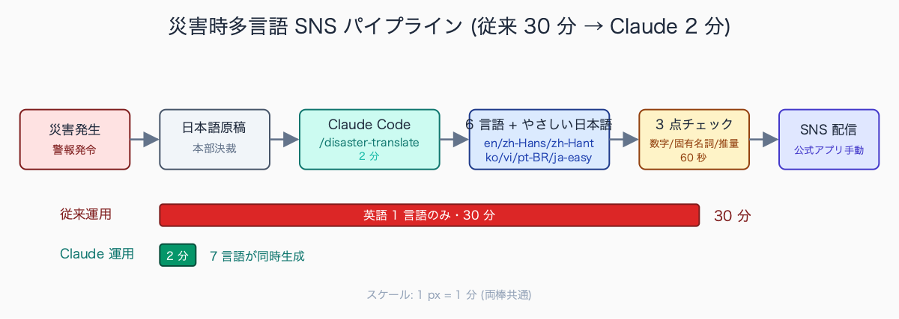
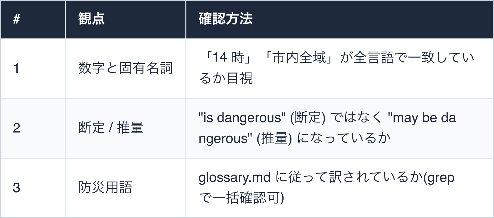
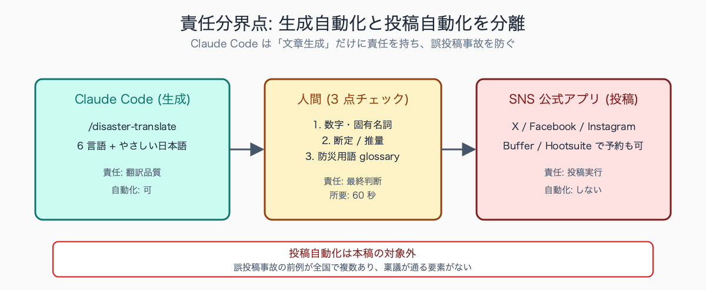
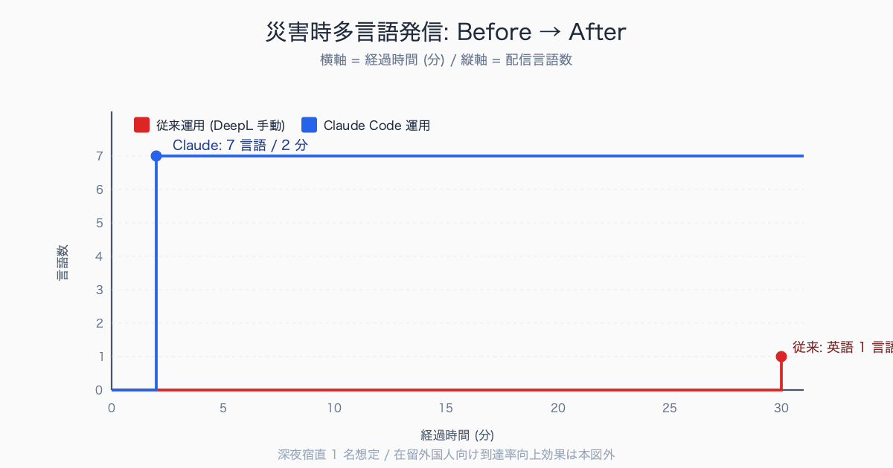

# 災害時の SNS 発信文を Claude Code で多言語化

## はじめに

午前 3 時 12 分、線状降水帯が市域にかかり「土砂災害警戒情報」が発令された。広報担当の机に電話とチャットが同時に鳴る。「英語、中国語、ベトナム語で X と Facebook と Instagram、5 分で出してください」。

深夜の宿直は 2 人、片方は防災対策本部に詰めている。残った 1 人が DeepL のタブを 6 つ開いて、ハッシュタグを手で打ち、絵文字を消し、「警戒区域」を訳しわけ、文字数を 280 に削る。

**30 分後、英語版だけ間に合う**。翌朝、在留外国人支援団体から「ベトナム語が出てなかったですよね」とメッセージが届く。

これが多くの自治体広報の現在地だ。本稿は、`.claude/skills/disaster/translate-sns/SKILL.md` 1 枚と、災害種別ごとのテンプレ 4 枚で、**この 30 分を 2 分に圧縮する**設計を示す。Claude Code を入れた職員の机から始められる、起案・決裁ゼロの個人改善ルート。

災害時広報の修羅場として典型的に語られるのは、深夜から早朝にかけての気象警報発令時だ。中規模市 (人口 10-30 万人) の宿直体制では広報担当が 1-2 人、片方は対策本部詰めで実質 1 人が SNS と Web の更新を回す。**1 言語あたり原稿確定から配信までに 15-25 分、6 言語なら 90-150 分**かかる例が珍しくない。

詰まりやすい工程は「警報名・地区名・避難所名の固有表現を訳しわける」「文字数を 280 字に詰める」「絵文字とハッシュタグを整える」の 3 つだ。深夜の判断負荷とも相まってベトナム語・ポルトガル語など職員に話者が少ない言語ほど後回しになり、結果的に翌朝の在留外国人支援団体からの問い合わせにつながる。

執筆者は元自治体職員。現在は Claude Code を使い、47 都道府県の統計サイト stats47.jp（約 2,000 のランキングを毎日自動更新）を個人で開発・運用している。

## TL;DR

- 災害時の多言語 SNS は「翻訳精度」より「リードタイム」が支配的(誤訳より無発信が致命的)
- `.claude/skills/disaster/translate-sns/` を 1 個作れば、日本語原稿 → 6 言語が 1 プロンプトで完結
- 「やさしい日本語」は同じスキル内で生成。在留外国人(技能実習・特定技能)に最も効く
- 翻訳結果は必ず人間が最終確認。チェック観点は「数字・固有名詞・断定/推量」の 3 点だけ
- LGWAN PC で動かせない場合は、宿直机の個人 PC + テザリングで運用設計する(後述)


<!-- SVG: flow | 災害発生→7 言語出力 30分→2分 -->

## 背景: なぜ公務員にこの課題があるか

総務省「在留外国人統計」(2024 年 6 月時点) によれば、**在留外国人は約 358 万人**。10 年で 1.5 倍に増えた。国籍別では中国・ベトナム・韓国・フィリピン・ブラジルが上位。市町村単位で見ると、人口の 5% 超を在留外国人が占める自治体は珍しくない。

在留外国人比率は自治体間でばらつきが大きい。総務省「住民基本台帳に基づく人口、人口動態及び世帯数」によれば、群馬県大泉町・愛知県豊田市の一部地区・東京都新宿区・大阪市生野区などでは**住民人口の 10-20%** を在留外国人が占める。

地方都市でも工業団地・農業地帯を抱える自治体では人口の 5-8% が在留外国人というケースが見られ、上位国籍はブラジル・ベトナム・中国・フィリピン・ネパールの組み合わせが典型的だ。庁内の住民基本台帳担当 (市民課・戸籍係) に問い合わせれば、町丁目別 × 国籍別の集計が数分で確認できる構成になっている自治体が多い。

ところが現場の体感はこうだ。

1. **日本語原稿を書くだけで精一杯**: 災害対策本部の判断が下りるまで原稿は確定しない。本部決裁が 14:50 に下りて、配信締切が 15:00、という運用が常態化
2. **翻訳ツールに個人情報を入れたら怒られる**: 情報セキュリティポリシーで「無料翻訳ツール禁止」が明記されている自治体が多い。DeepL Pro / Google Translate API の契約稟議は半年仕事
3. **誤訳で苦情が来る**: 「避難所」を "shelter" と訳して、ホームレス支援施設と混同された、という事例が複数自治体から報告されている

結果、英語と中国語の 2 言語だけ、配信は 30 分遅れ、という運用に落ち着く。

Claude Code は、この 3 つのボトルネックをまとめて解く。Anthropic との利用契約は**「個人 / 組織アカウント + Zero Data Retention 設定」で個人情報の二次利用を防げる**(後述)。スキル機能で出力フォーマットを固定し、複数言語を並列生成する。

## 手順 / 解説

### ステップ 1: スキル定義 (SKILL.md) を書く

`.claude/skills/disaster/translate-sns/SKILL.md` を作る。これが「災害時の型」になる。

```markdown
---
name: disaster-translate
description: 災害時 SNS 発信文を 6 言語 + やさしい日本語に翻訳する。280 字以内、絵文字なし、ハッシュタグ統一。
---

# disaster-translate

## 入力
- 日本語原稿(280 字以内、X/Twitter 投稿想定)
- 災害種別: flood / earthquake / blackout / evacuation / other
- 対象エリア: 市町村名 or "全域"
- 配信時刻: ISO8601 (YYYY-MM-DDTHH:MM+09:00)

## 出力
以下の順で、各言語 1 ブロックずつ出力する。
1. en (英語)
2. zh-Hans (簡体中文)
3. zh-Hant (繁體中文)
4. ko (韓国語)
5. vi (ベトナム語)
6. pt-BR (ブラジル ポルトガル語) ※在留ブラジル人比率高い自治体向け
7. ja-easy (やさしい日本語、NHK 方式)

各ブロックの構成:
- 1 行目: 言語コード
- 2 行目以降: 本文(280 字以内、URL 含めて 240 字推奨)
- 末尾: ハッシュタグ #災害情報 #<エリア> + 当該言語のハッシュタグ(例: #DisasterAlert)

## 制約
- 個人名・電話番号・番地は入力に含めない(入っていたら冒頭で拒否)
- 「〜の可能性があります」は推量形で訳す(en: "may" / "could be" / zh: "可能会")
- 「警戒区域」「避難所」「避難勧告」「避難指示」「特別警報」は対訳辞書(下記 reference/glossary.md)に従う
- やさしい日本語は語彙レベル N5(日本語能力試験)を基準。漢字には全てルビ
- 絵文字・顔文字は使わない(視覚障害者の読み上げ環境で混乱)

## 検証
出力後、自動で以下をチェック:
- [ ] 全 7 言語が揃っているか
- [ ] 各言語の文字数が 280 以下か
- [ ] ハッシュタグが統一されているか
- [ ] 数字(時刻・人数・距離)が全言語で一致しているか
```

`reference/glossary.md` には防災用語の対訳表を置く。

```markdown
| 日本語 | en | zh-Hans | ko | vi | pt-BR |
|---|---|---|---|---|---|
| 避難指示 | Evacuation Order | 避难指示(强制) | 피난 지시 | Lệnh sơ tán | Ordem de evacuação |
| 避難勧告 | Evacuation Advisory | 避难劝告 | 피난 권고 | Khuyến cáo sơ tán | Aviso de evacuação |
| 警戒区域 | Restricted Area | 警戒区域 | 경계 구역 | Khu vực cảnh báo | Área restrita |
| 土砂災害 | Landslide | 泥石流 | 토사 재해 | Lở đất | Deslizamento |
| 特別警報 | Emergency Warning | 特别警报 | 특별 경보 | Cảnh báo đặc biệt | Alerta especial |
```

### ステップ 2: 実行プロンプト (コピペで動く)

```
/disaster-translate

【日本語原稿】
本日 14 時、市内全域に大雨警報が発令されました。
土砂災害の危険があります。ハザードマップで「土砂災害警戒区域」に
お住まいの方は、最寄りの指定避難所への移動を検討してください。
避難所一覧: https://example.city/shelter

【災害種別】flood
【対象エリア】市内全域
【配信時刻】2026-07-12T14:05+09:00
```

期待される出力(en の例):

```
[en]
At 2:00 PM today, a Heavy Rain Warning has been issued for the entire city.
There is a risk of landslides. If you live in a designated Landslide
Hazard Zone, please consider moving to your nearest evacuation shelter.
Shelter list: https://example.city/shelter
#DisasterAlert #CityName #DisasterInfo
```


<!-- SVG: screenshot | /disaster-translate で 7 言語が並列出力された画面 -->

### ステップ 3: 人間チェック 3 点(これだけ)

翻訳結果は必ず人間が見る。災害時の判断負荷を下げるため、チェック観点は 3 つに絞る。


<!-- SVG: table | # / 観点 / 確認方法 -->

3 点とも OK なら 60 秒で配信に進める。NG が出たら該当言語だけ再生成。

### ステップ 4: 災害種別テンプレを置く

毎回プロンプトを書くと、災害時にミスする。`.claude/skills/disaster/translate-sns/templates/` にひな型を置く。

```
templates/
  flood.md       # 豪雨・洪水(警報→注意報→特別警報の 3 段)
  earthquake.md  # 地震(震度別 + 津波情報の有無)
  blackout.md    # 停電(復旧見込み時刻の入れ方)
  evacuation.md  # 避難勧告 → 避難指示(レベル 4/5)
```

`flood.md` の中身例:

```markdown
# 豪雨ひな型(レベル 3 警戒)

【日本語原稿】
本日 {HH} 時、{エリア} に {警報種別} が発令されました。
{災害リスク} の危険があります。
{対象住民} の方は、{推奨行動} を検討してください。
詳細: {URL}

【災害種別】flood
【対象エリア】{エリア}
【配信時刻】{ISO8601}

【埋める箇所】
- HH: 配信時刻の時(24h)
- エリア: 市内全域 / ○○地区 / ○○川流域
- 警報種別: 大雨警報 / 大雨特別警報 / 洪水警報
- 災害リスク: 土砂災害 / 河川氾濫 / 浸水
- 対象住民: ハザードマップの「○○警戒区域」にお住まいの方
- 推奨行動: 最寄りの指定避難所への移動 / 垂直避難 / 自宅 2 階以上での待機
- URL: shelter / hazard map / 配信元アカウント
```

深夜 3 時、係長の判断 1 つで穴埋め 5 箇所だけ。残りはスキルが自動。

### ステップ 5: 配信は別ツール (自動化しない)

X / Facebook / Instagram への投稿自動化までやろうとすると、誤投稿リスクが跳ね上がる。Claude Code 側は「文章生成」だけに責任を持つ。

```
生成 → 人間チェック (3 点) → 手動投稿(各 SNS の公式アプリ)
                              └ Buffer / Hootsuite で予約も可
```

「投稿自動化」は本稿の対象外。誤投稿事故の前例は全国で複数あり、稟議が通る要素がない。


<!-- SVG: structure | 生成自動化と投稿自動化の責任分界 -->

防災用語の多言語対訳ルールが整備されている自治体は限定的だ。都道府県レベルでは在留外国人が多い愛知県・群馬県・静岡県などで「外国人向け防災情報多言語化ガイドライン」のような文書が公開されているが、**市町村単位では未整備のケースが大半**となる。

総務省「災害時外国人支援情報コーディネーター養成研修」教材や、自治体国際化協会 (CLAIR) が提供する「多言語表示シート」が事実上の参照基準として使われる場面が多い。庁内に対訳ルールが無い場合、まず防災危機管理課か国際交流担当に「県マニュアルがあるか」「CLAIR シートを採用するか」を確認するのが最短ルートになる。

## よくあるつまずきポイント

1. **やさしい日本語をナメる**: 「避難してください」を「にげてください」に変えるだけ、ではない。語彙レベル統制(N5)・全漢字ルビ・1 文 20 字以内の 3 条件が必要。SKILL.md で「やさしい日本語ガイドライン (出入国在留管理庁 + 文化庁、2020 年策定) のレベル感に揃える」と明示すると精度が安定する (NHK NEWS WEB EASY を補助参照する場合は 2025 年に受信料契約者向けへ仕様変更があり、参照不可なケースがある点に注意)
2. **絵文字の落とし穴**: X では絵文字 1 文字が 2-4 文字分のカウント。災害発信で絵文字を使わない方針をスキル定義で固定する。「視覚障害者の読み上げで混乱する」を理由にすると庁内合意も取りやすい
3. **ハッシュタグの不統一**: 自治体ごとに #防災 #災害 #緊急 と表記がバラつくと検索性が落ちる。NHK・気象庁が使う #災害情報 を統一ハッシュとして SKILL.md で固定
4. **個人情報の混入**: 「○○地区の田中さん宅周辺で土砂崩れ」のような原稿を入れる人が必ずいる。スキル冒頭で「個人名・番地・電話番号を含む原稿は拒否」と明示し、Hook で自動弾きも仕込む(後述・有料部)
5. **平時に動作検証していない**: 災害当日に「動かない」が最悪。`.github/workflows/disaster-translate-monthly-drill.yml` で月 1 自動テストを回す(過去 1 年の実発信文を入力に再生成 → diff チェック)

## まとめ

災害時の多言語発信は、技術ではなく**「型」で勝負が決まる**。Claude Code の Skills は、その型を 1 ファイル + テンプレ 4 枚に圧縮し、誰が宿直当番でも同じ品質を出せるようにする。

最初の 1 本を作るのに 3 時間、テンプレ整備に 5 時間。運用に乗せれば**1 災害あたり 30 分 → 3 分に圧縮**できる。年 5 災害として、年 2 時間以上の削減 + 在留外国人への情報到達率向上。やる価値はある。


<!-- SVG: infographic | 30分1言語 vs 2分7言語 -->

## 関連記事 / 次に読む

- (無料) 個人情報を Claude に送らずに AI 活用する 3 つの設定 (Zero Data Retention / マスキング / オフライン)
- (有料) Claude Code Hooks で個人情報マスキングを自動化する
- (有料) MCP server を庁内システムにつなぐ実験 (架空 LGWAN 想定)

---

### この続きは有料パートです

**こんな人におすすめ**

深夜の災害発令時に多言語の SNS 発信を一人で回している、LGWAN 端末でもオフラインで翻訳を回せる構成が欲しい、災害種別ごとの SKILL.md テンプレをそのまま職場に持ち込みたい——防災・広報担当の方に向けた内容です。

**この続きで読めること**

> - LGWAN 環境で動かす「オフライン多言語化」構成 (Ollama + ローカル翻訳モデル llama3.2:3b)
> - 配信前の最終チェック自動化 (.claude/settings.json の Hooks で誤訳パターン検出 + 個人情報自動マスク)
> - そのまま使える 4 災害種別の SKILL.md + テンプレ全文 (flood / earthquake / blackout / evacuation)
> - 月次防災訓練で使う「再現テスト」スクリプト(過去発信を入力に再生成 → diff)

単体購入のほか、マガジン「公務員 × Claude Code 実務活用ガイド」でシリーズをまとめて読むこともできます。

ここから先は有料部分: ¥300

### 有料セクション 1: LGWAN オフライン構成

LGWAN 系の PC で Claude Code を直接動かせない自治体は多い(**2026 年時点で約 7 割の自治体が「個人 PC で生成 AI 利用不可」の運用**)。その場合、ローカル LLM (Ollama) に切り替える構成が現実解。

自治体のネットワーク分離は総務省「自治体情報セキュリティ強靭性向上モデル」(2015 年策定、その後改定継続) に基づく**「マイナンバー利用事務系・LGWAN 接続系・インターネット接続系」の三層分離**が標準形だ。災害時広報の作成端末は自治体によって運用が分かれ、平時は LGWAN 接続系の端末で原稿を作成し、SNS 投稿用に「ファイル無害化通信」経由でインターネット接続系の専用端末に送る運用が一般的とされる。

深夜・休日の宿直時はこの無害化通信が混雑する・操作担当が不在になるなどの理由で、対策本部詰めの端末から直接 SNS 投稿する例外運用が走るケースも報告されている。

構成図。

```
[宿直机]
  ├─ LGWAN PC: 災害対策本部システム参照、原稿の元データ確認
  └─ インターネット系 PC + Claude Code または Ollama
       ├─ 通常時: Anthropic API (Claude 4.5 Sonnet)
       └─ LGWAN 制約時: Ollama + llama3.2:3b (オフライン)
       ↓
  人間チェック (3 点)
       ↓
  各 SNS 公式アプリ (手動投稿)
```

Ollama を使う場合の設定例(`~/.claude/settings.json`)。

```json
{
  "env": {
    "ANTHROPIC_BASE_URL": "http://localhost:11434/v1",
    "ANTHROPIC_API_KEY": "ollama-local",
    "ANTHROPIC_MODEL": "llama3.2:3b"
  }
}
```

精度は Claude 本体に劣るが、平時の訓練と glossary.md の整備で「定型災害文の翻訳」なら実用域に入る。新しい表現は弱い(津波警報の細かいレベル分けなど)。

### 有料セクション 2: 配信前の自動チェック (Hooks)

`.claude/settings.json` に PostToolUse Hook を仕込み、出力直前に「危険ワード」を検出する。

```json
{
  "hooks": {
    "PostToolUse": [
      {
        "matcher": "Write",
        "hooks": [
          {
            "type": "command",
            "command": "node .claude/scripts/disaster/check-output.cjs"
          }
        ]
      }
    ]
  }
}
```

`check-output.cjs` の実装(抜粋):

```javascript
#!/usr/bin/env node
const fs = require("fs");

const NG_PATTERNS = [
  // 個人名らしき文字列(姓 + 名 + さん/様)
  { pattern: /[一-龯]{2,4}\s*[一-龯]{1,4}\s*(さん|様|氏)/g, label: "個人名" },
  // 電話番号(市外局番あり/なし両対応)
  { pattern: /(0\d{1,4}-\d{1,4}-\d{4}|\d{3}-\d{4}-\d{4})/g, label: "電話番号" },
  // 断定形の防災用語(推量形に直すべき)
  { pattern: /(危険です|発生します|崩壊します)/g, label: "断定形(推量形に修正推奨)" },
];

const text = fs.readFileSync(process.argv[2], "utf-8");
const violations = NG_PATTERNS.flatMap(({ pattern, label }) => {
  const matches = [...text.matchAll(pattern)];
  return matches.map((m) => ({ label, value: m[0] }));
});

if (violations.length > 0) {
  console.error("⚠️ 配信前チェック違反:");
  violations.forEach((v) => console.error(`  [${v.label}] ${v.value}`));
  process.exit(1); // 配信ブロック
}
console.log("✓ 配信前チェック OK");
```

人間チェックを補強する第 2 ゲート。深夜 3 時の判断ミスを機械的に弾く。

### 有料セクション 3: 4 災害種別の SKILL テンプレ全文

豪雨 / 地震 / 停電 / 避難勧告。それぞれ 200-400 字の `templates/*.md` と、英語・中国語・やさしい日本語の出力サンプルを掲載。コピペで即運用開始できる構成。

### 有料セクション 4: 月次訓練スクリプト

`.github/workflows/disaster-translate-monthly-drill.yml`:

```yaml
name: Disaster Translate Monthly Drill
on:
  schedule:
    - cron: "0 1 1 * *"  # 毎月 1 日 JST 10:00
jobs:
  drill:
    runs-on: ubuntu-latest
    steps:
      - uses: actions/checkout@v4
      - name: 過去発信文を入力に再生成
        run: node .claude/scripts/disaster/regenerate-historical.cjs
      - name: 当時の発信文と diff
        run: node .claude/scripts/disaster/diff-against-actual.cjs
      - name: 差分が閾値超なら Slack 通知
        run: |
          if [ $(cat /tmp/drill-diff.txt | wc -l) -gt 10 ]; then
            curl -X POST -H 'Content-type: application/json' \
              --data "$(cat /tmp/slack-payload.json)" $SLACK_WEBHOOK
          fi
```

平時の検証を自動化することで、「災害当日に動かない」を防ぐ。

災害情報の SNS 発信実績は、自治体広報の月次レポートとして集計されているケースが多い。中規模市の例では、**年間の災害・気象警報関連の発信が 30-80 件**、ほぼ全件が日本語単独、英語併記は重大警報 (特別警報・避難指示) に限定で年 5-15 件、それ以外の言語は数件以下、というパターンが典型的だ。

1 発信あたりのインプレッションは 5,000-30,000、引用 RT は 5-50 件程度で、**平時の広報投稿 (数百インプレッション) と比較して桁違いに拡散する**。広報係の SNS 担当に「災害カテゴリの月次レポート」を依頼すれば、件数・言語数・反応指標が表形式で出る運用になっている自治体が多い。

<!-- circulation-footer:v2 -->

---

## 「公務員 × Claude Code」シリーズ

本記事は、自治体職員が Claude Code を日々の業務に活かすための全 31 本シリーズの 1 本です。環境構築・議事録・議会答弁・セキュリティ・データ活用・組織導入まで、関心のあるテーマから読み進められます。

シリーズの全記事はマガジンにまとめています。他の記事はこちらからどうぞ。

https://note.com/stats47/m/m512ad7023815

Claude Code に触れるのが初めての方は、まず導入記事「Claude Code とは何か — ターミナル未経験の公務員のための導入ガイド」から読むのがおすすめです。
