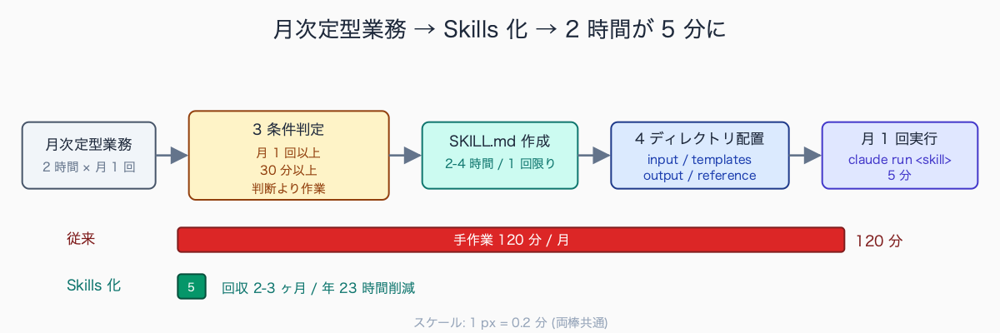
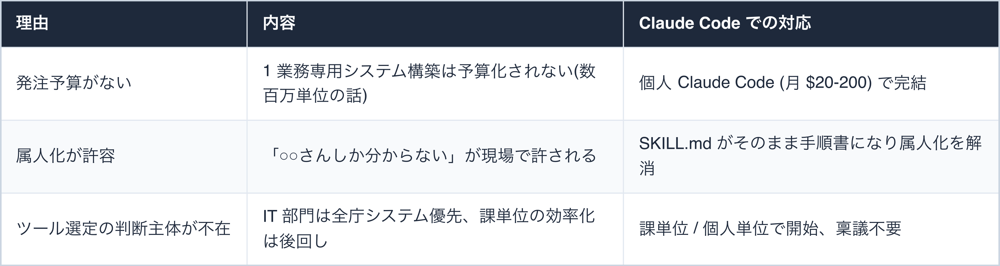
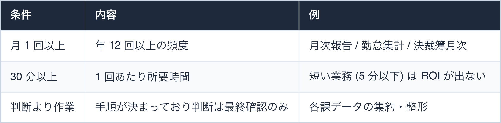
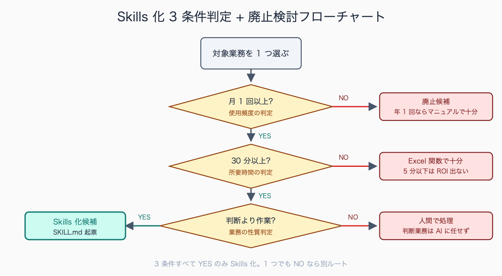
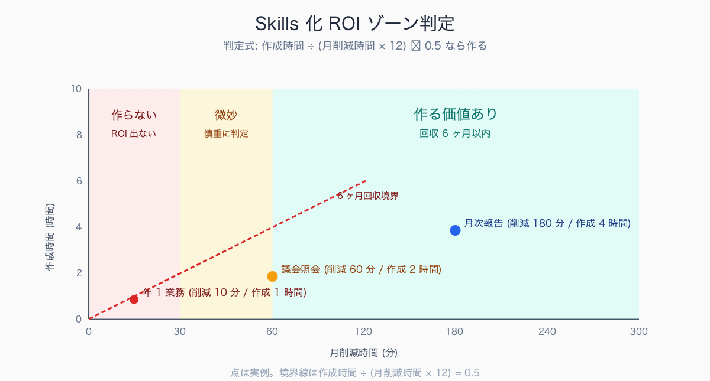

# .claude/skills で「毎月の定型業務」を 1 コマンド化する

## はじめに

毎月 25 日、係長の机に各課から月次報告 Word が 12 通届く。「進捗」「課題」「次月予定」の 3 セクションを抽出し、課別表に整形し、課長報告用 1 本に統合する。**所要 2 時間**。

誤字を直しながらコピペ、結合セルがズレ、フォントが MS 明朝と游明朝で混在し、最後に「○○課のフォーマット違う」と差し戻し。これを 12 ヶ月繰り返している。

公務員業務にこの種の「毎月必ずやるが、誰がやっても同じ結果になるはず」の定型業務が積み重なって、**月 20 時間が消える**。本稿は、Claude Code の Skills 機能で「1 コマンド + 5 分の人間確認」に圧縮する設計指針を、4 つの実例パターン + 1 個の判定フローで示す。SKILL.md 1 枚で起案・発注・予算ゼロ、個人の Claude Code から始められる。

中規模市の係長級で典型的に挙がる「毎月の定型業務」は、次の 3 業務に集中する例が多い。

- 各課月次報告の集約 (2-3 時間)
- 勤怠・超過勤務集計と決裁ルート確認 (1.5-2 時間)
- 月次予算執行報告の作成と部長報告資料への転記 (2-4 時間)

これに「広報誌の校正取りまとめ」「住民意見聴取の月次集計」「公共施設利用統計の取りまとめ」などが係の所管で加わると、月初の 1 週間が定型業務だけで埋まる。**3 業務合計で月 6-9 時間、年 72-108 時間**、係長 1 人の労働時間の約 5% が「同じ手順の繰り返し」に消える計算になる。

執筆者は元自治体職員。現在は Claude Code を使い、47 都道府県の統計サイト stats47.jp（約 2,000 のランキングを毎日自動更新）を個人で開発・運用している。

## TL;DR

- 公務員の定型業務は「入力フォーマットが固定」「出力フォーマットも固定」なため、Skills 化と相性が良い
- Skills 化の判定軸は「月 1 回以上 × 30 分以上 × 判断より作業」の 3 条件(後述、表で示す)
- 1 スキル作成に 2-4 時間、ROI 回収は 2-3 ヶ月で達成
- 失敗パターンは「Skills の中で判断させすぎる」こと。判断は人間、作業を Skills に分離
- 庁内展開時は「他人が読んでも実行できる SKILL.md」を書く(後述・有料部にレビュー観点 12 項目)


<!-- SVG: flow | 3条件判定→SKILL作成→月1回実行 -->

## 背景: なぜ公務員にこの課題があるか

民間と違い、公務員業務は**「ルーチン業務の比率」が圧倒的に高い**。法令・規則・要綱・要領で手順が縛られているため、創造的判断より「決まった手順を漏れなく実行する」ことに価値が置かれる。これは AI 自動化と本来は最高に相性がいい。

ところが現場では Excel と Word の手作業が残り続ける。理由は 3 つ。


<!-- SVG: table | 理由 / 内容 / Claude Code での対応 -->

自治体の月次業務における Office ツールの比率は、業務分野によって差が大きい。総務・企画系の係では **Excel 7-8 割・Word 2-3 割**で、Excel は予算執行管理・人員配置表・統計集計などに集中する。福祉系の調整会議が多い係では Word 5-6 割・Excel 3-4 割と Word 比率が逆転し、議事録・対応経過記録・関係機関宛文書が主体となる。

紙運用が残る業務は自治体規模で差があり、人口 5 万人未満の自治体では月次業務の 3-4 割が「紙で起案 → 押印 → スキャンして PDF 保存」の二重運用に残っている例もある。電子決裁の全面移行は政令市・中核市で高率達成例が公開されている (神奈川県・吹田市等) 一方、全国網羅の達成率を示す統計は限定的で、紙運用残存自治体も依然見られる。

特に注目すべきは「属人化の解消」。SKILL.md は Markdown で書く手順書なので、後任が引き継ぐとき「これを読めば動く」状態になる。Excel マクロや Power Automate と違って、コードが読めない管理職でも目を通せる。

## 手順 / 解説

### Skills 化判定: 3 条件 + 廃止判断

導入前に、対象業務が以下を満たすか確認する。3 条件すべて満たすなら Skills 化候補。1 つでも欠けるなら、まず別の業務改善(様式統一・廃止検討)を先に。


<!-- SVG: table | 条件 / 内容 / 例 -->

3 条件 + 廃止判断のフロー。

```
対象業務を 1 つ選ぶ
   ↓
月 1 回以上やっているか? --NO→ 廃止候補(年 1 回ならマニュアル運用で十分)
   ↓ YES
30 分以上かかるか? --NO→ Excel 関数・マクロで十分
   ↓ YES
判断より作業の比率が高いか? --NO→ 判断業務は AI に任せず人間で
   ↓ YES
Skills 化候補。SKILL.md 起票
```


<!-- SVG: structure | 3条件判定+廃止判断フロー -->

### パターン 1: 月次報告書の自動生成 (具体例)

冒頭シーンの業務。各課月次報告 Word 12 通を 1 本に統合する。

`.claude/skills/management/monthly-report/SKILL.md`:

```markdown
---
name: monthly-report
description: 各課月次報告 Word (.docx) を集約し、課長報告用 1 本にまとめる
---

# monthly-report

## 入力
- input/YYYY-MM/*.docx (各課提出 Word、ファイル名は「<課コード>_月次.docx」)
- templates/summary.docx (集約テンプレ、見出し階層固定)

## 出力
- output/YYYY-MM-summary.docx
- output/YYYY-MM-numbers.xlsx (数値集計表)
- output/YYYY-MM-issues.md (未抽出・差し戻し候補リスト)

## 手順
1. input/ 配下の .docx を全件読み込む(python-docx 経由)
2. 各ファイルから「進捗」「課題」「次月予定」の 3 セクションを抽出
   - セクション見出しが揃っていない場合は output/issues.md に記録
3. 課別に整形し、templates/summary.docx の所定位置に流し込む
4. 数値項目(予算執行率・人数・件数)は output/numbers.xlsx に集計
5. 抽出失敗箇所は赤字で「[要確認]」マーカー挿入
6. 完了ログを stdout に出力(処理ファイル数 / 抽出成功率 / 警告件数)

## 失敗時の挙動
- input/ が空: 「対象月のフォルダにファイルがない」エラー終了
- セクション見出し違い: 警告として記録、処理は継続
- 数値項目が文字列: numbers.xlsx に "ERR:<原文>" として記録

## 関連スキル
- monthly-report-followup: 抽出失敗課への自動メール下書き(別スキル)
```

実行コマンド:

```bash
# input/2026-05/ に各課 Word を配置済みの前提
claude run monthly-report --month=2026-05
```

これだけで、5 課分なら 2 時間 → 5 分。12 課分でも 8 分。

この「1 コマンドで定型業務が完結する」感覚は、執筆者が運用する統計サイト stats47.jp で実際に毎日体験しているものだ。stats47 では「今日のランキングを更新して」と Claude Code に頼むと、e-Stat API からのデータ取得 → 47 都道府県の集計 → 約 2,000 個のランキング再生成 → R2 ストレージへの同期、までが 1 コマンドで自動で走る。人間がやるのは結果の確認だけ。公務員の月次定型業務を 1 コマンド化するというのは、まさにこの構造をそのまま移植する話になる。

### パターン 2: 議会照会の取りまとめ

議会一般質問前に「全課に照会 → 回答取りまとめ → 議長宛報告」のサイクルが回る。Skills 化の典型例。

`.claude/skills/assembly/inquiry-aggregate/SKILL.md`:

```markdown
---
name: inquiry-aggregate
description: 議員照会の各課回答を取りまとめ、議員別 × 質問別マトリクスにする
---

## 入力
- input/inquiry-list.csv (議員名, 質問ID, 質問本文, 主管課)
- input/responses/<課コード>_<質問ID>.docx (各課回答 Word)

## 出力
- output/matrix.xlsx (議員 × 質問のクロス表)
- output/missing.md (未回答リスト + 督促メール下書き)
- output/draft-report.docx (議長宛報告ドラフト、見出し階層固定)

## 手順
1. inquiry-list.csv を pandas で読み込む
2. responses/ 配下の Word を全件読み、質問IDで突合
3. matrix.xlsx を openpyxl で生成(質問が縦、議員が横)
4. 未提出の (課, 質問ID) 組を missing.md に列挙
5. draft-report.docx は「質問 → 各課回答 → 統括コメント欄(空欄)」の構造
```

実行例:

```bash
claude run inquiry-aggregate --session=2026-06-regular
# → 12 議員 × 38 質問 × 18 課のマトリクスが 6 分で出る(従来は 2 日)
```

議会一般質問の照会取りまとめは、定例会の会期と質問通告締切日の関係で短期決戦になる。典型的な中規模市の事例では、**質問通告締切から答弁書提出までの期間は 5-7 日間**、この間に「議会事務局 → 主管課照会 → 各課回答作成 → 主管課集約 → 部長確認 → 議会事務局返送」のサイクルが回る。

1 質問あたり関与人数は 4-8 人 (議会事務局 2、主管課 2-4、部長 1、議長書記 1)、1 議員あたり 3-5 質問 × 12-20 議員で、**定例会 1 回ごとに延べ 200-400 人時**が照会対応に消費される計算になる。質問項目が複数課にまたがる「横断案件」では取りまとめだけで 8-12 時間かかる例も報告されている。

### パターン 3: 補助金実績報告の整合性チェック

国庫補助金は、申請時の数字と実績報告の数字が 1 円でも合わないと差し戻し。これを事前検証する。

```markdown
---
name: subsidy-consistency-check
description: 補助金実績報告書と申請書の整合性検証 + 領収書合計突合
---

## 入力
- input/application.pdf (申請書)
- input/report.xlsx (実績報告書)
- input/receipts/*.pdf (領収書スキャン、複数)

## 出力
- output/inconsistencies.md (不整合箇所リスト、補助金事業ごと)
- output/amount-reconciliation.xlsx (申請額 / 実績額 / 領収書合計の突合表)
- output/correction-draft.md (修正提案、差し戻し回避用)

## チェック項目
- 補助対象経費の総額一致(申請額 ≥ 実績額が必須)
- 領収書合計 = 実績額(端数処理ルール込み)
- 補助率 (例: 1/2, 2/3) からの逆算一致
- 補助対象期間内の支出か(領収書日付チェック)
- 補助対象経費の科目区分(備品 / 消耗品 / 役務など)が申請と一致
```

「申請額 99,800 円、実績額 99,810 円(端数 10 円のズレ)」のようなミスを 30 秒で検出。差し戻し → 再申請の 2 週間ロスを防ぐ。

### パターン 4: 決裁簿の月次集計

紙決裁の残骸として、決裁簿の月次集計が手作業で残っている自治体は多い。

```markdown
---
name: kessai-bo-monthly
description: 決裁簿 Excel を読んで月次集計表 + 起案傾向分析を出す
---

## 入力
- input/kessai-YYYY-MM.xlsx (決裁簿原本、列構成は固定)

## 出力
- output/summary.xlsx
  - シート1: 起案件数(課別 × 起案区分)
  - シート2: 平均決裁日数(課別)
  - シート3: 期限超過案件リスト
  - シート4: 月次トレンド(過去 12 ヶ月)
- output/anomalies.md (異常検知: 急増 / 急減 / 長期滞留)
```


<!-- SVG: screenshot | /skills コマンドで 4 つの月次業務スキルが一覧表示された画面 -->

### Skills 設計の鉄則 5 つ

1. **1 スキル 1 目的**: 「月次業務全部」のような汎用スキルは作らない。1 タスク 1 ファイル。SKILL.md は 200 行以下を目安
2. **入出力ディレクトリを固定**: `input/` `output/` `templates/` `reference/` の 4 ディレクトリ構成に統一。他人が読みやすい
3. **失敗時の挙動を明示**: 「抽出失敗箇所は赤字でマーク」「未回答課はリスト化」など、エラーケースを SKILL.md に必ず書く
4. **判断は人間に残す**: 「金額が大きい案件は別ルートで処理」のような判断は Skills 内に書かない。判断は人間、Skills は作業に徹する
5. **スキル名は動詞 + 名詞**: `monthly-report` `inquiry-aggregate` のように、何をするか一目で分かる名前。`kanri` `report-tool` のような曖昧な名前は禁止

既存の自動化資産として自治体現場でよく見られるのは、次の 3 系統だ。

- Excel VBA マクロによる予算執行集計や決裁簿転記 (2000 年代に係内で内製、属人化リスク大)
- Power Automate Desktop による電子申請データの基幹システム取込 (2020 年代以降、情シス主導で導入)
- RPA (UiPath や WinActor) による定型 Web 操作の自動化 (中核市以上で導入例が多い)

Claude Code への移植検討は、これら既存資産を**「廃止する」「現状維持する」「Claude Code に巻き取る」の 3 択**で判定し、メンテ困難度 × 使用頻度の 2 軸でスコアリングする手順が現実的になる。

## よくあるつまずきポイント

1. **判断を Skills にやらせる**: 「金額が大きい案件は別ルートで処理」のような判断は Skills 内に書かない。判断ロジックを書くと、判断の前提が変わったときに気づかず誤動作する。判断は人間、Skills は作業
2. **テンプレが古い**: 4 月の組織改編で課名が変わったのに Skills のテンプレが旧課名のまま、という事故は多い。年 1 で `templates/` を見直す習慣を SKILL.md に明記
3. **個人 PC でしか動かない**: 異動で引き継ぐと動かない。`.claude/skills/` を共有フォルダ(係内 NAS / SharePoint)に置く運用に切り替える。Git で管理すれば履歴も残る
4. **入力データの命名がバラバラ**: 各課から来るファイル名がバラバラだと Skills が壊れる。「<課コード>_<業務名>_<YYYYMM>.docx」のような命名規則を先に統一する
5. **回収期間を見誤る**: 1 スキル作成に 2-4 時間。月 1 業務なら回収 2-3 ヶ月。年 1 業務だと回収不能なので作らない。判定式: `作成時間 ÷ (月削減時間 × 12)` が 0.5 以下なら作る


<!-- SVG: infographic | ROI 3ゾーン判定 (削減×作成時間) -->

## まとめ

公務員業務の Skills 化は「自動化」というより**「手順書のコード化」**だ。SKILL.md を書くことで、属人化していた業務が標準化され、Claude Code が実行する。

最初の 3 個を作るのが一番大変で、4 個目からは慣れる。**月 20 時間が浮けば**、企画業務や住民対応に時間を回せる。それが本来の公務員の価値だ。

## 関連記事 / 次に読む

- (無料) 議事録 30 分 → 5 分にした手順
- (有料) Subagents で「複数案件の並行調査」を回す
- (有料) 既存の Excel マクロを Claude Code で Python 移植する

---

### この続きは有料パートです

**こんな人におすすめ**

月次報告の集約や勤怠集計など「毎月必ずやる定型業務」に月 20 時間を取られている、4 業務分の SKILL.md をそのままコピペして使いたい、異動引継ぎや庁内展開を見据えてテンプレや ROI 計算シートまで揃えたい——係長級・庶務担当の方に向けた内容です。

**この続きで読めること**

> - 4 業務パターンそれぞれの SKILL.md 完全版(コピペ可能、入出力サンプル付き)
> - 各課から提出されるバラバラ Word/Excel を正規化する前処理 Skills (normalize-input)
> - 異動引継ぎを 30 分で完了させる「スキル引継書」テンプレ(記載 12 項目)
> - 庁内展開時に上司に見せる ROI 計算シート(Excel、時間単価可変)
> - SKILL.md レビュー観点 12 項目(他人が書いた SKILL.md を 5 分で評価)

単体購入は ¥300。マガジン「公務員 × Claude Code 実務活用ガイド」（¥1,980）なら、この記事を含む有料 23 本すべてが読めます。

ここから先は有料部分: ¥300

### 有料セクション 1: 4 SKILL.md 完全版

無料部で骨格を示した 4 業務について、入出力定義・手順・エラー処理・サンプルプロンプトを含む SKILL.md 全文を掲載。それぞれ 80-150 行程度。

Skills 化の入出力実例として現場で語られる典型例は、**「月次予算執行報告」のケース**だ。入力は各課提出の Excel ファイル 12-18 通 (1 ファイルあたりシート 3-5 枚、行数 50-200 行)、ファイル名規則は「<課コード 4 桁>_<業務名>_<YYYYMM>.xlsx」が標準形。

出力は次の 3 種類になる。

- 課別 × 科目別マトリクス Excel (シート 4 枚: サマリ・課別詳細・アラート・トレンド)
- 部長報告用 Word (見出し階層 H1-H3 固定)
- 抽出失敗ファイルリスト Markdown

**入力ファイルの 5-10% で必ず「フォーマット違反」(セル結合・列順入れ替え・空行混入) が発生**し、これを即時検知して差し戻し対象として記録する設計が事故防止の要となる。

### 有料セクション 2: 前処理 Skills「normalize-input」

各課から来る Word/Excel は、表の構造もファイル名もフォントもバラバラ。これを Claude Code が処理できる形に揃える前処理スキル。

```markdown
---
name: normalize-input
description: 各課提出ファイル (.docx/.xlsx/.pdf) を構造化マークダウンに正規化
---

## 入力
- input/raw/*.{docx,xlsx,pdf}

## 出力
- input/normalized/<元ファイル名>.md (構造化 Markdown)
- input/normalized/_metadata.json (元ファイル → 正規化後の対応表)

## 処理
1. 文字コード判定 (chardet) → UTF-8 統一
2. .docx: python-docx で見出し階層 (H1-H3) を抽出
3. .xlsx: openpyxl で結合セル展開、罫線情報は破棄
4. .pdf: pdfplumber でテキスト抽出 → OCR 必要なら tesseract
5. 表は GFM Markdown table 形式に統一
6. フォント情報・色情報は破棄(構造のみ抽出)
```

### 有料セクション 3: スキル引継書テンプレ

異動で後任者が 30 分で運用引継ぎできる「スキル引継書」のテンプレ。記載項目は以下 12 項目。

1. スキルの目的
2. 月平均削減時間(計測根拠)
3. 入力ファイルの入手元(誰が、いつ、どこに置くか)
4. 実行コマンド(コピペ可能)
5. 出力ファイルの提出先(誰宛、どの形式)
6. 失敗時のリカバリ手順
7. 過去 6 ヶ月の実行ログ場所
8. 関係者連絡先(入力提供元の担当者)
9. 関連法令・要綱の URL
10. 年次見直しチェック項目(テンプレ更新時期)
11. 廃止判定の基準(いつ廃止を検討するか)
12. 引継完了確認サイン

### 有料セクション 4: ROI 計算シート

「Skills 化で月 X 時間削減 → 年間 X 万円相当」を上司に見せる Excel シート。時間単価は人事課が出している標準時給を使う(自治体ごとに違うが、概ね 2,500-4,000 円 / 時、職位手当込みで 5,000 円超のケースも)。

入力欄:
- 業務名 / 月実行回数 / 1 回所要時間(従来 / Skills 化後)/ スキル作成時間 / 時間単価

自動計算:
- 月削減時間 / 年間削減時間 / 年間人件費相当 / 回収月数 / 3 年 ROI

### 有料セクション 5: SKILL.md レビュー観点 12 項目

他人が書いた SKILL.md を 5 分で評価するチェックリスト。庁内展開時に「品質の揃ったスキル」を量産するために使う。

自治体の人件費単価は「会計検査用標準単価」または「補助金事業の人件費積算用単価」として人事課が管理する内部資料として整備されている。総務省「地方公務員給与実態調査」(2024 年度) ベースで、一般行政職の平均給与月額は約 36 万円、**職員 1 人あたりの年間総コストは概ね 700-900 万円程度、時間単価換算で 3,500-4,500 円程度**になる (給与+諸手当+共済負担+退職給付引当)。

職位別では係員 2,500-3,500 円、係長 3,500-4,500 円、課長 5,000-6,500 円が典型レンジで、補助金実績報告や受託事業の人件費精算で使う「補助対象人件費単価表」を人事課・給与係に問い合わせれば実数値が確認できる。

<!-- circulation-footer:v2 -->

---

## 「公務員 × Claude Code」シリーズ

本記事は、自治体職員が Claude Code を日々の業務に活かすための全 31 本シリーズの 1 本です。環境構築・議事録・議会答弁・セキュリティ・データ活用・組織導入まで、関心のあるテーマから読み進められます。

シリーズの全記事はマガジンにまとめています。他の記事はこちらからどうぞ。

https://note.com/stats47/m/m512ad7023815

Claude Code に触れるのが初めての方は、まず導入記事「Claude Code とは何か — ターミナル未経験の公務員のための導入ガイド」から読むのがおすすめです。
