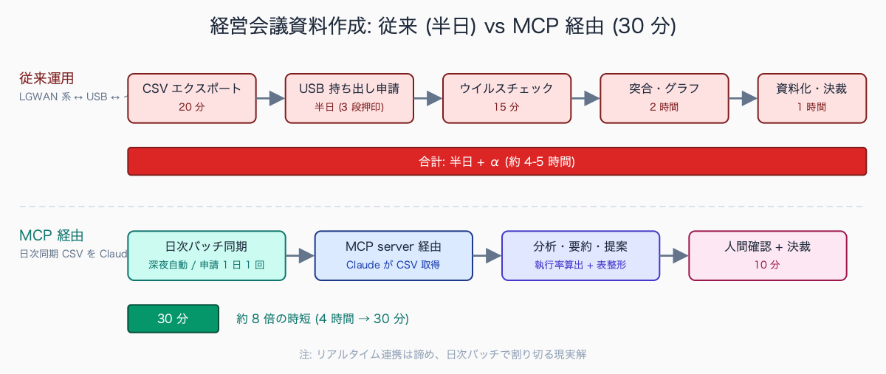
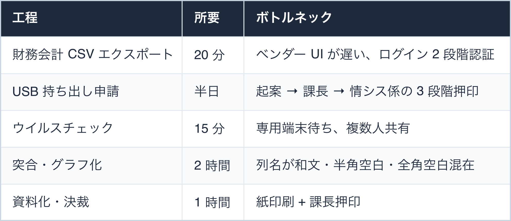
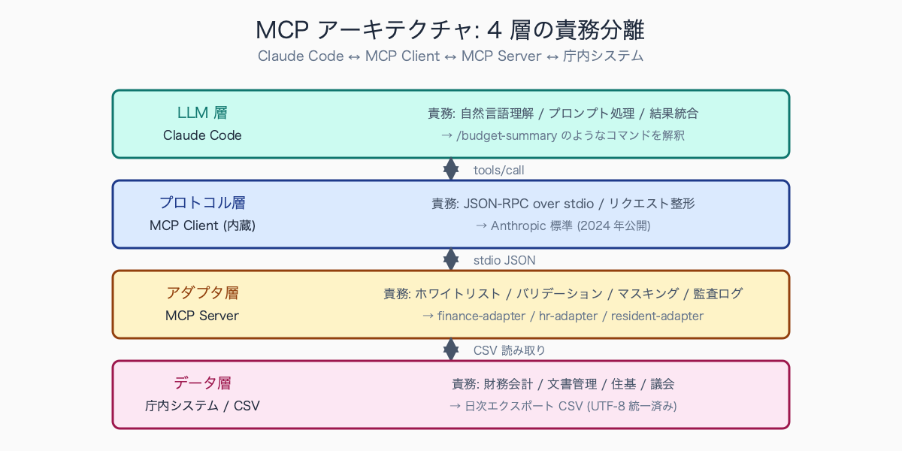
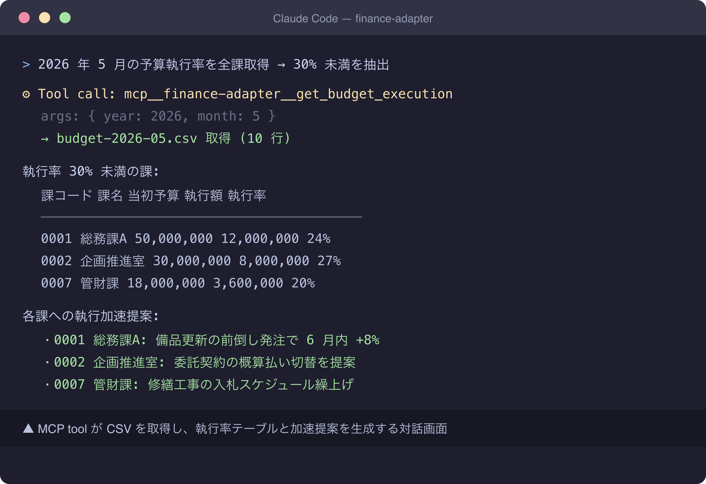
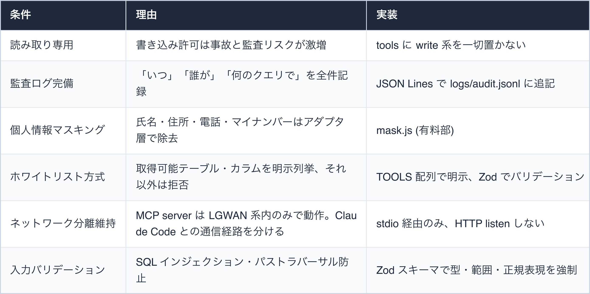
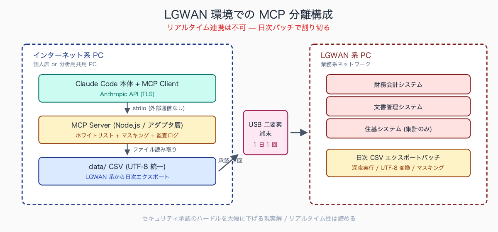
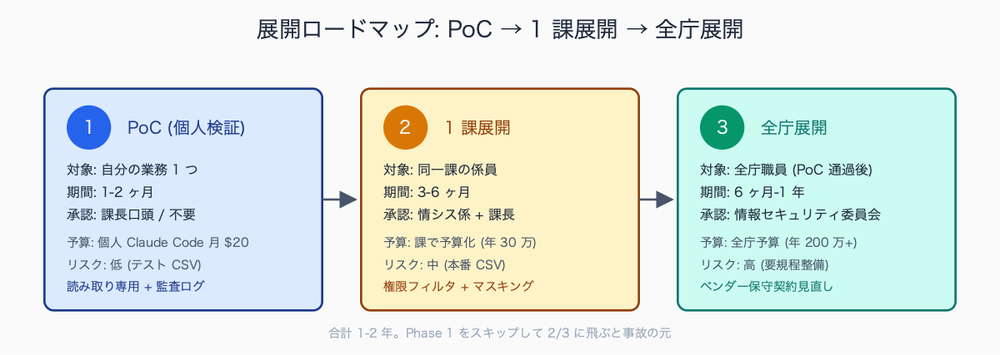
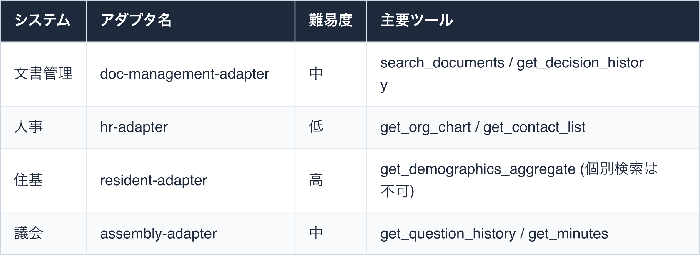

# MCP server を庁内システムにつなぐ実験 (架空 LGWAN 想定)

## はじめに

毎月第 1 営業日、経営会議資料の作成依頼が下りる。「予算執行率と各課事業進捗を突き合わせ、執行率 30% 未満の事業を抽出、各課にヒアリング、対応案 3 つ」。手順を分解するとこうなる。

1. LGWAN 系 PC で財務会計システムにログイン → 課別予算執行 CSV をエクスポート(20 分)
2. USB 持ち出し申請を起案 → 課長押印 → 情報セキュリティ係押印(承認待ち半日)
3. インターネット系 PC に USB 経由で転送、ウイルスチェック後に読み込み(15 分)
4. 各課事業進捗 Excel と突合、執行率算出、グラフ作成(2 時間)
5. テンプレに流し込み、PDF 化、課長決裁、印刷、配布(1 時間)

**合計、半日 + α。これが毎月発生する。**

本稿は MCP (Model Context Protocol) server を使ってこの壁を「実証実験レベル」で乗り越える設計指針を、架空の LGWAN 環境を想定して書く。本番運用前の検討材料として、情報セキュリティ委員会に持っていく前段階の試作として。

三層分離環境下で「LGWAN 系の基幹システムから CSV を出力 → USB 転送 → インターネット接続系で加工」のサイクルが定常運用されている代表例は、次の 3 系統だ。

- 財務会計データを使った経営会議資料の作成
- 住民情報集計値 (個人特定を除外した町丁目別世帯数など) を使った地域分析
- 議会答弁データの過去事例参照

1 回あたりの所要時間は CSV エクスポート 15-30 分、USB 持ち出し申請の押印取得 4-8 時間、ウイルスチェック端末待ち 15-60 分、データ加工 2-4 時間で、半日から 1 日の業務として定型化している例が多い。**月次ベースでは係長級 1 人あたり 8-16 時間**がこの「系統またぎ作業」に消える計算となる。

執筆者は元自治体職員。現在は Claude Code を使い、47 都道府県の統計サイト stats47.jp（約 2,000 のランキングを毎日自動更新）を個人で開発・運用している。

## TL;DR

- MCP は「Claude Code から外部システムを呼ぶ標準プロトコル」(Anthropic が 2024 年公開)
- LGWAN 系で MCP を動かす場合、Claude Code 本体はインターネット系、MCP server だけ LGWAN 系という分離が現実解
- 実装難度は中程度(Node.js + JSON-RPC 知識があれば 1 週間で骨格)
- セキュリティ上、MCP server は「読み取り専用」「ホワイトリスト」「監査ログ完備」を絶対条件にする
- 本記事は実証実験レベル。本番展開には情報セキュリティ委員会の承認と、ベンダー保守契約の見直しが必須


<!-- SVG: flow | 半日 vs 30 分の比較 -->

## 背景: なぜ公務員にこの課題があるか

庁内システムは、ベンダーロックインと LGWAN ネットワーク分離という二重の壁で守られている。これにはセキュリティ上の正当な理由があるが、データを横断的に扱いたい職員にとっては毎日の苦痛だ。

具体例(冒頭シーンの分解):


<!-- SVG: table | 工程 / 所要 / ボトルネック -->

ステップ 1-3 だけで半日消える。MCP server で 1-3 を自動化(または安全な準自動化)できれば、月 2-3 日の削減が見える。

境界越え業務の発生件数は自治体規模と業務分野で大きく変動する。中規模市の事例では、**係単位で月 8-20 件、課単位で月 30-80 件**のファイル転送申請が発生し、人口 30 万人超の中核市では月 100-300 件規模になる例も報告されている。

ファイル転送の承認ワークフローは「申請者起案 → 上司確認 → 情報セキュリティ担当決裁 → 専用端末でウイルスチェック → 受領者通知」の 5 段階が標準形で、最短 2-4 時間、混雑時や決裁者不在時は半日から 1 日かかる。深夜・休日対応の災害広報や議会前日対応など緊急案件向けに「事後申請承認」の例外運用を設けている自治体もあるが、平時はあくまで例外で、常用すると監査指摘の対象となる。

## 手順 / 解説

### MCP の基本概念

MCP (Model Context Protocol) は **Anthropic が 2024 年に公開した、AI と外部システムを繋ぐためのプロトコル仕様**。Claude Code は MCP server を呼び出して、ファイルシステム、Git、データベース、Web API などを操作できる。通信は JSON-RPC over stdio または HTTP。

公務員業務に当てはめると、MCP server を「庁内システムへのアダプター」として作る発想になる。

```
[Claude Code (インターネット系 PC)]
     ↓ (MCP protocol, stdio)
[MCP server: kosen-systems]
     ↓ (各システム固有 API or CSV)
[財務会計] [文書管理] [住基] [議会]
```


<!-- SVG: structure | LLM/プロトコル/アダプタ/データ 4 層 -->

### ステップ 1: 最小実装 (架空財務システムアダプタ)

実証実験用に、CSV ファイルを「あたかも財務会計システムの API」のように見せる MCP server を作る。

`.claude/mcp-servers/finance-adapter/server.js`:

```javascript
#!/usr/bin/env node
const { Server } = require("@modelcontextprotocol/sdk/server/index.js");
const { StdioServerTransport } = require("@modelcontextprotocol/sdk/server/stdio.js");
const { z } = require("zod");
const fs = require("fs");
const path = require("path");

const DATA_DIR = path.resolve(__dirname, "data");
const LOG_FILE = path.resolve(__dirname, "logs/audit.jsonl");

const server = new Server(
  { name: "finance-adapter", version: "0.1.0" },
  { capabilities: { tools: {} } }
);

// ホワイトリスト方式: 取得可能なツールを明示列挙
const TOOLS = [
  {
    name: "get_budget_execution",
    description: "予算執行率を課別に取得(読み取り専用)",
    inputSchema: {
      type: "object",
      properties: {
        year: { type: "integer", minimum: 2020, maximum: 2030 },
        month: { type: "integer", minimum: 1, maximum: 12 },
        section_code: { type: "string", pattern: "^[0-9]{4}$" },
      },
      required: ["year", "month"],
    },
  },
];

const BudgetArgs = z.object({
  year: z.number().int().min(2020).max(2030),
  month: z.number().int().min(1).max(12),
  section_code: z.string().regex(/^[0-9]{4}$/).optional(),
});

// @modelcontextprotocol/sdk の Schema を import 経由で使う
// 冒頭の require に以下を追加:
// const { ListToolsRequestSchema, CallToolRequestSchema } = require("@modelcontextprotocol/sdk/types.js");

server.setRequestHandler(ListToolsRequestSchema, async () => ({ tools: TOOLS }));

server.setRequestHandler(CallToolRequestSchema, async (req) => {
  const { name, arguments: args } = req.params;
  audit({ method: name, args, ts: new Date().toISOString() });

  if (name === "get_budget_execution") {
    const parsed = BudgetArgs.parse(args);
    const file = path.join(DATA_DIR, `budget-${parsed.year}-${String(parsed.month).padStart(2, "0")}.csv`);
    if (!fs.existsSync(file)) throw new Error(`Data file not found: ${path.basename(file)}`);

    let csv = fs.readFileSync(file, "utf-8");
    if (parsed.section_code) {
      const lines = csv.split("\n");
      const header = lines[0];
      const filtered = lines.slice(1).filter((l) => l.startsWith(parsed.section_code));
      csv = [header, ...filtered].join("\n");
    }
    return { content: [{ type: "text", text: csv }] };
  }
  throw new Error(`Unknown tool: ${name}`);
});

function audit(entry) {
  fs.mkdirSync(path.dirname(LOG_FILE), { recursive: true });
  fs.appendFileSync(LOG_FILE, JSON.stringify(entry) + "\n");
}

const transport = new StdioServerTransport();
server.connect(transport);
```

CSV ファイルを定期的に LGWAN 系から(USB 経由でも自動転送でも)更新すれば、Claude Code からは API のように呼べる。

### ステップ 2: Claude Code 側に登録

`.claude/settings.json` (プロジェクトローカル) または `~/.claude/settings.json` (ユーザーグローバル) に MCP server を登録。

```json
{
  "mcpServers": {
    "finance-adapter": {
      "command": "node",
      "args": [".claude/mcp-servers/finance-adapter/server.js"],
      "env": {
        "AUDIT_USER": "${USER}"
      }
    }
  }
}
```

これで Claude Code 内から `get_budget_execution` ツールが呼べる状態になる。

### ステップ 3: 使用例(実プロンプト)

```
mcp__finance-adapter__get_budget_execution で 2026 年 5 月の
予算執行率を全課取得してください。

そのうち執行率が 30% を下回っている課を抽出し、以下の表形式で出力:

| 課コード | 課名 | 当初予算 | 執行額 | 執行率 | 残額 |

さらに、各課に対して「6 月末までに執行を加速する提案」を 3 つずつ、
これまでの執行傾向(月別執行カーブ)を踏まえて出してください。
```

Claude Code は MCP 経由で CSV を取得 → 構造化 → フィルタ → 分析 → 提案、を 1 連の対話で実行する。CSV のパース、執行率計算、表整形、文章生成までを Claude が担う。


<!-- SVG: screenshot | Claude Code 内で MCP tool が呼び出されて CSV が取得され -->

### ステップ 4: セキュリティ設計の鉄則

MCP server を庁内システムに繋ぐ場合、以下を絶対条件にする。1 つでも欠けると情報セキュリティ委員会を通らない。


<!-- SVG: table | 条件 / 理由 / 実装 -->

情報セキュリティポリシーへの AI 連携の明示は、**2024-2025 年にかけて急速に整備が進んでいる分野**だ。総務省「地方公共団体における情報セキュリティポリシーに関するガイドライン」は 2023 年改定で生成 AI 利用の留意事項を追記し、2024-2025 年改定では「業務利用時のデータ取扱区分」「ログ保全要件」「ベンダーロックイン回避」が具体化される方向にある。

市町村レベルでは「生成 AI 利用ガイドライン」を独自策定する動きが先行自治体 (横須賀市・神戸市・つくば市など) で見られるが、未策定の自治体では「個別判断扱い」のままとなる例も多い。MCP のような新規プロトコルは「ガイドライン制定が無いから情報セキュリティ委員会で個別審議」というルートに乗ることになる。

### ステップ 5: LGWAN 環境での現実解

LGWAN 系で Claude Code 本体を動かすのは現状ほぼ不可能(インターネット接続必須、Anthropic API への TLS 通信)。よって以下の分離構成を取る。

```
[インターネット系 PC] (個人席または分析用共用 PC)
  - Claude Code 本体
  - MCP client (内蔵)
       ↑↓ (ローカル stdio JSON-RPC、外部通信なし)
  - MCP server (アダプタ層、Node.js)
       ↑ (ファイル読み取り)
  - data/ ディレクトリ (LGWAN 系から定期エクスポート、UTF-8 統一済み)
       ↑
  - LGWAN ↔ インターネット間データ移送(USB 二要素端末 or 専用回線)
       ↑
[LGWAN 系 PC]
  - 各庁内システム (財務会計 / 文書管理 / 住基)
  - 日次 CSV エクスポートバッチ (深夜実行)
  - データ移送承認ワークフロー (1 日 1 回まとめて)
```

「リアルタイム連携」は諦め、**「日次バッチ + 安全な分析環境」に割り切るのが LGWAN 時代の現実解**。リアルタイム性を諦める代わりに、セキュリティ承認のハードルを大幅に下げる。


<!-- SVG: structure | LGWAN/インターネット系/USB の分離 -->

USB 持ち出し申請の承認フローは自治体により差があるが、典型的な中規模市では「申請者起案 → 係長確認 → 課長決裁 → 情報セキュリティ担当承認 → 専用端末でデータ書出し → 受領印」の **5-6 段階が標準形**となる。所要時間は決裁ルートが順調で 2-4 時間、押印者が会議中・出張中だと半日から翌日にかかる。

緊急時の例外運用として「事後決裁」を認める自治体もあるが、平時は使えない。USB メディア自体も自治体支給品 (暗号化機能付き) に限定され、個人所有品の使用は内部監査・包括外部監査の指摘事項として 2020 年代以降ほぼ全自治体で禁止されている。**承認待ちの 4-8 時間が経営会議資料作成全体のクリティカルパスとなる構造**は、複数自治体の業務改善報告書でも繰り返し指摘されている。

## よくあるつまずきポイント

1. **MCP の仕様変更が早い**: 半年で API が変わることがある(2024 年公開、2025-26 で頻繁に minor 改訂)。`.claude/mcp-servers/*/README.md` に SDK バージョンと検証日を明記する習慣を
2. **CSV エクスポート時の文字コード**: 庁内システムは Shift_JIS 出力が多い。MCP server 内で UTF-8 変換 (`iconv-lite`) を吸収。BOM 付き UTF-8 も別途処理
3. **権限分離が甘い**: 「全課のデータが全員見える」設計にすると個人情報保護条例違反になる可能性。`AUDIT_USER` 環境変数でユーザー識別し、課コード単位の権限フィルタを必ず入れる
4. **MCP server 自体のセキュリティ**: `server.js` 自体が改ざんされると全データが漏れる。ファイル権限(`chmod 700`)、コード署名、Git 管理を必須化
5. **ベンダー保守契約への抵触**: 「データを外部に出すと保守対象外」と契約書にある場合がある。事前にベンダーに「CSV エクスポート機能を MCP 経由で読み取り専用利用」を文書で照会
6. **個人情報のうっかり混入**: 財務会計 CSV にも「業者名」「振込先口座」「請求書番号」が含まれることがある。マスキング層を必ず通す

## まとめ

MCP server は庁内システム連携の「次の標準」になり得るが、現状は実証実験レベル。本番展開には情報セキュリティ委員会の承認、ベンダーとの調整、運用ルールの策定が必須。

それでも、月数日が浮く可能性があるなら、まず個人検証として 1 業務試す価値はある。最初の一歩は「CSV エクスポートを MCP 化する」だけで十分。**読み取り専用 + ホワイトリスト + 監査ログの 3 点セット**を守る限り、PoC 段階で大きな事故は起きない。


<!-- SVG: infographic | 3 段階展開 + 承認/所要月数 -->

## 関連記事 / 次に読む

- (有料) Claude Code Hooks で個人情報マスキングを自動化する
- (有料) 監査に耐える AI 活用ログを残す .claude/settings.json
- (有料) ローカル LLM (Ollama) × Claude Code で完全オフライン業務

---

### この続きは有料パートです

**こんな人におすすめ**

LGWAN 系と インターネット系をまたぐ「CSV エクスポート → USB 転送 → 加工」のサイクルを月次で抱えている財務・経営企画系の係長級の方。MCP server を PoC として自分で 1 業務試したいが、骨格だけでなく本番に出せるエラーハンドリング・権限フィルタ・情報セキュリティ委員会の通し方まで揃った実装が必要な方に向いています。

**この続きで読めること**

> - `finance-adapter` の完全実装(エラーハンドリング・監査ログ・権限フィルタ・マスキング含む 500 行)
> - 文書管理 / 人事 / 住基システム向けアダプタの設計指針(各 100 行の SKILL.md + 注意点)
> - 情報セキュリティ委員会向け説明資料テンプレ(20 ページ Word、構成 10 章)
> - 個人情報マスキングを MCP server 層で自動化する実装 (mask.js + テストデータ)
> - 監査ログ可視化ダッシュボード(Claude Code 内で完結、`/audit-summary` スキル)
> - PoC → 1 課展開 → 全庁展開のロードマップ(必要工数・予算・承認フロー)

単体購入のほか、マガジン「公務員 × Claude Code 実務活用ガイド」でシリーズをまとめて読むこともできます。

ここから先は有料部分: ¥300

### 有料セクション 1: finance-adapter 完全実装

無料部で骨格を示した MCP server について、以下を含む完全版を掲載。

- リクエスト検証 (Zod スキーマ、全ツール分)
- 権限フィルタ(課コード単位、組織図 CSV ベース)
- エラーハンドリング(CSV 不在 / 形式不正 / 権限なし / バリデーション失敗)
- 監査ログ出力 (JSON Lines、追記 only、ローテーション)
- 個人情報自動マスキング (正規表現 + NER)
- ヘルスチェックエンドポイント (`get_server_status`)
- レート制限(1 ユーザー秒間 10 リクエスト)

ファイル構成。

```
finance-adapter/
  server.js           # メインサーバ(エントリポイント)
  tools/
    get_budget_execution.js
    get_expense_history.js
    get_contract_summary.js
  schema/             # Zod スキーマ
  permissions.js      # 権限フィルタ(課コード × ツール)
  audit.js            # 監査ログ
  mask.js             # 個人情報マスキング
  data/               # CSV データ (LGWAN 同期先、UTF-8)
  logs/               # 監査ログ (JSON Lines)
  tests/              # ユニットテスト (vitest)
  README.md           # 運用手順
```

自治体財務会計システムの出力 CSV 仕様は、ベンダー (内田洋行・日立システムズ・富士通 Japan・TKC など) により細部が異なるが、共通する典型構成として以下が挙げられる。**文字コードは Shift_JIS (CP932) が大半**で、UTF-8 出力対応は 2020 年代以降の更新版から徐々に追加されつつある段階。

列構成は「会計年度・予算科目コード (6-10 桁)・節区分・所属コード (4-6 桁)・予算現額・執行額・残額・執行率」が基本セットで、これに「節以下の細節・備考・伝票番号・契約番号」が付属する。更新頻度は日次バッチ更新 (深夜 02:00-04:00) が標準で、**月末締めデータの確定は翌月 7-10 営業日後**となる例が多い。

### 有料セクション 2: 他システム向けアダプタの設計指針


<!-- SVG: table | システム / アダプタ名 / 難易度 / 主要ツール -->

住基は個人情報の塊なので、個別検索ツールは作らない。「年齢階級別人口集計」「町丁目別世帯数」など集計値のみ。

### 有料セクション 3: 情報セキュリティ委員会向け説明資料テンプレ

委員会通過のための 20 ページ Word テンプレ。構成は以下。

1. 背景・目的(現状の半日 → 30 分の数値根拠)
2. アーキテクチャ図(LGWAN 分離維持を明示、ホワイトボード手書きでも可)
3. 取り扱うデータの種類と機密度(個人情報該当性、行政機関個人情報保護法との関係)
4. アクセス制御(課単位権限フィルタ、ユーザー識別)
5. 監査ログ(保管期間、改ざん防止、定期レビュー)
6. インシデント時の対応(MCP server 即時停止手順)
7. ベンダーとの調整状況(保守契約との整合性)
8. 段階的展開計画 (PoC → 1 課 → 全庁、各 3 ヶ月)
9. 撤退条件(事故発生時 / 効果なし時の停止判断)
10. 質疑応答 Q&A(委員会で出る想定質問 15 件 + 回答)

### 有料セクション 4: マスキング実装

正規表現と NER(固有表現抽出)を組み合わせた個人情報マスキング。

```javascript
// mask.js
const MASKING_RULES = [
  { name: "phone", pattern: /(0\d{1,4}-\d{1,4}-\d{4}|\d{3}-\d{4}-\d{4})/g, replace: "[電話番号]" },
  { name: "mynumber", pattern: /\b\d{4}\s?\d{4}\s?\d{4}\b/g, replace: "[マイナンバー]" },
  { name: "bank-account", pattern: /[0-9]{7,}/g, replace: "[口座番号候補]", confirm: true },
  { name: "address", pattern: /[一-龯ぁ-ん]+市[一-龯ぁ-ん]+町[0-9]+番地?/g, replace: "[番地]" },
];

const NER_RULES = [
  // 「○○ さん」「○○ 様」「○○ 氏」パターンは Claude 自体に NER させる
  { type: "person-name-with-honorific", model: "claude-haiku" },
];

function mask(text) {
  let masked = text;
  for (const rule of MASKING_RULES) {
    masked = masked.replace(rule.pattern, rule.replace);
  }
  return masked;
}

module.exports = { mask };
```

### 有料セクション 5: 監査ログ可視化

Claude Code 内に「監査ログサマリ表示」スキル `.claude/skills/audit/summary/SKILL.md` を作り、誰がいつ何を取得したかを 1 画面で見られるようにする実装。

```bash
claude run audit-summary --from=2026-05-01 --to=2026-05-31
# →
# ユーザー別アクセス回数 (上位 10)
# ツール別利用回数 (全件)
# 異常アクセスパターン (深夜 / 大量取得 / 権限境界)
# マスキング発動回数(個人情報検出して伏せた回数)
```

庁内システム関連のヒヤリハット事例は、地方自治情報センター (LASDEC 後継の J-LIS) や総務省「自治体情報セキュリティクラウド」運用報告で類型化が進んでいる。代表的なケースは次の 3 系統で、いずれも年に複数件全国規模で発生する。

- 住民データの誤出力 (検索条件ミスで対象外の住民まで CSV エクスポート、内部発見で外部漏えいは未遂)
- USB メディアの紛失・置き忘れ (異動時の私物との混在で発覚)
- メール誤送信による個人情報添付 (CC と BCC の取り違え、添付ファイル名の取り違え)

自治体ごとには**年 1-3 件のヒヤリハット**が内部報告システムに記録され、うち重大インシデント (条例上の公表義務該当) は年 0-1 件で推移する例が一般的となる。

<!-- circulation-footer:v2 -->

---

## 「公務員 × Claude Code」シリーズ

本記事は、自治体職員が Claude Code を日々の業務に活かすための全 31 本シリーズの 1 本です。環境構築・議事録・議会答弁・セキュリティ・データ活用・組織導入まで、関心のあるテーマから読み進められます。

シリーズの全記事はマガジンにまとめています。他の記事はこちらからどうぞ。

https://note.com/stats47/m/m512ad7023815

Claude Code に触れるのが初めての方は、まず導入記事「Claude Code とは何か — ターミナル未経験の公務員のための導入ガイド」から読むのがおすすめです。
