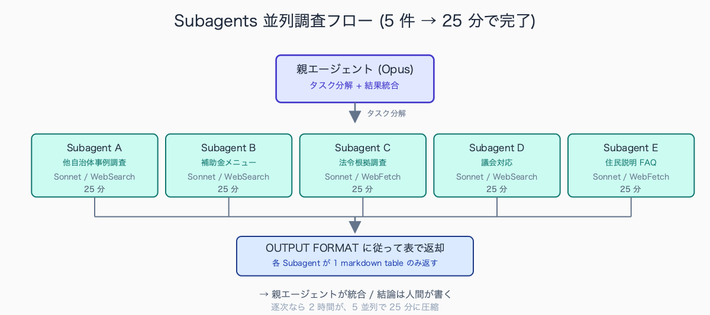
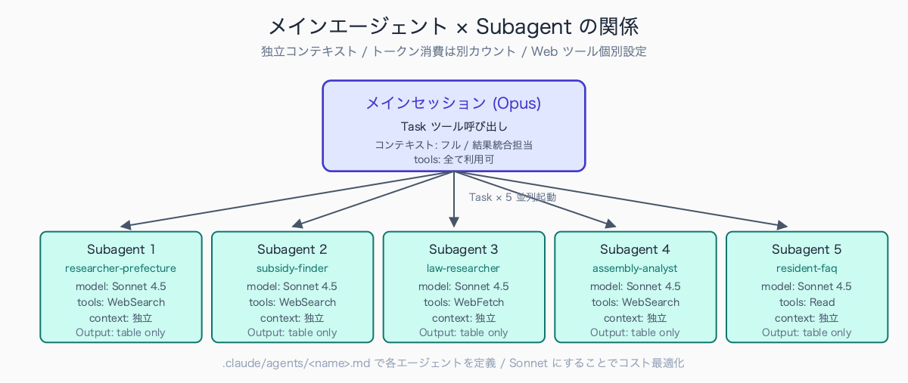
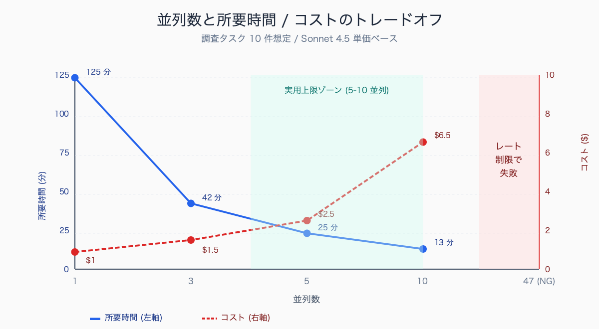

# Subagents で「複数案件の並行調査」を回す

## はじめに

火曜の朝、政策担当の机に上司から 5 件の調査依頼が同時に降ってくる。「議員質問の根拠 4 県分」「補助金メニュー国・県・財団で 6 個」「他自治体の○○条例 10 件」「住民説明会の Q&A 想定 20 問」「予算要求のための先行事例 3 件」。期限は全部「明後日まで」。1 件 30 分の表層調査で済むが、5 件 × 4-10 並列 = 自分の脳内で 30 件が同時進行する。夜になる、家に持ち帰る、誤りが混じる、月曜の朝に差し戻し。

民間コンサルなら「複数アナリストに分散」「秘書に下調べさせる」で解決するが、公務員はほぼ全件を自分でやる。本稿は Claude Code の Subagents 機能を使って、これらを「同時並行で投げ、結果を待つだけ」にする運用設計を、3 つの実例 + 1 個のタスク分解原則で示す。1 セッションで Subagent を 5-10 並列起動できれば、5 件並行で 2 時間が 25 分。

中規模市の政策・企画系係長が 1 週間に抱える並行調査案件は、典型的に 5-10 件規模となる。内訳の典型例は (1) 議員質問の根拠調査 (1-2 件、各 60-120 分)、(2) 補助金メニュー網羅検索 (1 件、120-240 分)、(3) 他自治体事例調査 (1-3 件、各 90-180 分)、(4) 住民問い合わせへの根拠資料 (2-4 件、各 30-60 分)、(5) 上司の口頭指示による先行事例調査 (1-2 件、各 60-120 分)。所要時間の合計は週 8-16 時間で、勤務時間の 25-50% を占める。心理的負荷は「並行件数 × 期限の重なり方」で増大し、3 件以上の同時並行で着手順序判断のミスや単純な調べ漏れが発生する閾値となるケースが多い。

## TL;DR

- Subagents = Claude Code 内で並列に走る独立した調査エージェント。`.claude/agents/<name>.md` で定義
- 公務員の「並行調査業務」と相性が良く、5 件並列なら所要時間が 1/3-1/4 に
- 各 Subagent には「OUTPUT FORMAT」を冒頭で固定するのが品質維持の鍵(末尾の word limit は無視される)
- 個人情報・機密案件は Subagent に投げない(プロンプトに含めない)鉄則
- 失敗パターンは「あれもこれも調べて」と曖昧に投げること。タスクは独立した小タスクに分解


<!-- SVG: flow | 親→5並列→表返却→人間が結論 -->

## 背景: なぜ公務員にこの課題があるか

公務員の調査業務は「広く浅く・複数並行・期限短め」という特性を持つ。議会対応、上司の口頭指示、住民からの問い合わせ、いずれも「明後日までに何か出して」と来る。1 つ 1 つは表層調査で済むが、件数が並ぶと処理時間がリニアに増える。

民間コンサルや大規模シンクタンクなら、調査支援チーム(リサーチャー・データアナリスト・秘書)が下調べを並列処理する。一方、自治体現場で並行調査を支援する体制はほぼ無い。係内で分担しようにも、他の係員も自分の調査を抱えている。

Subagents は、この「人海戦術が使えない」課題に対する技術的解決策。1 人の職員が、頭の中に複数の調査員を持てるようになる。Anthropic は Claude Code 4.5 で `Task` ツール経由の Subagent 並列起動を強化し、最大 10 並列まで実用域に入った。

並行調査を支援する常設体制は、市町村レベルの自治体ではほぼ存在しない。都道府県・政令市レベルでは「政策研究センター」「自治総合研究所」のような内部シンクタンクを抱える例があり、年予算 5,000 万-3 億円規模で運営されるが、対象は中長期の政策研究で、議員質問や住民問い合わせの即応調査には対応しない。市町村では (1) 自治体国際化協会 (CLAIR) の地方自治情報センター事業、(2) 全国市長会・全国町村会の調査研究機能、(3) 各都道府県市町村課の照会窓口の 3 系統が外部支援源として機能するが、いずれも回答に数営業日かかるため「明後日まで」の即応性は出ない。実務では係内分担か、係長級が個人で抱え込む構造が定着している。

## 手順 / 解説

### Subagents の基本概念

Claude Code の Subagents は、メインの対話セッションから別の独立した Claude セッションを呼び出し、特定タスクを実行させる機能。`.claude/agents/<name>.md` でエージェントを定義し、メインセッションが `Task` ツール経由で呼び出す。複数 Subagent を並列起動できるため、独立した調査タスクに最適。

```
[メインセッション (Opus)]
   ├─ Task(subagent: researcher-A) → 他自治体事例調査(A 県)
   ├─ Task(subagent: researcher-A) → 他自治体事例調査(B 県)
   ├─ Task(subagent: researcher-A) → 他自治体事例調査(C 県)
   ├─ Task(subagent: subsidy-finder) → 国の補助メニュー
   └─ Task(subagent: law-researcher) → 法令根拠調査
       ↓ (5 つの Sonnet が並列実行)
[結果を集約してメインセッションが要約 → 人間が結論を書く]
```


<!-- SVG: structure | Opus × Sonnet 5 並列の関係 -->

### タスク分解の鉄則

並列化するためには、タスクを「独立した小タスク」に分解する必要がある。

| 分解 | 例 | 並列化可否 |
|---|---|---|
| 良い | A 県 / B 県 / C 県の○○施策をそれぞれ調査(対象が違うだけで構造同じ) | ◎ |
| 良い | 補助金 X / Y / Z の対象要件をそれぞれ整理(独立、相互参照なし) | ◎ |
| 悪い | ○○施策を調査して関連法令も見て補助金も探して議員説明資料も作って | × |
| 悪い | A の結果を見て B の調査範囲を決めて C を判断 | × (依存) |

### Subagent 定義ファイルを書く

`.claude/agents/researcher-prefecture.md`:

```markdown
---
name: researcher-prefecture
description: 都道府県別の施策・条例・統計を 1 件調べる調査エージェント
model: sonnet
tools: WebSearch, WebFetch, Read
---

# researcher-prefecture

You are a specialized research agent for Japanese prefectural government data.

## OUTPUT FORMAT (MANDATORY - DO NOT DEVIATE)

Return 1 markdown table only. Columns:
| 県名 | 施策/条例名 | 制定年 | 予算規模 | 罰則有無 | 出典URL |

Cell content: ≤ 15 words each.
No prose before/after the table.
URL must be 公式サイト (.lg.jp ドメイン or 公式 PDF).

## Constraints
- Wikipedia, 匿名ブログ, まとめサイトは出典として使わない
- 一次情報のみ。出典が見つからなければ「出典なし(要追加調査)」と記録
- 個人名・連絡先は出力に含めない
- 不明な項目は「不明」と書く。推測で埋めない
```

> 📸 [スクリーンショット] Subagent 5 並列起動時の Claude Code 画面。Task ツール呼び出しの進捗バーが 5 つ並んでいる状態

### OUTPUT FORMAT を冒頭で固定する(最重要)

Subagent が冗長な散文を返すと、メインセッションが処理できなくなる。各 Subagent への呼び出しプロンプトには「OUTPUT FORMAT」を最初に明示する。`.claude/rules/agent-output-contract.md` の Template A/B/C を使う。

```
OUTPUT FORMAT: 1 markdown table only.
Columns: 自治体 | 施策名 | 開始年度 | 予算規模 | 効果指標 | 出典URL
Cell content: ≤ 15 words each.
No prose before/after the table.
If verdict needs justification, add a Reason column with ≤ 8 words.

TASK: A 県(○○県)の「子育て支援世帯向け住宅補助」施策の現況を 1 件調べる。
公式サイトの一次情報のみ。Wikipedia や匿名ブログは使わない。
```

これで Subagent は表 1 個だけ返す。5 件並列で起動しても、結果統合が楽。「concise」「short」「800 字以内で」を末尾に書いても無視されることが実証されている。冒頭の OUTPUT FORMAT が支配する。

### 実例 1 — 47 都道府県横断調査(条例調査)

「○○条例を全都道府県でやっているか」のような調査は、Subagent の真骨頂。

```
OUTPUT FORMAT: 1 markdown table only.
Columns: 県名 | 条例有無 | 制定年 | 罰則 | 出典URL
Cell content: ≤ 10 words each.

TASK: 以下 10 県について、それぞれ Subagent を起動し、
「自転車条例(自転車の安全利用に関する条例)」の有無 + 制定年 + 罰則の有無を調査。
[北海道, 青森, 岩手, 宮城, 秋田, 山形, 福島, 茨城, 栃木, 群馬]

並列実行: Task ツールで researcher-prefecture を 10 並列起動
```

47 並列は理論上可能だが、現実には API レート制限と料金で 10 並列 × 5 バッチ程度に分割する。それでも従来 47 県 × 30 分 = 23.5 時間が、1.5-2 時間に圧縮できる(逐次なら 10 件で 5 時間、並列なら 30 分)。

全都道府県調査や中核市横断調査は、自治体現場で年に複数回発生する典型的な調査タイプだ。中規模市の事例では、新規施策の検討段階で「47 都道府県 + 主要中核市 (62 市) で類似施策の有無を確認」というスコープが頻出し、係員 1-2 人が 5-10 営業日かけて完了させるパターンが標準形となる。手法は (1) 各自治体公式サイトの「施策・条例」ページを個別検索、(2) Google 検索で「自治体名 + 施策名」をクエリ化、(3) 地方自治情報センター・自治体国際化協会のデータベースで横断検索、の 3 段階で、結果を Excel 一覧に転記する作業が全体の 6-7 割の時間を占める。係員 2 人 × 5 日 × 8 時間 = 延べ 80 時間規模の調査となる例が多い。

### 実例 2 — 議員質問への複数仮説検証

議員から「○○施策の費用対効果は?」と聞かれたとき、答え方は複数ある。Subagent を仮説ごとに割り当てる。

```
OUTPUT FORMAT (各 Subagent 共通): 1 markdown section only.
Structure:
### 仮説名
- 算出方法: ≤ 30 words
- 数値: <値> (単位)
- データソース: <URL or 出典>
- 強み: ≤ 20 words
- 弱み: ≤ 20 words

TASK: 「○○施策の費用対効果」を以下 4 仮説で並列検証。

Subagent A (cost-per-beneficiary): 投入予算 ÷ 受益者数 で単価算出
Subagent B (private-comparison): 民間類似サービスとの費用比較
Subagent C (long-term-roi): 中長期効果(5-10 年)で算出
Subagent D (peer-comparison): 他自治体類似施策との比較

並列実行: 4 つの Task を同時起動
```

並列で 4 つの観点が同時に出るため、最終回答の説得力が上がる。委員会答弁で「複数の観点から検討した結果」と言える根拠になる。

### 実例 3 — 補助金メニュー網羅検索

国・県・財団の補助金メニューを横断調査する。

```
OUTPUT FORMAT (各 Subagent 共通): 1 markdown table only.
Columns: プログラム名 | 申請可能時期 | 上限額 | 補助率 | 対象事業 | 申請窓口 | 公募中
Cell content: ≤ 12 words each. 公募中は ○/× のみ。

TASK: 以下 6 補助金プログラムを Subagent 並列起動で調査。

1. 国: 総務省「地域力創造のための起業者定住・産業振興奨励事業」
2. 国: 内閣府「地方創生推進交付金」
3. 県: ○○県単独補助金一覧(公式 PDF を当たる)
4. 財団: 自治総合センター「コミュニティ助成事業」
5. 財団: トヨタ財団「国内助成プログラム」
6. 国: 環境省「脱炭素先行地域」関連補助
```

補助金の検索性は、補助主体により大きく差がある。国・省庁系は「J-Net21」「ミラサポ plus」「補助金ポータル」などの統合検索サイトが整備され、キーワード検索で 10-30 分以内に候補が出る構造になっている。県・市単独補助金は自治体公式サイト内の検索性が低く、PDF 一覧のみ公開のケースも多いため、1 県調べるのに 30-60 分かかる例が一般的。財団系 (自治総合センター・トヨタ財団・三菱財団・住友財団など) は各財団サイトの検索機能が独立しており、横断検索手段が乏しいため、1 件あたり 20-40 分、5-10 財団を網羅すると 3-5 時間かかる構造となる。新規事業の財源候補を網羅する初回調査では半日から 1 日かかる例が珍しくない。

### 並列数とコストの目安

| 並列数 | 想定用途 | 1 回コスト目安 | 所要時間 |
|---|---|---|---|
| 3 並列 | 議員質問の仮説検証 | $0.5-2 | 3-5 分 |
| 5 並列 | 他自治体事例調査 | $1-4 | 5-8 分 |
| 10 並列 | 47 都道府県調査(1 バッチ) | $3-10 | 8-15 分 |
| 47 並列(NG) | レート制限で失敗 | - | - |

10 並列を実用上限とする。それ以上は分割して逐次実行。


<!-- SVG: infographic | 並列数 vs 時間/コスト 2 軸 -->

## よくあるつまずきポイント

1. **依存タスクを並列化する**: 「A の結果を見て B を判断する」を並列化しても結果が壊れる。依存があるなら直列で投げる。依存判定は「B のプロンプトに A の結果を含める必要があるか」で見る
2. **個人情報をプロンプトに含める**: Subagent も Claude API を叩くので、個人情報を入れると守秘違反になる。住民名・職員名・電話番号は匿名化してから投げる。スキル冒頭に「個人情報を含むプロンプトは拒否」を Hook で実装
3. **OUTPUT FORMAT を末尾に書く**: 「800 字以内で」「短く」「表で」を末尾に書いても無視される。冒頭の OUTPUT FORMAT で構造を支配する(`.claude/rules/agent-output-contract.md` 参照)
4. **無闇に並列数を増やす**: 50 並列とかにすると API レート制限で止まる + 料金が跳ねる。10 並列を実用上限に。それ以上は 10 × N バッチで分割
5. **結果統合を Claude にやらせない**: 5 件の表を物理的に統合する(縦結合 / マージ)くらいは Claude にやらせて OK。だが「最終結論」「意思決定」まで書かせると幻覚が混じる。結論は人間が書く

## まとめ

Subagents は、公務員 1 人が抱える「並行調査の山」を、心理的にも時間的にも軽くする。鍵は「タスクを独立した小タスクに分解する」「OUTPUT FORMAT を冒頭で固定する」「結果統合は人間がやる」の 3 つ。最初の 1 案件で 30 分の時短を体感できれば、運用が定着する。Subagent 定義 `.claude/agents/researcher-prefecture.md` を 1 枚書くだけで始められる。

## 関連記事 / 次に読む

- (有料) .claude/skills で「毎月の定型業務」を 1 コマンド化する
- (無料) 議事録 30 分 → 5 分にした手順
- (有料) 議会一般質問の論点整理を 1 時間 → 10 分にする方法

---

ここから先は有料部分: ¥980

> このセクション以降の内容:
> - 5 並列調査の完全プロンプト集(他自治体事例 / 補助金 / 法令 / 議会対応 / 住民説明)
> - Subagent 定義ファイル 5 種類(`.claude/agents/*.md` 完全版)
> - 結果統合用の「集約スキル」 SKILL.md(重複検出・矛盾検出・引用元正規化)
> - 並列実行コスト試算表(月 X 件調査で API 料金 Y 円、Excel)
> - 失敗パターンの実例(誤情報が混入した 5 ケースと検知方法)

### 有料セクション 1: 5 並列調査の完全プロンプト集

無料部で骨格を示した 5 種類のタスクについて、コピペで使えるプロンプト全文を掲載。

- 他自治体事例調査 5 並列(東日本 / 西日本 / 中核市 / 政令市 / 同規模)
- 補助金網羅調査 5 並列(国 / 県 / 市 / 民間財団 / 海外参考)
- 法令根拠調査 5 並列(根拠法 / 政令 / 規則 / 通知 / 判例)
- 議会対応 5 並列(質問背景 / 過去答弁 / 他自治体答弁 / 反対意見 / 関連メディア)
- 住民説明 5 並列(賛成派論点 / 反対派論点 / FAQ / 専門用語解説 / ビジュアル提案)

並列調査の対象としてプロンプト設計の手応えがあるのは、議会対応の論点整理ケースだ。典型的な構成は (1) 質問背景となる社会情勢・統計データの調査 (Subagent A、Sonnet、WebSearch + WebFetch)、(2) 過去 5 年分の本市答弁の検索 (Subagent B、Sonnet、議事録検索)、(3) 他自治体の類似質問への答弁事例 (Subagent C、Sonnet、47 都道府県横断)、(4) 反対意見・批判的視点の論点抽出 (Subagent D、Opus、論理整合性チェック)、(5) 関連メディア報道・有識者コメント (Subagent E、Sonnet、ニュース検索) の 5 並列構成となる。OUTPUT FORMAT は各 Subagent で「1 markdown table」または「1 paragraph + bullet list」に統一し、メインセッションが 15-30 分で統合する。

### 有料セクション 2: Subagent 定義ファイル 5 種類

`.claude/agents/` 配下に置く Markdown 5 枚。

- `researcher-prefecture.md` (都道府県別調査)
- `subsidy-finder.md` (補助金検索)
- `law-researcher.md` (法令調査、e-Gov / 国会会議録 API 連携)
- `assembly-analyst.md` (議会答弁分析)
- `resident-faq-builder.md` (住民 Q&A 生成)

各 50-100 行で `model` (Sonnet/Haiku 選択) `tools` (WebSearch/WebFetch/Read) `OUTPUT FORMAT` を完備。

### 有料セクション 3: 集約スキル

並列実行後の結果統合を半自動化する `.claude/skills/research/aggregate/SKILL.md`。

```markdown
---
name: research-aggregate
description: 複数 Subagent 出力を 1 本の調査メモに統合(重複・矛盾検出付き)
---

## 入力
- subagents/ ディレクトリ配下の md ファイル群(Subagent 出力)

## 出力
- summary.md: 統合表 + 比較分析 + 出典一覧
- conflicts.md: 矛盾項目リスト(同じ項目で違う数値・違う出典)
- coverage.md: カバレッジ(調査済み / 未調査の対象一覧)
```

統合時の重複検出、矛盾検出、引用元の正規化処理を含む。

### 有料セクション 4: コスト試算表

月 X 件の調査を Subagent で回した場合の API 料金試算表(Excel)。

| 並列数 | 月 5 件 | 月 10 件 | 月 20 件 |
|---|---|---|---|
| 3 並列 | $20-30 | $40-60 | $80-120 |
| 5 並列 | $30-50 | $60-100 | $120-200 |
| 10 並列 | $60-100 | $120-200 | $240-400 |

公務員時給(2,500-4,000 円)を入れ替え可能なシートで提供。月 20 件 × 10 並列なら、職員 0.5 人月相当の作業が API $300 で済む計算。

### 有料セクション 5: 失敗パターン集

実運用で起きた誤情報混入ケースを 5 つ。

1. 古い条例情報を新条例として返した(2018 年改正前の条文を引用)
2. 廃止された補助金を募集中として返した(2023 年廃止 → 2024 年のデータで「公募中」と誤答)
3. 他県の事例を自県の事例として返した(県名のクロス汚染)
4. 数値の単位を取り違えた(千円 / 万円、ヘクタール / 平方キロ)
5. 出典 URL が架空のものだった(LLM の幻覚)

それぞれの検知方法とプロンプト改善案を併記。検知は「OUTPUT FORMAT に `出典URL` 列を必須化 + URL を curl で実在確認」の 2 段階。

AI 調査での誤情報混入は、自治体現場の試行報告でも繰り返し指摘される。典型例は (1) 廃止された制度を「現行制度」として返すケース (2-3 年前の Web 情報を学習データに含むため発生)、(2) 他都道府県の事例を「自県の事例」として返すクロス汚染 (県名の一致性チェックが甘いプロンプトで発生)、(3) 出典 URL が実在しない「もっともらしい URL」として生成されるケース (LLM の幻覚)、の 3 系統となる。検知手法として有効なのは (a) OUTPUT FORMAT に「出典 URL」列を必須化、(b) 生成された URL を `curl -I` で 200 応答確認、(c) 制度名+「廃止」「終了」をクロス検索する追加 Subagent 投入、の 3 段階で、これにより誤情報混入率を初期 15-30% から 2-5% まで抑制できる例が報告されている。
