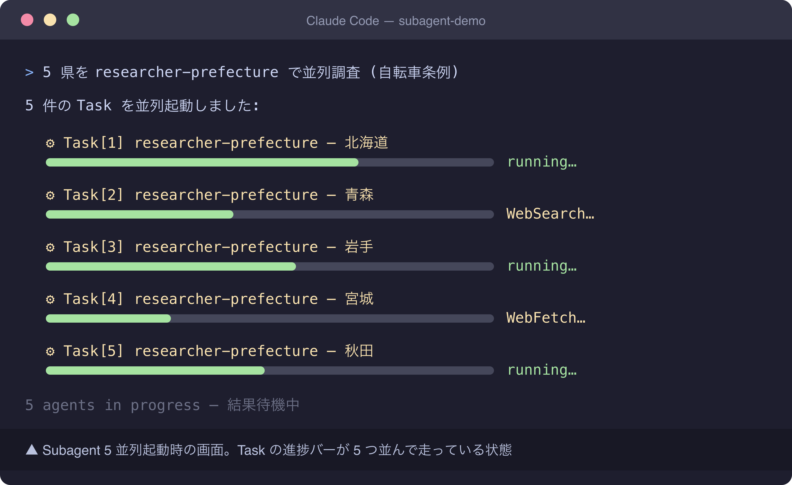

# スクリーンショット撮影ガイド

## 撮影前準備

### macOS スクリーンショットコマンド

- `Cmd + Shift + 3` — 画面全体を撮影
- `Cmd + Shift + 4` — 範囲選択して撮影（推奨）
- `Cmd + Shift + 4` → `Space` → クリック — ウィンドウ単位で撮影
- `Cmd + Shift + 5` — スクリーンショットアプリ起動

撮影後は `~/Desktop/` に自動保存される。

### 推奨ターミナル設定

- フォントサイズ: 14pt
- ウィンドウサイズ: 1200 × 800 px 前後
- カラースキーム: ダーク背景推奨
- プロンプト: `$ ` のみ

### マスキング原則

- **自治体名・部署名・職員名** → 「○○市」「政策課」「田中」など伏字 or 架空名
- **議員名・住民名** → 完全マスキング（架空名 or 「議員 A」記号化）
- **`/Users/<実名>/...`** → `/Users/user/...` に置換
- **メール・電話・住所** → 完全マスキング
- **メニューバーの Apple ID** → ログアウト or トリミング

### 保存先と命名規則

- 保存先: `/Users/minamidaisuke/stats47/docs/31_note記事原稿/koumuin-claude-code/24-subagents-parallel-research/images/`
- 命名: `screenshot-N-<short>.png`
- 圧縮後上限: 1 枚 200KB 以下（pngquant）

## 撮影リスト

### Shot 1: Subagent 5 並列起動時の進捗バー画面

- **本文位置**: `### Subagent 定義ファイルを書く` の `researcher-prefecture.md` コード例の直後、`### OUTPUT FORMAT を冒頭で固定する(最重要)` の前
- **撮影対象**: Claude Code のメインセッションから Task ツール経由で `researcher-prefecture` Subagent を 5 並列起動した直後の画面。5 つの Task 呼び出しブロック（または進捗インジケータ）が縦に並び、それぞれ「running...」「In progress」「Tool call: WebSearch」などの状態表示が見える状態。各 Task の引数（都道府県名: 北海道 / 青森 / 岩手 / 宮城 / 秋田 など 5 県）も見えていると分かりやすい。
- **準備するもの**:
  - `.claude/agents/researcher-prefecture.md`（記事中のコード例をそのまま配置、ダミープロジェクトで OK）
  - 親プロンプト例（架空、5 並列を明示的にトリガー）:
    ```
    以下 5 県について Task ツールで researcher-prefecture を並列起動し、
    「自転車条例(自転車の安全利用に関する条例)」の有無 + 制定年 + 罰則の有無を調査。
    [北海道, 青森, 岩手, 宮城, 秋田]
    ```
  - 都道府県名は実在名で OK（個人情報ではない）
- **マスキング項目**:
  - サイドバーに他プロジェクトの agent 名（実 stats47 プロジェクトの `.claude/agents/*` 等）が混在しないようダミープロジェクトで撮影
  - ターミナルパス `/Users/<実名>/` は `/Users/user/...` に偽装 or トリミング
  - Web 検索結果に出る URL に組織名・自治体名が含まれる場合は撮影タイミングを Task 開始直後（結果出力前）にする
  - git ブランチ名にプロジェクト名が入っている場合はトリミング
- **推奨ファイル名**: `screenshot-1-subagent-5parallel.png`
- **撮影手順**:
  1. `/tmp/subagent-demo/` を作成し、`.claude/agents/researcher-prefecture.md` をダミーで配置（記事中の SKILL 部分をコピー）
  2. `cd /tmp/subagent-demo && claude` で起動
  3. 上記の親プロンプト（5 並列起動指示）を貼り付けて Enter
  4. Claude が Task ツールを 5 回呼び出し、5 つの実行ブロックが画面に並んだ瞬間（まだ結果が返ってこない or 進行中の状態）で `Cmd + Shift + 4` 範囲選択撮影
  5. タイミングが難しい場合は、結果が返り始めた直後でも「5 つが同時に走っている」が分かれば OK

## 撮影後手順

### 1. PNG 保存

```bash
mkdir -p /Users/minamidaisuke/stats47/docs/31_note記事原稿/koumuin-claude-code/24-subagents-parallel-research/images
mv ~/Desktop/スクリーンショット*.png \
  /Users/minamidaisuke/stats47/docs/31_note記事原稿/koumuin-claude-code/24-subagents-parallel-research/images/screenshot-1-subagent-5parallel.png
```

### 2. pngquant で圧縮

```bash
cd /Users/minamidaisuke/stats47/docs/31_note記事原稿/koumuin-claude-code/24-subagents-parallel-research/images
pngquant --quality=65-85 --ext=.png --force screenshot-1-subagent-5parallel.png
```

### 3. draft.md のマーカー置換

`> 📸 [スクリーンショット] ...` 行を以下に置換する。

```markdown

```

### 4. 個人情報残存チェック

- [ ] 自治体名・部署名・職員名・議員名が残っていないか拡大目視
- [ ] `/Users/<実名>/` がパス表示に残っていないか
- [ ] Slack/Teams/メール通知バナーが映り込んでいないか
- [ ] 他プロジェクトの agent 名（実 stats47 の agents 一覧等）がサイドバーに混入していないか
- [ ] Web 検索結果 URL に組織内ドメインが含まれていないか
- [ ] git ブランチ名にプロジェクト名が入っていないか
- [ ] Apple ID / iCloud アカウント名がメニューバーに残っていないか

問題があれば再撮影 or Preview.app で矩形塗りつぶし後に再圧縮。
