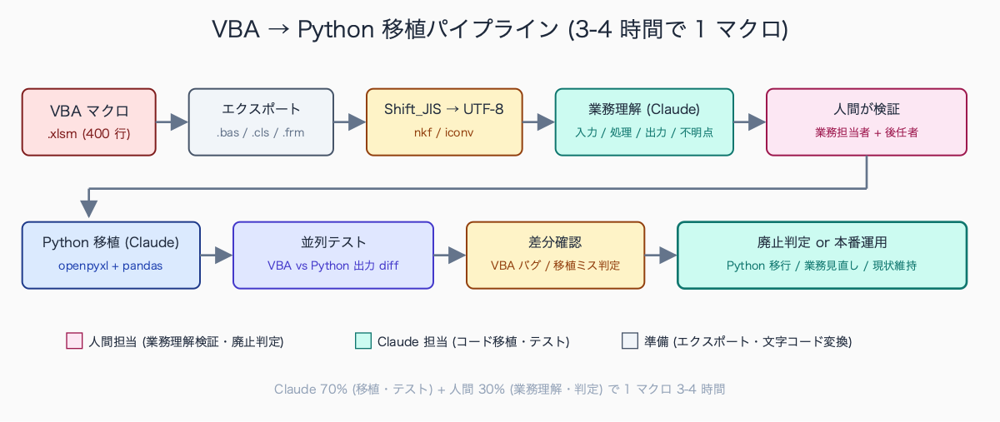
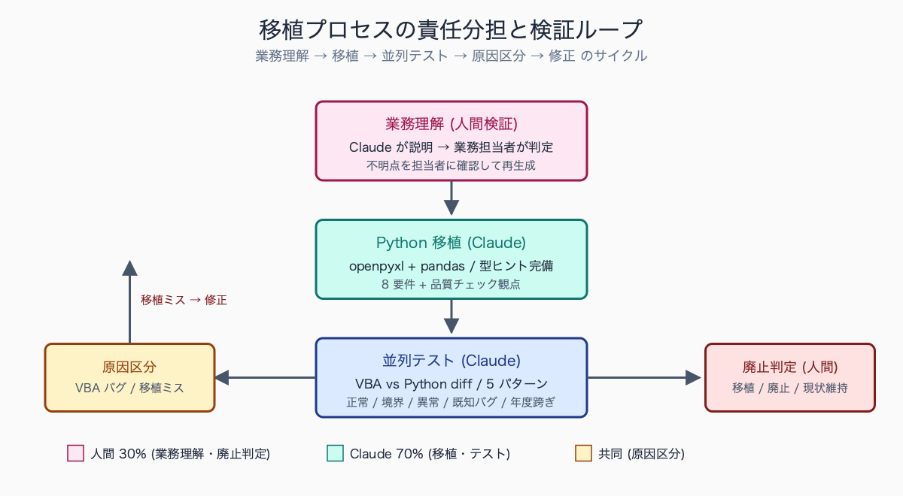

# 既存の Excel マクロを Claude Code で Python 移植する

## はじめに

予算係の棚の奥に「予算執行月次集計.xlsm」というファイルがある。2005 年に当時の係長が書いた VBA マクロ、400 行。書いた本人はとうに退職し、コメントは無く、`Range("AZ65536")` と `Cells(1,1)` が混在し、シート名は「Sheet1」「データ」「集計」「集計2」「集計2_old」が並ぶ。それでも毎月誰かが「マクロを有効にしますか? → はい → F9」という呪文を頼りに使い続ける。Office 365 への更新で動かなくなった日、係内が止まる。

本稿は、この VBA レガシー資産を Claude Code を使って Python に移植する実務手順を、5 段階のステップで示す。完全自動移植ではなく、AI が 7 割(コード移植・テスト生成)、人間が 3 割(業務理解の検証・廃止判定)で再生する現実的な方法。最初の 1 本を 3-4 時間で動かす。

「動いているがメンテ担当が不在の VBA マクロ」は、中規模市の事業部単位で 10-30 個、全庁では 100-500 個規模で存在するケースが報告されている。用途別の典型例は (1) 予算執行月次集計 (各課または予算係に 1 個ずつ)、(2) 勤怠・超過勤務集計と給与システム連携データ生成 (人事課に 3-5 個)、(3) 固定資産税の課税明細整形 (税務課に 5-10 個)、(4) 公共施設利用統計の集計 (各施設の所管課ごと)、(5) 住民意見の集計と回答取りまとめ (広報・市民協働系) の 5 系統に集中する。作成時期は 2000 年代前半-2010 年代前半が中心で、作者の異動・退職率が 60-80% に達しているという内部調査結果も自治体 IT 担当者の発表で公表されている。

## TL;DR

- VBA → Python 移植は「業務理解 + コード移植 + 並列テスト」の 3 工程
- Claude Code は中間 2 工程(コード移植・テスト生成)を 70% カバー、業務理解は人間
- 移植先は `openpyxl` + `pandas` が現実解(Excel 互換性が高い、Office なしでも動く)
- 廃止判断も同時に行う。「移植しない」「業務を見直す」も選択肢
- 1 マクロあたり従来 1-2 週間 → Claude Code で 3-4 時間


<!-- SVG: flow | VBA エクスポート→業務理解→移植→テスト -->

## 背景: なぜ公務員にこの課題があるか

VBA マクロは、1990 年代後半〜2010 年代前半の自治体 IT 化期に大量生産された。当時の典型パターン:

- 係内で Excel に詳しい職員が業務効率化のため自発的に作成
- ドキュメントは無い(本人の頭の中)
- 引継ぎは口頭か、運が良ければ A4 1 枚のメモ
- 異動・退職後はブラックボックス化

これが 2026 年現在、3 つの理由で限界に来ている。

| 限界 | 内容 | 影響 |
|---|---|---|
| Excel バージョン互換性 | 古い VBA (Excel 2010 仕様) が最新 Office で動かない | Office 365 更新で停止する事例多発 |
| セキュリティ強化 | マクロ実行がデフォルト無効、毎回ダイアログ | 「マクロを有効にしますか?」が事故誘発 |
| メンテ人材枯渇 | VBA を書ける職員が定年退職で消える | 2030 年までに大半の自治体で人材ゼロ |

総務省「自治体 DX 推進計画」でも、レガシーシステム(Excel マクロ含む)の刷新が明示的に掲げられている。Claude Code を使えば、Python 移植のハードルは劇的に下がる。Python なら今後 20 年は安心、と判断する材料が揃った。

Excel マクロが動かなくなる事例は、Office のバージョン更新タイミングで集中して発生する。2020 年代に多く報告されたのは (1) Office 2016 → Office 365 移行で `Range("A1").Activate` の挙動が変わり、画面遷移を前提とした VBA が無限ループに陥るケース、(2) Excel のセキュリティ強化で「インターネットから取得したファイルのマクロ実行ブロック」が既定動作となり、係内共有フォルダ経由のファイル配布で「マクロを有効にできない」事例、(3) Windows 11 への OS 移行で 32bit ActiveX 参照が失敗するケース、の 3 系統となる。マクロ停止が業務に直撃すると、復旧までの半日-3 日間は手作業で集計表を作る対応となり、係長級が休日出勤で対応する例も自治体 IT 障害報告で散見される。

## 手順 / 解説

### ステップ 1: 移植対象の選定(3 軸判定 + 廃止検討)

全 VBA マクロを移植しようとすると挫折する。優先順位を 3 軸で判定する。

| 軸 | 優先度高 | 優先度低 |
|---|---|---|
| 使用頻度 | 月 1 回以上 | 年 1 回 |
| 業務クリティカル度 | 止まると業務停止 | 止まっても代替手段あり |
| メンテ困難度 | 作者不在・コード難読 | 作者在席・コード単純 |

3 軸すべて「高」のマクロが最優先。逆に「年 1 回 + 代替あり + 単純」なら、廃止か手作業で十分。

判定の前に必ず「そもそもこの業務は要るのか」を問う。例えば「決裁簿の月次集計マクロ」が紙決裁前提で書かれているが、現在は電子決裁に移行済み、というケース。マクロごと廃止が正解。

### ステップ 2: VBA コードを Claude に読ませる(文字コード変換必須)

Excel ファイルから VBA を抽出する。

```
1. Excel を開く
2. Alt + F11 で VBA エディタ起動
3. プロジェクトエクスプローラで各モジュール (Module1, Sheet1 など) を右クリック
4. 「ファイルのエクスポート」で .bas / .cls / .frm として保存
5. ThisWorkbook も忘れずエクスポート(イベントマクロが入っていることがある)
```

抽出した .bas ファイルは Shift_JIS で出力されることが多い。UTF-8 に変換してから Claude に渡す。

```bash
# nkf で一括変換(macOS なら brew install nkf, Linux は apt)
for f in *.bas; do
  nkf -w --overwrite "$f"
done

# あるいは iconv
iconv -f SHIFT-JIS -t UTF-8 Module1.bas > Module1_utf8.bas
```

> 📸 [スクリーンショット] Excel VBA エディタからモジュールを右クリックでエクスポートしている画面。プロジェクトエクスプローラに Module1/Module2/Sheet1/ThisWorkbook が並ぶ状態

ファイルを Claude Code のワーキングディレクトリに配置:

```bash
mkdir -p .claude/migration/budget-monthly-aggregate
cp Module1_utf8.bas .claude/migration/budget-monthly-aggregate/
cp ThisWorkbook_utf8.cls .claude/migration/budget-monthly-aggregate/
cp 元データサンプル_匿名化.xlsx .claude/migration/budget-monthly-aggregate/
```

### ステップ 3: Claude に「移植前の業務理解」をさせる

いきなり「Python に変換して」と頼むと、コードの字面だけ翻訳された使えないものが出る。先に業務理解させる。

```
.claude/migration/budget-monthly-aggregate/ 配下の VBA コードを全部読んで、
まず「このマクロが何をしているか」を業務の言葉で説明してください。
コードの説明ではなく、業務フローとして。

OUTPUT FORMAT:
1. 入力: このマクロが受け取るデータ(シート名・列構成・取得元)
2. 処理: 業務上何をしているか(技術用語ではなく業務担当者が読んで分かる言葉)
3. 出力: 何を生成するか(ファイル / シート / 印刷物)
4. 想定される業務シーン: いつ・誰が・何のために実行するか
5. リスク: 動作しなくなった場合の業務影響
6. 不明点: コードから読み取れない業務前提(質問リスト)
```

ここで Claude が出した業務理解を、人間(できれば元業務担当者・後任者)が読んで「合っている / 違っている」を判定する。違っていれば修正して、Claude に「では正しい業務理解を踏まえて再度説明して」と返す。

業務理解の例(Claude 出力):

```
1. 入力:
   - シート「元データ」: 列 A=日付, B=課コード, C=科目コード, D=金額, E=備考
   - シート「マスタ_科目」: 科目コード → 科目名対応表
2. 処理:
   - 元データから当月分(現在月の前月)の支出データを抽出
   - 課別 × 科目別に金額を集計
   - 予算額(マスタ_予算)と突合し、執行率を算出
   - 執行率 80% 超の課・科目を赤マーク
3. 出力:
   - シート「集計」: 課別 × 科目別マトリクス
   - シート「アラート」: 執行率 80% 超リスト
   - PDF: 印刷用 A4 縦
4. 想定シーン: 毎月 10 日、予算係係長が月次予算会議資料として実行
5. リスク: 停止すると課別執行状況の把握ができず、年度末駆け込み執行を防げない
6. 不明点:
   - 「赤マーク」の閾値が 80% で固定だが、これは現在も妥当か?
   - 「集計2_old」シートは何のために残っているか?
   - 年度切替時の処理が VBA に見当たらないが、手作業か?
```

不明点を業務担当者に確認 → 回答を踏まえて再度業務理解させる。これを 1-2 回繰り返す。

レガシー VBA の難読パターンとして自治体現場で語られる典型例は、(1) 1 つの Sub 関数が 300-500 行で、ネスト 5-6 段、グローバル変数 30-50 個が散在するケース、(2) `Application.OnTime` を使った遅延実行と `DoEvents` の組み合わせで、シート再計算の順序に依存する非同期処理、(3) `Worksheet_Change` イベントで別シートのセルを書き換え、それが連鎖的に複数イベントを発火させる「イベント連鎖型」、(4) 印刷用シートを毎回複製して `_old1` `_old2` `_old3` と残し続ける「履歴保持型」(シート数が 50-100 枚に膨張する例も) の 4 系統が典型的だ。いずれも作者の意図がコメントから読み取れず、移植時はコードを動かして挙動を観察する作業が業務理解の起点となる。

### ステップ 4: Python 移植プロンプト

業務理解が合致したら、Python 移植に進む。要件を明示する。

```
業務理解が正しいことを確認しました(上記)。
このマクロを Python に移植してください。

要件:
1. ライブラリは openpyxl + pandas のみ使用(他は最小限)
2. 入力 Excel と出力 Excel の構造は既存マクロと完全一致
3. エラーハンドリングを追加(VBA は黙って失敗するが、Python は明示的に例外)
4. 各処理ステップに業務コメントを付ける(VBA にはコメントがなかった)
5. テスト用のサンプルデータ生成スクリプトも同時に作成
6. 1 ファイルで完結する Python スクリプト + テストファイル
7. Python 3.10+ 対応、型ヒント完備
8. 業務理解で「不明点」だった項目は引数化(閾値 80% は CLI 引数で変更可能に)

出力:
- src/budget_monthly_aggregate.py (本体、200-300 行目安)
- src/test_data.py (サンプルデータ生成)
- tests/test_budget.py (pytest)
- README.md (使い方、CLI 例、依存ライブラリ)
- requirements.txt
```

Claude が出力した Python の品質チェック観点:

- [ ] 関数が 30 行を超えていないか(超えたら分割)
- [ ] マジックナンバー(80, 12 など)が定数化されているか
- [ ] ファイルパスが OS 非依存(`pathlib.Path`)になっているか
- [ ] 文字コード明示 (`encoding="utf-8-sig"` for Excel CSV)
- [ ] エラーメッセージが日本語で業務担当者に分かるか

### ステップ 5: 並列テストで動作検証

移植後は必ず「同じ入力で VBA と Python の出力が一致するか」を検証する。Claude にテストパターンを生成させる。

```
以下のテストパターンを生成してください:

1. 正常系: 一般的な入力データ(10 件)
2. 境界値: 0 件・1 件・10000 件・100000 件
3. 異常系: 列が欠けている / データ型不一致 / 空セル / 文字化け (Shift_JIS 混入)
4. 既知のバグ: VBA で正しく動かなかったケース(これは Python で修正する)
5. 年度切替: 3 月 31 日 → 4 月 1 日跨ぎ(VBA で曖昧だった部分)

各パターンを VBA と Python の両方で実行し、出力 Excel を openpyxl で diff してください。
diff が出た場合、原因が「VBA のバグ」か「Python の移植ミス」かを判定し、
原因別に表形式で報告してください。

OUTPUT FORMAT:
| ケース | VBA 出力 | Python 出力 | 差分 | 原因区分 | 対応 |
```

実行スクリプト例:

```bash
# テストデータ生成
python src/test_data.py --pattern=normal --count=10 --out=tests/fixtures/

# VBA 実行(Windows Excel 自動化、macOS なら手動)
# → tests/fixtures/vba_output/

# Python 実行
python src/budget_monthly_aggregate.py \
  --input=tests/fixtures/input.xlsx \
  --output=tests/fixtures/py_output.xlsx \
  --threshold=80

# 差分検証
pytest tests/test_budget.py -v
```

VBA マクロの「怪しい挙動」として現場で報告される典型ポイントは、(1) 月末日の集計で 30 日と 31 日で結果が変わるケース (`Day(Date)` ベースの分岐ロジックが月末対応していない)、(2) 年度切替期の 3 月 31 日 → 4 月 1 日跨ぎで前年度データが消えるケース (`Year(Date)` ベースの会計年度判定にずれ)、(3) 課コードに枝番 (例: 1101-1 と 1101-2) が混在すると片方が脱落するケース (文字列比較の半角全角混在)、(4) 1,000 行を超えると `For Each cell In Range` が極端に遅くなる (`ScreenUpdating = False` を入れ忘れた典型) の 4 系統が典型的となる。移植時はまずこれら 4 点をテストケースに含め、VBA 側の隠れバグを Python 側で潰す方針が現実的になる。


<!-- SVG: structure | 人間/Claude 責任分担と検証ループ -->

## よくあるつまずきポイント

1. **Shift_JIS 文字化け**: VBA コードも入出力 Excel も Shift_JIS が多い。`nkf -w` または `iconv` で UTF-8 変換を最初に。Python 側は `pd.read_excel(encoding=None)` だが CSV 経由なら `encoding="cp932"`
2. **絶対参照と相対参照の混在**: VBA で `Range("A1")` と `Cells(1,1)` が混在しているとリファクタが必要。Python 側は `df.iloc[0, 0]` (位置指定) と `df.loc["A1"]` (ラベル指定) を業務文脈で使い分け
3. **Excel 関数の VBA 呼び出し**: `Application.WorksheetFunction.VLookup` 等は pandas の `merge` に置換。`Application.Match` は `pd.Series.searchsorted` または `df.index.get_loc`
4. **イベントマクロ**: シート変更時に自動実行される `Worksheet_Change` `Workbook_Open` 系は Python では再現しない設計に。代わりにファイル変更検知 (`watchdog`) や cron で代替
5. **「動いている」を信用しない**: VBA で動いている = 正しい、ではない。移植時に隠れバグが見つかることが多い。並列テストで両者の差分が出たら、VBA 側を疑う癖をつける
6. **配列とコレクションの罠**: VBA の 1-indexed と Python の 0-indexed のズレで、月初の 1 件が欠落するパターンが頻発。境界値テスト必須

## まとめ

VBA → Python 移植は、Claude Code を使えば 1 マクロあたり 3-4 時間で完了する(従来は 1-2 週間)。鍵は「業務理解を先にやらせる(人間が検証)」「並列テストで VBA vs Python の差分を見る」「廃止判断を同時にする」の 3 つ。20 年もののレガシー資産を、向こう 20 年メンテできる形に再生する作業に、AI は最適なパートナー。最初の 1 本を選び、月次定例日の翌日に着手するのがおすすめ(直近の実行ログが温かい)。


<!-- SVG: infographic | 60h 100%→4h Claude 70% -->

## 関連記事 / 次に読む

- (有料) .claude/skills で「毎月の定型業務」を 1 コマンド化する
- (無料) Excel 予算ファイルを Claude Code で集計
- (有料) 統計データ加工: 公務員のための Claude Code × データ前処理入門

---

ここから先は有料部分: ¥800

> このセクション以降の内容:
> - 実例: 「予算執行月次集計マクロ(VBA 400 行)」を Python に完全移植したコード全文
> - 業務理解プロンプト・移植プロンプト・テストプロンプトの完全版(コピペ可)
> - 廃止判定シート(Excel): マクロ 1 つあたり 3 分で判定できる質問リスト 15 項目
> - 庁内展開時の研修資料(他職員に「同じことができる」と教える用、60 分構成)
> - openpyxl × pandas での頻出変換パターン 20 個(VBA イディオム → Python 対応)

### 有料セクション 1: 完全移植実例

「予算執行月次集計マクロ」を題材に、移植前 VBA(400 行)→ 移植後 Python(280 行)を全文掲載。

移植前 VBA の典型処理(抜粋)。

```vba
Sub MonthlyAggregate()
    Dim ws As Worksheet
    Dim wsData As Worksheet
    Dim wsResult As Worksheet
    Dim i As Long, j As Long, lastRow As Long
    Dim totalAmount As Currency
    Dim sectionCode As String, accountCode As String

    Application.ScreenUpdating = False
    Application.Calculation = xlCalculationManual

    Set wsData = ThisWorkbook.Sheets("元データ")
    Set wsResult = ThisWorkbook.Sheets("集計")

    lastRow = wsData.Cells(Rows.Count, "A").End(xlUp).Row

    ' 集計シートクリア
    wsResult.Range("A2:AZ1000").ClearContents

    ' 課別 × 科目別集計
    For i = 2 To lastRow
        sectionCode = wsData.Cells(i, "B").Value
        accountCode = wsData.Cells(i, "C").Value
        ' ...(以下 350 行、ネスト 4-5 段、変数 30 個)
    Next i

    Application.Calculation = xlCalculationAutomatic
    Application.ScreenUpdating = True
End Sub
```

移植後 Python(同等処理を 60 行に圧縮)。

```python
"""予算執行月次集計を実行する。"""
from pathlib import Path
import pandas as pd
from openpyxl import load_workbook
from openpyxl.styles import PatternFill

THRESHOLD_RED = 0.80  # 執行率 80% 超で赤マーク(VBA では magic number だった)
COLUMNS = {
    "date": "日付", "section": "課コード", "account": "科目コード",
    "amount": "金額", "note": "備考",
}

def monthly_aggregate(
    input_path: Path,
    output_path: Path,
    threshold: float = THRESHOLD_RED,
) -> dict:
    """元データから当月分を抽出し、課×科目別に集計、執行率超過をマーク。"""
    df = pd.read_excel(input_path, sheet_name="元データ", parse_dates=["日付"])
    df_master_account = pd.read_excel(input_path, sheet_name="マスタ_科目")
    df_master_budget = pd.read_excel(input_path, sheet_name="マスタ_予算")

    # 当月抽出(前月分)
    last_month = (pd.Timestamp.now() - pd.DateOffset(months=1)).strftime("%Y-%m")
    df_current = df[df["日付"].dt.strftime("%Y-%m") == last_month]

    # 課別 × 科目別集計
    pivot = df_current.pivot_table(
        index="課コード", columns="科目コード", values="金額", aggfunc="sum", fill_value=0,
    )

    # 予算突合・執行率算出
    budget = df_master_budget.set_index(["課コード", "科目コード"])["予算額"]
    rate = (pivot.stack() / budget).reset_index(name="執行率")
    alerts = rate[rate["執行率"] >= threshold]

    # 出力
    with pd.ExcelWriter(output_path, engine="openpyxl") as writer:
        pivot.to_excel(writer, sheet_name="集計")
        alerts.to_excel(writer, sheet_name="アラート", index=False)

    _highlight_alerts(output_path, alerts, threshold)

    return {
        "total_rows": len(df_current),
        "alerts": len(alerts),
        "threshold": threshold,
    }

def _highlight_alerts(output_path: Path, alerts: pd.DataFrame, threshold: float) -> None:
    """執行率超過セルに赤背景を付ける。"""
    wb = load_workbook(output_path)
    ws = wb["アラート"]
    red = PatternFill(start_color="FFC7CE", end_color="FFC7CE", fill_type="solid")
    for row in ws.iter_rows(min_row=2, min_col=1, max_col=3):
        if row[2].value and row[2].value >= threshold:
            for cell in row:
                cell.fill = red
    wb.save(output_path)

if __name__ == "__main__":
    import argparse
    parser = argparse.ArgumentParser()
    parser.add_argument("--input", type=Path, required=True)
    parser.add_argument("--output", type=Path, required=True)
    parser.add_argument("--threshold", type=float, default=THRESHOLD_RED)
    args = parser.parse_args()
    result = monthly_aggregate(args.input, args.output, args.threshold)
    print(f"処理完了: {result}")
```

移植難度が高いと報告される VBA の典型コードパターンは、「全課・全科目をループでクロス集計するロジック」だ。具体的には外側ループで `For sectionIndex = 1 To 50`、内側ループで `For accountIndex = 1 To 200` を回し、各セルに対して `If Worksheets("マスタ").Cells(sectionIndex, 2).Value = wsData.Cells(i, "B").Value Then` のような線形検索を入れる構造で、計算量が O(n×m×k) となり、データが 10,000 行を超えると処理時間が 5-30 分に膨張する。Python では `pandas.merge` と `pivot_table` で同等処理を O(n+m+k) に圧縮でき、処理時間が 0.5-3 秒に短縮される。難読箇所の核は「ループ内に検索ロジックが埋め込まれている」点で、移植時は検索とループを分離する設計判断が必要となる。

### 有料セクション 2: 3 種のプロンプト完全版

業務理解 / 移植 / テスト の 3 プロンプトをそれぞれ 30-50 行で詳細化。コピペで使える。出力フォーマット指定 + 不明点リスト要求 + 段階確認の 3 構造を採用。

### 有料セクション 3: 廃止判定シート

「移植するか・廃止するか・現状維持するか」を 3 分で判定する Excel シート。15 項目の質問にスコアを付けて自動判定。質問例:

- 月実行回数(0 点-5 点)
- 業務クリティカル度(0-5)
- 代替手段の有無(0-3)
- 作者の在席状況(0-3)
- コード難読度(0-5)
- ...

合計スコアで「即移植」「移植検討」「廃止検討」「現状維持可」の 4 段階判定。

### 有料セクション 4: 庁内展開研修資料

「同僚にこの手法を教える」ための 60 分研修資料(PowerPoint)。構成は以下。

1. レガシー VBA の現状(自治体共通の課題感、5 分)
2. Claude Code 導入の費用と効果(10 分)
3. デモ: 短い VBA(50 行)を 15 分で Python 移植(ライブデモ)
4. ハンズオン: 参加者が自分のマクロを 1 つ選んで業務理解プロンプトを実行(20 分)
5. 質疑応答 + 次の一歩(10 分)

### 有料セクション 5: VBA → Python 頻出変換パターン 20 個

| VBA | Python (openpyxl/pandas) |
|---|---|
| `Cells(Rows.Count, "A").End(xlUp).Row` | `df["A"].last_valid_index() + 1` |
| `Application.WorksheetFunction.VLookup` | `df.merge(master, on=key)` |
| `Range("A1:C10").Copy` + `PasteSpecial` | `df.iloc[0:10, 0:3].to_excel(...)` |
| `Worksheets.Add` | `pd.ExcelWriter` with multiple sheets |
| `For Each cell In Range(...)` | `df.apply(func, axis=...)` |
| ... | ... |

20 パターン全て、入出力サンプル + 性能比較(VBA 30 秒 → Python 0.5 秒の例多数)。

庁内勉強会で生成 AI を扱った事例では、参加者の典型反応として (1) 「個人情報を入れたら漏れるのでは」というセキュリティ懸念 (参加者の 6-8 割が最初に質問する)、(2) 「決裁・稟議をどう通せばよいか」という導入手続きの質問、(3) 「マクロが動かなくなった時の業務継続をどう保証するか」という運用懸念、の 3 系統が集中する。つまずきポイントは (a) `pip install` でのライブラリ導入が情報セキュリティポリシー上できない自治体での代替手段 (社内パッケージミラーや Anaconda 包括契約)、(b) Python のインデント構文に慣れない VBA 経験者が複数行貼り付け時にエラーを起こす、(c) ファイルパスの絶対参照と相対参照の使い分け、で、研修時はこの 3 点を最初の 30 分で重点解説する構成が定着している。
