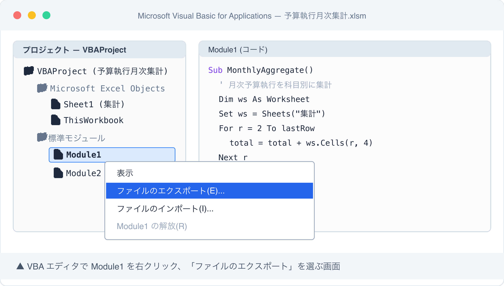

# スクリーンショット撮影ガイド

## 撮影前準備

### macOS スクリーンショットコマンド

- `Cmd + Shift + 3` — 画面全体を撮影
- `Cmd + Shift + 4` — 範囲選択して撮影（推奨）
- `Cmd + Shift + 4` → `Space` → クリック — ウィンドウ単位で撮影
- `Cmd + Shift + 5` — スクリーンショットアプリ起動

撮影後は `~/Desktop/` に自動保存される。

### 推奨ターミナル設定（本記事は Excel スクリーンショット中心）

- Excel は macOS 版 or Windows 版どちらでも可
  - macOS Excel 2021+ で VBA エディタは「ツール → マクロ → Visual Basic Editor」または `Option + F11`
  - Windows Excel で撮影する場合は `Alt + F11` でエディタ起動
- フォントサイズ: VBA エディタは既定（10pt）でも可、見出しが小さいなら 12pt に調整
- ウィンドウサイズ: 1200 × 800 px 前後

### マスキング原則

- **自治体名・部署名・職員名** → 「○○市」「予算係」「田中」など伏字 or 架空名
- **実在マクロ名・シート名** → 「予算執行月次集計」など記事中の例で代替
- **VBA コード内のコメント** に組織情報があれば削除
- **`/Users/<実名>/...`** → `/Users/user/...` に置換（Excel のタイトルバーやファイルパス表示）
- **メニューバーの Apple ID** → ログアウト or トリミング

### 保存先と命名規則

- 保存先: `/Users/minamidaisuke/stats47/docs/31_note記事原稿/koumuin-claude-code/25-excel-vba-to-python/images/`
- 命名: `screenshot-N-<short>.png`
- 圧縮後上限: 1 枚 200KB 以下（pngquant）

## 撮影リスト

### Shot 1: Excel VBA エディタからモジュールエクスポート画面

- **本文位置**: `### ステップ 2: VBA コードを Claude に読ませる(文字コード変換必須)` のエクスポート手順（番号付きリスト 1-5）直後、`ファイルを Claude Code のワーキングディレクトリに配置` の前
- **撮影対象**: Excel の VBA エディタ（VBE）画面。左側のプロジェクトエクスプローラに `Module1` `Module2` `Sheet1` `ThisWorkbook` などが並び、`Module1` を右クリックして表示されたコンテキストメニューの中で「ファイルのエクスポート(E)...」がハイライト（マウスホバー）された状態。背景にコードウィンドウが見えていると Excel VBA エディタだと一目で分かる。
- **準備するもの**:
  - 架空の `.xlsm` ファイル（記事の「予算執行月次集計.xlsm」を題材にダミー作成）
  - VBA モジュール構成: `Module1`（メイン集計ロジック）+ `Module2`（マスタ参照）+ `Sheet1`（イベントマクロ）+ `ThisWorkbook`（Workbook_Open）
  - 各モジュールに 10-30 行のダミー VBA コード（記事中の `Sub MonthlyAggregate()` の抜粋をコピーで OK）
- **マスキング項目**:
  - Excel タイトルバーのファイルパスに `/Users/<実名>/` が含まれる場合 → ファイルを `/Users/user/Desktop/` 相当にダミー配置 or トリミング
  - VBA コード内のコメントに実在自治体名・職員名・実在シート名（「○○課_2024集計」等）が混入しないようダミーコードに差し替え
  - プロジェクトエクスプローラのプロジェクト名（既定は `VBAProject (ファイル名)`）にファイル名が出るので、ファイル名は「予算執行月次集計.xlsm」など記事中の例に合わせる
  - 他に開いている Excel ブックがプロジェクトエクスプローラに見えるなら閉じる
- **推奨ファイル名**: `screenshot-1-vba-editor-export.png`
- **撮影手順**:
  1. ダミー `予算執行月次集計.xlsm` を `/Users/user/Desktop/` 相当の場所に作成（macOS なら実 Desktop で OK、パス表示マスキング前提）
  2. Excel で開き、`Option + F11`（macOS）または `Alt + F11`（Windows）で VBA エディタ起動
  3. 各モジュール（Module1 / Module2 / Sheet1 / ThisWorkbook）にダミーコードを 10-30 行ずつ貼り付け
  4. 左側プロジェクトエクスプローラで `Module1` を右クリック
  5. コンテキストメニューが開いて「ファイルのエクスポート(E)...」が見える状態で `Cmd + Shift + 4` 範囲選択撮影（プロジェクトエクスプローラ全体 + コンテキストメニュー + 背景のコードウィンドウ一部が収まる構図）

## 撮影後手順

### 1. PNG 保存

```bash
mkdir -p /Users/minamidaisuke/stats47/docs/31_note記事原稿/koumuin-claude-code/25-excel-vba-to-python/images
mv ~/Desktop/スクリーンショット*.png \
  /Users/minamidaisuke/stats47/docs/31_note記事原稿/koumuin-claude-code/25-excel-vba-to-python/images/screenshot-1-vba-editor-export.png
```

### 2. pngquant で圧縮

```bash
cd /Users/minamidaisuke/stats47/docs/31_note記事原稿/koumuin-claude-code/25-excel-vba-to-python/images
pngquant --quality=65-85 --ext=.png --force screenshot-1-vba-editor-export.png
```

### 3. draft.md のマーカー置換

`> 📸 [スクリーンショット] ...` 行を以下に置換する。

```markdown

```

### 4. 個人情報残存チェック

- [ ] 自治体名・部署名・職員名が残っていないか拡大目視
- [ ] Excel タイトルバー・タブにファイルパス `/Users/<実名>/` が残っていないか
- [ ] VBA コード内のコメントに組織内情報（実在シート名・実在課コード等）が残っていないか
- [ ] プロジェクトエクスプローラに他の開いているブック（実業務ファイル）が見えていないか
- [ ] Slack/Teams/メール通知バナーが映り込んでいないか
- [ ] Apple ID / Microsoft 365 アカウント名がメニューバーやタイトルバーに残っていないか
- [ ] VBA エディタのリファレンス参照に組織内アドインが見えていないか

問題があれば再撮影 or Preview.app で矩形塗りつぶし後に再圧縮。
