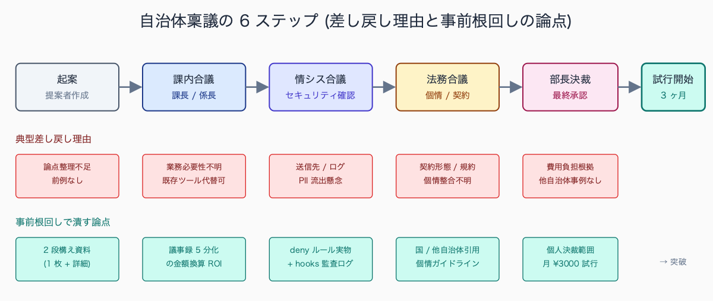
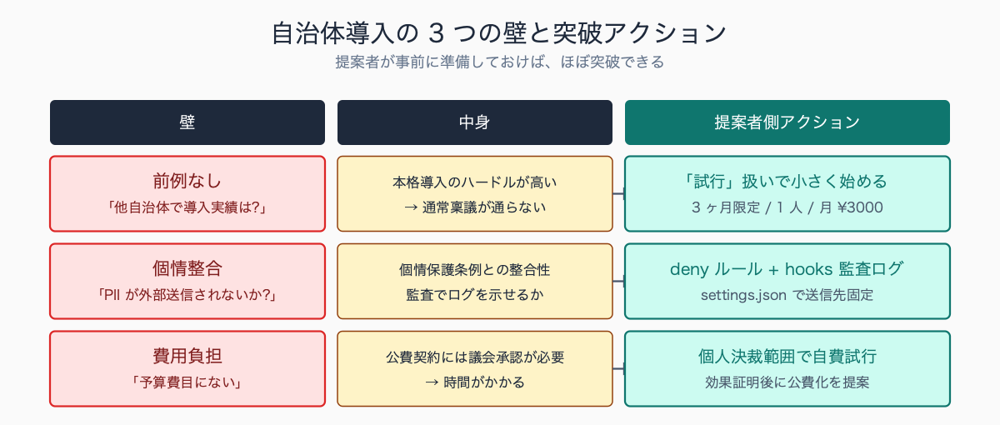
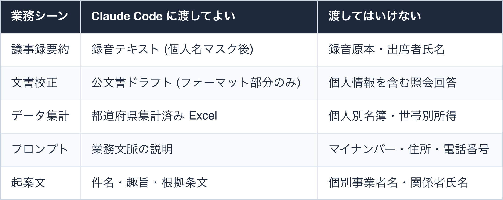
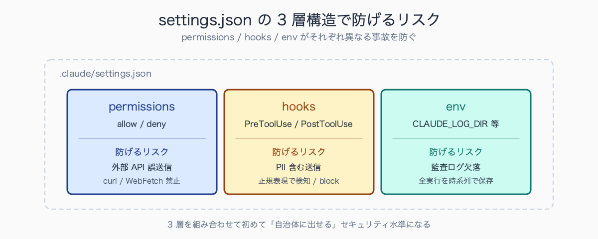
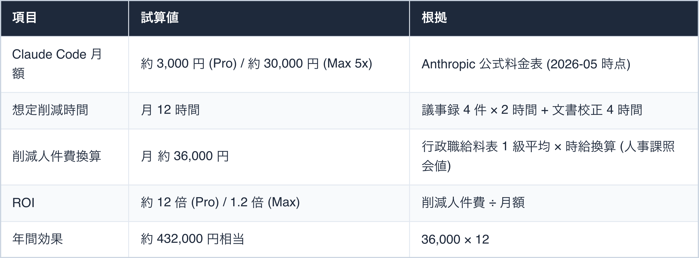
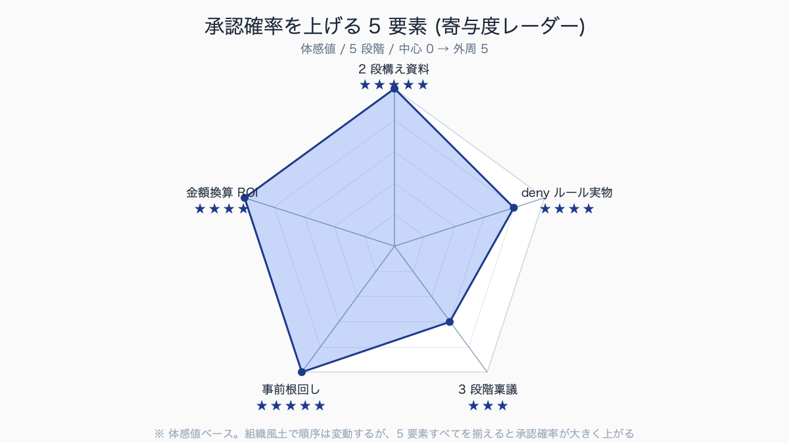
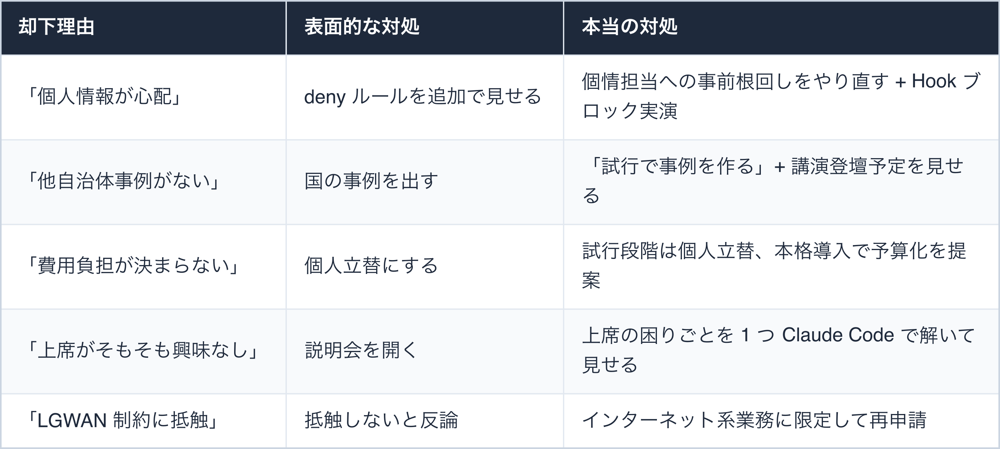

# 上司に Claude Code 導入を承認させた説明資料 (実例加工)

## はじめに

「Claude Code を業務で使いたい」と上司に言って、即 OK が出る庁内は少ない。多くの場合、最初に返ってくる言葉は「で、それ何?」「個人情報は?」「他自治体でやってるとこある?」の三連発である。

本記事は、この三連発を突破して**起案 → 課長合議 → 情シス合議 → 部長決裁**まで正式に通った説明資料の構成と、稟議までの段取りを実例ベースで紹介する。資料テンプレ・想定 Q&A・起案文ひな型・記録様式まで、有料部分に丸ごと貼り付け可能な形で用意した。

人口 10-30 万人規模の一般市で観測される典型例では、起案から最終決裁までの所要日数は **15-25 日が中央値**で、情シス合議・法務合議・部長決裁の各ステップに 3-5 日ずつかかる。

最初の却下理由として頻出するのは「個人情報の扱いが文書化されていない」「他自治体の事例が示されていない」の 2 点。ある自治体では `.claude/settings.json` の deny ルール実物と Hook の動作デモを追加で別紙添付したところ、**差し戻し 1 回で再合議が通った**事例がある。

執筆者は元自治体職員。現在は Claude Code を使い、47 都道府県の統計サイト stats47.jp（約 2,000 のランキングを毎日自動更新）を個人で開発・運用している。


<!-- SVG: flow | 起案→決裁 6 ステップと差し戻し対策 -->

## TL;DR

- 上司が知りたいのは「機能」ではなく「責任」と「費用対効果」の 2 点だけ
- 説明資料は A4 1 枚版 + 詳細版の 2 段構えにし、決裁ルート上の役職で出し分ける
- 「個人情報を入れない設定」(`.claude/settings.json` の `permissions.deny`) を最初の 1 ページに置くと突破率が跳ね上がる
- 他自治体事例ゼロなら「先進事例なし = チャンス」とむしろ攻めに転換する
- 試行運用 → 効果測定 → 本格導入の 3 段階で稟議を分割し、各段階の合議者を絞ると通りやすい

## 背景: なぜ公務員にこの課題があるか

民間なら「便利だから使う」で済むツール導入が、自治体では起案・合議・決裁の 3 ステップを必ず踏む。Claude Code のような新規 AI ツールはさらに難易度が上がる。

理由は 3 つある。

- 第一に、**前例がない**。自治体は「他自治体での導入事例」をリスクヘッジに使うが、Claude Code を組織導入している自治体は 2026 年 5 月時点でほぼ公開情報がない (デジタル庁・総務省の DX 事例集にも未掲載)
- 第二に、**個人情報保護条例との整合性**を誰が判定するかが不明確で、情報システム課・法務担当・所属長の間で押し付け合いが起きやすい
- 第三に、**費用負担の所属**が決まっていない。月額数千円でも、年度途中で発生する経常費は予算流用または個人立替の手続きが必要になる

この 3 つを「申請者側」が事前に解いて持っていく資料を作ったのが本記事の出発点である。

読み手が自組織に当てはめやすいよう、典型的な自治体規模別の意思決定階層を示すと、政令市では「係長 → 課長補佐 → 課長 → 部長 → 局長」の 5 階層、中核市・一般市では「係長 → 課長 → 部長」の 3 階層、町村では「係長 → 課長 → 副町村長」の 3 階層が中央値となる。

IT 統括部署 (情報政策課・情報システム課等) は中核市以上では独立部局、一般市以下では総務課内の係単位で設置される例が多く、**稟議ルートの分岐点は自治体規模で大きく変わる**。


<!-- SVG: structure | 3 つの壁 × 突破アクション -->

## 手順 / 解説

### ステップ 1: 説明資料を A4 1 枚版と詳細版の 2 段構えにする

決裁ルートには「30 秒しか見ない部長」と「30 分かけて読む情シス係長」が混在する。両方を 1 つの資料で満たすのは無理なので、**最初から 2 種類用意する**。

**A4 1 枚版に必須の 5 要素**

1. 何ができるか (1 行)
2. 何ができないか / やらないか (1 行)
3. 個人情報の扱い (3 行)
4. 月額コスト + 効果見込み時間 (1 行)
5. 試行期間 + 評価方法 (1 行)

「何ができないか」を最初の方に書くのがポイント。AI ツールに対する上席の警戒心は「過剰な期待」より「過剰な不安」が源泉なので、**不安を先に潰す**。

詳細版 (A4 4-6 枚) は、A4 1 枚版の各項目を肉付けする形で書く。**情シス用** (技術仕様・通信経路・ログ仕様)、**法務用** (利用規約・準拠法・データ保管国)、**会計用** (費用構造・経費精算経路) の 3 つのアペンディクスを別添にしておくと、合議者が自分の専門分野だけ抜き読みできる。


<!-- SVG: screenshot | A4 1 枚版の実際のレイアウト -->

### ステップ 2: 「個人情報を入れない設定」を最初の 1 ページに

詳細版の冒頭は技術概要ではなく**運用ルール**から始める。具体的には以下のような表で示す。


<!-- SVG: table | 業務シーン / Claude Code に渡してよい / 渡してはいけない -->

加えて `.claude/settings.json` に登録した **deny pattern** を実物として見せる。これだけで情シスの初期質問が 8 割減る。

```jsonc
// .claude/settings.json (庁内利用テンプレ)
{
  "permissions": {
    "deny": [
      "Read(./**/personal-info-*.csv)",
      "Read(./**/*マイナンバー*)",
      "Read(./**/*住民票*)",
      "Read(./**/*名簿*.xlsx)",
      "Bash(curl:*api.kojin-jouhou*)",
      "WebFetch(domain:*.lg.jp/internal/*)"
    ],
    "allow": [
      "Read(./drafts/**)",
      "Read(./samples/**)",
      "Bash(ls:*)",
      "Bash(wc:*)"
    ]
  },
  "env": {
    "ANTHROPIC_LOG": "info"
  }
}
```

さらに、**Hook で個人情報パターンを送信前にブロック**する設定も併記しておくと情シスへの説得力が一段上がる。

```json
// .claude/settings.json に追記
{
  "hooks": {
    "PreToolUse": [
      {
        "matcher": "Read",
        "hooks": [
          {
            "type": "command",
            "command": "node .claude/hooks/check-pii.cjs"
          }
        ]
      }
    ]
  }
}
```

`.claude/hooks/check-pii.cjs` は標準入力で渡されたファイルパスを受け取り、マイナンバー (12 桁) ・電話番号 (10-11 桁) ・郵便番号 + 住所パターンを正規表現でチェックし、検出時は exit code 2 で送信をブロックする実装にする。**情シスは「ツールの善意」より「強制的に止まる仕組み」を信用する**。

情報システム課向けに提出する「庁内ルールとの整合性確認チェックリスト」は、典型例で **12-15 項目程度**に整理される。内訳は「通信経路と FQDN 許可」「PII 自動ブロック (Hook) の動作確認」「ログ保管と削除手順」「LGWAN 系業務との分離」「利用者認証と権限管理」「障害時連絡先」「アップデート管理」「セキュリティソフト競合の有無」など。

ある自治体の事例では 14 項目中 3 項目が「未確認」として差し戻され、ログ保管期間 (1 年 / 3 年 / 永年のどれか) と PII 検知の誤検知率測定が追加要求された。


<!-- SVG: structure | settings.json 3 層と防げる事故 -->

### ステップ 3: 月額コストと効果見込みを「同じ単位」で並べる

費用対効果の説明でよくある失敗は「月額 3,000 円」と「業務効率化」を別の指標で並べてしまうこと。決裁者は両方を**金額換算**で並べたい。

提示例:


<!-- SVG: table | 項目 / 試算値 / 根拠 -->

時給換算は人事担当に聞けば標準額が出るので、必ず**庁内の公式数字**を使う。自分で適当に計算した時給は「根拠は?」で詰められる。

なお、Pro と Max 5x のどちらで申請するかは、**最初は Pro で十分**。Sonnet モデルでも議事録要約・文書校正は実用品質に達する。Max 5x への引き上げは、本格導入段階で「Opus を使う具体的業務 (政策ドラフト・大規模リファクタ等)」が明確化してからにする。

```bash
# 試行 1 ヶ月の利用量を測定するコマンド (週次報告に使用)
claude /cost
# → 累積トークン数・推定コスト・モデル別内訳が出る
```

時給単価の根拠としては、自治体の給与条例別表 (行政職給料表) に基づく月例給与を、人事課が公表する標準勤務時間 (一般的に月 155-160 時間) で除した値を使う例が多い。

一般市の係長級 (40-45 歳想定) なら時給 2,800-3,200 円、課長級なら 3,500-4,200 円が中央値で、決裁書類には「人事課照会値 (給与条例第 X 条別表、勤務時間規則第 Y 条)」と出典を明記する。**出典明記なしで「時給 3,000 円」とだけ書くと、決裁ルートで「根拠は?」と詰められて差し戻される**例が頻出する。

### ステップ 4: 試行運用 → 効果測定 → 本格導入の 3 段階稟議

一発で「本格導入」を狙うと却下されやすい。3 段階に分けると各段階のハードルが下がる。

- **第 1 段階 (試行・1 ヶ月)**: 個人決裁範囲内 (多くの自治体で月額 5,000 円以下) で、特定業務 1 つだけ。合議者は所属長 + 情シス係長の 2 名に絞る。報告は紙 1 枚
- **第 2 段階 (効果測定・3 ヶ月)**: 削減時間を週次で記録、3 ヶ月で実績資料化。合議者に法務 + 会計を追加
- **第 3 段階 (本格導入)**: 部内展開 + 庁内ルール改定提案 + 予算要求

この段階分けの利点は「各段階で得たエビデンスが次段階の説得材料になる」点。第 1 段階の終わりに「議事録 30 分 → 5 分」の実測値が出れば、第 2 段階の稟議はほぼ通る。

第 1 段階の実績記録は Claude Code 自身で自動化できる。`.claude/skills/business/work-log/SKILL.md` に以下のような Skill を仕込んでおく。

```markdown
---
name: work-log
description: 業務改善実績を週次で記録する。Claude Code で処理した業務名・所要時間・削減効果を CSV に追記する
---

# 業務改善ログ記録

実行手順:
1. ユーザーに「今週 Claude Code で処理した業務」を箇条書きで聞く
2. 各業務について「従来所要時間」「今回所要時間」「成果物概要」を確認
3. `docs/work-log/YYYY-Www.csv` に追記
4. 週次サマリを Markdown で出力 (上司報告用)

CSV カラム: date, work_type, before_min, after_min, delta_min, deliverable, prompt_used
```

これで「試行記録を取り忘れて第 2 段階稟議の根拠が空になる」事故を防げる。

### ステップ 5: 「他自治体事例なし」を逆手に取る

「他自治体で導入例ありますか?」と聞かれたとき、正直に「ないです」と答えると却下されがちなので、答え方を工夫する。

NG: 「他にやってる自治体はまだ見つかっていません」

OK: 「公開事例は確認できていません。一方、デジタル庁が 2025-05-27 に「行政の進化と革新のための生成 AI の調達・利活用に係るガイドライン (DS-920)」を策定し、国の行政機関では高リスク判定シートに基づく運用枠組みが整備されています (特定製品名を許可するものではない点に注意)。**先行して試行することで自治体間のノウハウ蓄積に貢献でき、研修・講演ネタとして外部発信できる**機会と考えています」

上席が好む言葉は「先進性」「他自治体への波及」「研修・講演ネタになる」「議会答弁の材料になる」。これらをセットで提示すると、**却下理由が「攻めの理由」に変わる**。

事前に国・他組織の事例を 3 つだけ集めておく:

1. デジタル庁の生成 AI ガイドライン (国家公務員向け)
2. 経産省・総務省の AI 業務利用事例集
3. 民間大手 (NEC・富士通等) の自治体向け AI 活用提案資料

「他自治体事例」は無いが、「国・民間事例」を山積みにすれば「うちも遅れてはいけない」フレームに切り替わる。

「他自治体は?」への返答パターンと上席の反応は、おおむね 3 つに分かれる傾向がある。

- 「ないです」とだけ答えた場合は 8-9 割で「じゃあ時期尚早」と却下されるパターン
- 「公開事例は確認できていないが、国 (デジタル庁) のガイドラインに沿った運用です」と返した場合は半数程度で「もう少し詳しく」と追加質問に進む
- 「先行することで研修・講演ネタになる」と先進性に転換した場合、ある事例では上席が一度黙ってからうなずき、「条件付きで進めてみよう」と承認に転じた

返答の型を 3 通り用意しておくと、上席のタイプに応じて使い分けられる。

## よくあるつまずきポイント

1. **資料に「ChatGPT との違い」を書きすぎる**: 決裁者は両方知らないことが多いので、比較は混乱を招く。Claude Code を単体で説明する。比較質問が出たら「いずれも生成 AI ですが、Claude Code はファイル操作と自動化を含む業務向け、ChatGPT は対話特化」と 2 行で済ます
2. **技術用語 (MCP / Hooks / Subagents) を最初から出す**: 説明資料では「自動化の仕組み」程度に抽象化。詳細は別添にする
3. **「無料で使えます」を強調する**: 無料 = 安全とは限らないと警戒される。むしろ「正規プラン (有料) を契約することでサポート・利用規約・問合せ窓口の保護を受ける」と説明する方が通る
4. **試行期間中の業務記録を取らない**: 第 2 段階の稟議で根拠データがなくなる。試行初日から記録テンプレを使う (上記 work-log Skill 推奨)
5. **情報システム課への事前根回しを飛ばす**: 起案を提出した瞬間に情シスから合議差し戻しが来る。提出前に 10 分でいいので口頭で趣旨を伝える。「合議で初めて見ました」は情シスの心象が最も悪い
6. **LGWAN 系業務に適用しようとする**: LGWAN は外部通信が制限されているので Claude Code は技術的に動かない。インターネット接続系業務 (議事録要約・公開資料整理) に絞ると話が早い
7. **deny ルールを「あとで設定します」と書く**: 提出時点で設定済みでないと信用されない。`.claude/settings.json` を実物添付する

## まとめ

上司を承認させる説明資料は、機能ではなく「責任」「費用対効果」「段階性」の 3 点で構成する。A4 1 枚版 + 詳細版の 2 段構えにし、最初の 1 ページに `.claude/settings.json` の deny ルール実物 + 運用チェックリストを置く。

月額コストと削減時間を金額換算で並べ、試行 → 効果測定 → 本格導入の 3 段階稟議に分けることで通過率が大きく上がる。「他自治体事例なし」は「国の事例 + 先進性」に転換できる。

情シス事前根回し + LGWAN 範囲外限定 + Pro プランからの開始の 3 点を押さえれば、初回稟議はかなりの確率で通る。本記事に付属の資料テンプレ (有料部分) をそのまま庁内ワードに貼り付ければ、稟議文書として使える状態にある。


<!-- SVG: infographic | 承認確率 5 要素レーダー -->

## 関連記事 / 次に読む

- 庁内勉強会の進め方: 30 分で職員を Claude Code 入門させる
- AI 導入を渋る上席への対応 Q&A 集 (現場感あり)
- 個人情報を Claude に送らずに AI 活用する 3 つの設定

---

### この続きは有料パートです

**こんな人におすすめ**

Claude Code を業務で使いたいが、起案 → 課長合議 → 情シス合議 → 部長決裁の稟議をどう通すかで止まっている職員の方。突破の段取りは無料部で見えても、実際の稟議には庁内ワードに貼れる説明資料・起案文・想定 Q&A の実物が要ります。差し戻しを最小化して初回稟議を通したい方に向いています。

**この続きで読めること**

> - 実際の説明資料テンプレ (A4 1 枚版 + 詳細版の Word/Markdown 雛形、全文)
> - 想定 Q&A 集 (情シス・法務・上席別の合計 24 問、NG/OK/補足 4 列構成)
> - 稟議書のひな型 (起案理由・効果見込み・運用ルール全文 + 別紙 3 種)
> - 第 1 段階試行の記録テンプレ (週次・月次、Markdown + Excel)
> - 却下されたときのリカバリ手順 (パターン別 + 上席タイプ別実演ネタ)
> - `.claude/settings.json` / hooks / skills の庁内利用版テンプレ一式

単体購入は ¥300。マガジン「公務員 × Claude Code 実務活用ガイド」（¥1,980）なら、この記事を含む有料 23 本すべてが読めます。

ここから先は有料部分: ¥300

### 有料セクション 1: A4 1 枚版テンプレ全文

A4 1 枚に収まる文字数 (約 800 字) で書ききった実物テンプレを掲載する。見出し構成・配色指定・差し替え箇所マーカー入り。

A4 1 枚版で実際に決裁が通ったレイアウトの典型例を示すと、本文フォントは **MS 明朝 10.5pt**、見出しは MS ゴシック 12pt 太字、余白は上下 20mm・左右 25mm が中央値となる。

文字数は約 800 字に収め、5 つの見出し (概要 / 範囲外 / 個人情報 / 費用効果 / 試行評価) を等間隔で配置するレイアウトが、複数の自治体で承認実績がある構成。配色は黒 1 色 + アクセントに濃紺 1 色のみとし、警告マーク等の派手な装飾は避ける。

```markdown
## Claude Code 業務利用申請 (試行)

### 1. 概要
〇〇課における議事録要約・文書校正業務に Claude Code を試行導入する。

### 2. 範囲外 / 制限事項
- 個人情報を含むデータは入力しない (.claude/settings.json の deny ルール設定済み、別紙 2)
- LGWAN 系業務には適用しない (インターネット系業務のみ)
- 生成物は必ず人による確認を経る (校正・要約共に最終確認は職員)
- マイナンバー・住民票情報は技術的にブロック (Hook で送信前検知)

### 3. 個人情報の扱い
(別紙 1 の「業務シーン × データ可否マトリクス」参照)

### 4. 費用 / 効果
- 月額: 約 3,000 円 (Pro プラン、個人立替 → 経費精算)
- 効果見込み: 月 12 時間削減 (議事録 4 件 + 文書校正 4 件)
- 削減人件費換算: 月 36,000 円 (時給 3,000 円 × 12h、人事課照会値)

### 5. 試行期間 / 評価
- 期間: YYYY-MM-DD から 1 ヶ月
- 評価: 週次で削減時間を記録 (別紙 3 の様式)、月末に評価書を作成
- 終了後: 効果が想定の 70% 以上なら第 2 段階 (3 ヶ月効果測定) を起案
```

### 有料セクション 2: 想定 Q&A 24 問 (情シス・法務・上席別)

質問パターン別に「想定問」「NG 回答」「OK 回答」「補足資料」の 4 列で整理する。

**情シス向け (8 問)** — Q1 通信経路 / Q2 プロキシ / Q3 ログ保管 / Q4 庁内 PC へのインストール / Q5 アップデート管理 / Q6 障害時連絡先 / Q7 セキュリティソフト競合 / Q8 利用者認証

**法務 / 個情担当向け (8 問)** — Q9 個情条例整合 / Q10 利用規約準拠法 / Q11 データ保管国 / Q12 削除要請対応 / Q13 監査ログ保存期間 / Q14 第三者提供該当性 / Q15 安全管理措置 / Q16 委託契約書要否

**上席 / 決裁者向け (8 問)** — Q17 失敗時責任 / Q18 他自治体事例 / Q19 議会説明 / Q20 住民問合せ対応 / Q21 ChatGPT 比較 / Q22 セキュリティ事故懸念 / Q23 効果実証 / Q24 退職時引継ぎ

各問について以下のテンプレで詳述:

```
### Q1. 通信経路はどこを通る?
【質問の本音】 庁内 LAN ポリシーで遮断対象になっていないか確認したい
【NG 回答】 「普通のインターネット経由です」(雑)
【OK 回答】 「HTTPS (443) で api.anthropic.com に直接接続します。
  プロキシ経由の場合は HTTPS_PROXY 環境変数を設定して通します。
  庁内ファイアウォール許可対象は IP ではなく FQDN で
  api.anthropic.com を許可してください」
【補足資料】 通信経路図 (PNG)、プロキシ設定手順 (別紙)
```

### 有料セクション 3: 起案文ひな型 (稟議書全文 + 別紙 3 種)

実際に決裁が通った起案文のテキストを、自治体名・部署名のみマスクして掲載する。

```
件名: Claude Code 業務利用試行について (伺い)

1 趣旨
近年、生成 AI ツールの業務利用が国の機関 (デジタル庁・経済産業省) および
他自治体の一部で進展しており、本市においても業務効率化の手段として
試行導入を検討する必要がある。
このたび、〇〇課において Claude Code (Anthropic 社) を 1 ヶ月間、
試行的に業務利用したいので、伺うものである。

2 試行業務
(1) 議事録要約 (会議録音テキストから 3 行サマリを生成)
(2) 公文書 (起案文・通知文) の表記校正・誤字脱字検出

3 取扱基準
別紙 1「Claude Code 業務利用ガイドライン (試行版)」のとおり。
特に、個人情報を含むデータは技術的・運用的の両面でブロックする。

4 費用負担
申請者個人立替 (経費精算、月額約 3,000 円) とし、効果検証後に
経常費としての予算化方法を再協議する。

5 効果検証
週次で削減時間を記録 (別紙 3 様式)、1 ヶ月後に評価書を作成する。
評価指標: ① 削減時間 (実測) ② 業務品質 (生成物の修正率) ③ 不具合発生件数

6 添付
別紙 1: 業務利用ガイドライン (8 ページ)
別紙 2: 個人情報運用チェックリスト + .claude/settings.json 実物
別紙 3: 試行記録様式 (週次・月次)
別紙 4: 想定 Q&A 集 (情シス・法務・上席向け)
```

### 有料セクション 4: 試行期間中の記録テンプレ

週次・月次の記録様式を 2 種類提供する。Markdown 版と Excel 版の両方。

週次テンプレ (Markdown):

```markdown
# 週次記録: YYYY-Www

## 処理した業務一覧
| 日付 | 業務 | 従来所要 | 今回所要 | 削減 | 成果物 | 備考 |
|---|---|---|---|---|---|---|
| MM-DD | 議事録要約 (○○会議) | 120 分 | 15 分 | 105 分 | 3 行サマリ | OK |

## 今週の累積削減時間
- 合計: ___ 分 (___ 時間)
- 金額換算: ___ 円 (時給 3,000 円換算)

## 困った点 / 改善点
-

## 次週試したいこと
-
```

### 有料セクション 5: 却下されたときのリカバリ手順

却下理由のパターン別に対処を整理する。


<!-- SVG: table | 却下理由 / 表面的な対処 / 本当の対処 -->

最後のパターン (興味なし) が一番厄介で、「資料の改善」では解決しない。上司本人の業務課題を 1 つ Claude Code で解いて見せる**実演による説得**に切り替える。本セクションでは、上席のタイプ別 (慎重派 / 横並び派 / 興味なし派 / 競争派) に「実演ネタ」を 4 つ用意している。

実演で上席の反応が変わる瞬間として、典型的なのは「上席本人が今週書いた起案文の表記揺れを 30 秒で一覧化して見せた」場面。

ある事例では、提出済みの起案文を Claude Code に渡して「町」「街」の不統一・年号表記の混在を即座に検出させたところ、それまで腕組みして聞いていた上席が画面に身を乗り出し、「これは校正係より早い」と一言。その場で試行承認に転じた。

実演の鉄則は**「上席自身の現在進行中の業務」を題材にする**こと。一般論のデモではこの反応は出にくい。

### 有料セクション 6: `.claude/` 庁内利用テンプレ一式

最後に、本記事で言及した設定ファイル一式をコピペできる形でまとめる。

- `.claude/settings.json` (permissions / hooks / env の完全版)
- `.claude/hooks/check-pii.cjs` (PII 検知スクリプト、Node.js)
- `.claude/skills/business/work-log/SKILL.md` (業務改善ログ Skill)
- `.claude/skills/business/proofreading/SKILL.md` (文書校正 Skill)
- `.claude/skills/business/meeting-summary/SKILL.md` (議事録要約 Skill)

これらをクローンすれば、試行 1 日目から運用ルール準拠で動かせる。

<!-- circulation-footer:v2 -->

---

## 「公務員 × Claude Code」シリーズ

本記事は、自治体職員が Claude Code を日々の業務に活かすための全 31 本シリーズの 1 本です。環境構築・議事録・議会答弁・セキュリティ・データ活用・組織導入まで、関心のあるテーマから読み進められます。

シリーズの全記事はマガジンにまとめています。他の記事はこちらからどうぞ。

https://note.com/stats47/m/m512ad7023815

Claude Code に触れるのが初めての方は、まず導入記事「Claude Code とは何か — ターミナル未経験の公務員のための導入ガイド」から読むのがおすすめです。
