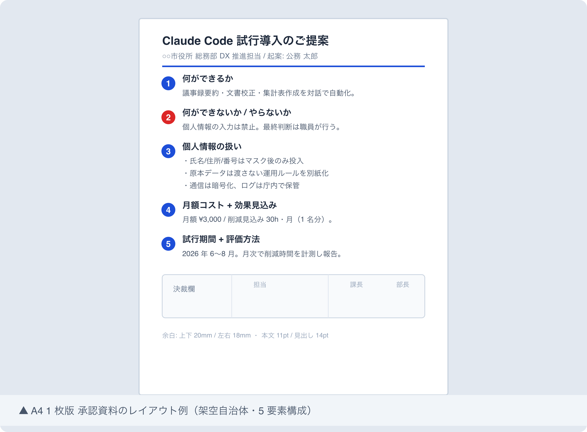

# 撮影ガイド: 上司に Claude Code 導入を承認させた説明資料 (実例加工)

## 撮影前準備

### macOS 標準コマンド

- `Cmd + Shift + 3`: 画面全体をスクリーンショット
- `Cmd + Shift + 4`: 範囲選択スクリーンショット (推奨)
- `Cmd + Shift + 4` → `Space`: ウィンドウ単位スクリーンショット
- 保存先デフォルト: デスクトップ。撮影後に `images/` 配下へ移動する

### 推奨設定

- ターミナル / エディタ: フォント 14pt 以上、ウィンドウサイズ目安 1200×800
- 表示倍率: Retina 表示で標準。書き出し後 1.5-2 MB を超えるなら pngquant で圧縮
- ライト/ダーク: 統一する (本記事は経営層向けなのでライト推奨)
- 通知 OFF: `集中モード` をオンにしてから撮影

### マスキング原則

- **自治体名 / 部署名 / 職員名 / メールアドレス / 電話番号は完全マスキング**
- 個人名は架空名 (例: 「公務 太郎」「自治 花子」) に置換
- 自治体名は架空名 (例: 「○○市」「サンプル町」) に置換
- ファイルパス `/Users/<実名>/...` → `/Users/user/...` に書き換え
- 金額・予算は架空数値 (例: 月額 ¥3,000 / 削減効果 30h/月)

### 保存先

- 配置先: `docs/31_note記事原稿/koumuin-claude-code/26-boss-approval-deck/images/`
- 命名規則: `screenshot-N-<short-keyword>.png`
- 圧縮: `pngquant --quality=70-90 --ext=.png --force *.png`

---

## 撮影リスト

### Shot 1: A4 1 枚版 承認資料のレイアウト

- **本文位置**: 「ステップ 1: 説明資料を A4 1 枚版と詳細版の 2 段構えにする」の末尾 (draft.md L69)
- **撮影対象**: A4 1 枚版 (5 要素レイアウト) を再現したサンプル資料
- **準備するもの**:
  - Keynote / Google Slides / Canva のいずれかで A4 縦 1 枚を作成
  - 5 要素を必ず含める: ①何ができるか ②何ができないか ③個人情報の扱い ④月額コスト+効果見込み ⑤試行期間+評価方法
  - フォント: 本文 11pt、見出し 14pt (游ゴシック / Noto Sans JP)
  - 余白: 上下 20mm / 左右 18mm
  - 配色: ベースグレー (#475569)、アクセント 1 色のみ (#1d4ed8 等)、警告色 (#dc2626) は「禁止事項」だけに使用
- **マスキング項目**:
  - 自治体名 → 「○○市役所」
  - 部署名 → 「総務部 DX 推進担当」
  - 起案者名 → 「公務 太郎」
  - 月額コスト → 架空数値「¥3,000/月」
  - 効果見込み時間 → 架空数値「30h/月」
  - 試行期間 → 「2026 年 6 月〜8 月」程度の架空期間
- **推奨ファイル名**: `screenshot-1-a4-approval-sheet.png`
- **撮影手順**:
  1. プレゼンソフトで上記レイアウトを作成し、ダミー情報のみで構成されているか目視確認
  2. プレビュー / PDF 書き出し → 100% 表示 → `Cmd + Shift + 4` でスライド全体を範囲選択撮影
  3. 撮影後、画像ビューアで開き「自治体名 / 個人名 / 実金額」が残っていないか再チェック → `images/screenshot-1-a4-approval-sheet.png` に保存

---

## 撮影後手順

1. **PNG 保存**: 撮影画像を `images/` 配下に推奨ファイル名で保存
2. **pngquant 圧縮**: `cd images && pngquant --quality=70-90 --ext=.png --force screenshot-*.png`
3. **draft.md マーカー置換**: `> 📸 [スクリーンショット] ...` 行を以下に置換
   ```markdown
   
   ```
4. **個人情報残存チェック**:
   - `grep -rE "([一-龥]{2,4}(市|町|村|区|県))|(@[a-z0-9.-]+\.(jp|com))|(0[0-9]{1,4}-[0-9]{1,4}-[0-9]{4})" images/` で何もヒットしないこと
   - 画像を 100% 表示で再確認 (縮小表示では小さい文字が読み取れず見落とす)
   - 必要に応じて `Preview.app` のマーカー機能で黒塗り追記
