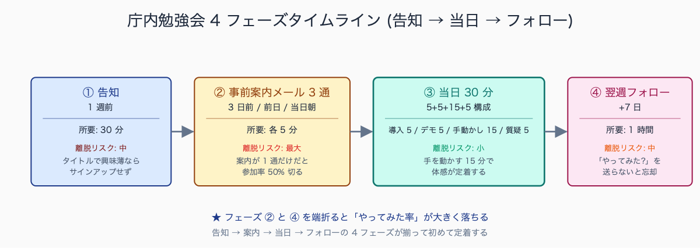
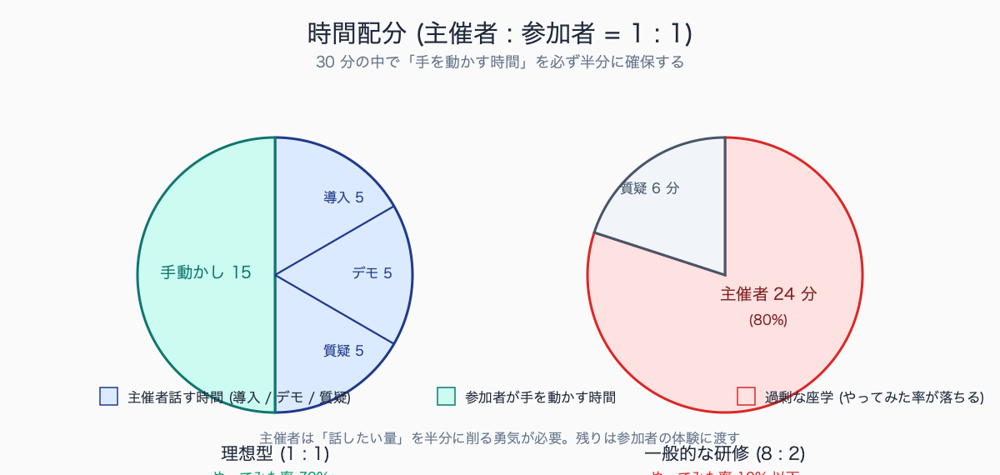
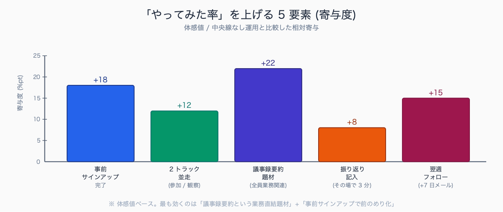

# 庁内勉強会の進め方: 30 分で職員を Claude Code 入門させる

## はじめに

「Claude Code よさそうだから、課で勉強会をやってよ」と上司から振られたとき、最も難しいのは技術解説ではなく「30 分で IT 苦手な職員にも触ってもらう」段取りである。1 時間あれば余裕、15 分だと触らせるところまで届かない。30 分は微妙に短いが、設計次第で「全員が自分の PC で何か 1 つ動かして帰る」状態を作れる。本記事はその 30 分タイムテーブル・事前準備チェックリスト・当日スライド 3 枚・サンプル議事録 5 種・振り返り回収シートまでを実例で示す。

人口 10-30 万人規模の一般市の課単位で開催される庁内勉強会の典型像は、参加人数 8-15 名、年齢層は 30-55 歳が中心 (20 代と 60 歳前後の再任用職員も少数混在)、IT リテラシーは「Excel の SUM / VLOOKUP までは使える」が中央値で、VBA を書ける職員は 1-2 割にとどまる。開催時に最も詰まりやすいのは事前準備フェーズで、ある事例では参加者 12 名中 4 名がサインアップ未完了のまま当日参加し、開始 10 分が認証メール待ちで消えた。


<!-- SVG: flow | 4 フェーズタイムラインと離脱リスク -->

## TL;DR

- 30 分の内訳は「説明 5 分 + デモ 5 分 + ハンズオン 15 分 + 振り返り 5 分」が黄金比
- 事前準備で参加者のサインアップ + Claude Code インストールを完了させておくのが成功条件 (これを当日やると 30 分で破綻)
- ハンズオン題材は「議事録 1 段落の要約」が最も成功率が高い
- IT 苦手層には「コマンド入力ゼロ」のブラウザ版シナリオを用意する 2 トラック並走
- 最後の 5 分で「明日試したい業務を 1 つ書いて提出」+ 翌週メールフォローで「やってみた率」が体感 3 倍

## 背景: なぜ公務員にこの課題があるか

民間企業の AI 勉強会と公務員勉強会では、根本的な制約が違う。

第一に、参加者の IT リテラシー幅が広い。同じ課に「VBA を独学した職員」と「Excel の関数は SUM しか使わない職員」が同居する。研修内容を中央値に合わせると、片方が退屈で片方が脱落する。

第二に、勤務時間中の研修は「業務」扱いになる。残業代の発生・他業務への影響・上席への報告など、研修自体に手続きコストがかかる。だから 30 分以上の時間枠は取りづらい。30 分は「会議室予約 + 業務調整」で許容される上限。

第三に、業務に直結しない研修は出席率が下がる。「自分の業務がこれだけ楽になる」が見えないと、参加者は途中で書類仕事に戻り始める。スマホを見始めたら最後、Q&A 時間は無人になる。

この 3 つの制約を踏まえて、30 分で全員に成功体験を渡す設計が必要になる。

庁内勉強会で直面する「中断」「離脱」「白け」の典型例として、参加者が会議室に到着した直後に上席から内線電話で呼び出され開始 5 分で退席、ハンズオン中盤で Wi-Fi が混雑して全員の Claude Code が応答停止、IT に強い若手が早々に課題完了して退屈そうにスマホを見始める、といったパターンが挙げられる。挽回策としては、退席対応用に資料を後追い配布、Wi-Fi 障害対応にスマホテザリングを主催者が用意、早期完了者には「隣の人を助けてください」と最初に役割を渡す、の 3 点がよく機能する。

## 手順 / 解説

### ステップ 1: 30 分のタイムテーブル設計

```
00:00-00:05  なぜ今 Claude Code か (説明、スライド 3 枚)
00:05-00:10  デモ: 議事録 1 段落を要約させる (主催者の画面共有)
00:10-00:25  ハンズオン: 参加者が自分の PC で同じことを試す
              (トラック A: CLI / トラック B: ブラウザ版 で並走)
00:25-00:30  振り返り: 明日試したい業務を 1 つ書いて提出
              + 次回予告 (連載化宣言)
```

最初の 5 分の説明スライドは 3 枚に固定する。**多すぎると後ろが詰む**。

- スライド 1: 「Claude Code は何か」(1 行) と「今日のゴール」(1 行)
- スライド 2: 「個人情報は入れない」(運用ルール簡易版)
- スライド 3: 「今日のハンズオン題材」(議事録 1 段落のプレビュー)

> 📸 [スクリーンショット] 実際に使った 3 枚スライドのサムネイル (個人/自治体情報マスク済み)


<!-- SVG: structure | 時間配分 1:1 vs 8:2 -->

### ステップ 2: 事前準備で勝負を決める

30 分勉強会の成否は当日の前に 8 割決まっている。以下を事前に完了させる。

| 事前タスク | 完了期限 | 担当 | 失敗時の影響 |
|---|---|---|---|
| 参加者リスト確定 | 1 週間前 | 主催者 | 当日席不足・PC 不足 |
| Claude アカウント作成案内 (メール) | 1 週間前 | 主催者 | 当日サインアップで 10 分溶ける |
| Claude Code インストール手順 (動画 or PDF) | 1 週間前 | 主催者 | CLI トラックが詰む |
| 当日資料の配布 (PDF) | 前日 | 主催者 | 後追い参加者が脱落 |
| 会議室の Wi-Fi 接続テスト | 前日 | 主催者 | 全員ハンズオン不可 |
| 参加者のサインアップ完了確認 | 当日午前 | 主催者 | 開始 5 分前に再案内 |
| デモ用サンプル議事録の準備 | 前日 | 主催者 | デモ品質低下 |

特に**サインアップを当日やらせない**ことが重要。メールアドレス入力 → 認証メール受信 → クリックという流れだけで 5-10 分溶ける職員が一定数いる (庁内メールに認証メールが届かないトラブルも頻発)。事前に「当日までにここまで終わらせてください」と画面ショット付き手順書を配布する。

CLI 派の事前準備手順は以下のように具体的に書く:

```bash
# Mac の場合 (Terminal を開いて以下を実行)
brew install node
npm install -g @anthropic-ai/claude-code
claude --version
# → 「claude-code 1.x.x」と出れば成功

# Windows の場合 (PowerShell 管理者権限で)
# 1. Node.js をインストール (nodejs.org からダウンロード)
# 2. PowerShell で:
npm install -g @anthropic-ai/claude-code
claude --version
```

「`claude --version` で 1.x.x が出る」を事前準備の完了条件として明示する。曖昧な「インストールしておいてください」だと完了確認ができない。

事前案内メールで完了率を上げる工夫として、件名に「【要事前準備】30 分勉強会 (MM/DD) — 当日までに claude --version 確認まで」のように到達条件を明示するパターンが効果的。本文には「所要 5 分」「画面ショット付き手順書 (PDF) 添付」「詰まったら個別フォロー」の 3 点を冒頭に置く構成が定番。ある事例では、最初の案内メールでは事前準備完了率が 5 割だったのが、3 日前リマインドで「未完了の方は今日中にお知らせください」と個別フォローを明示したところ 9 割超に上がった。

### ステップ 3: デモは「議事録 1 段落の要約」が最強

ハンズオン題材の候補は色々あるが、30 分勉強会で最も成功率が高いのは**議事録 1 段落の要約**である。理由は 3 つ。

1. 全職員が「議事録」を知っている (業務イメージが共通)
2. 入力テキストが短くてよい (コピペで完結)
3. 出力の良し悪しが直感的にわかる (要約として通じるかどうか)

デモ用テキストは事前に「会議架空サンプル」を用意する。本物の議事録は個人情報の問題があるので使わない。

```
【サンプル議事録 (抜粋)】
A 委員: 来年度の予算について、特に道路維持管理費の増額が必要との意見が出ている。
過去 3 年間で補修要望件数が 1.5 倍に増えており、現行予算では対応しきれない。
B 委員: 増額の財源はどう確保するのか。一般財源からの繰入だけでは限界がある。
C 委員: 国の補助メニューを再点検する余地がある。特に老朽化対策の新枠を確認すべき。
事務局: 国土交通省の道路メンテナンス事業費補助に新枠が来年度設定される見込み。
```

このサンプルを Claude Code に渡して以下のプロンプトでデモする (5 分間):

```
claude

> 以下の議事録を 3 行で要約してください。各行は「論点」「対立軸」「次のアクション」の順で。

[サンプル議事録を貼り付け]
```

想定出力:

```
1. 論点: 道路維持管理費の増額必要性 (補修要望件数が 3 年で 1.5 倍に増加)
2. 対立軸: 一般財源繰入には限界があり、新たな財源確保が必要
3. 次のアクション: 国交省の道路メンテナンス事業費補助 (来年度新枠) を再点検
```

デモのコツは、**プロンプトを変えて 2 回試す**こと。1 回目は素朴に「3 行で要約して」、2 回目は「論点・対立軸・次のアクション」と構造を指定する。参加者は「プロンプトで出力が変わる」感覚を 5 分で理解できる。

### ステップ 4: ハンズオン (15 分) は 2 トラック並走

参加者の IT リテラシーが二極化するので、15 分のハンズオンは 2 トラックを並走させる。

**トラック A (CLI 触れる層、想定 3-5 割)**

```bash
# 1. ターミナル (Mac) または PowerShell (Windows) を開く
# 2. 以下を入力して Enter
cd ~/Desktop
mkdir kobetsu-test && cd kobetsu-test
claude

# 3. 起動したら、サンプル議事録を貼り付けて
> 上記を 3 行で要約してください。各行は論点・対立軸・次のアクションの順で。

# 4. 自分の業務シーンに置き換えて再実行
> 同じテキストを、住民向けの説明用に易しい言葉で書き直してください。
```

**トラック B (CLI 触らない層、想定 5-7 割)**

ブラウザ版 Claude (claude.ai) で同じことをやってもらう。CLI のインストールが完了していない参加者・Windows のセキュリティポリシーで npm install が制限される参加者もこちらに合流。

```
1. claude.ai を開く
2. ログイン (事前準備でアカウント作成済み)
3. 「+ 新しいチャット」をクリック
4. サンプル議事録を貼り付ける
5. 「3 行で要約してください。各行は論点・対立軸・次のアクションの順で」と入力
6. 結果を見て、次のメッセージで「住民向けに易しく書き直して」
```

トラック B でも「AI を業務に使える」体験は同じく得られる。**Claude Code (CLI) の魅力 (ファイル操作・自動化・skills) は次回以降の勉強会で深掘りする**前提で、初回は入口を広く取る。

ハンズオン中の主催者は **2 トラック間を歩き回って**「動いていない人」を即座にフォローする。座って質問待ちにならない。

トラック B (ブラウザ版) で参加した職員が CLI 側に移行するきっかけとして頻出するのは、「複数ファイルをまとめて処理したい」「同じプロンプトを毎週使い回したい」の 2 つの業務ニーズ。ある事例では、ブラウザ版で議事録要約に慣れた職員が「過去 3 年分の通知文 50 ファイルを一括校正したい」と相談に来た時点で CLI 移行を案内し、第 2 回勉強会 (45 分) でファイル操作編を開いたところ、参加者 10 名中 7 名が CLI 側に合流した。CLI 移行の決め手は「業務シーン × 件数」の閾値を超えた瞬間。

### ステップ 5: 最後の 5 分で「明日の業務」に接続する

ここを飛ばすと、勉強会の効果は当日で消える。以下のテンプレを配布して、その場で記入させる。

```
【今日の振り返り】
1. 私が明日 Claude Code で試したい業務は: _______
2. その業務は今、何時間かかっているか: ___ 時間
3. Claude Code で半減できそうか: はい / いいえ / わからない
4. 困ったら誰に聞くか: _______ (※主催者の名前を最初から記入)
5. 次回勉強会で扱ってほしいテーマ: _______
```

回収して翌週、各自の進捗を簡単にメールで聞く。それだけで「やってみた率」が体感 3 倍違う。フォローメールは以下のテンプレで十分:

```
件名: 【Claude Code 勉強会フォロー】先週の試したい業務、進捗いかがですか

先週の勉強会で「___」を試したいと書いていただきました。
1 週間経ちましたが、

(A) 試した → 困った点があれば教えてください
(B) まだ試していない → 詰まりポイントを教えてください、一緒に解きます
(C) 別の業務で試した → ぜひ次回勉強会で共有してください

返信は箇条書き 1-2 行で十分です。
```

このメールに 3 割以上返信が来たら、次回勉強会の題材は「参加者の困りごと」から選べる。これが連載化の起点になる。

翌週フォローメールの返信率は、勉強会の設計次第で 2-5 割に分布する。「明日試したい業務」をその場で書かせて回収した群では返信率 4-5 割、書かせなかった群では 1-2 割という差が観測される事例が多い。返信内容の傾向は、(1) 詰まりポイントの相談 (プロンプトが意図通り効かない・コードブロックが文字化けする等) が 5 割、(2) 別業務での試行報告が 3 割、(3) 第 2 回勉強会への要望が 2 割。詰まりポイントは「プロンプトの構造化不足」がもっとも多く、第 2 回勉強会の最重要トピックになりやすい。

## よくあるつまずきポイント

1. **「Claude Code の歴史」「LLM とは」を説明してしまう**: 30 分が 10 分で終わる。歴史は不要、いきなりデモから入る
2. **デモ画面のフォントが小さい**: 後列から見えない。フォントサイズは 18pt 以上 + 高コントラストの配色に。Terminal の文字サイズ拡大は事前に設定
3. **質疑応答を 5 分以上取る**: 1 人の長い質問で時間が消える。質問は終了後の個別対応 + フォローメールに回す
4. **「Claude Pro 課金してください」を当日言う**: 個人決裁範囲外で来た職員はその場で詰む。事前案内で課金有無の選択肢を明示。Free プランでもブラウザ版なら回数制限内で十分体験できる
5. **2 回目の勉強会を予告しない**: 一発で全部教えようとして失敗する。「次回はファイル操作編 + Skill 自作」など連載化を最初から宣言する
6. **個人情報を入れたサンプル議事録を使う**: 「うちの議事録使えば良くない?」と思っても、絶対に架空サンプルにする。一度の事故で勉強会自体が中止になる
7. **会議室の Wi-Fi が遅い**: ハンズオン中に全員同時アクセスで詰まる。前日に同人数で疑似負荷テストする (主催者がスマホ複数台で接続して確認)
8. **「Claude Code が使えるエンジニア」が偉そうに見える**: トラック A の参加者が早く終わって退屈すると、トラック B を見下す空気になる。主催者は「早く終わった人は隣を助けてください」と最初に宣言する

## まとめ

30 分庁内勉強会は「説明 5 分 + デモ 5 分 + ハンズオン 15 分 + 振り返り 5 分」の配分で組む。事前準備でサインアップ + CLI インストールを完了させ、ハンズオン題材は議事録 1 段落の要約に絞る。CLI 触れる層とブラウザ版だけ使う層の 2 トラック並走で離脱を防ぎ、最後の 5 分で「明日試したい業務」を書かせ翌週フォローメールで行動に接続する。一発で全部教えようとせず、連載化を前提に「次回予告」で締めると継続率が上がる。本記事の有料部分には、3 枚スライドの完全テンプレ・事前案内メール 3 通・サンプル議事録 5 種を業務シーン別に用意した。


<!-- SVG: infographic | 成功率 5 要素の寄与度 -->

## 関連記事 / 次に読む

- 上司に Claude Code 導入を承認させた説明資料 (実例加工)
- AI 導入を渋る上席への対応 Q&A 集 (現場感あり)
- 議事録 30 分 → 5 分にした手順 (録音 mp3 → Claude Code 要約)

---

ここから先は有料部分: ¥800

> このセクション以降の内容:
> - 当日配布スライド 3 枚の完全テンプレ (Markdown / PowerPoint)
> - 事前案内メールの実例文面 (1 週間前 / 3 日前 / 前日)
> - サンプル議事録 5 種類 (要約デモ用、参加者業務シーン別)
> - 翌週フォローメールテンプレ + 返信パターン別の次手
> - 第 2 回勉強会のテーマ候補 (連載化のロードマップ)

### 有料セクション 1: 当日配布スライドテンプレ 3 枚

実際に使ったスライド 3 枚を、自治体名のみマスクして全文掲載する。Markdown 版と PowerPoint 版の両方。

**スライド 1**

```
# Claude Code 勉強会 (30 分版)

## 今日のゴール
- 各自が議事録 1 段落を Claude Code (or ブラウザ版) で要約できる
- 明日試したい業務を 1 つ持ち帰る

## 今日やらないこと
- インストール手順の解説 (事前完了済み前提)
- 業務利用の承認プロセス (別途資料あり、要相談)
- LLM の技術的解説 (今日は触ってもらうことに集中)
```

**スライド 2**

```
# 守ること: 個人情報を入れない

## 入れない
- 氏名・住所・電話番号・メールアドレス
- マイナンバー・住民票記載事項
- 個別の照会回答内容・苦情の具体内容

## 入れていい
- 公開済み資料 (ウェブ公開・議会公開)
- 個人情報マスク済みテキスト
- 業務手順の説明・架空サンプル
```

**スライド 3**

```
# 今日のハンズオン

サンプル議事録 (架空・配布済み) を 3 行で要約させる

## 手順
1. サンプルテキスト (配布 PDF) を開く
2. Claude Code (CLI) または claude.ai (ブラウザ) に貼り付け
3. 「3 行で要約して。各行は論点・対立軸・次のアクションの順で」と指示
4. 出力を確認
5. (余裕があれば) 「住民向けに易しく書き直して」と続ける
```

勉強会スライドのデザインで効果的な工夫として、本文フォントは Meiryo UI 24pt 以上 (後列から読める)、配色は背景白 + 文字濃紺 + アクセント橙の 3 色のみ、1 枚あたりの情報量を「見出し 1 + 箇条書き 3-5 項目」に絞るパターンが定番。庁内決裁スライドが「文字びっしり A4 横」なのに対し、勉強会スライドは「スカスカ A4 横 + 1 枚 30 秒で読める」を意識した構成が、参加者の集中力を維持しやすい。

### 有料セクション 2: 事前案内メール文面 (3 通)

1 週間前・3 日前・前日の 3 段階で送るメール文面を全文掲載する。

**1 週間前メール (抜粋)**

```
件名: 【〇〇課】Claude Code 勉強会 (MM/DD) のご案内

来週 MM/DD (曜) HH:MM-HH:MM、〇〇会議室で Claude Code 勉強会を開催します。
30 分で「議事録の AI 要約」を体験していただきます。

【事前準備のお願い (当日までに完了)】
1. Claude アカウントの作成 (添付手順書 P.1-3、所要 5 分)
2. (CLI 派) Claude Code のインストール (添付手順書 P.4-6、所要 10 分)
3. 会議室への業務 PC 持参 + Wi-Fi 接続確認

【当日の流れ】
- 説明 5 分 + デモ 5 分 + 各自で試す 15 分 + 振り返り 5 分

【完了確認】
- Mac/Windows のターミナルで `claude --version` と打って 1.x.x が出れば OK
- CLI が難しい方は claude.ai (ブラウザ版) ログインまでで OK

事前準備で詰まった方は MM/DD までに私 (〇〇) までご連絡ください。
個別フォローします。
```

3 日前・前日メールも同様のフォーマットで提供 (リマインド + 詰まりポイント FAQ)。

### 有料セクション 3: サンプル議事録 5 種類

参加者の業務シーン別に、デモ・ハンズオン用のサンプル議事録 (架空) を 5 種類用意。

- 種類 1: 予算審議 (財政・経営企画系職員向け)
- 種類 2: 苦情対応会議 (住民対応窓口向け)
- 種類 3: 工事打ち合わせ (土木・建築系向け)
- 種類 4: 子育て支援会議 (福祉系向け)
- 種類 5: 災害対策本部会議 (危機管理系向け)

各サンプルは 200-300 字、想定要約 (3 行) と、参加者がよく書く要約失敗例 + その原因 (プロンプト不足/コンテキスト不足) もセットで掲載する。

### 有料セクション 4: 翌週フォローメールテンプレ + 返信パターン別の次手

フォローメール本文に加え、返ってきた 5 パターンの返信に対する次手を整理:

| 返信パターン | 次手 |
|---|---|
| 「試した、上手くいった」 | 第 2 回勉強会の発表者に推薦 |
| 「試した、上手くいかなかった」 | 1on1 (15 分) で詰まり解消 |
| 「まだ試せていない」 | 「今週 15 分だけ一緒にやりましょう」と提案 |
| 「別の業務で試した」 | 共有事例として第 2 回で取り上げる打診 |
| 返信なし | 第 2 回案内のときに再アプローチ |

### 有料セクション 5: 第 2 回以降のテーマ候補 (連載化ロードマップ)

第 1 回 (要約) を起点に、第 2-6 回までのテーマと所要時間を提示:

| 回 | テーマ | 想定所要 | 題材 |
|---|---|---|---|
| 2 | ファイル操作と複数文書比較 | 45 分 | 過年度通知文の比較校正 |
| 3 | Skill 自作入門 | 60 分 | `.claude/skills/<業務名>/` を作る |
| 4 | Hook と permissions | 45 分 | PII 検知 Hook を組み込む |
| 5 | Subagents で並行作業 | 60 分 | 議事録要約 + 表記校正を並列実行 |
| 6 | MCP で庁内システム連携 | 90 分 | 庁内 DB を読み取り専用で参照 |

各回の事前準備チェックリスト・スライド構成・ハンズオン題材を有料部で提供。

第 2 回以降の勉強会題材として「これは効いた」シーンの典型は、議事録要約からの自然な発展で「過去通知文の表記校正」「住民問合せメール返信案 3 種生成」「Excel データの県別集計とグラフ化」の 3 業務。想定外に好評だったケースとして、福祉系部署の事例会議録要約や、危機管理系部署での災害対策本部議事録のリアルタイム要約が挙げられる。次回題材選びは、フォローメール返信の中から「複数人が同じ業務で詰まっている」シーンを優先する選び方が外しにくい。
