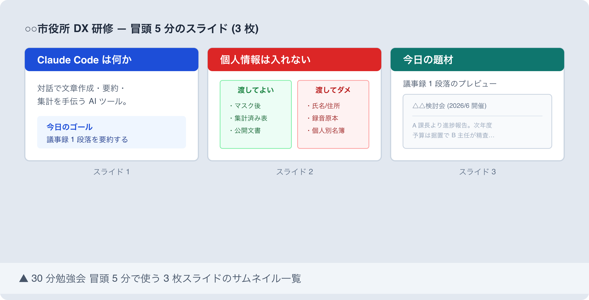

# 撮影ガイド: 庁内勉強会の進め方: 30 分で職員を Claude Code 入門させる

## 撮影前準備

### macOS 標準コマンド

- `Cmd + Shift + 3`: 画面全体をスクリーンショット
- `Cmd + Shift + 4`: 範囲選択スクリーンショット (推奨)
- `Cmd + Shift + 4` → `Space`: ウィンドウ単位スクリーンショット
- 保存先デフォルト: デスクトップ。撮影後に `images/` 配下へ移動する

### 推奨設定

- プレゼンソフト (Keynote / Google Slides): スライドサイズ 16:9、フォント 28-36pt
- ターミナル使用時: フォント 14pt、ウィンドウ 1200×800
- 通知 OFF: `集中モード` をオンにしてから撮影
- ライトテーマで統一 (研修資料らしさを出すため)

### マスキング原則

- **自治体名 / 部署名 / 職員名 / メールアドレスは完全マスキング**
- 自治体名 → 「○○市」「サンプル町」等の架空名
- 個人名 → 「公務 太郎」「自治 花子」等の架空名
- 議事録サンプルの団体名・出席者名 → 完全置換
- ファイルパス `/Users/<実名>/...` → `/Users/user/...`

### 保存先

- 配置先: `docs/31_note記事原稿/koumuin-claude-code/27-internal-study-30min/images/`
- 命名規則: `screenshot-N-<short-keyword>.png`
- 圧縮: `pngquant --quality=70-90 --ext=.png --force *.png`

---

## 撮影リスト

### Shot 1: 30 分勉強会用 3 枚スライドのサムネイル一覧

- **本文位置**: 「ステップ 1」末尾、3 枚スライド構成説明の直後 (draft.md L71)
- **撮影対象**: 勉強会冒頭 5 分で使う 3 枚スライド (スライド 1: 「Claude Code は何か」+「今日のゴール」/ スライド 2: 「個人情報は入れない」/ スライド 3: 「ハンズオン題材プレビュー」) のサムネイル並列ビュー
- **準備するもの**:
  - Keynote / Google Slides / PowerPoint で 3 枚スライドを作成
  - スライド 1: タイトル「Claude Code は何か」+ 1 行説明 +「今日のゴール: 議事録 1 段落を要約する」
  - スライド 2: タイトル「個人情報は入れない」+ 渡してよい/ダメの 2 列簡易表 (3-4 行)
  - スライド 3: タイトル「今日の題材」+ 架空議事録 1 段落のサンプル
  - サムネイル表示モード (Keynote: 「ライトテーブル」/ Google Slides: 「グリッド表示」/ PowerPoint: 「スライド一覧」) で 3 枚を並べる
- **マスキング項目**:
  - 自治体名 → 「○○市役所 DX 研修」等架空名
  - 議事録サンプルの団体名 → 「△△検討会」
  - 議事録内の出席者氏名 → 「A 課長 / B 主任」等の役職表記
  - 日付 → 架空日付 (例: 2026 年 6 月開催)
- **推奨ファイル名**: `screenshot-1-3slides-thumbnails.png`
- **撮影手順**:
  1. プレゼンソフトのサムネイル/一覧表示モードに切り替え、3 枚が横並びになる配置に調整
  2. `Cmd + Shift + 4` で 3 枚スライドが収まる範囲を選択撮影
  3. 撮影後、画像を 100% 表示し「自治体名 / 議事録の実出席者名 / 実日付」が残っていないか確認 → `images/screenshot-1-3slides-thumbnails.png` に保存

---

## 撮影後手順

1. **PNG 保存**: 撮影画像を `images/` 配下に推奨ファイル名で保存
2. **pngquant 圧縮**: `cd images && pngquant --quality=70-90 --ext=.png --force screenshot-*.png`
3. **draft.md マーカー置換**: `> 📸 [スクリーンショット] ...` 行を以下に置換
   ```markdown
   
   ```
4. **個人情報残存チェック**:
   - `grep -rE "([一-龥]{2,4}(市|町|村|区|県))|(@[a-z0-9.-]+\.(jp|com))" images/` で何もヒットしないこと
   - 画像を 100% 表示で再確認 (議事録サンプルの細かい文字に注意)
   - 必要に応じて `Preview.app` のマーカー機能で黒塗り追記
