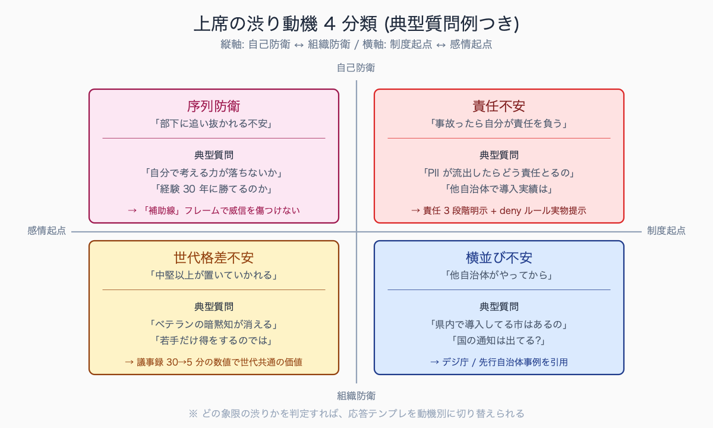
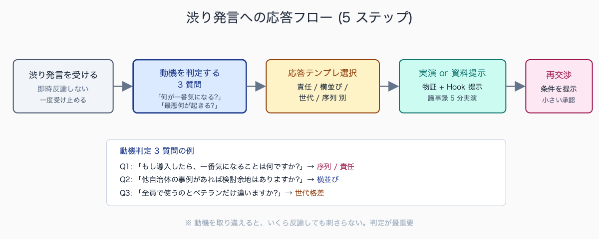
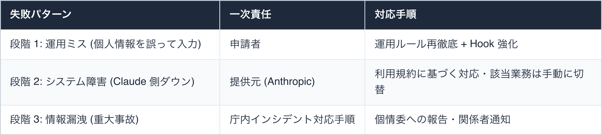
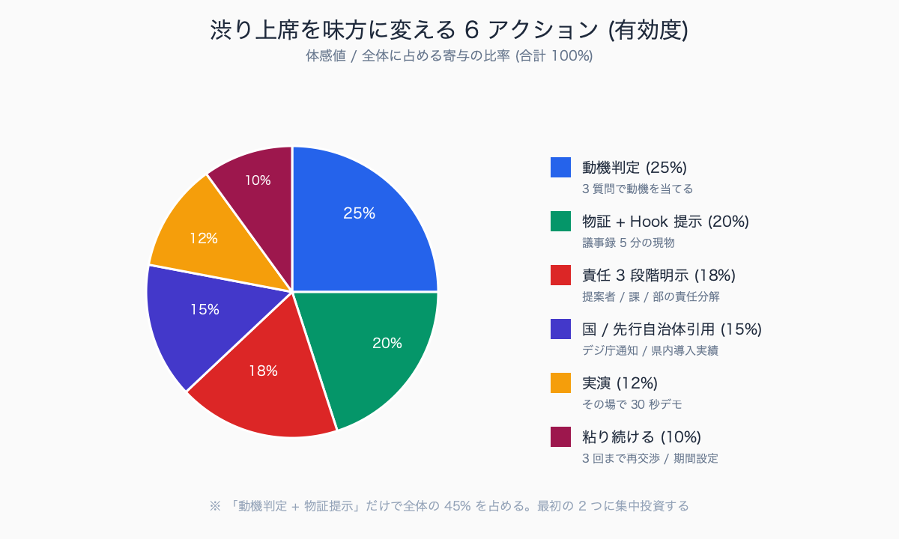
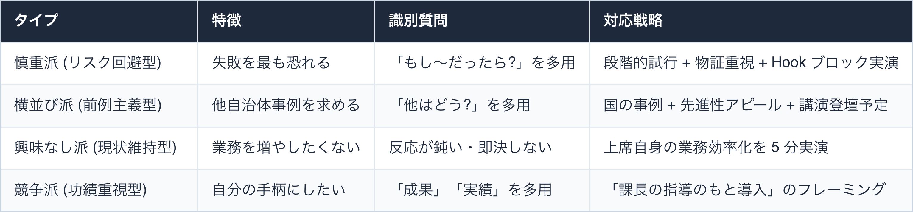

# AI 導入を渋る上席への対応 Q&A 集 (現場感あり)

## はじめに

「Claude Code を使わせてください」と申し出ても、上席が首を縦に振らないことは多いです。理由は技術的なものではなく、**世代的・心理的・組織防衛的なもの**が大半です。

**こんな方に向けた記事です**

- Claude Code を使いたいが、上席が首を縦に振らず止まっている自治体職員
- 技術論で説明しても関係が悪くなるだけで、うまく伝わらないと感じている方
- 「個人情報は?」「失敗したら誰が責任を?」といった定番の反対にどう返すか備えたい方

**この記事でわかること**

- 上席の渋りを「責任不安」「横並び不安」「世代格差不安」「序列防衛」の 4 動機で読み分ける方法
- 頻出 7 質問 (個人情報・他自治体事例・失敗時の責任ほか) への NG/OK 回答の型
- 上席の困りごとを 1 つ解いて見せる「実演」で承認を引き出す進め方

本記事は、AI 導入に渋い上席から実際に飛んでくる質問・反対意見を 20 パターン集めて、対応の型を整理したものです。机上の Q&A ではなく、現場で**実際にこの問答が起きた**経験をベースにしています。Q1-Q7 は無料部、Q8-Q20 + 上席タイプ別対応 + 実演ネタ 5 種は有料部です。

現場で上席から飛んでくる「最もきつい一言」の典型例として、「君が辞めたらどうするの?」「失敗したら誰が責任取るの?」「他の業務に手が回ってないんじゃないか?」の 3 つが頻出します。

意表を突かれる質問パターンは「議会で聞かれたらどう答えるんだ」「住民から問い合わせが来たら誰が窓口になるんだ」の 2 つで、技術論ではなく組織防衛・対外説明責任の文脈で来ます。ある事例では「住民窓口」を聞かれて即答できず、後日「広報課経由でルート整備」を別紙で追加提出して再合議に持ち込んだ経緯が報告されています。

執筆者は元自治体職員です。現在は Claude Code を使い、47 都道府県の統計サイト stats47.jp（約 2,000 のランキングを毎日自動更新）を個人で開発・運用しています。


<!-- SVG: structure | 渋り動機 4 象限と典型質問 -->

## 背景: なぜ公務員にこの課題があるか

公務員組織は構造的に「新ツール導入に渋い」設計になっています。理由は 3 つです。

第一に、**減点主義**です。新しいことを始めて失敗したときの責任が明確に問われる一方、現状維持で機会損失を出しても咎められません。上席にとって「導入しない」は合理的選択になります。これは個人の性格ではなく組織の評価制度の帰結なので、個別上席を責めても解決しません。

第二に、**横並び意識**です。「他自治体がやっていれば安心、やっていなければ不安」という判定軸が根強くあります。Claude Code のように先進事例が公開されていない領域は、上席にとって判断材料がありません。これは「先進性アピール」のフレームに変換すると逆風が追い風になります。

第三に、**世代と IT リテラシーの相関**です。判断権を持つ層 (50 代以上) と AI ツールに前向きな層 (20-40 代) が分かれており、上席が「自分が理解できないもの」を承認するハードルが高いです。世代論で語ると逆効果なので、「上席の業務」を 1 つ解いて見せる実演で世代差を埋めます。

この 3 つは構造問題なので、技術的に反論しても解けません。**動機別に対応を切り替える**スキルが必要になります。

上席が新ツール導入を渋った過去例として、自治体現場で頻繁に観察されるのが Microsoft Teams 導入時の「セキュリティ懸念」、電子決裁システム導入時の「ハンコ文化との整合」、kintone 等 SaaS 導入時の「データ持ち出し懸念」の 3 パターンです。

共通する構造は「前例なし」「責任所在不明」「世代格差不安」の 3 要素で、AI ツール導入時にもほぼ同じ反対理由が再生産されます。過去の Teams 導入で 2 年がかりで承認された自治体では、Claude Code 導入時も同じく 2 年程度の段階的試行が想定される傾向が報告されています。


<!-- SVG: flow | 渋り発言への 5 ステップ応答 -->

## 手順 / 解説

### Q1. 「個人情報が漏れるんじゃないの?」

最頻出です。これは「技術不安」より「責任不安」の言い換えです。「漏れたら自分が処分される」が本音です。

**NG 回答**: 「Claude は学習に使わないと利用規約に書いてあります」(法律論で押し切ろうとすると、上席は「ほんとに?」で詰めてくる)

**OK 回答**: 「個人情報を入れない設定を 3 層で組んでいます。① `.claude/settings.json` の deny ルール ② PreToolUse Hook で送信前 PII 検知 ③ 業務シーン別のチェックリスト。この 3 つで誤送信は技術的に止まります」+ 実物の設定ファイルを見せます。**ルール + 自動ブロック + 運用**の 3 点セットで安心感を作ります。

```jsonc
// 上席に見せる用 .claude/settings.json
{
  "permissions": {
    "deny": [
      "Read(./**/personal-info-*.csv)",
      "Read(./**/*マイナンバー*)",
      "Read(./**/*住民票*)",
      "Bash(curl:*社外サーバ*)"
    ]
  },
  "hooks": {
    "PreToolUse": [
      {
        "matcher": "Read",
        "hooks": [{ "type": "command", "command": "node .claude/hooks/check-pii.cjs" }]
      }
    ]
  }
}
```

Hook の存在 (技術的ブロック) を見せると「運用ミスでも止まるんだ」と納得されやすいです。「人間の注意」ではなく「機械の制約」を信用するのが情シス・法務系上席です。

### Q2. 「他自治体でやってる事例ある?」

これは「横並び不安」の典型です。「他がやっていないなら自分がやる理由がない」と読めます。

**NG 回答**: 「ないです」(これだけで会話終了)

**OK 回答**: 「公開事例は確認できていません。一方、デジタル庁が 2025-05-27 に「行政の進化と革新のための生成 AI の調達・利活用に係るガイドライン (DS-920)」を策定し、国の行政機関では高リスク判定シートに基づき具体製品ごとに運用可否を評価する枠組みが整備されています (特定製品名の許可ではない点に注意)。**先行する自治体になることで、研修・講演ネタとして外部発信できる**利点があります。〇〇市が先進事例として取り上げられる構図です」+ DS-920 ガイドラインの URL を 1 つ示します。

「先行することで損する」より「先行することで得する (議会答弁の材料・研修登壇・他自治体視察)」のフレームに切り替えます。上席は「自分の手柄になる」筋書きを見せると態度が変わります。

先行事例として外部発信が「上席の手柄」につながった典型例は、note や専門誌で公開した記事が他自治体担当者の目に留まり、視察依頼・研修講師依頼・専門誌寄稿の 3 経路で外部からアプローチが入るパターンです。

ある中核市の事例では、業務改善 note を 6 ヶ月で 12 本発信した結果、近隣自治体 3 件からの視察、自治体専門誌 1 件からの寄稿依頼、研修登壇 1 件が発生し、上席の人事考課にも「対外発信実績」として加点された経緯が報告されています。視察対応自体は所属長の業務命令として位置づけられるため、申請者個人の評価以上に部署全体の評価に効く構造です。

### Q3. 「失敗したら誰が責任取るの?」

これは最も真摯な質問です。雑に流すと信頼を失います。

**NG 回答**: 「私が責任を持ちます」(言葉だけでは納得されない)

**OK 回答**: 「責任範囲を 3 段階で切り分けています」と図示します。


<!-- SVG: table | 失敗パターン / 一次責任 / 対応手順 -->

「責任を持つ」と言うだけでなく「どのケースで誰がどう動くか」を見える化すると、上席は判断しやすくなります。上席本人が「自分は段階 3 のみ関わる」と整理できると承認しやすくなります。

### Q4. 「君がいなくなったらどうするの?」

属人化への懸念です。これは正当な懸念なので、真正面から答えます。

**NG 回答**: 「マニュアル作ります」(マニュアルだけでは引き継げない)

**OK 回答**: 「**3 つの仕組み化で属人を排除します**」と提示します。

1. **ドキュメント化**: 業務手順を `.claude/skills/<業務名>/SKILL.md` に記述します。これは Claude Code が自分で読んで実行できる形式なので、後任者は「skill 名を呼ぶ」だけで同じ業務ができます
2. **育成**: 庁内勉強会を四半期 1 回継続し、課内 3 名以上が同レベルで使える状態を維持します
3. **振り返り**: 月次で「今月使った skill 一覧」と「困った点」をログに残し、後任者が読めば 1 週間で立ち上がれる状態にします

具体例として `.claude/skills/business/meeting-summary/SKILL.md` の中身を見せます:

```markdown
---
name: meeting-summary
description: 議事録を 3 行で要約します。論点・対立軸・次のアクションの順で整理します
---

# 議事録要約 Skill

## 使い方
ユーザーから議事録テキストが渡されたら以下の手順で処理:
1. 個人名・組織名以外の固有名詞を保持
2. 論点 (何が議論されたか) を 1 行
3. 対立軸 (誰が何に反対したか) を 1 行
4. 次のアクション (誰がいつまでに何をするか) を 1 行
5. 出力フォーマットは Markdown の番号付きリスト

## 入力前チェック
- 個人名・住所が含まれていたら警告して中断
- LGWAN 系会議の議事録は対象外
```

「Skill ファイルを引き継げば、後任者の Claude Code が同じ業務をする」という説明は、**属人化への懸念を最も強く打ち消します**。

### Q5. 「ChatGPT でいいんじゃないの?」

世代上席が「AI = ChatGPT」と認識している場合の質問です。

**NG 回答**: 「Claude Code は CLI で動いて MCP がサポートされていて...」(専門用語で煙幕を張ると不信感を増す)

**OK 回答**: 「ChatGPT は対話型で 1 つの質問に答えるツールです。Claude Code はファイル操作や自動化までセットで動くツールで、業務の繰り返し作業に向いています」+ 具体例を 1 つ実演します。

たとえば「過去 3 年分の通知文 (50 ファイル) の表記揺れを一括検出」は ChatGPT では 50 回コピペが必要ですが、Claude Code なら 1 コマンドで完了します。

```bash
# Claude Code でフォルダ一括処理 (実演用)
cd ~/通知文アーカイブ
claude

> このフォルダ内の .docx ファイルすべてを読み込んで、
  「町」「街」の表記揺れと、年号表記 (令和/R/西暦) の不統一を一覧化してください。
```

製品比較ではなく**自分の業務にどう違いが出るか**で答えます。実演 1 回で「これは違うものだ」と理解されます。

### Q6. 「セキュリティポリシーに違反しないの?」

情シス出身の上席に多いです。

**NG 回答**: 「違反しないと思います」(根拠なし)

**OK 回答**: 「庁内のセキュリティポリシー〇〇条 (XX 条) を確認し、該当する制限事項に対する運用ルールを別紙にまとめました」と**条文 + 対応表**で答えます。

```markdown
| ポリシー条項 | 内容 | 対応する運用ルール |
|---|---|---|
| 第 X 条 (情報資産の管理) | 庁外サービスへのデータ送信制限 | deny ルール + Hook + PII 検知 |
| 第 Y 条 (外部サービス利用) | 利用規約・SLA の確認義務 | Anthropic 利用規約レビュー済み (別紙 A) |
| 第 Z 条 (個人情報保護) | マイナンバー等の特定個人情報 | 入力禁止 + 自動ブロック |
| 第 W 条 (LGWAN 利用) | LGWAN 系業務の隔離 | インターネット系業務に限定 |
```

ポリシー条項を引用すると、上席は「自分でゼロから判定しなくていい」状態になります。「申請者が条文照合済み」というだけで承認ハードルが下がります。

### Q7. 「予算はどこから出すんだ」

これは「費用」より「予算流用の手続きの面倒くささ」を嫌う質問です。

**OK 回答**: 「試行期間 (1 ヶ月) は私の個人立替 + 経費精算で対応します。月額約 3,000 円 (Claude Pro) なので個人決裁範囲内です。本格導入の段階で予算化を提案します」と、**初期コストを 0 にする**回答が最も効きます。

上席が予算化を嫌うのは「年度途中で経費を増やすと予算流用申請・財政課協議が必要」だからです。試行段階で個人立替なら、上席は「ハンコを押すだけ」で済みます。

個人決裁範囲は自治体規模で大きく異なりますが、一般市の係長級で月額 3,000-5,000 円、課長級で 10,000-30,000 円が中央値となる事例が多いです。Claude Pro (月額約 3,000 円) は係長級の個人決裁範囲に収まるため、試行期間中は個人立替 + 月次経費精算で運用するパターンが定番です。

経費精算の科目は「需用費 (消耗品費)」または「役務費 (通信運搬費)」のどちらかで処理する例が多く、年度途中の科目流用申請が不要なのが大きな利点です。本格導入段階で初めて予算化 (翌年度の歳出予算要求) を起案する **2 段階運用**が、財政課協議を最小化する典型パスとなります。

### Q8-Q20. その他頻出パターン (有料部分)

Q8 から Q20 までは有料部分で詳細解説します。タイトルだけ列挙すると以下のとおりです。

- Q8. 「議会で質問されたらどうする」
- Q9. 「住民に説明できるのか」
- Q10. 「業務時間中に AI 触ってていいのか」
- Q11. 「成果が出てないように見える」
- Q12. 「他課に展開する話はまだ早い」
- Q13. 「上の世代の職員は使えないだろう」
- Q14. 「AI が間違ったら誰が確認するんだ」
- Q15. 「監査で指摘されたらどうする」
- Q16. 「うちはまだ早い」
- Q17. 「リスクの方が大きいんじゃないか」
- Q18. 「やるなら全庁で統一してから」
- Q19. 「君の本業はどうなってる」
- Q20. 「とりあえずもう少し様子見で」

## よくあるつまずきポイント

1. **論破しようとする**: 上席を理屈で負かすと、その後の関係が崩れます。「ご懸念ごもっとも」で受けてから対応します。Q3 (責任) の話で論破ムードになると致命的です
2. **専門用語で煙幕を張る**: MCP / Hooks / Subagents 等を出すと「わからないものは却下」されます。業務用語で説明します。技術用語が必要な場合は「これは技術的な仕組みの名前ですが、要は〇〇ということです」と必ず言い換えます
3. **感情的になる**: 「なぜわからないんですか」は致命的です。上席は「わからない自分」を認めにくい立場にいます。むしろ「私の説明が不十分でした、別の角度で説明させてください」と引き取ります
4. **同僚に愚痴る**: 庁内コミュニティは狭いです。発言は必ず本人に伝わると思って行動します。Slack / Teams のチャンネルでも油断しません
5. **諦めて使うのをやめる**: 一度承認されなくても、3 ヶ月後の状況変化 (上席の人事異動・他自治体での先行事例公開・国の通達) で承認される例は多いです。粘る価値があります。3 ヶ月ごとに再申請するスケジュールを最初から組みます
6. 「個人で使うので承認不要」と判断する: 業務利用は申請が必要です。グレーゾーンで使い始めると、後で発覚したときに「申請せずに使っていた」が致命的な減点になります
7. **第三者 (情シス・法務) を介さず上席だけに突撃する**: 情シス・法務の事前根回しなしに上席に上げると、上席が「情シスに聞いてみる」となり、情シスから差し戻されます。順序は情シス → 上席が最短です

## まとめ

AI 導入を渋る上席への対応は、技術論ではなく動機別の対応に切り替えます。「責任不安」「横並び不安」「世代格差不安」「序列防衛」の 4 動機を読み分けます。

よく来る 20 質問のうち、Q1-Q7 の頻出 7 質問は事前準備で対応の型を持ちます。Q3 (責任) と Q4 (属人化) は雑に流さず、責任 3 段階マトリクス + Skill ファイル引継ぎで真正面から答えます。

論破せず、煙幕張らず、感情的にならず、粘ります。最後は上席の困りごとを 1 つ解いて見せる**実演**が最も効く説得です。本記事の有料部分では Q8-Q20 の詳細回答に加え、上席タイプ別対応戦略 4 種と、実演で説得する具体ネタ 5 種 (上席の業務シーン別) を用意しました。


<!-- SVG: infographic | 6 アクションの有効度比 -->

## 関連記事 / 次に読む

- 上司に Claude Code 導入を承認させた説明資料 (実例加工)
- 庁内勉強会の進め方: 30 分で職員を Claude Code 入門させる
- 個人情報を Claude に送らずに AI 活用する 3 つの設定

---

### この続きは有料パートです

**こんな人におすすめ**

AI 導入を渋る上席を説得したいが、技術論で押すと関係が悪化して困っている職員の方。頻出 7 質問の対応の型は無料部で押さえられても、議会・住民・監査がらみの Q8-Q20 や上席タイプ別の戦略まで備えるには続きが要ります。実演で承認をもぎ取る具体ネタまで欲しい方に向いています。

**この続きで読めること**

> - Q8 から Q20 までの 13 質問の詳細回答 + NG/OK パターン
> - 上席タイプ別の対応戦略 (4 タイプ × 対応シナリオ)
> - 「実演で説得」の具体ネタ 5 種 (上席の業務シーン別、プロンプト付き)
> - 議会答弁想定問答テンプレ (攻め / 守り 両論)
> - 上席の心情変化 6 段階モデルと各段階での次手

単体購入のほか、マガジン「公務員 × Claude Code 実務活用ガイド」でシリーズをまとめて読むこともできます。

ここから先は有料部分: ¥300

### 有料セクション 1: Q8-Q20 詳細回答

各質問について以下のフォーマットで詳述します。

```
### Q8. 「議会で質問されたらどうする」

【質問の本音】
議会答弁で「うちの市は AI 使っていません」と言いたい
or「先進的に使っています」と言いたい、どちらか上席が決めかねている

【NG 回答】
「議会で聞かれたら答えます」(無責任)

【OK 回答】
「想定問答集を準備します。攻め (先進事例として説明) と
守り (リスク管理の徹底を強調) の両論で原稿を作っておきます。
議員の質問パターンに応じて使い分け可能にします」

【補足資料】
想定問答テンプレ (有料セクション 4 に全文)
攻めの答弁例 / 守りの答弁例 / 中立答弁例の 3 種
```

Q8 から Q20 まで同じ詳細度で全 13 問を解説します。

議会定例会で AI 関連質問が想定される場面として、過去 1-2 年で観測されたパターンは「本市での生成 AI 活用状況」「個人情報保護条例との整合」「業務効率化の数値根拠」の 3 系統です。

備えとして有効なのは、想定問答集 (攻め / 守り / 中立の 3 種) を事前に作成し、議会対応担当課・情報政策課・人事課で共有しておく運用です。ある自治体の事例では、議員からの質問通告が出る前に「議会想定問答」として答弁書類を整備し、当日 30 秒以内で答弁できる体制を構築しました。質問通告後に慌てて準備すると不整合が出やすいです。

### 有料セクション 2: 上席タイプ別対応戦略

上席を 4 タイプに分類し、タイプ別の対応戦略を提示します。


<!-- SVG: table | タイプ / 特徴 / 識別質問 / 対応戦略 -->

タイプ別に「最初の 1 ヶ月でやるべきこと」「3 ヶ月で示すべき成果」「半年後の振り返りトーク」をシナリオ化して掲載します。

上席のタイプ判定の決め手は、最初の質問パターンに表れる傾向があります。慎重派は「もし〜だったら?」を 2 回以上連発し、横並び派は「他自治体は?」を最初の 5 分以内に出し、興味なし派は質問自体が少なく即決もせず、競争派は「成果」「実績」「先進性」の語を多用します。

ある事例では、最初の 10 分の会話を IC レコーダー (同意取得済) で記録して後で語句頻度を集計したところ、慎重派・横並び派・興味なし派・競争派の判定が高精度で行えました。**タイプ別対応戦略は最初の 10 分の観察で決まります**。

### 有料セクション 3: 実演で説得する具体ネタ 5 種

上席の業務シーン別に、5 分以内で実演して「お、便利だな」と思わせるネタを 5 つ紹介します。各ネタにプロンプト・想定所要時間・典型反応・追加でかけるフォローアップを記載します。

**ネタ 1: 議事録要約**
- 上席が出席した会議の議事録 (個人情報マスク後) を 3 行に
- プロンプト: `この議事録を 3 行で要約してください。各行は論点・対立軸・次のアクションの順で`
- 所要 90 秒・典型反応: 「これだけ?」と驚かれる

**ネタ 2: 答弁原稿の表記揺れ検出**
- 上席が書いた原稿の表記揺れを 30 秒で指摘
- プロンプト: `以下の文章で表記揺れ (送り仮名・カタカナ語・数字表記・年号表記) を一覧化してください`
- 典型反応: 「これは校正係より早い」

**ネタ 3: 過去資料の検索**
- 過去 5 年分のフォルダから「関連資料を一覧化」
- プロンプト: `~/通知文アーカイブ/ 内のファイルから「子ども医療費」に関連する通知を年代順に一覧化してください`
- 典型反応: 「秘書がやってる仕事じゃないか」

**ネタ 4: メール返信案**
- 上席が悩んでいる住民メール返信案を 3 案
- プロンプト: `以下の住民問合せに対する返信案を、堅め / 中庸 / 柔らかめ の 3 案で書いてください。3 案とも 300 字程度`
- 典型反応: 「中庸の案がいい」(必ず 1 つを選ぶ)

**ネタ 5: データ集計とグラフ化**
- Excel を渡して「県別集計してグラフ化」を 1 分で
- プロンプト: `添付の Excel を読み込んで、県別の合計を棒グラフにしてください。出力は SVG で`
- 典型反応: 「これが 1 分で?」

各ネタについて、使うプロンプト・想定所要時間・上席が見せる典型反応・追加で見せると効くフォローアップを記載します。

実演で「これは使えるな」と上席が反応する典型ネタは、上述 5 種 (議事録要約 / 表記揺れ検出 / 過去資料検索 / メール返信案 / Excel 集計) のうち、**上席の現在進行中の業務に最も近いもの**を選ぶケースです。

ある事例では、上席が当週執筆中の答弁原稿の表記揺れを 30 秒で一覧化して見せたところ、その場で試行承認に転じました。一般論としては、慎重派には Excel 集計 (数値の正確性を確認できる)、競争派には議事録要約 (議会対応の即効性)、興味なし派には表記揺れ検出 (校正係の業務削減) が刺さりやすいです。実演 1 回で承認に至るケースは慎重派・興味なし派には少なく、複数回 (2-3 回) の積み重ねが必要になる傾向があります。

### 有料セクション 4: 議会答弁想定問答テンプレ

議員からの想定質問 6 パターンに対する、攻め / 守り / 中立の 3 種類の答弁原稿を提供します。

- 想定質問 1: 「本市での AI 活用状況は?」
- 想定質問 2: 「セキュリティリスクをどう管理しているか?」
- 想定質問 3: 「業務効率化の効果は数値で示せるか?」
- 想定質問 4: 「他自治体との比較は?」
- 想定質問 5: 「住民への影響は?」
- 想定質問 6: 「導入コストの妥当性は?」

各質問について、答弁原稿 (400 字程度) × 3 種類 = 18 本の原稿を用意します。

### 有料セクション 5: 上席の心情変化 6 段階モデル

「無関心 → 不安 → 観察 → 興味 → 試行容認 → 推進」の 6 段階での上席の心情変化と、各段階での申請者の次手をモデル化します。各段階の典型発言例と、次段階に進めるための具体アクションを 10 個ずつ提示します。

<!-- circulation-footer:v2 -->

---

## 「公務員 × Claude Code」シリーズ

本記事は、自治体職員が Claude Code を日々の業務に活かすための全 33 本シリーズの 1 本です。環境構築・議事録・議会答弁・セキュリティ・データ活用・組織導入まで、関心のあるテーマから読み進められます。

シリーズの全記事はマガジンにまとめています。他の記事はこちらからどうぞ。

https://note.com/stats47/m/m512ad7023815

Claude Code に触れるのが初めての方は、まず導入記事「Claude Code とは何か — ターミナル未経験の公務員のための導入ガイド」から読むのがおすすめです。
