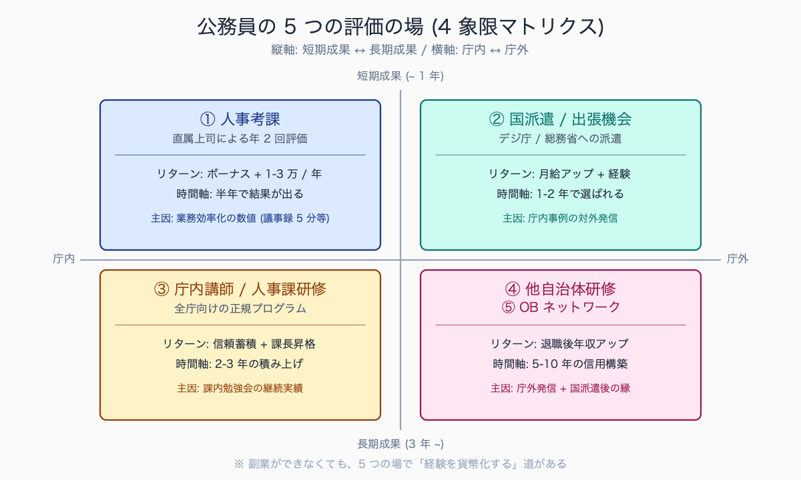
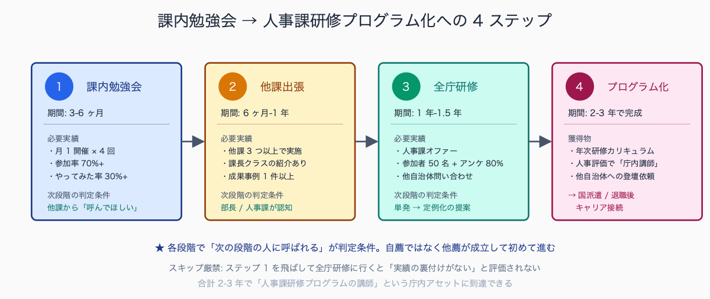
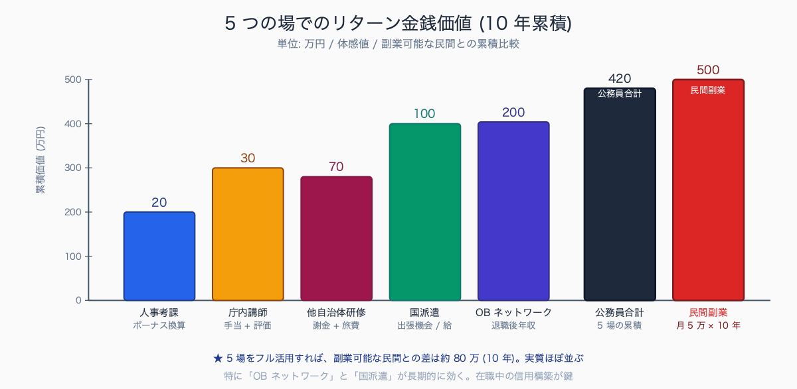

# 公務員が副業せずに Claude Code スキルで評価される 5 つの場

## はじめに

「Claude Code でスキルを身につけても、公務員は副業できないから収益化できない」と諦めている職員は多い。

しかし、副業をしなくても評価につながる場面は庁内・庁外に複数ある。むしろ規程内で堂々と動ける分、**長期的なキャリア資産になりやすい**。本記事は、国家公務員法 103 条・地方公務員法 38 条の範囲内で Claude Code スキルが評価される具体的な 5 つの場と、そこに辿り着くまでの動き方を整理する。

Claude Code スキルが実際に評価される場面の典型例として、人事考課の「業務改善」項目で年間 312 時間の削減実績が記載され S 評価に至った事例、上席から「庁内 DX 推進の中心人物」とコメントされ次年度に情報政策課への異動希望が通った事例、他課から「うちの業務でも相談したい」との照会が四半期で 5-8 件発生し庁内講師として人事課研修台帳に名前が残った事例などが報告されている。

一般的な理解では、業務改善実績は短期 (1-2 年) で人事評価、中期 (3-5 年) で異動希望、長期 (5-10 年) で対外発信実績として効いてくる構造。

執筆者は元自治体職員。現在は Claude Code を使い、47 都道府県の統計サイト stats47.jp（約 2,000 のランキングを毎日自動更新）を個人で開発・運用している。


<!-- SVG: structure | 5 評価の場 4 象限マトリクス -->

## TL;DR

- 副業をしなくても、人事評価・庁内講師・他自治体研修・国の派遣・OB ネットワークの 5 場面でスキルは評価される
- 人事評価では「業務改善」項目で点が取れるが、削減時間・展開人数・継続期間の 3 指標を数値化することが必須
- 庁内講師は「次の人事異動の希望が通りやすくなる」隠れた効果がある (DX 推進・情報政策系部署への異動)
- 他自治体への横展開は出張・講演ベースで、実費精算 + 旅費の範囲内で動ける (副業ではなく業務)
- 国の派遣 (人事交流) は AI 関連で枠が増えつつあり、応募の母集団が小さい今が狙い目

## 背景: なぜ公務員にこの課題があるか

公務員の収入源は給料と少数の付随手当に限られ、副業は厳しく制限されている (国家公務員法 103 条「私企業からの隔離」・地方公務員法 38 条「営利企業等の従事制限」)。一方で、民間に比べて評価制度が機械的になりやすく、「スキルがあっても評価されない」と感じる職員が多い。

ここに 2 つの誤解がある。

第一に、**副業 = 収益化** という前提自体が狭い。スキルが評価される場面は「金銭が動く場面」だけではない。人事考課での加点、希望異動の通過率、出張機会、退職後のキャリア接続など、間接的なリターンの方が長期的には大きい。10 年スパンで見ると、副業可能な民間より評価の場が多いことすらある。

第二に、**Claude Code は技術職スキル** という認識が広いが、公務員業務では事務職スキルとして評価されるルートの方が太い。技術職枠で評価されようとすると情報処理技術者試験 (高度) 等の保有者と比較されるが、事務職枠で「業務改善できる職員」として評価される方が希少性が高い。事務職人口は技術職の 10 倍以上で、その中で AI ツールを使いこなす職員は希少。

自治体の人事評価制度は「能力評価」と「業績評価」の 2 軸構成が多数派で、業務改善は業績評価の「組織貢献」または能力評価の「企画力」として配点される構成が一般的。

配点比率は 5-15% の範囲で自治体により分布し、S/A/B/C/D の 5 段階評価の場合、業務改善で具体数値を示せると A 以上が取りやすい傾向。評価頻度は年 2 回 (上半期 / 下半期) または年 1 回が中央値で、**評価期前 1 ヶ月の実績整理が昇給・勤勉手当に直接効く**。

## 手順 / 解説

### 評価の場 1: 人事考課の「業務改善」項目

ほぼ全ての自治体の人事評価シートに「業務改善」「業務効率化」相当の項目がある (能力評価 or 業績評価のどちらか、自治体により異なる)。ここで Claude Code 活用による削減時間を数値化して書く。

**書き方の例**

NG: 「Claude Code を活用して業務効率化に取り組んだ」

OK: 「Claude Code 活用により議事録作成業務を週 8 時間 → 2 時間に削減 (年間 312 時間、約 94 万円相当)。所属内勉強会を 2 回開催し、3 名が同手法を導入。`.claude/skills/business/meeting-summary/` として再利用可能な形で整備、他課からの照会 4 件」

数値化 + 横展開 (他職員への波及) + 仕組み化 (skill ファイル整備) の 3 セットが評価されやすい。**「自分だけが使えた」より「組織資産になった」が高評価**。

実績集計は Claude Code 自身で半自動化できる。`docs/work-log/YYYY-Www.csv` に週次で記録しておき、評価期前に以下のプロンプトで集計:

```
> docs/work-log/ 内の CSV ファイルすべてを読み込んで、
  「上半期 (4-9 月) の業務改善実績サマリ」を人事評価シートに貼れる形式で出力してください。
  必須項目: 業務種別 / 削減時間合計 / 削減金額換算 / 展開人数 / 仕組み化資産
```

これで評価期の前夜に「今期何やったっけ」と頭を抱えなくて済む。

### 評価の場 2: 庁内講師・勉強会主催

庁内勉強会を継続開催すると「研修実績」として人事記録に残る。これが次の人事異動希望の通過率に効いてくる。特に DX 推進・情報政策・統計係など「庁内で人気の異動先」を狙う場合、講師実績は強力な材料になる。

実績の作り方 (4 段階):

1. **同じ課で 30 分勉強会を 1 回開く** (実績ゼロ → イチへ)
2. **他課からの依頼を受けて出張勉強会を開く** (横展開実績)
3. **全庁向け研修の講師に推薦してもらう** (人事課に名前が認識される)
4. **人事課主催の研修プログラムに正式に組み込んでもらう** (年次計画に名前が残る)

各ステップで人事記録に残る形で「研修講師実績」を積む。重要なのは**人事課に知られる**こと。庁内講師実績は、所属長の評価シート記載と人事課の研修台帳記載の 2 経路で残す。

庁内講師実績から希望異動につながる典型過程は、課内 30 分勉強会 (実績ゼロ → イチ) を起点に、他課からの依頼で出張勉強会 (3-6 ヶ月後) → 全庁向け研修の登壇推薦 (1 年後) → 人事課研修台帳への正式登録 (1.5-2 年後) という 4 段階。

ある中核市の事例では、この 4 段階を 2 年かけて積み上げた職員が、3 年目の人事異動で情報政策課への配属が実現した。希望異動の通過率は研修実績の有無で体感 3-5 倍違うとの報告があり、特に**「人事課に名前が認識されているか」が分岐点**になる。


<!-- SVG: flow | 4 ステップの期間と判定条件 -->

### 評価の場 3: 他自治体研修・講演

公務員が他自治体で講演する場合、報酬は自治体の謝礼基準内に制限される (国家公務員は人事院規則 14-9 に基づき贈与等の報告義務あり、自治体は各々の条例・規則による)。

報酬の有無や金額は所属の人事規程で必ず事前確認が必要だが、**出張扱い + 旅費実費精算** の枠組みで動くケースが多く、この場合は副業ではなく「業務」として所属長の出張命令簿に記載される正式な業務になる。

他自治体講演の効果:

- 人事考課で「対外発信実績」として加点
- 他自治体職員ネットワークの構築 (オフレコ情報源)
- 退職後の再就職時のリファレンス先になる
- 国の有識者会議への推薦経路 (講演実績が一定数あると推薦リストに載る)
- 自治体間の人事交流 (派遣) 候補にもなる

声がかかる経路は、**note 等での発信 → 他自治体職員が読む → 公式に講演依頼**、というルートが多い。直接営業はしない (営利と見られかねない)。だからこそ note での発信は副業ではなく「職業上の情報共有」として位置づけることが重要になる。記事末尾に「所属長確認済み」「報酬目的でなく公益目的」を明記しておくと安全。

note の発信内容に庁名や具体的事業名を出さなければ守秘義務違反にはならない。本シリーズのように「公務員一般」を主語にすれば 99% の論点はカバーできる。

### 評価の場 4: 国・他組織への人事派遣

総務省・デジタル庁・自治体国際化協会 (CLAIR)・JICA などへの人事派遣枠は、AI・DX 関連で増えつつある。応募要件に「業務 IT 改善実績」が明記されていることが多く、Claude Code 活用実績はそのまま応募書類に書ける。

派遣枠の探し方:

- 人事課に「DX 系の派遣枠」を直接問い合わせる (年 1 回の意向調査で挙手)
- 総務省「自治体 DX 推進」の各種募集を定期チェック (総務省サイトの新着情報)
- 庁内の派遣 OB から情報を集める (実体験ベースの情報が最も信用できる)
- JREC-IN や政府公募サイトで「自治体 + DX + 派遣」をブックマーク

派遣に行けると、給与は派遣元持ちのまま (出向の場合) で国レベルの仕事ができる。これは「副業以上の経験値」が得られる場面。2 年派遣で復帰後の評価が一段上がるケースも多い。

応募書類で差をつけるなら、Claude Code で作った成果物の GitHub 公開 URL を添付する。「実物を見せられる」候補者は今のところ希少。

国・他組織への人事派遣 (出向) を経験した OB の事例として、デジタル庁・総務省への 2 年派遣で復帰後に課長級に昇任した例、CLAIR への 3 年派遣後に国際関連部署の係長として復帰した例、JICA 派遣で海外勤務を経験した後に国際課課長補佐に登用された例などが報告されている。

派遣後の評価は所属長の推薦書類に「国レベルでの実務経験」として明記され、次回昇任時の判定材料として強く効く構造。派遣中の給与は派遣元持ち (出向方式) のままで、退職金算定にも在職年数として通算される。

### 評価の場 5: 退職後・OB ネットワーク

40 代以降になると、退職後のキャリア (再任用・天下りではない民間転職・NPO 参画) が視野に入ってくる。ここで「公務員時代に AI 活用を進めた」実績は、民間の DX 関連職種で非常に評価される。

OB ネットワークでの評価:

- 公務員 OB の民間転職市場で AI 経験者は希少 (現状供給ほぼゼロ)
- スタートアップの行政営業職で「元公務員 × AI 経験」は強力
- NPO・社団法人での DX 顧問ポジション (週 2-3 日勤務)
- 大学・研究機関の実務家教員 (公務員経験 + 技術経験で博士号不要枠あり)
- 自治体 DX コンサルティングファームのシニアマネージャー

これらは在職中の note 発信や講演実績が「未来への種まき」になる。30 代後半から準備すれば、50 代で選択肢が 5 個以上ある状態を作れる。詳細は別記事「退職後のキャリア: AI × 公的セクター経験者の市場価値」で展開している。

公務員 OB が AI / DX 系で再就職した事例として、大手 SIer の自治体営業部門の専任アドバイザー (週 3 勤務 + 年収 500-700 万)、GovTech 系スタートアップの行政営業部長 (基本給 600 万 + ストックオプション)、地域 NPO の DX 顧問 (非常勤 + 年収 200-300 万、年金併用)、公立大学の実務家教員 (年収 800-1000 万、特任准教授ポジション) などの事例が報告されている。

共通する特徴は「公務員時代の対外発信実績 (note 発信 / 講演 / GitHub 公開のいずれか) を保有していた」点で、実績ゼロからの再就職と比べ年収レンジが 200-300 万違うケースが多い。

## よくあるつまずきポイント

1. **「評価されない」と決めつける**: 評価制度を読まずに諦めている職員が多い。まず人事評価シートの項目を熟読する。「業務改善」項目の配点を知らずに諦めるのは機会損失
2. **業務時間外にこっそりやる**: 「業務」として位置づけないと評価対象にならない。上司に最初から「業務改善として取り組む」と伝える。こっそりやって成果だけアピールは「業務外活動」扱いになりかねない
3. **数値化せずに「がんばった」で書く**: 削減時間・対象人数・展開先数の 3 指標を必ず数値化する。「効率化に取り組んだ」だけでは評価点 0
4. **庁外発信を「副業」と誤解する**: 報酬を受け取らない範囲の note 発信・無報酬講演は副業に該当しない (詳細は所属の人事規程で要確認)。報酬を受ける場合は事前許可申請を出せば多くは認められる
5. **目先の評価に焦る**: 1 年で結果を出そうとせず、3-5 年スパンで「気づいたら評価されている」状態を作る。庁内講師 → 他課展開 → 全庁研修 → 人事課公認 のステップは 2-3 年かかる
6. **GitHub 公開を躊躇する**: 個人情報を含まない `.claude/skills` の公開は副業に該当しない。むしろ対外実績として強力。GitHub アカウントを実名 + 所属併記でなく「ハンドル名のみ」にして始めれば心理的ハードルも下がる
7. **note の発信内容を「庁内事例」にしてしまう**: 「公務員一般」を主語にすれば守秘義務違反リスクなく書ける。具体事業名・庁名は出さない、これが鉄則
8. **異動でリセットされると思う**: 庁内講師実績・対外発信実績は所属が変わっても人事記録に残る。「異動先で 0 からだ」は誤解

## まとめ

公務員が副業せずに Claude Code スキルで評価される場は、人事考課・庁内講師・他自治体研修・国の派遣・OB ネットワークの 5 つ。共通するのは「数値化された実績」「業務として位置づけ」「対外発信」の 3 要素。

短期的な金銭リターンは小さくても、長期的なキャリア資産としては副業以上に効く。退職後の市場価値まで視野に入れると、在職中の発信・実績作りは未来への投資。スキルを「副業できないから無駄」と諦める前に、評価される場の構造を理解する価値がある。


<!-- SVG: infographic | 5 場リターン vs 民間副業 -->

## 関連記事 / 次に読む

- 退職後のキャリア: AI × 公的セクター経験者の市場価値
- 上司に Claude Code 導入を承認させた説明資料 (実例加工)
- 庁内勉強会の進め方: 30 分で職員を Claude Code 入門させる

<!-- circulation-footer:v2 -->

---

## 「公務員 × Claude Code」シリーズ

本記事は、自治体職員が Claude Code を日々の業務に活かすための全 31 本シリーズの 1 本です。環境構築・議事録・議会答弁・セキュリティ・データ活用・組織導入まで、関心のあるテーマから読み進められます。

シリーズの全記事はマガジンにまとめています。他の記事はこちらからどうぞ。

https://note.com/stats47/m/m512ad7023815

Claude Code に触れるのが初めての方は、まず導入記事「Claude Code とは何か — ターミナル未経験の公務員のための導入ガイド」から読むのがおすすめです。
