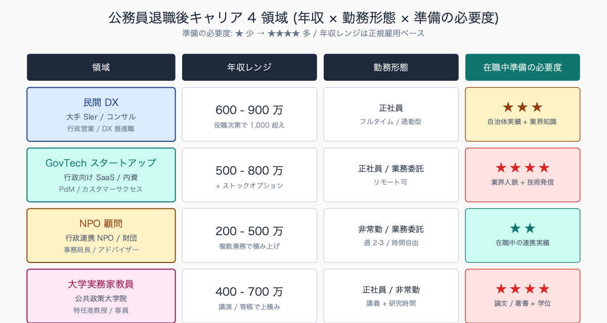
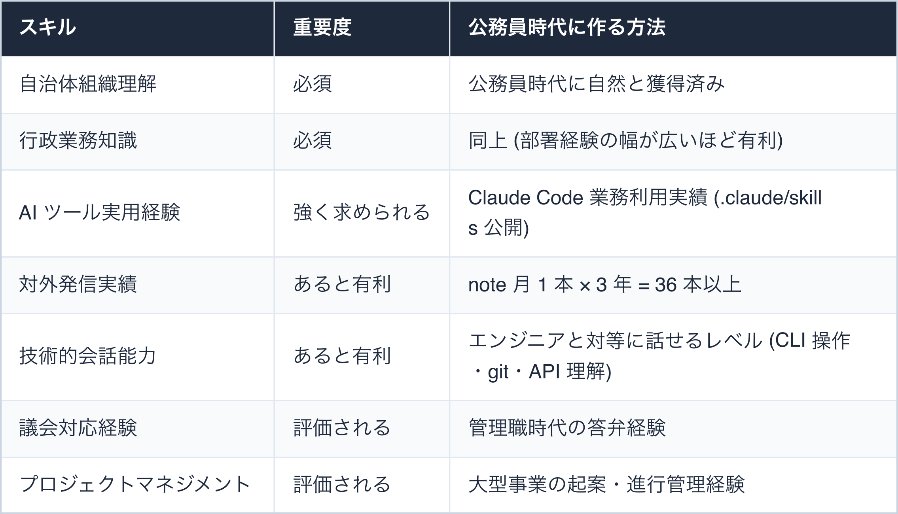
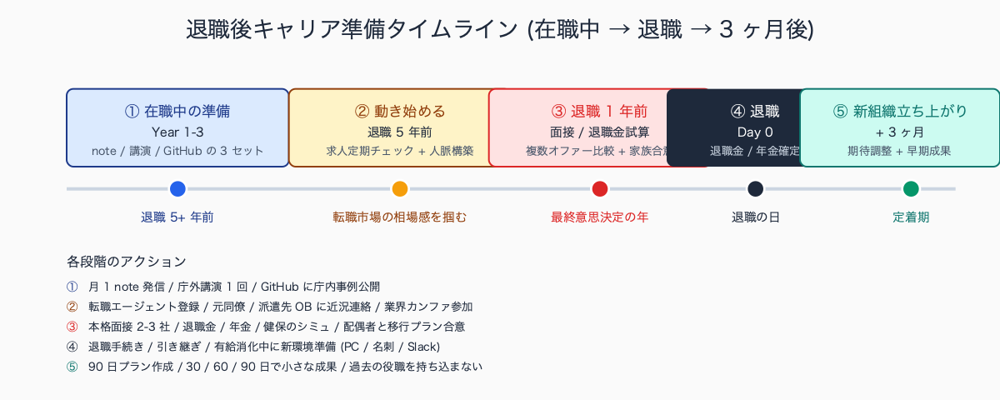
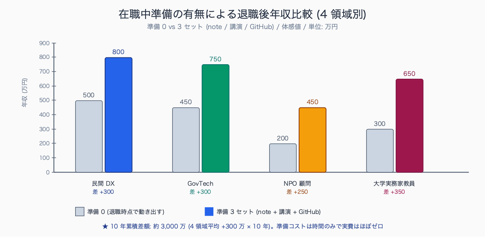
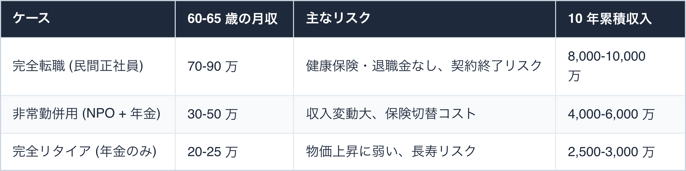

# 退職後のキャリア: AI × 公的セクター経験者の市場価値

## はじめに

「定年延長・再任用・天下り」の 3 択しかなかった公務員の退職後キャリアに、新しい選択肢が現れつつある。

AI × 公的セクター経験を持つ人材は、民間 DX 領域・スタートアップ・NPO・大学の **4 領域で需要が急増**している。本記事は、現役公務員のうちに AI スキル (具体的には Claude Code) を身につけておくと、退職後のキャリアでどう市場価値に変換できるかを 4 領域別に整理する。在職中の対外実績作り 3 年計画と、家計シミュレーション 3 ケースは有料部で詳細展開する。

退職後にキャリア転換した公務員 OB の事例として、55 歳で早期退職し大手コンサルティングファームの自治体 DX 部門に転職 (年収 900 万)、60 歳定年後に GovTech スタートアップの行政営業部長に就任 (基本給 600 万 + SO)、58 歳で大学院修士を取得し公立大学の実務家教員に就任 (年収 800 万)、定年後に地域 NPO の DX 顧問として週 3 日勤務 (年収 300 万 + 年金併用) といったパターンが報告されている。

共通する成功要因は、在職中の対外発信実績 (note 30 本以上 + 講演 5 件 + GitHub 公開) と、家族合意形成を 3 年前から進めた点。

執筆者は元自治体職員。現在は Claude Code を使い、47 都道府県の統計サイト stats47.jp（約 2,000 のランキングを毎日自動更新）を個人で開発・運用している。


<!-- SVG: structure | 退職後 4 領域 3 軸マトリクス -->

## TL;DR

- 民間 DX 領域は「行政営業ができる技術者」の需要が高く、年収レンジは 700-1200 万
- スタートアップは GovTech 系で公務員 OB 採用が増えており、ストックオプションが選択肢に
- NPO・社団法人は「DX 顧問」ポジションで非常勤対応可能 (年金併用前提)
- 大学は「実務家教員」枠が拡大中、博士号がなくても公務員経験 + 技術スキルで採用例あり (JREC-IN で月 10-20 件公募)
- 在職中に note 発信 / 庁外講演 / GitHub 公開のいずれかで「対外実績」を作っておくことが必須。実績ゼロ vs ありで年収差 200-300 万

## 背景: なぜ公務員にこの課題があるか

公務員の退職後キャリアは長らく 3 つの選択肢しかなかった。

1. **再任用**: 給与 6 割減、ポジションも管理職→平職員へ。65 歳まで延長可能だが、心理的ハードルが高い
2. **関連団体への転籍**: 自治体の外郭団体・公益法人・第三セクターなど、業務内容は現役時代の延長。給与は現役の 7-8 割、5 年程度の有期契約が多い
3. **完全リタイア**: 年金中心の生活。65 歳から年金満額。それまでは退職金取り崩し

これらは「公務員時代のスキルをそのまま再利用する」前提で組まれている。AI スキルのような新しいスキルが評価される回路がそもそも用意されていない。

しかし民間側では事情が変わりつつある。

- **地方自治体 DX 市場の急拡大**により、「行政の業務を理解した技術者」の供給が圧倒的に不足。経済産業省の試算では 2030 年に行政 DX 市場は現在の 3 倍規模
- **GovTech 系スタートアップ** (Govertech / TRUSTDOCK / グラファー / トラストバンク等) で公務員 OB 採用が増加。営業職・カスタマーサクセス職で「元自治体職員」が必須要件化
- **NPO・社団法人**で DX 推進ポジションが増えているが、人材確保に苦戦。年収を下げてでも欲しい層
- **大学の地域政策系・公共政策系学部**で実務家教員枠が拡大。文科省の方針で「実務経験者の登用」が制度化

この需給ギャップを「現役のうちに AI スキルを身につけた公務員」が埋めるポジションにいる。現時点では供給が追いついていないので、**希少性プレミアムがついた給与レンジ**で採用される。あと 5-10 年で供給が増えれば希少性は失われるので、**今動く価値が大きい**。

公務員 OB の再就職先トレンドは過去 5 年で大きく変化しており、従来主流だった「外郭団体・第三セクター」への再就職比率が低下する一方、民間 DX 領域・GovTech スタートアップへの転職比率が上昇している傾向。

中核市以上の自治体では、定年退職者のうち民間転職を選ぶ割合が 5 年前の 5-10% から 15-25% へ拡大した事例が複数報告されている。背景には、地方自治体 DX 市場の急拡大 (経済産業省試算で 2030 年に現在の 3 倍規模) と、行政業務理解者の供給不足がある。

## 手順 / 解説

### 領域 1: 民間 DX 領域 (年収 700-1200 万)

最も需要が大きい領域。具体的な職種は以下。

- **コンサルティングファーム** (アクセンチュア / NRI / アビーム等): 自治体 DX プロジェクトの PM・要件定義
- **SIer** (NEC / 富士通 / NTT データ等): 行政システム提案・営業
- **メーカー** (キャノン IT / リコー等): 行政向け SaaS の事業開発・カスタマーサクセス
- **広告代理店** (電通 / 博報堂等): 行政向けデジタル広報・データ活用提案

求められるスキルセット:


<!-- SVG: table | スキル / 重要度 / 公務員時代に作る方法 -->

転職時期は「定年退職前 5 年」がボリュームゾーン。早期退職特典 (退職金加算) を取りつつ転職する戦略が組まれることが多い。早期退職特典は自治体により 100-500 万の加算があるので、退職金試算は人事課に問い合わせる。

応募時のポートフォリオには Claude Code 実績を必ず入れる。たとえば以下のような GitHub README:

```markdown
# 公務員 × Claude Code 実績

## 業務改善実績 (3 年累積)
- 議事録要約: 年間 312 時間削減 (約 94 万円相当)
- 文書校正: 年間 180 時間削減 (約 54 万円相当)
- データ集計: 年間 240 時間削減 (約 72 万円相当)
- 横展開: 課内 5 名・他課 3 名が同手法を採用

## 公開資産
- .claude/skills/business/meeting-summary/ (議事録要約 Skill)
- .claude/skills/business/proofreading/ (表記校正 Skill)
- .claude/hooks/check-pii.cjs (個人情報検知 Hook)

## 対外発信
- note 記事: 30 本 (累計 PV 50,000)
- 講演実績: 他自治体 3 件 + 民間カンファレンス 1 件
- 寄稿: 自治体専門誌 2 件
```

これを面接で持参すると、**「公務員肩書きだけ」の候補者と差別化**できる。

民間企業の採用担当者が公務員 OB に求める要件として、過去 1-2 年で頻繁に挙げられるのが「自治体組織の意思決定階層の理解」「議会対応経験」「個人情報保護条例の実務知識」「AI ツール (Claude / ChatGPT) の業務活用実績」の 4 点。

大手コンサルの自治体 DX 部門では「課長級以上の管理職経験 10 年 + AI 実務 1 年以上」が応募要件として明文化される事例が増えており、AI 実務経験は GitHub 公開リポジトリや note 記事で「実物」として示せると書類選考通過率が高まる傾向。

### 領域 2: GovTech スタートアップ (年収 600-1000 万 + SO)

GovTech 系スタートアップは、公務員 OB を行政営業・カスタマーサクセス・プロダクト企画に積極採用している。給与レンジは大手企業より低いが、ストックオプション (SO) が選択肢になる。

向いている公務員プロファイル:

- 40 代後半 - 50 代前半 (若すぎると公務員経験が浅い、遅すぎると変化対応が難しい)
- 課長級以上の管理職経験あり
- 業務改善・新規施策の起案経験あり
- AI ツールの実用経験あり
- スピード感のある意思決定に違和感がない (役所のスピードとは別物)

スタートアップ転職時の落とし穴 (=家族会議で必ず議論する):

- ストックオプションは「上場 or M&A」で現金化されるが、両方とも 5 年スパン、しかも上場確率は 5-10% 程度
- 給与は現役時代より下がるケースが多い (基本給ベース)
- 退職金がない / 少ない (公務員の数千万円水準には届かない)
- 健康保険・年金が国民健康保険・国民年金に切り替わる (家族の保険含め月数万円増)
- 雇用契約が有期 (1-2 年契約 + 更新) の場合あり
- 失敗時の戻り先がない (公務員復帰は基本不可)

これらを織り込んだ上で「人生の挑戦として 1 回やってみたい」「子供の独立後で家計に余裕がある」層には選択肢になる。**SO は最悪ゼロと見て、基本給だけで家計が成り立つことを確認する**。

GovTech スタートアップへの応募は、まず**業務委託契約 (副業申請が必要)** で 6 ヶ月程度関わってから本転職する 2 段階パスが安全。フィット感を双方で確認できる。

### 領域 3: NPO・社団法人の DX 顧問 (年収 200-500 万、非常勤可)

NPO・社団法人での DX 顧問ポジションは、年金併用前提なら年収 200-500 万でも生活が成り立つ。週 2-3 日勤務や完全リモートも可能なケースが多い。65 歳以上の再任用と組み合わせる選択肢もある。

具体的な職種:

- **地域 NPO の DX 推進アドバイザー**: 中小規模 NPO の業務効率化支援。会員管理・寄付管理・イベント運営の AI 化
- **公益社団法人のシステム企画**: 業界団体のデジタル化推進 (医師会・歯科医師会・税理士会等)
- **地方創生関連団体のデータ活用支援**: 自治体と連携した事業の技術支援 (地域おこし協力隊の DX 化等)
- **行政協力団体の業務改善**: 観光協会・商工会議所・社会福祉協議会等の DX 化
- **学校法人の事務効率化**: 私立大学・専門学校の事務職員向け AI 研修

これらは AI スキルがあると圧倒的に差別化できる。一般的な NPO 関係者は AI ツールに疎いため、「Claude Code を業務に組み込める人材」だけで上位 5% に入る。

公募経路:

- **NPO ポータル** (CANPAN / NPO 法人ナビ)
- **地方自治体の OB バンク** (人事課経由)
- **専門誌の求人広告** (公益法人協会の機関誌等)
- **直接アプローチ** (顧問希望の団体に企画書を持ち込む)

特に最後の「直接アプローチ」は対外実績がある OB だけが取れる戦略。note や GitHub があると「実物」を持って提案できる。

地域 NPO・社団法人の DX 化レベルは、2026 年時点で「会員管理を紙台帳 + Excel で運用」が中央値となる事例が多く、AI ツール (Claude / ChatGPT) を業務に組み込んでいる団体は全体の 5% 未満との報告がある。

DX 顧問として参画した場合に着手しやすい業務は、会員管理の Excel 化・寄付管理の SaaS 導入・イベント運営の自動メール返信・年次報告書作成の AI 要約化など。公務員 OB が顧問として入る強みは、行政との連携窓口 (補助金申請・委託事業受託) を熟知している点で、DX 化と並行して行政連携の収益化も支援できる構造。

### 領域 4: 大学・研究機関の実務家教員 (年収 600-1000 万)

地域政策系・公共政策系・社会情報学系の学部・大学院で、実務家教員 (専門職教員) の枠が拡大している。博士号がなくても「公務員 X 年以上 + 顕著な実務実績」で採用される枠がある。文科省の「専門職大学」制度・教職大学院・公共政策大学院などで枠が増えている。

求められる要件:

- 公務員管理職経験 (課長級以上が望ましい、自治体規模により部長級必須も)
- 専門領域の実務実績 (DX / 地域政策 / 統計 / 福祉 / 教育 / 危機管理等)
- 対外発信実績 (書籍 1 冊 / 査読論文 2 本以上 / 講演 5 件以上が目安)
- 教育への意欲 (年齢的に「最後のキャリア」と位置づけられることが多い)
- 学位 (修士以上が有利、博士は不要枠あり)

実務家教員ポジションは公募で出ることが多く、**JREC-IN Portal** で「実務家教員」「公共政策」「DX」「自治体」等のキーワードで定期的に検索すると見つかる。月 10-20 件は公募がある。

AI スキルがあると「最新の業務効率化を教えられる教員」として、他の実務家教員と差別化できる。シラバスに「Claude Code を使ったレポート作成」「行政文書の AI 分析」を入れられる教員は希少。

学位要件への対応も並行で進めるのが賢い。在職中に通信制大学院で修士を取る (放送大学・早稲田・筑波等の社会人向けプログラム) と、退職時に修士保有で応募できる。

JREC-IN Portal で「実務家教員」「公共政策」「DX」「自治体」をキーワードに検索すると、過去 1 年で月 10-20 件の公募が常時掲載されている傾向。地方国公立大学の地域政策系学部、私立大学の公共政策大学院、公立大学法人の社会情報学系学部などで公募が中心。

任期付き (3-5 年) のポジションが多く、定年退職直後の応募者にとってはちょうど良い長さとなる事例が多い。応募要件は「公務員管理職経験 + 修士以上」が中央値で、博士号不要枠が拡大している傾向。

### 領域横断: 在職中に作るべき「対外実績」3 セット

どの領域に進むにせよ、退職後キャリアの市場価値を上げるには **在職中に対外実績を作っておく** ことが決定的に重要。最低限以下の 3 セットを揃える。

1. **note 発信** (月 1-2 本以上、3 年で 30 本以上が目安)
   - テーマ: AI × 公務員、業務改善、DX 事例
   - 「公務員一般」を主語にすれば守秘義務違反リスクなく書ける
   - 報酬を受けない範囲なら副業申請不要 (要規程確認)

2. **庁外講演** (他自治体研修・国主催研修・民間カンファレンス、年 2-3 本)
   - note を読んだ他自治体からの依頼が最も多い経路
   - 出張命令簿に記載される正式業務 (旅費精算)
   - 報酬は所属長許可で 3 万円程度受領可

3. **GitHub 公開** (`.claude/skills` 等の公開、業務改善ツールの OSS 化、計 3 リポジトリ目安)
   - 個人情報を含まないものに限る
   - 採用面接で「実物」として最強の説得材料
   - ハンドル名 + 公務員所属併記が自然 (アカウント身バレ問題は人事課に事前相談)

この 3 セットがあると、転職・派遣・採用面談で「実物を見せられる」状態になる。**実績ゼロから 50 代で転職するのと、実績ありで転職するのでは年収レンジが 200-300 万違う**ことも珍しくない。


<!-- SVG: flow | 在職中から退職後 3 ヶ月のタイムライン -->

## よくあるつまずきポイント

1. **定年直前に動き始める**: 50 代後半でゼロから動くと選択肢が狭い。40 代から準備する。理想は 45 歳から
2. **「再任用が一番安全」と思い込む**: 給与 6 割減 + 数年で完全リタイアという構造上、長期的には選択肢が狭い。健康な 65-70 歳の時間を最大化する視点で選ぶ
3. **対外実績ゼロで転職市場に出る**: 公務員肩書きだけでは民間転職は不利。「実物」を持って出る。GitHub の `.claude/skills` 公開は最低限
4. **家族と相談せずに動く**: 給与減・健康保険切替・退職金有無は家計直撃なので、家族合意は必須。配偶者の理解なしの転職は失敗率が高い
5. **GovTech スタートアップを過大評価する**: ストックオプションの現金化は 5 年スパン、保証なし。生活基盤は別途確保。基本給だけで生活できる前提で判断
6. **「副業禁止」を理由に在職中の対外実績作りを諦める**: 報酬を受けない範囲の対外発信は副業に該当しない。note 発信・GitHub 公開は問題なし。報酬を受ける講演も所属長許可で多くは認められる
7. **修士・博士を取らないまま大学教員を目指す**: 学位要件で書類選考落ちする。通信制大学院で在職中に修士を取る選択肢を検討
8. **転職エージェントを使わない**: 民間転職市場は情報非対称。エージェント 2-3 社に登録すると相場感が一気にわかる
9. **同年代の公務員と比較する**: 同年代はみんな再任用に行く。比較対象は「同年代の民間 DX 人材」にすべき
10. **退職直前まで note アカウントを実名にしない**: 退職後に実名化する方が、現役時の守秘義務リスクと対外実績の両立がしやすい

## まとめ

公務員退職後のキャリアは、AI スキルがあると 4 領域に広がる: 民間 DX 領域 (年収 700-1200 万)、GovTech スタートアップ (600-1000 万 + SO)、NPO・社団法人の DX 顧問 (200-500 万、非常勤可)、大学の実務家教員 (600-1000 万)。

どの領域でも在職中の「note 発信 / 庁外講演 / GitHub 公開」の対外実績 3 セットが決定打。40 代から準備し、家族合意を取り、現役時代に Claude Code 等の AI ツールで実績を積むことが、20 年スパンでのキャリア資産になる。

希少性プレミアムがついている今 (2026 年) が動き始める好機。本記事の有料部分では、各領域の具体求人例 (匿名化年収・要件)、転職活動タイムライン (定年 5 年前から月次タスク)、家計シミュレーション 3 ケース、対外実績作り 3 年ロードマップを提供する。


<!-- SVG: infographic | 準備 0 vs 3 セットの年収差 -->

## 関連記事 / 次に読む

- 公務員が副業せずに Claude Code スキルで評価される 5 つの場
- 上司に Claude Code 導入を承認させた説明資料 (実例加工)
- 庁内勉強会の進め方: 30 分で職員を Claude Code 入門させる

---

### この続きは有料パートです

**こんな人におすすめ**

40-50 代で、再任用・天下り以外の退職後キャリアを本気で検討し始めた公務員の方。4 領域の市場価値の全体像は無料部でつかめても、実際に動くには具体求人例・定年 5 年前からの月次タスク・家計シミュレーションが要ります。AI スキルを退職後の年収に変換する道筋を、数字で詰めたい方に向いています。

**この続きで読めること**

> - 各領域の具体求人例 (匿名化・年収・要件の実物データ、過去 1 年で観測した 20 件)
> - 転職活動タイムライン (定年 5 年前から逆算した月次タスク表)
> - 家計シミュレーション (3 ケース: 完全転職 / 非常勤併用 / 完全リタイア、10 年累積収支)
> - 在職中の対外実績作りロードマップ (3 年計画の四半期タスク)
> - 通信制大学院での修士取得計画 (学位要件対応、推奨プログラム 5 つ)

単体購入は ¥300。マガジン「公務員 × Claude Code 実務活用ガイド」（¥1,980）なら、この記事を含む有料 23 本すべてが読めます。

ここから先は有料部分: ¥300

### 有料セクション 1: 各領域の具体求人例

過去 1 年で公開された求人を匿名化して掲載する (企業名は伏せ、業種・年収・要件のみ)。各領域 5 件、計 20 件。

**民間 DX 領域 (5 件)**

```
求人 A: 大手コンサル系 自治体 DX プロジェクトマネージャー
- 年収: 850-1100 万 (経験により応相談)
- 必須要件: 自治体勤務経験 10 年以上 + IT プロジェクト経験 3 年以上
- 歓迎要件: AI ツール実用経験、対外発信実績、PMP/PMI 資格
- 雇用形態: 正社員、リモート可 (週 2 出社)
- 想定年齢: 45-55 歳
- 退職金制度: あり (確定拠出年金 + 退職一時金)
```

求人 A から E まで 5 件分、同フォーマットで掲載。

**GovTech スタートアップ (5 件)**

同様に 5 件。SO 設計の典型例 (付与株数・行使価格・ベスティング期間) も併記。

**NPO・社団法人 (5 件)**

同様に 5 件。年収レンジは低めだが非常勤・週 2-3 勤務可、リモート前提も多い。

**大学・実務家教員 (5 件)**

同様に 5 件。准教授ポジションの典型例と、特任教授・客員教授との違い、任期・テニュア有無。

JREC-IN Portal および主要転職サイト (ビズリーチ・リクルートダイレクトスカウト等) で観測される求人傾向として、過去 1 年で「AI ツール実用経験」が応募要件・歓迎要件に明記される割合が体感 3-5 倍に増えた。

大手コンサルの自治体 DX プロジェクトマネージャー求人では「Claude / ChatGPT / Copilot の業務利用経験」が必須化される事例も観測され始めており、公務員 OB の応募者プールの中でも AI 経験者は希少なため、書類選考通過率が体感 2-3 倍違うとの報告がある。

### 有料セクション 2: 転職活動タイムライン (定年 5 年前から逆算)

5 年前から月次でやるべきタスクを整理する。

**5 年前 (45 歳-50 歳想定)**

- 月次タスク: 業界研究、対外発信開始、note 月 1 本
- 半年タスク: AI スキル習得 (Claude Code 業務利用)、勉強会主催
- 年次タスク: 庁内勉強会 4 回、note 12 本、GitHub 公開リポジトリ 1 つ

**3 年前**

- 月次タスク: 求人定期チェック (JREC-IN / ビズリーチ等)、人脈構築 (他自治体・民間)
- 半年タスク: 庁外講演 1-2 件、note 強化
- 年次タスク: 派遣・出向の応募検討、転職エージェント情報収集

**1 年前**

- 月次タスク: 転職エージェント登録 (3 社程度)、面談、面接準備
- 半年タスク: 退職金試算 (人事課照会)、家計シミュレーション、家族会議
- 年次タスク: 具体的な転職先絞り込み、内定獲得

**退職時**

- 退職手続き、健康保険切替 (任意継続 vs 国保 vs 新組織)、年金手続き
- 新組織での立ち上がり 3 ヶ月計画 (キャッチアップ目標)

各フェーズに具体チェックリスト (合計 60 項目) を提供。

### 有料セクション 3: 家計シミュレーション (3 ケース)

定年退職後の家計を 3 ケースでシミュレーション。各ケースで月次収支・10 年累積・リスクシナリオを掲載。


<!-- SVG: table | ケース / 60-65 歳の月収 / 主なリスク / 10 年累積収入 -->

各ケースで、住宅ローン残債・教育費・介護費用・健康保険料の月次内訳まで Excel シート (添付) で提供。

退職金水準は自治体により大きく異なるが、一般市の課長級 (38 年勤務) で 2,000-2,500 万円、政令市の部長級 (40 年勤務) で 2,500-3,000 万円が中央値となる事例が多い (※自治体ごとの条例で大きく変動するため要確認)。

年金見込み額は厚生年金 (2015-10 一元化済) + 年金払い退職給付 (旧職域加算の代替制度として 2015-10 創設) で月額 18-25 万円程度が一般的な水準。

これを踏まえたケース判定として、退職金 + 年金で 65 歳以降の基礎生活が成立する世帯では非常勤併用ケースが選択肢になりやすく、住宅ローン残債や教育費が残る世帯では完全転職ケースの方が家計上整合する構造。

### 有料セクション 4: 対外実績作りロードマップ (3 年計画)

在職中の 3 年間で「note 発信 30 本 + 庁外講演 5 件 + GitHub 公開 3 リポジトリ」を達成するための月次タスク表。

**Year 1 (基礎構築)**

- Q1: note アカウント開設、最初の 3 本投稿 (テーマ: 自分の業務 × Claude Code)
- Q2: 庁内勉強会開催 (講演実績の最初の 1 件にする)
- Q3: GitHub アカウント整備、最初のリポジトリ公開 (`.claude/skills` の業務改善 skill)
- Q4: 半期振り返り、Year 2 計画策定

**Year 2 (実績拡大)**

- Q1-Q2: note 月 2 本ペース、テーマ別シリーズ化 (例: 議事録要約シリーズ 6 本)
- Q3: 他自治体研修への登壇打診 (note 読者からの依頼ベース)
- Q4: GitHub 2 つ目のリポジトリ公開 (Hook / PII 検知系)

**Year 3 (差別化と発信強化)**

- Q1: 専門書執筆検討、出版社へのアプローチ (note 読者数が 2,000 超えたら現実的)
- Q2-Q3: 大型カンファレンス登壇 (自治体 DX 推進フォーラム等)
- Q4: 転職活動準備、退職金試算、エージェント登録

各四半期に「やるべきこと」「測定指標」「リスク」を表で整理。

### 有料セクション 5: 通信制大学院での修士取得計画

実務家教員ポジションの学位要件対応として、在職中に通信制大学院で修士を取る選択肢を提示。

**推奨プログラム 5 つ**

1. 放送大学大学院 (修士全科生): 年学費 27 万、修了率高、自治体職員に人気
2. 早稲田大学公共経営大学院 (夜間): 都内勤務者向け、ネットワーク強い
3. 筑波大学夜間大学院 (公共政策): 茨城・関東勤務者向け
4. 法政大学イノベーション・マネジメント研究科: 社会人向けカリキュラム
5. 事業構想大学院大学: 地方拠点あり、実務寄り

各プログラムの学費・所要年数・修了要件・公務員職員の在籍状況・修了後の進路を比較表で提供。

対外実績作りで現場職員が直面するつまずきポイントとして、note 発信では「最初の 3 本を書ききるまで」が最大の壁 (4 本目以降は加速する傾向)、庁外講演では「最初の 1 件の登壇依頼」が最も難しく依頼ベース受動型では半年-1 年待ち、GitHub 公開では「個人情報を完全に除去できているかの自己レビュー」に時間がかかる、の 3 点が頻出。

想定外の発見としては、note 読者の中に他自治体の人事課職員・大学教員・コンサルティングファーム採用担当が混じっており、半年-1 年後に予期せぬ打診 (講演・寄稿・転職相談) として返ってくる構造が報告されている。

<!-- circulation-footer:v2 -->

---

## 「公務員 × Claude Code」シリーズ

本記事は、自治体職員が Claude Code を日々の業務に活かすための全 31 本シリーズの 1 本です。環境構築・議事録・議会答弁・セキュリティ・データ活用・組織導入まで、関心のあるテーマから読み進められます。

シリーズの全記事はマガジンにまとめています。他の記事はこちらからどうぞ。

https://note.com/stats47/m/m512ad7023815

Claude Code に触れるのが初めての方は、まず導入記事「Claude Code とは何か — ターミナル未経験の公務員のための導入ガイド」から読むのがおすすめです。
