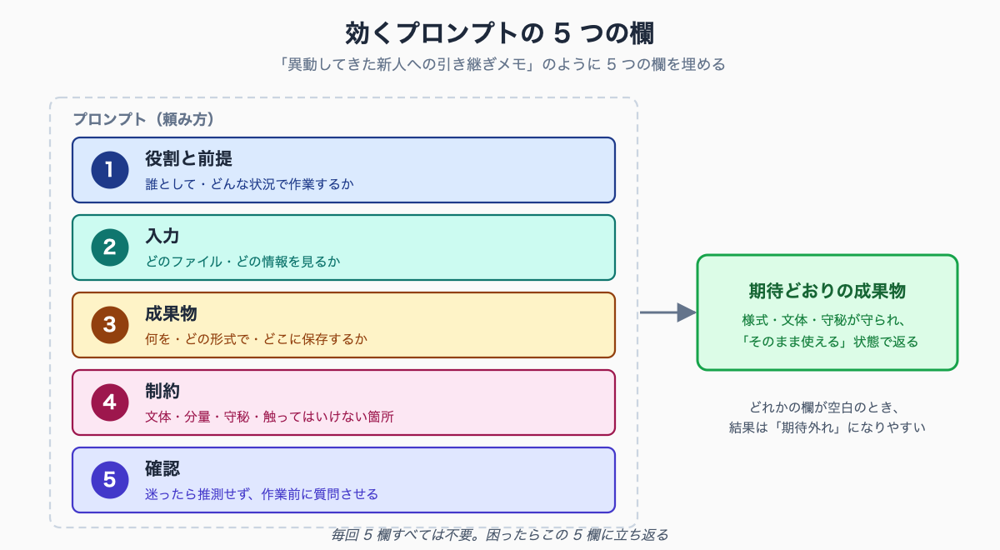

# Claude Code への頼み方 — 公務員業務で「欲しいもの」を引き出すプロンプトの型

## はじめに — 専門用語より先に覚えるべきこと

導入記事 [#00 Claude Code とは何か](../00-claude-code-intro-for-public-servants/draft.md) を読んで「自分の業務でも使えそうだ」と思った方が、いざ起動して頼んでみると、こういう経験をします。

「会議の音声まとめて」と打ったら、要約が短すぎて使えない。「この Excel を整理して」と頼んだら、想定と違う列が消えている。「答弁案を作って」と言ったら、当たり障りのない一般論しか返ってこない——。

ここで多くの人が「やっぱり AI は実務には使えない」と判断してやめてしまいます。**しかし原因のほとんどは AI の能力ではなく、頼み方にあります。**

このシリーズの他の記事には、curl コマンドや SQL、Hooks の設定など、少し専門的な内容も出てきます。しかし Claude Code の本質的な価値は「**専門知識を覚えること**」ではなく、「**やってほしいことを正しく言葉にすれば、専門的な部分は AI が代わりにやってくれる**」という点にあります。

だからこそ、環境構築や個別業務のテクニックより先に身につけるべきなのが「頼み方」です。本記事はその一点に絞って解説します。

**こんな方に向けた記事です**

- Claude Code を頼んでみたが、要約が短すぎる・想定と違うと感じて戸惑っている自治体職員
- 「やっぱり AI は実務に使えない」とやめかけている方
- 専門用語を覚える前に、まず結果が安定する頼み方の基本を押さえたい方

この記事を読み終えると、次のことがわかります。

- なぜ同じ AI でも「頼み方」で結果が大きく変わるのか
- 公務員業務で結果が安定する「プロンプトの型」5 つの要素
- 一発で完璧を狙わず、対話で精度を上げる進め方
- 個人情報・守秘義務を毎回の頼み方にどう織り込むか
- コピペして使えるテンプレート

執筆者は元自治体職員です。現在は Claude Code を使い、47 都道府県の統計サイト stats47.jp（約 2,000 のランキングを毎日自動更新）を個人で開発・運用しています。

専門的なコードを毎回手書きしているわけではなく、その大半は「頼み方」で AI に書かせています。

## なぜ「頼み方」で結果がここまで変わるのか

Claude Code への指示文を「プロンプト」と呼びます。プロンプトを考えるとき、いちばん役に立つ比喩は 「異動してきたばかりの職員への引き継ぎメモ」 です。

優秀だが、あなたの課のことをまだ何も知らない新採用職員が隣に座ったとします。その人に「資料、いい感じにまとめといて」とだけ言って席を立ったら、まともな成果物は返ってきません。どの資料か、何のためか、どんな様式か、誰宛か——前提を共有していないからです。

Claude Code はまさにこの「優秀だが、あなたの課の事情を知らない新人」です。文章力も処理速度も高いです。しかし、

- あなたの自治体のローカルルール（文書事務規程、決裁ルート）
- 「この会議の議事録はいつもこの様式」という暗黙の了解
- 「住民情報は絶対に外に出さない」という当然の前提

これらを **何ひとつ知りません**。ベテラン同士なら「例の件、よろしく」で通じることが、AI には一切通じないのです。

逆に言えば、引き継ぎメモを丁寧に書く要領さえつかめば、AI は新人どころか「経験 10 年の係員」並みの成果物を返してきます。**頼み方とは、この引き継ぎメモの書き方そのもの**です。

## うまくいかない頼み方、5 つの典型

実務で「期待外れ」になるプロンプトは、だいたい次の 5 パターンに当てはまります。いずれも、引き継ぎメモとしては不合格なものです。

**1. 短すぎる丸投げ**
「議事録作って」「答弁案ちょうだい」。情報がなさすぎて、AI は一般論で埋めるしかありません。

**2. 入力ファイルを指していない**
「会議の内容をまとめて」と言っても、どのファイルを見ればいいのか AI にはわかりません。デスクトップに音声ファイルがあることは、言わなければ伝わりません。

**3. 成果物の形を指定していない**
「整理して」だけでは、画面に文章で返すのか、Word で保存するのか、表にするのかが決まりません。様式の決まった公務員文書では致命的です。

**4. 制約・守るべきルールを言っていない**
公用文の文体、分量、「ここは触るな」という禁止事項。これを言わないと、AI は自由に解釈します。守秘義務の指示が抜けるのも、この型です。

**5. 確認のしかたを指示していない**
AI は「わからない部分」も、それらしく埋めてしまうことがあります。「不明なら推測せず質問して」と言わなければ、もっともらしい誤りが紛れ込みます。

この 5 つの裏返しが、そのまま「効く頼み方」になります。

## 効くプロンプトの型 — 5 つの欄

引き継ぎメモに「件名・趣旨・添付・合議先」の欄があるように、プロンプトにも埋めるべき 5 つの欄があります。順に埋めれば、それだけで結果が安定します。


<!-- SVG: structure | 効くプロンプトの 5 つの欄 -->

欄 1: 役割と前提 — 「誰として、どんな状況か」

最初に AI の立ち位置を与えます。「あなたは総務課の議事録作成担当です」「あなたは政策法務担当として条例案をレビューします」。役割を与えると、AI は語彙・観点・成果物のレベルをその職種に合わせます。

欄 2: 入力 — 「どのファイル、どの情報を見るか」

作業の材料を明示します。「desktop/2026-05-20-会議.mp3 を見て」「このフォルダの『前年度版.xlsx』と『今年度版.xlsx』を比較して」。ファイル名は正確に指定してください。AI はフォルダの中を探せますが、指さしてあげるほうが確実です。

欄 3: 成果物 — 「何を、どの形式で、どこに」

ゴールを具体的にします。「議事録を docx で desktop に保存」「画面に 3 案を箇条書きで表示」「この CSV に前年比の列を 1 つ追加して上書き保存」。形式（Word / Excel / 画面表示）と保存場所まで指定します。

欄 4: 制約 — 「守るべきルール、触ってはいけないもの」

文体（公用文・ですます調）、分量（A4 1 枚以内）、根拠（出典を併記）、禁止事項（既存の列は消さない）。そして公務員にとって最重要の **守秘の指示**（後述）。ここが「あなたの課のローカルルール」を伝える欄です。

欄 5: 確認 — 「迷ったらどうするか」

「判断に迷う箇所があれば、作業を始める前に質問してください」「聞き取れない / 読み取れない部分は推測で埋めず『不明』と明記してください」。この一文があるだけで、もっともらしい誤りが大幅に減ります。

5 つすべてを毎回完璧に書く必要はありません。ですが「期待外れだった」ときは、たいてい **どれかの欄が空白**です。困ったらこの 5 欄に立ち返ってください。

## ビフォーアフター — 議事録要約で比べる

抽象論だけではイメージしづらいので、同じ作業を「ダメな頼み方」と「型を使った頼み方」で比べます。

**ダメな頼み方**

```
会議の音声、議事録にまとめて
```

これだと、どの音声か不明（欄 2 空白）、様式不明（欄 3 空白）、文体・守秘不明（欄 4 空白）、不明箇所の扱い不明（欄 5 空白）です。返ってくるのは「それらしいが、そのままでは使えない」要約です。

**型を使った頼み方**

```
あなたは総務課の議事録作成担当です。
desktop/2026-05-20-定例課内会議.mp3 を文字起こしし、議事録を作成してください。

【成果物】
- desktop/議事録-2026-05-20.docx として保存してください
- 構成は「日時・出席者」「議題ごとの決定事項」「保留・宿題事項」「次回までの担当者」
- 文体は公用文（ですます調・簡潔に）

【制約】
- 音声に住民の氏名・住所など個人情報が含まれていた場合は、その箇所を伏せ字にしたうえで、作業を止めて報告してください
- 聞き取れなかった箇所は推測で埋めず「（聞き取り不明）」と明記してください

【確認】
- 出席者名が聞き取りで判別できない場合は、作業を始める前に質問してください
```

長くなったように見えますが、書いているのは「新人に渡す引き継ぎメモ」そのものです。一度書いてしまえば、次回からは日付とファイル名を変えるだけです。この「使い回せる頼み方」を仕組みにするのが、次の記事のテーマです。

なお Claude Code に渡す指示は、このように **改行・箇条書き・【見出し】を使った構造的な書き方で構いません**。むしろ 1 行にだらだら書くより、欄ごとに分けたほうが AI も人間も読みやすくなります。

## 一発で完璧を狙わない — 対話で詰める

ここが ChatGPT のブラウザ版と大きく違う、そして公務員がつまずきやすいポイントです。

Claude Code は「一回の指示で完成品を出す機械」ではなく、「やり取りしながら成果物を育てる相手」 です。検索エンジンのように一発勝負で考えると、うまくいきません。

最初のプロンプトで 60 点の成果物が返ってきたら、それは失敗ではなく順調です。そこから追加で頼んで詰めていきます。

```
決定事項のセクション、もう少し詳しく。誰が何をいつまでに、がわかるように書いて
```

```
「保留・宿題事項」の項目に、議論の経緯を 1 行ずつ添えて
```

このように **会話を重ねて 60 点 → 80 点 → 95 点に上げる**のが正しい使い方です。1 回目で 95 点を狙って完璧なプロンプトを書こうとするより、ざっくり頼んで対話で詰めるほうが、結果的に速く・楽になります。

さらに 2 つ、覚えておくと精度が上がる頼み方があります。

**作業前に質問させる**

複雑な作業を頼むときは、いきなり実行させず「**この作業の進め方を先に説明して。不明点があれば質問して。私が GO と言ってから実行して**」と添えます。AI が前提を誤解していれば、実行前の説明段階で気づけます。

**根拠を説明させて検証する**

成果物が返ってきたら「**なぜこの構成にしたのか、判断の根拠を説明して**」と聞きます。説明が筋の通らないものなら、その成果物は疑ってかかるべきというサインです。AI の出力は最後に人間が確認する——これは公務員業務では絶対に外せません。

## 守秘を「毎回の頼み方」に織り込む

公務員にとって、頼み方の型でいちばん重要なのが **欄 4（制約）に守秘の指示を必ず入れる** ことです。

Claude Code は標準では、入力した内容を Anthropic 社のサーバーに送信して処理します。つまり **住民情報・人事情報・決裁前資料を含むファイルをそのまま渡してはいけません**。

設定面での対策（個人情報を送らない仕組み、自動マスキング）は [#10 個人情報を送らない設定](../10-ai-without-personal-info/draft.md)・[#11 Hooks による自動マスキング](../11-hooks-personal-info-masking/draft.md) で詳しく解説しています。

本記事のテーマである「頼み方」のレベルでは、次の 2 つを習慣にしてください。

**1. 渡す前に、自分で中身を確認する**
プロンプトに添える前に、そのファイルに個人情報が含まれていないかを目視します。これは AI 以前の、職員としての基本動作です。

**2. プロンプトに「見つけたら止まれ」の一文を必ず入れる**

```
このファイルに個人情報（氏名・住所・生年月日・マイナンバー等）が
含まれていた場合は、処理を中断し、該当箇所を報告してください。
そのまま作業を続けないでください。
```

人間の目視は完璧ではありません。この一文を欄 4 の定位置に置いておけば、万一見落としても AI 側で止まる二重の安全網になります。**守秘の指示は「書き忘れることがある追加オプション」ではなく、毎回必ず埋める欄**だと考えてください。

## よくある詰まりどころ Q&A

**Q. プロンプトは敬語で書くべき？命令形でいい？**
どちらでも結果は変わりません。読みやすいほうで構いません。大事なのは丁寧さではなく、5 つの欄が埋まっているかどうかです。

**Q. 長く書くほどいい？**
いいえ。長さではなく「欄が埋まっているか」です。不要な背景説明を増やすより、入力ファイル名と成果物の形式を正確に書くほうが効きます。

**Q. 専門用語を知らないと頼めない？**
不要です。「この Excel に去年と比べた増減の列を足して」で十分通じます。専門用語（関数名、コマンド名）は AI 側が補います。むしろ **やりたいことを普通の日本語で具体的に言う**ほうが大切です。

**Q. 思った動きと違ったら？**
やり直しを頼めば、AI が前のやり方を踏まえて修正します。「さっきの議事録、決定事項が抜けている。やり直して」で構いません。失敗を恐れて完璧な初回プロンプトを練るより、まず投げて対話で直すほうが速いです。


---

💡 **この記事を書いた私から、Claude Code 学習でひとつだけご紹介させてください（PR）**

この記事を読んでいる方は、Claude Code を業務に取り入れようとしているか、すでに使い始めているのだと思います。

独学でも十分に使えますが、「もっと体系的に学びたい」「詰まったときにすぐサポートを受けたい」という方には、Claude Code に特化した研修プログラムも選択肢のひとつです。

このリンクから申し込んでいただくと、私に紹介料が入ります。それでもお伝えするのは、Claude Code を業務で使いこなしたいすべての方に本当に役立つと思っているからです。

{{AFFILIATE_BANNER:ai_agent_camp}}

▶ Claude Code 特化研修「AI Agent Camp」の詳細はこちら（無料相談あり）

---

## まとめ — そして「頼み方を資産にする」へ

Claude Code を使いこなす力は、コマンドの暗記量ではなく 「やってほしいことを、新人への引き継ぎメモのように具体的に言葉にする力」 です。

- プロンプトは「異動してきた優秀な新人への引き継ぎメモ」
- 効く頼み方には 5 つの欄がある（役割・入力・成果物・制約・確認）
- 一発完璧を狙わず、60 点 → 対話で詰める
- 守秘の指示は欄 4 の定位置に、毎回必ず入れる

ここまでくると、ひとつ気づくはずです。良い頼み方を一度書いても、毎回ゼロから書き直すのは無駄だ——と。

議事録の頼み方、答弁案の頼み方、Excel 集計の頼み方。**一度うまくいったプロンプトを「保存」して、誰でも・何度でも呼び出せるようにする仕組み**が Claude Code にはあります。それが「skill（スキル）」です。

属人化したベテランの段取りを、組織の共有資産に変える——次の記事で解説します。

→ [#32 .claude/skills 入門 — 一度うまくいった頼み方を職場の資産にする](../32-claude-skills-getting-started/draft.md)

実際に動かす環境がまだの方は [#01 環境構築完全版](../01-claude-code-setup-complete/draft.md)、具体的な業務での使い方を見たい方は [#04 議事録 30 分 → 5 分](../04-meeting-minutes-30min-to-5min/draft.md) からどうぞ。

### コピペ用テンプレート

頼み方に迷ったら、この空欄を埋めてください。

```
あなたは〔役割：例 総務課の議事録作成担当〕です。

【入力】
〔見てほしいファイル名・情報をここに〕

【成果物】
- 〔何を・どの形式で・どこに保存するか〕
- 〔構成・様式〕
- 文体は〔例 公用文・ですます調〕

【制約】
- このファイルに個人情報（氏名・住所・生年月日等）が含まれていた場合は、
  処理を中断し、該当箇所を報告してください
- 〔その他のルール：分量・出典の併記・触ってはいけない箇所〕

【確認】
- 判断に迷う箇所があれば、作業を始める前に質問してください
- 読み取れない部分は推測で埋めず「不明」と明記してください
```

<!-- circulation-footer:v2 -->

---

## 「公務員 × Claude Code」シリーズ

本記事は、自治体職員が Claude Code を日々の業務に活かすための全 33 本シリーズの 1 本です。環境構築・議事録・議会答弁・セキュリティ・データ活用・組織導入まで、関心のあるテーマから読み進められます。

シリーズの全記事はマガジンにまとめています。他の記事はこちらからどうぞ。

https://note.com/stats47/m/m512ad7023815

Claude Code に触れるのが初めての方は、まず導入記事「Claude Code とは何か — ターミナル未経験の公務員のための導入ガイド」から読むのがおすすめです。
