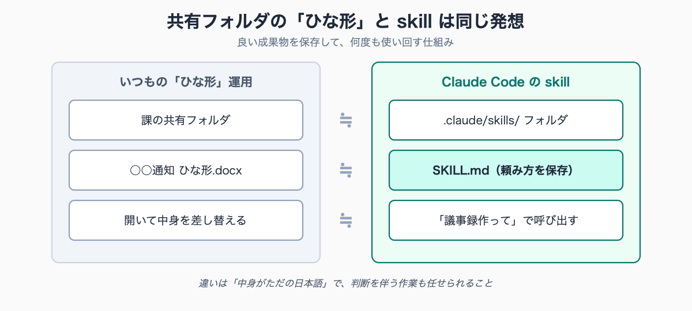
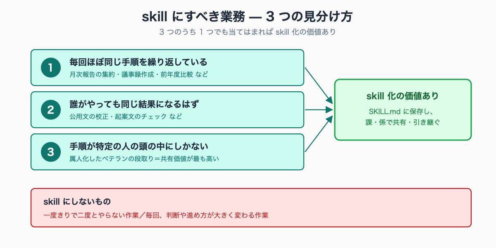

# .claude/skills 入門 — 一度うまくいった頼み方を職場の資産にする

## はじめに — 「同じ頼み方を毎回書く」のをやめる

前の記事 [#31 Claude Code への頼み方](../31-claude-code-how-to-ask/draft.md) で、5 つの欄（役割・入力・成果物・制約・確認）を埋める「効くプロンプトの型」を紹介しました。

実際に使い始めると、すぐにある不満にぶつかります。

議事録を作るたびに、あの長いプロンプトをコピペして日付だけ書き換える。前回どこに保存したか探す。隣の席の同僚に「あれ、どう頼んだら良かったんだっけ」と聞かれて、また同じ説明をする——。

**せっかく見つけた「良い頼み方」が、毎回ゼロから組み立て直す使い捨てになっている**。これは Excel でいえば、毎回まっさらのシートに同じ計算式を手入力しているようなものです。

Claude Code には、この無駄をなくす仕組みがあります。それが「skill（スキル）」です。本記事は、専門知識ゼロから skill の考え方を理解し、最初の 1 個を作るところまでを解説します。

**こんな方に向けた記事です**

- 良い頼み方を見つけたのに、毎回コピペで書き直す使い捨てになっている自治体職員
- 議事録や公用文校正など、定型業務の頼み方を保存して使い回したい方
- ベテランの属人化した段取りを、読めて引き継げる形で職場に残したい方

この記事を読み終えると、次のことがわかります。

- skill とは何か（Excel マクロや文書のひな形との違い）
- どんな業務を skill にすべきか、その見分け方
- 最小の SKILL.md ファイルの作り方（Claude Code 自身に作らせる方法も）
- 個人の skill を、課・係の引き継ぎ資産に変える考え方と注意点

執筆者は元自治体職員です。現在は Claude Code を使い、47 都道府県の統計サイト stats47.jp（約 2,000 のランキングを毎日自動更新）を個人で開発・運用しています。毎日の更新作業が回っているのは、頼み方を一つひとつ skill として保存し、使い回しているからです。

## skill とは — 「良い頼み方に名前をつけて保存する」

skill をひとことで言うと、「一度うまくいったプロンプト（頼み方）を保存して、名前で呼び出せるようにしたもの」 です。

公務員の仕事に引きつけると、いちばん近いのは 「課の共有フォルダにある『○○通知 ひな形.docx』」 です。

通知文を毎回白紙から書く人はいません。誰かが作った出来の良いひな形を共有フォルダに置き、それを開いて中身を差し替える。skill はこれの「頼み方版」です。出来の良いプロンプトをファイルに保存しておき、必要なときに呼び出して使います。

仕組みはとてもシンプルです。Claude Code は、あなたの PC の `.claude/skills/` というフォルダの中を見ています。そこに

```
.claude/skills/議事録作成/SKILL.md
```

というテキストファイルを置いておくと、Claude Code に「議事録作成して」と頼んだとき、あるいは `/議事録作成` と打ったときに、**そのファイルに書いた頼み方を自動で読み込んで実行**してくれます。


<!-- SVG: structure | 共有フォルダのひな形と skill の対応 -->

Excel のマクロと似ていますが、決定的に違う点が 2 つあります。

- **中身がただの日本語**。マクロのようなプログラミング言語ではなく、前の記事で書いた「引き継ぎメモ」そのものを書きます。読めるし、直せます
- **手順だけでなく判断も任せられる**。マクロは決められた操作を機械的に繰り返すだけですが、skill は「議題ごとに決定事項を整理する」のような、その都度の判断を含む作業も任せられます

つまり skill は「**プログラミング不要で作れる、賢い業務マニュアル**」です。

## 何を skill にすべきか — 3 つの見分け方

すべての作業を skill にする必要はありません。skill にして効果が大きいのは、次の 3 つの特徴を持つ業務です。


<!-- SVG: structure | skill にすべき業務の判定フロー -->

**見分け方 1: 毎回ほぼ同じ手順を繰り返している**
月次報告の集約、議事録作成、前年度比較。「またこれか」と感じる定型業務は、第一候補です。

**見分け方 2: 誰がやっても同じ結果になるはず**
公用文の校正、起案文のチェック。担当者の個性ではなく、ルールに沿って処理すべき作業。これを skill にすると、人によるばらつきがなくなります。

**見分け方 3: 手順が「特定の人の頭の中」にしかない**
「あの予算資料の作り方は係長級の A さんしかわからない」。この属人化した段取りこそ、skill にして組織で共有する価値が最も高いものです。A さんの頭の中を、読めるテキストに移します。

逆に、**skill にしないほうがよい**作業もあります。

- 一度きりで、二度とやらない作業（その場でプロンプトを書けば十分）
- 毎回、状況に応じて判断や進め方が大きく変わる作業（型にはめると逆に窮屈になる）

迷ったときの目安は「**この頼み方、来月もまた使うか？**」。答えが「使う」なら skill にする価値があります。

## 最小の SKILL.md を作ってみる

実際に作ってみます。題材は、前の記事で完成させた議事録作成のプロンプトです。

skill は、次の場所にテキストファイルを置くだけで作れます。

```
.claude/skills/議事録作成/SKILL.md
```

`SKILL.md` の中身は、次のような構成です。

```markdown
---
name: 議事録作成
description: 会議の音声ファイルから公用文体の議事録を作成する。「議事録を作って」と頼まれたら使う。
---

# 議事録作成

あなたは総務課の議事録作成担当です。
指定された音声ファイルを文字起こしし、議事録を作成してください。

## 成果物
- 音声ファイルと同じフォルダに「議事録-（日付）.docx」として保存
- 構成は「日時・出席者」「議題ごとの決定事項」「保留・宿題事項」「次回までの担当者」
- 文体は公用文（ですます調・簡潔に）

## 制約
- 音声に住民の氏名・住所など個人情報が含まれていた場合は、
  該当箇所を伏せ字にしたうえで作業を止め、報告してください
- 聞き取れなかった箇所は推測で埋めず「（聞き取り不明）」と明記してください

## 確認
- どの音声ファイルを使うか不明な場合は、作業前に質問してください
- 出席者名が判別できない場合も、作業前に質問してください
```

ファイルの先頭、`---` で挟まれた 2 行（`name` と `description`）が最も重要です。特に `description` は、Claude Code が「どんなときにこの skill を使えばいいか」を判断する手がかりになります。「○○を頼まれたら使う」と、使いどころを具体的に書くのがコツです。

本文は、前の記事で作ったプロンプトをほぼそのまま貼り付けただけです。違うのは、日付やファイル名のような毎回変わる部分を「指定された音声ファイル」「（日付）」のように **空欄化**してある点。これで、呼び出すたびに違う会議に使い回せます。

こうして skill を作っておけば、次回からは長いプロンプトを打つ必要はありません。

```
desktop/2026-06-10-課内会議.mp3 で議事録作成して
```

これだけで、保存しておいた頼み方のすべて（成果物の様式・守秘の指示・確認のルール）が自動的に適用されます。

**いちばん簡単な作り方 — Claude Code 自身に作らせる**

ここまで「ファイルを置く」と説明しましたが、実は手作業でファイルを作る必要すらありません。**良い結果が出たプロンプトの直後に、こう頼むのが最速**です。

```
今うまくいった頼み方を、議事録作成という名前の skill にして保存して。
日付やファイル名のような毎回変わる部分は空欄にしておいて。
```

Claude Code が `.claude/skills/議事録作成/SKILL.md` を自分で作成します。あなたは出来上がったファイルを開いて中身を確認するだけ。「頼み方を覚えれば専門的な部分は AI がやってくれる」——skill 作りそのものにも、この原則がそのまま当てはまります。

## 個人の skill から、課・係の資産へ

skill の本当の価値は、ここから先にあります。

`SKILL.md` は、特別なソフトを必要としない **ただのテキストファイル**です。ということは、

- 共有フォルダに置けば、係のメンバー全員が同じ skill を使える
- メールに添付して渡せる
- 異動のとき、引き継ぎ書類の一部として残せる

「議会答弁のまとめ方は前任の B さんが全部覚えていた」「あの集計のコツは A さんの暗黙知」——自治体の属人化問題に、skill は現実的な解を与えます。**ベテランの段取りを、読めて・直せて・引き継げるテキストに変換する**わけです。

新採用職員にとっても、手本となる skill が共有フォルダにあれば、それを読むだけで「この課ではこういう品質・様式が求められる」が一目でわかります。

ただし、公務員が skill を共有するときは **1 つだけ厳守すべき注意点**があります。

> **skill には「手順」だけを書く。実際のデータ（個人情報・決裁前資料）は絶対に書き込まない。**

skill はあくまで「やり方の説明書」です。「この音声ファイルを文字起こしして」という手順は書いてよいが、「○○さん（住民）の相談記録」のような中身を SKILL.md に貼り付けてはいけません。ひな形と、ひな形に流し込むデータは別物——これは公用文のひな形管理と同じ感覚です。

守秘の設定面の詳細は [#10 個人情報を送らない設定](../10-ai-without-personal-info/draft.md) を参照してください。

## よくある詰まりどころ Q&A

**Q. プログラミングの知識は本当にいらない？**
いりません。SKILL.md の中身は日本語の「頼み方」です。読めれば直せます。`---` の囲みなど形式的な部分も、Claude Code 自身に作らせれば気にする必要はありません。

**Q. skill はいくつまで作れる？**
実用上、上限を気にする必要はありません。ただし最初から大量に作らず、「毎月使うとわかった頼み方」だけを 1 個ずつ skill 化していくのが、結局いちばん長続きします。

**Q. 作った skill を後から直したくなったら？**
`SKILL.md` をテキストエディタで開いて書き換えるだけです。ひな形 docx を修正するのと同じ感覚で構いません。

**Q. もっと複雑なこと（複数の作業を順に実行、庁内システムとの連携）もできる？**
できます。本記事は「最初の 1 個」を対象にした入門です。定型業務をまとめて 1 コマンド化する設計や、庁内システムとの連携は、応用編の記事で扱います（下記リンク）。


---

💡 **この記事を書いた私から、Claude Code 学習でひとつだけご紹介させてください（PR）**

この記事を読んでいる方は、Claude Code を業務に取り入れようとしているか、すでに使い始めているのだと思います。

独学でも十分に使えますが、「もっと体系的に学びたい」「詰まったときにすぐサポートを受けたい」という方には、Claude Code に特化した研修プログラムも選択肢のひとつです。

このリンクから申し込んでいただくと、私に紹介料が入ります。それでもお伝えするのは、Claude Code を業務で使いこなしたいすべての方に本当に役立つと思っているからです。

{{AFFILIATE_BANNER:ai_agent_camp}}

▶ Claude Code 特化研修「AI Agent Camp」の詳細はこちら（無料相談あり）

---

## まとめ — 頼み方を「資産」に変える

- skill とは「良い頼み方に名前をつけて保存したもの」。共有フォルダのひな形の頼み方版
- skill にすべきは「毎回繰り返す」「誰がやっても同じはず」「特定の人しか知らない」業務
- SKILL.md はただのテキスト。Claude Code 自身に作らせるのが最速
- 共有・引き継ぎが容易。ただし skill には手順だけを書き、データは絶対に書かない

[#31 頼み方](../31-claude-code-how-to-ask/draft.md) で「良い頼み方」を覚え、本記事で「それを保存する」ところまで来ました。この 2 つが、Claude Code を業務で使いこなすための土台です。あとは、関心のある業務の記事を選んで応用していくだけです。

**次に読むなら**

- [#07 公文書ライティングを校正させる .claude/skills 完全版](../07-official-doc-skills/draft.md) — 公用文校正の skill を、コピペできる完成形で
- [#22 .claude/skills で「毎月の定型業務」を 1 コマンド化する](../22-monthly-routine-skills/draft.md) — 複数手順をまとめた実務 skill の設計
- [#23 MCP で庁内システムとつなぐ](../23-mcp-internal-system/draft.md) — skill の先、外部システム連携へ

まだ Claude Code を動かす環境がない方は [#01 環境構築完全版](../01-claude-code-setup-complete/draft.md) からどうぞ。

<!-- circulation-footer:v2 -->

---

## 「公務員 × Claude Code」シリーズ

本記事は、自治体職員が Claude Code を日々の業務に活かすための全 33 本シリーズの 1 本です。環境構築・議事録・議会答弁・セキュリティ・データ活用・組織導入まで、関心のあるテーマから読み進められます。

シリーズの全記事はマガジンにまとめています。他の記事はこちらからどうぞ。

https://note.com/stats47/m/m512ad7023815

Claude Code に触れるのが初めての方は、まず導入記事「Claude Code とは何か — ターミナル未経験の公務員のための導入ガイド」から読むのがおすすめです。
