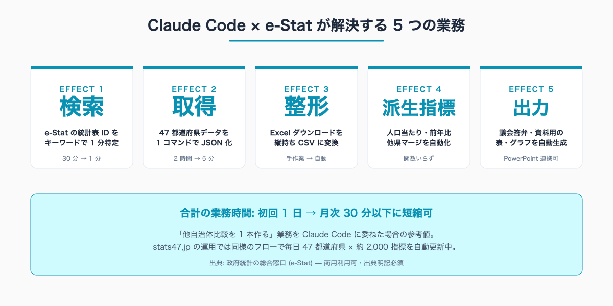
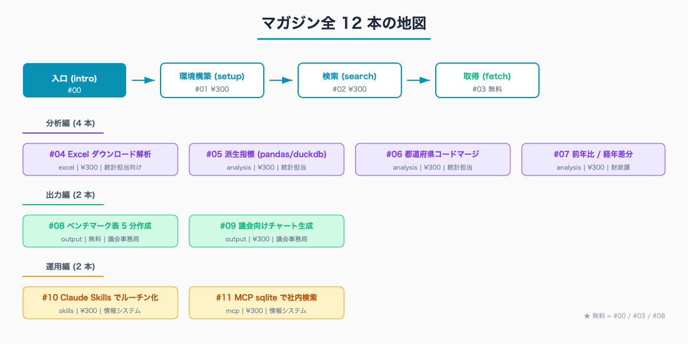

# e-Stat × Claude Code とは — 自治体職員のための統計データ業務効率化ガイド

## はじめに

「県内 20 市町と人口当たり指標を比較する資料を、明日の課内会議までに出してほしい」「議会の一般質問で『他県と比べてうちはどうなのか』と聞かれそうなので、47 都道府県ランキングを 1 枚にまとめてほしい」——自治体の企画課・統計担当・財政課・議会事務局では、この手の依頼が突発的に降ってくる。多くの場合、Excel ファイルを e-Stat から個別にダウンロードし、シートを並べ、関数を組み、グラフを貼り直す業務に半日から 1 日が消える。

本記事は、政府統計の総合窓口 (e-Stat) と AI コーディング環境「Claude Code」を組み合わせると、その業務が「コマンド 1 本 + 5 分のレビュー」に変わる、という入口の話を扱う。執筆者は元自治体職員。現在は Claude Code で 47 都道府県の統計サイト stats47.jp (約 2,000 のランキングを毎日自動更新) を個人で開発・運用している。本マガジンで紹介する手順は、その実運用で日々動いているフローを公務員業務向けに切り出したものになっている。

ターミナル経験はなくても読めるよう配慮した。Claude Code の最大の特徴は「コマンドを暗記しなくても、日本語で頼めば必要なコマンドや設定を AI 側が用意してくれる」点にあり、本マガジンに登場するコード例も「丸暗記の対象」ではなく「こう頼めば、こういうものが返ってくる」という地図として読んでよい。

人口 10-30 万人規模の自治体では、企画課・統計担当の係長級職員 1 人が、他自治体比較・議会答弁・補助金申請の根拠データ作成などで **月 20-40 時間程度** を e-Stat とその後処理に費やしている例が珍しくない。総務省統計局も「統計データの利活用が地方公共団体の重要課題」と繰り返し位置付けており (出典: 統計改革推進会議 最終取りまとめ 等)、業務時間の圧縮余地は大きい。

## TL;DR

- e-Stat の 47 都道府県データを「探す → 中身を把握する → 取得する → 整形する → 出力する」の 5 段階すべてを Claude Code で自動化できる
- 「他自治体比較を 1 本作る」業務は、初回 1 日 → 月次運用 30 分以下に短縮可
- 本マガジン全 12 本のうち、入口 (#00) / 取得 (#03) / ベンチマーク表作成 (#08) の 3 本は無料公開
- e-Stat は商用利用可・出典明記必須。庁内資料・対外説明資料への流用は問題ない (出典: e-Stat 利用規約)
- 必要なのは API キー 1 個 (即時発行・無料) と Claude Code (Pro 契約) のみ
- stats47.jp は本マガジン記載のフローで毎日 47 都道府県 × 約 2,000 指標を自動更新している実例


<!-- SVG: infographic | 5 つの効能カード + 合計時短サマリ -->

## 背景: なぜ自治体職員にこの課題があるか

民間企業と自治体では、データを扱う構造そのものが違う。

民間企業では、業務システム・販売管理・顧客管理は通常 1 つのデータベースに集約され、BI ツール (Tableau / Looker / Power BI 等) から SQL で集計できる。一方、自治体では財務会計・住民記録・税務・福祉などの基幹システムはベンダーが分かれ、職員からは直接 SQL で触れない設計が一般的だ。そのため「他自治体と比較する」「全国順位を出す」といった分析は、e-Stat や統計年鑑などの外部公開データに頼らざるを得ない。

そして e-Stat の使い勝手には独特のクセがある。

- **統計表 ID (statsDataId) を特定するまでが難しい**: 同じ「人口」でも「国勢調査」「人口推計」「住民基本台帳」で別の表になる
- **Excel ダウンロードは「横持ち」がデフォルト**: 都道府県別データが 47 列で並び、そのままでは集計関数が組みづらい
- **年度コードが調査ごとに違う**: `2024000000` 形式・`2024100000` 形式・西暦のみなど不揃い
- **2 桁地域コードと 5 桁地域コードが混在**: 北海道は `01` でも `01000` でもヒットする

加えて、自治体特有の「属人化」「人事異動でリセットされるノウハウ」が重なる。前任者が組んだ Excel マクロは引き継がれず、後任は毎月手作業に戻る——統計担当の現場でよく聞く話だ。

Claude Code は、この「e-Stat の癖を覚える + 後処理を毎回手作業でやる」という人間側の負担を、AI 側に肩代わりさせるアプローチを取る。e-Stat の利用規約は商用利用可・出典明記必須 (政府統計の総合窓口 e-Stat 利用規約) であり、庁内資料・対外説明資料・補助金申請書への流用に法的な問題はない。

## Claude Code に e-Stat を任せると変わる 5 つの業務

本マガジンが扱う効能は大きく 5 つにまとめられる。

### 効能 1: 統計表を「探す」

e-Stat の検索 UI は「調査名 → 統計表名 → 表番号」の 3 階層で構成され、初見ではどこをクリックすれば目的のデータに辿り着くのか分かりづらい。Claude Code には `/search-estat` という独自スキルが用意されており、自然言語のキーワードから statsDataId を 1 分で特定できる。

```
/search-estat 待機児童
```

これで「待機児童数」を含む統計表が候補として一覧表示され、各表の調査年・所管省庁・更新日が即座にわかる。詳細は #02 で扱う。

### 効能 2: 47 都道府県データを「取得」

statsDataId が決まれば、`/fetch-estat-data` で 47 都道府県の値を 1 コマンドで JSON / CSV に落とせる。stats47.jp の運用では同じフローで `/ranking/population` (人口)・`/ranking/annual-income-per-household` (世帯当たり年収)・`/ranking/day-time-population` (昼間人口) など約 2,000 のランキングを毎日更新している。詳細は #03 (無料) で扱う。

### 効能 3: Excel ダウンロードを「整形」

e-Stat には API 未公開の調査もあり、その場合は Excel ダウンロード経由になる。横持ちの Excel を縦持ち CSV (都道府県・年・指標値の 3 カラム) に変換する処理は、Claude Code に頼めば 1 度の指示で再利用可能なスクリプトを書いてくれる。詳細は #04 で扱う。

### 効能 4: 「派生指標」を自動計算

取得した生データを、人口当たり / 面積当たり / 前年比 / 他指標との比などに加工する作業も Claude Code が引き受ける。Excel の VLOOKUP / INDEX-MATCH を自前で組まなくても、「人口当たり医師数を出して」と頼めば pandas や duckdb のコードに変換してくれる。stats47.jp の「介護職年収」(`/ranking/care-worker-annual-income`) なども、原データと労働力人口の組み合わせで派生指標として計算している。詳細は #05〜#07 で扱う。

### 効能 5: 議会・庁内資料用の「出力」

最終的な成果物——47 都道府県のベンチマーク表、上位 10 県を強調したランキング図、前年比の二軸チャートなど——も Claude Code から SVG / PNG / Excel の各形式で出力できる。議会答弁の参考資料や、首長レク用のサマリ 1 枚を 5 分で作る使い方は #08 (無料) と #09 で扱う。

## マガジン全 12 本の地図

12 本は「入口 → 環境構築 → 検索 → 取得 → 分析 → 出力 → 運用」の順に並んでいる。担当業務ごとにどの記事を読めばよいかを地図にまとめた。


<!-- SVG: structure | 12 本の構成と読書順 -->

ペルソナ別の推奨パスは以下の通り。

| ペルソナ | 主要な課題 | 主に読むべき記事 |
|---|---|---|
| 企画課・政策担当 | 他自治体比較資料 / 政策エビデンス | #00 → #02 → #08 → #09 |
| 統計担当 | e-Stat → Excel → 集計の属人化 | #00 → #01 → #03 → #04 → #05 → #06 → #07 |
| 議会事務局 | 答弁資料の図表作成 | #00 → #03 → #08 → #09 |
| 財政課 | 補助金申請の裏付けデータ | #00 → #04 → #05 → #07 |
| 情報システム | 月次定型集計の自動化 | #00 → #10 → #11 |

最短ルートとしては、まず無料 3 本 (#00 / #03 / #08) を通しで読み、効能の感触をつかんでから有料 9 本に進む形が想定されている。マガジン買い切り (¥1,480) なら、個別購入 (¥300 × 9 = ¥2,700) より約 46% 安くなる。

## ターミナル経験がなくても読める理由

「コマンドラインに触れたことがない」「Excel と Word しか使ったことがない」職員にも、本マガジンは届くように書いている。理由は 3 つ。

第 1 に、Claude Code は **自然言語 (日本語) を主インターフェース** にしている。`/search-estat 待機児童` のような slash command は内部で「Claude にこう頼む」のテンプレが走っているだけで、深く知らなくても結果は返ってくる。

第 2 に、本マガジンの全コード例は **コピペで動く** ことを最優先にしている。意味を 100% 理解しなくても、まずは動かしてみれば結果が出る。意味は徐々に Claude に質問しながら覚えればよい。

第 3 に、**動かなかったときの典型エラー** を各記事の末尾に「よくあるつまずきと回避策」として網羅した。庁内ネットワークのプロキシ問題、API キー設定漏れ、文字化けなど、現場で実際に出るエラーへの対処を載せてある。

## 「Claude Code は何ができないか」も書いておく

過剰に持ち上げると現場での失望を招くので、限界も明示する。

- **e-Stat に登録されていないデータ** は取れない (例: 自治体内部の人事データ、補助金交付実績の生データ)
- **個人情報・特定個人情報・決裁前の検討資料** は Claude に投げてはいけない。本マガジンの全記事は「e-Stat の公開データ + 公開済み統計年鑑」を対象範囲とする
- **数値の最終確認は人間が必要**。Claude Code は出典 URL を明示するが、それを開いて値を照合するのは職員の業務として残る
- **長期間の運用には Claude Code Pro の契約 (月額) が必要**。試用であれば無料枠でも動く

これらの制約を踏まえても、月 20-40 時間の e-Stat 周辺業務が月 数時間 まで圧縮できる効果は大きい。

## stats47.jp で実運用されている統計データの例

本マガジンの手順が「研究室レベルの話」ではなく「現実に毎日動いているフロー」であることを示すため、stats47.jp で公開している統計の一部を挙げる。すべて e-Stat 由来のデータで、Claude Code 経由で取得・整形・公開している。

- 人口 (国勢調査ベース): https://stats47.jp/ranking/population
- 世帯当たり年収 (家計調査ベース): https://stats47.jp/ranking/annual-income-per-household
- 介護職年収 (賃金構造基本統計調査ベース): https://stats47.jp/ranking/care-worker-annual-income
- 昼間人口 (国勢調査ベース): https://stats47.jp/ranking/day-time-population
- 入港船舶総トン数 (港湾統計): 神奈川を 1 位とし最下位と 124 倍の格差がある

stats47.jp は約 2,000 のランキングを毎日自動更新している。本マガジンの #10 (Claude Skills でルーチン化) では、この「毎日自動更新」を実現する Claude Skills の組み立て方を扱う。

## 次に読むべき記事

入口を読み終えたら、最短は次の 2 本になる。

- 環境構築から始める: [#01 e-Stat API キー取得から Claude Code 連携まで](../01-estat-api-key-setup/draft.md)
- まず動く例を見たい: [#03 47 都道府県ランキングを 1 コマンドで取得する](../03-fetch-prefecture-ranking/draft.md) (無料)

検索の癖を先につかみたい場合は [#02 e-Stat の統計表 ID を最短で特定する](../02-search-estat-statsdataid/draft.md) も並行で読める。

## まとめ

本記事の要点は以下の 3 つに集約される。

1. e-Stat の 47 都道府県データに対する「検索・取得・整形・派生指標・出力」の 5 業務を、Claude Code は 1 つのターミナルで完結させる
2. 結果として、自治体職員が月 20-40 時間かけていた e-Stat 周辺業務を、月 数時間 まで圧縮できる
3. 本マガジン全 12 本は、その手順を担当業務ごとに分割したガイドであり、無料 3 本だけでも実務効果は得られる

「依頼が来てから慌てて Excel を開く」状態から、「依頼が来たら 5 分で 47 都道府県データを返せる」状態への移行を、12 本かけて段階的に組み立てていく。

<!-- circulation-footer:v2 -->

## このシリーズについて

「公務員のための e-Stat × Claude Code 実務ガイド」全 12 本のシリーズ第 00 回。e-Stat 業務の効率化に関心がある方は、マガジン購読がお得です。

▶️ マガジン: 公務員のための e-Stat × Claude Code 実務ガイド
🔗 https://note.com/stats47/m/m1b836e4c8dce

姉妹マガジン「公務員 × Claude Code 実務活用ガイド (全 33 本)」では議事録・議会答弁・条例レビューなど統計以外の業務効率化を扱っています。

▶️ stats47.jp: 本記事で紹介した手順で運用している 47 都道府県統計サイト (約 2,000 のランキングを毎日自動更新)。動いている実例として参考にどうぞ。
🔗 https://stats47.jp
