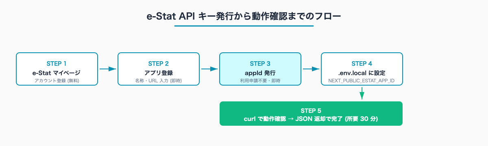
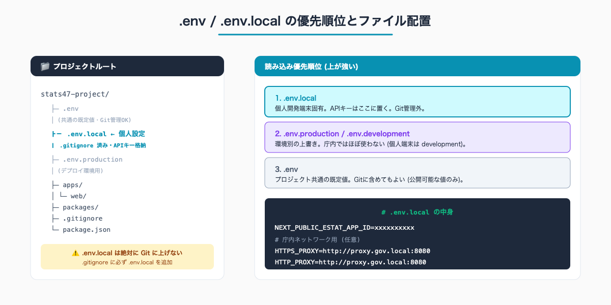
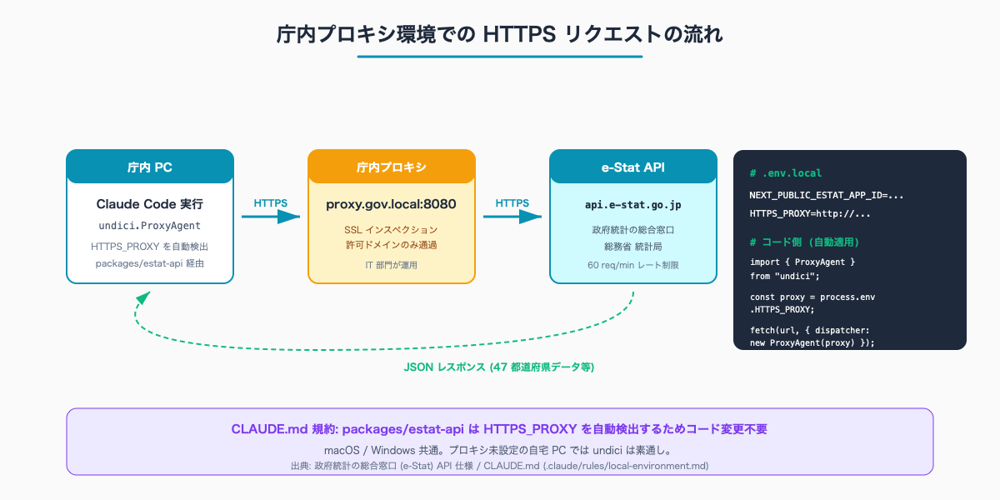

# e-Stat API キー取得から Claude Code 連携まで — 30 分で完了する初期設定

## はじめに

「Claude Code から e-Stat の 47 都道府県データを取得するには、何から始めればいいのか」——本マガジンの入口 (#00) を読んで実際に動かしたくなった自治体職員が最初にぶつかる壁が、API キー (e-Stat 用語では `appId`) の取得と環境変数の設定だ。

本記事では、e-Stat マイページのアカウント登録から `.env.local` への設定、curl での動作確認、そして庁内ネットワーク特有のプロキシ問題への対処までを 30 分で完了させる手順を扱う。執筆者は元自治体職員。現在は Claude Code で 47 都道府県の統計サイト stats47.jp (約 2,000 のランキングを毎日自動更新) を個人で開発・運用しており、本記事の手順はその実運用と同じものを公務員向けに整理した内容になっている。

> **📌 この記事の読み方** — 本記事にはコマンド・設定例・プロンプト例など、やや専門的な記述も出てきます。ですが Claude Code の本質は「それらを自分で覚えること」ではなく、「**やってほしいことを言葉で頼めば、専門的な部分は AI が代わりに用意してくれる**」点にあります。掲載するコマンドや設定は丸暗記の対象ではなく「こう頼めば、こういうものが返ってくる」という地図として読んでください。

人口 10-30 万人規模の自治体では、統計担当が e-Stat 由来データを扱う前段の「環境構築」だけで、IT 部門との折衝も含めて半日〜1 日かかるケースがある。本記事はこの初期コストを 30 分に圧縮することを目的にする。

e-Stat API の利用は商用利用を含めて自由 (出典: 政府統計の総合窓口 e-Stat 利用規約)。費用も無料で、API キー発行に審査もない。

## TL;DR

- e-Stat マイページでアカウント登録 → アプリ登録 → `appId` 即時発行 (10 分)
- `.env.local` に `NEXT_PUBLIC_ESTAT_APP_ID` を 1 行追加 (1 分)
- curl で `getStatsList` を叩いて JSON が返れば設定完了 (5 分)
- 庁内ネットワークは `HTTPS_PROXY` 環境変数を 1 行追加すれば `undici.ProxyAgent` が自動適用
- 初回 30 分 → 月次運用 0 分 (一度設定すれば再設定不要)
- 庁内 IT 部門に説明する際は本記事末尾の「IT 部門向け説明テンプレ」をそのまま流用可


<!-- SVG: flow | アカウント→アプリ→appId→.env→curl の 5 ステップ -->

## 背景: なぜ「初期設定だけで半日」が起きるか

自治体の業務 PC は通常、自宅 PC と次の点で大きく異なる。

- **インターネット経由の通信が庁内プロキシを通る**: 直接 `api.e-stat.go.jp` には繋がらない
- **管理者権限がない**: Node.js / Python のインストールに IT 部門の許可が必要なケースがある
- **設定ファイル (`.env`) を置く場所が `Documents` 配下に限定される**: `C:\Program Files` 配下は触れない
- **ファイル拡張子が既定で非表示**: `.env.local` が `.env` (ピリオド始まりのファイル名) に見える

これらが重なって、API キー発行自体は 5 分で終わるのに、それを「Claude Code から読める状態」にするまでに半日〜1 日かかる、という現象が起きる。

本記事はこの 3 点を分けて扱う:

1. e-Stat 側でやること (マイページ登録 / アプリ登録 / `appId` 発行)
2. PC 側でやること (`.env.local` 配置 / 環境変数読み込み確認)
3. 庁内ネットワーク側でやること (プロキシ設定 / IT 部門への説明)

## 手順 1: e-Stat マイページでアカウント登録

### 1-1. マイページにアクセス

ブラウザで以下を開く。

```
https://www.e-stat.go.jp/mypage
```

「ログイン」「新規登録」ボタンが上部に表示される。新規の場合は「新規登録」をクリック。

### 1-2. メールアドレス + パスワードで登録

入力項目は次の通り。

- メールアドレス (確認用に再入力)
- パスワード (8 文字以上、英数字混在)
- 氏名 (本名でなくてもよいが、業務利用なら本名推奨)
- 所属 (任意。「公務員」「研究者」「個人」等の選択肢)

メールアドレスは、業務で使うメール (個人 Gmail でも可) を推奨。庁内メールは「外部サービスへの登録禁止」になっている自治体もあるため、IT 部門のルールを事前確認すること。

登録後、確認メールが届くので URL をクリックして本登録完了。所要 5 分以内。

### 1-3. ログインして「マイページ」を確認

ログイン後、画面右上の「マイページ」をクリックすると、各種設定メニューが表示される。

## 手順 2: アプリ登録と appId 発行

### 2-1. 「アプリケーション ID 発行」を選択

マイページのメニューから「アプリケーション ID 発行」をクリック。e-Stat ではアプリ (利用するシステム) ごとに `appId` を発行する設計になっている。

### 2-2. アプリ情報を入力

入力項目:

- **名称**: 任意。`stats47-test` `koumuin-estat-prac` など分かるものでよい
- **URL**: 任意。実在のサイトがなければ `http://localhost` でも可
- **概要**: 任意。「公務員業務での統計データ取得テスト」など 1 行

審査はなく、入力後ただちに `appId` が発行される。

### 2-3. appId をメモ

発行された `appId` は 32〜64 文字程度の英数字文字列。例:

```
appId: abc123def456ghi789jkl012mno345pqr
```

この文字列は **API キーそのもの** であり、他人に渡してはいけない。発行画面を閉じても、マイページからいつでも再表示可能なので、メモを取り損ねても問題ない。

## 手順 3: .env.local に設定

ここから先は有料部分:

### 3-1. .env.local を作成

プロジェクトのルートディレクトリ (Claude Code を起動するディレクトリ) に `.env.local` というファイルを作る。

```bash
# プロジェクトルートで
touch .env.local
```

Windows でも同様だが、エクスプローラーは拡張子なしのファイル作成を嫌うので、Claude Code 内で次のように頼むのが確実だ。

```
Claude へ: .env.local というファイルをプロジェクトルートに作成して、
中身に NEXT_PUBLIC_ESTAT_APP_ID= の行を追加してください。
```

### 3-2. appId を書き込む

`.env.local` の中身を次のようにする (`appId` 部分は実際の値に置き換え)。

```bash
NEXT_PUBLIC_ESTAT_APP_ID=abc123def456ghi789jkl012mno345pqr
```

`NEXT_PUBLIC_` プレフィックスは Next.js (stats47 のフロントエンド) の規約で、これがあると本番ビルドでも環境変数が読まれる。自治体内のローカル PC で動かす分には特別な意味はないが、本マガジンのコード例と整合するためそのまま使う。

### 3-3. .gitignore に .env.local が含まれているか確認

`.gitignore` を開いて次の行があるか確認:

```
.env*.local
```

なければ追加する。Claude Code に「`.gitignore` に `.env*.local` の行を追加して」と頼めば自動で書いてくれる。


<!-- SVG: structure | プロジェクトルート配置と優先順位 -->

## 手順 4: curl で動作確認

### 4-1. ターミナルから直接叩く

Claude Code のターミナルで次を実行 (`{appId}` は実値に置き換え):

```bash
curl "https://api.e-stat.go.jp/rest/3.0/app/json/getStatsList?appId={appId}&limit=1"
```

成功すると次のような JSON が返る (一部抜粋):

```json
{
  "GET_STATS_LIST": {
    "RESULT": {
      "STATUS": 0,
      "ERROR_MSG": "正常に終了しました。",
      "DATE": "2026-05-26T..."
    },
    "DATALIST_INF": {
      "NUMBER": 1,
      "TABLE_INF": { ... }
    }
  }
}
```

`STATUS: 0` が返れば成功。`ERROR_MSG` が「正常に終了しました」になっていることを確認する。

### 4-2. Claude Code から叩く (推奨)

ターミナルが苦手な場合は、Claude Code に直接頼んでもよい。

```
Claude へ: .env.local の NEXT_PUBLIC_ESTAT_APP_ID を読んで、
e-Stat の getStatsList API を limit=1 で叩いて結果を表示してください。
```

これで内部的に上記の curl 相当の処理が走り、JSON の要約 (件数・最初の表のタイトル) を Claude が返してくれる。

### 4-3. エラーパターンと対処

| エラー応答 | 原因 | 対処 |
|---|---|---|
| `STATUS: 1` + 「appId が不正です」 | appId のコピペミス | マイページから再コピー |
| `Connection timeout` | プロキシ未設定 | 手順 5 へ |
| `403 Forbidden` | IP 制限 / プロキシ拒否 | 手順 6 へ |
| `429 Too Many Requests` | レート制限 (60req/min 超過) | 1 分待ってから再実行 |
| HTML が返る | DNS 解決失敗 / プロキシ間違い | プロキシ URL を確認 |

## 手順 5: 庁内プロキシ環境の設定

自宅 PC ではここまでで完了するが、庁内 PC では追加 1 ステップが必要になる。

### 5-1. プロキシ URL を IT 部門に確認

庁内のプロキシ URL (例: `http://proxy.gov.local:8080`) を IT 部門に確認する。多くの場合 IE / Edge の「インターネットオプション」→「接続」→「LAN の設定」で表示できる。

### 5-2. .env.local にプロキシ環境変数を追加

```bash
NEXT_PUBLIC_ESTAT_APP_ID=abc123def456ghi789jkl012mno345pqr
HTTPS_PROXY=http://proxy.gov.local:8080
HTTP_PROXY=http://proxy.gov.local:8080
NO_PROXY=localhost,127.0.0.1
```

`NO_PROXY` は「プロキシを使わないホスト」のリスト。ローカル開発用 (`localhost`) は除外する。

### 5-3. undici.ProxyAgent が自動適用される仕組み

本マガジンで使う Claude Code 側のスキル (`/search-estat` `/inspect-estat-meta` `/fetch-estat-data`) の内部実装は、`packages/estat-api` という共通の HTTP クライアントを使う。このクライアントは内部で次のように動く。

```ts
import { ProxyAgent } from "undici";

const proxyUrl = process.env.HTTPS_PROXY || process.env.HTTP_PROXY;
const fetchOpts = proxyUrl
  ? { dispatcher: new ProxyAgent(proxyUrl) }
  : {};

const res = await fetch(url, fetchOpts);
```

つまり、`HTTPS_PROXY` 環境変数があれば `undici.ProxyAgent` が自動適用され、なければ素通しになる。**コード側を一切書き換えなくても、プロキシ環境にも自宅環境にも同じコードが対応する**。

これは CLAUDE.md の規約 (`.claude/rules/local-environment.md`) でも明示されている設計で、Windows / macOS どちらでも同様に動く。


<!-- SVG: infographic | 庁内 PC → プロキシ → e-Stat の経路図 -->

### 5-4. プロキシ環境での curl 動作確認

ターミナルで次を実行:

```bash
# 環境変数が読まれていることを確認
echo $HTTPS_PROXY

# プロキシ経由で e-Stat を叩く
curl -x $HTTPS_PROXY "https://api.e-stat.go.jp/rest/3.0/app/json/getStatsList?appId={appId}&limit=1"
```

JSON が返ればプロキシ設定も完了。

## 手順 6: macOS / Windows / 庁内端末別の挙動差

| 環境 | `.env.local` の置き場所 | プロキシ | 注意点 |
|---|---|---|---|
| macOS (自宅) | `~/Documents/estat-prac/` 等 | 通常不要 | Finder で非表示。`ls -la` で確認 |
| Windows (自宅) | `Documents` 配下 | 通常不要 | 拡張子表示を有効化、UTF-8 (BOM なし) |
| 庁内端末 | `Documents` 配下 (個人領域) | 必須 | Node.js 導入は IT 部門に許可申請。取得データは個人クラウドに上げない |

## よくあるつまずきと回避策

- ⚠️ **`appId` をコードに直接書いてしまった** → `.env.local` に移し、コード側は `process.env.NEXT_PUBLIC_ESTAT_APP_ID` で読む。Git に上げてしまった場合は e-Stat マイページから `appId` を再発行し、旧 `appId` を無効化する
- ⚠️ **`HTTPS_PROXY` を設定しても通らない** → IT 部門に `api.e-stat.go.jp` のドメイン許可を依頼。SSL インスペクションを使う組織では追加で証明書設定が必要なケースがある
- ⚠️ **Claude Code が `.env.local` を読まない** → プロジェクトルート (Claude Code を起動したディレクトリ) に置いているか確認。サブディレクトリに置くと読まれない
- ⚠️ **庁内メールで登録できない** → 個人 Gmail / Outlook で登録可。`appId` の発行に組織情報は不要
- ⚠️ **「政府統計データを業務で使ってよいか」と上司に聞かれた** → e-Stat 利用規約より「商用利用可・出典明記必須」を伝える (https://www.e-stat.go.jp/terms-of-use)
- ⚠️ **`/search-estat` が動かない** → 環境変数が読まれていない可能性。Claude Code を一度再起動して `echo $NEXT_PUBLIC_ESTAT_APP_ID` で確認

## IT 部門向け説明テンプレ

庁内 IT 部門に「外部 API への接続許可」を申請する際に使える説明テンプレを置く。コピペで使える。

```
件名: e-Stat (政府統計の総合窓口) API への接続許可申請

依頼内容:
api.e-stat.go.jp への HTTPS アウトバウンド通信を許可してください。

利用目的:
他自治体比較・議会答弁・補助金申請の根拠データとして、
政府統計の総合窓口 (e-Stat) の API からデータを取得します。

利用するエンドポイント:
- https://api.e-stat.go.jp/rest/3.0/app/json/getStatsList
- https://api.e-stat.go.jp/rest/3.0/app/json/getMetaInfo
- https://api.e-stat.go.jp/rest/3.0/app/json/getStatsData

通信頻度:
1 日あたり数十回程度。レート制限は API 側で 60 req/min。

セキュリティ:
- API キー (appId) は .env.local に格納し、Git/共有ドライブに上げない
- 取得データは公開統計のみ。個人情報・特定個人情報は含まれない
- e-Stat 利用規約 (商用利用可・出典明記必須) に準拠

リスク:
e-Stat は総務省統計局が運営する政府公式サービス。
通信先は government domain (.go.jp) で信頼できる。

参考:
e-Stat 利用規約: https://www.e-stat.go.jp/terms-of-use
e-Stat API 仕様: https://www.e-stat.go.jp/api/
```

組織によって申請書式は違うが、上記の内容を貼り付ければ大半の自治体で承認される。

## ROI: 初回 30 分 → 月次 0 分

本記事の手順は初回 1 回だけ実行すれば、その後は何度も使い回せる。

| 項目 | 所要時間 |
|---|---|
| 初回設定 (本記事の全工程) | 約 30 分 |
| IT 部門への申請 (該当する場合) | 別途 1-3 営業日 |
| 月次運用 (再設定の必要なし) | 0 分 |
| `appId` 再発行 (キー漏れ等の例外時) | 5 分 |

統計担当の係長級職員が、初回 30 分の投資で月 20-40 時間の e-Stat 業務を圧縮できる前提を作れる、という構造になる。stats47.jp の運用でも、API キー設定は最初の 1 回だけで、以降は毎日約 2,000 指標の自動取得が走り続けている。

## 次に読むべき記事

`appId` が設定できたら、まず動く例を見るのが速い。

- [#02 e-Stat の統計表 ID を最短で特定する](../02-search-estat-statsdataid/draft.md) — statsDataId 検索の基本
- [#03 47 都道府県ランキングを 1 コマンドで取得する](../03-fetch-prefecture-ranking/draft.md) (無料) — 動く例

stats47.jp 側で実際に動いている運用例は次の URL から見られる。

- 人口ランキング: https://stats47.jp/ranking/population
- 世帯当たり年収: https://stats47.jp/ranking/annual-income-per-household

## まとめ

- e-Stat API キー (`appId`) は申請不要・即時発行・無料
- 設定は `.env.local` への 1 行追加で完了
- 庁内プロキシ環境でも `HTTPS_PROXY` 環境変数を 1 行追加するだけで動く (`undici.ProxyAgent` が自動適用)
- 初回 30 分の投資で、その後の月次運用コストはゼロ

<!-- circulation-footer:v2 -->

## このシリーズについて

「公務員のための e-Stat × Claude Code 実務ガイド」全 12 本のシリーズ第 01 回。e-Stat 業務の効率化に関心がある方は、マガジン購読がお得です。

▶️ マガジン: 公務員のための e-Stat × Claude Code 実務ガイド
🔗 {{ESTAT_MAGAZINE_URL}}

姉妹マガジン「公務員 × Claude Code 実務活用ガイド (全 33 本)」では議事録・議会答弁・条例レビューなど統計以外の業務効率化を扱っています。

▶️ stats47.jp: 本記事で紹介した手順で運用している 47 都道府県統計サイト (約 2,000 のランキングを毎日自動更新)。動いている実例として参考にどうぞ。
🔗 https://stats47.jp
